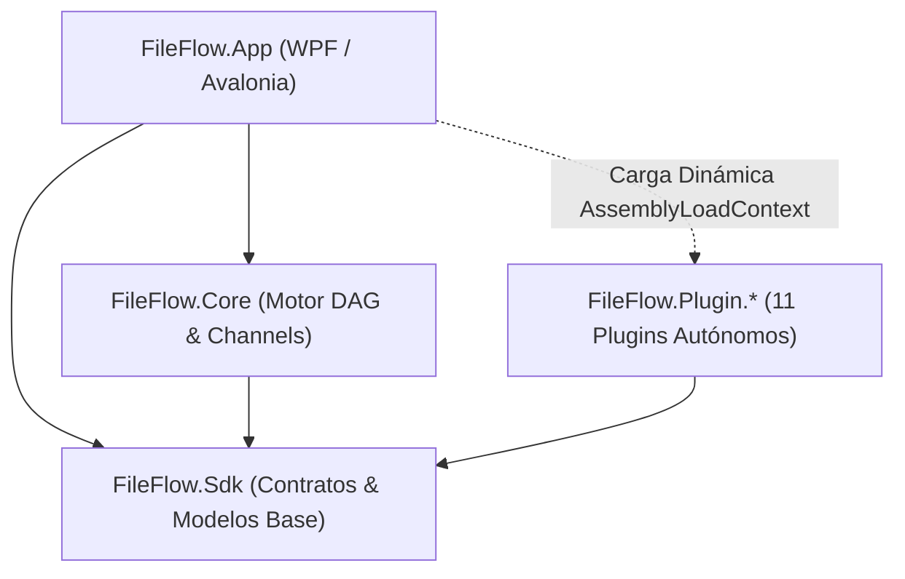

# Resumen Consolidado de Sesiones y Memoria de Proyecto - FileFlow Studio

Este documento se actualiza al finalizar cada sesión de trabajo para consolidar los puntos clave, decisiones arquitectónicas, capacidades del sistema y el estado de la solución, evitando empezar desde cero en futuras conversaciones.

> [!NOTE]
> **Historial Consolidado de Sesiones Anteriores**:
> La memoria histórica exhaustiva correspondiente a hitos anteriores (Hitos 1 a 69 y desarrollos fundacionales de 2025/2026) se encuentra preservada y archivada para optimización de contexto en:
> 📄 [**`.antigravity/knowledge/history/2026-09-13_session_summary_archive.md`**](file:///.antigravity/knowledge/history/2026-09-13_session_summary_archive.md)

---

## 1. Estado Actual del Repositorio y Calidad
- **Target Framework**: `.NET 9` (`net9.0` multiplataforma puro para todos los 14 proyectos, incluyendo `FileFlow.App`).
- **Lenguaje**: `C# 13` (`<LangVersion>13</LangVersion>`), Nullable activado de forma estricta (`<Nullable>enable</Nullable>`).
- **Framework de UI**: **Avalonia 12.1.2** con **FluentAvaloniaUI 2.2.0 (WinUI 3)**, **Nodify.Avalonia 2.0.0** y **Avalonia.AvaloniaEdit 12.0.0**.
- **Estado de Compilación**: `dotnet build FileFlow.slnx` $\rightarrow$ **0 Advertencias, 0 Errores**.
  - **94. Integración de SplashScreenWindow y Resolución de Bloqueo en Inicio**:
    - **Diagnóstico y Corrección de Crash Silencioso**: Identificada y corregida la excepción `KeyNotFoundException: Static resource 'BooleanToBrushConverter' not found` mediante la implementación de `BooleanToBrushConverter` en `BooleanConverters.cs` y su registro en `App.axaml`.
    - **Pantalla de Carga Fluida (`SplashScreenWindow`)**: Conectada en `App.OnFrameworkInitializationCompleted()` con reporte de progreso secuencial en tiempo real (servicios, localización, preferencias, temas, autodescubrimiento de nodos DAG y módulos) y transición suave a `MainWindow`.
    - **Diseño Moderno sin Bordes**: Configurado con `WindowDecorations="None"`, `CanResize="False"` y bordes estilizados en modo oscuro.
    - Suite de 839 pruebas unitarias e integración aprobadas al 100% (**839/839 superadas, 0 fallos, 0 errores**).
  - **93. Sistema Spotlight Quick-Add Search de Nodos (ComfyUI / Blender Style)**:
    - **Invocación Rápida Multimodal**: Invocación del buscador flotante en el lienzo DAG con `Shift+A`, tecla `Espacio`, doble clic en el fondo del lienzo o mediante el menú contextual "Añadir Nodo...".
    - **Spawn Preciso en Coordenadas de Canvas**: Colocación del nuevo nodo exactamente bajo la posición del ratón considerando el zoom del viewport y el desplazamiento de cámara.
    - **Filtro Reactivo con Navegación por Teclado**: Búsqueda en tiempo real por título localizado, categoría, descripción y tags; control fluido con flechas `↑`/`↓`, instanciación con `Enter` y descarte con `Esc`.
    - **Tarjeta Flotante Estilizada**: Radio redondeado de 10px, elevación con sombra profunda, badges de categoría con colores acentuados e iconos por tipo de nodo.
    - Suite de 839 pruebas unitarias e integración aprobadas al 100% (**839/839 superadas, 0 fallos, 0 errores**).
  - **92. Modernización Integral de Vistas AXAML, Agrupación Ergonómica e i18n**:
    - **Temas Dinámicos Puros (`DynamicResource`)**: Eliminación completa de colores `#HEX` fijos en `AboutDialogWindow.axaml`, `FilePreviewerControl.axaml` e `ImageCompareSliderControl.axaml`, asegurando compatibilidad visual con temas Dark, Light, Cyber y Pastel.
    - **Internacionalización Completa**: Localización dinámica de cabeceras de DataGrid en `WorkflowMetricsDashboardWindow.axaml` y etiquetas del visor de archivos con `LocalizationManager.Instance`.
    - **Barra de Control Ergonómica en 3 Islas**: Reorganización de `ControlBarView.axaml` en islas de Modos (con LEDs reactivos), Ciclo de Vida (con botones primarios `▶`/`🐞` y paso a paso) y Herramientas (`↶`/`🔍`).
    - **Microinteracciones en MainWindow**: `GridSplitter` táctiles con cursores dedicados y sombra de elevación en el Drawer de navegación lateral.
    - Suite de 839 pruebas unitarias e integración aprobadas al 100% (**839/839 superadas, 0 fallos, 0 errores**).
  - **91. Rediseño Visual Integral del Lienzo de Nodos (ComfyUI & Blender Studio Edition)**:
    - **Tarjetas Compactas con Expansión Dinámica**: Formato base de 220px por defecto mostrando cabecera estilizada, puertos en bordes perimetrales y telemetría mínima. Botón interactivo `▼`/`▶` en la cabecera para expandir/colapsar el panel de parámetros con suavidad.
    - **Puertos de Entrada y Salida Justo al Borde**: Conectores alineados al contorno perimetral exacto sobresaliendo 7px a la izquierda (`Margin="-7,3,0,3"`) y derecha (`Margin="0,3,-7,3"`) de forma que el centro geométrico del socket (Círculo, Cuadrado, Triángulo, Diamante) descansa exactamente sobre el borde de la tarjeta del nodo.
    - **Widgets de Parámetros Estilo Blender**: Entradas de texto, sliders numéricos, autocompletado y botones `{x}` encapsulados en panel inset oscuro (`#16171B`) con acciones personalizadas (`CustomActions`) integradas.
    - **Paleta Studio Dark Refinada**: Nuevos tokens armónicos en `DarkTheme.axaml` (`#13151A`, `#1C1E24`, `#232630`, `#16171B`).
    - Suite de 839 pruebas unitarias e integración aprobadas al 100% (**839/839 superadas, 0 fallos, 0 errores**).
  - **90. Animación de Cable en Conexión Pendiente (Active Dragging) y Modernización UI/UX**:
    - **Animación y Renderizado en Conexión Pendiente**: Implementada corrección de enlaces XAML en `EditorView.axaml` (`TargetAnchor="{Binding TargetLocation, Mode=TwoWay}"`, `SourceAnchor="{Binding Source.Anchor}"`, `EnablePreview="True"`, `EnableSnapping="True"`) y estilos reactivos en Avalonia UI con `<Style.Animations>` (`Duration="0:0:0.8"`, `IterationCount="Infinite"`, `PlaybackDirection="Alternate"`), modulando dinámicamente `Opacity` (0.55 $\leftrightarrow$ 1.0) y `StrokeThickness` (3.0 $\leftrightarrow$ 4.5) para generar un efecto visible de pulso luminoso y onda de energía en tiempo real mientras se arrastra el cable entre puertos.
    - **Nodify.Playground & Blender Dark Studio Aesthetic**:
      - **HUD de Telemetría Flotante**: Superposición translúcida en la base del lienzo DAG (`#9914161C`) con métricas reactivas en colores neón: `Selected: X / N` (verde `#10B981`), `Connections: C` (ámbar `#F59E0B`), `Location: X, Y` (naranja `#FB923C`), `Zoom: Zx` (cian `#06B6D4`).
      - **Pines y Conectores Geométricos Tipados**: Formas geométricas según tipo de datos (`SocketShape` en `PortViewModel.cs`): Cuadrados (Archivos/Streams/Colecciones), Círculos (Texto/Strings), Triángulos (Booleanos/Lógica), Rombos (Numéricos), con estados hueco (desconectado) y relleno sólido (conectado).
      - **Búsqueda Rápida**: Caja de búsqueda con icono `🔍` y placeholder interactivo en `NodeToolboxView.axaml`.
    - **Aislamiento de Tests en Paralelo**: Configurado `[Collection("AiModelDownloadSequential")]` en `AiModelManagerViewModelTests` y `AiModelUrlsConfigViewModelTests` para garantizar aislamiento en pruebas concurrentes de xUnit.
    - Suite de 839 pruebas unitarias e integración aprobadas al 100% (**839/839 superadas, 0 fallos, 0 errores**).
  - **89. Rediseño Visual Completo (Blender Dark Studio + ComfyUI + Nodify.Playground) y Refinamiento del Editor DAG**:
    - **Nodify.Playground Aesthetic**:
      - **HUD de Telemetría en Tiempo Real**: Superposición translúcida en la base del lienzo DAG (`#9914161C`) con métricas reactivas en colores neón: `Selected: X / N` (verde `#10B981`), `Connections: C` (ámbar `#F59E0B`), `Location: X, Y` (naranja `#FB923C`), `Zoom: Zx` (cian `#06B6D4`).
      - **Pines y Conectores Geométricos Tipados**: Formas geométricas según tipo de datos (`SocketShape` en `PortViewModel.cs`): Cuadrados (Archivos/Streams/Colecciones), Círculos (Texto/Strings), Triángulos (Booleanos/Lógica), Rombos (Numéricos), con estados hueco (desconectado) y relleno sólido (conectado).
    - **Blender Dark Studio**: Aplicación de la paleta en `DarkTheme.axaml` y `ThemeDefinition.cs` (`#1E1E1E`, `#1A1D24`, `#282828`, `#323232`, `#3C3C3C`, `#EAEAEA`).
    - **ComfyUI**: Esquinas redondeadas de 6px en nodos, cabeceras estilizadas con barra superior de acento según categoría (`Height="3"`), indicadores de ejecución y logging, y parámetros embebidos como pastillas oscuras inset (`#1E1E1E`) con esquinas de 4px (`NodeParameterTemplates.axaml`).
    - **Conexiones**: Curvas Bézier suaves (`Spacing="45"`, `StrokeThickness="3.5"`) y colores reactivos al tipo de datos.
    - Suite de 839 pruebas unitarias e integración aprobadas al 100% (839/839 superadas, 0 errores).
  - **88. Corrección de Conexiones por Arrastre (ValueTuple Handling) y Menú Contextual de Nodos**:
    - Conexiones interactivas corregidas en `EditorViewModel.cs`: implementación del extractor polimórfico `ExtractPortsFromParameter` mediante `System.Runtime.CompilerServices.ITuple`, permitiendo a `StartConnection`, `FinishConnection` y `DisconnectConnector` desempaquetar las tuplas `ValueTuple<object, object>` `(Source, Target)` emitidas por `PendingConnectionCompletedEvent` en Nodify.Avalonia.
    - Menú contextual de nodos elevado a `<UserControl.ContextMenu>` en `NodeCardView.axaml`, permitiendo abrir el menú contextual con clic derecho sobre cualquier parte de la tarjeta.
    - Suite de 839 pruebas unitarias e integración aprobadas al 100% (839/839 superadas).
  - **87. Estilizado Visual de Nodos y Conexiones Estilo ComfyUI (Canvas, Sockets y Splines)**:
    - Cables y conexiones en estilo ComfyUI/LiteGraph: curvas Bézier fluidas con `StrokeThickness="3.5"`, `Spacing="45"` y color dinámico enlazado a `WireColor` según el tipo de datos de salida del puerto (`Source.PortColor`).
    - Pines circulares en bordes de tarjetas con distinción visual conectado/desconectado: anillo hueco con borde coloreado para puertos libres (`SocketFillColor` = `#181A22`, `SocketBorderColor` = `PortColor`) y círculo sólido relleno para puertos conectados (`SocketFillColor` = `PortColor`).
    - Suite de 838 pruebas unitarias e integración aprobadas al 100% (838/838 superadas).
  - **86. Corrección de Redimensionado de Nodos y Creación de Conexiones en Lienzo Nodify**:
    - Restauración de creación interactiva de conexiones entre pines: eliminación de `IsConnected="True"` hardcodeado en `NodeCardView.axaml` (que causaba que Nodify interpretara el arrastre como desconexión), enlazando `IsConnected="{Binding IsConnected, Mode=TwoWay}"` dinámicamente con `PortViewModel.IsConnected`.
    - Enlace de comandos de conexión en `NodifyEditor` (`ConnectionStartedCommand="{Binding StartConnectionCommand}"`, `ConnectionCompletedCommand="{Binding FinishConnectionCommand}"`, `DisconnectConnectorCommand="{Binding DisconnectConnectorCommand}"`).
    - Enlace bidireccional de `Width` en `nodify|ItemContainer`, `NodeCardView` y `nodify:Node`, permitiendo redimensionar los nodos libremente mediante el tirador `Thumb` de la esquina inferior derecha.
    - Tests añadidos en `EditorViewLayoutTests.cs` validando redimensión con clamping de ancho y ciclo de vida de conexión/desconexión de puertos (838/838 superados).
  - **85. Auditoría Exhaustiva de Seguridad, Rendimiento, Concurrencia y Robustez (QA & Security Fixes)**:
    - Inyección de comandos CLI mitigada en `FfmpegMediaTranscoderService.cs` utilizando `ProcessStartInfo.ArgumentList` y tokenización segura.
    - Validación estricta de esquemas de protocolo (`http` / `https`) en `HttpTransportStrategy.cs` previniendo SSRF y vectores de red inseguros.
    - Prevención de desbordamientos de pila en scripts mediante `LimitRecursion(1000)` en `JintJavaScriptEngine.cs`.
    - Eliminación de procesos zombis de 7-Zip (`process.Kill(entireProcessTree: true)`) en cancelaciones de usuario en `SevenZipCliRunner.cs`.
    - Blindaje de concurrencia en `WorkflowExecutor.cs` contra `ObjectDisposedException` al reconfigurar el paralelismo.
    - Robustez en caché LRU multihilo de scripts C# en `RoslynCSharpEngine.cs` evitando excepciones de colección vacía o concurrente.
    - Encapsulación segura de `async void ExecuteCustomAction` en `CustomScriptNode.cs`, `SmartUnpackNode.cs` y `ArchiveFanOutNode.cs` para evitar crashes en el SynchronizationContext.
    - Desalojo automático de excepciones cacheadas por `Lazy<InferenceSession>` en `OnnxSessionManager.cs` permitiendo recuperación inmediata tras fallos.
    - Liberación determinista de recursos en `LogViewModel.cs` (`IDisposable`), `SystemPerformanceMonitor.cs` (desvinculación de Tick) y lanzador multiplataforma en `OperationReportNode.cs`.
    - Reactividad y sincronización de perspectiva en `ToolboxViewModel.cs` mediante `[NotifyPropertyChangedFor]` en `CurrentPerspective`.
    - Validación de 836/836 pruebas unitarias e integración superadas al 100% (0 errores, 0 fallos).
  - **84. Corrección de Congelamiento (Freeze) y Renderizado de Nodos en Lienzo Nodify / Drag & Drop**:
    - Corrección de excepción en parsing XAML `InputGesture="Del"` $\rightarrow$ `InputGesture="Delete"` en `NodeCardView.axaml`.
    - Auto-encapsulación de convertidores de valores en `<UserControl.Resources>` de `NodeCardView.axaml` y restauración de `Anchor` en `NodeInput`/`NodeOutput`.
    - Detección de arrastre con umbral (> 6px) en `PointerMoved` y retención de eventos en `NodeToolboxView.axaml.cs`, eliminando bloqueos de hilo de UI y permitiendo interacción normal con favoritos y elementos.
    - Manejo seguro de descargas paralelas temporales en `AiModelDownloader.cs`.
    - Cobertura con tests en `EditorViewLayoutTests.cs` validando adición de nodos, conexiones, serialización y convertidores.
  - **83. Migración Integral Multiplataforma a Avalonia 12 UI + FluentTheme**:
    - Migración del 100% de la solución a Avalonia 12 y .NET 9 multiplataforma, eliminando cualquier residuo de WPF.
    - Integración de FluentTheme nativo Avalonia 12 (WinUI 3/Fluent v2), lienzo Nodify.Avalonia 2.0.0 (con `<StyleInclude Source="avares://Nodify.Avalonia/Themes/Controls.xaml" />` y `ItemContainer` enlazando `Location` bidireccional) y editor AvaloniaEdit.
    - Corrección de recepción de Drag & Drop en `EditorView.axaml.cs` con `e.DataTransfer.TryGetText()` y proyección matemática de coordenadas de pantalla a coordenadas del lienzo (ViewportLocation / Zoom).
    - Corrección de `ArgumentException` y bloqueos en resolución de tipos XAML en tiempo de ejecución: uso de `clr-namespace:...;assembly=...` en lugar de `using:` en vistas con casteo de `DataContext` (`NodeToolboxView`, `EditorView`, `NodeCardView`, `GroupCardView`, `AnnotationCardView`, `InspectorTemplates`, `ScriptStudioWindow`) y reemplazo de sintaxis de enlace `$parent[UserControl;1]` por `$parent[views:EditorView]`.
    - Vistas y temas AXAML adaptados con paridad visual exacta, registro de converters globales en `App.axaml` y cambio dinámico de tema y localización i18n.
    - Actualización de scripts de ejecución (`run.ps1`, `run-fast.ps1`, `run.bat`, `run-fast.bat`) a la ruta `net9.0` y purga de binarios WPF antiguos.
    - Suite de 836 pruebas unitarias e integración aprobadas al 100% (836/836) y arranque de ventana verificado.
  - **82. Reversión de Avalonia UI y Adaptación Dinámica de Temas en Barra de Estado (WPF)**:
    - Reversión íntegra de la migración a Avalonia; restauración del 100% del entorno nativo WPF (`net9.0-windows`, `Nodify`, XAML estándar).
    - `StatusBarView.xaml` actualizado con enlaces dinámicos (`BgHeaderBrush`, `BgSurfaceBrush`, `BorderDarkBrush`, `TextPrimaryBrush`, `TextSecondaryBrush`). Fondo idéntico al de `ControlBarView.xaml` y texto con contraste óptimo en temas claros y oscuros.
  - **81. Publicación Dual y Generador de Instaladores Linux y Windows**:
    - Abstracciones de UI en `FileFlow.Sdk` (`IUiDispatcher`, `IClipboardService`, `NullUiDispatcher`, `NullClipboardService`) y adaptadores en `FileFlow.App` (`WpfUiDispatcher`, `WpfClipboardService`).
    - Verificación de neutralidad de temas (`ThemeDefinition`, `IThemeService`).
    - Scripts de publicación cruzada dual (`publish-all.ps1`, `publish-all.bat`): genera `dist/windows-x64/` y `dist/linux-x64/` (con `engine/`, `fileflow.sh`, `fileflow.png` y los 11 plugins en `Plugins/FileFlow.Plugin.*/` con dependencias, `es/` y `Config/`).
    - Generadores de instaladores Linux y Windows (`installer/build-linux-installer.ps1`, `installer/linux/build-appimage.sh`, `installer/linux/AppRun`, `installer/linux/install.sh`, `installer/build-all.ps1`): genera `FileFlow-v{Version}-x86_64.AppImage`, `fileflow-linux-x64-v{Version}.tar.gz`, `fileflow_{Version}_amd64_deb_tree.tar.gz` y soporte para flag `-FrameworkDependent`.
    - Pipeline CI/CD multi-job en GitHub Actions (`.github/workflows/release.yml` y `ci.yml`): compilación simultánea en `windows-latest` y `ubuntu-latest` con sumas SHA-256 agregadas (`checksums.txt`).
    - Mantenimiento y limpieza del repositorio (`.gitignore` integral y `clean.ps1` con `-DryRun`).
  - **80. Preservación de Estructura de Directorios en Fan-Out / Fan-In y Soporte de Variables `{Archive:...}`**:
    - `ArchiveFanOutNode` calcula y propaga la ruta relativa de origen (`Archive:RelativeDir`, `Archive:OriginalArchiveRelativePath`, `Archive:OriginalArchivePath`).
    - `DomainVariableResolver` y `SystemVariablesResolver` resuelven `{Archive:...}` y `{RelativeDir}` dinámicamente preservando la jerarquía original en el destino (ej. `{GlobalOutputDir}\{RelativeDir}`).
  - **79. Soporte Universal de Decodificación y Visualización WebP en WPF y OCR (`WpfImageLoader` & `LocalOcrNode`)**:
    - `WpfImageLoader` universal combinando WIC nativo con fallback a ImageSharp en memoria. Visualización y comparación determinista de WebP, TGA, TIFF. Transcodificación a PNG en `LocalOcrNode` para Leptonica/Tesseract.
  - **78. Cero Pérdida de Archivos en Empaquetado (Fan-In) y Passthrough Seguro en Optimizador de Imágenes**:
    - `ImageOptimizerNode` con `PassThroughNonImages = true` y manejo resiliente de errores para transferir metadatos y ficheros no-imagen a `Out`.
    - `ArchiveFanInNode` con hook `OnWorkflowCompletedAsync` y fallback que consolida el 100% de los elementos del comprimido original sin omitir entradas.
  - **77. Gestión de Ciclo de Vida y Limpieza Determinista de Espacio Temporal (`TempWorkspace`)**:
    - `ITempWorkspaceManager` y `WorkflowWorkspaceManager` aíslan cada ejecución en `Runs/{ExecutionId}/`. Purga determinista en `WorkflowExecutor.finally` (`AutoCleanIntermediateTempFiles`).
    - `AppPaths.CleanupStaleTempDirectories` purga temporales huérfanos al inicio y desde la UI de ajustes.
  - **76. Motor de Descompresión Universal Multi-Estrategia (.NET 9, 7-Zip CLI y SharpCompress)**:
    - `SafeArchiveExtractor.UniversalExtractAsync` con orquestación transparente: .NET 9 Zip nativo (ultra-rápido, Zip64, anti Zip-Slip) $\rightarrow$ 7-Zip CLI (RAR5, 7z LZMA2, CBR, CB7, ZSTD) $\rightarrow$ SharpCompress resiliente entrada por entrada.
  - **75. Patrón Fan-Out / Fan-In para Archivos Comprimidos (`ArchiveFanOutNode` y `ArchiveFanInNode`)**:
    - Desempaquetado a sesión temporal, procesamiento individual de elementos por el grafo DAG y re-empaquetado atómico con preservación estricta de subcarpetas (`/`). `ImageOptimizerNode` con `KeepOriginalIfLarger`.
  - **74. Sincronización en Hilo Dispatcher y Corrección de Inversión de Semáforos**:
    - Despacho seguro de mutaciones de variables de UI a `Dispatcher`. Adquisición jerárquica de semáforos (`nodeThrottle` antes de `concurrencyThrottle`) para streaming fluido 1 a 1.
  - **73. Variables Dinámicas VLM, Structured Outputs Determinista y Banco de Pruebas de 1 Ciclo**:
    - Aplanador recursivo de JSON (`JsonMetadataFlattener`). Salida estructurada `json_schema` con fallback gradual en `MultimodalVlmClientEngine`.
    - Autodescubrimiento topológico en `VariableDiscoveryService` e importación en tiempo real desde la pestaña de prueba en `MultimodalVlmConfigWindow`.
  - **72. Mensajes Personalizados con Variables Dinámicas en `LogOutputNode`**:
    - Parámetro `CustomMessage` (`ParameterEditorType.MultiLineText`) con interpolación de variables vía `VariableTemplateResolver`, editor modal ampliado (`⤢`) y catálogo de variables (`{x}`).
  - **71. Concurrencia Configurable en Nodos VLM y Perfiles de Proveedor**:
    - Parámetro dinámico `MaxConcurrency` (1 a 32) en `MultimodalVisionLlmNode` y semáforos dimensionados por endpoint en `MultimodalVlmClientEngine`.
  - **70. Medición Precisa de Rendimiento y Deduplicación del Contador de Elementos**:
    - Concurrencia declarativa por nodo y reporte de duración neta (`ReportExecutionDuration`), eliminando distorsión por tiempo en cola. Deduplicación concurrente en `WorkflowTelemetryTracker`.

---

## 2. Arquitectura y Capacidades Consolidadas de la Solución

### A. Desacoplamiento Estricto por Capas (Clean Architecture)

- **`FileFlow.Sdk`**: Biblioteca pura en C# 13 / .NET 9 con contratos (`IFlowNode`, `IFlowExecutionContext`, `ITempWorkspaceManager`, `IUiDispatcher`, `IClipboardService`), modelos (`FileItemContext`, `NodeDescriptor`), motores de renombrado y serialización relajada (`JsonDefaults`).
- **`FileFlow.Core`**: Orquestador del motor DAG, canales asíncronos (`System.Threading.Channels`), telemetría atómica, base de datos de logs en SQLite (`SqliteLogStore`), aislador de temporales (`WorkflowWorkspaceManager`) y carga dinámica de plugins (`PluginLoader`).
- **`FileFlow.Plugin.*` (11 Plugins)**:
  1. `FileFlow.Plugin.Logic`: Nodos condicionales, bifurcaciones, filtros por metadatos/regex.
  2. `FileFlow.Plugin.FileSystem`: Orígenes de carpetas, renombrador avanzado (9 métodos), movimiento/copia, borrado seguro a papelera, registro de log.
  3. `FileFlow.Plugin.Archives`: Descompresión multi-estrategia (.NET 9, 7-Zip, SharpCompress), Fan-Out, Fan-In, compresión jerárquica.
  4. `FileFlow.Plugin.Images`: Conversión y optimización (WebP, JPEG, PNG), redimensionamiento, preservación condicional por tamaño.
  5. `FileFlow.Plugin.AI`: Inferencia multimodal VLM (Qwen2.5-VL, Ollama, LM Studio, In-Process), clasificador visual heurístico/neuronal (`ImageTypeClassifierNode`), CLIP ViT-B/32 ONNX, OCR local con Tesseract/ImageSharp.
  6. `FileFlow.Plugin.Audio`: Transcodificación y extracción de tags ID3/metadatos de audio.
  7. `FileFlow.Plugin.Documents`: Manipulación de PDFs, unión, división y extracción de texto.
  8. `FileFlow.Plugin.Video`: Integración con FFmpeg para conversión, remuxing y miniaturas.
  9. `FileFlow.Plugin.Integrations`: Webhooks, subida HTTP/REST, SFTP, SMB, WebDAV.
  10. `FileFlow.Plugin.Reports`: Generación de reportes tabulares Excel (.xlsx) y CSV con auto-estilos.
  11. `FileFlow.Plugin.Database`: Ingesta y exportación directa a bases de datos SQLite / SQL.
- **`FileFlow.App`**: Interfaz de usuario rica con lienzo Nodify, inspección en vivo de nodos, consola de telemetría SQLite de alto rendimiento, Theme Studio (8 presets + personalización), Regex Studio y diseño modular MVVM con `CommunityToolkit.Mvvm`.

### B. Principios Clave del Sistema
1. **Inmutabilidad del Archivo de Origen**: No destructivo por defecto. El original solo se altera mediante `OriginalFileActionNode`.
2. **Localización Dinámica (i18n)**: Español (`es-ES`) e Inglés (`en-US`) con cambio en caliente reactivo sin reiniciar.
3. **Autonomía Total por Plugin (Zero-Touch en Host)**: Todo código, vista modal (`UI/`), configuración (`Config/`) y recursos de texto (`Resources/`) cohabitan dentro de la carpeta de cada plugin (`FileFlow.Plugin.*`).
4. **Patrón Adaptador de Modelos de IA**: Inferencia modular mediante contratos (`IVlmAdapter`, `IObjectDetectorAdapter`) con auto-descubrimiento en factorías e inyección de preprocesado geométrico exacto.

---

## 3. Reglas de Operación y Mantenimiento Memorizadas

1. **Protocolo de Arranque**: Consultar siempre `.antigravity/knowledge/session_summary.md`, `docs/PROJECT_WALKTHROUGH.md` y `.antigravity/knowledge/repo_architecture.md` antes de escanear código.
2. **Optimización de Tokens**: No leer ficheros completos preventivamente; usar búsquedas dirigidas (`grep_search`).
3. **Actualización Continua**: Registrar obligatoriamente todo cambio cronológico en `docs/PROJECT_WALKTHROUGH.md` y actualizar `session_summary.md` al finalizar la sesión.
4. **Calidad y Verificación**: Compilación con `<TreatWarningsAsErrors>true</TreatWarningsAsErrors>` y paso del 100% de la suite de tests (`dotnet test` o `.\test.ps1`).

---

## 4. Enlace al Historial Completo de Sesiones Anteriores

Para consultar el registro pormenorizado de las sesiones 1 a 69:
- 📄 [**`.antigravity/knowledge/history/2026-09-13_session_summary_archive.md`**](file:///.antigravity/knowledge/history/2026-09-13_session_summary_archive.md)
