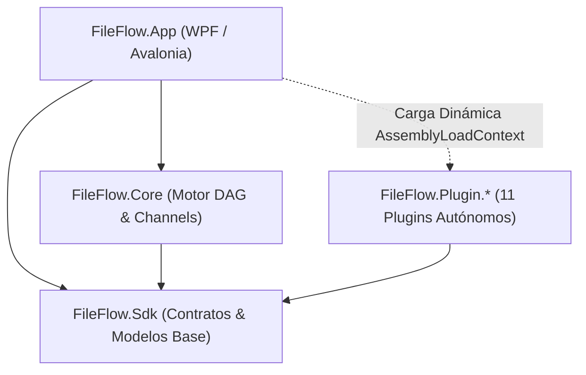

# Resumen Consolidado de Sesiones y Memoria de Proyecto - FileFlow Studio

Este documento se actualiza al finalizar cada sesión de trabajo para consolidar los puntos clave, decisiones arquitectónicas, capacidades del sistema y el estado de la solución, evitando empezar desde cero en futuras conversaciones.

> [!NOTE]
> **Historial Consolidado de Sesiones Anteriores**:
> La memoria histórica exhaustiva correspondiente a hitos anteriores (Hitos 1 a 69 y desarrollos fundacionales de 2025/2026) se encuentra preservada y archivada para optimización de contexto en:
> 📄 [**`.antigravity/knowledge/history/2026-09-13_session_summary_archive.md`**](file:///.antigravity/knowledge/history/2026-09-13_session_summary_archive.md)

---

## 1. Estado Actual del Repositorio y Calidad
- **Target Framework**: `.NET 9` (`net9.0` multiplataforma puro para todos los 14 proyectos, incluyendo `FileFlow.App`).
- **Lenguaje**: `C# 13` (`<LangVersion>13</LangVersion>`), Nullable activado de forma estricta (`<Nullable>enable</Nullable>`).
- **Framework de UI**: **Avalonia 12.1.2** con **FluentAvaloniaUI 2.2.0 (WinUI 3)**, **Nodify.Avalonia 2.0.0** y **Avalonia.AvaloniaEdit 12.0.0**.
- **Estado de Compilación**: `dotnet build FileFlow.slnx` $\rightarrow$ **0 Advertencias, 0 Errores**.
- **Suite de Pruebas**: `.\test.ps1` / `dotnet test` → **833 / 833 Pruebas Pasadas con 100% de Éxito**.
- **Hitos Activos y Recientes (Septiembre 2026)**:
  - **83. Migración Integral Multiplataforma a Avalonia 12 UI + FluentTheme**:
    - Migración del 100% de la solución a Avalonia 12 y .NET 9 multiplataforma, eliminando cualquier residuo de WPF.
    - Integración de FluentTheme nativo Avalonia 12 (WinUI 3/Fluent v2), lienzo Nodify.Avalonia 2.0.0 y editor AvaloniaEdit.
    - Vistas y temas AXAML adaptados con paridad visual exacta, registro de converters globales en `App.axaml` y cambio dinámico de tema y localización i18n.
    - Actualización de scripts de ejecución (`run.ps1`, `run-fast.ps1`, `run.bat`, `run-fast.bat`) a la ruta `net9.0` y purga de binarios WPF antiguos.
    - Suite de 833 pruebas unitarias e integración aprobadas al 100% y arranque de ventana verificado.
  - **82. Reversión de Avalonia UI y Adaptación Dinámica de Temas en Barra de Estado (WPF)**:
    - Reversión íntegra de la migración a Avalonia; restauración del 100% del entorno nativo WPF (`net9.0-windows`, `Nodify`, XAML estándar).
    - `StatusBarView.xaml` actualizado con enlaces dinámicos (`BgHeaderBrush`, `BgSurfaceBrush`, `BorderDarkBrush`, `TextPrimaryBrush`, `TextSecondaryBrush`). Fondo idéntico al de `ControlBarView.xaml` y texto con contraste óptimo en temas claros y oscuros.
  - **81. Publicación Dual y Generador de Instaladores Linux y Windows**:
    - Abstracciones de UI en `FileFlow.Sdk` (`IUiDispatcher`, `IClipboardService`, `NullUiDispatcher`, `NullClipboardService`) y adaptadores en `FileFlow.App` (`WpfUiDispatcher`, `WpfClipboardService`).
    - Verificación de neutralidad de temas (`ThemeDefinition`, `IThemeService`).
    - Scripts de publicación cruzada dual (`publish-all.ps1`, `publish-all.bat`): genera `dist/windows-x64/` y `dist/linux-x64/` (con `engine/`, `fileflow.sh`, `fileflow.png` y los 11 plugins en `Plugins/FileFlow.Plugin.*/` con dependencias, `es/` y `Config/`).
    - Generadores de instaladores Linux y Windows (`installer/build-linux-installer.ps1`, `installer/linux/build-appimage.sh`, `installer/linux/AppRun`, `installer/linux/install.sh`, `installer/build-all.ps1`): genera `FileFlow-v{Version}-x86_64.AppImage`, `fileflow-linux-x64-v{Version}.tar.gz`, `fileflow_{Version}_amd64_deb_tree.tar.gz` y soporte para flag `-FrameworkDependent`.
    - Pipeline CI/CD multi-job en GitHub Actions (`.github/workflows/release.yml` y `ci.yml`): compilación simultánea en `windows-latest` y `ubuntu-latest` con sumas SHA-256 agregadas (`checksums.txt`).
    - Mantenimiento y limpieza del repositorio (`.gitignore` integral y `clean.ps1` con `-DryRun`).
  - **80. Preservación de Estructura de Directorios en Fan-Out / Fan-In y Soporte de Variables `{Archive:...}`**:
    - `ArchiveFanOutNode` calcula y propaga la ruta relativa de origen (`Archive:RelativeDir`, `Archive:OriginalArchiveRelativePath`, `Archive:OriginalArchivePath`).
    - `DomainVariableResolver` y `SystemVariablesResolver` resuelven `{Archive:...}` y `{RelativeDir}` dinámicamente preservando la jerarquía original en el destino (ej. `{GlobalOutputDir}\{RelativeDir}`).
  - **79. Soporte Universal de Decodificación y Visualización WebP en WPF y OCR (`WpfImageLoader` & `LocalOcrNode`)**:
    - `WpfImageLoader` universal combinando WIC nativo con fallback a ImageSharp en memoria. Visualización y comparación determinista de WebP, TGA, TIFF. Transcodificación a PNG en `LocalOcrNode` para Leptonica/Tesseract.
  - **78. Cero Pérdida de Archivos en Empaquetado (Fan-In) y Passthrough Seguro en Optimizador de Imágenes**:
    - `ImageOptimizerNode` con `PassThroughNonImages = true` y manejo resiliente de errores para transferir metadatos y ficheros no-imagen a `Out`.
    - `ArchiveFanInNode` con hook `OnWorkflowCompletedAsync` y fallback que consolida el 100% de los elementos del comprimido original sin omitir entradas.
  - **77. Gestión de Ciclo de Vida y Limpieza Determinista de Espacio Temporal (`TempWorkspace`)**:
    - `ITempWorkspaceManager` y `WorkflowWorkspaceManager` aíslan cada ejecución en `Runs/{ExecutionId}/`. Purga determinista en `WorkflowExecutor.finally` (`AutoCleanIntermediateTempFiles`).
    - `AppPaths.CleanupStaleTempDirectories` purga temporales huérfanos al inicio y desde la UI de ajustes.
  - **76. Motor de Descompresión Universal Multi-Estrategia (.NET 9, 7-Zip CLI y SharpCompress)**:
    - `SafeArchiveExtractor.UniversalExtractAsync` con orquestación transparente: .NET 9 Zip nativo (ultra-rápido, Zip64, anti Zip-Slip) $\rightarrow$ 7-Zip CLI (RAR5, 7z LZMA2, CBR, CB7, ZSTD) $\rightarrow$ SharpCompress resiliente entrada por entrada.
  - **75. Patrón Fan-Out / Fan-In para Archivos Comprimidos (`ArchiveFanOutNode` y `ArchiveFanInNode`)**:
    - Desempaquetado a sesión temporal, procesamiento individual de elementos por el grafo DAG y re-empaquetado atómico con preservación estricta de subcarpetas (`/`). `ImageOptimizerNode` con `KeepOriginalIfLarger`.
  - **74. Sincronización en Hilo Dispatcher y Corrección de Inversión de Semáforos**:
    - Despacho seguro de mutaciones de variables de UI a `Dispatcher`. Adquisición jerárquica de semáforos (`nodeThrottle` antes de `concurrencyThrottle`) para streaming fluido 1 a 1.
  - **73. Variables Dinámicas VLM, Structured Outputs Determinista y Banco de Pruebas de 1 Ciclo**:
    - Aplanador recursivo de JSON (`JsonMetadataFlattener`). Salida estructurada `json_schema` con fallback gradual en `MultimodalVlmClientEngine`.
    - Autodescubrimiento topológico en `VariableDiscoveryService` e importación en tiempo real desde la pestaña de prueba en `MultimodalVlmConfigWindow`.
  - **72. Mensajes Personalizados con Variables Dinámicas en `LogOutputNode`**:
    - Parámetro `CustomMessage` (`ParameterEditorType.MultiLineText`) con interpolación de variables vía `VariableTemplateResolver`, editor modal ampliado (`⤢`) y catálogo de variables (`{x}`).
  - **71. Concurrencia Configurable en Nodos VLM y Perfiles de Proveedor**:
    - Parámetro dinámico `MaxConcurrency` (1 a 32) en `MultimodalVisionLlmNode` y semáforos dimensionados por endpoint en `MultimodalVlmClientEngine`.
  - **70. Medición Precisa de Rendimiento y Deduplicación del Contador de Elementos**:
    - Concurrencia declarativa por nodo y reporte de duración neta (`ReportExecutionDuration`), eliminando distorsión por tiempo en cola. Deduplicación concurrente en `WorkflowTelemetryTracker`.

---

## 2. Arquitectura y Capacidades Consolidadas de la Solución

### A. Desacoplamiento Estricto por Capas (Clean Architecture)

- **`FileFlow.Sdk`**: Biblioteca pura en C# 13 / .NET 9 con contratos (`IFlowNode`, `IFlowExecutionContext`, `ITempWorkspaceManager`, `IUiDispatcher`, `IClipboardService`), modelos (`FileItemContext`, `NodeDescriptor`), motores de renombrado y serialización relajada (`JsonDefaults`).
- **`FileFlow.Core`**: Orquestador del motor DAG, canales asíncronos (`System.Threading.Channels`), telemetría atómica, base de datos de logs en SQLite (`SqliteLogStore`), aislador de temporales (`WorkflowWorkspaceManager`) y carga dinámica de plugins (`PluginLoader`).
- **`FileFlow.Plugin.*` (11 Plugins)**:
  1. `FileFlow.Plugin.Logic`: Nodos condicionales, bifurcaciones, filtros por metadatos/regex.
  2. `FileFlow.Plugin.FileSystem`: Orígenes de carpetas, renombrador avanzado (9 métodos), movimiento/copia, borrado seguro a papelera, registro de log.
  3. `FileFlow.Plugin.Archives`: Descompresión multi-estrategia (.NET 9, 7-Zip, SharpCompress), Fan-Out, Fan-In, compresión jerárquica.
  4. `FileFlow.Plugin.Images`: Conversión y optimización (WebP, JPEG, PNG), redimensionamiento, preservación condicional por tamaño.
  5. `FileFlow.Plugin.AI`: Inferencia multimodal VLM (Qwen2.5-VL, Ollama, LM Studio, In-Process), clasificador visual heurístico/neuronal (`ImageTypeClassifierNode`), CLIP ViT-B/32 ONNX, OCR local con Tesseract/ImageSharp.
  6. `FileFlow.Plugin.Audio`: Transcodificación y extracción de tags ID3/metadatos de audio.
  7. `FileFlow.Plugin.Documents`: Manipulación de PDFs, unión, división y extracción de texto.
  8. `FileFlow.Plugin.Video`: Integración con FFmpeg para conversión, remuxing y miniaturas.
  9. `FileFlow.Plugin.Integrations`: Webhooks, subida HTTP/REST, SFTP, SMB, WebDAV.
  10. `FileFlow.Plugin.Reports`: Generación de reportes tabulares Excel (.xlsx) y CSV con auto-estilos.
  11. `FileFlow.Plugin.Database`: Ingesta y exportación directa a bases de datos SQLite / SQL.
- **`FileFlow.App`**: Interfaz de usuario rica con lienzo Nodify, inspección en vivo de nodos, consola de telemetría SQLite de alto rendimiento, Theme Studio (8 presets + personalización), Regex Studio y diseño modular MVVM con `CommunityToolkit.Mvvm`.

### B. Principios Clave del Sistema
1. **Inmutabilidad del Archivo de Origen**: No destructivo por defecto. El original solo se altera mediante `OriginalFileActionNode`.
2. **Localización Dinámica (i18n)**: Español (`es-ES`) e Inglés (`en-US`) con cambio en caliente reactivo sin reiniciar.
3. **Autonomía Total por Plugin (Zero-Touch en Host)**: Todo código, vista modal (`UI/`), configuración (`Config/`) y recursos de texto (`Resources/`) cohabitan dentro de la carpeta de cada plugin (`FileFlow.Plugin.*`).
4. **Patrón Adaptador de Modelos de IA**: Inferencia modular mediante contratos (`IVlmAdapter`, `IObjectDetectorAdapter`) con auto-descubrimiento en factorías e inyección de preprocesado geométrico exacto.

---

## 3. Reglas de Operación y Mantenimiento Memorizadas

1. **Protocolo de Arranque**: Consultar siempre `.antigravity/knowledge/session_summary.md`, `docs/PROJECT_WALKTHROUGH.md` y `.antigravity/knowledge/repo_architecture.md` antes de escanear código.
2. **Optimización de Tokens**: No leer ficheros completos preventivamente; usar búsquedas dirigidas (`grep_search`).
3. **Actualización Continua**: Registrar obligatoriamente todo cambio cronológico en `docs/PROJECT_WALKTHROUGH.md` y actualizar `session_summary.md` al finalizar la sesión.
4. **Calidad y Verificación**: Compilación con `<TreatWarningsAsErrors>true</TreatWarningsAsErrors>` y paso del 100% de la suite de tests (`dotnet test` o `.\test.ps1`).

---

## 4. Enlace al Historial Completo de Sesiones Anteriores

Para consultar el registro pormenorizado de las sesiones 1 a 69:
- 📄 [**`.antigravity/knowledge/history/2026-09-13_session_summary_archive.md`**](file:///.antigravity/knowledge/history/2026-09-13_session_summary_archive.md)
