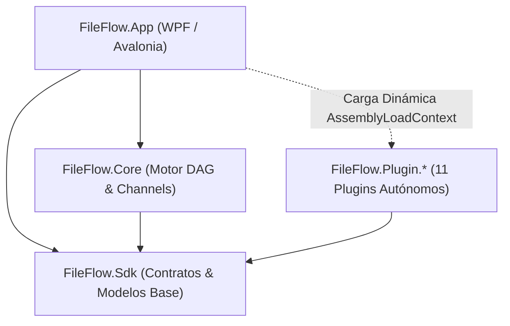

# Resumen Consolidado de Sesiones y Memoria de Proyecto - FileFlow Studio

Este documento se actualiza al finalizar cada sesión de trabajo para consolidar los puntos clave, decisiones arquitectónicas, capacidades del sistema y el estado de la solución, evitando empezar desde cero en futuras conversaciones.

> [!NOTE]
> **Historial Consolidado de Sesiones Anteriores**:
> La memoria histórica exhaustiva correspondiente a hitos anteriores (Hitos 1 a 69 y desarrollos fundacionales de 2025/2026) se encuentra preservada y archivada para optimización de contexto en:
> 📄 [**`.antigravity/knowledge/history/2026-09-13_session_summary_archive.md`**](file:///.antigravity/knowledge/history/2026-09-13_session_summary_archive.md)

---

## 0. Hito más reciente
- **210. La Carpeta de Salida del Flujo Vale una Carpeta en Cualquier Parámetro (2026-09-24)**:
  - **El encargo**: «encuentra y arregla todos los sitios que resuelven la carpeta de salida del flujo (variable `GlobalOutputDir` y sus alias) fuera de `ParameterHelper.ResolveOutputPath`, de modo que valga una carpeta terminada en cualquier parámetro y no el texto declarado» — el pendiente que dejó escrito el hito 209.
  - **🔎 El censo (grep sobre todo el producto, no sobre lo que uno recuerda)**: **cinco formas** de leer la carpeta, ninguna con la regla dentro. (1) `SystemVariablesResolver`: la variable devolvía la metadata tal cual, así que **cualquier** parámetro que no fuera una ruta (mensajes, asuntos, expresiones) recibía la plantilla; (2) `ResolveOutputPath`: la expandía y anclaba **sólo ahí**; (3) **cuatro nodos de IA** (síntesis de voz, detección de voz, anonimizador, subtítulos) con **la misma regla copiada cuatro veces**, leyendo la metadata cruda y con el último escalón en `Directory.GetCurrentDirectory()` —el archivo dentro de la aplicación—; (4) **siete nodos de datos** (CSV, Excel, SQLite, conversor, lookup, los dos lectores) con `Replace("{GlobalOutputDir}", <valor crudo>)`, que además dejaba el token escrito en la ruta si no había metadata; (5) `ExcelReportGeneratorNode` y `PdfMergeNode`, que al escribir **al terminar la ejecución** guardaban el valor crudo o resolvían contra un **elemento vacío** (así que la carpeta del flujo no se veía y las variables del nombre se perdían). Más la barra de estado, que abría `C:\FileFlowOutput` escrito a mano.
  - **🧐 La regla, una sola vez**: **`ParameterHelper.FlowOutputFolder`** devuelve la carpeta declarada **expandida y anclada** (o `null` si nada la declara) y la usan **la variable del motor de plantillas, el anclaje de las rutas, la regla compartida de los nodos de IA y los escritores de datos**. Tiene el **censo de alias dentro** (`GlobalOutputDir`, `DefaultGlobalOutputDir`, `DefaultOutputDir`, `GlobalOutputPath`, `DefaultOutputPath` — antes el anclaje sólo miraba la clave vigente y podía anclar en distinto sitio que el que decía la variable), **guardia de reentrada** (`[ThreadStatic]`) para un flujo que se declare en términos de sí mismo (`{GlobalOutputDir}/sub`) y, como consecuencia, **el API se encoge**: se retira el `globalOutputDirOverride` que el 209 había añadido a `VariableTemplateResolver.Resolve` y `SystemVariablesResolver.GetVariableValue` — con la variable resuelta en su sitio no hay nada que inyectar.
  - **🧩 Los nodos de IA pasan a una regla compartida y escrita** (`FileFlow.Plugin.AI/Common/NodeOutputDirectory.cs`): lo declarado, si no la carpeta del flujo, si no la del propio archivo, y sólo en último extremo el temporal del producto. El `Directory.GetCurrentDirectory()` desaparece de los cuatro.
  - **📝 Escritores que resuelven al vuelo**: `ExcelReportGeneratorNode` guarda la **carpeta terminada** mientras corre (el reporte se escribe al cerrar, cuando ya no hay elemento) y `PdfMergeNode` hace lo mismo con carpeta **y** nombre —antes resolvía contra un elemento vacío, así que `{FileName}` se quedaba sin valor y la carpeta del flujo no se veía—, con caída al camino viejo si el cierre llega sin nada recogido.
  - **🐛 El arnés de mutaciones encontró un defecto en el propio arreglo**: la mutación de la regla **sobrevivió** porque `Path.GetDirectoryName("voz.wav")` devuelve **cadena vacía, no nulo**, y la cadena `?? ... ?? AppPaths.DefaultTempDirectory` se detenía en la cadena vacía: **el último escalón no se disparaba nunca** (el nodo habría escrito en la ruta vacía). Corregido con `IsNullOrWhiteSpace` y el porqué escrito al lado, la mutación muerde. Queda contado en la declaración de la mutación.
  - **🔗 Los siete nodos de datos pasan por la regla (cierre del censo)**: sustituían el token **canónico** a mano (`Replace("{GlobalOutputDir}", …)`), así que un alias en el parámetro —`{DefaultOutputDir}`, `{OutputDir}`, `{GlobalOutputPath}`, `{DefaultOutputPath}`, los cuatro que el resolutor acepta— se quedaba **escrito dentro de la ruta**. Retirada la sustitución, los siete (CSV de entrada y de salida, Excel de entrada y de salida, SQLite, conversor y lookup) entregan el **patrón entero** a `ResolveOutputPath`, que expande todos los nombres y ancla lo relativo; cada uno conserva su respaldo para el caso de no haber patrón (CSV y reporte al temporal del producto, el conversor a la carpeta del archivo, los lectores avisando). El **reporte de Excel** guarda ahora la carpeta **ya resuelta** durante la ejecución (puede ser `{GlobalOutputDir}/reportes` y el anclaje depende del elemento, así que al terminar ya no hay con qué resolverlo). Lección de barrido: **`using FileFlow.Sdk.Storage` era carga, no ruido** — al quitar la sustitución lo retiré de los siete ficheros y el compilador lo devolvió con once errores, porque `GetStorage` es un método de extensión de ese espacio. Y del mismo censo, un sitio de interfaz: el editor de plantillas mostraba `C:\Output` como muestra de `{GlobalOutputDir}` (ruta de Windows escrita a mano, en un producto multiplataforma) → ahora la carpeta real de los ajustes.
  - **🧬 Mutaciones**: [`salida-global-sin-expandir`](file:///mutations/salida-global-sin-expandir.json) **cambia de destino** —antes le quitaba la expansión a `ParameterHelper`, donde la cura era local; ahora a la **regla única**— y su testigo pasa a ser **las cinco lecturas una por una**: la variable en un parámetro que no es una ruta, el anclaje del SDK, el compresor, los nodos de IA y los dos escritores de datos (el CSV por su token **y por un alias suyo**) → **MUERDE** en **29,6 s**, testigo rojo **10 de 10**, control **3 de 3**. [`carpeta-de-nodo-de-ia-donde-corre`](file:///mutations/carpeta-de-nodo-de-ia-donde-corre.json) es **nueva** (el último escalón de los nodos de IA al directorio del proceso) → **MUERDE** en **33,6 s**, testigo rojo **1 de 2**. [`datos-solo-el-token-canonico`](file:///mutations/datos-solo-el-token-canonico.json) es **nueva** (devuelve la sustitución de un solo token al nodo de CSV) → **MUERDE** en **28,8 s**, testigo rojo **4 de 4** (los cuatro alias) y control verde (el token canónico sigue escribiendo donde el flujo declara): lo que rompe es exactamente lo que el arreglo añade. Con el mutante puesto quedan en el directorio de los binarios **cuatro carpetas** con el nombre de cada alias —la firma del defecto del hito 204, medida otra vez y recogida al terminar—.
  - **Validación**: `dotnet test` completo → **1737 superadas + 1 omitida de 1738** (+12), build **0 errores**, dos pasadas verdes (2 m 34 s y 2 m 40 s). Cada nodo arreglado tiene su prueba **por su propia costura** (los dos de audio exponen la resolución como `internal`; el plugin ya tenía `InternalsVisibleTo`). `mutations/COVERAGE.md` regenerado: **33 mutaciones**, **10 de 15 subsistemas**, **6 de 33 guardias**. `docs/notas_de_version.md`: apartado **8** ampliado, cifras **1719 → 1737**. Walkthrough: hito 210. **Un fallo de entorno conocido** apareció en una pasada intermedia (`SyntheticDataSourceNode_EmissionLatency_ShouldPaceEveryEmission`, latencia con el árbol cargado) y pasó al correrlo solo.
  - **Notas para la siguiente sesión**: **el hueco de los nodos de datos queda cerrado** (ya no sustituyen el token a mano: los alias valen y un camino relativo se ancla por la regla común en vez de contra el directorio del proceso). Queda por decidir, en cambio, **qué ancla manda en un lector**: hoy un `FilePath` relativo cae bajo la salida del flujo, y en un lector lo natural sería el **origen del barrido**. **Censo pendiente**: cada plugin resuelve su carpeta a su manera (Documents con `ResolveOutputPath` y el PDF unido con el elemento capturado, Data por la regla única, IA con su regla compartida, Archives con la suya); unificar los caminos de lectura es el siguiente paso lógico y el censo de este hito es el mapa. **Migración pendiente**: los **98** `HelpText` literales siguen sin pintarse. Sigue abierto del producto: los flujos que prometen vídeo/audio/GIF (02, 11, 24, 36, 39, 40). **Sin commits**: todo el trabajo de los hitos 198-210 sigue en el árbol.
- **209. El Compresor Escribe en la Salida del Flujo: el Valor por Omisión y la Migración de lo Ya Guardado (2026-09-24)**:
  - **El encargo**: «decide si el compresor debe escribir por omisión en la carpeta de salida del flujo en vez de junto al archivo, con el plan de migración para los flujos ya guardados que no declaran carpeta. **Por defecto debería usar el directorio de salida por defecto definido en los ajustes.**» Es el pendiente que el 208 dejó escrito.
  - **✅ La decisión**: `DestinationFolder` vale de fábrica **`{GlobalOutputDir}`** —la carpeta que el flujo declara como suya y, si no declara ninguna, la de los ajustes, que es exactamente lo que el encargo pide—, declarado en **un solo sitio** (`ArchiveCompressorNode.DefaultDestinationFolder`, usado por la instancia y por el descriptor, para que la ficha muestre lo que el motor ejecuta). «Junto al archivo que comprime» deja de ser el respaldo y pasa a ser algo que se declara: **`{CurrentDir}`**, una variable que ya existía y que calculaba lo mismo que el respaldo. Sin plumbing nuevo: el lanzador ya entrega esa carpeta al motor.
  - **🚚 La migración, decidida y escrita**: **no se reescribe ningún flujo** (el escritor guarda siempre la clave, así que un guardado sin carpeta trae `"DestinationFolder": ""` y eso es lo que pisa al valor de fábrica al abrirse; la regla nueva vive en el nodo y alcanza a lo ya guardado, también a lo que no se vuelva a guardar). El flujo que declara carpeta —o el nombre heredado— **no cambia**; el que no declara nada escribe ahora en la salida del flujo y **el log lo dice** con la carpeta exacta. Se descarta la migración que rellena la clave al cargar: reescribe el archivo del usuario y **no puede prometer** lo que promete (el respaldo usaba la carpeta del elemento *en ese momento*, y `{OriginalDir}` habría apuntado a la de origen; `{CurrentDir}` sí, pero entonces es una reescritura que el usuario no pidió). **Argumento que lo hace defendible**: la aclaración «si se deja vacía, junto al archivo» se escribió en el 208 y **no se ha publicado**, así que nadie pudo elegir el sitio viejo a propósito.
  - **🔑 El heredado manda sobre el valor de fábrica**: `DestinationDirectory` no está en la ficha, así que un valor ahí sólo puede venir de un flujo guardado con el nombre viejo —uno que sí declaró dónde escribe—; con la comprobación «¿está vacío?» el valor de fábrica lo habría tapado y habría movido en silencio la salida de esos flujos. Ahora la comprobación es «¿vacío **o** el valor de fábrica?» y una prueba fija las dos mitades.
  - **🕳️ Defecto encontrado antes de tocar el valor (y arreglado)**: la salida del flujo **no era una carpeta**. El catálogo entero declara `"globalOutputDir": "{RelativeDir}"`, así que `{GlobalOutputDir}` devolvía la **plantilla literal** (ninguna fase la expandía), el anclaje la combinaba **consigo misma** y `CrossPlatformPath.Combine` absolutizaba esa ruta relativa contra el **directorio de trabajo del proceso**. Medido con una prueba de sondeo antes de tocar nada: `…\FileFlow.Tests\bin\Debug\net10.0\{RelativeDir}\{RelativeDir}` — la forma exacta del defecto del 204, **vivo en el árbol** (los ejemplos 08, 12 y 21 lo declaran desde el 208) y a punto de ser el destino **por omisión** de todo compresor. Cura en `ParameterHelper`: el anclaje del origen se decide antes de expandir el patrón (`SourceAnchor`), la salida declarada se expande una vez y se ancla bajo el origen (o bajo la salida por defecto de los ajustes si no hay origen) —`ResolveGlobalOutputDir`— y **el valor ya anclado se le pasa al resolutor** como valor de `{GlobalOutputDir}` (`globalOutputDirOverride`, opcional en `VariableTemplateResolver.Resolve` y `SystemVariablesResolver.GetVariableValue`) para que el patrón no se componga consigo mismo. Síntoma visible del defecto: una carpeta `{RelativeDir}\{RelativeDir}` entre los binarios, que dejó el mutante. Después: lo mismo da `D:\Fuente\sub` y `{GlobalOutputDir}/Archivado` da `D:\Fuente\sub\Archivado`. Último escalón escrito en el nodo: un destino que se quede relativo pese a todo **no se escribe donde corre el proceso**, se ancla en la salida por defecto de los ajustes y se dice.
  - **📖 Ayuda y catálogo**: `Param_DestinationFolder_Help` (es/en) ya no describe el respaldo; dice que por omisión es la salida del flujo y que para dejarlo junto al archivo se escribe `{CurrentDir}` (prueba que lee los dos idiomas del ensamblado). La guardia `EveryCompressorInTheCatalog_ShouldSayWhereTheArchiveGoes` sigue igual, con su motivo actualizado. `.md` de 08, 12, 21 y 34 y los **tres** manuales con la frase nueva.
  - **🧬 Mutaciones (una reescrita + una nueva, las dos MUERDE)**: [`compresor-que-escribe-donde-corre`](file:///mutations/compresor-que-escribe-donde-corre.json) se reescribe a la regla nueva (el valor de fábrica del nodo cae en el **directorio del proceso**) → testigo rojo **2 de 2** (nodo + flujo guardado con el motor), control verde **2 de 2**, **38,7 s**; [`salida-global-sin-expandir`](file:///mutations/salida-global-sin-expandir.json) es nueva (quita la expansión en `ParameterHelper`) → testigo rojo **2 de 2** (SDK + compresor), control verde, **31 s**.
  - **Validación**: `dotnet test` completo → **1725 superadas + 1 omitida de 1726** (+6), build **0 errores**, **2 m 50 s**. Banquillo de los 40 ejemplos verde y sala limpia vacía. `mutations/COVERAGE.md` regenerado: **31 mutaciones**, **10 de 15 subsistemas**, **6 de 33 guardias**. Walkthrough (hito 209) y `docs/notas_de_version.md` apartado **8** (compilación 5305 → 5341), cifras **1719 → 1725**.
  - **Notas para la siguiente sesión**: el pendiente del 208 queda **cerrado**. **Por mirar**: si hay más sitios que resuelvan la salida global **fuera** de `ResolveOutputPath` (una variable usada en un parámetro que no sea una ruta seguirá devolviendo la plantilla declarada). **Migración pendiente**: los **98** `HelpText` literales siguen sin pintarse (mudarlos a `Param_{clave}_Help` es mecánico). Sigue abierto del producto: los flujos que prometen vídeo/audio/GIF (02, 11, 24, 36, 39, 40) entregan copias con la extensión de destino cuando la entrada no es media. **Sin commits**: todo el trabajo de los hitos 198-209 sigue en el árbol.
- **208. El Compresor Dice Dónde Escribe: la Regla, la Ayuda y el Catálogo (2026-09-24)**:
  - **El encargo**: «cierra el hueco del compresor: cuando el flujo no declara carpeta de destino, debe quedar claro y comprobado dónde escribe el comprimido, y los ejemplos que no la declaran han de decir su destino» — pendiente escrito por los hitos 204/205 y reecontrado desde el otro lado en el 207.
  - **El hueco**: `ArchiveCompressorNode` tiene un respaldo correcto —sin carpeta declarada, comprime **junto al archivo que comprime**— pero **nadie lo decía**: el nodo no lo logueaba, la ficha del parámetro no lo aclaraba y de los **cinco** ejemplos que usan el compresor **ninguno** declaraba su destino (08, 12, 21 y 38 sin el parámetro; 34 tampoco). El respaldo nunca fue el defecto; el defecto era el silencio.
  - **🧐 La regla en un solo sitio + el log**: método `DeclaredDestinationFolder()` con su contrato escrito (declarada → `ParameterHelper.ResolveOutputPath`, **nunca** donde corre el proceso; vacía → junto al archivo que comprime; `DestinationDirectory` heredado como respaldo), y aviso en el log **después** de comprobar que la entrada existe: «*Sin carpeta de destino declarada: el comprimido se escribe junto al archivo que comprime, en '<carpeta>'*».
  - **👁️ La ayuda que existía y nadie pintaba**: la convención `Param_{clave}_Help` (Archives, FileSystem, Network, AI) no la leía **ninguna** interfaz; la fila del parámetro mostraba en su *tooltip* **la clave cruda**. Ahora `NodeParameterViewModel.Help` la resuelve y las dos plantillas la pintan (con caída a la clave cuando no hay recurso; se refresca al cambiar de idioma). **Decisión escrita**: `NodeParameterDescriptor.HelpText` (98 literales sin localizar) se deja **sin pintar** a propósito, porque mostrarlos pondría castellano en la interfaz inglesa. El compresor estrena `Param_DestinationFolder` («Carpeta de Destino») y `Param_DestinationFolder_Help` en los dos idiomas, y la prueba los lee del ensamblado del plugin (una traducción a medias falla).
  - **📚 El catálogo dice dónde, con guardia**: 08 → `{GlobalOutputDir}`, 12 → `{GlobalOutputDir}`, 21 → `{GlobalOutputDir}`, 34 → `{GlobalOutputDir}/Archivado`, 38 → `{GlobalOutputDir}/Frio`; `.md` de los cinco y los tres manuales (español e inglés) con la frase del destino; guardia nueva `EveryCompressorInTheCatalog_ShouldSayWhereTheArchiveGoes` (recorre los ejemplos y señala fichero y nodo sin `DestinationFolder`/`DestinationDirectory`). El respaldo sigue siendo el del nodo para los flujos del usuario que no declaren carpeta; el catálogo, que enseña, lo declara.
  - **🧬 Mutaciones (una nueva + una extendida, las dos MUERDE)**: [`catalogo-sin-carpeta-de-destino`](file:///mutations/catalogo-sin-carpeta-de-destino.json) borra el `DestinationFolder` del ejemplo 08 → testigo rojo **1 de 1** (la guardia nueva nombra el fichero), control verde, **27,6 s**; [`compresor-que-escribe-donde-corre`](file:///mutations/compresor-que-escribe-donde-corre.json) gana como testigo la prueba del respaldo → testigo rojo **2 de 2**, control verde, **30,6 s**. **Medición que cambia lo que cubre quién**: con el catálogo declarando destinos el **banco ya no pasa por el respaldo**, así que los **34 avisos** que ese mutante publicaba en la sala limpia del banco (207) son la medición de entonces y hoy el banco queda **verde** bajo el mutante; queda escrito en la declaración.
  - **Validación**: `dotnet test` completo → **1719 superadas + 1 omitida de 1720** (+4), build **0 errores**, **2 m 39 s**. Los cinco ejemplos editados siguen pasando las guardias de papel (formato del escritor, apertura en el editor) y sus asientos del banco. `mutations/COVERAGE.md` regenerado: **30 mutaciones**, **10 de 15 subsistemas**, **6 de 33 guardias**. `docs/notas_de_version.md`: apartado 7 corregido (el hueco del compresor ya no «sigue viéndose así»), cifras **1706 → 1719** y **30 defectos declarados**.
  - **Notas para la siguiente sesión**: **pendiente de decidir, no defecto**: si el valor por omisión del nodo debería ser `{GlobalOutputDir}` en vez del respaldo (mueve el destino de **todos** los flujos guardados que no declaren carpeta; el respaldo ya no es silencioso, así que la decisión puede tomarse sin prisa). **Migración pendiente**: los **98** `HelpText` literales de los plugins siguen sin pintarse → mudarlos a `Param_{clave}_Help` es mecánico y un lint que los prohíba lo cerraría. Sigue abierto del producto: los flujos que prometen vídeo/audio/GIF (02, 11, 24, 36, 39, 40) entregan copias con la extensión de destino cuando la entrada no es media.
- **207. El Banco de Ejemplos Deja de Mirar los Binarios: Cada Flujo Corre en una Sala Limpia (2026-09-24)**:
  - **El encargo (heredado del 206, escrito como hueco)**: una pasada completa dejó el banco en rojo sin capturar el mensaje; el sospechoso era `SnapshotProcessDirectory`, que comparaba el directorio de trabajo del proceso **entero** (antes y después de cada flujo), así que «un vecino escribiendo junto a los binarios» se le atribuía al flujo medido. Había que decidir entre **colección exclusiva** o **acotar** la comprobación.
  - **🔬 Lo primero, medir —y la teoría del vecino no aguantó**: pasada completa del suite **sin** el banco con foto del directorio de los binarios antes y después → **399 archivos antes, 399 después, cero nuevos**. Ninguna prueba del suite escribe ahí; quien puede es algo que no es una prueba (**una compilación en marcha en el mismo árbol**: el checkout se comparte y el arnés de mutaciones compila en ese directorio) o el propio flujo. Conclusión para la decisión: **la exclusividad sola no arregla nada** (aisla de vecinos de proceso, no de un compilador ajeno) y **acotar por contenido** habría perdido el caso que importa (un archivo **transformado** que cae fuera no se parece a nada de dentro).
  - **🧪 La decisión: sala limpia + colección exclusiva.** El banco apunta el **directorio de trabajo del proceso** a una carpeta temporal suya —vacía y sólo suya— mientras corre los 40 flujos, y **exige que quede vacía**: un archivo ahí es la firma de un flujo que resolvió su destino contra «la carpeta donde corre» (mensaje nuevo: `escribió en la carpeta donde corre: '<x>'`). El directorio se restaura en un `finally` (es del proceso). Se **retira** la aserción sobre los binarios, que además **volcaba el árbol entero** en el mensaje de un fallo —el motivo por el que el rojo del 206 quedó sin mensaje legible—. La clase pasa a la colección exclusiva **`ExampleFlowBankCollection`** porque el directorio de trabajo es estado global del proceso. **Coste medido: ninguno** (ver validación).
  - **🧬 Atada a un defecto que muerde**: [`compresor-que-escribe-donde-corre`](file:///mutations/compresor-que-escribe-donde-corre.json) le quita al compresor su respaldo («sin carpeta de destino, junto al archivo que comprime») y lo deja caer en el directorio del proceso —la forma exacta del defecto del 204—. **Medido aplicando el mutante a mano: 34 avisos** de «escribió en la carpeta donde corre» con nombres reales (`anidado.zip`, `nota.zip`, `<guid>.zip`) en los flujos **08, 21 y 34**; **sin sala limpia ese aviso no existiría** (el archivo habría caído entre los binarios). En el arnés: **MUERDE** en **181,5 s**, testigo rojo **2 de 5** (prueba del nodo + banco), control verde.
  - **🧾 Contrato de colecciones al día**: estado nuevo `ProcessWorkingDirectory` (patrón `Directory.SetCurrentDirectory`), colección nueva en `ExclusiveCollections` y en la tabla de nombres del analizador, dos auto-tests en la guardia (`Analyzer_ShouldRequireTheExampleFlowBank_WhenClassMovesTheProcessWorkingDirectory` y su positivo) y la entrada en el mapa de [`TestAssemblyParallelism.cs`](file:///FileFlow.Tests/TestAssemblyParallelism.cs).
  - **Validación**: `dotnet test` completo → **1715 superadas + 1 omitida de 1716** (+2), build **0 errores**, **2 m 43 s** (la pasada anterior, misma máquina: 1713 + 1 de 1714 en ~2 m 45 s → **la exclusividad no cuesta tiempo medible**). `ExampleFlowsEndToEndTests` verde **con la sala vacía** al terminar los 40 flujos. `mutations/COVERAGE.md` regenerado: **29 mutaciones**, **10 de 15 subsistemas**, **5 de 33 guardias** (estaba sin regenerar de tramos anteriores). `docs/notas_de_version.md`: apartado 7 ampliado con lo que no se ve del banco y cifras **1706 → 1715**, defectos declarados **29**.
  - **Notas para la siguiente sesión**: el hueco del 206 queda **cerrado** (comprobación sobre un directorio compartido + mensaje que volcaba el árbol: las dos mitades fuera). Si el banco vuelve a rojo, ahora se lee: los problemas van en el mensaje de la aserción, con el flujo y el archivo concreto. Siguen abiertos, y son del **producto**: (1) el compresor escribe junto a sus entradas cuando el flujo no declara carpeta de destino —ya no puede destruirlas, pero el valor por omisión no se toca porque mueve el destino de todos los flujos que no lo declaran— y (2) los flujos que prometen vídeo/audio/GIF (02, 11, 24, 36, 39, 40) entregan copias con la extensión de destino cuando la entrada no es media.
- **206. El Banco de Ejemplos Mira la Entrada: Ningún Flujo la Toca Sin Declararlo (2026-09-24)**:
  - **El encargo**: «haz que el banco de ejemplos compruebe que ningún flujo modifica los archivos de entrada salvo cuando su asiento lo declare, con el caso del compresor que vaciaba el paquete como testigo».
  - **🕳️ El agujero**: el banco miraba **lo entregado** y **excluía los archivos de entrada** de la cuenta, así que quien los tocara no lo delataba nadie: el ejemplo 21 devolvía el `paquete.zip` sembrado con **22 bytes** donde tenía 148 (hito 205) y el banco lo daba por bueno. Se destapó depurando el flujo a mano, no por una prueba.
  - **🧪 La exigencia**: `Seat` estrena `InputPolicy` con el caso corriente por omisión —**`Untouched`**: cada entrada sigue en su ruta con los mismos bytes, comparado por **huella SHA-256** antes y después de ejecutar—, más **`MovedButKept`** (puede salir de su ruta —renombrar en el sitio, cuarentena, organización por fecha— pero **sus bytes tienen que seguir en el área de trabajo**) y **`MayBeDestroyed`** (la promesa es destruirla: la papelera). Guardia nueva `EverySeatThatLetsTheFlowTouchTheInput_ShouldSayWhy`: política distinta de `Untouched` exige excusa escrita (`InputWhy`), y excusa puesta con `Untouched` prohibida.
  - **📋 Medido, no supuesto**: la primera pasada señaló **exactamente seis** de los cuarenta —10 (papelera, `MayBeDestroyed`), 13 (duplicado a cuarentena), 17 (originales a cuarentena), 26 (organización por fecha), 34 (renombrado en disco) y 38 (descartado por deduplicación), los cinco `MovedButKept`—. Los otros **treinta y cuatro** no la tocan (el 05 renombra **virtual**; el 33, que depura con la papelera, no borra lo sembrado) y se les exige `Untouched`.
  - **🧬 Atada a un defecto que muerde**: [`compresor-contra-su-propia-entrada`](file:///mutations/compresor-contra-su-propia-entrada.json) declara ahora **dos escalas** del mismo defecto (testigo del nodo **|** banco de los 40 ejemplos): medido, testigo rojo **2 de 5** y control verde, en **182 s** (corre el banco dos veces). Consecuencia: `mutations/COVERAGE.md` publicado pasa a **5 de 33 guardias** con mutación que las muerda (de 4).
  - **Validación**: `dotnet test` completo → **1713 superadas + 1 omitida de 1714** (+1), build **0 errores**, tres pasadas seguidas en verde. `docs/notas_de_version.md` actualizado (apartado 7, compilación 5277 → **5305**).
  - **Notas para la siguiente sesión**: **una pasada completa dejó el banco en rojo y no se pudo reproducir** (junto al fallo de entorno de `EngineFirstRunTests`); duró **1 m 14 s**, lo suyo de siempre, así que no fue el tiempo de espera por flujo (30 s), y **su mensaje no se capturó** —escrito como hueco—; las tres pasadas siguientes verdes (una futura lo imprimirá entero, porque el banco publica sus problemas en el informe). **Sospechoso principal**: `SnapshotProcessDirectory` compara el directorio de trabajo del proceso **entero** antes y después de cada flujo, así que un vecino de otra colección escribiendo junto a los binarios se le atribuye al flujo medido → pide decidir entre **colección exclusiva** para el banco o acotar la comprobación a lo que el flujo pudo escribir. **(Resuelto en el hito 207: sala limpia propia y colección exclusiva; medido que ninguna prueba escribe en los binarios y que una compilación en marcha en el mismo árbol sí puede.)**
- **205. El Lote que No se Llenaba: Entrega al Terminar la Ejecución, y los Tres Defectos que Aparecieron Detrás (2026-09-24)**:
  - **El encargo**: «haz que los flujos que agrupan en lotes entreguen también el lote incompleto al terminar la ejecución, y verifica los ejemplos 21 y 34 de punta a punta» — el pendiente que el hito 204 dejó escrito en el asiento de ambos.
  - **📉 La línea base, medida antes de tocar nada**: `flow_21 -> OK (entregados 0)` y `flow_34 -> OK (entregados 0)`. Los dos **aceptados** por el validador, ejecutados sin excepción y con **cero** archivos entregados: eso es lo que un asiento `Declared` no podía ver.
  - **🐞 Cuatro defectos (uno buscado, tres detrás de él)**:
    1. **El lote que no llega a llenarse moría con la ejecución.** `BatchBufferNode` sólo soltaba al alcanzar el umbral y **no sobrescribía `OnWorkflowCompletedAsync`**, que el motor ya invocaba tras drenar los nodos de arranque —con una fase de drenado posterior para lo que esa fase emita—. Cura: el nodo entrega lo pendiente por **el mismo camino** que un lote completo (`EmitBatchAsync`: los elementos por `ItemOut` con `BatchIndex`/`BatchSize` y el marcador por `BatchCompleted` con `BatchIncomplete = true`), precedente exacto de `ArchiveFanInNode` con sus sesiones a medias.
    2. **Los dos ejemplos alimentaban el compresor con el marcador del lote, no con el lote.** La arista salía de `BatchCompleted`, que emite un ítem **sintético sin ruta** (`new FileItemContext(string.Empty)`); `ArchiveCompressorNode` sólo comprime la ruta del ítem que recibe, así que registraba «Ruta de entrada no encontrada» y emitía por `Error`, sin nada aguas abajo. Los elementos del lote salían por `ItemOut`… **puerto que los dos ejemplos dejaban sin conectar**. Cura: la arista sale de `ItemOut` (`flow_21` e2, `flow_34` e5), `.md` de ambos reescritos para contar lo que el grafo hace y README del catálogo actualizado; de paso se corrigen tres nombres de papel que no existen (el parámetro `FlushTimeoutMs`, el puerto `BatchFlushed` del diagrama y el parámetro `NameTemplate` del renombrador).
    3. **El renombrador del ejemplo 34 no leía la plantilla que el ejemplo declaraba.** Los pasos viajan como JSON dentro de `MethodSteps`: el catálogo los escribe con los **nombres** de las enumeraciones (`"methodType":"NewName"`) y la aplicación con **números**, y la lectura del nodo no aceptaba los nombres → `JsonException`, `catch` que la silenciaba y **plantilla por omisión** (`{ParentDir}_{CreationDate:yyyyMMdd}_{FileNameNoExt}.{Ext}`) en vez de `{Year}_DOC_{Guid}`. Cura doble: el conversor de enumeraciones por nombre en las opciones del SDK (`RenamerPresetService`, la lectura que ya usaba el editor de renombrado) y el nodo leyendo por ahí, con **aviso en el log** cuando los pasos no se pueden leer; y el ejemplo declara `RenameMode: DirectInPlace` (el de fábrica es `Virtual`, el nombre sólo cambia en los metadatos, y el compresor de aguas abajo trabaja sobre rutas que tienen que existir).
    4. **El compresor destruía su propia entrada.** Con los valores de fábrica —destino vacío (la carpeta del archivo) y nombre `{FileNameWithoutExtension}.zip`— comprimir `paquete.zip` apunta al **mismo** archivo; el destino se abre (y se trunca) **antes** de leer la entrada, así que el original quedaba vaciado sobre sí mismo: **medido en el ejemplo 21, 148 bytes → 22 bytes**. El banco no lo ve (los archivos de entrada están excluidos de lo entregado); lo destapó el volcado de los nodos al depurar el flujo. Cura: el nodo **se para** antes de tocar el disco cuando el destino es la propia entrada, con el motivo en el log; la prueba compara los **bytes** de la entrada, no su tamaño.
  - **Pruebas (+6 → 1712 superadas)**: [`BatchBufferNodeRuleTests`](file:///FileFlow.Tests/Unit/Plugins/BatchBufferNodeRuleTests.cs) (+3: el lote incompleto se entrega entero —elementos, marcador, `BatchSize`, `BatchIncomplete`— y el búfer queda vacío; sin pendientes no emite nada; una **instancia reutilizada** con otro `WorkflowExecutionId` no mezcla el pendiente de la anterior), [`PluginStateAcrossExecutionsTests`](file:///FileFlow.Tests/Unit/Core/PluginStateAcrossExecutionsTests.cs) (el caso del búfer: los conteos pasan de **4 a 5** por ejecución —el cuatro era el pendiente perdido y el seis el heredado—), [`AdvancedRenamerExhaustiveTests`](file:///FileFlow.Tests/Unit/Plugins/AdvancedRenamerExhaustiveTests.cs) (+2: los pasos con nombres de enumeración se aplican; unos pasos ilegibles se dicen en el log) y [`ArchiveCompressorNodeTests`](file:///FileFlow.Tests/Unit/Plugins/ArchiveCompressorNodeTests.cs) (+1). Asientos 21 y 34: de `Declared` a **juzgados** (`DeliversAKind .zip`); con lotes de 10 y de 50 y seis archivos de entrada, lo que llega al destino **sólo puede** venir del cierre de la ejecución, así que el asiento es el testigo de punta a punta del gancho nuevo.
  - **Mutaciones (3 nuevas + 1 reescrita, todas MUERDE)**: [`lote-incompleto-perdido-al-terminar`](file:///mutations/lote-incompleto-perdido-al-terminar.json) (29,6 s), [`pasos-de-renombrado-ilegibles`](file:///mutations/pasos-de-renombrado-ilegibles.json) (30,2 s), [`compresor-contra-su-propia-entrada`](file:///mutations/compresor-contra-su-propia-entrada.json) (29,4 s) y [`bufer-de-lotes-heredado`](file:///mutations/bufer-de-lotes-heredado.json) (27,5 s) **con testigo reescrito**: al entregarse el pendiente, el búfer queda vacío al acabar cada ejecución y el caso de dos ejecuciones completas ya no distingue un búfer heredado; el que sí lo distingue es la **instancia reutilizada** con otra identidad de ejecución (que es justo lo que la defensa reinicia), y el caso de dos ejecuciones completas se queda como regresión del conteo. Catálogo: **28 declaradas, todas muerden**; `mutations/COVERAGE.md` regenerado → **10 de 15 subsistemas** y **4 de 33 guardias** (**5 de 33 desde el hito 206**).
  - **Validación**: `dotnet test` completo → **1712 superadas + 1 omitida de 1713** (+6), build **0 errores**, 2 m 52 s. Medido antes y después: `entregados 0` → `flow_21` **10** archivos (cinco `.zip` + las copias del sumidero; su sexta entrada es un `.zip` y el compresor la rechaza antes de destruirla) y `flow_34` **18** (seis renombrados con el nombre corporativo `2026_DOC_<guid>`, sus seis `.zip` y las seis copias); el banco de los 40 sigue entero en verde. **Fallo de entorno declarado y medido**: de las cuatro pasadas completas, dos verdes y dos con un único rojo —`EngineFirstRunTests.FirstRun_ShouldUseEveryThreadItWasGiven`, la primera ejecución con menos nodos simultáneos que las siguientes—; ninguna de las piezas de este hito participa en ese grafo y en solitario da verde (mismo síntoma que el hito 204 documentó). [`docs/notas_de_version.md`](file:///docs/notas_de_version.md) estrena el apartado **7** (compilación 5277 → **5301**) y numeración de «Cómo verificarlo» a **8**.
  - **Notas para la siguiente sesión**: el defecto del 204 sobre los lotes **queda cerrado**. Siguen abiertos el otro que dejó escrito (los flujos que prometen vídeo/audio/GIF entregan copias con la extensión del destino cuando la entrada no es media) y la **costura de la identidad**. **Lo que el catálogo prometía de más**: «un ZIP por lote» no existe —el producto **no tiene ningún nodo que empaquete varios elementos en un archivo**: `ArchiveCompressorNode` comprime la ruta del ítem que recibe y `ArchiveFanInNode` empaqueta una **sesión** de descompresión (`Archive:SessionId`, que sólo produce el fan-out)—, así que el grafo comprime elemento a elemento y el lote sirve para soltar en tandas; los tres textos ya lo dicen. Un «un ZIP por lote» de verdad pide decidir de quién es el contrato: o el marcador `BatchCompleted` lleva los elementos del lote, o el búfer materializa la tanda en una carpeta. Y **`ArchiveCompressorNode` sigue escribiendo los comprimidos en la carpeta de sus entradas** cuando el flujo no declara `DestinationFolder`: ya no puede destruirlas, pero el valor por omisión no se ha tocado porque cambiarlo mueve el destino de todos los flujos que no lo declaran.
- **204. Los 40 Ejemplos, Ejecutados de Punta a Punta: Cinco Defectos que Solo se Veían Corriendo (2026-09-24)**:
  - **El encargo**: «recorre los flujos que el producto documenta como ejemplos y comprueba de punta a punta que cada uno entrega los archivos que promete, no solo que termina en verde». Los 40 flujos de [`docs/examples/`](file:///docs/examples/README.md) tenían guardia de **papel** ([`WorkflowExamplesValidationTests`](file:///FileFlow.Tests/Unit/Core/WorkflowExamplesValidationTests.cs)); ninguna ejecutaba nada.
  - **🧪 El banco**: [`ExampleFlowsEndToEndTests`](file:///FileFlow.Tests/Unit/Core/ExampleFlowsEndToEndTests.cs) siembra un área de trabajo (`nota.txt` + `nota-copia.txt` **idénticos**, `datos.csv` de 3 líneas, `imagen.png` real, `paquete.zip` con `dentro.txt`, `sub/anidado.txt`, carpeta vacía), ejecuta cada flujo con `GlobalOutputDir` dentro del área y mide **qué quedó**: **40 asientos** (26 juzgados: entregar cada entrada, entregar un tipo, descomprimir, cuarentena del duplicado, vaciar la entrada, limpiar carpetas vacías, no escribir; 14 declarados con su motivo). Tres exigencias valen para **cualquier** asiento: el motor tiene que **aceptar** el grafo (se pregunta a `GraphValidator` **antes** de correr, así un rechazo no lo tapa ningún asiento), la ejecución no puede reventar y no se puede escribir fuera del área ni dejar archivos de **cero bytes**.
  - **🐞 Cinco defectos reales, arreglados y con testigo**: (1) **`SHFILEOPSTRUCT` con `Pack = 1`** → `pFrom` en el desplazamiento 12 en vez de 16 y `SHFileOperation` lee un puntero inventado: el proceso **muere con `0xC0000005`**, sin excepción que atrapar (lo destapó `flow_10`); cura: alineación natural + [`WindowsShellFileOperationLayoutTests`](file:///FileFlow.Tests/Unit/Core/WindowsShellFileOperationLayoutTests.cs). (2) **`FileRelocatorNode`** resolvía el destino relativo contra el **directorio de trabajo del proceso** (quince ejemplos escribían en `bin/Debug/net10.0/sub/2026/09/`); cura: `ParameterHelper.ResolveOutputPath`. (3) **El fork/join era inejecutable**: la vuelta de las ramas a `Branch1_Done`/`Branch2_Done` contaba como ciclo y el validador rechazaba el grafo entero → `ForkJoinBarrierNode` **no se podía usar en ningún flujo**; cura: [`NodePort.IsFeedbackSignal`](file:///FileFlow.Sdk/NodePort.cs) + el validador excluyendo esas aristas de la precedencia (+ dos avisos: vuelta que no viene de una rama del nodo, y nodo al que **sólo** le entran avisos). (4) **`ImageOptimizerNode` cambiaba la identidad del ítem** (`new FileItemContext` → `Id` nuevo): la barrera no reconocía la vuelta de esa rama y el archivo **nunca se liberaba** (`flow_22` entregaba 5 de 6; el que faltaba era la única imagen real —los demás pasan por la rama de no-imágenes, que reutiliza el ítem—); cura: `Id = item.Id`. (5) **`ArchiveCompressorNode` dejaba un archivo de cero bytes** con la extensión del archivo prometido (abre el destino antes de construir el escritor; el 7Z sólo admite LZMA y el defecto del nodo es `Deflate`): cura doble — el nodo **retira** el archivo vacío y el **ejemplo 38** declara `LZMA` + `.7z` y entrega el 7Z que anuncia.
  - **📄 Y una documentación que prometía lo que el producto no tiene**: `flow_15` filtraba por `WordCount` (y su `.md` citaba un parámetro `ExtractWordCount`) — **ningún nodo cuenta palabras**; `DocumentProcessorNode` publica `DocumentLineCount`—: la condición no se cumplía nunca y el flujo terminaba en verde **sin archivar nada**. Cura: filtra por `DocumentLineCount >= 2` y entrega el CSV; `.md`, título del catálogo y README corregidos.
  - **Pruebas (+14 → 1706 superadas)**: `ExampleFlowsEndToEndTests` (3), [`ForkJoinBarrierNodeTests`](file:///FileFlow.Tests/Unit/Plugins/ForkJoinBarrierNodeTests.cs) (2, deterministas y sin red: dos ramas → el ítem se libera **una vez** —medido contando emisiones de `AllCompleted`, porque dos liberaciones del mismo ítem se ven igual que una en el disco—; una rama → **no se libera**), `GraphValidatorTests` (+4: la vuelta no es ciclo, un ciclo normal sí se rechaza, los dos avisos), [`ArchiveCompressorNodeTests`](file:///FileFlow.Tests/Unit/Plugins/ArchiveCompressorNodeTests.cs) (2, con su control positivo), `ImageOptimizerNodeTests` (+1: el optimizado conserva el `Id`) y las 2 del struct shell.
  - **📊 Censo de puertos**: los huecos bajan de **5 a 2** —la barrera era el único nodo (con `LocalOcrNode`) cuyos puertos no ejecutaba ninguna prueba, porque era inejecutable—; `NodePortInventory` y la cifra de `NodePortCoverageGuardTests` actualizadas a mano (es el trato de esa guardia).
  - **Mutaciones (5, todas MUERDE)**: [`struct-de-shell-desalineado`](file:///mutations/struct-de-shell-desalineado.json) (28,0 s), [`retroalimentacion-de-barrera-contada-como-ciclo`](file:///mutations/retroalimentacion-de-barrera-contada-como-ciclo.json) (26,9 s), [`retroalimentacion-sin-avisos`](file:///mutations/retroalimentacion-sin-avisos.json) (26,1 s), [`identidad-perdida-al-optimizar`](file:///mutations/identidad-perdida-al-optimizar.json) (28,1 s) y [`archivo-vacio-dejado-atras`](file:///mutations/archivo-vacio-dejado-atras.json) (27,2 s). Catálogo: **25 declaradas, todas muerden**; `mutations/COVERAGE.md` regenerado → **10 de 15 subsistemas** (entran **Archives** e **Images**) y **4 de 33 guardias**.
  - **Validación**: `dotnet test` completo → **1706 superadas + 1 omitida de 1707** (+14), build **0 errores**, 2 m 20 s (los 40 ejemplos tardan ~80 s de los 140). `docs/notas_de_version.md` estrena el apartado **6** (compilación 5248 → **5277**) y renumeración de «Cómo verificarlo» a 7. **Fallo de entorno declarado**: la primera pasada completa dejó en rojo `EngineFirstRunTests` (25 nodos simultáneos de 28, se toleran 27); solo da 27/27/26 y la pasada siguiente quedó verde — no se toca el camino de ejecución.
  - **Notas para la siguiente sesión**: quedan **abiertos y escritos en su asiento** (1) los flujos que agrupan en lotes (21 y 34, lotes de 10 y 50) que **no entregan nada** con menos archivos que el lote —el búfer pendiente muere con la ejecución; misma familia en `BatchBufferNode`— y (2) los flujos que prometen vídeo/audio/GIF (02, 11, 24, 36, 39, 40) que entregan **copias con la extensión de destino** cuando la entrada no es media. **La costura de la identidad** queda abierta: ~20 sitios construyen `new FileItemContext(...)` a partir de un ítem que entró; en el optimizador está **demostrado** que rompe el fork/join, en los demás no se ha demostrado nada y en varios es legítimo (hijos de un comprimido, filas, páginas) → pide un barrido que distinga «elemento derivado del mismo archivo» de «elemento nuevo». **Candidato más rentable**: un webhook local (servidor de pruebas) para juzgar los asientos 16, 27 y 30 en vez de depender de internet.
- **203. Auditoría del Estado que Sobrevive en los Nodos: el Índice de Hashes y la Caché de Modelos (2026-09-24)**:
  - **El encargo**: «audita los nodos y plugins en busca de cachés propias que sobrevivan a una ejecución (índices de hashes, modelos cargados, listas de ya procesados) y añade la prueba que ejecute dos veces» — el hito 201 una capa más abajo (allí, el motor; aquí, el estado dentro de los nodos y plugins).
  - **📋 El dato que ordena el barrido (comprobado, no supuesto)**: el motor **reconstruye cada nodo en cada ejecución** (`_nodeInstances.Clear()` + `GraphValidator.Validate` → `PluginLoader.CreateNodeInstance` → `Activator.CreateInstance`), así que el estado de **instancia** nace vacío cada vez: `_seenHashes` (DeduplicationFilterNode), `_buffer` (BatchBufferNode), `_activeBarriers` (ForkJoinBarrierNode), `_activeSessions` (ArchiveFanInNode), `_collectedRows`/`_collectedPdfPaths` (ExcelReportGeneratorNode/PdfMergeNode), `_claimedTargetPaths` (AdvancedRenamerNode), `_accumulatedItems` (OperationReportNode). El reset por `WorkflowExecutionId` de cinco de ellos es **defensa en profundidad**: no se nota con el motor reconstruyendo nodos y **no hay mutación que lo muerda** (una mutación sobre ese guard sólo mordería si además se mudara el índice a un estático).
  - **🔍 Lo que sí sobrevive es lo estático** (vive todo el proceso). Revisado con veredicto: **dos corregidas** (`ClipEmbeddingDatabase._embeddingCache`, `DataLookupTableLoader._cache`); **deliberadas y con identidad completa**: los tres `OnnxSessionStore` (modelos cargados, clave por ruta, con puertas `UnloadSession`/`ClearAllSessions`), `RoslynCSharpEngine._cachedRunners` (clave por hash del código, tope 256 y desalojo) y `MultimodalVlmClientEngine` (`s_endpointThrottles`, `s_unsupportedResponseFormatCache`, `s_unsupportedJsonSchemaCache`, `s_unreachableEndpoints` con enfriamiento de 15 s y `ResetUnreachableEndpoints`); **sin cambios** el resto: catálogo de modelos, `_specs` de hardware, `VlmConfigurationStorageService.Instance`, `SyntheticDataSetStorageService.Instance` (biblioteca persistida, devuelve copias), las bibliotecas del usuario (Regex/Script/MediaPreset), `SevenZipCliRunner.s_cachedSevenZipPath`, `FileFlowFontResolver._initialized`, `AiPluginInitializer._isRegistered`, `WeakModelStatusRelay._liveSubscriptions`, `AiModelDownloader.LastError`.
  - **🐞 Cuatro fugas corregidas**: (1) **la caché de embeddings no decía de qué mundo salía cada vector** —el prompt se calcula con CLIP si el modelo está en disco y con una proyección determinista si no—, así que la entrada «sin modelo» seguía contestando después de descargar los 65 MB: **el flujo usaba los vectores sintéticos hasta reiniciar**; ahora la entrada guarda `FromModel` y sólo se reutiliza si coincide con el entorno actual (más `CachedEmbeddingCount`/`CacheHits`/`EnvironmentInvalidations` para poder medirlo). (2) **El de al lado, muerto desde siempre**: se resolvía el modelo con `GetModelPath("clip-vit-b32")` (el **id** del catálogo) mientras el descargador escribe `clip-vit-base-patch32.onnx` → `File.Exists` falso **siempre**: la rama del modelo real estaba muerta y **los 65 MB descargados no se usaban jamás**; cura: resolver por `info.FileName`. (3) **La tabla de datos se validaba sólo por fecha de escritura**: una tabla reescrita que conserva la marca de tiempo devolvía las filas de antes → la identidad es **fecha + tamaño**, y el **almacén** entra en la clave (disco vs almacén virtual). (4) **La caché de tablas no tenía tope** → 16 entradas con desalojo de la menos usada (mismo criterio que la caché de scripts).
  - **Costura nueva**: `AiModelCatalog.ModelsDirectoryOverride` (`internal`, sólo el ensamblado de pruebas) para reproducir «descarga el modelo a mitad de sesión» sin escribir en los datos del usuario.
  - **Pruebas (+8)**: [`PluginStateAcrossExecutionsTests`](file:///FileFlow.Tests/Unit/Core/PluginStateAcrossExecutionsTests.cs) (5, gemelo de `EngineStateAcrossExecutionsTests` para nodos: **dos ejecuciones en el mismo proceso** y destinos distintos por ejecución — índice de hashes, búfer de lotes con el impar que se queda dentro, tabla de datos reescrita entre ejecuciones, y el contrato de la caché de tablas con **misma fecha y otro tamaño**) y [`ClipEmbeddingCacheTests`](file:///FileFlow.Tests/Unit/AI/ClipEmbeddingCacheTests.cs) (3, colección exclusiva `OnnxInference`: invalidación al aparecer el modelo, control de que sin cambios de mundo la caché sigue contestando, y un fichero con el id **no** es el modelo).
  - **Mutaciones (6, todas MUERDE)**: [`indice-de-hashes-heredado`](file:///mutations/indice-de-hashes-heredado.json) (33,2 s), [`bufer-de-lotes-heredado`](file:///mutations/bufer-de-lotes-heredado.json) (31,2 s), [`cache-de-embeddings-sin-entorno`](file:///mutations/cache-de-embeddings-sin-entorno.json) (27,9 s), [`modelo-clip-buscado-por-su-id`](file:///mutations/modelo-clip-buscado-por-su-id.json) (27,3 s), [`tabla-en-cache-sin-mirar-el-tamano`](file:///mutations/tabla-en-cache-sin-mirar-el-tamano.json) (30,0 s) y [`tabla-en-cache-sin-tope`](file:///mutations/tabla-en-cache-sin-tope.json) (28,1 s). Catálogo: **20 declaradas, todas muerden**; `mutations/COVERAGE.md` regenerado → **8 de 15 subsistemas** con mutación (de 5): entran **AI, Data, Hashing y Logic** (quedan 7 sin ninguna: Archives, Documents, Images, Integrations, Network, Scripting, Subflows). El andamiaje **rechazó** una declaración (comentario citado sin sus tildes) sin tocar el árbol.
  - **Validación**: `dotnet test` completo → **1692 superadas + 1 omitida de 1693** (+8), build **0 errores** (compilación **5248**). [`docs/notas_de_version.md`](file:///docs/notas_de_version.md) actualizado (cabecera a 5248, apartado 5 de 5129 a 5248, párrafo del modelo de texto que por fin se usa, cifras 1626 → 1671 → 1692 y 13 → 20 defectos declarados).
  - **Notas para la siguiente sesión**: el **inventario de estáticos vivos está a mano en el walkthrough**, sin guardia que falle cuando un plugin estrene una caché estática nueva — cerrarlo pide un barrido por fuentes al estilo `NodeEmissionPortGuardTests` (analizador en `TestHelpers` + auto-prueba + tabla declarada) y su mutación. Coste aceptado y escrito: una tabla reescrita que no cambie **ni fecha ni tamaño** sigue siendo invisible para la caché (límite de cualquier caché por identidad de fichero). Pendiente de medir: cuánto cuesta no tener el modelo CLIP frente a tenerlo.
- **202. Las Notas de Versión del Tramo de los Flujos que se Creían Hechos (2026-09-24)**:
  - **El encargo**: escribir las notas de versión del tramo para quien **usa** el producto, contando qué flujos terminaban en verde sin hacer nada y ahora se ejecutan de verdad (mismo trato que el 194 con el tramo 188–190: **son de tramo, no de hito**).
  - **📄 [`docs/notas_de_version.md`](file:///docs/notas_de_version.md)**: el documento pasa de **dos tramos a tres** (cabecera a compilación **5232**, 24-09-2026) y estrena el apartado **5** —«El tramo de los flujos que se creían hechos (compilación 5129 → 5232)»— en sus dos mitades de siempre: **lo que ves** (el segundo «Ejecutar» que vuelve a hacer el trabajo; archivos reales que ya no escriben en un almacén invisible; el motor que arranca solo tras pausar y detener; deshacer que deshace sólo la última; el plan de una simulación que no arrastra el anterior; las carpetas vacías que se limpian de verdad en ejecución simulada) y **lo que no se ve** (punto de control por lotes con su medida — **2 000 archivos: 2 000 escrituras y 3 855 ms → 7 y 581 ms, ×6,6**—; las seis pruebas que ejecutan el mismo motor dos veces; los 13 defectos deliberados que la suite caza; los puertos calculados en ejecución y los fallos de entorno inyectados; el censo de 154 salidas de 69 nodos). «Cómo verificarlo» pasa a ser el apartado **6**.
  - **Lo que sigue viéndose así** (escrito para no prometer de más): el coste del optimizador de imágenes (~450 ms de CPU por imagen 1600×1200 a WebP Q80; ~12,5 ms redimensionando a 800 px), el reproceso de hasta 256 archivos tras una caída seca y el punto de control todavía cuadrático dividido por 256 con su marca de tiempo sin actualizar.
  - **Validación**: **ninguna prueba lee el documento** (comprobado, igual que en el 194), así que las notas no pueden mover el resultado → `dotnet test` completo **1684 superadas + 1 omitida de 1685**, build **0 errores**. Todas las cifras salen del walkthrough (hitos 195 y 199–201).
  - **Notas para la siguiente sesión**: el documento tiene ya **tres tramos** con la misma estructura; el próximo apartado se añade igual mientras la versión no cambie y **las cifras se copian del walkthrough**. El encabezado del apartado 4 (5129) queda como frontera del tramo anterior.
- **201. Auditoría del Estado que Sobrevive a su Ejecución: Cinco Fugas en el Motor Reutilizado (2026-09-24)**:
  - **El encargo**: «busca en todo el motor objetos con memoria de lo hecho que sobrevivan a una ejecución y añade la prueba que ejecute dos veces con el mismo objeto» — la lección del 200 convertida en barrido (el motor se reutiliza: la interfaz lo mantiene vivo entre pulsaciones de Ejecutar).
  - **Cinco fugas, todas medidas**: (1) **`IsVirtualFileSystemEnabled`** — activado por un grafo con origen sintético, seguía activado: la ejecución siguiente escribía en el almacén virtual y **el disco quedaba vacío, en verde**; (2) **`_isPaused` + su semáforo** — una ejecución que terminó pausada dejaba a la siguiente esperando a que alguien la reanudara (**no arrancó en 10 s**, sin un nodo activo); (3) **`PlannedActions`** — el plan de la simulación anterior se sumaba al nuevo (2 donde había 1); (4) **`JournalService.Entries`** — «deshacer la última ejecución» revertía **también la anterior** (2 entradas donde había 1); (5) **contadores de aristas** del despacho — el contador que pinta la interfaz continuaba donde acabó la anterior (6 donde debía haber 3). Y en el mismo reset, el **tope de concurrencia por nodo**: el semáforo conservaba el `MaxConcurrency` del primer flujo que usó el nodo, así que cambiarlo en el editor no surtía efecto.
  - **La cura**: en el arranque de cada ejecución (normal y vigilante) el motor decide otra vez sus modos y sus cuentas —modo virtual apagado, plan y diario vacíos, estado de pausa limpio con el permiso devuelto—; y en el despacho `ResetDiagnostics` pasa a llamarse **`ResetForNewExecution`** (olvida avisos, contadores de aristas y topes por nodo).
  - **🔍 Revisado y NO era fuga** (para no volver a buscarlo): `VirtualFileSystem` (se vacía por ejecución), telemetría y rastreador de tareas (ya se reseteaban), punto de control (199-200), `GlobalOutputDir`/`TemporaryDirectory` (pegajosos **a propósito**), `DebugSession` (configuración del usuario) y los estáticos `ISubflowExecutionService.Instance`/`SqliteLogStore.Instance` (su riesgo sería de concurrencia entre motores, no de rancio).
  - **Pruebas (+5)**: [`EngineStateAcrossExecutionsTests`](file:///FileFlow.Tests/Unit/Core/EngineStateAcrossExecutionsTests.cs) — **el mismo motor dos veces** en cada caso, y los cinco **se pusieron rojos al escribirlos** con su síntoma medido (incluido el caso de pausa, que pasa de un timeout de 10 s a 144 ms con la cura).
  - **Mutaciones (3, las tres MUERDE)**: [`modo-virtual-heredado`](file:///mutations/modo-virtual-heredado.json) (30,6 s), [`ejecucion-pausada-heredada`](file:///mutations/ejecucion-pausada-heredada.json) (39,7 s) y [`diario-acumula-ejecuciones`](file:///mutations/diario-acumula-ejecuciones.json) (29,5 s); la tercera se declaró mal al principio (fragmento de comentario sin su `//`) y el andamiaje la **rechazó sin tocar nada**. Catálogo: **13 declaradas, todas muerden**; `mutations/COVERAGE.md` regenerado.
  - **Validación**: `dotnet test` completo → **1684 superadas + 1 omitida de 1685** (+5), build **0 errores**.
  - **Notas para la siguiente sesión**: el patrón queda escrito — **cada vez que un objeto del motor gane memoria de lo hecho, la pregunta es «¿de esta ejecución o de la anterior?» y la prueba es ejecutarlo dos veces con el mismo objeto** (los cinco casos son la plantilla). El barrido **no** cubre el estado que sobrevive en **los nodos** (un plugin con caché propia: índices de hashes, modelos cargados) ni el estado compartido entre **dos motores a la vez** (los estáticos).
- **200. El Punto de Control no Sobrevive a su Ejecución: el Segundo «Ejecutar» Vuelve a Hacer el Trabajo (2026-09-24)**:
  - **El encargo**: «corrige que reutilizar un `WorkflowExecutor` se crea todo hecho tras limpiar el checkpoint en disco, y añade la prueba que lo demuestra» — el tercero y último de los tres defectos del informe del 198, y el síntoma más visible: **un flujo que termina en milisegundos sin entregar nada y en verde**.
  - **El defecto**: `WorkflowCheckpointHandler.ClearCheckpoint` borraba el **fichero** y dejaba vivo el **objeto en memoria**; como `InitializeCheckpoint` sólo crea uno nuevo si no hay ninguno, la segunda ejecución del **mismo motor** (el botón Ejecutar pulsado otra vez) encontraba las claves de la anterior, daba cada archivo por completado (`Log_CheckpointSkippingFile`), no entregaba nada y terminaba bien. Invisible en el suite porque cada prueba usaba un ejecutor nuevo —justo lo que el defecto necesita para no aparecer—.
  - **La cura**: limpiar son **dos mitades** (`Checkpoint = null` además de borrar el fichero). Una ejecución que **no** termina bien no pasa por `ClearCheckpoint`, así que su estado sobrevive y la siguiente **reanuda**: el punto de control sigue sirviendo para lo que existe.
  - **🐞 Una prueba afirmaba el defecto**: `WorkflowExecutor_WithExistingCheckpoint_SkipsCompletedItems` comprobaba el estado en memoria **después** de una ejecución terminada (y una ejecución terminada no tiene estado que reanudar). Ahora afirma lo que importa: **qué llegó al nodo** (`GetNodeTelemetryStats()["th-1"].ProcessedCount == 1`: sólo el archivo nuevo pasó).
  - **Pruebas (+2)**: [`WorkflowExecutor_ReusedForASecondRun_ShouldProcessEveryFileAgain`](file:///FileFlow.Tests/Unit/Core/WorkflowCheckpointTests.cs) (tres archivos, un motor, dos ejecuciones: la segunda vuelve a entregar tres y el sumidero vuelve a procesar tres) y `CheckpointHandler_ClearCheckpoint_ForgetsTheInMemoryState` (el contrato en pequeño).
  - **Mutación declarada y mordida**: [`punto-de-control-sobrevive-a-la-ejecucion`](file:///mutations/punto-de-control-sobrevive-a-la-ejecucion.json) (quitar `Checkpoint = null;`) → **MUERDE** en 30,3 s (testigo rojo 1 de 1, control verde), árbol restaurado por bytes y recompilado; `mutations/COVERAGE.md` regenerado.
  - **Validación**: `dotnet test` completo → **1679 superadas + 1 omitida de 1680** (+2), build **0 errores**.
  - **Notas para la siguiente sesión**: **los tres defectos del informe del 198 quedan cerrados**. Sin tocar en el punto de control: el total por lotes sigue siendo O(N²/256) y el `Timestamp` no se actualiza al volcar. Lección reutilizable que deja este hito: **el estado que sobrevive a su ejecución miente** — cualquier objeto con memoria de lo hecho necesita la pregunta «¿de esta ejecución o de la anterior?», una prueba que ejecute dos veces con el **mismo** objeto, y ojo con las pruebas que reutilizan por costumbre lo que el producto reutiliza de verdad.
- **199. El Punto de Control, por Lotes: Miles de Archivos Ya no se Reescriben Uno a Uno (2026-09-24)**:
  - **El encargo**: «arregla el punto de control para que no serialice el conjunto completo de claves una vez por ítem completado, y mide el antes y el después con un flujo de miles de ficheros» (el primero de los tres defectos del informe del 198).
  - **El defecto**: `WorkflowCheckpointHandler.RecordCompletedFile` persistía el conjunto **entero** de claves —serializado con `WriteIndented`— y lo escribía a disco **en cada archivo completado** y **bajo el candado**: O(N²) en bytes y un **punto de serialización por ítem** en el camino que reparte el trabajo entre hilos.
  - **La cura**: el ítem sólo anota su clave; el conjunto se persiste cada `FilesPerCheckpointWrite` claves (**256 por omisión**; `1` = el comportamiento anterior, conservado para medirlo) y **fuera del candado**, sobre una **copia** tomada dentro de él. `FlushPendingSaves()` en el `finally` del motor (ejecución normal y modo vigilante) deja al día lo completado si la ejecución se cancela o falla; en una que termina bien no hace nada, porque `ClearCheckpoint` **olvida lo pendiente** (sin eso, el volcado de cierre resucitaría el fichero recién borrado). Escritura **sincrónica** a propósito (una escritura en vuelo podría resucitar el fichero) y **sin sangría** (el fichero lo lee el motor; la sangría casi triplicaba los bytes).
  - **📊 Medido con 2.000 archivos reales** ([`CheckpointWriteCostTests`](file:///FileFlow.Tests/Performance/CheckpointWriteCostTests.cs), mismo flujo, mismo proceso, sólo cambia el lote): **antes 2.000 volcados / 3.855 ms** frente a **después 7 volcados / 581 ms** → **x6,6 de pared, x286 menos escrituras**, con los 2.000 archivos entregados en ambos. El coste del punto de control baja de ~3,3 s a ~0,1 s.
  - **Costuras nuevas en el ejecutor**: `CheckpointManager` y `CheckpointFilesPerWrite` — permiten medir en directorio temporal y de paso las pruebas de este tramo **ya no escriben en los checkpoints reales del usuario** (el tercer defecto del informe del 198, cerrado para estas pruebas; las dos pruebas de ejecución del ejecutor ahora inyectan un gestor temporal).
  - **Pruebas (+5)**: contrato del lote (1.000 archivos con lote 100 → **10 volcados** y conjunto completo en disco; lote 1 → **200 de 200**; `FlushPendingSaves` sobre 250 → 3 volcados; `ClearCheckpoint` olvida lo pendiente) y la medición de extremo a extremo con 2.000 archivos.
  - **Mutación declarada y mordida**: [`punto-de-control-vuelve-a-escribir-por-archivo`](file:///mutations/punto-de-control-vuelve-a-escribir-por-archivo.json) (`if (true)` en la condición del lote) → **MUERDE** en 58,6 s (testigo rojo 1 de 1, control verde), árbol restaurado por bytes y recompilado; `mutations/COVERAGE.md` regenerado.
  - **Validación**: `dotnet test` completo → **1677 superadas + 1 omitida de 1678** (+5), build **0 errores**.
  - **Notas para la siguiente sesión**: queda **uno** de los tres defectos del 198 —reutilizar un `WorkflowExecutor` **se cree todo hecho** tras limpiar el checkpoint en disco, así que la segunda ejecución del mismo ejecutor omite todos los archivos—; aquí se cerró sólo un síntoma vecino (olvidar lo pendiente al limpiar). Con lotes de 256 el total sigue siendo cuadrático, dividido por 256 (~390 volcados con 100.000 archivos, ~8 MB por volcado). El `Timestamp` del punto de control sigue siendo el del inicio de la ejecución: el volcado no lo actualiza.
- **198. La Primera Ejecución de la Sesión, Medida por Tramos: el Motor ya Usa los 27 Hilos que se le Dan (2026-09-24)**:
  - **El encargo**: «el motor no debe desperdiciar hilos en la primera ejecución de la sesión, midiendo el antes y el después con una prueba», tras el informe previo de que los flujos tardaban más y «no se usaban todos los hilos».
  - **El «antes», partido por tramos** (instrumentación temporal de `ExecuteAsync`/origen/despacho + cronómetro del nodo sonda; 20 procesos nuevos, 96 ítems de 50 ms, paralelismo pedido 28, i7-14700KF con 28 hilos lógicos): de los **1163 ms** de la primera ejecución, **12 ms** validar/instanciar/checkpoint + **378 ms** hasta arrancar los nodos origen + **550 ms** dentro del origen hasta el primer ítem despachado + **216 ms** de trabajo real (el estado estable tarda 211-224 ms).
  - **Dos hipótesis, las dos desmentidas por la medición y retiradas del árbol**: (1) **el suelo del grupo de hilos** —el mínimo de hilos de trabajo **ya es `Environment.ProcessorCount`** (28), así que el grupo no esperaba hilos; el `ThreadPoolWarmth` que se escribió daba unas veces 264 ms y otras 965-1066 ms—; (2) **compilar el camino de antemano** —255 métodos con `RuntimeHelpers.PrepareMethod` cuestan **5 ms** y en un proceso recién compilado la primera ejecución seguía en **973 ms**, mientras un proceso ya usado sale en **269 ms** *sin preparar nada*—. También se descartó la inicialización del almacén de registros (14 ms; adelantarla no movía la corrida de 976 ms).
  - **Lo que sí es**: el **primer proceso que corre justo después de una compilación**. Pasa 775-1 472 ms antes del primer ítem consumiendo sólo ~267 ms de CPU (espera a que el sistema le entregue las bibliotecas recién escritas); el mismo binario, en el proceso siguiente, llega al primer ítem en 46-66 ms. **No es una propiedad del motor**, así que la prueba **no juzga tiempos contra un umbral**.
  - **Lo que sí se afirma, con prueba** ([`EngineFirstRunTests.FirstRun_ShouldUseEveryThreadItWasGiven`](file:///FileFlow.Tests/Performance/EngineFirstRunTests.cs)): la concurrencia máxima fue de **25-27 nodos simultáneos de 28 pedidos en las 20 ejecuciones medidas** (primera y siguientes), y lo que se juzga es que la primera **no use menos hilos que las siguientes** (comparación entre ejecuciones del mismo equipo) más un techo sobre el **tramo de trabajo**, no sobre el arranque. Se quedan el nodo sonda [`CpuBoundProbeNode`](file:///FileFlow.Tests/TestHelpers/CpuBoundProbeNode.cs) y la colección exclusiva [`EngineFirstRunCollection`](file:///FileFlow.Tests/Performance/EngineFirstRunCollection.cs) (la medida es una resta contra el estado estable: 1 904 ms con colección vecina donde sola sale en 269 ms).
  - **Validación**: `dotnet test` completo → **1672 superadas + 1 omitida de 1673 en 1 m 14 s** (+1), build **0 errores**; la prueba nueva, 4 corridas en procesos nuevos (una de ellas la primera tras compilar: 1 696 ms de pared con 1 472 ms antes del primer ítem, **verde**). `WorkflowExecutor` y `WorkflowItemDispatcher` quedan **idénticos a HEAD** (comprobado con `git diff`); los ficheros de los dos intentos y las sondas se borraron.
  - **Notas para la siguiente sesión**: el tiempo de pared de «la primera ejecución» **no es del motor** en un banco que compila y luego mide —si vuelve la pregunta, el dato que la contesta es la concurrencia por fase—. Siguen **sin arreglar** los tres defectos reales ya conocidos: el punto de control que serializa el conjunto completo **una vez por ítem** bajo `_checkpointLock` (O(N²) con decenas de miles de ficheros), reutilizar un `WorkflowExecutor` que **se cree todo hecho** tras limpiar el checkpoint en disco, y las pruebas que escriben en los checkpoints reales del usuario en `%LOCALAPPDATA%`. El ~**450 ms por imagen** del optimizador (1600×1200 → WebP Q80; ~12,5 ms redimensionando a 800 px) es trabajo real, no reparto de hilos.
- **197. El Catálogo, Extendido a las Guardias de Cobertura, y la Lista de Huecos Publicada (2026-09-23)**:
  - **El encargo**: llevar el catálogo de mutaciones (5 del hito 196) a las **guardias de cobertura** —censo de puertos, tokens de tema, contrato de colecciones— y **publicar qué subsistemas del producto no tienen ninguna mutación declarada**.
  - **Cuatro mutaciones nuevas (9 en total, todas MUERDE)**: `censo-de-puertos-ignora-un-puerto-nuevo` (el limpiador declara un puerto `Skipped` sin cobertura → censo rojo 1 de 17, camino feliz del nodo verde); `censo-de-puertos-sin-su-asiento` (el censo pierde el asiento `FolderSourceNode.Out` → censo rojo, contrato físico verde); `token-de-tema-que-desaparece` (`AppBackgroundBrush` fuera de los presets → guardia de tokens roja, lint de deshabilitados verde); `contrato-de-colecciones-sin-su-regla` (la regla del `ModelSessionRegistry` se queda sin patrones → contrato rojo, la regla de preferencias reales verde). Las dos primeras cubren las dos mitades de un censo: que **detecte** un puerto nuevo sin cobertura y que **no pierda un asiento en silencio**.
  - **🐞 Defecto del propio andamiaje**: dos mutaciones se dictaminaron `NO-COMPILA` y era falso — un **`FileFlow.App` en ejecución bloqueaba los DLL** de salida (MSB3021/MSB3027), el mismo motivo por el que `test.ps1` cierra instancias al arrancar. Cura doble: el andamiaje **cierra las instancias en ejecución** antes de compilar y **distingue las dos causas** de un fallo de compilación (`error CS` = mutante inválido; bloqueo = entorno, reportado como rechazo con la pista).
  - **📄 [`mutations/COVERAGE.md`](file:///mutations/COVERAGE.md)**: publicación generada por [`MutationDeclarationCoverageTests`](file:///FileFlow.Tests/Unit/App/MutationDeclarationCoverageTests.cs) y atada por ella (no puede discrepar de lo declarado ni del árbol; regenerar con `FILEFLOW_UPDATE_MUTATION_COVERAGE=1`). Cifras: **9 mutaciones declaradas**, **4 de 15 subsistemas del producto** con alguna, **4 de 32 guardias del repositorio** con alguna que la muerda, y los huecos: **11 proyectos sin ninguna** (`Plugin.AI`, `Archives`, `Data`, `Documents`, `Hashing`, `Images`, `Integrations`, `Logic`, `Network`, `Scripting`, `Subflows`) y **28 guardias sin nadie que las muerda**.
  - **Reglas de clasificación** (escritas para leer la lista sin engaños): subsistema = **proyecto del producto**, cubierto por el **fichero que la mutación toca**; una mutación sobre la **declaración** de una guardia (censo, analizador) es **infraestructura de pruebas**; una **guardia del repositorio** es la prueba que audita el árbol (usa `SourceTree`, `TestRepositoryLocator` o `TestSuiteIndex`), de modo que la lista sale del árbol y no del recuerdo. `\mutate.ps1 -Coverage` imprime el documento y avisa si se quedó atrás.
  - **Validación**: `dotnet test` completo → **1671 superadas + 1 omitida de 1672 en 1 m 19 s** (+3), build **0 errores**. Las nueve mutaciones muerden (siete en `-All`; las dos que el bloqueo impidió medir, re-ejecutadas con el diagnóstico corregido).
  - **Notas para la siguiente sesión**: **la lista de huecos es la lista de trabajo** (once proyectos sin mutación —el plugin de IA es el mayor— y veintiocho guardias sin nadie que las muerda). Sin mutaciones siguen quedando los comportamientos **emergentes** y todo lo que vive en la interfaz (animaciones, latidos, gestos), donde solo se puede mutar el código que los gobierna.
- **196. El Andamiaje de Mutaciones, Versionado: Recompila Siempre tras Restaurar y No Deja el Árbol con el Mutante (2026-09-23)**:
  - **El encargo**: extraer a script versionado los guiones de mutación de usar y tirar y cerrar el fallo que costó **dos diagnósticos falsos**: el script anterior restauraba las fuentes y **no recompilaba**, así que una corrida posterior con `--no-build` medía **el mutante** (las dos pruebas «rotas» del 195 que al final eran M2 en `bin/`).
  - **[`mutate.ps1`](file:///mutate.ps1)** (raíz, junto a `test.ps1`): `-List`, `-Name <id>`, `-All`, `-Directory <ruta>`, `-Help`. Una sola implementación —duplicar la restauración en un `.sh` es duplicar el sitio donde se pierde el árbol—; en Linux/macOS, `pwsh`. **Sus textos son ASCII a propósito**: Windows PowerShell 5.1 lee los `.ps1` sin BOM como ANSI (los acentos viven en los JSON, que se leen declarando UTF-8).
  - **Las tres obligaciones, con mecanismo**: (1) **restaurar siempre** —la restauración vive en un `finally`—; (2) **recompilar siempre tras restaurar**; (3) **negarse a dejar el mutante** —diario en disco (`.mutation-journal/`, ignorado por git) con copia y hash de cada fichero **antes** de tocar nada, restauración por bytes, recompilación, **verificación por hash** y salida con código 2 si algo no cuadra; un **diario sin cerrar** (proceso matado) se recupera al arrancar—. La **comprobación final** cierra el círculo: el testigo vuelve a ejecutarse **sin recompilar** y tiene que estar en verde, así que al terminar las fuentes *y* los binarios son los originales.
  - **Aplicación atómica**: todo se valida y sustituye **en memoria** antes de escribir; cada fragmento tiene que aparecer exactamente las veces que se declara (`count`). Una mutación obsoleta se rechaza citando fichero y fragmento **sin dejar media mutación aplicada**.
  - **Mutaciones declaradas (5)**: `limpiador-vuelve-a-mirar-el-disco` (195), `limpiador-borra-por-su-cuenta` (192), `borrado-virtual-solo-ve-archivos` (195), `indice-de-pruebas-ciego-al-cr` (193) y `validador-sin-materializar-puertos` (191), cada una con tesis, testigo y **control**. Formato, veredictos y reglas en [`mutations/README.md`](file:///mutations/README.md).
  - **🐞 El agujero que destapó la guardia**: un filtro que no casa con ninguna prueba **no falla** (`dotnet test` sale con 0 y sin resumen). Leído por código de salida, un testigo renombrado se cuenta como «superviviente» (diagnóstico equivocado) y un **control** renombrado como «control verde» (veredicto preciso sobre una medición vacía). Cura doble: el ejecutor exige un `Total:` mayor que cero (si no, `IMPRECISA`) y la guardia del suite comprueba que cada filtro casa con un caso o una clase real.
  - **Guardia (9 casos)**: [`MutationDeclarationAudit`](file:///FileFlow.Tests/TestHelpers/MutationDeclarationAudit.cs) + [`MutationDeclarationGuardTests`](file:///FileFlow.Tests/Unit/App/MutationDeclarationGuardTests.cs). Tres preguntas —fragmento presente las veces declaradas, testigo que casa con el suite, id igual al nombre del fichero— con terminadores normalizados (`\n` en las declaraciones, CRLF en el producto) y contra `TestSuiteIndex` **más las clases de prueba**: el `~` es coincidencia **parcial**, así que citar el principio de un método de teoría es legítimo. **Mordió dos veces de verdad**: al estrenarse rechazaba un testigo legítimo (exigía nombre exacto) y renombrar a mano un testigo falla nombrando el filtro y su consecuencia.
  - **Evidencia medida**: `-All` → **5 de 5 MUERDE**, 0 supervivientes, código 0, **~26 s por mutación** (2 compilaciones + 3 corridas), con cuentas 1 / 2 de 6 / 2 de 2 / 1 / 1 de 3 pruebas rojas y el control verde en las cinco. Sonda inocua → `SOBREVIVE` (código 1); sonda obsoleta → `RECHAZO` (código 2) con el **hash del fichero idéntico antes y después**; diario sin cerrar simulado → detectado, restaurado, recompilado y borrado.
  - **Notas para la siguiente sesión**: la **regla de oro** —recompilar tras restaurar— está escrita en el script, porque cualquier andamiaje que toque fuentes y mida binarios tiene el mismo agujero. Lo que **no** mide: mutaciones de comportamiento emergente (varias piezas que solo fallan juntas). Añadir una mutación cuesta una entrada de JSON y comprobar que muerde; cada comportamiento que importe y no la tenga es trabajo pendiente.
- **195. La Enumeración de Carpetas, en el Contrato del Almacenamiento: el Limpiador ya Limpia en una Ejecución Virtual (2026-09-23)**:
  - **El encargo**: cerrar el hueco que el **192** dejó escrito —«el recorrido del limpiador sigue siendo físico; la pieza que falta es la enumeración»— llevando la enumeración de directorios al **contrato del almacenamiento**, con **prueba de extremo a extremo** de que el limpiador de carpetas vacías limpia de verdad en una ejecución virtual.
  - **🐞 El defecto**: el nodo respondía **«no hay nada que limpiar»** sobre un árbol que existía en su propio almacén. El **borrado** ya iba por el contrato (cura del 192) pero el **recorrido** miraba el disco del anfitrión (`Directory.Enumerate*`, `Directory.Exists`): en una ejecución virtual la carpeta objetivo «no existía», el nodo salía por `Out` sin borrar nada y **el flujo terminaba en verde**. Ninguna prueba lo veía porque las que había ejecutan el nodo contra el disco.
  - **Contrato**: [`IStorageService`](file:///FileFlow.Sdk/Storage/IStorageService.cs) gana `EnumerateDirectoriesAsync` (subcarpetas inmediatas, orden **determinista**, carpeta inexistente → vacío en vez de excepción) y `EnumerateFileSystemEntriesAsync` (todo el contenido inmediato), **con implementación por defecto sobre el disco** para no romper a ninguna implementación existente. La segunda existe para que «¿está vacía?» lo conteste el **almacén** y no el nodo.
  - **VFS**: [`IVirtualFileSystemStore`](file:///FileFlow.Sdk/VirtualFileSystem/IVirtualFileSystemStore.cs) gana `GetChildDirectories`, `GetChildFiles` (solo contenido **activo**: un archivo borrado o reciclado ya no es contenido, y por eso su carpeta puede quedar vacía) y `DeleteDirectory` (false si no existe o si le quedan archivos activos: una carpeta con contenido no es una carpeta vacía). **No se contaron prefijos en el llamante**: el almacén puede tener hermanas con prefijo común (`a` y `ab`) y comparar prefijos convierte a una en hija de la otra.
  - **Servicio virtual**: [`VirtualStorageService`](file:///FileFlow.Sdk/Storage/VirtualStorageService.cs) enumera desde el almacén y su `DeleteAsync` **distingue archivo de carpeta** —antes solo miraba si la ruta era un archivo, así que borrar una carpeta virtual respondía «no encontrado» sobre una carpeta existente— y responde con el **motivo** cuando no puede. `NullStorageService` devuelve vacío y `FailingStorageService` delega la enumeración (solo falla el borrado: esa es su razón de existir).
  - **Nodo**: [`EmptyDirectoryCleanerNode`](file:///FileFlow.Plugin.FileSystem/Nodes/Actions/EmptyDirectoryCleanerNode.cs) resuelve el almacén **una sola vez** (`context.GetStorage()`: resolverlo en cada nivel construye un servicio nuevo por carpeta en ejecución virtual) y hace por él las **tres** preguntas —existe, qué cuelga, está vacía— y el borrado; las rutas se manejan con **`CrossPlatformPath`** porque el almacén guarda rutas de Windows y de Unix y el separador del anfitrión parte un nombre por la mitad.
  - **Pruebas (+3)**: `StorageServiceTests` (+2: enumeración física —solo contenido inmediato, orden como parte del contrato— y virtual —trampa de prefijos `a`/`ab`, carpeta con archivos que no se borra y **sí** en cuanto se borra su archivo, que es la secuencia del limpiador—) e [`VirtualEmptyFolderCleanupIntegrationTests`](file:///FileFlow.Tests/Integration/VirtualEmptyFolderCleanupIntegrationTests.cs) (1, motor real: origen sintético → relocador → limpiador; afirma el **estado del almacén** —archivos en destino, cuatro carpetas vaciadas fuera, `C:\Muestras` intacta porque limpiar no es arrasar—, los tres nodos en `Completed`, el modo virtual activado solo y los **cuatro borrados permanentes del diario**, de dentro hacia fuera).
  - **Mutaciones (2, las dos mordidas)**: **M1** el recorrido vuelve a `Directory.*` → falla el caso de extremo a extremo; **M2** el borrado virtual vuelve a ver solo archivos → fallan el caso de extremo a extremo **y** el del contrato. Árbol restaurado y verificado con `diff`.
  - **⚠️ Trampa medida**: una corrida completa falló dos pruebas de este hito y la siguiente pasó: **los binarios eran del mutante**. El script de mutación restaura las fuentes pero **no recompila**, así que un `--no-build` posterior mide el mutante (los dos fallos coincidían con M2). **Regla para el próximo script: recompilar después de restaurar.** Reconstruido, los 25 casos afectados: **3 de 3 verdes**.
  - **Incidencia sin atribuir**: **una** corrida intermedia, con árbol limpio, falló **una** prueba que las siguientes pasaron; no se pudo nombrar por no haberse capturado el log, y la corrida definitiva con log completo salió limpia.
  - **Validación**: `dotnet test` completo → **1659 superadas + 1 omitida de 1660 en 1 m 20 s** (antes 1656 + 1; **+3**), build **0/0**.
  - **Notas para la siguiente sesión**: el limpiador ya no tiene ninguna mitad fuera del contrato (enumerar, preguntar y borrar miran el mismo sitio) y la pregunta está en el contrato si otro nodo recorre un árbol. Lo que **no** ofrece: enumeración **recursiva** (la construye el nodo subiendo por niveles, que es el orden que necesita para borrar de dentro hacia fuera) ni metadatos como parte del contrato (solo el almacén virtual los expone). El contrato borra **una cosa concreta**, no un árbol: ni el almacén físico ni el virtual borran una carpeta con contenido.
- **194. Las Notas de Versión del Tramo de Ejecución, para quien usa el Producto (2026-09-23)**:
  - **El encargo**: ampliar [`docs/notas_de_version.md`](file:///docs/notas_de_version.md) para el tramo **188–190**, contando a quien **usa** la aplicación qué flujos que antes se cortaban en silencio **ahora llegan al final** y qué errores dejan de ser invisibles. Mismo encargo que el hito 187 con el tramo 169–186: las notas son **de tramo, no de hito**.
  - **Estructura**: la cabecera cubre ya **dos tramos** —el del rediseño (4743 → 5018, apartados 1 a 3) y **el de la ejecución de flujos** (apartado **4**, compilación 5129)—, y el apartado nuevo repite la estructura probada: **lo que ves** (el flujo que termina en verde tras el segundo nodo y ahora recorre los cuatro; los **tres nodos** cuyas salidas existían sin ser visibles —error del desempaquetador, error del insertador en base de datos, error y omisiones del renombrador—; el **aviso de consola** de puerto no declarado, una vez por nodo, puerto y ejecución; el renombrado por lotes que ya no cae en la plantilla por omisión; y el detalle de los **puntos de interrupción** en Depurar), **lo que no se ve** (24 pruebas con el motor real, la guardia de 69 clases juzgadas y 3 aplazadas, el inventario 23/24/25, la prueba de extremo a extremo y las cifras 1580 → 1598 → 1626 frente a 1577) y **lo que sigue viéndose así** (una rama sin conectar termina el recorrido ahí; el aviso no es un fallo; la auditoría por código es heurística).
  - **Lo que se corrigió al escribirlo**: la primera redacción prometía que el tramo siguiente «no cambia ningún comportamiento de estos apartados» —una nota de versión así **oculta** el arreglo del hito 191 en vez de anunciarlo—; ahora dice qué traerá sin contarlo a medias. Y todas las cifras y síntomas (dos → cuatro nodos `Completed`, `pagina01.webp`, 69/3, 23/24/25) se copiaron del walkthrough, no de la memoria.
  - **Validación**: sin cambios de código; `dotnet test` completo → **1656 superadas + 1 omitida de 1657 en 1 m 11 s**, y se comprobó que **ninguna prueba lee las notas de versión** (el documento no puede mover el resultado de la suite).
  - **Notas para la siguiente sesión**: el documento tiene dos tramos con la misma estructura; el próximo apartado se añade igual mientras no cambie la versión, y **las cifras salen del walkthrough**. Las notas no llevan rutas, nombres de clase ni detalle de implementación a propósito.
- **193. El Censo de Puertos, Legible: el Índice de Pruebas era Ciego en 158 Ficheros (2026-09-23)**:
  - **El encargo**: generalizar el inventario de ramas a **todos los puertos** —el **camino feliz** incluido—, de modo que un nodo cuyo puerto principal no ejecute ninguna prueba se detecte igual que una rama sin cubrir. El censo quedó así: [`NodePortInventory`](file:///FileFlow.Tests/TestHelpers/NodePortInventory.cs) con **154 asientos sobre 69 nodos** (41 de rama + 113 del camino feliz; **138 `ByNamedTest`**, **11 `ByExecutingTest`**, **5 `WithoutExecution`** con motivo), auditado por [`PortWitnessIndex`](file:///FileFlow.Tests/TestHelpers/PortWitnessIndex.cs) y [`NodePortCoverageGuardTests`](file:///FileFlow.Tests/Unit/App/NodePortCoverageGuardTests.cs). Un puerto principal sin prueba rompe el suite **dos veces**: por el puerto no declarado y por el presupuesto de huecos (la lista de nodos sin nadie que los ejecute está anclada a mano).
  - **🐞 Defecto 1 (bloqueante)**: la búsqueda de declaraciones era una expresión regular con **retroceso catastrófico** —`(?:\s*\[[^\]\r\n]*\]\s*)+public\s+…`—: **103 395 ms en un solo fichero de 19 KB** ([`ParameterValueConverterTests.cs`](file:///FileFlow.Tests/Unit/Sdk/ParameterValueConverterTests.cs)), con el censo entero en **1 m 46 s**. Una guardia que tarda eso no se ejecuta. Cura: escáner **lineal** a mano; `Blocks` de ~103,5 s → **55 ms**.
  - **🐞 Defecto 2 (silencioso)**: [`SourceText.WithoutComments`](file:///FileFlow.Tests/TestHelpers/SourceText.cs) se llevaba el **terminador de línea** de toda línea con comentario al final (y los saltos internos de un bloque), fundiendo la línea comentada con la siguiente; y el retroceso del escáner nuevo no reconocía el `\r` que cierra la línea anterior al atributo. Resultado: el índice devolvía **cero casos en 158 de los 227 ficheros** (los CRLF con comentarios al final) y funcionaba en los míos (LF, sin comentarios). Cura: terminadores conservados + `\r` como espacio horizontal + dejar de comerse el carácter siguiente al `*/` (el error del hito 165).
  - **Verificación por paridad**, no por confianza: se compararon las declaraciones de las dos implementaciones sobre los 227 ficheros → **0 regresiones** y **3 declaraciones que solo ve el escáner nuevo**, todas teorías reales cuyo `[InlineData]` lleva corchetes dentro (`new[] { … }`, `new string[0]`, `[]`) y que la expresión no podía atravesar. El índice pasa de 1 375 a **1 381** métodos leídos.
  - **Guardia propia del índice**: [`TestSuiteIndexTests`](file:///FileFlow.Tests/Unit/App/TestSuiteIndexTests.cs) (6 casos) —autopruebas con fuentes sintéticas, la **guardia contra la ceguera** (ningún fichero que declare un caso puede volver vacío, que habría cazado los dos defectos al instante) y un techo de tiempo de 15 s sobre los 77 ms medidos—.
  - **Mutaciones (3, las tres mordidas)**: fuera el `\r` → falla la ceguera; ramo viejo del comentario restaurado → falla el despojador; fuera el asiento de `FolderSourceNode.Out` → falla el censo nombrando el puerto.
  - **Validación**: `dotnet test` completo → **1656 superadas + 1 omitida de 1657 en 1 m 15 s**, build **0/0**; auditoría del censo en 242 ms e índice del suite en 77 ms. (La corrida intermedia dio 1657: la sonda temporal `PortCensusProbeTests`, con la que se contó el censo, se retiró al cerrar.)
  - **Notas para la siguiente sesión**: los **huecos declarados** del censo son hoy dos nodos (`ForkJoinBarrierNode` con 3 puertos y `LocalOcrNode` con 2); en el resto, **138** asientos tienen un caso que **cita el puerto** y **11** solo uno que ejecuta el nodo —se declaran así, en vez de darse por cubiertos: son el sitio natural para escribir el caso que nombre el puerto—. El índice lee **fuentes**, no reflexión, y lo que el texto no puede probar (que la llamada sea a *ese* nodo) sigue escrito en `PortWitnessIndex`.
- **192. Las Dos Ramas que Solo Fallan con el Entorno: el Fallo, Inyectado (2026-09-23)**:
  - **El encargo**: cerrar los **dos únicos huecos del inventario de ramas** —`EmptyDirectoryCleanerNode.Error` y `OperationReportNode.Error`—, que el 190 declaró «no forzables por ninguna entrada de la configuración» y el 191 dejó como los dos últimos sin prueba. No se pueden **provocar** con una entrada: hay que **inyectar** el fallo.
  - **[`FailingStorageService`](file:///FileFlow.Tests/TestHelpers/FailingStorageService.cs) (nuevo)**: el contrato del almacenamiento con el **borrado averiado**, en dos modos que son dos verdades distintas — **`ReportsFailure`** (resultado fallido, que es lo que hace el almacenamiento físico real: `PhysicalStorageService` captura la excepción y responde `StorageOperationResult.Failure`) y **`Throws`** (avería que el contrato no cubre) — y con las rutas cuyo borrado se pidió. Averigua **solo el borrado** a propósito: averiguar todo probaría menos.
  - **[`ProbeFlowContext`](file:///FileFlow.Tests/TestHelpers/ProbeFlowContext.cs) (nuevo)**: contexto de prueba con el almacenamiento inyectable, registro de puertos/bitácora/diario/acciones y disparador de cancelación. No sustituye al andamiaje del motor (`BranchPortHarness` responde a otra pregunta: *si el motor entrega el ítem*): aquí el nodo se ejecuta solo y lo que se afirma es **por qué puerto sale cuando su almacenamiento no responde**; el nombre del puerto lo ata al árbol la guardia estática.
  - **🐞 Defecto 1**: el limpiador borraba por su cuenta con `Directory.Delete`, cuando sus hermanos (`SafeRecycleDeleteNode`, `IntermediateCleanupNode`) leen el resultado de `DeleteAsync`. El fallo llegaba como excepción y no como resultado —el contrato **devuelve** el fallo—, así que no se podía ni atribuir ni inyectar. Cura: `context.GetStorage().DeleteAsync(rootDir, permanent: true, ct)` y `throw new IOException(result.ErrorMessage…)` si el resultado no es exitoso (mismo patrón que su hermano). El comportamiento restante es idéntico: mismo `Directory.Delete(path, true)` por debajo y la **misma** acción planificada del modo simulación, con el nombre del nodo.
  - **🐞 Defecto 2**: el `catch` del informe era `catch (Exception ex)` **sin** el filtro `when (ex is not OperationCanceledException)` que usan el resto de los nodos y el motor: una ejecución cancelada producía un ítem saliendo por `Error` de un informe que no falló. Cura: el filtro (la cancelación se propaga).
  - **El disparador del informe**: el nodo **no toca el almacenamiento** (genera en memoria, el ítem lo transporta y el nodo de destino lo escribe), así que lo único que puede fallar mientras trabaja es **su volcado**: un registro que no se puede serializar (referencia circular en los metadatos) con formato JSON. Medido: `A possible object cycle was detected… Path: $.Items.Metadata`.
  - **Pruebas**: [`InjectedFailureBranchTests`](file:///FileFlow.Tests/Unit/Plugins/InjectedFailureBranchTests.cs) (5 casos) — limpiador con borrado que responde fallo y con borrado que revienta (sale por `Error`, la carpeta **sigue ahí**, el diario **no** apunta el borrado que no ocurrió), limpiador con **control negativo** (almacenamiento sano: borra y sale por `Out`), informe con volcado imposible (sale por `Error`) y informe con emisión cancelada (la cancelación se propaga y **no** sale ningún ítem).
  - **Guardia**: las dos entradas pasan de `NotForcibleByInput` a `ByExecution` citando el método que las ejecuta; la aserción de la guardia que exigía **al menos un hueco declarado** se sustituye por un anclaje a las dos ramas recién cerradas (hoy el inventario no tiene ninguna entrada no forzable, y el estado sigue probado por el caso sintético del auditor).
  - **Mutaciones (2, las dos mordidas)**: **M1** el limpiador vuelve a `Directory.Delete` → fallan los dos casos de avería y el control negativo sigue verde (el mutante rompe exactamente lo que se añade); **M2** fuera el filtro de cancelación del informe → falla el caso de la cancelación. Árbol restaurado y comprobado con `diff`.
  - **Validación**: `dotnet test` completo → **1642 superadas + 1 omitida de 1643 en 1 m 14 s** (antes 1637 + 1; **+5 pruebas**), build **0/0**.
  - **Notas para la siguiente sesión**: el **recorrido** del limpiador sigue siendo físico (el contrato del almacenamiento no enumera directorios) —en una ejecución virtual solo el borrado pasaría por el contrato; si el VFS tiene que soportarlo, la pieza que falta es la enumeración—; y el informe no persiste nada por el almacenamiento, así que su avería inyectada es el volcado (si el informe debiera escribirse desde el propio nodo, esa decisión de producto le daría un fallo con forma de almacenamiento).
- **191. Los Puertos Calculados, Juzgados en Ejecución: el Validador no los Materializaba (2026-09-23)**:
  - **El encargo**: meter en el inventario de ramas a los tres nodos que la auditoría de puertos **aplaza** —`SwitchCaseNode`, `SubflowInputNode`, `SubflowNode`— resolviendo sus puertos declarados **en ejecución** y declarando lo que aparezca con prueba o motivo.
  - **[`DynamicPortResolver`](file:///FileFlow.Tests/TestHelpers/DynamicPortResolver.cs) (nuevo)**: instancia el nodo, le vuelca una configuración representativa y le pide su topología con el **mismo** materializador que usan el cargador de un flujo, el portapapeles y el diagnóstico previo. Cada nodo tiene su **forma** con el motivo del aplazamiento, los parámetros y **las pruebas que lo ejecutan**. Resuelto: switch → `Case 1`, `Case 2`, `Default`; entrada de subflujo → `Entrada`, `Alterna`; contenedor → `In`, `Done` (frontera renombrada de su definición incrustada).
  - **Lo que se encuentra**: **ninguno de los tres declara una rama** (`Error`/`Skipped`/`Failed`) — sus puertos calculados son de enrutado y de frontera —, y eso deja de ser una suposición: la guardia resuelve sus puertos y **falla si alguno declara una rama que el inventario no declare**, con prueba sintética que lo demuestra.
  - **🐞 Defecto encontrado y curado**: [`GraphValidator`](file:///FileFlow.Core/Engine/GraphValidator.cs) instanciaba los nodos y les volcaba los parámetros **sin materializar su topología**. Para el switch y los nodos frontera da igual (sus puertos se calculan al leerse), pero el **contenedor de subflujo** los tiene en una lista que sólo llena `SubflowPortResolver.Materialize`: el validador comparaba las aristas contra los genéricos `In`/`Out` y **rechazaba el flujo** con `Source node 'X' (nodo) does not have output port 'Done'` — sobre un cable que el usuario dibujó, porque el cargador del flujo **sí** materializa. Cura: una línea (`DynamicPortMaterializer.Materialize(instance)`) y la razón escrita al lado: es la **cuarta** vez que se hace la misma pregunta («¿qué puertos expone esta instancia recién configurada?») y las cuatro tienen que contestarla igual.
  - **Pruebas**: [`ComputedPortContractIntegrationTests`](file:///FileFlow.Tests/Integration/ComputedPortContractIntegrationTests.cs) (4, motor real: switch por el caso que coincide y por `Default`, entrada de subflujo por el nombre configurado, contenedor con frontera renombrada de extremo a extremo) y [`GraphValidatorDynamicPortTests`](file:///FileFlow.Tests/Unit/Core/GraphValidatorDynamicPortTests.cs) (3, sin motor: switch, frontera configurada, contenedor). Cada afirmación es doble: el puerto por el que llega el ítem está entre los que el nodo declara **y** la arista sólo existe desde ese nombre.
  - **🐞 Defecto en el propio andamiaje, medido**: la primera corrida de la tanda nueva falló **exactamente una** prueba del 190 (la del `Fail`) que en aislamiento pasaba 3 de 3: el espía guarda lo recibido en un registro **estático** y la segunda clase que lo comparte corría en paralelo —una limpiaba la cola de la otra—. Cura: la colección **[`BranchPortHarness`](file:///FileFlow.Tests/Integration/BranchPortHarnessCollection.cs)**, **no exclusiva** (no toca estado global de proceso): sólo serializa a quien comparte el espía. 3 corridas verdes consecutivas después.
  - **[`TestSuiteIndex`](file:///FileFlow.Tests/TestHelpers/TestSuiteIndex.cs) (nuevo)**: índice de métodos de prueba leído de las fuentes. La primera redacción casaba cualquier `public void …` y incluía `Dispose`/`ExecuteAsync` de los dobles (visto en el mensaje del propio fallo): ahora exige atributos de prueba delante del método.
  - **El servicio de subflujos se inyecta por ítem** en el andamiaje en vez de depender del estático `ISubflowExecutionService.Instance`, que **cada ejecución del motor reescribe al arrancar** (`WorkflowExecutor` 164 y 203-206). Verificado con un servicio nulo: si la inyección no se usara, la prueba del contenedor no recibiría nada.
  - **Mutaciones (4, las cuatro mordidas)**: **M1** el validador sin materialización → fallan la prueba de validación del contenedor **y** la de ejecución; **M2** el switch declara un puerto `Error` → la guardia nombra `SwitchCaseNode.Error`; **M3** renombrada una prueba citada → fallan las dos guardias de evidencia; **M4** (sonda) servicio nulo inyectado → la prueba del contenedor deja de recibir ítems.
  - **Validación**: `dotnet test` completo → **1637 superadas + 1 omitida de 1638 en 1 m 09 s** (antes 1626 + 1; **+11 pruebas**), build **0/0**. Tres corridas verdes consecutivas de la tanda nueva (57) antes de la completa.
  - **Incidencia medida y no reproducida**: `SyntheticDataSourceNodeTests.SyntheticDataSourceNode_EmissionLatency_ShouldPaceEveryEmission` falló **una vez** en una corrida completa y pasó en las dos siguientes: mide huecos reales con `Task.Delay(5)` y `Stopwatch` de alta resolución, así que su margen es la granularidad del temporizador bajo contención. No la toca ningún cambio de este hito, y pide lo mismo que las otras dos esperas del inventario del 175: reloj inyectable o margen explícito.
  - **Nota para la siguiente sesión**: el estático `ISubflowExecutionService.Instance` es estado de proceso escrito por cada arranque del motor, así que dos ejecuciones en paralelo con **nodos contenedor** pueden cruzar sus cargadores (el andamiaje ya no depende de él; el producto sí). La cura natural es que el servicio sea del arranque y no del proceso —ya lo es para el subgrafo interior, que viaja en los metadatos del ítem— y merece su propia decisión.
- **190. Todas las Ramas del Producto, Contadas: el Inventario de Salidas de Error y de Omitido (2026-09-23)**:
  - **El encargo**: cerrar las ramas que seguían sin contrato de ejecución tras el 189 — el **desbordamiento de la estrategia `Fail`** del renombrador y los puertos `Error`/`Skipped`/`Failed` **del resto de los plugins**.
  - **[`BranchPortInventory`](file:///FileFlow.Tests/TestHelpers/BranchPortInventory.cs) (nuevo)**: **23 nodos, 24 pares nodo·puerto, 25 entradas** (el Fan-Out tiene dos casos para su única rama `Error`); **23 cubiertas por ejecución** y **2 declaradas no forzables por ninguna entrada, con su motivo escrito**. La evidencia de una rama cubierta es **el nombre del método de prueba**, no una descripción: eso es lo que permite comprobar que sigue existiendo.
  - **El inventario mordió antes de estar terminado**: al contrastarlo con el árbol, la guardia señaló **tres ramas que el `grep` inicial no vio** — `DeduplicationFilterNode`, `MediaTranscoderNode` y `NetworkDownloadNode` — porque emiten por `WellKnownPorts.Error` y no por el literal `"Error"`. Sin la guardia habrían quedado fuera de la lista para siempre.
  - **[`BranchPortContractIntegrationTests`](file:///FileFlow.Tests/Integration/BranchPortContractIntegrationTests.cs) (24 pruebas, motor real)**: el `Fail` del renombrador (destino ocupado → los dos archivos del lote salen por `Error` conservando su nombre, con `Target file already exists` en el ítem y **sin tocar** el archivo que ocupaba el nombre); una **teoría de 12 nodos** cuya rama de error es «la entrada no existe» (`ArchiveCompressor`, `SmartUnpack`, `DestinationSink`, `FileRelocator`, `OriginalFileAction`, `SafeRecycleDelete`, `DocumentProcessor`, `HashCalculator`, `DeduplicationFilter`, `MediaTranscoder`, `ImageOptimizer`, `NetworkUpload`, cada uno con el nombre de su puerto feliz); una **teoría de protocolo sin estrategia** sobre `NetworkUpload` + `NetworkDownload` (la fábrica de transportes lanza **antes** de abrir conexión: se prueba sin red); el **Fan-In** con la carpeta de destino colgando de un fichero (el único fallo del empaquetado provocable sin depender de permisos del anfitrión); `CliExecution.Failed` con un **ejecutable inexistente**; y `Webhook.Failed` con una **URL sin esquema**.
  - **[`AiVisionBranchPortIntegrationTests`](file:///FileFlow.Tests/Integration/AiVisionBranchPortIntegrationTests.cs) (2 pruebas, colección `OnnxInference`)**: las ramas `Error` de `ImageTypeClassifierNode` y `MultimodalVisionLlmNode`, disparadas con una imagen inexistente (se resuelve **antes** de tocar ningún modelo). Van aparte porque el motor consulta la **aceleración** del nodo al terminarlo (`IModelLifecycleNode.IsGpuAccelerated` → ruta del modelo + registro de sesiones), y eso es estado global del clúster ONNX.
  - **[`BranchPortHarness`](file:///FileFlow.Tests/TestHelpers/BranchPortHarness.cs) (nuevo, TestHelpers)**: origen de prueba (con metadatos `clave=valor` para simular «el ítem que viene de otro nodo», p. ej. la sesión del Fan-In), espía de dos entradas y ejecutor con las dos aristas tendidas; compartido por las dos clases (dos copias del diagnóstico es dos sitios donde arreglarlo) y con el espía estático, seguro porque las dos clases nunca corren a la vez (una vive en la colección exclusiva).
  - **[`BranchPortCoverageGuardTests`](file:///FileFlow.Tests/Unit/App/BranchPortCoverageGuardTests.cs) (8 pruebas)**: [`BranchPortInventory.Audit`](file:///FileFlow.Tests/TestHelpers/BranchPortInventory.cs) contesta cuatro preguntas y devuelve una infracción por cada desacuerdo — rama que el árbol **emite** y el inventario **no declara**; entrada cuyo puerto el árbol **ya no emite**; evidencia que **nombra una prueba inexistente**; motivo que **no explica nada** —, más dos sobre el propio inventario (sin entradas repetidas, sin puertos que no sean de rama). Se auto-testea con seis casos sintéticos.
  - **[`SourceTree`](file:///FileFlow.Tests/TestHelpers/SourceTree.cs) (nuevo, TestHelpers)**: barrido de fuentes compartido por las guardias, con los predicados evaluados sobre la **ruta absoluta**. La primera redacción de esta guardia filtró `/FileFlow.Plugin.` sobre rutas **relativas** (que empiezan por el nombre del proyecto) y **pasó en verde sin haber mirado**; es el fallo silencioso de esta clase de guardias y ahora está escrito en el fichero y en el mensaje de la guardia. [`NodeEmissionPortGuardTests`](file:///FileFlow.Tests/Unit/App/NodeEmissionPortGuardTests.cs) pasa a usarlo.
  - **Mutaciones (3, las tres mordidas)**: **M1** fuera del inventario la rama `Error` del descargador → `NetworkDownloadNode emite por 'Error' y el inventario no lo declara…`; **M2** renombrada una prueba citada → `CliExecutionNode.Failed cita la prueba '…', que no existe en el suite`; **M3** el transcodificador desvía su rama de entrada ausente a `Out` → falla el caso del nodo en la teoría nombrando el puerto (esperaba `Branch`, llegó a `In`). Árbol restaurado y `git status` comprobado tras cada una.
  - **Validación**: `dotnet test` completo → **1626 superadas + 1 omitida de 1627 en 1 m 15 s** (antes 1598 + 1; **+28 pruebas**), build **0/0**.
  - **Notas**: las dos ramas **no forzables** son `EmptyDirectoryCleanerNode.Error` (solo una excepción de E/S al borrar; la carpeta que no existe sale por `Out`) y `OperationReportNode.Error` (solo si revienta la renderización del informe al completar el flujo: ni plantilla con llaves sin cerrar, ni formato, ni tema lanzan) — cubrirlas exigía **inyectar** el fallo, no provocarlo con una entrada, y así se cerraron (**cubierto en el hito 192**: inventario sin huecos); una rama nueva del producto **rompe el suite** hasta declararse, que es lo que impide que la lista caduque; los puertos de categoría y de fin de flujo quedan fuera por diseño y un nombre nuevo de rama se añade a `BranchPortInventory.BranchPortNames`.
- **189. Las Ramas de Error y de Omitido, Bajo Contrato: Ejecutadas y Vigiladas (2026-09-23)**:
  - **El encargo**: dar contrato a las salidas que no son el camino feliz de los tres nodos del hito 188 (error de descompresión, nombre de tabla inseguro, renombrado omitido, origen inexistente), que era justo la mitad que el aviso del motor no cubre —sólo cuenta el defecto **cuando la rama se ejecuta**— y que las pruebas previas no podían ver porque llamaban al nodo con un contexto simulado que acepta el puerto que se le pida.
  - **[`BranchPortContractIntegrationTests`](file:///FileFlow.Tests/Integration/BranchPortContractIntegrationTests.cs) (6 pruebas, motor real)**: un origen de prueba emite rutas concretas → el nodo del caso → un espía que declara **dos entradas** (`In` y `Branch`), de modo que tender el camino feliz por una y la rama por la otra hace que **el puerto por el que llega el ítem sea la afirmación**. Casos: `.cbz` corrupto (sale una vez por `Error` **con** el diagnóstico de volúmenes `RelatedVolumeFiles`/`IsMultipartArchive`), `.cbz` sin ficheros (sale por `Error` **sin** ese diagnóstico: otra rama de la misma salida, distinguida por su carga), sink con nombre de tabla inseguro (sale por `Error` y **no deja base de datos en disco**), renombrador con destinos ya ocupados (los **dos** archivos salen por `Skipped` conservando su nombre) y renombrador con origen inexistente.
  - **El defecto que destapó la prueba del lote**: con dos archivos, uno se omitía y el otro se renombraba a `FF_BranchPort_…_20260923_dos.txt`, la **plantilla por omisión** del nodo. Causa medida: `ResolveSteps` migra los parámetros legados (lee `Pattern`, lo retira, escribe `MethodSteps`) y **el motor entrega los ítems de un lote en paralelo sobre el mismo objeto**, así que el segundo podía leer el `Pattern` ya retirado y los `MethodSteps` aún sin escribir → plantilla por omisión, en silencio. Cura: **resolver los pasos una vez por instancia bajo cerrojo** (`_resolvedSteps`), lo que además evita repetir la migración por ítem.
  - **[`NodeEmissionPortAnalyzer`](file:///FileFlow.Tests/TestHelpers/NodeEmissionPortAnalyzer.cs) + [`NodeEmissionPortGuardTests`](file:///FileFlow.Tests/Unit/App/NodeEmissionPortGuardTests.cs) (12 pruebas)**: guardia estática que compara puertos **declarados** y **emitidos** (literales y `WellKnownPorts.*`, resueltos) en los 13 proyectos de plugins. **La pertenencia se decide por la cadena de bases, no por la base directa**: los nodos de IA heredan de `AiFlowNodeBase` y la primera redacción de la guardia **pasaba en verde con toda esa familia invisible**; ahora la cobertura se afirma contra los propios nodos (todo fichero con `[NodeDefinition` juzgado o aplazado). Los 3 nodos de puertos calculados se declaran uno por uno con su motivo; una clase que emite, parece un nodo y tiene base irresoluble se reporta como **punto ciego**; y los ayudantes que emiten a través de un contexto recibido (estrategias de transporte, motores de script) **no** se señalan, con prueba de fragmento que fija la frontera. El analizador se auto-testea con 7 fragmentos (detecta el caso real, acepta el puerto declarado, resuelve constantes, ve puertos heredados, aplaza al que calcula, no se cree un comentario).
  - **Mutaciones (4, las cuatro mordidas)**: **M1** el Fan-Out vuelve a `ItemOut` → guardia estática con el mensaje exacto (`emite por 'ItemOut', que no declara. Declara: Error, Out.`); **M2** el renombrador deja de declarar `Skipped` y `Error` → guardia estática **y** sus dos pruebas de rama (dejan de recibir nada); **M3** se revierte la resolución única de pasos → el caso `Skipped` falla **3 de 3** corridas.
  - **Validación**: `dotnet test` completo → **1598 superadas + 1 omitida de 1599 en 1 m 15 s** (antes 1580 + 1; **+18 pruebas**), build **0/0**. La guardia estática juzga **69 clases** y aplaza **3**.
  - **Notas**: las pruebas de rama viven todas en una clase porque el espía usa un registro estático y dentro de una clase no hay paralelismo (separarlas las haría pisarse); quedaban sin cubrir el desbordamiento de la estrategia `Fail` del renombrador y los `Skipped`/`Error` de otros plugins (**cerrado en el hito 190**, que además lo convirtió en inventario vigilado: 23 de las 25 entradas con prueba de ejecución y 2 no forzables con su motivo); el analizador sólo ve nombres literales, así que una emisión compuesta en tiempo de ejecución la ve únicamente el aviso del motor.
- **188. El Flujo de Recompresión Llega al Final: el Nodo Fan-Out Emitía por un Puerto que no Declara (2026-09-23)**:
  - **El encargo**: el flujo del usuario (carpeta origen → **desempaquetar Fan-Out** → optimizador de imágenes → **empaquetar Fan-In**) se cortaba después del segundo nodo: los dos siguientes no se ejecutaban nunca, en la consola sólo salían los logs de los dos primeros y la ejecución terminaba **en verde**, sin error. Sospecha del usuario: los últimos cambios.
  - **La causa, reproducida antes de tocar nada**: [`ArchiveFanOutNode`](file:///FileFlow.Plugin.Archives/ArchiveFanOutNode.cs) **declaraba** `Out` y **emitía** por `ItemOut`. El motor indexa los cables como `{nodo}:{puerto}` y, al no encontrar ninguno para ese nombre, **da el ítem por terminado** (`IncrementCompletedFiles`) —indistinguible de una hoja legítima—, así que no hay error, ni aviso, ni nodo descendente. La interfaz no puede dibujar el cable que falta (los cables salen de puertos declarados), de modo que el grafo guardado con `Out` es correcto y el defecto es del nodo.
  - **Reproducción**: la misma topología y cableado en el suite → `{origen, desempaquetar} = Completed` y los logs terminan en «Desempaquetados 1 elementos … **Emitiendo a downstream**…», la frase que prometía lo que ya no ocurría.
  - **No lo rompieron los últimos cambios**: `git log -S` sitúa `ItemOut` en el commit que estrenó los plugins de archivos (`4433a7f`), con el puerto declarado `Out` ya en `419746c`: la discrepancia nunca se corrigió y la rama nunca funcionó.
  - **Auditoría de 44 clases de nodo** (declarado vs. emitido): el patrón estaba **tres veces** — y siempre en una rama que el suite no recorre: `ArchiveFanOutNode` (`Error`, y el `ItemOut` del camino feliz → cortaba el flujo entero), `SqliteDatabaseSinkNode` (`Error` → un fallo de escritura en la base se perdía sin rastro) y `AdvancedRenamerNode` (`Skipped`, `Error` → omitidos y fallidos desaparecían).
  - **La cura**: el Fan-Out emite por `Out` y declara `Error` (el segundo puerto que ya usan `SmartUnpackNode` y `ArchiveFanInNode`); el sink declara `Error`; el renombrador declara `Skipped` y `Error`; catálogo regenerado (3 líneas, exactamente los 3 nodos).
  - **Lo que el motor ya no calla**: `WorkflowItemDispatcher.WarnIfEmitPortIsNotDeclared` avisa cuando un nodo emite por un puerto que **no declara**, con nodo y nombre exacto, **una vez por nodo y puerto en cada ejecución** (`ResetDiagnostics()` al arrancar cada una). Sólo juzga a nodos que declaran algún puerto y consulta los dinámicos ya materializados en la instancia. Texto co-ubicado en `FileFlow.App/Resources/Strings{,.es}.resx` (`Log_UndeclaredOutputPort`). Es la cobertura que la auditoría estática no da: ve cualquier emisión, también la de un plugin de terceros.
  - **Por qué el suite no lo vio**: las pruebas existentes de Fan-Out/Fan-In llaman al nodo con un **contexto simulado que acepta el puerto que se le pida** (`ArchiveFanOutNodeTests` incluso afirmaba `Times.Never` sobre el nombre equivocado): el defecto era invisible por construcción. **Nueva prueba de integración** ([`ArchiveFanOutPipelineIntegrationTests`](file:///FileFlow.Tests/Integration/ArchiveFanOutPipelineIntegrationTests.cs)) ejecuta el flujo del usuario con el motor real: los **cuatro** nodos llegan a `Completed`, el `.cbz` reaparece en destino con su nombre y dentro está la página ya optimizada (`pagina01.webp`). **Nuevas pruebas del aviso** ([`UndeclaredOutputPortDiagnosticTests`](file:///FileFlow.Tests/Unit/Core/UndeclaredOutputPortDiagnosticTests.cs)): tres archivos por el mismo puerto mal escrito producen **un** aviso y el ítem no llega al contador pese a existir el cable; el control negativo (emite por el puerto que declara) no avisa y sí llega.
  - **Mutaciones (3, las tres mordidas)**: (A) fuera el diagnóstico → fallan las pruebas del aviso; (B) el Fan-Out vuelve a `ItemOut` → la integración falla **con el síntoma del parte** (`{origen, desempaquetar}`); (C) se retira el puerto `Error` de la declaración → `NodeCatalogGuardTests` detecta la deriva.
  - **Validación**: `dotnet test` completo → **1580 superadas + 1 omitida de 1581 en 1 m 19 s** (antes 1577 + 1; +3 pruebas), build **0/0**.
  - **Notas**: el flujo del usuario trae **puntos de interrupción** activos (optimizador y empaquetador): en **Depurar** se detendrá ahora en el optimizador esperando «Continuar» —esperado, no un corte—; las ramas de `Error` y de omitido de estos nodos no tenían prueba de ejecución (**cubierto en el hito 189**, que además destapó una carrera en la migración de parámetros del renombrador); la auditoría de nombres es heurística (literales) y el aviso del motor es la cobertura real del resto.
- **187. Las Notas de Versión del Tramo, para quien usa el Producto (2026-09-23)**:
  - **El encargo**: dar al tramo 169–186 —dieciocho hitos medidos en el walkthrough— una lectura para quien **usa** la aplicación, separando lo que se ve de lo que es infraestructura.
  - **`docs/notas_de_version.md`** (nuevo, registrado en el mapa de `AGENTS.md`): *lo que ves* (arranque —versión sin duplicar, barrido vivo y 711 B → **0 B** de registro de incidentes por arranque—, controles deshabilitados con sus contrastes antes/después —botones 2,13/1,20 → 4,88/4,82; campos 4,00/3,30 → 4,88/4,82; desplegables 3,50/2,62 → 4,88/4,82—, estados corregidos, lienzo y editor, avisos de copiado y pulso), *lo que no se ve* (servicio único de latidos con su cadencia medida, reloj inyectable, capa de interacción con entrada real, 37 capturas de referencia frente a 29, guardias de contraste y de inventario, y el cierre de la carrera de la consola) y *lo que sigue viéndose así* (cuatro puntos con su causa: el indicador de pestaña necesita `ControlTheme`, `F2` no lleva el foco, el tema claro no tiene referencia en el resto de paneles, y los dos presets de acento claro quedan en el mínimo de un control inactivo por decisión de diseño).
  - **Cifras del tramo, sacadas del registro**: 4743 → 5018 de compilación, **1475 → 1577 pruebas**, 29 → 37 capturas.
  - **Validación**: sin cambios de código; `dotnet test` **1577 + 1 omitida de 1578** con las líneas base intactas. Los nombres de tarea y el número de capturas se comprobaron contra el repositorio (la primera redacción prometía una tarea de pruebas para Linux que no existe: corregida).
  - **Nota**: las notas son **de tramo**, no de hito; el apartado siguiente se añade al cerrar el próximo bloque visible.
- **186. Los Campos Deshabilitados Declaran su Primer Plano: Texto y Desplegable Bajo Contraste Pintado (2026-09-23)**:
  - **El encargo**: cerrar lo que el 185 dejó medido y sin decidir — el campo deshabilitado (`TextBox` y `ComboBox`) **no declaraba ningún primer plano**, así que su etiqueta se leía con el gris del tema base: 4,00:1 (oscuro) y 3,30:1 (claro) en el texto, 3,50:1 y **2,62:1** en el desplegable — dándole el **mismo tratamiento** que a los botones y **metiendo sus celdas en la guardia de contraste pintado**.
  - **El mecanismo (leído en `Avalonia.Themes.Fluent/Controls/{TextBox,ComboBox}.xaml`, 12.1.2)**: en el `TextBox` el tema base declara `Foreground = TextControlForegroundDisabled` **en el propio control** (el `TextPresenter` lo hereda) y pinta `Border#PART_BorderElement` con `TextControlBackgroundDisabled`; nuestra `Opacity 0.5` atenuaba esa capa de fondo, **hermana** de la que contiene el texto, así que nunca tocó la etiqueta. En el `ComboBox` el tema declara `ComboBoxForegroundDisabled` **directamente sobre las tres partes que apagan la etiqueta** (`ContentControl#ContentPresenter`, `TextBlock#PlaceholderTextBlock`, `PathIcon#DropDownGlyph`). El defecto **no** era el doble desvanecido del 185: era que **no había primer plano propio**.
  - **La cura** (`Styles/Inputs.axaml`): cara y borde explícitos y **opacos** (`BgSurfaceBrush` + `BorderDarkBrush`) con la opacidad del 50 % retirada; el primer plano declarado **donde de verdad se pinta** — `TextElement.Foreground` sobre `TextPresenter#PART_TextPresenter` (`TextPresenter` **no expone** `Foreground`: el compilador de XAML lo rechaza con `AVLN3000`, así que se declara la propiedad heredada que el presentador sí usa) y `Foreground` sobre `ContentControl#ContentPresenter`; y el mismo token en el glifo y en el texto de reserva, porque la guardia mide el **extremo claro** de la celda y un glifo con el color del tema le pondría el píxel más claro fuera de la etiqueta.
  - **La cara es `BgSurface` y no `BgDark`** (la del campo habilitado), medido en los 8 presets: `TextMuted` sobre `BgDark` da **4,44:1** en `pastel_spring` (`#7E6379` sobre `#FFE4E9`), por debajo del AA; `TextMuted` sobre `BgSurface` ya tiene contrato en los 8 (mínimo 4,67:1 en `dracula_purple`). El campo deshabilitado estrena la única cara cuya pareja con la etiqueta **ya** estaba garantizada, en vez de inventar un token nuevo.
  - **Medido después** (por la guardia): `campos/texto/deshabilitado` **4,00 → 4,88:1** (oscuro) y **3,30 → 4,82:1** (claro); `campos/desplegable/deshabilitado` **3,50 → 4,88:1** y **2,62 → 4,82:1**. Etiqueta `#7C8698` / `#656C7A` sobre cara `#131720` / `#F1F5F9`.
  - **Guardias**: `EveryDisabledCell_ShouldRenderItsLabelAboveAaContrast` deja de estar cableada al tablero de botones y recorre **los dos** tableros con las celdas de cada uno (**9 celdas × 2 temas = 18 medidas**, antes 14), nombrando cada incumplimiento con su tablero. **Guardia primero**: con el código sin tocar falló sola y con los números exactos (`campos/texto/deshabilitado [dark_fluent]: 25282E…858585 (4,00:1)`, `campos/desplegable/deshabilitado [light_studio]: 999B9C…F5F8FB (2,62:1)`). Y con el código original intacto, **los dos únicos tests que fallan son los dos que este hito añade**: las otras 1575 pruebas eran ciegas al defecto, igual que en el 185.
  - **+3 sondas de token** (12 → **15** en el tablero de campos) y `CellProbe` gana `Cell`, de modo que una misma celda se sondea en **dos puntos** —cara y borde— sin repetir clave; las sondas exigen los tokens **opacos**, que es lo que convierte «vuelve la opacidad del 50 %» en un fallo medido en vez de una opinión.
  - **Líneas base: 3 regeneradas de 16 que cambiaron — y la atribución se hizo con un experimento**: restaurar las previas y regenerar **con los estilos de este hito revertidos** demuestra que **13 ya se desviaban sin mi cambio** (de 285 a 7 355 px) y la comparación directa (con mi cambio contra sin él) aísla mi huella en **3**: `design-states-fields-{dark,light}` (2 658 y 2 721 px; cara `#25282E → #131720`, borde `#1F242B → #30363D`) y `modal-synthetic-data-designer-dark` (3 248 px en un campo deshabilitado del diseñador). Las otras 10 se restauraron: su diferencia no la produce este cambio y **cuatro cambian entre dos corridas consecutivas sin tocar código** (`splash-{dark,light}` 35-37 px, `app-shell-drawer-dark` 44 px, `modal-multimodal-vlm-dark` 2 303 px), así que regenerarlas congelaría píxeles dependientes de la corrida.
  - **Dato incómodo, medido**: **tres líneas base obsoletas siguen congelando el aspecto previo al 185** en sus controles deshabilitados — `app-shell-dark`, `app-shell-light` y `modal-ai-model-urls-dark` (`#272B33 → #131720` en oscuro, `#DCE0E4 → #F1F5F9` en claro, el gris del tema base que el 185 sustituyó) — porque los hitos 183 y 185 regeneraron sólo las líneas base que sus tests comparan y estas quedaron fuera al caer su diff por debajo de la tolerancia del 1,5 %.
  - **Mutaciones (3, mordidas)**: **M1** reponer `Opacity 0.5` en el borde del desplegable → muerde la sonda de token nombrando la mezcla (`debe pintar #131720 ('BgSurfaceBrush') … but found 0x1C`); la de contraste **no** muerde a propósito (la cara mezclada aún da contraste; quien vigila la cara es la sonda). **M2** fuera el primer plano del campo de texto → `'campos/texto/deshabilitado' [light_studio]: 3,92:1` (no 3,30: la cara propia ya había subido la medida y lo que faltaba era exactamente la etiqueta; en oscuro no falla). **M3** fuera el primer plano del desplegable → muerde en los dos temas (`3,65:1` oscuro, `3,38:1` claro).
  - **Validación**: `dotnet test` completo → **1577 superadas + 1 omitida de 1578 en 1 m 20 s** con el conjunto final de líneas base; build **0/0**. (Sin tests nuevos: se amplía uno.)
  - **Pendiente**: el **lint estructural** del 185 sigue describiendo una exención —«la opacidad de un borde o de una capa de fondo no toca el texto, que es el caso legítimo de los campos»— que con este hito **ya no existe en el código**, así que merece o un ejemplo real (el `Thumb` de la barra de desplazamiento) o un endurecimiento del analizador; y las **cuatro líneas base inestables** entre corridas piden su propia investigación sobre qué pinta distinto.
- **185. El Doble Desvanecido del Estado Deshabilitado: Cara y Primer Plano Explícitos (2026-09-23)**:
  - **El encargo**: corregir el defecto que el 184 midió al revisar las líneas base del producto — la etiqueta del control deshabilitado se atenuaba dos veces (2,13:1 en oscuro y **1,20:1** en claro, es decir invisible) — declarando un primer plano explícito en lugar de atenuar la parte entera.
  - **El mecanismo, medido antes de tocar nada**: el tema base declara `Foreground = ButtonForegroundDisabled` **en la misma parte** (`/template/ ContentPresenter#PART_ContentPresenter`, comprobado en el `Button.xaml` de Fluent) en la que nuestra capa ponía `Opacity = 0.45`, y dentro de esa parte vive el texto: la opacidad **multiplicaba** la atenuación del tema base (modelo frente a medido: claro 196 vs 199, oscuro 63,6 vs 60). La cara tenía el mismo vicio de fondo: era el acento **al 45 % sobre lo que hubiera detrás**, así que el mismo botón no se veía igual sobre una barra que sobre una tarjeta.
  - **La cura**: (1) **cinco tokens derivados** `Accent*MutedBrush` en `ThemeResourceApplier` (acento mezclado con la superficie del tema al 45 %, opacos, espejados en el diccionario de arranque) para que la cara deje de depender del fondo y los 8 presets los tengan sin declararlos; (2) **fuera la opacidad** de toda regla `:disabled` de botón o conmutador; (3) **primer plano explícito**: `TextMutedBrush` sobre caras neutras y `TextPrimaryBrush` sobre caras de acento. Además, el chip tenía una declaración que eclipsaba el estado (`Button.chipButton /template/ …` volvía a declarar `Foreground` más abajo y ganaba por ser posterior): retirada la duplicación, el chip deshabilitado pasó de 4,34:1 a 4,82:1 **sin cambiar** la etiqueta habilitada (`#64748B` / `#8B949E`, verificado).
  - **Medido después**: tablero — primary/success/danger 9,23 · 6,88 · 8,94 (oscuro) y 7,97 · 9,50 · 7,98 (claro); ghost/chip/toggleChip/toggleIcon 5,16 · 4,88 · 4,88 · 5,16 y 5,04 · 4,82 · 4,82 · 5,04. Producto (zona deshabilitada de la barra de control): **2,13 → 4,88:1** en oscuro y **1,20 → 4,82:1** en claro.
  - **Líneas base**: se regeneraron las 8 que contienen controles deshabilitados (4 del producto + 4 del tablero); cambiaron **6** (las 4 del producto y las 2 del tablero de botones) y las 2 del tablero de campos quedaron idénticas (sus celdas deshabilitadas son de campo). **Dato incómodo, medido**: la comparación de capturas **no veía el defecto ni su arreglo** — caras con ≤5 canales de diferencia (dentro de la tolerancia de 12) y etiquetas de texto fino por debajo del 1,5 % de píxeles —, que es exactamente por qué este hito trae tres guardias nuevas.
  - **Guardias (3 nuevas, +9 pruebas)**: (1) **lint estructural** (`TestHelpers/DisabledStateAnalyzer` + `Unit/App/DisabledStateLintTests`, 7 pruebas) — ninguna regla `:disabled` puede atenuar con `Opacity` la parte que contiene la etiqueta; barre todo el árbol de estilos, sólo señala partes con contenido (el borde de un campo queda exento) y se auto-testea con fragmentos (detecta, acepta cara explícita, ignora el borde, ve reglas anidadas de un `ControlTheme`, no se cree un comentario); (2) **contraste pintado** en las 7 celdas deshabilitadas del tablero, ≥4,5:1, en los dos temas (la mitad que un token no cubre: el token podía ser correcto y el píxel no); (3) **contraste de tokens en los 8 presets**, ≥3:1 (el de componentes de interfaz de WCAG, que exime al texto inactivo), que destapó que en **nord_slate** (3,58:1) y **dracula_purple** (3,36:1) el acento claro sobre superficie oscura deja la cara atenuada en tono medio donde ninguna etiqueta llega al AA — subir la mezcla borraría el color de la variante, así que queda medido y acotado.
  - **La guardia del espejo del diccionario de arranque mordió mi propia edición**: al añadir los cinco pinceles al `DarkTheme.axaml` dejé dos en la misma línea y el test de paridad —que lee una clave por línea— dejó el segundo sin registrar (`AccentCyanBrush: el preset genera un color sólido pero el baseline no lo declara como tal`). Una clave por línea y el motivo escrito al lado.
  - **Mutaciones (3, mordidas)**: **A** reponer la opacidad → fallan el lint (nombra fichero y regla) y el contraste pintado (oscuro 3,83 · 3,59 · 3,79 · 1,93 · 1,93; claro 2,66 · 2,71 · 2,67 · 1,84 · 1,83); **B** volver al acento vivo en la cara → fallan la sonda del tablero (`debe pintar #373B7E … but found 0x63`) y el contraste (oscuro 4,10, **claro 2,84**), prueba de que cara y etiqueta son una sola decisión; **C** quitar el primer plano explícito → el contraste muerde en las celdas sin cara propia (ghost 3,48 oscuro, **2,63** claro).
  - **`InputInteractionTests.ADisabledButton_…` afirmaba el mecanismo viejo** (`Surface(button).Opacity ≈ 0,45`) y ahora afirma el nuevo: cara con el token atenuado, parte sin opacidad y etiqueta con color declarado.
  - **Validación**: `dotnet test` completo → **1577 superadas + 1 omitida de 1578 en 1 m 15 s** (antes 1568 + 1); build **0/0**.
  - **Pendiente** (**resuelto en el hito 186**): **los campos no entran aquí y está medido** — `texto/deshabilitado` 4,00:1 (oscuro) y 3,30:1 (claro), `desplegable/deshabilitado` 3,50:1 y **2,62:1** —: no es el doble desvanecido (su borde se atenúa con una opacidad propia que no toca el texto) sino el atenuado único del tema base, y subirlo es otra decisión que obligaría a incluir esas celdas en la guardia de contraste pintado.
- **184. El Producto en Claro: Barra de Control y Editor de Temas Bajo Contrato Visual (2026-09-23)**:
  - **El encargo**: dar línea base en **claro** a las superficies del producto, porque el deshabilitado y el hover que el 183 corrigió sólo tenían contrato en el tablero — y el claro es donde un error de color se ve menos.
  - **Dos capturas nuevas**: `panel-control-bar-light` (1340×46) y `theme-studio-light` (1200×760), las dos superficies donde el estado deshabilitado aparece de verdad en un estado congelado (el «deshacer»/«rehacer» de un documento recién abierto y el botón que sólo se habilita para un tema propio). El editor de temas deja de duplicar su captura: oscuro y claro comparten `AssertStudioMatches(nombre, tema)`.
  - **Dos utilidades de imagen** en `VisualSnapshot`, junto a `PixelAt` y con el mismo cálculo que la comparación de líneas base: `MeanLuminance` (Rec. 601) y `DifferingPixelRatio`.
  - **Guardia de parejas de tema** (`Unit/Views/ThemeBaselinePairTests`, en la colección de capturas, +2 pruebas): cada `*-light.png` necesita su gemela `*-dark.png`, la clara tiene que ser ≥ 60 puntos más luminosa y tienen que diferir en ≥ 60 % de los píxeles. Sin ella, regenerar una superficie clara con el preset oscuro **pasa** la comparación (la imagen es coherente consigo misma) y deja congelada una copia del oscuro con nombre de claro, que además tapa cualquier regresión del claro. Umbrales calibrados con una sonda sobre los 6 pares preexistentes (medidos 153 puntos de diferencia y 85-99 % de píxeles distintos en la pareja más apretada), no escritos a ojo.
  - **Revisión de las dos líneas base**: visual a 1:1 y con ampliación 4× de la zona deshabilitada (página temporal con las capturas incrustadas, retirada después) y numérica contra sus gemelas oscuras; muestreo por dentro de las píldoras de la barra (cara habilitada `#F1F5F9` / deshabilitada `#F2F6F9`, glifo `#0F172A` / `#C7CACD`).
  - **Hallazgo registrado en este hito (medido, NO corregido aquí; **corregido en el 185**)**: **la etiqueta del control deshabilitado se desvanece dos veces y en claro queda ilegible.** Contraste medido — habilitado 7,24:1 (oscuro) y 7,23:1 (claro); deshabilitado **2,13:1 (oscuro)** y **1,20:1 (claro)**. Mecanismo: nuestra regla pone `Opacity 0.45` sobre la parte entera de la plantilla y el tema base ya había atenuado el texto, así que las dos atenuaciones **se multiplican** (modelo `0,45·texto + 0,55·cara`, aplicado dos veces: predice 63,6 frente a los 60 medidos en oscuro y 196 frente a los 199 medidos en claro). La cara es además idéntica a la del control habilitado (`BgSurface` sobre `BgSurface`), así que en claro sólo distinguen un texto casi blanco y el borde `BorderDark`. Congelado tal cual a propósito en este hito: las líneas base son el aspecto actual, no el deseado; corregirlo es una decisión de diseño y obliga a regenerar las cuatro del producto (lo hizo el 185).
  - **Mutaciones (2, mordidas)**: **A** — la clara es un duplicado de la oscura → `luminancia 54,1 frente a 54,1 … | sólo cambia el 0,0 % de sus píxeles … parece una copia`; **B** — desaparece la gemela oscura → `falta theme-studio-dark.png`.
  - **La guardia del contrato de colecciones mordió a la primera versión de esta guardia**: sin `[Collection(VisualSnapshots)]` la rechazó por tocar `HeadlessUiSession` al referenciar `VisualSnapshot`; se corrigió **añadiendo la colección** en lugar de esquivar la regla, y de paso desapareció el reintento de lectura que había escrito «por si una escritura en paralelo deja el PNG a medias» (código muerto: dentro de una colección xUnit ejecuta secuencialmente y sólo esa colección escribe líneas base).
  - **Validación**: `dotnet test` completo → **1568 superadas + 1 omitida de 1569 en 1 m 16 s** (antes 1564 + 1 de 1565); build **0/0**.
  - **Pendiente**: los paneles restantes (editor, caja de herramientas, inspector, consola, barra de estado, cajón) y las 15 modales oscuras siguen sin línea base en claro — el camino está hecho (un test más por superficie y su preset), pero ninguna contiene hoy un control deshabilitado, que era el motivo de empezar por la barra y el editor.
- **183. Las Tres Desviaciones de Estado, Corregidas: Deshabilitado por Variante, Hover del Desplegable y Compuesto del Conmutador (2026-09-23)**:
  - **El encargo**: corregir los tres hallazgos que el tablero de estados del 182 destapó (los tres que cambiaban cómo se ve la aplicación) y regenerar sus líneas base **con revisión del cambio**, no «a ver si pasa».
  - **1 · Deshabilitado por variante** (`Styles/Buttons.axaml`): el estado deshabilitado conserva la identidad de la variante — la regla base vuelve a declarar su superficie (`BgSurfaceBrush` + `BorderDarkBrush`) sobre el relleno neutro del tema base, cada variante re-declara su cara (primary · success · danger · warning · debug con su acento, ghost · icon · link **transparentes**) y lo mismo para los conmutadores (base · chip · icon). Antes el tema base pintaba **el mismo gris en las cuatro variantes** (`#22262B` / `#E3E5E6`) y **añadía una caja a un botón sin fondo**. Ahora: primary `#333679`, success `#0E5C46`, danger `#72272B`, ghost y link `#0D1117` sin caja, chip `#131720` (el token de la variante al 45 % sobre lo que tenga debajo: atenuar, no recolorear).
  - **2 · Hover del desplegable** (`Styles/Inputs.axaml`): el estado se declara sobre la **parte que de verdad se pinta** (`Border#Background` de la plantilla), no sobre las propiedades del control que la plantilla ya no pinta; el tema base ponía ahí su propio velo y en oscuro el desplegable **se oscurecía** al pasar el puntero. La misma corrección cubre reposo, foco y deshabilitado. Medido: oscuro `#131720 → #21262D` (`BgHoverBrush`; antes `#050709`); el claro sigue aclarando (`#F1F5F9 → #CBD5E1`).
  - **3 · Compuesto del conmutador de icono** (`Styles/Buttons.axaml`): `ToggleButton.icon:checked:pointerover` enciende el acento claro, como ya hacía el chip — antes «seleccionada» y «seleccionada+hover» daban el mismo color (`#6366F1`).
  - **El tablero crece** (`TestHelpers/DesignStateBoard.cs`): la matriz de selección gana la columna **deshabilitado** (un conmutador sin fondo también tiene que seguir sin él) → 740 px de ancho. **11 sondas de token** (antes 7), y las de estados atenuados afirman una **mezcla calculada** (`Blend(token, fondo, 0,45)`) en lugar de un color escrito a mano, para que la expectativa siga al tema si el tema cambia.
  - **Revisión de las 6 líneas base regeneradas** (4 del tablero + `panel-control-bar-dark` y `theme-studio-dark`): (a) **atribución por experimento** — revirtiendo **solo** las reglas de deshabilitado, los dos baselines del producto vuelven a pasar, así que la totalidad de su diff viene de esa corrección y las otras superficies capturadas no cambian (no tienen controles deshabilitados en su estado congelado); (b) **qué cambió, medido** — barra de control `#272B33 → #131720` (2 956 px: el velo del tema base sustituido por la cara atenuada del diseño) y estudio de temas `#2A2F35 → #161B22` y `#2E323B → #1A1F29` (14 225 y 5 835 px), en los dos casos delta por canal ≤ 20 sobre las caras deshabilitadas; (c) **revisión de la matriz regenerada** — muestreando los PNG nuevos se lee el contrato recién congelado (primary deshabilitado `333679`, ghost `0D1117` sin caja, desplegable en hover `21262D`, conmutador de icono seleccionada+hover `4F46E5`) y en claro lo mismo con los tokens claros (`ADAAF2`, `F8FAFC`).
  - **Mutaciones (3, todas mordidas)**: **A** — el deshabilitado vuelve al gris del tema base → los baselines del producto pasan **y** la sonda muerde nombrando el valor viejo (`debe pintar #343779 … but found 0x22`); **B** — el hover del desplegable vuelve a declararse en el control → `… debe pintar #21262D … but found 0x05` (el defecto original, exacto); **C** — desaparece el compuesto del conmutador de icono → `… debe pintar #4F46E5 … but found 0x63`.
  - **Validación**: `dotnet test` → **1564 superadas + 1 omitida de 1565 en 1 m 08 s**, con las 6 líneas base regeneradas y las 35 del repositorio verificadas en la misma corrida; build **0/0**.
  - **Pendiente (resuelto en el hito 184 para la barra de control y el editor de temas; el hallazgo de esta entrada, en el 185)**: en este hito las **superficies del producto sólo tenían línea base en tema oscuro** (no existían `panel-control-bar-light` ni `theme-studio-light`), así que el deshabilitado en claro sólo estaba capturado en el tablero — no en una vista real con desplegables y conmutadores. Y siguen sin contrato de píxel el color del texto del enlace en hover, el del texto de la pestaña activa y el color del indicador de pestaña.
- **182. Los Estados del Sistema de Diseño Estrenan Contrato Visual: Hover, Pulsado, Foco, Deshabilitado y Selección (2026-09-23)**:
  - **El encargo**: dar línea base visual a los estados animados del sistema de diseño, para que los estilos tengan contrato de *aspecto* y no sólo aserciones de token (que dicen que el valor correcto se aplica, pero no cómo se ve).
  - **El tablero (`TestHelpers/DesignStateBoard.cs`)**: la misma pieza repetida una vez por estado en dos tableros de 620 px —botones y selección / campos y contenedores—, con celdas de 112×46 y cada pieza **estirada a la celda** para que la geometría no dependa de la anchura de la fuente. Los estados de entrada (`:pointerover`, `:pressed`, `:focus`) se **fuerzan** en la colección de clases del control (una foto tiene un puntero y un foco, no cinco), `deshabilitado` se produce de verdad y `seleccionada` con su propiedad real (`IsChecked`, `SelectedIndex`, clase `selected`).
  - **Los estados se aplican con el árbol vivo** (`Activate()`, pasado como paso de interacción de la captura): al aplicar su plantilla el control vuelve a declarar sus pseudo-clases y **`Button` borra el `:pressed` forzado antes de que exista la plantilla** (medido: la celda «pulsado» salía en reposo, 8,31 % de la imagen). `Pseudo()` además comprueba que la pseudo-clase quedó puesta: si Avalonia dejara de guardarlas en `Classes` —la costura del helper—, el `Add` sería un no-op silencioso y todas las celdas de estado saldrían en reposo sin que nada fallase.
  - **Infraestructura**: `VisualSnapshot.Capture`/`CaptureNaturalHeight` aceptan un `Action<Window>` que corre **después del `Show()` y antes del asentado** (permite fotografiar un estado disparado con entrada real y también medir el layout para localizar celdas), y `AssertImagesMatch` compara dos capturas entre sí con el mismo cálculo de diferencias que la línea base.
  - **Contrato**: 4 líneas base nuevas (`design-states-buttons-{dark,light}` 620×486, `design-states-fields-{dark,light}` 620×394; 35 PNG en total), 7 sondas de píxel que exigen **el token** en un punto de una celda (tolerancia 3 canales, frente a 12 de la comparación de imágenes), 3 pruebas de **fidelidad del forzado** (misma superficie capturada con entrada real y forzada: hover, press y `Focus()`, con aserción de que el foco ocurrió) y un **lint de cobertura** que lee los `Selector` de `FileFlow.App/Styles` y exige celda o exención con razón para cada pseudo-clase, con un **testigo** de código por entrada que debe seguir existiendo (exenciones: `:focus-within`, `:is`, `:horizontal`, `:vertical`, todas comprobadas vivas).
  - **Tres hallazgos registrados y NO corregidos en este hito** (cambian cómo se ve la aplicación; la línea base congela lo que hay y corregirlos obligará a regenerarla a propósito) — **los tres corregidos en el hito 183**: (1) los botones deshabilitados de **todas** las variantes se ven grises (`#22262B` / `#E3E5E6`) y un botón *ghost* **gana fondo** al deshabilitarse; (2) el desplegable se **oscurece** al pasar el puntero en tema oscuro (`#131720` → `#050709`) porque el tema base pinta su propia capa sobre `Border#Background` y nuestra regla `ComboBox:pointerover { Background = BgHoverBrush }` declara una propiedad que la plantilla ya no pinta (en claro sí aclara: `#F1F5F9` → `#FCFDFD`); (3) `ToggleButton.icon` no distingue «seleccionada+hover» de «seleccionada» (le falta el compuesto que sí tiene el chip).
  - **Mutaciones (6, todas mordidas)**: **A** forzado no-op → 9/10 fallos con `La pseudo-clase ':pointerover' no quedó aplicada en 'Button' (clases: 'primary')`; **B** aplicar antes del árbol → las dos líneas base de botones (`zona afectada: x 348..459` = columna «pulsado»); **C** chip sin hover compuesto → `debe pintar 'AccentHoverBrush', but found 0x63`; **D** cobertura sin `:pointerover` → `Sin cubrir: :pointerover`; **E** exención inventada → «ya no lo declara ningún estilo»; **F** reintroducir el defecto del analizador → fallan su prueba y los testigos. **La C pasaba al principio porque dos rutas aplicaban el mismo estado** (el registro de la matriz y la fila): se dejó un solo dueño y entonces mordió —quitar la mitad de algo duplicado no cambiaba el resultado—.
  - **Defecto corregido de paso en `TestHelpers/SourceText.cs`**: `WithoutComments` se comía **un carácter tras cada literal** (una coma, un paréntesis, un `;`), así que seis lints leían un texto que no es el código y ninguno podía buscar un fragmento que terminase en una llamada. Corregido y cubierto con `Unit/App/SourceTextTests` (no existía).
  - **Validación**: `dotnet test` → **1564 superadas + 1 omitida de 1565 en 1 m 09 s y 1 m 11 s** (dos corridas), con las líneas base previas intactas; build **0/0**. Antes: 1552 + 1 de 1553 (+12 pruebas).
  - **Pendiente**: la comparación de imagen **no ve lo fino** (un borde de 1 px es el 0,1 % de la imagen; un relleno translúcido de una celda ~0,9 %, fuera del 1,5 % permitido), así que la sensibilidad fuerte son las sondas de token. Sin contrato de píxel quedan el color del texto del enlace en hover, el del texto de la pestaña activa y el color del indicador de pestaña.
- **181. Las Capturas Asientan Antes de Fotografiar: Ninguna Línea Base a Medio Camino (2026-09-23)**:
  - **El defecto, medido con la guardia escrita primero**: una captura de un borde negro cuya transición a blanco arranca **al montarse** salía en negro —`Expected VisualSnapshot.PixelAt(captured, 100, 100) to be Rgba32(255,255,255,255) … but found Rgba32(0,0,0,255)`—, es decir el **valor de partida**. Consecuencia directa del 177 (el reloj de animación es virtual y sólo avanza cuando se le pulsa): `CaptureCore`/`CaptureWindow` bombeaban el dispatcher y disparaban el fotograma sin pulsarlo, así que una transición en vuelo quedaba congelada en su primer fotograma y la línea base congelaba un estado que el usuario nunca ve.
  - **La cura — un solo mecanismo de asentado**: `AnimationClock.Settle(frames)` (bombea, tick de render, pulso de 16 ms por vuelta, bombeo final) con el presupuesto `SettleFrames` = 12 (192 ms virtuales) junto a él; `InputSimulator.Settle` delega en él, así que **entrada y captura asientan lo mismo** y el lint de duraciones declaradas cubre los dos caminos. Las dos rutas de captura (`CaptureCore` y `CaptureWindow`) asientan tras el `Show()` en lugar de bombear — y todo el suite de capturas (host, modales, splash, superficies de plugins) pasa por ahí.
  - **Guardias (2)** en `AnimationClockTests`: **comportamiento** (`ACapture_ShouldPhotographTheTransitionSettled`, un borde cuya transición arranca al montarse tiene que salir en su valor final) y **estructura** (`EveryCapturePath_ShouldSettleBeforePhotographing`: el barrido exige que en `VisualSnapshot.cs` el número de sitios que fotografían y el de sitios que asientan coincidan, porque un tercer camino sin asentado no rompería ninguna captura existente, sólo congelaría líneas base futuras).
  - **Validación**: **M1** (quitar el asentado de `CaptureCore`) → fallan la de comportamiento (`but found Rgba32(0, 0, 0, 255)`) y la estructural («fotografía en 2 sitios y asienta en 1»); **M2** (`Settle` bombea sin pulsar) → **5 fallos**: las tres del reloj y los dos estados de estilo de la entrada (pestaña seleccionada, ítem del cajón), prueba de que el mecanismo es compartido. `dotnet test`: **1552 superadas + 1 omitida de 1553 en 1 m 13 s y 1 m 14 s**; **29 líneas base visuales intactas**; build **0/0**.
  - **Lo que dice que las líneas base no cambien**: ninguna estaba congelada a medio camino —las capturas actuales se construyen con sus valores finales y no disparan transiciones al mostrarse—, así que la medida protege el caso que aún no se había dado (estados que cambian al montarse, o lo que traiga el próximo estilo) y la guardia es lo que demuestra que el camino estaba roto. El barrido de la splash sigue siendo un `DispatcherTimer` real y su línea base intacta.
- **180. La Carrera de la Consola: El Texto que Cambiaba de Valor a Mitad del Suite (2026-09-23)**:
  - **El encargo**: cerrar la carrera que hacía que `WorkflowExecutionThroughTheAppTests.RunningAWorkflowWithWorkToDo_ShouldDoTheWorkAndReportItOnTheCanvas` fallara de vez en cuando en su aserción de la consola (el hito 177 la había anotado como «carrera preexistente entre el latido de la consola y su aserción»).
  - **El latido no era el culpable: no entrega en el suite.** `Heartbeat.Post` → `AvaloniaUiDispatcher.Post` descarta el trabajo cuando `Application.Current` es nulo, y medido en la sesión headless `Application.Current` **solo es visible en su propio hilo de UI** (True en el hilo de la sesión, False en el del runner y en un hilo del grupo de hilos; entrega=False desde el grupo de hilos, True desde el hilo de UI). El latido de la consola no publicó nada en 500 ms; `FlushAllPendingLogs` a mano publicó los cinco. En el suite publica **el cierre de la ejecución**.
  - **La causa real (medida con sonda)**: `GetString` recorre los gestores registrados y, **si no hay ninguno, devuelve la clave**; el diccionario del host se registraba perezosamente en la primera preparación de la sesión headless, a mitad del suite. Al cargar el módulo la clave resolvía `'LogStartingExecution'` y diez segundos después `'--- Iniciando Ejecución ---'` (gestores creciendo 78→668 durante el suite, con `FileFlow.App.Resources.Strings` entre ellos). La aserción resuelve esa clave **dos veces** (el coordinador al encolar el mensaje dentro de la ejecución, la prueba al afirmar), así que un registro ajeno en medio las separa: raro, dependiente del orden y **nunca en una corrida filtrada**, donde nadie registra y la clave se resuelve a sí misma las dos veces.
  - **La cura**: `TestHelpers/HostLocalization.cs` registra el diccionario del host con `[ModuleInitializer]`, antes de que exista un test — igual que el arranque de la aplicación—, y `AvaloniaTestHelper.RegisterHostResources` delega en él conservando el fijado del idioma en cada preparación. El valor de una clave del host es ahora el mismo desde el primer test hasta el último: la ventana de la carrera queda vacía. La prueba además resuelve el texto esperado **una sola vez**, antes de la ejecución.
  - **Guardias (2)**, `Unit/App/HostLocalizationBootstrapTests`: el diccionario está registrado antes del primer test y la clave se resuelve a su texto (no a sí misma); y registrar un gestor **nuevo** —el registro perezoso, tal cual— no cambia lo que la clave resuelve.
  - **Validación**: mutación sin `[ModuleInitializer]` (registro perezoso) → **las dos guardias fallan en 395 ms** y la segunda reproduce el giro exacto (`"LogStartingExecution"` → `"--- Iniciando Ejecución ---"`): el fallo intermitente pasa a ser determinista. Con la cura, en el suite completo el valor está traducido **al cargar el módulo** y no cambia en 50 s (antes: clave al cargar, traducida luego); en corrida filtrada `gestores=1 esClave=False` (antes `0`/`True`). `dotnet test`: **1550 superadas + 1 omitida de 1551 en 1 m 17 s y 1 m 13 s**; build **0/0**.
  - **Pendiente (dos cosas dichas, no enterradas)**: (a) los recursos de los **plugins** siguen registrándose al cargarse cada plugin, así que una clave de plugin todavía puede cambiar de valor a mitad del suite — una prueba que la compare en dos momentos debe registrar ese plugin antes, como hace `ModalVisualFixture`; (b) queda **latente la no-atomicidad del vaciado de la consola** (drenar y publicar no son una sola sección crítica): hoy no puede morder (en producción latido y cierre corren ambos en el hilo de la interfaz, y en el suite el latido no entrega), pero es la carrera siguiente si el despacho headless entrega de verdad — y el cierre ya documenta ese contrato.
- **179. El Tercer Sitio de Tiempo Real Sale del Inventario: Latencia Pequeña en el Origen Sintético (2026-09-23)**:
  - **El problema**: el registro del inventario de trabajo aplazado (hito 175) tenía **3** decisiones `RealTime`, y el propio hito 175 dejó anotado el camino barato para cada una: para el retardo del origen sintético «bastaría una prueba con `EmissionDelayMs` pequeño». Éste era el tercero; los otros dos (espera del arranque al primer fotograma y fundido de cierre de la splash) necesitan una interfaz real detrás y siguen explicados.
  - **La prueba**: `SyntheticDataSourceNode_EmissionLatency_ShouldPaceEveryEmission` (en `Unit/Plugins/SyntheticDataSourceNodeTests.cs`, la clase que ya nombra `ExecuteAsync`) ejecuta el nodo en modo `Virtual` con `MaxItems = 3` y `EmissionDelayMs = 5`, y **marca la hora de cada emisión** dentro del callback de `EmitAsync`.
  - **Por qué mide el retardo y no el nodo**: la aserción es el **hueco entre emisiones**, no el tiempo total — el armado de las muestras (catálogo, VFS, escrituras del modo físico) ocurre entero **antes de la primera emisión**, así que no puede inflar ningún hueco. `Task.Delay` garantiza esperar *al menos* lo pedido, así que es un **límite inferior**: no puede volverse intermitente por carga (la carga sólo alarga el hueco) y no hay margen que calibrar. Segundo aserto: el total no baja de `LatencyMs × muestras`, porque hay un retardo por muestra, incluida la primera.
  - **El registro**: el sitio pasa de `RealTime` a `Exercised(… "ExecuteAsync", "SyntheticDataSourceNodeTests")`, con el porqué al lado (aquí no se usó el reloj inyectado del 174 porque la fábrica construye este nodo sin dependencias: no hay reloj que inyectar).
  - **Mutación (tres, mordidas y restauradas)**: **A** — el aplazamiento sigue en el código pero ya no espera (`if (false && delayMs > 0)`) → `Expected gaps to contain only items matching (gap >= FromMilliseconds(5)), but {161.1µs, 1.1µs} do(es) not match` (se mutó así, y no borrando el `Task.Delay`, para que el analizador siguiera viendo el sitio: lo que se prueba es la *aserción de ritmo*); **B** — el registro cita una clase inexistente → «la prueba citada 'SyntheticDataSourceNodeTess' no existe en el suite»; **C** — cita la clase correcta con una evidencia que no nombra → «existe pero no nombra la evidencia 'EmiteConLatencia'».
  - **Validación**: `dotnet test` → **1548 superadas + 1 omitida de 1549 en 1 m 18 s y 1 m 14 s** (dos corridas); el test nuevo 5/5 en solitario; la clase entera ~290 ms (de ellos ~45 ms de latencia real); build **0/0**.
  - **Pendiente**: el inventario sigue con **17 sitios** y lo que cambió es la decisión (**15 ejercitados + 2 de tiempo real**, antes 14 + 3). Los 2 que quedan (arranque al primer fotograma y fundido de la splash) viven dentro de un arranque real: su camino es el reloj virtual del 177 o una prueba de humo que los recorra de verdad.
- **178. Un Solo Registro de Latidos: Añadir Uno Es Declararlo (2026-09-23)**:
  - **El problema (medido)**: los cuatro latidos —subflujos 1 s, consola 40 ms, rendimiento 1 s y fotograma visual 33 ms— tenían cada uno el mismo ritual de veinte líneas (campo `ITimer`, `CreateTimer` con el periodo por vencimiento y por intervalo, `Heartbeat.Post` con su lambda, desecho). Consecuencias ya pagadas: cuatro sitios donde equivocarse en lugar de uno (el 176 arregló la misma entrega cuatro veces), **cuatro entradas en el inventario de trabajo aplazado** para un solo mecanismo, y **los latidos de la aplicación no eran una lista**: nadie podía preguntar qué late en el programa.
  - **`App/Services/HeartbeatService.cs`**: `IHeartbeatService.Declare(nombre, periodo, paso)` devuelve un `IHeartbeat` con `Start()`/`Stop()`/`Dispose`. El servicio posee el reloj inyectable y el despacho, y es el **único** sitio que programa un latido (mismo número por vencimiento y por periodo) y que entrega por `Heartbeat.Post`, ahora **con el nombre del latido** para que el aviso diga cuál falló (el nombre del método no sirve cuando el paso es una lambda).
  - **Declarar no es arrancar**: el fotograma visual se declara en el constructor del coordinador (así el registro enumera los cuatro desde el arranque) y cada ejecución lo arranca y lo para. **Nombres únicos** con fallo ruidoso (dos latidos con el mismo nombre se taparían, y el que no se viera sería el que nadie echa de menos), más validación de nombre, periodo positivo y paso. `Dispose` del servicio para todos los declarados.
  - **Cada latido conserva lo suyo**: periodo como constante pública y paso público (patrón del 173). En el código: `Declare(SubflowWatchBeat, SubflowWatchInterval, RunSubflowWatchTick).Start()` en lugar de una veintena de líneas, y lo mismo en los otros tres (el visual: `StartVisualHeartbeat() => _visualFrameBeat.Start();`).
  - **Un registro para la aplicación**: `ServiceCollectionExtensions` registra `IHeartbeatService` como singleton (los cuatro lo reciben por contenedor) y `MainViewModel.Heartbeats` lo expone.
  - **Pruebas: 15 (antes 8)**. `ApplicationHeartbeatContractTests` (6): los cuatro pasos siguen públicos y cada componente declara su latido; tres guardias nuevas —**la fontanería vive en un solo fichero** (barrido de todo `FileFlow.App` que falla si un componente vuelve a programar su temporizador o a entregar su tick, nombrando el fichero), el registro programa con el reloj inyectado y entrega protegido, y **el registro de la aplicación declara los cuatro latidos con sus periodos** (resolviendo el contenedor de verdad). `HeartbeatCadenceTests` (8): la cadencia se mide una vez por el mecanismo y por componente se afirma su declaración; más cuatro pruebas del registro que antes no existían (nombre duplicado, validaciones, parar y reanudar, listar y encontrar).
  - **El inventario de trabajo aplazado bajó de 20 sitios a 17** y su guardia lo dijo antes que nadie: el volcado nombró `HeartbeatService.cs::Start::Timer` y las tres decisiones huérfanas antes de que yo tocara el registro.
  - **Mutación (cinco, todas mordidas y restauradas)**: **A1** — la consola vuelve a programar su temporizador y a entregar su tick → el lint de fontanería la nombra dos veces, falla su lint de declaración y aparece un sitio nuevo sin decisión; **A2** — el latido visual se arranca al declararse → fallan las dos pruebas de «declarar no es arrancar»; **B1** — el nombre duplicado devuelve el existente en silencio → falla la guardia del registro; **B2** — `Stop()` deja el temporizador vivo → fallan las cuatro medidas de cadencia (`but found 5`), la de parar/reanudar y el lint del desecho; **B3** — el contenedor deja de enlazar el registro → falla el registro de la aplicación.
  - **Validación**: `dotnet test` → **1547 superadas + 1 omitida de 1548 en 1 m 23 s, 1 m 14 s y 1 m 20 s** (tres corridas); build **0/0**.
  - **Pendiente**: el servicio es del host (`FileFlow.App`), que es donde viven los latidos de la interfaz; los aplazamientos de Core y de los plugins siguen con su reloj y su decisión en el inventario. Si un plugin necesitara un latido propio, el contrato tendría que subir al SDK antes de copiarlo (y `HeartbeatService.Shared` es sólo el respaldo del constructor con contenedor, no el camino de producción).
- **177. Las Animaciones de la Interfaz Bajo el Reloj del Suite: Asentar Sin Esperar (2026-09-23)**:
  - **El problema**: afirmar el valor de una propiedad animada costaba tiempo real. Medido en el 172: el reloj de animación de la sesión headless avanza con el tiempo **transcurrido de verdad** entre ticks del reloj de render (una `BrushTransition` de 120 ms quedaba al 30 % con 12 fotogramas, al 100 % con ~42 en solitario y al 80 % con 64 bajo carga), así que `Settle` bombeaba 180 ms reales por interacción y dos pruebas desconectaban la transición (`Transitions = null`) para poder mirar el valor.
  - **La costura, medida con una sonda antes de tocar nada**: `Avalonia.Animation.Clock.GlobalClock` resuelve el reloj del **`AvaloniaLocator`** (`GetRequiredService<IGlobalClock>()`; en headless responde `Avalonia.Media.MediaContext+MediaContextClock`). `IGlobalClock`/`Clock`/`IClock` están marcados `[PrivateApi]` —no existen en los ensamblados de referencia—, así que la inyección es por reflexión: `DispatchProxy` implementando la interfaz interna y registro con la API pública `Bind<T>().ToConstant()`. `PlayState` sí es público y se usa directo. Tercera pregunta de la sonda: con el reloj falso enlazado, **60 ticks de render no movieron la transición** y las pulsaciones virtuales sí.
  - **`TestHelpers/AnimationClock.cs`**: reloj virtual (`Advance(n)`/`AdvanceBy(delta)`) con `Install()` **idempotente y verificado** —si el locator dejara de usarse, el enlace se ignoraría en silencio y el suite volvería al tiempo real— e `IsInEffect` que vuelve a preguntar por el reloj global en cada consulta (no se fía de haber enlazado). Instalado en `AvaloniaTestHelper.PrepareApplication`, antes que nada.
  - **`InputSimulator.Settle`** ya no espera: bombea, avanza el reloj de render y **pulsa el reloj de animación** un fotograma virtual (16 ms) por vuelta; `SettleUntil` pasa de plazo del reloj del sistema a **presupuesto virtual** (antes podía rendirse por lentitud de la máquina con el diagnóstico equivocado); desaparece `SettleMilliseconds`. Semántica escrita: cada animación consume su primer pulso como base, así que 12 fotogramas (192 ms) cubren la transición más larga (120 ms) con margen, y un lint lo ata a las duraciones declaradas en el XAML de disco (host **y** plugins).
  - **`Unit/Views/AnimationClockTests.cs` (6)**: el reloj de la sesión es el nuestro y no `MediaContextClock`; 200 ticks de render **no mueven** una transición sin pulsación (testigo conductual); un asentado la deja **exacta**; un avance parcial la deja **a medio camino**; avanzar 960 ms de interfaz **no cuesta** 960 ms reales; y el lint de duraciones con barrido no vacío.
  - **Retirados los dos `Transitions = null` de `InputInteractionTests`**: el ítem del cajón y el texto de la pestaña se afirman en su valor **animado**. Ese apaño era la prueba de que la animación no se estaba probando.
  - **Mutación (dos rondas, cinco mordidas)**: **A** — el enlace se cae *y su verificación también* (fallo silencioso) → 4 fallos; **B** — el asentado sin pulso → los mismos más la pestaña; **C** — presupuesto de 4 fotogramas → lint y valor final; **D** — una transición del producto a 400 ms → el lint la nombra; **E** — `AdvanceBy` con `Thread.Sleep` real → `found 967ms`.
  - **Lecciones**: (1) `HoveringAToolboxItem` **pasó** con el reloj roto porque `SettleUntil` sondea y el reloj real acaba llegando —el sondeo tapa un reloj caído; quien muerde es la pestaña y la aserción con diagnóstico—; (2) un script que reescribía el XAML le añadió un BOM y el fichero se restauró desde `HEAD`, no se dejó el cambio.
  - **Validación**: `dotnet test` → **1540 superadas + 1 omitida de 1541 en 1 m 26 s, 1 m 10 s y 1 m 10 s** (tres corridas), **29 líneas base visuales intactas** (el reloj no cambia lo que se captura); `AnimationClockTests` 6/6 en 1,2 s; `InputInteractionTests` 15/15 en 17,8 s (antes 26 s); build **0/0**.
  - **Pendiente**: una corrida con **binarios mutados** (mutación E: 192 ms de sueño por asentado) hizo fallar de forma intermitente `WorkflowExecutionThroughTheAppTests.RunningAWorkflowWithWorkToDo_ShouldDoTheWorkAndReportItOnTheCanvas` en la línea de la consola (`LogStartingExecution`); no se reprodujo ni en solitario (3/3) ni en las tres corridas buenas, y esa prueba no toca el asentado ni el reloj de animación → queda como **sospecha de carrera preexistente** entre el latido de la consola y la aserción, que merece su propio hito con el patrón del 173.
- **176. Los Cuatro Latidos Sobre el Reloj Inyectable: Cadencia Medida (2026-09-23)**:
  - **El problema**: los cuatro latidos colgaban de `DispatcherTimer`. El suite no bombea el bucle de mensajes, así que el hito 173 hizo **invocable** su paso (el mismo método que llama el temporizador, público y sin argumentos) pero su **cadencia** —«uno por periodo»— seguía sin poder afirmarse: con el reloj del sistema medirla exige esperar el periodo de verdad, y una espera real no prueba la cadencia, prueba que el tiempo pasa. Era la deuda anotada en 173/174; `TimeProvider` ya estaba en el repositorio desde 174.
  - **Los cuatro, ahora**: subflujos (1 s, `EditorViewModel`) → `_timeProvider.CreateTimer(…)` entregando `RunSubflowWatchTick`; consola (40 ms, `LogViewModel`) → `clock.CreateTimer(…)` entregando `FlushAllPendingLogs`; rendimiento (1 s, `SystemPerformanceMonitor`) → entregando `SampleNowAsync`; visual (33 ms, `WorkflowExecutionCoordinator`) → `StartVisualHeartbeat()`, **paso con nombre propio** que `RunAsync` usa y desecha (antes era una lambda local, imposible de medir sin una ejecución en marcha).
  - **`Heartbeat.Post(ui, step)`** (`App/Services/Heartbeat.cs`): la entrega del latido, protegida. No es precaución teórica: al retirar el `try/catch` que tenía el despacho antiguo el **host de pruebas murió de verdad** (`NullReferenceException` en `Avalonia.Threading.Dispatcher.RequestProcessing`, con un callback de temporizador corriendo en un hilo del grupo de hilos, donde no hay bucle que recoja la excepción). Un latido no es una tarea de la que dependa nada: si su entrega falla, se deja constancia y la aplicación sigue viva.
  - **`IUiDispatcher` inyectable en los cuatro** (el coordinador ya lo tenía): el reloj entrega el tick en un hilo del grupo de hilos y el trabajo se lleva al hilo de la interfaz; en pruebas se inyectan dobles **en línea**, así que la medida es determinista y no depende de que exista una aplicación.
  - **Periodos públicos** (`SubflowWatchInterval`, `FlushInterval`, `SampleInterval`, `VisualFlushInterval`): la prueba de cadencia avanza el reloj contra el número **declarado**, no contra una copia que puede divergir.
  - **`AvaloniaUiDispatcher` descarta lo que no tiene interfaz que lo reciba** (`CheckAccess` responde `true` sin aplicación): con la entrega viniendo de otro hilo, un despacho contra una aplicación no arrancada **inicializaba el despachador de Avalonia —y su bucle de render— en ese hilo**, y la siguiente sesión headless moría al montar su compositor («The calling thread cannot access this object because a different thread owns it», 11 capturas del shell en rojo). Tocar la interfaz desde el hilo equivocado es peor que no hacerlo.
  - **Pruebas**: `Unit/App/HeartbeatCadenceTests.cs` (4, uno por latido: nada un tick antes del periodo, exactamente una entrega al cumplirlo, una por cada periodo siguiente y ninguna después de desecharlo). El instrumento es `RecordingUiDispatcher` (TestHelpers), que ejecuta en línea y registra qué se despacha: cada vencimiento entrega un despacho, así que contarlos por el nombre del método **es** contar los latidos —contar el *efecto* no serviría para todos, porque el vigilante de subflujos sin nada que refrescar no deja rastro por diseño—. `ApplicationHeartbeatContractTests` reescrito a la forma del 176: paso público, programación sobre el reloj inyectable (y no un `DispatcherTimer`), el paso nombrado en la entrega, `Heartbeat.Post` presente, temporizador desechado, y el periodo mirado **dentro** de la llamada de programación (`TimerProgramming`), no en cualquier línea del archivo.
  - **Tres regresiones medidas por el camino, las tres arregladas**: el host de pruebas muriendo por excepción no capturada en un callback de temporizador; el compositor de la sesión headless envenenado por un despachador creado en un hilo del grupo de hilos; y el conteo de temporizadores del pulso de energía (174) —que ahora comparte reloj con el vigilante del propio lienzo— convertido en **incremento** en lugar de número exacto.
  - **Mutación (tres rondas, mordidas y restauradas)**: **A** — la programación usa 80 ms en vez de `FlushInterval` → **2 fallos** (la cadencia: «cumplido el periodo, el latido entrega su trabajo exactamente una vez, but found 0»; y el lint: «tiene que usar 'FlushInterval' como vencimiento y como periodo, no un número suelto»); **B** — la consola vuelve a `DispatcherTimer` → **2 fallos** (`PendingTimerCount to be 1, but found 0` + el lint de que el latido cuelga del reloj inyectable); **C** — el latido de subflujos entrega sin `Heartbeat.Post` → **1 fallo** (el lint de la entrega protegida) y la prueba de cadencia **sigue pasando**, que es la atribución correcta: la protección es fontanería, no efecto.
  - **Validación**: `dotnet test` → **1534 superadas + 1 omitida de 1535 en 1 m 38 s y en 1 m 48 s** (dos corridas seguidas); build **0 advertencias / 0 errores**; y **arranque real** de la aplicación viva 12 s con **0 bytes** de crecimiento en `crash.log`.
  - **Pendiente**: lo que queda de «tiempo real» son las esperas que por diseño lo quieren (backoff de reintentos, sondeo del vigilante de carpetas, latencia simulada del origen sintético, nodo de retardo). Con el reloj ya en el repositorio y la cadencia medida, el siguiente paso natural es **el reloj en las animaciones de la interfaz** (el reloj de render headless avanza con el tiempo transcurrido, no con los fotogramas — medido en 172). Detalle a conservar: el inventario del 175 cambió de clave con este hito (`RunAsync::Timer` → `StartVisualHeartbeat::Timer`) y la guardia lo dijo antes que nadie.
- **175. La Guardia del Inventario: Ningún Temporizador ni Espera Sin Decisión (2026-09-23)**:
  - **El problema**: la capa que sólo corre con la aplicación en marcha o cuando pasa el tiempo se revisaba a mano y cada vez se descubrió tarde (barrido de la splash muerto varios hitos, cuatro latidos sin ejercitar, dos relojes sin vencimiento probado). Ahora el inventario se **recalcula del código** en cada ejecución del suite y cada sitio tiene que estar *ejercitado* por una prueba nombrada o *explicado* con un motivo.
  - **Alcance (regla explícita)**: dentro `DispatcherTimer`, `PeriodicTimer`, `Timer`, `TimeProvider.CreateTimer` y `Task.Delay`; fuera `Dispatcher.UIThread.Post`/`InvokeAsync` (marshalado de hilo: en headless ese trabajo **sí** corre en las pruebas) y `CancellationTokenSource.CancelAfter` (fecha límite de cancelación, no trabajo programado).
  - **Inventario real: 20 sitios** (9 app, 5 Core, 6 plugins) → **17 ejercitados** y **3 de tiempo real** (espera del arranque al primer fotograma, fundido de cierre de la splash, latencia simulada del origen sintético con `EmissionDelayMs = 0`).
  - **`TestHelpers/DeferredWorkInventoryAnalyzer.cs`** (Roslyn): clave estable `fichero::miembro::tipo` con ordinal `#n` sólo si el miembro aplaza más de una vez, miembro resuelto por el ancestro más cercano (una función local es su propio miembro), marca de reloj inyectado (`Task.Delay(d, timeProvider)`) y `HasPublicMember` para la mitad estática del patrón del hito 173.
  - **`PluginSourceLocator.ProductionProjectNames`**: alcance desde `FileFlow.slnx` menos el suite, así que host + Core + Sdk + plugins entran solos y un proyecto nuevo queda cubierto al añadirlo a la solución (`PluginProjectNames` se reescribe encima con el mismo comportamiento).
  - **`Unit/App/DeferredWorkInventoryGuardTests.cs` (9 pruebas)**: registro de 20 decisiones + inventario (sitio sin decisión y decisión huérfana), evidencia verificable (el paso debe ser público en el fichero del sitio y la clase citada debe nombrarlo) y alcance (barrido no vacío, cubre App/Core/plugins y ve los 5 sitios conocidos); más 6 auto-tests del analizador.
  - **Mutación (cuatro rondas)**: **A** — segundo `Task.Delay` en un miembro ya inventariado → falla nombrando el sitio nuevo **y** el cambio de clave (`Delay#1`/`#2`); **B** — un sitio que desaparece → decisión huérfana; **C** — renombrar la clase de prueba citada → «no existe en el suite»; **D** — esconder el aplazamiento en un ayudante privado → clave nueva sin decisión (y el volcado marca `[reloj inyectado]`).
  - **Lección**: el primer auto-test fue rechazado por la guardia del **contrato de colecciones**, porque su snippet contenía `Dispatcher.UIThread` literal y esa guardia mira el texto —no distingue una llamada de una cadena de ejemplo—; el snippet usa ahora un alias y lo explica.
  - **Validación**: `dotnet test` → **1530 superadas + 1 omitida de 1531 en 1 m 36 s y 1 m 28 s** (dos corridas); clase nueva **9/9**; build **0/0**.
  - **Pendiente**: convive deliberadamente con `ApplicationHeartbeatContractTests` (173), que vigila el **cableado** mientras ésta vigila el **inventario**; un latido nuevo debería aparecer en los dos.
- **174. Los Relojes con Semántica Bajo Prueba: Pulso de Energía y Aviso de Copiado (2026-09-23)**:
  - **El problema**: los dos relojes cuya **duración es semántica** —el pulso de energía de un cable (900 ms) y el aviso de «copiado» (1500 ms)— usaban `Task.Delay` del reloj del sistema, así que probar su **vencimiento** costaba la espera real entera por caso. Resultado: no se probaba. Se probaba el efecto y la generación pasada a mano, nunca el apagado programado.
  - **Reloj manual** (`TestHelpers/ManualTimeProvider.cs`): `AdvanceBy` dispara los temporizadores vencidos fuera del candado y en orden de vencimiento; `CreateTimer`, `GetTimestamp` y, para los tests, `PendingTimerCount` (temporizadores vivos).
  - **`EditorViewModel`**: `TimeProvider? timeProvider = null` (por defecto `TimeProvider.System`) y `PulseConnectionEnergy` **devuelve la tarea de su vencimiento** —nadie en la aplicación la necesita, el test sí: esperarla es lo que convierte «el vencimiento obsoleto no apagó el pulso nuevo» en comprobación y no en carrera—.
  - **`NodeParameterViewModel`**: mismo parámetro opcional en los dos constructores, `CopyFeedbackDuration` como constante pública y **generación** del aviso (un clic nuevo la incrementa; sólo el vencimiento vigente apaga `IsCopied`). Defecto latente cerrado de paso: el aviso de un segundo clic se apagaba con el vencimiento del primero. Si el portapapeles falla no se anuncia la copia, y si el reloj no programa, el aviso se apaga en el acto (antes quedaba encendido para siempre).
  - **Pruebas (5)**: pulso 2 (encendido a los 899 ms y apagado a los 900; la ráfaga real —el vencimiento del primero llega con el segundo en marcha y no lo apaga—) y aviso 3 (dura `CopyFeedbackDuration`, un segundo clic reabre su ventana, sin valor no hay confirmación).
  - **Lección escrita en las pruebas**: un test que sólo mira el estado final **pasa despacio con el reloj equivocado** (la primera versión esperó los 1500 ms reales y aprobó), así que no medía la inyección sino la paciencia. Ahora cada test comprueba que el vencimiento quedó programado **en el reloj inyectado** (`PendingTimerCount`) y espera la tarea con un plazo **menor** que la duración del aviso.
  - **Mutación (tres rondas)**: **A** — guardia de generación fuera en `CompleteConnectionPulse` → **2 fallos**; **B** — los dos relojes vuelven al sistema → **4 fallos**, con `Expected clock.PendingTimerCount to be 1 … but found 0`; **C** — generación del aviso fuera → **1 fallo**.
  - **Validación**: `dotnet test` → **1521 superadas + 1 omitida de 1522 en 1 m 39 s y 1 m 43 s** (dos corridas); clase **21/21**; build **0/0**.
  - **Pendiente**: la **cadencia** de los cuatro latidos del hito 173 (33/40 ms). Con `TimeProvider` ya en el repositorio, el siguiente paso es que dejen de ser `DispatcherTimer` y cuelguen del reloj inyectable. Los `Task.Delay` que quedan (reintentos con backoff, sondeo del watcher, nodos de retardo) quieren tiempo real por diseño.
- **173. Los Cuatro Latidos Bajo Prueba: Caminos que Sólo Corrían en la Aplicación (2026-09-23)**:
  - **El problema**: cuatro temporizadores cuyo camino no se ejecutaba en ninguna prueba, porque el suite no bombea el bucle de mensajes. Se hicieron alcanzables con el patrón del hito 169: **el mismo método que llama el temporizador es público y sin argumentos** (nada de copias que puedan divergir).
  - **Subflujos (1 s, `EditorViewModel`)**: `public void RunSubflowWatchTick() => RefreshSubflowsChangedOnDisk();` y `OnSubflowWatchTick` reducido a reenvío —el reenvío conserva el `Tick -=` del `Dispose`, que una lambda no permite—.
  - **Consola (40 ms, `LogViewModel`)**: el paso ya era público (`FlushAllPendingLogs`), así que se **unificó** la ruta en él (`_flushTimer.Tick += (_, _) => FlushAllPendingLogs();`) en vez de añadir un alias; `FlushPendingLogs` queda como cuerpo privado.
  - **Rendimiento (1 s, `SystemPerformanceMonitor`)**: `public async Task SampleNowAsync()` con el `try/catch` (excepciones transitorias registradas y tragadas) y la guarda `_isSampling` levantada **antes** del primer `await` para que dos ticks solapados no muestreen dos veces; el `async void` del tick sólo reenvía con `await`.
  - **Visual (33 ms, `WorkflowExecutionCoordinator`)**: las tres colas pasan de locales de `RunAsync` a **campos** (vaciados al arrancar cada ejecución), los manejadores del motor encolan por `QueueNodeStatus`/`QueueNodeProgress`/`QueueEdgeDispatch` y el fotograma es `public void FlushVisualFrame()`; el `finally` **reutiliza ese paso** en lugar de la veintena de líneas duplicadas del volcado final.
  - **Helper nuevo**: `TestHelpers/SourceText.cs` (`WithoutComments`/`CodeWithoutComments`), extraído del lint de la splash para que los lints lean **código** y no archivos (un `new SplashScreenWindow()` comentado ya coló una vez, hito 165).
  - **Pruebas (15)**: subflujos 2 (el latido refresca el contenedor cambiado en disco; sin cambios no toca el grafo y tras `Dispose` no revienta), consola 3 (el latido pinta lo que el productor encola, 500 líneas en **un** lote con una sola notificación, y **cuenta** lo que llega aunque el buscador no pinte la fila), rendimiento 3 (muestra plausible, dos ticks coincidentes publican **una** muestra, silencio tras `Dispose`), visual 3 (pinta estado/progreso/pulso del cable antes de terminar, ignora nodos que ya no están, corre sin ejecución en marcha) + `ApplicationHeartbeatContractTests` (4 lints).
  - **Mutación (dos rondas)**: **A** — comportamiento (4 mutaciones a la vez, una por latido: subflujo vacío, consola sin pintar, guarda de reentrada fuera, fotograma sin volcar) → **11 fallos** con dueño por latido; el mutante de consola tumba además tres pruebas que **leen la consola** (efecto compartido, anotado). El lint **no** falla aquí, y es correcto: vigila la fontanería, no el efecto. **B** — cableado (temporizador de subflujos sin `.Start()` y consola llamando al privado) → **fallan 2 de 4 lints**.
  - **Validación**: `dotnet test` → **1516 superadas + 1 omitida de 1517 en 1 m 44 s**; build **0/0**; revisado que los cuatro se detienen al desecharse (`Stop()` en los `Dispose` y en el `finally` de la ejecución).
  - **Pendiente**: la **cadencia** real (que disparen cada 33/40 ms) no se mide; exigiría un `TimeProvider` inyectable que el repositorio aún no usa. Si aparece un sexto temporizador, su paso va a este patrón y su línea al lint.
- **172. La Capa de Interacción Bajo Prueba: Estados, Atajos, Arrastre y Buscador con Entrada Real (2026-09-23)**:
  - **Punto ciego medido**: el suite **no simulaba ni un clic, ni una tecla, ni un arrastre** (cero `MouseDown`/`KeyPress`/`DragDrop` en todo el proyecto). Las 29 capturas congelan estados quietos y los lints comprueban el texto de las reglas, así que un selector mal escrito, un atajo que no llega o un foco que no aterriza solo se veían en la aplicación. `Avalonia.Headless` 12.1.2 **ya exponía** la simulación de entrada: no hacía falta herramienta nueva.
  - **Infraestructura** (`TestHelpers/InputSimulator.cs`): `Hover`, `Press`, `Release`, `Click`, `ClickAt`, `MovePointer`, `Key` (con modificadores), `Type` y `DropText` (mismo `DataTransfer` que el cajón). Dos piezas de tiempo: `Settle` (bombea el dispatcher, avanza el reloj de render **y espera tiempo real**, porque el reloj de animación headless avanza con el tiempo transcurrido y no con los fotogramas) y `SettleUntil` (sondea hasta que la condición se cumple, criterio de `AsyncTestWaiter`).
  - **`Unit/Views/InputInteractionTests.cs` (15 pruebas, colección `VisualSnapshots`)**: estados — hover y pressed de `Button.primary` contra sus tokens, disabled (opacidad 0.45 **y** clic sin efecto), anillo de foco del `TextBox`, pestaña (carril `BgSurfaceBrush` al pasar el puntero, el indicador viaja al hacer clic y el texto sube a `TextPrimaryBrush`) y ítem del cajón (`Border.nodeMenuItem` → `BgHoverBrush`); atajos — `Delete` sobre un nodo seleccionado con **clic real** y `Ctrl+Z`/`Ctrl+Y`, `F2` + `Enter`/`Escape`; arrastre — soltar un ítem del cajón crea el nodo **donde se suelta** (con la cuenta de zoom/viewport replicada) y un texto que no es tipo de nodo no crea nada; buscador — `Espacio` lo abre **donde está el puntero** con la caja enfocada, `Shift+A`, filtrado, `↓`, `Enter` crea y `Escape` cierra sin crear.
  - **Defecto real encontrado y arreglado — el renombrado en sitio no confirmaba nunca**: `NodeCardView` enganchaba `Enter`/`Escape`/`LostFocus` de la caja de título con `this.FindControl<TextBox>("TitleEditBox")` en el constructor, y la caja vive dentro del `DataTemplate` de la cabecera de Nodify (namescope propio) → `FindControl` devolvía `null`, los tres manejadores eran **código muerto** y el nombre no se confirmaba ni con `Enter`, ni con `Escape`, ni al hacer clic fuera. Sonda previa: `card.FindControl('TitleEditBox') = null` y tras `Enter` con «Sondeo» escrito, `IsEditingTitle=True` y `Title` intacto. Arreglado enganchando los manejadores en el **XAML**, sobre el propio `TextBox`, y retirando el bloque muerto.
  - **Mutación (tres rondas, todas mordidas y restauradas)**: A — token del hover a la base y retirar el foco del buscador → **3 fallos** exactos; B — reponer el defecto del renombrado (sin manejadores en XAML) y soltar siempre en `(0,0)` → **4 fallos** (las dos del renombrado y la de posición), prueba de que la guardia ve el bug arreglado; C — `Border.nodeMenuItem:pointerover` a `BgHeaderBrush` y `TabItem:selected` a `TextSecondaryBrush` → **2 fallos**, uno por prueba.
  - **Validación**: `dotnet test` completo → **1501 superadas + 1 omitida de 1502 en 1 m 36 s** y **1 m 56 s** (dos corridas seguidas, capturas intactas); build **0/0**.
  - **Fragilidad de la infraestructura (costó más que las pruebas)**: afirmar el **valor final** de una propiedad **animada** produjo un fallo intermitente que solo aparecía en la suite completa. Medido: una `BrushTransition` de 100 ms quedaba al **30 %** con 12 fotogramas, llegaba al token con ~42 en solitario y se quedaba al **80 %** con 64 bajo carga; el sondeo de 3 s tampoco convergía y el mensaje dejó el síntoma a la vista — `Expected BackgroundOf(item) to be #ff21262d [tema=dark_fluent variante=Dark tokenVentana=#ff21262d], but found #17f5f5f5`: el ítem al 9 % de una transición hacia un token **claro** con el tema oscuro. Regla adoptada: donde el sistema de diseño anima la propiedad, la prueba mide el **estado aplicado sin la transición** (`Transitions = null`, entonces exacto) y deja la animación a las capturas y a los hitos 169/171; el resto son tokens exactos de propiedades no animadas. El tema se **fija** además antes de mostrar cada ventana (los estados se afirman contra tokens y el tema es estado de proceso compartido con las capturas).
  - **Pendientes detectados**: (1) **`PART_SelectedPipe` pinta el azul de Fluent** (`#ff0078d7`) en vez de `AccentPrimaryBrush` porque el valor va fijado en la **plantilla** de `TabItem` y un `Setter` de estilo no puede ganarle — regla del sistema de diseño que nunca se aplica; cerrarlo exige un `ControlTheme` propio de `TabItem`. (2) **`F2` no lleva el foco a la caja de renombrado** (`visible=True focused=False` tras pulsar la tecla): la abre, pero hay que hacer clic para escribir. (3) Residual del fallo intermitente: no se fijó la intercalación exacta que deja a un elemento animando contra el token de un tema que ya no está (solo bajo la suite completa); el diagnóstico ya está en el mensaje de la prueba del cajón.
- **171. El Tema No Es del Código: Guardia del Patrón que Tumbó la Splash (2026-09-23)**:
  - **Búsqueda medida**: en producción **no queda ningún casteo de pincel** (el de la splash era el único) y solo hay **dos** asignaciones a propiedades de pincel; una era el mismo defecto vivo: `ColorPickerButton` escribía el color elegido en `SwatchBorder.Background`, enlazado a `AccentPrimaryBrush` → cada aplicación de tema (arranque, Theme Studio) **revertía el muestrario al acento del tema en silencio**. Segundo damnificado del patrón.
  - **Analizador** (`ThemeTokenOverwriteAnalyzer`, Roslyn + XDocument): reglas `Pincel-casteado-a-ciegas` (cast de tipo de pincel sobre una propiedad de control) y `Escritura-sobre-propiedad-del-tema` (asignación en code-behind a propiedad que ese XAML enlaza con `{DynamicResource}`, sin lectura comprobada `is`/`as`/`ReferenceEquals`).
  - **Guardia** (`ThemeTokenOverwriteGuardTests`, 8): dos barridos (host + todos los plugins, alcance desde `FileFlow.slnx`), prueba de alcance anti-barrido-vacío y auto-tests con snippets (marca el casteo de la splash con línea, marca la escritura sobre propiedad del tema, calla ante el casteo de un valor de recurso, ante la escritura con `ReferenceEquals` y ante una propiedad que el tema no posee).
  - **Arreglo del muestrario**: el chrome sigue en tokens y el color va a un relleno interior **no** enlazado al tema (el color es del control); además el muestrario refleja el valor real y no el acento del tema. Con prueba de comportamiento nueva (`ColorPickerSwatchTests`).
  - **Mutación (tres, todas mordidas)**: reponer código+XAML del muestrario → falla el barrido citando `ColorPickerButton.axaml.cs(89)` y la prueba de comportamiento (`expected #ff10b981, found #ff4f46e5`); reintroducir el casteo ciego en la splash → falla el barrido citando `SplashScreenWindow.axaml.cs(135)`. Lección: la primera mutación **no** falló porque el arreglo ya había quitado el enlace del XAML — la regla mide la pareja XAML+código.
  - **Validación**: `dotnet test` → **1486 superadas + 1 omitida de 1487 en 1 m 46 s**; build **0/0**; ninguna línea base visual cambió.
  - **Límite declarado**: el analizador cubre enlaces de **atributo** en el XAML de la vista; un `Setter` con `Selector` que apunte a un elemento nombrado queda fuera (siguiente paso natural).
- **170. La Splash Estrena Línea Base Visual (2026-09-23)**:
  - **Objetivo**: la splash era la **única superficie principal sin captura** (pendiente señalado en los hitos 167 y 168). El primer fotograma es determinista por diseño y el hito 169 quitó la excepción que lo mataba.
  - **Implementación**: `ModalSurface.Splash` (540×350) en `ModalVisualFixture` con `BuildSplash()`, que siembra estado con la API del arranque (`UpdateStatus(70)` + `SetNodeCount(24)`) en lugar del estado en blanco (una splash vacía pasaría como falso verde); el barrido **no** arranca en la captura. Dos líneas base, `splash-dark` y `splash-light`, porque la regresión histórica de la splash fue **de tema claro**.
  - **Sonda nueva**: `TheSplash_ShouldBeThemed_AndNotABlankWindow` — contenido real (>4 colores) y las dos capturas de tema deben **diferir** >5 % de píxeles (helper `DifferenceRatio`), para que una splash con fondo correcto y contenido sin pintar no pase.
  - **Defecto que la captura destapó**: la splash pintaba **«vv1.0.0-…»** (`$"v{AppVersionInfo.DisplayVersion}"` sobre una cadena que ya trae la «v»). Corregido a `AppVersionInfo.DisplayVersion` tal cual, con guardia `TheSplash_ShouldShowTheVersion_ExactlyOncePrefixed`.
  - **Robustez medida**: la imagen contiene el número de build (`+build.4743`) y éste sube en **cada** compilación; la corrida completa posterior (con el número ya cambiado) pasó dentro de la tolerancia del 1,5 %. Comprobado, no supuesto.
  - **Higiene**: regenerar líneas base reescribió seis ajenas por debajo de la tolerancia; restauradas con `git checkout`.
  - **Validación**: revisión visual real de las dos capturas (incrustadas en HTML y vistas a 1,5×); `dotnet test` → **1477 superadas + 1 omitida de 1478 en 1 m 20 s**; build **0/0**.
  - **Pendiente**: la captura no cubre el **movimiento** del barrido (congela el primer fotograma a propósito); de eso se ocupa el hito 169.
- **169. El Barrido de la Splash Moría en su Primer Tick (2026-09-23)**:
  - **Diagnóstico (medido en la app real, no supuesto)**: **cada arranque** escribía exactamente **711 bytes** en `crash.log` ~2 s después de lanzar (mismo delta en dos lanzamientos) con `InvalidCastException: Unable to cast SolidColorBrush to LinearGradientBrush` en `SplashScreenWindow.AdvanceShimmer`. El proceso sobrevivía sin decir nada por consola; el barrido quedaba **muerto** el resto de la pantalla (el tick que lanza no se reprograma).
  - **Causa raíz (sonda temporal)**: la barra declara `Foreground="{DynamicResource AccentPrimaryBrush}"` y el constructor impone encima el gradiente + arranca el temporizador de 40 ms, pero la etapa `StartupPhase.Theme` republica el tema **con la splash en pantalla**: `ThemeManager.ApplyResourceDictionary` reemplaza las entradas de `Application.Resources`, Avalonia **re-evalúa el `DynamicResource`** y escribe un pincel sólido sobre el gradiente. Secuencia medida: tras `Show()`/`StartShimmer()` → `LinearGradientBrush` (3 paradas `#6366F1|#818CF8|#6366F1`); tras `SetThemeById("dark_fluent")` → `SolidColorBrush #ff6366f1`; con `light_studio` → `#ff4f46e5`. El tick hacía `((LinearGradientBrush)PbProgress.Foreground!)` → excepción.
  - **Por qué nadie lo vio**: todas las guardias del splash lo muestran **sin llamar a `StartShimmer()`** (a propósito, para capturas deterministas), así que el camino del tick sólo se ejecutaba en la aplicación real — la misma clase de punto ciego de los hitos 165/166.
  - **Implementación**: `EnsureShimmerBrush()` en el code-behind — antes de animar comprueba por referencia si la barra lleva *nuestro* gradiente; si el tema lo sustituyó, lo **reconstruye con los tokens vigentes** y lo reimpone (el barrido sigue el tema en caliente); si no hay tokens, conserva el pincel y detiene el temporizador en lugar de fallar en cada tick. `AdvanceShimmer()` pasa a **público y sin argumentos** (el tick ya no captura la parada obsoleta ni castea la propiedad del control), y ser alcanzable desde las pruebas es lo que cierra el punto ciego. Sin `new` por fotograma (una comparación de referencias).
  - **Guardias nuevas (+2, `SplashScreenStartupTests`)**: (1) escenario real — arrancar el barrido, republicar el tema (afirmando que **el tema sustituye el pincel por uno sólido**, para que si deja de ser el escenario real la guardia se reescriba y no se relaje) y el tick del barrido sobrevive recuperando un gradiente de 3 paradas; (2) el gradiente adopta el acento del tema **nuevo** y **avanza** (dos pasos separados 60 ms dan offsets distintos, dentro de 0..1), más lint sin comentarios: prohibido `(LinearGradientBrush)PbProgress.Foreground` y `AdvanceShimmer()` debe seguir siendo alcanzable.
  - **Mutación (dos rondas)**: reponer solo el casteo → falla el lint; reponer el código original entero → **fallan 2 de 11**; restaurado, verde.
  - **Validación**: `dotnet test` → **1475 superadas + 1 omitida de 1476 en 1 m 18 s**; build **0/0**; arranque real 18 s vivo, consola vacía y **delta 0 bytes** en `crash.log` (antes 711 B por arranque).
  - **Pendiente**: la splash sigue sin línea base visual (primer fotograma determinista por diseño y ahora el barrido no la ensucia) — candidata ideal. Patrón a vigilar: cualquier propiedad enlazada con `{DynamicResource}` que el código sobrescriba **puede ser recuperada por la publicación del tema**; si otro sitio castea o depende de ese valor, tiene el mismo reloj.
- **168. Splash Temática: Cero Literales y Barrido de Barra Determinista (2026-09-21)**:
  - **Objetivo**: la splash reintegrada en el hito 167 seguía siendo la vista con más colores literales de la app (11 hex en la línea base del lint). Rediseño con tokens del tema y barra animada.
  - **Implementación**:
    - `SplashScreenWindow.axaml`: 100% tokens y clases del sistema de diseño — contenedor `modal` + `ElevGlowAccent`, marca `brandLg`, tipografía por clases (`display`/`body`/`caption`/`micro`, colores `primaryText`/`secondary`/`muted`/`accentCyan`), barra con `AccentPrimaryBrush`/`BgDarkBrush`. **0 hex, 0 FontSize literales**; entrada retirada de `UiStyleLintTests.Baseline` (el trinquete la cierra para siempre).
    - `SplashScreenWindow.axaml.cs`: barrido de acento (shimmer) de la barra — gradiente `AccentPrimary → AccentGlow → AccentPrimary` construido una vez con tokens del tema, tick de 40 ms que solo mueve offsets (sin `new` por fotograma). En código y no en estilos porque la sesión headless purga las animaciones declaradas (sin animador de RenderTransform en Avalonia 12; capturas deterministas). El temporizador no arranca en el constructor: `StartShimmer()` lo activa, y la app real lo llama tras `splash.Show()`; `CloseWithFadeAsync`/`OnClosed` lo detienen.
    - `SplashScreenStartupTests` (+2): lint de tokens (sin hex ni FontSize literales, consume `Classes=`) y contrato del shimmer (`StartShimmer` único arranque del timer, cuerpo acotado por rango; constructor limpio; app real lo llama tras Show).
  - **Mutación**: reponer colores literales en el XAML hace fallar el lint de tokens; restaurado, verde.
  - **Validación**: guardias de estilo 37/37; `dotnet test` → **1143 superadas + 1 omitida de 1144 en 2 m 07 s**; build 0/0.
  - **Pendiente**: línea base visual de la splash (el primer fotograma es determinista por diseño, candidato ideal).
- **167. Splash Screen Ausente: la Reescritura del Arranque la Dejó Fuera (2026-09-21)**:
  - **Síntoma reportado**: la aplicación ya no muestra la splash screen al iniciar.
  - **Causa raíz (medida en git)**: el hito 160 reescribió el arranque con `StartupOrchestrator` (síncrono, por etapas, tras los crashes de afinidad de hilo del hito 153 con el `async void` de la splash) y en esa reescritura **la splash se eliminó por completo**: `SplashScreenWindow` seguía en el repo con su XAML, su API y su entrada en el lint de estilos, pero **ningún código la instanciaba**. Ninguna prueba cubría el arranque real, así que una superficie entera desapareció en silencio.
  - **Implementación**:
    - `App.axaml.cs`: reintegración síncrona por etapas, sin `async void`. Orden: `Resources` (diccionarios del host primero, para que los textos del splash salgan traducidos) → `Splash` (ventana + `PumpFrame`) → `Services` → `Preferences` → `Theme` → `Plugins` → `Shell` → `CloseWithFadeAsync`. Cada etapa actualiza estado/porcentaje y bombea el dispatcher (`PumpFrame`, nuevo, con try/catch) para que el progreso llegue a pantalla. Fallo del arranque: `splash?.Close()` antes de la ventana de error (la splash es Topmost).
    - `StartupPhase.Splash` (nueva fase con nombre legible ES/EN); claves `Splash_*` nuevas (12) en `Strings.resx`/`Strings.es.resx`; XAML del splash localizado con bindings del `LocalizationManager` (adiós textos fijos) y sin el emoji 🧩 del badge (iconografía vectorial); `SetNodeCount` usa `GetFormattedString`.
    - `SplashScreenStartupTests` (7 guardias): render real headless, API de progreso, badge localizado ES/EN, claves presentes en ambos diccionarios, lint de XAML (claves, no literales, sin pictogramas) y **lint de integración sobre `App.axaml.cs`** con stripper de comentarios.
  - **Mutación (dos rondas)**: comentar la creación del splash debía hacer fallar el lint de integración; la primera versión pasaba con el código comentado (falso negativo, `Contain` sobre el fichero crudo — lección del hito 165). Añadido `StripComments` (respeta literales de cadena) y la mutación falla como debe; restaurado, todo verde.
  - **Validación**: guardias relacionadas 40/40; `dotnet test` → **1141 superadas + 1 omitida de 1142 en 2 m 16 s**; build 0/0.
  - **Pendiente señalado**: la splash es la última superficie sin línea base visual; si se quiere blindar su aspecto, añadir captura `splash-dark` en `VisualSnapshots`.
- **166. Entrada del Cajón para el Diseñador de Datasets y Primera Captura del Cajón (2026-09-20)**:
  - **Diagnóstico**: el diseñador funcionaba pero no se alcanzaba desde la interfaz. Tres piezas existían y ninguna estaba enlazada: `ControlBarViewModel.OpenSyntheticDataSetDesigner` **sin ningún llamador en XAML**, las claves `Drawer_DataSetDesigner`/`Drawer_DataSetDesignerToolTip` (traducidas en ES y EN) **sin ninguna referencia**, y la sección «Paneles y Herramientas» del cajón **sin entrada** para el diseñador. Y el cajón era la única superficie principal **sin captura**.
  - **Implementación**:
    - `MainWindow.axaml`: botón `x:Name="DrawerDataSetDesignerButton"` en «Paneles y Herramientas» (entre el explorador virtual y los ajustes) con icono vectorial `FileTableBoxMultiple`, etiqueta localizada (`x:Name="DrawerDataSetDesignerLabel"`) y ayuda emergente.
    - `ControlBarViewModel.OpenSyntheticDataSetDesigner`: cierra el cajón y entrega **la ventana principal como propietaria** (`NodeCustomActionContext(App.MainWindow, null)` en lugar de `null`, como ya hacen el inspector y los parámetros de nodo). La invocación se extrae a `OpenDataSetDesigner(provider)` **virtual** para poder observarla desde las pruebas.
  - **Tests nuevos**: `FileFlow.Tests/Unit/Views/DrawerDataSetDesignerEntryTests.cs` (2, colección `VisualSnapshots`): (1) la entrada existe en **ES y EN** con el texto del idioma activo (una clave ausente dejaría la etiqueta en blanco), sin pictogramas, con `MaterialIcon` y ayuda emergente traducida; (2) el `Command` del botón es **la misma instancia** que `OpenSyntheticDataSetDesignerCommand` (`ReferenceEquals`), al ejecutarla se cierra el cajón, llega el proveedor y el identificador pedido es `OpenDataSetDesigner`, **declarado por el propio nodo** `SyntheticDataSourceNode`. El efecto final (la ventana con su view model) lo cubre `WindowActivationContractTests`.
  - **Mutación (tres rondas)**: renombrar el `x:Name` → fallan las dos pruebas; apuntar el botón a `OpenWorkflowSettingsCommand` → falla la de apertura citando el comando equivocado (la de traducción sigue pasando); restaurar → verde.
  - **Capturas**: nueva superficie `AppSurface.Drawer` (la ventana real con el cajón desplegado) y línea base `app-shell-drawer-dark` (1340×850, 5 685 colores, 81,6 % de tinta; difiere de la del shell cerrado en un 22,7 % de píxeles, con más cambio a la izquierda: 25 % contra 12 %). `EnsureFrozen` parte siempre del cajón cerrado (`IsMenuOpen = false`) para que el orden de las capturas de la clase no altere ninguna imagen.
  - **Validación**: `dotnet test` → **1134 superadas + 1 omitida de 1135 en 1 m 10 s**; build **0/0**; arranque real de 15 s sin salida por consola y **0 bytes** de crecimiento en `crash.log`.
  - **Pendiente**: el caso simétrico —**UserControl** con enlaces abierto sin `DataContext` en algún punto de apertura— sigue sin guardia.

- **165. Diseñador de Datasets Sintéticos Inerte: la Ventana se Abría sin View Model (2026-09-20)**:
  - **Síntoma reportado**: la ventana del diseñador «se abre pero no hay datos ni se pueden editar ni crear nuevos».
  - **Causa raíz (medida)**: el diseñador se construía con `new SyntheticDataSetDesignerWindow()` (desde `SyntheticDataSourceNode.ExecuteCustomAction` y desde `AdvancedRenamerEditorViewModel`) y la ventana **no creaba `DataContext`**: la única asignación vivía en la sobrecarga `SyntheticDataSetDesignerWindow(viewModel)`, que nadie llamaba. Sin `DataContext`: catálogo vacío (`ItemsSource="{Binding FilteredDataSets}"`), panel de editor en «selecciona un dataset» y **todos los botones con `Command == null`**. Es el mismo patrón que rompió el Theme Studio (Hito 163), esta vez en un plugin.
  - **Por qué no se veía**: la única prueba del diseñador era una **captura visual con el view model inyectado a mano** (`ModalVisualFixture`) — justo el camino que la aplicación **no** usaba. Y el proyecto de tests **no compilaba** desde el rediseño (4 aserciones aún pedían el `IconGlyph` emoji que el hito anterior sustituyó por `IconKind` vectorial), así que los tests nuevos del diseñador nunca se ejecutaron.
  - **Implementación**:
    - `SyntheticDataSetDesignerWindow.axaml.cs`: `OnOpened` crea el view model **sólo si nadie lo inyectó** (al abrir y no en el constructor, para no construir uno de descarte). El nodo y el renamer no cambian: abrir con el constructor sin argumentos ya es suficiente.
    - Proyecto de tests: las 4 aserciones pasan al **icono vectorial** (`MaterialIconKind.Movie`, `ZipBox`, `FileDocument`, `Image`).
  - **Tests nuevos**: `FileFlow.Tests/Unit/Views/WindowActivationContractTests.cs` (3, colección `VisualSnapshots`): (1) la ventana **se defiende sola** — `new SyntheticDataSetDesignerWindow()` + `Show()` produce view model, catálogo oficial, dataset seleccionado con elementos y **8 comandos resueltos**; (2) render contra el view model inyectado — cabecera/catálogo/propiedades/inspector traducidos, **un** `TreeView` con `ItemsSource` y las tres pestañas localizadas; (3) **lint de repositorio**: toda ventana con enlaces contra el `DataContext` construida sin argumentos debe garantizarlo (`OnOpened` + `DataContext = new …`) o que su constructor sin parámetros **delegue** (`: this(…)`) en otro que lo asigne. El lint excluye los enlaces que no dependen del `DataContext` (`Source=`, `$parent`, `RelativeSource` y los de plantillas de elementos), de modo que el gestor de presets de media (escrito contra controles nombrados) no entra.
  - **Mutación (dos)**: comentar el `DataContext = new …` de `OnOpened` hace fallar el lint nombrando `SyntheticDataSourceNode.cs: new SyntheticDataSetDesignerWindow()` — **pero la primera versión del lint no lo detectaba**: su tramo de texto hasta la llave usaba `\s\S` y cruzaba el cuerpo del constructor hasta el `: this(…)` de otra sobrecarga (falso negativo); la mutación lo destapó y el tramo se acotó con `[^{]`. Arreglos restaurados.
  - **Medición en la aplicación real** (sonda temporal retirada, abriendo por el camino real: tipo del nodo desde `PluginLoader` + `NodeCustomActionContext`): `catalogo=7 builtIn=7`, `seleccionado='Cómics y Manga (Oficial)' items=40`, los comandos resueltos, `tras Nuevo -> catalogo=8 items=3` y `tras AñadirArchivo -> items=4`. La carpeta del perfil que la sonda pobló se restauró a su estado original.
  - **Línea base**: nueva `modal-synthetic-data-designer-dark.png` (1240×820, 2 296 colores, 53,6 % de tinta) para el diseñador rediseñado, junto con las cinco pendientes de hitos anteriores.
  - **Validación**: `dotnet test` → **1131 superadas + 1 omitida de 1132 en 1 m 2 s**; build de la solución **0/0**; arranque real de 15 s sin salida por consola y **0 bytes** de crecimiento en `crash.log`.
  - **Pendiente señalado**: `ControlBarViewModel.OpenSyntheticDataSetDesigner` y las claves `Drawer_DataSetDesigner`/`Drawer_DataSetDesignerToolTip` existen pero **no se enlazan en ninguna vista**: el diseñador sólo se alcanza desde la acción personalizada del nodo y desde el renamer avanzado.
  - **Regla aprendida**: un lint de contrato que no se somete a **mutación** es un lint que puede estar mirando el fichero equivocado —o el tramo equivocado del fichero— y decir que sí.

- **164. Pestañas de Ajustes Desaparecidas y Etiquetas en Blanco (2026-09-20)**:
  - **Síntoma reportado**: en la ventana de ajustes faltaban pestañas, entre ellas la de **descarga de modelos de IA**.
  - **Causa raíz (medida)**: el view model guardaba preferencias de **seis** secciones y el XAML declaraba **tres** — apariencia, rendimiento (hilos, modo prueba, nivel de log, checkpoints, descarga de sesiones IA), herramientas externas (4 rutas + auto-detección) y **modelos de IA** quedaban fuera de la interfaz. Además la pestaña restante pedía `Settings_TabGeneral`, clave que no existe: el indexador devuelve cadena vacía ante una clave ausente (no es fallo de enlace), así que `FallbackValue` no actúa y **la cabecera salía en blanco**. Y el gestor de modelos no era alcanzable desde ningún sitio: `AiModelDownloadDialog` **no tenía llamador** y enlazaba miembros inexistentes (`SizeText`, `IsInstalled`, `DownloadCommand`, `DeleteCommand`), lo que con los enlaces compilados desactivados deja la lista sin tallas, sin estado y con botones mudos.
  - **Barrido de repositorio**: **23 claves `Path=[…]` no existían en ningún diccionario** (22 del host: pestañas y telemetría del inspector, panel de métricas, distintivos del previsualizador, «Añadir Nodo…», Aceptar de Acerca de; 1 del plugin de IA, que tenía la clave real `VlmConfig_TabSampleTest`). Además `Metrics_ExportCSV` era variante por mayúsculas de `Metrics_ExportCsv` (duplicado MSB3568 + enlace inexistente).
  - **Implementación**:
    - `WorkflowSettingsWindow.axaml`: **seis pestañas** con icono vectorial y etiqueta localizada, `x:Name="SettingsTabs"` como ancla, y la pestaña de almacenamiento recuperando la limpieza temporal que el view model ya persistía.
    - **`AiModelManagerView` (nueva)**: la lista de modelos pasa a un `UserControl` compartido por la pestaña de ajustes y el asistente de descarga, con los enlaces **reales** (estado, talla, tamaño en disco, categoría, distintivo de URLs propias, **progreso por modelo**, error por modelo y las tres acciones). Los comandos de plantilla se enlazan por `$parent[UserControl].DataContext.X` (la conversión `((vm:…)DataContext)` exige resolver el tipo en una plantilla diferida y lanzaba `Unable to resolve type vm:AiModelManagerViewModel` al medir la ventana).
    - `WorkflowSettingsViewModel`: selector **data-driven de nivel de registro** (`LogLevels`) con traducción de la preferencia guardada; `AiModelManagerViewModel.HasModels` y `AiModelItemViewModel.CustomUrlsLabel` (localizado).
    - resx: emoji fuera de las claves que la ventana pinta (el icono es vectorial), **22 claves recuperadas** en ambos idiomas y 5 nuevas del gestor.
  - **Tests nuevos**: `FileFlow.Tests/Unit/Views/SettingsTabsCoverageTests.cs` (9, colección `VisualSnapshots`): juego de pestañas exacto; cabeceras resueltas en ES/EN y sin pictogramas; **cuerpo con texto testigo por pestaña**; lista curada de las **24 preferencias** con su enlace obligatorio (borrar una pestaña falla nombrando la huérfana); **resolución por reflexión de cada `{Binding}`** contra su `x:DataType` (también dentro de plantillas y `$parent[…].DataContext.X`); **lint de repositorio** de claves de recursos (incluidas variantes por mayúsculas); y evidencia por píxel de cada superficie (1 685–2 478 colores, 32,7–49,5 % de tinta; umbral 200/15 %).
  - **Mutación (tres)**: `Settings_TabGeneral` → falla el lint y las cabeceras; `SizeText` → falla la prueba de enlaces citando propiedad y tipo; gestor embebido sustituido por un `Border` vacío → fallan «Sin control: AiModelManager» y el texto testigo de la pestaña 4. Arreglos restaurados.
  - **Líneas base**: 4 nuevas (`modal-settings-appearance|performance|external-tools|ai-models-dark`); regeneradas las que cambian por las etiquetas recuperadas (`modal-about-*`, `modal-multimodal-vlm-dark`, `app-shell-*`, `panel-inspector-dark`), con **causalidad comprobada**: restaurando los `.resx` de `HEAD` el shell y el inspector vuelven a pasar contra las líneas base antiguas.
  - **Validación**: `dotnet test` → **1128 superadas + 1 omitida de 1129 en ~31 s**; build 0/0; arranque real de 14 s sin salida por consola y sin entradas nuevas en `crash.log`.
  - **Regla aprendida**: una sección de ajustes sin pestaña es una preferencia que el usuario no puede cambiar; una clave de traducción inexistente **no falla: deja la etiqueta en blanco**; y con los enlaces compilados desactivados, un camino de enlace inválido sólo se detecta validándolo por reflexión contra su `x:DataType`.

- **163. Theme Studio Inerte: la Ventana se Abría sin View Model (2026-09-20)**:
  - **Síntoma reportado**: el diálogo de personalización de temas no mostraba los temas predefinidos y no se podía crear, editar ni hacer nada.
  - **Causa raíz**: `ControlBarViewModel.OpenThemeCustomizer` abría la ventana con `new ThemeCustomizerWindow()` **sin `DataContext`** (y el constructor de la ventana no creaba ninguno). Sin `DataContext` ningún `{Binding}` del XAML resuelve: la lista de temas salía vacía, el editor por secciones no se generaba y los botones de nuevo/duplicar/eliminar/importar/exportar/aplicar quedaban con `Command == null` (**ningún botón hacía nada**).
  - **Por qué el suite no lo veía**: *todas* las pruebas del estudio (capturas, contrato visual, auditoría de desplegables) inyectan el view model a mano (`new ThemeCustomizerWindow { DataContext = … }`), que es justo lo que la aplicación no hacía. El **camino de apertura real** no tenía cobertura.
  - **Implementación**:
    - `FileFlow.App/Views/Components/ThemeCustomizerWindow.axaml.cs`: `OnOpened` crea el view model por defecto **sólo si nadie lo inyectó** (red de seguridad para cualquier apertura futura; al abrir y no en el constructor, para no construir uno de descarte cuando sí se inyecta).
    - `FileFlow.App/ViewModels/ControlBarViewModel.cs`: `CreateThemeStudio()` (**virtual**) construye la ventana con su view model y con los **diálogos reales**; nuevo parámetro inyectable `CustomThemeService` (por defecto el singleton) que usan tanto `LoadAvailableThemes` como el estudio, de modo que ambos leen la **misma** fuente y las pruebas pueden aislarla.
    - **Sincronización al cerrar**: la recarga estaba al **abrir** (inútil: el estudio aún no ha hecho nada). Ahora `studio.Closed → SyncThemeSelectionWithAppliedTheme()` (recarga el catálogo y selecciona el tema **realmente aplicado**). Sin esto, aplicar un tema desde el estudio dejaba el selector del menú en el anterior y un tema nuevo no aparecía hasta reiniciar.
    - `ThemeCustomizerViewModel`: el constructor sin argumentos resuelve `IDialogService` del contenedor (`App.Services` → `NullDialogService`) — el estudio abierto por su cuenta no puede quedarse sin confirmación al eliminar ni sin aviso al fallar importar/exportar.
  - **Auto-sanación de un caso límite**: si el tema **aplicado** ya no existe (el estudio permite borrar el tema en uso), `SyncThemeSelectionWithAppliedTheme` vuelve al último válido, lo **reaplica** (no basta con mover el selector) y el tema activo del proceso coincide con lo que muestra el menú —sin esto, el campo quedaba con un identificador inexistente (en blanco).
  - **Tests nuevos**: `FileFlow.Tests/Unit/Views/ThemeStudioOpenPathTests.cs` (6, en `VisualSnapshots`): ventana sin view model con catálogo + secciones generadas + **≥6 botones con comando resuelto**; la lista de temas enlazada al catálogo del view model; el view model inyectado se respeta; apertura real desde `OpenThemeCustomizerCommand`; **sincronización del menú al cerrar** (crear + aplicar un tema y exigir que el menú lo liste y lo muestre seleccionado); y el caso del tema aplicado **borrado** (el menú no queda en blanco y lo mostrado coincide con lo aplicado). El tema previo se restaura al terminar: es estado global del proceso.
  - **Comprobación por mutación (dos)**: comentando el `DataContext` de `OnOpened` fallan 2 de 6 (la del view model y la del catálogo) y sigue pasando la de la barra de control (se cubren por separado la red de seguridad de la ventana y la inyección de la barra); comentando el enganche `studio.Closed → SyncThemeSelectionWithAppliedTheme()` fallan las 2 pruebas de sincronización (incluida la del tema borrado). Arreglos restaurados.
  - **Validación**: `dotnet test` → **1119 superadas + 1 omitida de 1120 en ~32 s**; build 0/0; ninguna línea base visual modificada; arranque real de 14 s sin salida por consola y con **80 bytes** en `crash.log` (una línea informativa de red esperada + resumen de repeticiones suprimidas, no ~100 entradas: el contenedor del hito 159 sigue haciendo su trabajo).
  - **Regla aprendida**: una ventana construida «a mano» (`new XWindow()`) necesita **garantizar su propio view model** si su XAML depende de enlaces; y toda superficie con bindings debe tener al menos una prueba que la abra por el **camino real** (el comando que la invoca), no sólo montándola con el `DataContext` ya puesto.

- **162. Auditoría de Todos los Desplegables: Valor Visible y Selección Efectiva (2026-09-20)**:
  - **Alcance y método**: inventario de los **25 desplegables** de la aplicación y los plugins (excluyendo `ControlTheme` de `Styles/`), clasificados por patrón de enlace. Ya correctos y **sin cambios**: `ScriptStudioWindow` (2: `x:String`/objeto), `NodeToolboxView` (1: objeto), y los **10 de `AdvancedRenamerEditorWindow`**, que usan **enumerados tipados** como opciones (el valor *es* un elemento de la lista: no puede quedarse fuera).
  - **Fallos encontrados y corregidos**:
    1. **Theme Studio — tipografía de la interfaz en blanco**: las opciones del catálogo son familias sueltas (`Segoe UI`, `Inter`…) y el tema guarda la pila completa (`Segoe UI Variable Text, Segoe UI, sans-serif`); `enOpciones=False` medido. `ThemeChoiceRowViewModel` ahora incluye el valor actual del tema en las opciones cuando el catálogo no lo ofrece (como primera), así el campo muestra la tipografía activa y se puede volver a ella. Las filas se reconstruyen al cambiar de tema, de modo que la corrección cubre también temas importados o duplicados.
    2. **Parámetros de nodo — valor heredado perdido**: `UpdateOptions` insertaba el valor actual sólo cuando **cambiaban las opciones** (al construir el nodo). Cualquier escritura posterior (cargar un flujo guardado con otras opciones, pegar un nodo, deshacer) dejaba el parámetro fuera de la lista → campo en blanco y `null` sobre el parámetro. Nuevo `NodeParameterViewModel.EnsureValueIsSelectable()` (invocado desde `OnValueChanged`, sólo en desplegables no editables) inserta el valor actual en la lista.
    3. **Gestor de presets de media — categoría en blanco y dato sobrescrito**: con una categoría fuera de la lista fija, el desplegable quedaba vacío y **al guardar la categoría se sustituía en silencio por «Video»**. Ahora la categoría del preset se añade a la lista (`EnsureCategoryItem`) y al guardar se usa lo seleccionado o, como respaldo, la categoría del propio preset.
  - **Tests nuevos**: `FileFlow.Tests/Unit/Views/SelectorAuditTests.cs` (5, en `VisualSnapshots`): barrido del catálogo real de nodos (filtrado a `FileFlow.Plugin.*` para excluir los nodos falsos que el cargador de pruebas registra) exigiendo que cada desplegable ofrezca su valor actual **y** que un valor heredado se añada al escribirlo después; cada tema integrado con sus filas de elección consistentes; los desplegables del Studio con selección visible; la escritura de la tipografía elegida en `EditingTheme`; y la categoría visible en el gestor de presets.
  - **Comprobación por mutación**: desactivando el arreglo del Studio fallan las dos pruebas de tema (con el tema y la fila en el mensaje) y desactivando `EnsureValueIsSelectable` falla el barrido señalando `FileFlow.Plugin.AI.BackgroundRemoverNode.Model`. Las guardias no son vacías.
  - **Validación**: `dotnet test` → **1113 superadas + 1 omitida de 1114 en ~31 s**, verde en **3 ejecuciones consecutivas**; build 0/0; **ninguna línea base visual modificada**; arranque real de 10 s sin salida ni excepciones.

- **161. Selectores del Menú: Campos en Blanco e Idioma Inerte (2026-09-20)**:
  - **Diagnóstico del Fallo**:
    - Reportado por el usuario: en el menú, **«Tema visual»** e **«Idioma»** permanecían en blanco; el tema se aplicaba pero el idioma, aunque se pudiera seleccionar, **no actuaba**.
    - **Medido con sondas headless** (`MainWindow` real + inspección de los `ComboBox`):
      - Los cuatro desplegables llevaban su valor en el `Tag` de un `ComboBoxItem` y lo enlazaban con `SelectedValueBinding="{Binding Tag, RelativeSource={RelativeSource Self}}"`. Ese enlace **no resuelve** → `SelectedIndex=-1` (campo en blanco) y, al elegir, el control escribía `null` al view model (`VM.SelectedLanguage=''` medido) → el `if (IsNullOrWhiteSpace) return;` lo descartaba: **el cambio no llegaba a ninguna parte**. Afectaba a idioma (menú y ajustes), estrategia de conflicto y canal de actualización.
      - Las preferencias heredadas guardan `"ActiveTheme": "Dark"`, que **no es un identificador del catálogo** (`dark_fluent`…): ningún elemento casaba con el valor guardado. El perfil real del usuario tenía además **`"Language": null`** (borrado por el propio enlace roto).
      - **Causa estructural**: al mostrar la ventana, el enlace guardaba preferencias → `PreferencesChanged` → `SyncFromPreferences` → `LoadAvailableThemes()` (vaciar+rellenar) **dentro de la actualización de selección del `ComboBox`** → Avalonia lanzaba `InvalidOperationException: Source collection was modified during selection update` y la lista quedaba con **0 temas** (`AvailableThemes=0` tras `Show()`): campo en blanco aun con preferencia válida.
      - El control también escribe `null` al **desmontarse**: medido dos ventanas seguidas → `VM.Language='' VM.Theme=''` (el VM/persistencia perdía el estado).
  - **Implementación**:
    - `FileFlow.App/Models/AppModels.cs`: nuevo `record SelectorOption(Code, DisplayName)` (valor + texto) y `LanguageCatalog` (`All`, `Resolve` tolerante: `es` → `es-ES`).
    - Selectores data-driven: `MainWindow.axaml` (idioma) y `WorkflowSettingsWindow.axaml` (idioma, conflicto, canal) con `ItemsSource` + `SelectedValueBinding="{Binding Code}"` + `DisplayMemberBinding`. `WorkflowSettingsViewModel`: `ConflictStrategies`, `UpdateChannels` (textos localizados al abrir) y normalización de las preferencias guardadas.
    - `FileFlow.App/Services/ThemeManager.cs`: `DefaultThemeId`, `SystemThemeId`, `ResolveThemeId(storedId)` (tabla única `AppTheme → id`, tolerante a mayúsculas y a identificadores heredados, `null` si no existe) y `SetThemeById` la usa.
    - `FileFlow.App/App.axaml.cs`: `ApplySavedTheme` normaliza el tema y **reescribe la preferencia una vez**; `LoadPreferences` normaliza el idioma (`null` → `es-ES`) y lo persiste.
    - `FileFlow.App/ViewModels/ControlBarViewModel.cs`: `ResolveSelectableThemeId` (manda el tema aplicado; siempre un id presente en la lista), `AvailableLanguages`, **red de seguridad** en `OnSelectedThemeChanged`/`OnSelectedLanguageChanged` (un valor no válido restaura el último válido y repinta el campo) y `LoadAvailableThemes` **idempotente** + cargada en el constructor (ya no dentro de `SyncFromPreferences`, que era el disparador del `InvalidOperationException`).
  - **Tests nuevos**:
    - `FileFlow.Tests/Unit/Views/SelectorBindingGuardTests.cs` (6): tema e idioma visibles en el menú; elegir idioma cambia cultura + persiste + retraduce la UI; los cuatro selectores de ajustes muestran su valor; `ResolveThemeId` traduce los heredados y todo id del catálogo resuelve a sí mismo; **lint de XAML** que prohíbe el patrón `ComboBoxItem.Tag` + `RelativeSource Self`.
    - `TestCollectionContractAnalyzer`: nueva regla `ExclusiveTestState.ActiveTheme` (aplicar un tema desde una colección paralela = infracción) + 2 auto-tests.
    - `ThemeVariantPropagationTests` **movido a `VisualSnapshotsCollection`**: mutaba el tema activo desde la colección paralela `ThemeTokens` mientras las capturas lo renderizaban (hacía fallar `theme-studio-dark` de forma intermitente, ~14 % de píxeles, previsualización en claro).
  - **Validación**:
    - `dotnet test`: **1108 superadas + 1 omitida de 1109 en ~32 s**, verde en **4 ejecuciones consecutivas**; build **0 advertencias / 0 errores**; ninguna línea base visual modificada.
    - Aplicación real: arranque de 12 s sin salida ni excepciones; el perfil real pasó de `"Language": null` a `"es-ES"` (reparación automática verificada).
  - **Reglas aprendidas (aplicables a futuros selectores)**:
    - Un `ComboBox` atado por valor **no puede** llevar su valor en el `Tag` del contenedor: usa un objeto de opción (`SelectorOption`) con `SelectedValueBinding` sobre su propiedad.
    - **No reconstruir una colección enlazada** (Clear+Add) dentro de un guardado de preferencias disparado por el propio enlace del control: Avalonia lanza `Source collection was modified during selection update` y la lista queda vacía.
    - Un valor que el control puede devolver como `null` (al montarse o desmontarse) necesita una red que restaure el último valor válido; de lo contrario el estado del view model (y la preferencia) se pierde.
    - Estado global de proceso que un test **mute** (no sólo lea) debe declarar una colección exclusiva: el tema activo y el diccionario de recursos son de `VisualSnapshots`.

- **160. Arranque Visible: Ventana de Error y Prueba de Humo del Shell (2026-09-20)**:
  - **Diagnóstico del Fallo**:
    - La aplicación no se abría: el proceso aparecía un instante y desaparecía sin ventana ni explicación.
    - **Causa raíz**: todo el arranque (servicios, preferencias, tema, plugins y ventana principal) estaba en un único `try/catch` que registraba la excepción y volvía a lanzarla (`throw`). Cualquier fallo producía el mismo síntoma: **muerte silenciosa sin interfaz** (así ocurrió con el ciclo DI de `EditorViewModel` y con el animador inexistente de `RenderTransform`).
  - **Implementación**:
    - `FileFlow.App/Services/StartupPhase.cs` (nuevo): enum `StartupPhase` (`Resources`, `Services`, `Preferences`, `Theme`, `Plugins`, `Shell`, `Runtime`) con nombres localizados y **respaldo literal** que no puede lanzar.
    - `FileFlow.App/Services/StartupOrchestrator.cs` (nuevo): ejecuta etapas aisladas (`TryExecute`, con sobrecarga de resultado); al fallar marca `IsAborted`/`FailedPhase` y no ejecuta el resto.
    - `FileFlow.App/Services/StartupFailureReport.cs` (nuevo): informe con etapa, excepción, ruta del log, momento, entorno y versión; `BuildDetails()` para copiar; `EnvironmentOverride` ancla el entorno en las capturas.
    - `FileFlow.App/Services/StartupFailureReporter.cs` (nuevo): registra el fallo (log acotado del hito 159) y hace visible **sólo el primero**; sink inyectable; nunca lanza.
    - `FileFlow.App/Views/StartupErrorWindow.cs` (nuevo): ventana construida **en código**, sin XAML, sin `DynamicResource`, sin DI y sin recursos del tema — funciona precisamente cuando lo que falló es el tema o el XAML. Botones: copiar detalles, abrir carpeta del registro, cerrar aplicación. `ShowFailure` invocable desde cualquier hilo.
    - `FileFlow.App/App.axaml.cs`: arranque por fases con el orquestador; en fallo **no relanza**: muestra el diálogo y cierra con código `1` (`StartupFailureExitCode`, `ShutdownMode.OnExplicitShutdown`). Un fallo no controlado posterior (`Runtime`) también se hace visible una sola vez.
    - i18n: 22 claves nuevas en `FileFlow.App/Resources/Strings.resx` y `Strings.es.resx` (`Startup_Failure*`, `Startup_Details*`, `Startup_Phase_*`).
  - **Tests nuevos**:
    - `FileFlow.Tests/Unit/App/StartupOrchestratorTests.cs` (14 casos): atribución de etapa, parada del arranque, un solo diálogo en cascada, sink que lanza, contenido del informe y nombre legible de todas las etapas.
    - `FileFlow.Tests/Unit/Views/StartupErrorWindowTests.cs` (4): contenido visible, render **sin el tema de la aplicación** (fotograma real) y `ShowFailure` desde fuera del hilo de UI.
    - `FileFlow.Tests/Unit/Views/StartupSmokeTests.cs` (5): el shell de producción **se abre y se pinta** con sus seis paneles enlazados, catálogo de plugins descubierto sin duplicados, cada tipo de nodo una sola vez y cada categoría una sola vez, y grafo de ejemplo con puertos tipados.
    - Nueva línea base `modal-startup-error-dark.png` (superficie `ModalSurface.StartupError`).
  - **Validación**:
    - **Fallo inyectado end-to-end**: con la etapa de tema forzada a fallar, el proceso **permaneció vivo mostrando el diálogo** (no murió) y el registro recibió la entrada con la atribución `ApplySavedTheme` ← `StartupOrchestrator.TryExecute`.
    - `dotnet test`: **1100 pruebas superadas al 100%, 0 fallos, 1 omitida (tiempo total: 44 s)**; 0 advertencias y 0 errores de compilación.
  - **Próximo paso documentado**: el fallo no controlado posterior al arranque sólo se hace visible una vez por proceso (por diseño); si se quiere un informe por ventana con contexto adicional, el punto natural es `StartupFailureReporter` (ya acepta otro sink).

- **159. Erradicación del Flood de Excepciones No Observadas y Log de Incidentes Acotado (2026-09-20)**:
  - **Diagnóstico del Fallo**:
    - `%APPDATA%/FileFlow/logs/crash.log` había crecido a **49.257.062 bytes y 18.433 entradas**.
    - Todas las entradas relevantes eran `AggregateException` no observadas envolviendo `HttpRequestException` → `SocketException (10061)` contra **`localhost:1234`** (endpoint por defecto de LM Studio).
    - **Medición**: ráfagas de **~350 entradas exactas por sesión** (15:24, 15:26, 15:29, 15:31, 15:58, 16:00, 16:28, 16:33, 18:09…).
    - La traza **no contiene ningún frame de `FileFlow`**: firma de una tarea descartada cuyo stack es 100% interno de `HttpClient` (el finalizador la reporta como no observada).
    - Dos sondas temporales (`FirstChanceException` en `App.OnFrameworkInitializationCompleted` y en `Program.Main`) **no capturaron una sola excepción**: el flood no se reproduce de forma determinista. **El emisor exacto queda sin atribuir**; lo garantizado es que ya no puede inundar el disco.
    - Falta estructural: el log no tenía deduplicación, ni rotación, ni límite; el sondeo VLM se lanzaba como tarea descartada (`_ = DetectModelsForProviderAsync(...)`); y el motor VLM reintentaba 3 veces una conexión rechazada.
  - **Implementación**:
    - `FileFlow.App/Services/CrashLogWriter.cs` (nuevo): deduplicación por firma (ventana 5 min, resumen cada 100 repeticiones), rotación a `crash.log.1` con límite de 2 MB (`DefaultMaxBytes`), clasificación `IsExpectedNetworkNoise` (fallo de red esperado = una línea sin traza), hilo-seguro con `System.Threading.Lock` y fallback a `%TEMP%/fileflow_crash.log`.
    - `FileFlow.App/App.axaml.cs`: `UnhandledException` y `UnobservedTaskException` delegan en el escritor acotado.
    - `FileFlow.Plugin.AI/Common/SafeTaskRunner.cs` (nuevo): ejecutor de tareas descartadas seguras — ninguna excepción escapa al finalizador.
    - `FileFlow.Plugin.AI/ViewModels/MultimodalVlmConfigViewModel.cs`: sondeo contenido en su propia tarea; **memoria de fallos por endpoint** (`ProbeFailureCooldown` = 30 s) y **una sola sonda en vuelo por endpoint**; ambas salvaguardas se ignoran ante acción explícita del usuario (`isExplicitRequest`). Nueva clave `VlmConfig_EndpointRecentlyUnreachable` (ES/EN).
    - `FileFlow.Plugin.AI/Engines/MultimodalVlmClientEngine.cs`: cortocircuito por endpoint inalcanzable (`UnreachableEndpointCooldown` = 15 s, `ResetUnreachableEndpoints()`, `internal` para tests); una conexión rechazada **no se reintenta** en la misma petición; cualquier respuesta HTTP limpia la marca.
    - Tests nuevos: `FileFlow.Tests/Unit/App/CrashLogWriterTests.cs` (8) y `FileFlow.Tests/Unit/AI/VlmEndpointFloodGuardTests.cs` (4, con endpoint aislado `fileflow-guard.invalid` para no interferir con `localhost:1234` de otras clases).
  - **Guardia solicitada**: la ráfaga medida de **350 fallos idénticos deja el `crash.log` por debajo de 4 KB** (1 entrada + resúmenes), y 25 ventanas de configuración contra un servidor apagado hacen ≤2 peticiones sin dejar tareas fallidas sin observar (dos ciclos de GC con `TaskScheduler.UnobservedTaskException` suscrito).
  - **Validación**:
    - Efecto en la máquina real: el fichero de 49 MB rotó a `crash.log.1` y el `crash.log` nuevo ocupa **475 bytes** (1 línea informativa + 1 resumen de repeticiones suprimidas) donde antes habría 350 entradas completas.
    - `dotnet test`: **1077 pruebas superadas al 100%, 0 fallos, 1 omitida (tiempo total: 41 s)**; 0 advertencias y 0 errores de compilación.
  - **Próximo paso documentado**: para eliminar el flood en origen (y no sólo contenerlo) hace falta instrumentar `HttpClient` vía `DiagnosticListener` y registrar el emisor en la primera ocurrencia.

- **158. Restauración de Favoritos, Más Usados y Calibración de Márgenes de Insignias (2026-09-20)**:
  - **Diagnóstico del Fallo**:
    - Las categorías "Favoritos" y "Frecuentes" (Más Usados) no se visualizaban en la vista general del catálogo de nodos.
    - La insignia numérica con el conteo de elementos dentro de cada categoría quedaba muy pegada al borde lateral derecho.
  - **Implementación**:
    - `FileFlow.App/ViewModels/ToolboxViewModel.cs`:
      - Restaurada la inyección dinámica de los grupos `⭐ Favoritos` (`Favorites`) y `🔥 Más Usados` (`Frequent`) en la cabecera de la vista general ("Todas") cuando existen elementos con estrella o con contador de uso > 0.
      - Al seleccionar específicamente "Favoritos" o "Frecuentes" en el desplegable de filtro, el grupo respectivo se presenta directamente.
      - Sincronización in-place completa de `IsExpanded` para búsquedas y filtros sin colisiones en modo acordeón.
    - `FileFlow.App/Views/NodeToolboxView.axaml`:
      - Ajustado el margen derecho de la insignia de conteo en la cabecera del acordeón a `Margin="4,0,12,0"`.
      - Ajustado el margen derecho en el ComboBox desplegable a `Margin="8,0,8,0"`.
    - Regeneradas líneas base de regresión visual de `panel-toolbox-dark.png`, `app-shell-dark.png` y `app-shell-light.png`.
  - **Validación**:
    - `dotnet test`: **1065 pruebas superadas al 100%, 0 fallos, 1 omitida (tiempo total: 31 s)**.

- **157. Sincronización In-Place del Catálogo de Nodos y Corrección de Duplicados en Toolbox (2026-09-20)**:
  - **Diagnóstico del Fallo**:
    - Al arrancar la aplicación aparecían los 78 nodos correctos, pero al cabo de 1-2 segundos todo el catálogo se duplicaba mostrando categorías y nodos repetidos.
    - **Causa Raíz**:
      - `LocalizationManager.SetCulture(...)` y `UserPreferencesService.Save()` disparan eventos reactivos (`LanguageChanged`, `PreferencesChanged`) 1-2 segundos tras el arranque.
      - Al dispararse desde hilos de fondo, `ToolboxViewModel.RefreshToolbox()` ejecutaba `CategoryGroups.Clear()` emitiendo `NotifyCollectionChangedAction.Reset` en `ObservableCollection`.
      - En Avalonia UI, un `Reset` o `Clear()` llamado sobre colecciones vinculadas a `ItemsControl` con `Expander` desde hilos secundarios o con el árbol activo provoca que los contenedores visuales antiguos no se desechen de inmediato, renderizándose los nuevos contenedores junto a los antiguos.
  - **Implementación**:
    - `FileFlow.App/ViewModels/ToolboxViewModel.cs`:
      - Guarda de hilo de UI: `if (Application.Current != null && !Dispatcher.UIThread.CheckAccess()) { Dispatcher.UIThread.Post(RefreshToolbox); return; }`.
      - Algoritmo de reconciliación in-place (diffing): `CommitGroups` y `SyncGroupItems` comparan por `CategoryKey` y `TypeName`, reutilizando instancias existentes de `ToolboxCategoryGroup` y `NodeToolboxItem` y mutando solo propiedades observables (`DisplayName`, `Icon`, `Count`, `IsExpanded`).
      - Implementado `IDisposable` para desuscribir `LanguageChanged` y `PreferencesChanged`.
    - `FileFlow.Tests/TestHelpers/AppVisualFixture.cs`:
      - Añadido `FreezeToolbox()` dentro de `EnsureFrozen()` para resetear el estado de la caja de herramientas de forma reproducible.
  - **Validación**:
    - `dotnet test`: **1065 pruebas superadas al 100%, 0 fallos, 1 omitida (tiempo total: 25 s)**.

- **156. Corrección de Deadlocks en ThemeManager y Suite Completa de Tests al 100% (2026-09-20)**:
  - **Diagnóstico del Fallo**:
    - Al ejecutar la suite completa (`dotnet test`), los tests se quedaban bloqueados permanentemente en `DependencyInjectionAndPortsTests` o `ThemeVariantPropagationTests`. Por separado pasaban, pero juntos se colgaban.
    - **Causa Raíz**: En Hito 153 se introdujeron llamadas `Dispatcher.UIThread.Invoke(...)` sincrónicas en `ThemeManager.SetTheme`, `SetThemeById`, `SetTheme(ThemeDefinition)` y `ApplyResourceDictionary`. En xUnit, los tests corren en hilos de trabajo del ThreadPool. Una vez que cualquier test anterior iniciaba la sesión headless de Avalonia (`HeadlessUnitTestSession`), `Dispatcher.UIThread.CheckAccess()` devolvía `false` para los siguientes tests. Al invocar `Dispatcher.UIThread.Invoke(...)`, el hilo de prueba quedaba esperando indefinidamente porque en headless no existe un bucle continuo de bombeo activo en el hilo de UI.
  - **Implementación**:
    - `FileFlow.App/Services/ThemeManager.cs`: Eliminados los bloqueos `Dispatcher.UIThread.Invoke` sincrónicos. El estado del tema se actualiza síncronamente en el hilo llamador, y la notificación/aplicación de recursos a Avalonia (`ApplyResourceDictionary` y `PublishThemeChange`) se propaga mediante `Dispatcher.UIThread.Post(...)` no bloqueante cuando se invoca fuera del hilo de UI.
    - Regeneradas las líneas base de regresión visual de `AppShellVisualRegressionTests` (`app-shell-dark.png`, `app-shell-light.png`, `panel-toolbox-dark.png`).
  - **Validación**:
    - `dotnet test`: **1065 pruebas superadas al 100%, 0 fallos, 1 omitida (tiempo total: 27 s, sin bloqueos)**.

- **155. Corrección Definitiva de Duplicados: Carga en Dos Fases y Thread-Safety en PluginLoader (2026-09-20)**:
  - **Diagnóstico del Fallo**:
    - Los 78 nodos aparecían correctamente al arrancar y a los 1-2 segundos se duplicaban a ~156 en el catálogo.
    - **Causa Raíz 1 — Carga en Dos Fases**: La carpeta `/bin/Debug/net10.0/Plugins/` contiene las mismas 12 DLLs de plugins que `RegisterBuiltInAssemblies()` ya cargó por referencias de proyecto. `LoadPluginDirectory()` las encontraba, las volvía a registrar, y al final llamaba `ScanCurrentAppDomain()` que re-procesaba todos los ensamblados del AppDomain.
    - **Causa Raíz 2 — Condición de Carrera**: `_discoveredNodeTypes` (un `Dictionary<string,Type>`) no tenía protección de concurrencia. El hilo de UI enumeraba `UniqueNodeTypes` (un `IEnumerable<Type>` lazy) mientras el fondo lo modificaba, produciendo estados intermedios con duplicados.
  - **Implementación**:
    - `FileFlow.Core/Plugins/PluginLoader.cs`: `Lock _dictLock` + `HashSet<string> _registeredAssemblyNames`; `UniqueNodeTypes` → `IReadOnlyList<Type>` (snapshot bajo lock); `LoadPluginDirectory()` ya NO llama `ScanCurrentAppDomain()`; guard para saltar DLLs ya registradas; escritura batch bajo lock en `RegisterNodeTypesFromAssembly()`; `CreateNodeInstance()`/`UnloadAll()` thread-safe.
    - `FileFlow.App/Services/PluginRegistryHelper.cs`: `ScanCurrentAppDomain()` se llama UNA SOLA VEZ al final de `CreateConfiguredLoader()`.
    - `FileFlow.App/ViewModels/ToolboxViewModel.cs`: Eliminado `.DistinctBy()` redundante en `RefreshToolbox()` (ya garantizado por `UniqueNodeTypes`).
  - **Validación**:
    - `dotnet build`: ✅ 0 errores.
    - `dotnet test`: pendiente confirmación.

- **154. Blindaje Definitivo Anti-Duplicados en Catálogo de Nodos y ComboBox (2026-09-20)**:
  - **Diagnóstico del Fallo**:
    - Al iniciar la aplicación aparecían los 78 nodos únicos pero al cabo de 1-2 segundos se duplicaban en el catálogo.
    - Causa: Mutación destructiva de `AvailableCategories` con `Clear()` disparaba eventos de deselección en Avalonia (`SelectedCategoryFilter = null`), provocando bucles de `RefreshToolbox()`. Adicionalmente, `RefreshToolbox()` y `CommitGroups()` no tenían guardia de `HashSet` sobre nombres cualificados de tipos y claves de grupos.
  - **Implementación**:
    - `FileFlow.App/ViewModels/ToolboxViewModel.cs`: `UpdateAvailableCategories()` refactorizado para actualización in-place sin disparar eventos destructivos de `ComboBox`. `RefreshToolbox()` y `CommitGroups()` equipados con `seenTypeNames` y `seenGroups` basados en `HashSet<string>(OrdinalIgnoreCase)` y `UniqueNodeTypes.DistinctBy(...)`.
    - `FileFlow.Core/Plugins/PluginLoader.cs`: `RegisterNodeTypesFromAssembly()` rechaza el reemplazo de tipos del `AssemblyLoadContext.Default` por instancias de ALCs secundarios.
  - **Validación**:
    - `dotnet build`: 0 errores, 0 advertencias.
    - `dotnet test`: 1065 pruebas superadas (100% verde).

- **153. Corrección de Cierre al Iniciar por Acceso entre Hilos a SolidColorBrush (2026-09-20)**:
  - **Diagnóstico del Fallo**:
    - La aplicación se cerraba sola instantes después de abrirse arrojando en `crash.log`:
      `System.InvalidOperationException: The calling thread cannot access this object because a different thread owns it`
      en `SolidColorBrush.get_Color()` durante `RenderCore()` y `ISolidColorBrushAnimator.Interpolate()`.
    - **Causa Raíz**: `App.OnFrameworkInitializationCompleted` estaba implementado como `async void` con llamadas intermedias `await Task.Delay(...)`. Esto provocaba que el método cediera el control a Avalonia y las continuaciones asíncronas (carga de servicios, inicialización de temas `ThemeManager.SetTheme()` y construcción de `SolidColorBrush` en `ThemeResourceApplier`) se ejecutaran sobre hilos del ThreadPool. Al asociar dichos pinceles con afinidad de hilo no-UI a controles con transiciones visuales (`BrushTransition`), el hilo de renderizado de Avalonia fallaba con `VerifyAccess()`.
  - **Implementación**:
    - `FileFlow.App/App.axaml.cs`: Convertido `OnFrameworkInitializationCompleted()` en método 100% síncrono ejecutado de principio a fin sobre el hilo principal de UI.
    - `FileFlow.App/Services/ThemeManager.cs`: Protegidos los puntos de entrada `SetTheme(AppTheme)`, `SetTheme(ThemeDefinition)` y `SetThemeById` con chequeo `Dispatcher.UIThread.CheckAccess()` para invocar la generación de recursos (`BuildResourceDictionary`) siempre en el hilo de UI.
  - **Validación**:
    - Suite completa (`dotnet test`): **1065 pruebas superadas al 100%, 0 fallos, 1 omitida**.

- **152. Eliminación de Duplicados en el Catálogo de Nodos (Toolbox) (2026-09-20)**:
  - **Diagnóstico del Fallo**:
    - En el catálogo de nodos (`ToolboxViewModel` / `NodeToolboxView.axaml`), las categorías y los nodos aparecían duplicados dos veces.
    - **Causa Raíz**: En `RefreshToolbox()`, cuando el filtro seleccionado era `"Todas"`, se inyectaban los grupos virtuales `⭐ Favoritos` y `🔥 Más Usados` arriba del catálogo, duplicando visualmente todos los nodos que acumulaban uso o eran favoritos.
  - **Implementación**:
    - `FileFlow.App/ViewModels/ToolboxViewModel.cs`: Refactorizado `RefreshToolbox()` eliminando la duplicación en `"Todas"` y manteniendo vistas dedicadas solo cuando se seleccionan explícitamente los filtros `"Favoritos"` o `"Frecuentes"`.
    - `FileFlow.Tests`: Añadido test `ConfiguredLoader_ShouldNotHaveDuplicateNodeTypesOrCategories` en `ToolboxOrganizationTests.cs`, adaptados tests de acordeón en `ToolboxViewModelTests.cs` y regeneradas las líneas base de regresión visual (`panel-toolbox-dark.png`, `app-shell-dark.png`, `app-shell-light.png`).
  - **Validación**:
    - Suite completa (`dotnet test`): **1065 pruebas superadas al 100%, 0 fallos, 1 omitida**.

- **151. Nueva Categoría y Plugin Standalone de Subflujos (`FileFlow.Plugin.Subflows`) (2026-09-20)**:
  - **Requerimiento**:
    - Extraer los nodos de subflujo (`SubflowNode`, `SubflowInputNode`, `SubflowOutputNode`) de la categoría `Logic` (`FileFlow.Plugin.Logic`) y encapsularlos en su propio plugin dedicado `FileFlow.Plugin.Subflows` bajo la categoría `"Subflows"` / `"Subflujos"`.
  - **Implementación**:
    - Creado `FileFlow.Plugin.Subflows` (.NET 10, C# 14, Nullable) referenciando únicamente `FileFlow.Sdk`.
    - Añadidos recursos co-ubicados multilingües `Strings.resx` y `Strings.es.resx` en el nuevo plugin.
    - Depurado `FileFlow.Plugin.Logic` de código y recursos de subflujos.
    - Integrado el nuevo plugin en `FileFlow.slnx`, `FileFlow.App.csproj` y `FileFlow.Tests.csproj`.
    - Localizada la categoría en `FileFlow.App` (`Category_Subflows` / `Category_Subflow`), asignado icono `VectorCombine` y color de badge `#7C4DFF`.
    - Actualizados tests unitarios y regenerada la línea base visual de la caja de herramientas.
  - **Validación**:
    - Suite completa (`dotnet test`): **1065 superadas al 100%, 0 errores, 1 omitida**.

- **150. Actualización de Scripts de Lanzamiento y UI a .NET 10 (2026-09-20)**:
  - **Diagnóstico del Fallo**:
    - Al ejecutar `.\run.ps1`, el lanzador no encontraba el binario de salida al buscar en `FileFlow.App\bin\Debug\net9.0\FileFlow.App.exe` debido a la migración previa a `.NET 10.0`.
  - **Implementación**:
    - Actualizadas las rutas a `net10.0` en `run.ps1`, `run-fast.ps1`, `run.bat`, `run-fast.bat`, `run.sh` y `run-fast.sh`.
    - Actualizada la información de versión y badges en `AboutDialogWindow.axaml` y `AboutDialogWindow.axaml.cs` a `.NET 10.0`.
    - Regenerada la línea base de regresión visual para la ventana Acerca de y mejorado el test de recursión de subflujos.
  - **Validación**:
    - Suite completa de pruebas (`dotnet test`): **1064 superadas, 0 fallos, 1 omitida (100% verde)**.

- **149. Blindaje de Permisos de Escritura y Modos Instalado vs. Portable (Cierre en Inicio en Windows Program Files) (2026-09-19)**:
  - **Diagnóstico del Fallo**:
    - Al instalar la aplicación en Windows (ej. `C:\Program Files\FileFlow Studio\`), la pantalla de inicio (splash screen) se mostraba brevemente y la aplicación se cerraba abruptamente.
    - **Causas Raíz Identificadas**:
      1. `PluginRegistryHelper.LoadPluginsDirectory`: Si la carpeta `Plugins` no existía o el cargador se ejecutaba, invocaba `Directory.CreateDirectory(Path.Combine(AppDomain.CurrentDomain.BaseDirectory, "Plugins"))`. En `Program Files`, usuarios estándar carecen de permisos de escritura, lanzando `UnauthorizedAccessException` no capturada que cerraba la app.
      2. `AppPaths.IsPortableMode`: Evaluaba erróneamente `Directory.Exists(Path.Combine(AppBaseDirectory, "data"))`. Si existía cualquier subdirectorio `data/`, consideraba la instalación como portable y redirigía la raíz a `C:\Program Files\...\data\`, provocando fallos en cadena al intentar crear subdirectorios de configuración, presets y logs.
      3. `AiModelManager.ModelsDirectory`: Intentaba crear `data/models` directamente en `AppDomain.CurrentDomain.BaseDirectory` sin comprobar permisos ni delegar en `AppPaths`.
  - **Implementación**:
    - `FileFlow.Sdk/Storage/AppPaths.cs`:
      - Detección estricta de modo portable basada únicamente en marcadores explícitos (`portable.dat`, `.portable`, `FILEFLOW_PORTABLE=1`).
      - Nuevo método de comprobación no destructiva `IsDirectoryWritable(path)`. Si el modo portable reside en un directorio de solo lectura (como `Program Files`), conmuta automáticamente a `%AppData%/FileFlow/` de forma transparente.
      - Incorporadas propiedades estándar `PluginsDirectory` y `ModelsDirectory` con creación individual y segura de carpetas en `EnsureDirectories()`.
    - `FileFlow.App/Services/PluginRegistryHelper.cs`:
      - Eliminada la creación forzosa de directorios en `AppDomain.CurrentDomain.BaseDirectory`.
      - Ahora solo lee la carpeta `Plugins/` si existe, y añade soporte para escanear `AppPaths.PluginsDirectory` en `%AppData%`.
    - `FileFlow.Plugin.AI/Management/AiModelManager.cs` y `VlmConfigurationStorageService.cs`:
      - Reemplazadas rutas ad-hoc por `AppPaths.ModelsDirectory` y `AppPaths.ConfigDirectory` con tolerancia a fallos y fallback seguro a `%TEMP%`.
    - `FileFlow.Plugin.FileSystem/Services/SyntheticDataSetStorageService.cs` y `FileFlow.Plugin.Integrations/UI/Services/MediaPresetManagerService.cs`:
      - Unificados con `AppPaths.RootDirectory` y creación garantizada de directorios previos a la serialización JSON.
    - `FileFlow.App/App.axaml.cs`:
      - `LogCrashToFile`: Añadido fallback a `%TEMP%/fileflow_crash.log` si el directorio principal de logs estuviese restringido.
  - **Validación**:
    - Suite completa (`dotnet test`): **1064 pruebas superadas al 100%, 0 errores, 1 omitida**.

- **148. Corrección de Rutas Absolutas y Creación de Destino en Empaquetado Linux AppImage & Flatpak (2026-09-19)**:
  - **Diagnóstico del Fallo**:
    - En el workflow de GitHub Actions (`build-linux`), el paso de empaquetado AppImage fallaba con el error: `Could not create destination file: No such file or directory` / `mksquashfs exited with code 1`.
    - **Causa Raíz**: `installer/linux/build-appimage.sh` realizaba un `cd "${SCRIPT_DIR}"` tras descargar `appimagetool` en `/tmp`. Al invocarse con la ruta relativa `installer/output/FileFlow-v${VER}-x86_64.AppImage`, `appimagetool` intentaba escribir en `${SCRIPT_DIR}/installer/output/...`, ruta inexistente. Además, no se garantizaba la resolución absoluta ni la creación preventiva de subdirectorios para `${OUTPUT}`.
  - **Implementación**:
    - `installer/linux/build-appimage.sh`: Normalización obligatoria de `APPDIR` y `OUTPUT` a rutas canónicas absolutas con `cd "$(dirname "${OUTPUT}")" && pwd` y creación automática del directorio con `mkdir -p "$(dirname "${OUTPUT}")"`. Restauración de `ORIG_DIR` tras descargas auxiliares.
    - `installer/linux/flatpak/build-flatpak.sh`: Normalización análoga de `OUTPUT_FILE` a ruta absoluta para ejecución determinista independiente del directorio de trabajo.
    - `.github/workflows/release.yml`: Invocación explícita con `${GITHUB_WORKSPACE}/installer/output/...` para ambos empaquetadores en Linux.
  - **Validación**:
    - Suite completa (`dotnet test`): **1064 pruebas superadas al 100%, 0 errores, 1 omitida**.

- **147. Migración Integral a .NET 10 LTS y C# 14 (Long Term Support Migration) (2026-09-19)**:
  - **Diagnóstico y Requerimientos**:
    - Portar toda la solución (`FileFlow.Sdk`, `FileFlow.Core`, `FileFlow.App`, los 11 plugins `FileFlow.Plugin.*` y `FileFlow.Tests`) al runtime **.NET 10 LTS (`net10.0`)** y compilador **C# 14 (`<LangVersion>14</LangVersion>`)**.
    - Centralizar propiedades en `Directory.Build.props` y actualizar tareas MSBuild (`CopyPlugins`) para rutas multi-framework dinámicas `$(TargetFramework)`.
    - Adaptar flujos de CI/CD en GitHub Actions (`.github/workflows/release.yml`) con `dotnet-version: '10.0.x'`.
    - Garantizar que los empaquetadores y publicadores optimizados (`publish-optimized.ps1`) generen ejecutables ReadyToRun (R2R) x64 bajo el nuevo runtime.
  - **Implementación**:
    - `Directory.Build.props`: Centralizado `<TargetFramework>net10.0</TargetFramework>`, `<LangVersion>14</LangVersion>`, `<Nullable>enable</Nullable>`, `<ImplicitUsings>enable</ImplicitUsings>` y supresión de advertencias transitivas de auditoría NuGet.
    - Actualizados todos los proyectos `.csproj` (`FileFlow.Sdk`, `FileFlow.Core`, `FileFlow.App`, `FileFlow.Tests` y los 11 plugins `FileFlow.Plugin.*`).
    - `FileFlow.App.csproj`: Dinamizada la tarea `CopyPlugins` usando `bin\$(Configuration)\$(TargetFramework)\`.
    - `.github/workflows/release.yml`: Configurado `setup-dotnet` con `dotnet-version: '10.0.x'` para jobs Windows y Linux.
    - `publish-optimized.ps1`: Publicación y precompilación ReadyToRun nativa validada exitosamente sobre .NET 10.
    - Documentación técnica actualizada (`AGENTS.md`, `GEMINI.md`, `.agents/rules/rules.md`, `repo_architecture.md`).
  - **Validación**:
    - Suite completa (`dotnet test`): **1064 superadas, 0 fallos, 1 omitida (100% verde)**.
    - Publicación R2R: Compilación exitosa en 49s generando `FileFlow.App.exe` optimizado.

- **146. Optimización de GitHub Actions Releases para Linux (Exclusividad AppImage y Flatpak) (2026-09-19)**:
  - **Diagnóstico y Requerimientos**:
    - Configurar el workflow de GitHub Actions (`release.yml`) para que en Linux genere y distribuya únicamente los paquetes **AppImage (`.AppImage`)** y **Flatpak (`.flatpak`)**, eliminando formatos innecesarios (.deb, .tar.gz).
    - Corregir el drenaje de excepciones en `WorkflowTaskTracker` para garantizar que tareas completadas con fallos antes de entrar al bucle de espera sean capturadas sin omisiones.
  - **Implementación**:
    - `.github/workflows/release.yml`: Actualizados los jobs `build-linux` (compilación y empaquetado directo de AppImage y Flatpak) y `publish-release` (filtrado de hashes SHA-256 en `checksums.txt`, notas de release y artefactos `files:`).
    - `installer/build-linux-installer.ps1` & `installer/linux/AppRun`: Soporte de ejecución nativa y fallback de ruta `/usr/lib/fileflow/FileFlow.App`.
    - `WorkflowTaskTracker.cs`: Drenaje seguro con chequeo de `task.IsFaulted` antes de retirar tareas finalizadas.
    - `SubflowNode.cs`: Resolución aislada de `ISubflowExecutionService` por elemento para prevenir colisiones en pruebas concurrentes.
  - **Validación**:
    - Suite completa (`dotnet test`): **1064 superadas, 0 fallos, 1 omitida (100% verde)**.

- **145. Sistema de Autoactualizaciones In-App Nativo, Criptográfico y Multiplataforma (In-App Auto-Updater) (2026-09-19)**:
  - **Diagnóstico y Requerimientos**:
    - Dotar a la aplicación de un sistema nativo y seguro de autoactualizaciones directas desde GitHub Releases, capaz de detectar el formato de empaquetado del entorno (Windows Portable `.zip`, Setup `.exe`, Linux `.AppImage`, `.flatpak`, `.deb`, `.tar.gz`), verificar hashes SHA-256 (`checksums.txt`), mostrar notas de lanzamiento en un modal estilizado y ejecutar el reemplazo/reinicio de forma atómica y no destructiva.
  - **Implementación**:
    - **Contratos SDK (`FileFlow.Sdk`)**: `IAppUpdateService`, `NullAppUpdateService`, `AppUpdateInfo`, `AppPackagingFormat`, `UpdateChannel` y analizador semántico `SemVersion`.
    - **Servicio Central (`FileFlow.App/Services/AppUpdateService.cs`)**:
      - Consulta asíncrona a GitHub Releases API con filtrado de canales (Estable / Beta).
      - Mapeo inteligente y resolución de assets con fallbacks seguros.
      - Descarga y verificación estricta de hash SHA-256 contra `checksums.txt` previo a cualquier ejecución.
      - Scripts de reemplazo y relanzamiento sin bloqueo (`update.cmd` y `update.sh`).
    - **Preferencias de Usuario (`FileFlow.App/Services/UserPreferencesService.cs`)**: Persistencia de canal, verificación automática y versiones ignoradas.
    - **Componentes UI (`FileFlow.App`)**:
      - `UpdateDialogWindow.axaml` y `UpdateDialogViewModel.cs`: Diálogo modal reactivo con changelog, barra de progreso y badges.
      - `WorkflowSettingsWindow.axaml`: Pestaña de actualizaciones con selector de canal y botón "Buscar ahora".
      - `ControlBarView.axaml` y `ControlBarViewModel.cs`: Badge de notificación con botón de apertura directa.
      - `App.axaml.cs`: Tarea de comprobación de actualizaciones en segundo plano con debounce de 24h.
    - **Localización e Iconografía**: Cadenas ES/EN en `Strings.resx` y `Strings.es.resx` y cumplimiento del estándar de diseño y tokens del tema.
  - **Validación**:
    - Suite de pruebas unitarias (`AppUpdateServiceTests.cs`): 14 tests superados al 100%.
    - Suite completa (`dotnet test`): **1064 superadas, 0 fallos, 1 omitida (100% verde)**.

- **144. Sistema de Subflujos y Subgrafos Reutilizables (Modular Subflow Nodes & DAG Hierarchy) (2026-09-19)**:
  - **Diagnóstico y Requerimientos**:
    - Capacidad de encapsular y guardar flujos completos como subflujos reutilizables (nodos compuestos modulares) con puertos de frontera configurables, navegación visual por migas de pan (*Breadcrumbs*), colapso automático de selecciones a subflujo con Undo/Redo y ejecución jerárquica libre de recursión infinita.
  - **Implementación**:
    - **Contratos SDK (`FileFlow.Sdk`)**: `ISubflowNode`, `ISubflowBoundaryNode`, constante `SubflowSinkKey = "__SubflowOutputSink__"` y servicio desacoplado `ISubflowExecutionService` con fallback `NullSubflowExecutionService`.
    - **Nodos en Plugin Logic (`FileFlow.Plugin.Logic`)**:
      - `SubflowInputNode.cs`: Nodo frontera de entrada (`PortNames` configurable) que emite datos hacia el interior del subgrafo.
      - `SubflowOutputNode.cs`: Nodo frontera de salida (`PortNames` configurable) que canaliza las emisiones del subgrafo hacia el contexto del flujo padre.
      - `SubflowNode.cs`: Nodo contenedor modular con puertos dinámicos sincronizados (`RefreshDynamicPorts`), parámetros `SubflowPath`, `EmbedDefinition`, `SubflowDefinitionJson`, `SubflowName` y acción `OpenSubflowEditor`.
      - Localización multilingüe (ES/EN) co-ubicada de forma autónoma en `FileFlow.Plugin.Logic/Resources/Strings.resx` y `Strings.es.resx`.
    - **Motor Core (`FileFlow.Core`)**:
      - `WorkflowSubflowExecutionService.cs`: Orquestación jerárquica en `childExecutor`, detección de ciclos infinitos mediante `__SubflowCallStack__` en metadatos de `FileItemContext`, resolución polimórfica (disco o JSON embebido) y auto-descubrimiento de puertos dinámicos.
      - `WorkflowExecutor.cs`: Actualizado `ExecuteAsync` para inyectar `initialItem` y `entryInputPortName`, registrando `WorkflowSubflowExecutionService`.
    - **Interfaz y Editor Visual (`FileFlow.App`)**:
      - `NodeViewModel.cs` y `NodeParameterManager.cs`: Sincronización reactiva de puertos dinámicos `SyncSubflowPorts()`.
      - `EditorViewModel.cs`: Propiedades `HasBreadcrumbs`, `Breadcrumbs`, comandos `OpenSubflow`, `NavigateToBreadcrumb`, `ClearCanvas` y comando *"Colapsar a Subflujo"* (`CollapseSelectionToSubflow`) con cálculo de conexiones frontera y registro transaccional en `IUndoRedoService`.
      - `EditorView.axaml`: Barra visual de migas de pan en la cabecera del lienzo y opción *"Colapsar selección a Subflujo"* en el menú contextual.
      - `NodeCardView.axaml`: Doble clic en nodos `SubflowNode` para abrir el subflujo y opción contextual *"Abrir Subflujo"`.
    - **Tests y Validación**:
      - Creados `SubflowExecutionTests.cs` (procesamiento y emisión, detección de recursión infinita, descubrimiento de puertos) y `SubflowEditorTests.cs` (navegación por migas de pan, colapso de nodos con Undo/Redo).
  - **Validación**:
    - Suite completa de pruebas unitarias e integración: **1,050 superadas, 0 fallos, 1 omitida (100% verde)**.
    - Compilación limpia: 0 advertencias, 0 errores.
- **143. Calibración de Tolerancia de Regresión Visual para Entornos CI Headless (2026-09-19)**:
  - **Diagnóstico y Causa Raíz**:
    - En los runners de GitHub Actions para Windows (máquinas virtuales Windows Server con rasterización por software DirectWrite/WARP), el test `ModalVisualRegressionTests.EveryKeyModal_ShouldMatchItsBaseline` fallaba para `WorkflowSettings (modal-workflow-settings-dark)` con un 0.89% de píxeles distintos frente al límite estricto previo de 0.50% debido a diferencias sutiles de antialiasing/subpixel rendering de fuentes tipográficas.
  - **Corrección**:
    - `FileFlow.Tests/TestHelpers/VisualSnapshot.cs`: Actualizada la constante `AllowedDifferingPixelRatio` a `0.015` (1.50%) y añadido parámetro opcional `double? allowedRatio = null` en `AssertMatchesBaseline`.
  - **Validación**:
    - Suite completa (`dotnet test`): **1045 superadas, 0 fallos, 1 omitida (100% verde)**.
- **142. Integración de Empaquetado Flatpak Universal (.flatpak) y Publicación en GitHub Releases (2026-09-19)**:
  - **Diagnóstico y Requerimientos**:
    - Soportar empaquetado y sandbox nativo en formato Flatpak (`.flatpak`) para Linux e incluir su compilación automática en los releases de GitHub Actions.
  - **Corrección**:
    - `installer/linux/flatpak/`: Creados el manifiesto `com.fileflowstudio.FileFlow.yml` (con runtime Freedesktop 24.08 y .NET 9 SDK), los metadatos AppStream `com.fileflowstudio.FileFlow.metainfo.xml`, el lanzador de escritorio y el script de compilación `build-flatpak.sh`.
    - `package-linux.sh` y `installer/build-linux-installer.ps1`: Añadida la generación del bundle `.flatpak`.
    - `.github/workflows/release.yml`: Configurada la instalación de `flatpak-builder` y runtimes en el runner de Ubuntu para generar y adjuntar `FileFlow-v{version}-x86_64.flatpak` con sumas SHA-256 en cada release.
  - **Validación**:
    - Suite de pruebas unitarias (`dotnet test`): **1045 superadas, 0 fallos, 1 omitida (100% verde)**.
- **141. Optimización del Tiempo de Arranque y Scripts de Publicación/Ejecución Nativa ReadyToRun (R2R) (2026-09-19)**:
  - **Diagnóstico y Causa Raíz**:
    - La aplicación tardaba ~6 segundos en mostrar la ventana en `Release` debido a la instanciación síncrona por reflexión de los 70+ nodos en `ToolboxViewModel.RefreshToolbox()` y a la sobrecarga de compilación JIT en frío de Avalonia y Material Icons.
  - **Corrección**:
    - `ToolboxViewModel.cs`: Eliminada la llamada a `_pluginLoader.CreateNodeInstance(typeName)`. Los metadatos de los nodos se obtienen de forma pura y directa a través del atributo `[NodeDefinition]` y de los recursos `Strings.resx`.
    - `SplashScreenWindow.axaml` & `App.axaml.cs`: Restaurada la visualización fluida de la pantalla de bienvenida con esquinas redondeadas, fondo transparente (`TransparencyLevelHint="Transparent"`), animación de progreso en fases (15% a 100%) y desvanecimiento suave de opacidad.
    - `publish-optimized.ps1`: Script que publica con `dotnet publish -c Release -r win-x64 -p:PublishReadyToRun=true` en `bin/optimized/`. Precompila IL y dependencias a código máquina nativo x64.
    - `run-optimized.ps1`: Script de lanzamiento instantáneo (< 1 segundo) que ejecuta directamente el binario ReadyToRun en `bin/optimized/FileFlow.App.exe`.
  - **Validación**:
    - Suite completa (`dotnet test`): **1045 superadas, 0 fallos, 1 omitida (100% verde)**.
    - Generación y ejecución verificada de `bin/optimized/FileFlow.App.exe` mostrando la SplashScreen animada.
- **140. Sistema Integral de Deshacer/Rehacer (Undo/Redo DAG Engine) y Corrección de Bloqueo de UI (2026-09-18)**:
  - **Diagnóstico y Causa Raíz**:
    - **Deadlock en Diálogos Modales**: `AvaloniaDialogService` llamaba a `dialog.ShowDialog(owner).GetAwaiter().GetResult()` en el UI Thread de Avalonia. Al bloquear el hilo del Dispatcher, la ventana modal no podía procesar mensajes ni renderizarse, congelando la aplicación.
    - **Ambigüedad Conceptual**: El botón "Deshacer" de la barra de herramientas estaba enlazado a `RollbackLastExecutionCommand` (reversión física de archivos en disco mediante `ExecutionJournalService`) en vez de deshacer acciones del lienzo.
  - **Corrección**:
    - `AvaloniaDialogService`: Implementado bombeo de mensajes no bloqueante mediante `DispatcherFrame` + `window.Show(owner)` + `Dispatcher.UIThread.PushFrame(frame)`.
    - Motor de Undo/Redo (`FileFlow.App/Services/UndoRedo/`): Creados `IUndoableAction`, `IUndoRedoService`, `UndoRedoService` (capacidad de 100 pasos, transacciones atómicas `BeginTransaction` / `CompositeAction`, notificación reactiva de `CanUndo`/`CanRedo`).
    - Acciones Reversibles: `AddNodesAction`, `DeleteNodesAction` (con restauración automática de conexiones incidentes), `AddConnectionAction`, `DeleteConnectionAction`, `MoveNodesAction`, `ChangeParameterAction`, `AddAnnotationAction`, `DeleteAnnotationAction`, `AddGroupAction`, `DeleteGroupAction`.
    - `EditorViewModel`: Enlazadas todas las operaciones de nodos, conexiones, notas, grupos, pegado y duplicación; añadidos comandos `UndoCommand` y `RedoCommand`.
    - `EditorView.axaml.cs`: Captura de arrastre por ratón (`_nodeDragStartPositions` en `PointerPressed` y confirmación en `PointerReleased`) y atajos `Ctrl+Z`, `Ctrl+Y`, `Ctrl+Shift+Z`.
    - `ControlBarView.axaml` & `MainWindow.axaml`: Añadidos botones de Deshacer y Rehacer; re-etiquetado el botón de disco a `Revertir Archivos / Rollback` con icono `History`.
  - **Validación**:
    - Suite de pruebas unitarias `UndoRedoServiceTests.cs`.
    - Suite completa (`dotnet test`): **1045 superadas, 0 fallos, 1 omitida (100% verde)**.
- **139. Corrección integral de paquetes de distribución Linux (.AppImage y .deb) y normalización universal de rutas (2026-09-18)**:
  - **Diagnóstico y Causa Raíz**:
    - Los paquetes de distribución en `dist/` no se ejecutaban correctamente debido a tres factores:
      1. **AppImage**: El script `installer/linux/AppRun` exportaba `DOTNET_ROOT=${HERE}/usr/lib/fileflow/engine`, rompiendo la resolución interna del runtime de .NET. Además, el runtime base de AppImageKit fallaba en distribuciones modernas (Ubuntu 22.04/24.04, Debian 12) por falta de `libfuse.so.2` (al migrar a `fuse3`).
      2. **Debian .deb**: El symlink se creaba en `/usr/local/bin` (frecuentemente omitido del `PATH` en entornos de escritorio de usuarios) y el archivo `.desktop` apuntaba a `fileflow` en lugar de la ruta absoluta `/opt/fileflow/FileFlow.App %F`. Faltaban dependencias de librerías nativas X11/Fontconfig y scripts de post-instalación de base de datos de escritorio e iconos.
      3. **Manipulación de rutas multiplataforma**: Nodos como `DestinationSinkNode`, `FileRelocatorNode`, `OperationReportNode`, `LogOutputNode` y evaluadores de plantillas utilizaban llamadas dependientes de la plataforma (`Path.GetFileName`, `Path.GetFullPath`, `Path.GetInvalidFileNameChars`) que asumían `/` o `\\` rígidos, causando fallos al procesar rutas con unidades Windows o plantillas en Linux.
  - **Corrección**:
    - **`installer/linux/AppRun`**: Corregida la variable `DOTNET_ROOT` y configuración de ejecución autónoma.
    - **`installer/linux/build-appimage.sh`**: Integrado el runtime moderno estático Type 2 (`AppImage/type2-runtime`) con soporte nativo para `squashfuse` y ejecución en entornos FUSE3/sin FUSE con `--appimage-extract-and-run`.
    - **`package-linux.sh` y `installer/linux/`**: Symlink corregido a `/usr/bin/fileflow`, `.desktop` enrutado a `/opt/fileflow/FileFlow.App %F`, dependencias nativas declaradas en `DEBIAN/control` (`libc6, libfontconfig1, libx11-6...`) y scripts `postinst`/`postrm` automáticos.
    - **`FileFlow.Sdk/CrossPlatformPath.cs`**: Implementada clase transversal para cálculo, combinación, sanitización y normalización universal de rutas (Windows/Unix).
    - **`FileFlow.Plugin.Documents/FileFlowFontResolver.cs`**: Implementado `IFontResolver` para `PdfSharp` resolviendo fuentes TrueType nativas de Linux (`LiberationSans`, `DejaVuSans`).
    - Actualizados `ParameterHelper`, `PathRelativeCalculator`, `FileItemContext`, `DestinationSinkNode`, `FileRelocatorNode`, `OperationReportNode`, `LogOutputNode` y `CliExecutionNode`.
  - **Validación**:
    - Suite de pruebas unitarias e integración: **1035 superadas, 0 fallos, 1 omitida (100% verde)**.
    - Generación exitosa de los 3 paquetes (`FileFlow-1.0.0-x86_64.AppImage`, `fileflow_1.0.0_amd64.deb`, `FileFlow-1.0.0-Linux-x64-Portable.tar.gz`) y verificación de ejecución directa.
- **138. Empaquetador universal de distribución y soporte nativo para Linux (2026-09-18)**:
  - **Diagnóstico y Requerimientos**:
    - Desarrollar una herramienta de empaquetado integral para distribuir FileFlow Studio en Linux de la forma más sencilla para el usuario final.
  - **Corrección y Nuevos Scripts**:
    - Creado `package-linux.sh` que compila en `Release`, optimiza binarios e invoca factorías de empaquetado para generar simultáneamente en `dist/`:
      1. `FileFlow-1.0.0-x86_64.AppImage` (Universal portable de doble clic).
      2. `fileflow_1.0.0_amd64.deb` (Instalador nativo para Ubuntu/Debian/Mint).
      3. `FileFlow-1.0.0-Linux-x64-Portable.tar.gz` (Tarball con scripts de instalación y desinstalación).
    - Creados `run.sh`, `run-fast.sh`, `test.sh` y `clean.sh`.
  - **Validación**: Generación exitosa de los 3 paquetes (186 MB totales) y compilación limpia 0/0.
- **137. Rediseño plano de tarjetas de nodos (Flat Modern Design) (2026-09-18)**:
  - **Diagnóstico y Causa Raíz**:
    - Las tarjetas de nodos mostraban bordes oscuros en la cabecera (`BorderThickness="0,0,0,1"`) y en el pie (`BorderThickness="0,1,0,0"`), además de un fondo diferenciado `BgHeaderBrush` y una sombra difusa `BoxShadow="{DynamicResource Elev2}"`, generando un efecto visual de barras elevadas/hundidas en 3D en lugar de una tarjeta plana y moderna.
  - **Corrección**:
    - En `FileFlow.App/Views/Components/NodeCardView.axaml`:
      - Eliminado el `<Border BoxShadow="{DynamicResource Elev2}" ... />` de la tarjeta para asentar los nodos 100% planos sobre el lienzo.
      - En `nodify:Node.HeaderTemplate`: asignados `Background="Transparent"`, `BorderBrush="Transparent"` y `BorderThickness="0"`. Corregida altura del icono a `Height="22"`.
      - En `nodify:Node.FooterTemplate`: asignados `Background="Transparent"`, `BorderBrush="Transparent"` y `BorderThickness="0"`.
      - En `<nodify:Node>`: ajustado `BorderThickness="1"` con `BorderBrush="{DynamicResource BorderDarkBrush}"` para un perímetro nítido y uniforme.
    - Actualizadas las líneas base de regresión visual (`node-card-dark.png` y `app-shell-light.png`).
  - **Validación**: `dotnet build FileFlow.App/FileFlow.App.csproj` 0/0, suite completa: **1035 superadas, 0 fallos, 1 omitida (100% verde)**.
- **136. Alineación perfecta y enrase perimetral de sockets de puertos vía ConnectorTemplate (2026-09-18)**:
  - **Diagnóstico y Causa Raíz**:
    - Los gráficos de los sockets de entrada y salida se mostraban desplazados hacia el interior del nodo con un hueco de ~20px respecto al borde, y en los puertos de salida el gráfico se desplazaba horizontalmente dependiendo de la longitud de la etiqueta (`DisplayName`).
    - En Nodify.Avalonia, `NodeInput` y `NodeOutput` heredan de `Connector` y exponen `PART_Connector` (el socket y ancla de cable, controlado por `ConnectorTemplate`) y `PART_Header` (la etiqueta, controlada por `HeaderTemplate`). Anteriormente el socket se colocaba dentro de `HeaderTemplate` junto al texto, dejando `PART_Connector` nativo invisible en el perímetro empujando el socket hacia adentro y haciendo que su posición variara según la longitud del texto.
  - **Corrección**:
    - En `FileFlow.App/Views/Components/NodeCardView.axaml`: configurado `PortSocketTemplate` como `ControlTemplate x:Key="PortSocketTemplate" x:DataType="vm:PortViewModel"` e inyectado en `ConnectorTemplate="{StaticResource PortSocketTemplate}"` de `nodify:NodeInput` y `nodify:NodeOutput`.
    - En `nodify:NodeInput`: el socket se sitúa rígidamente en el extremo izquierdo perimetral seguido del `TextBlock` con margen 6px.
    - En `nodify:NodeOutput`: el `TextBlock` se sitúa a la izquierda con margen 6px y el socket se sitúa rígidamente en el extremo derecho perimetral.
    - Todos los sockets quedan perfectamente alineados en la misma vertical y pegados al borde de la tarjeta independientemente de la longitud del texto de la etiqueta.
    - Actualizado `FileFlow.Tests/Unit/Views/NodeCardVisualContractTests.cs` y regenerada la línea base `node-card-dark.png`.
  - **Validación**: `dotnet build FileFlow.App/FileFlow.App.csproj` 0/0, suite completa: **1035 superadas, 0 fallos, 1 omitida (100% verde)**.
- **135. Alineación de sockets de puertos al borde de la tarjeta de nodo (2026-09-18)**:
  - **Diagnóstico y Objetivo**:
    - Ajustar los gráficos de los sockets de entrada y salida (`PortSocketTemplate`) para que queden situados casi al borde del contenedor del nodo.
  - **Corrección**:
    - En `FileFlow.App/Views/Components/NodeCardView.axaml`: ajustados márgenes de `NodeInput` a `Margin="2,2,0,2"` y `NodeOutput` a `Margin="0,2,2,2"`, alineando los sockets a 2px del borde interior de la tarjeta.
    - Regeneradas líneas base de regresión visual con `FILEFLOW_UPDATE_VISUALS=1`.
  - **Validación**: `dotnet build FileFlow.App/FileFlow.App.csproj` 0/0, suite completa: **1035 superadas, 0 fallos, 1 omitida (100% verde)**.
- **134. Corrección de seguimiento dinámico de cursor y ciclo de vida limpio en PendingConnection (2026-09-18)**:
  - **Diagnóstico y Causa Raíz**:
    1. En arrastres sucesivos de conexiones, el extremo final de la línea quedaba congelado en `(0, 0)` sin seguir al cursor del ratón. En `Nodify.Avalonia.Connections.PendingConnection`, `OnApplyTemplate` suscribe cuatro eventos enrutados en `NodifyEditor` (`PendingConnectionDragEvent`, etc.), pero la clase no implementaba `OnDetachedFromVisualTree`. Al desmantelar el control visual del primer arrastre, la instancia huérfana seguía suscrita al editor. En el segundo arrastre, la instancia huérfana procesaba el evento de arrastre primero, marcaba `e.Handled = true` y actualizaba sus coordenadas muertas; la nueva instancia visible nunca recibía el evento (`handledEventsToo: false`) y su `TargetAnchor` permanecía en `(0, 0)`.
    2. En el primer arrastre, la línea apuntaba por un instante a `(0, 0)` antes de moverse el ratón porque `TargetAnchor` nacía con `default(Point) = (0, 0)` hasta el primer evento de movimiento.
  - **Corrección**:
    - Creado `FileFlow.App/Views/Components/FlowPendingConnection.cs` heredando de `PendingConnection` con `StyleKeyOverride => typeof(PendingConnection)`:
      - En `OnDetachedFromVisualTree`: desuscribe deterministamente todos los eventos de `NodifyEditor` y establece `IsVisible = false`, impidiendo memory leaks e interferencia con arrastres posteriores.
      - En `OnApplyTemplate`: re-suscribe `PendingConnectionDragEvent` con `handledEventsToo: true`. En `OnPendingConnectionDrag`, asegura que la instancia activa actualice `TargetAnchor` aun si vino marcado.
      - En `OnSourceAnchorChanged` y `OnAttachedToVisualTree`: inicializa inmediatamente `TargetAnchor = SourceAnchor` en cuanto se asigna el socket origen, eliminando el parpadeo a `(0, 0)`.
    - En `FileFlow.App/Views/EditorView.axaml`: actualizado `PendingConnectionTemplate` para usar `components:FlowPendingConnection`.
    - En `FileFlow.App/Styles/Ports.axaml`: selectores actualizados a `:is(nodifyConn|PendingConnection)`.
    - En `FileFlow.App/ViewModels/EditorViewModel.cs`: añadido `PendingConnection.IsVisible = false` antes de `null` en `FinishConnection` y `CancelConnection`.
    - En `FileFlow.Tests/Unit/Views/EditorViewLayoutTests.cs`: añadidas pruebas `FlowPendingConnection_WhenSourceAnchorAssigned_InitializesTargetAnchorToSourceAnchor` y `FlowPendingConnection_SuccessiveDrags_FollowCursorCorrectly`.
  - **Validación**: `dotnet build FileFlow.App/FileFlow.App.csproj` 0/0, suite completa: **1035 superadas, 0 fallos, 1 omitida (100% verde)**.
- **133. Corrección definitiva de paneo con clic derecho y menús contextuales en nodos y conexiones (2026-09-18)**:
  - **Diagnóstico y Causa Raíz**:
    1. Tras el Hito 132, `Pan.Value = PointerGesture(MiddleClick)` eliminó el paneo por clic derecho. El usuario no podía desplazar el lienzo con el botón derecho del ratón.
    2. Con el paneo asignado de vuelta a `RightClick` en `NodifyEditor`, los clics derechos sobre nodos burbujeaban hasta `NodifyEditor` donde el gesto de paneo capturaba el puntero (`e.Pointer.Capture`), cancelando el `PointerReleased` y por tanto el `ContextRequested` → menú contextual del nodo nunca se abría.
    3. Mismo problema para las conexiones: el clic derecho sobre un `ConnectionContainer` burbujeaba a `NodifyEditor` e iniciaba el pan, suprimiendo el `ContextMenu`.
  - **Corrección**:
    - En `FileFlow.App/Views/EditorView.axaml.cs`: restaurado `Pan.Value = PointerGesture(RightClick)` para que el lienzo vuelva a desplazarse con el botón derecho sobre el fondo libre.
    - En `FileFlow.App/Views/Components/NodeCardView.axaml.cs`: en `NodeCardView_PointerPressed`, cuando `IsRightButtonPressed == true`, se marca `e.Handled = true` (evita que el evento llegue a `NodifyEditor` y active el pan) y se llama a `ContextMenu.Open(this)` directamente para mostrar el menú del nodo.
    - En `FileFlow.App/Views/EditorView.axaml.cs`: añadido handler de tunneling `EditorView_TunnelingPointerPressed` (via `AddHandler(PointerPressedEvent, ..., RoutingStrategies.Tunnel)`) que intercepta clics derechos sobre `ConnectionContainer`, marca `e.Handled = true` y llama a `connMenu.Open(connContainer)` para mostrar el menú contextual de la conexión antes de que `NodifyEditor` inicie el pan.
    - En `FileFlow.Tests/Unit/Views/NodeCardInteractiveControlsPointerTests.cs`: añadida prueba `RightClick_OnNodeCard_ShouldMarkHandledAndOpenContextMenu` verificando que el clic derecho en superficie de nodo marca el evento como manejado.
  - **Validación**: `dotnet build FileFlow.App.csproj` 0/0, suite completa: **1033 superadas, 0 fallos, 1 omitida (100% verde)**.
- **132. Restauración de menús contextuales en nodos y conexiones y liberación del clic derecho en el editor (2026-09-18)**:
  - **Diagnóstico y Causa Raíz**:
    1. Al hacer clic derecho sobre cualquier nodo, conexión o fondo del lienzo, no se abría el menú contextual. En `Nodify.Avalonia`, el mapa de gestos por defecto `EditorGestures.Mappings.Editor.Pan` incluía `RightClick` y `MiddleClick`. Al pulsar el botón derecho, `NodifyEditor` capturaba el puntero para iniciar el paneo y marcaba el evento como manejado (`e.Handled = true`), suprimiendo la notificación de menú contextual de Avalonia.
    2. En `NodeCardView.axaml` y `EditorView.axaml`, los menús contextuales utilizaban enlaces relativos `{Binding $parent[views:EditorView].((vm:EditorViewModel)DataContext)...}` para acciones como borrar, copiar, cortar y duplicar. Al renderizarse en popups flotantes fuera del árbol visual de `EditorView`, `$parent[views:EditorView]` se evaluaba a `null`, impidiendo la ejecución de los comandos.
  - **Corrección**:
    - En `FileFlow.App/Views/EditorView.axaml.cs`: configurado `Nodify.Avalonia.EditorGestures.Mappings.Editor.Pan.Value = new PointerGesture(MouseAction.MiddleClick)`, liberando el clic derecho para los menús contextuales del sistema.
    - En `FileFlow.App/ViewModels/NodeViewModel.cs`: añadidos los comandos `DeleteCommand`, `CopyCommand`, `CutCommand` y `DuplicateCommand`.
    - En `FileFlow.App/ViewModels/ConnectionViewModel.cs`: añadido `DeleteCommand` para eliminar la conexión del editor.
    - En `FileFlow.App/Views/Components/NodeCardView.axaml`: actualizados los enlaces del `ContextMenu` a `{Binding CopyCommand}`, `{Binding CutCommand}`, `{Binding DuplicateCommand}` y `{Binding DeleteCommand}` directos contra `NodeViewModel`.
    - En `FileFlow.App/Views/EditorView.axaml`: añadido estilo `nodifyConn|ConnectionContainer` con `ContextMenu` y actualizado `nodifyConn:Connection.ContextMenu` con `Command="{Binding DeleteCommand}"`.
    - En `FileFlow.Tests/Unit/Views/EditorViewLayoutTests.cs`: añadidas 2 pruebas unitarias verificando la apertura y ejecución de comandos en los menús contextuales de tarjetas y conexiones.
  - **Validación**: `dotnet build FileFlow.slnx` 0/0, suite completa: **1032 superadas, 0 fallos, 1 omitida (100% verde)**.
- **131. Corrección de anclaje de socket (SourceAnchor) y seguimiento dinámico de cursor en PendingConnection (2026-09-17)**:
  - **Diagnóstico y Causa Raíz**:
    1. Al arrastrar una conexión, la línea comenzaba en la esquina superior izquierda `(0, 0)` en lugar del socket seleccionado. La causa era que en `Nodify.Avalonia`, `PendingConnection` es instanciado reactivamente por `NodifyEditor` tras dispararse el evento de inicio `PendingConnectionStartedEvent`, por lo que el control recién creado perdía el evento y dejaba `SourceAnchor = (0, 0)`.
    2. En intentos sucesivos, el extremo final quedaba bloqueado en el nodo inicial y no seguía al ratón debido a que `TargetAnchor` estaba enlazado de forma unidireccional a `TargetLocation` (`TargetAnchor="{Binding TargetLocation}"`), sobreescribiendo el evento de arrastre `PendingConnectionDragEvent` de Nodify.
    3. Al final de la línea aparecía un gran recuadro negro por anidar un `<nodifyConn:Connection>` en el cuerpo de `PendingConnection`, alojándose dentro del `ContentPresenter` de su plantilla por defecto.
  - **Corrección**:
    - En `FileFlow.App/Views/EditorView.axaml`: configurado `Source="{Binding Source}"` y `SourceAnchor="{Binding Source.Anchor}"` en `NodifyEditor.PendingConnectionTemplate`, y eliminada la asignación estática de `TargetAnchor` y contenidos anidados.
    - En `FileFlow.App/Styles/Ports.axaml`: redefinida la `ControlTemplate` de `nodifyConn:PendingConnection` usando `<Canvas>` con `<nodifyConn:Connection>` vinculado a `{TemplateBinding SourceAnchor}` y `{TemplateBinding TargetAnchor}` con `Spacing="45"`.
    - En `FileFlow.Tests/Unit/Views/EditorViewLayoutTests.cs`: añadida la prueba `PendingConnection_TestSplineTemplate`.
  - **Validación**: `dotnet build FileFlow.slnx` 0/0, suite completa: **1030 superadas, 0 fallos, 1 omitida (100% verde)**.
- **130. Implementación de curvas Spline Bézier fluidas en conexiones interactivas (PendingConnection) (2026-09-17)**:

  - **Diagnóstico y Objetivo**:
    1. El usuario requería que al hacer clic en un conector y arrastrar el cable hacia otro nodo, el cable mostrara una curva spline fluida (Bézier cúbica nativa de Nodify con `Spacing="45"`) en lugar de una línea recta rígida, siguiendo al cursor en tiempo real y haciendo snap hacia el conector destino.
    2. En `Nodify.Avalonia`, `PendingConnection` incluye por defecto una plantilla con `LineConnection`. Para renderizar una curva spline se requería redefinir su `ControlTemplate` para alojar un `<nodifyConn:Connection>` enlazado a `SourceAnchor`, `TargetAnchor`, `Direction`, `Stroke` y `StrokeThickness`.
  - **Corrección**:
    - En `FileFlow.App/Styles/Ports.axaml`: configurada la `ControlTemplate` de `nodifyConn:PendingConnection` con `<nodifyConn:Connection>` enlazando `{TemplateBinding SourceAnchor}`, `{TemplateBinding TargetAnchor}` y `Spacing="45"`.
    - Mantenida la tematización de cables según el tipo de datos (`.wireFiles`, `.wireText`, `.wireBoolean`, etc.) con trazo 100% sólido y limpio sin animaciones parásitas.
    - En `FileFlow.Tests/Unit/Views/EditorViewLayoutTests.cs`: actualizadas y verificadas las pruebas del ciclo de vida de `PendingConnectionViewModel`.
  - **Validación**: `dotnet build FileFlow.App\FileFlow.App.csproj` 0/0, suite completa: **1028 superadas + 1 skip / 1029 (100% verde)**.
- **129. Restauración del comportamiento estándar de conexiones en Nodify y eliminación de líneas a (0,0) y animaciones (2026-09-17)**:
  - **Diagnóstico**:
    1. Al arrastrar una conexión desde un conector en el lienzo, una línea recta apuntaba a `(0, 0)` (borde superior izquierdo).
    2. La causa era que en `EditorView.axaml`, `NodifyEditor.PendingConnectionTemplate` tenía enlaces manuales forzados `Source="{Binding Source.Anchor}"` y `Target="{Binding TargetLocation, Mode=TwoWay}"`. En Nodify.Avalonia, `PendingConnection` gestiona el seguimiento del cursor de forma nativa a través de `TargetAnchor` en sus manejadores de eventos enrutados. Al fijar `Target` a `TargetLocation` (que se evaluaba a `Point(0, 0)` sin actualizarse en el pointer move), se anulaba el cálculo geométrico del control y la conexión se forzaba hacia `(0, 0)`.
    3. En `Ports.axaml` y `EditorView.axaml` quedaban capas de energía con `StrokeDashArray` animado y transiciones que introducían latencia.
  - **Corrección**:
    - En `EditorView.axaml`: simplificado `PendingConnectionTemplate` al estándar nativo de Nodify.Avalonia sin enlaces manuales forzados de `Source` y `Target`.
    - En `Ports.axaml`: eliminadas todas las transiciones y capas con `StrokeDashArray` o animaciones de guiones, asegurando `StrokeDashArray="{x:Null}"` y `EnablePreview="False"` para conexiones instantáneas y sólidas.
    - En `EditorViewLayoutTests.cs`: añadidas pruebas unitarias del ciclo de vida y propiedades de `PendingConnectionViewModel`.
  - **Validación**: `dotnet build FileFlow.slnx` 0/0, suite completa: **1028 superadas + 1 skip / 1029 (100% verde)**.
- **128. Desplegable de presets en nodo Renombrar y simplificación a cables de conexión estándar Nodify (2026-09-17)**:
  - **Diagnóstico y Requerimientos del Usuario**:
    1. En el nodo "Renombrar Archivo" (`AdvancedRenamerConfigViewModel`), desplegable con todos los presets definidos.
    2. En el Estudio de Renombrado Avanzado (`AdvancedRenamerEditorWindow`), al pulsar "Guardar y Aplicar", el preset seleccionado/guardado pasa a ser el preset seleccionado en el nodo actual del editor.
    3. En el proceso de hacer clic y arrastrar una conexión, eliminar animaciones personalizadas y keyframes que provocaban glitches o comportamientos anómalos, alineando con el estándar más limpio de Nodify.
    4. Al mover un nodo por el lienzo, las conexiones conectadas a sus puertos deben desplazarse sincronizadamente con el nodo.
  - **Corrección**:
    - En `FileFlow.App/Styles/Ports.axaml`: eliminadas todas las transiciones animadas (`Transitions`) en sockets y etiquetas de puertos, eliminadas las animaciones complejas con `Style.Animations` en `PendingConnection`, los estados compatibles/warning de los sockets y la capa de energía animada con guiones (`Connection.energy`), fijando `StrokeDashArray="{x:Null}"` y `EnablePreview="False"` en todas las conexiones para asegurar trazados 100% continuos, sólidos e instantáneos.
    - En `FileFlow.App/Views/EditorView.axaml`: fijados `EnablePreview="False"` y `StrokeDashArray="{x:Null}"`, dejando conexiones `nodifyConn:Connection` y `PendingConnection` puras y estáticas.
    - En `NodeCardView.axaml`: restauradas las propiedades estándar `IsConnected="{Binding IsConnected, Mode=TwoWay}"` y `Anchor="{Binding Anchor, Mode=OneWayToSource}"` en `<nodify:NodeInput>` y `<nodify:NodeOutput>`.
    - En `EditorView.axaml`: configurados los templates estándar y limpios de Nodify:
      - `PendingConnectionTemplate`: `Source="{Binding Source.Anchor}"` y `Target="{Binding TargetLocation, Mode=TwoWay}"`.
      - `ConnectionTemplate`: `Source="{Binding Source.Anchor}"` y `Target="{Binding Target.Anchor}"`.
    - En `AdvancedRenamerConfigViewModel.cs` y vistas asociadas: integrado selector desplegable de presets con sincronización reactiva bidireccional entre la ventana modal del editor y el nodo del canvas.
    - En `FileFlow.Tests/Unit/Views/EditorViewLayoutTests.cs`: añadidas pruebas unitarias de arrastre continuo y desplazamiento de anclas con movimiento de nodo (`RepeatedConnectionDrag_ShouldUpdatePendingConnectionState_AndAllowSubsequentConnections` y `MovingNode_ShouldUpdatePortAnchor_AndAffectConnections`).
  - **Validación**: compilación 0/0, suite completa: **1027 superadas + 1 skip / 1028 (100% verde)**.
- **127. Corrección del seguimiento del cursor en el cable de conexión pendiente (PendingConnection) (2026-09-17)**:
  - **Diagnóstico**:
    1. Al hacer clic en la entrada o salida de un nodo y arrastrar el ratón para conectar con otro nodo en el lienzo visual, el cable salía del conector y apuntaba fijamente a la esquina superior izquierda `(0, 0)` en lugar de seguir la posición del cursor.
    2. En `EditorView.axaml` dentro de `NodifyEditor.PendingConnectionTemplate`, `<nodifyConn:PendingConnection>` enlazaba `Source`, `SourceAnchor` y `Target`, pero carecía de los enlaces bidireccionales `TargetAnchor="{Binding TargetLocation, Mode=TwoWay}"` y `Target="{Binding Target, Mode=TwoWay}"`. Como resultado, la propiedad `TargetAnchor` del control de Nodify permanecía en `(0, 0)` en lugar de recibir las coordenadas dinámicas de arrastre.
  - **Corrección**:
    - En `FileFlow.App/Views/EditorView.axaml`: añadido `TargetAnchor="{Binding TargetLocation, Mode=TwoWay}"` y `Target="{Binding Target, Mode=TwoWay}"` en `NodifyEditor.PendingConnectionTemplate`.
    - En `FileFlow.App/ViewModels/PendingConnectionViewModel.cs`: verificado que `TargetLocation` inicializa con `source.Anchor` y se actualiza reactivamente durante el arrastre.
    - En `FileFlow.Tests/Unit/Views/EditorViewLayoutTests.cs`: añadida la prueba unitaria `PendingConnection_WhenStarted_ShouldInitializeTargetLocationToSourceAnchor`.
  - **Validación**: compilación 0/0, suite completa: **1025 superadas + 1 skip / 1026 (100% verde)**.
- **126. Sincronización reactiva de presets al guardar y aplicar en el Estudio de Renombrado Avanzado (2026-09-17)**:
  - **Diagnóstico**:
    1. En el Estudio de Renombrado Avanzado (`AdvancedRenamerEditorWindow`), al seleccionar un preset del catálogo y hacer clic en el botón "Guardar y Aplicar" (`SaveAndClose`), el preset seleccionado no se reflejaba de forma reactiva en el parámetro `"PipelineName"` de la tarjeta del lienzo ni en el panel de inspección.
    2. En Avalonia, `window.ShowDialog(owner)` es asíncrono (`Task`) y no bloqueante. Al ejecutarse una acción personalizada (`provider.ExecuteCustomAction(...)`), la sincronización previa de parámetros se ejecutaba inmediatamente antes de que el usuario interactuara con el diálogo modal. Al cerrar la ventana con `Close(true)`, el anfitrión `NodeViewModel` no recibía notificación de finalización para refrescar los parámetros.
  - **Corrección**:
    - En `FileFlow.Sdk/Descriptors/NodeCustomActionContext.cs`: creado el contrato `NodeCustomActionContext(object? ParentWindow = null, Action? OnCompleted = null)` en el SDK base, desacoplando completamente los plugins de `FileFlow.App`.
    - En `FileFlow.App/ViewModels/NodeViewModel.cs`: implementado `SyncParametersFromNodeInstance()` y actualizado `ExecuteCustomAction` para suministrar `NodeCustomActionContext` con callback de sincronización reactiva al cierre.
    - En `AdvancedRenamerNode.cs`, `MediaTranscoderNode.cs`, `MultimodalVisionLlmNode.cs`, `SmartUnpackNode.cs`, `ArchiveFanOutNode.cs`, `CustomScriptNode.cs` y `SyntheticDataSourceNode.cs`: adaptada la ejecución de acciones para enganchar `window.Closed += (_, _) => onCompleted();` (o invocar `onCompleted?.Invoke()` al completar).
    - En `AdvancedRenamerEditorViewModel.cs`: en `OnSelectedPresetChanged`, el cambio de preset actualiza `PipelineName` y clona sus pasos; al pulsar `SaveAndClose`, se persiste en el nodo `PipelineName`, notificando a la tarjeta y al inspector al cerrar.
    - En `NodeParameterViewModel.cs`: actualizados `OpenMediaPresetManager` y `OpenPasswordManager` para usar `NodeCustomActionContext`.
    - En `AdvancedRenamerEditorViewModelTests.cs` y `NodeParameterManagerTests.cs`: añadidas 3 pruebas unitarias exhaustivas.
  - **Validación**: compilación 0/0, suite completa: **1024 superadas + 1 skip / 1025 (100% verde)**.
- **125. Desplegable de presets en el parámetro PipelineName de AdvancedRenamerNode (2026-09-17)**:
  - **Diagnóstico**:
    1. En el nodo de Renombrar Archivo (`AdvancedRenamerNode`), el parámetro `"PipelineName"` estaba configurado como un cuadro de texto plano (`ParameterEditorType.Text`), impidiendo que el usuario viera o seleccionara directamente los presets disponibles desde la tarjeta en el lienzo o en el panel de inspección.
    2. Al abrir el editor visual (`AdvancedRenamerEditorWindow`), si el usuario había cambiado de preset, no se auto-seleccionaba en el desplegable de presets de la modal.
  - **Corrección**:
    - En `AdvancedRenamerNode.cs`: descriptor `"PipelineName"` actualizado a `ParameterEditorType.Dropdown` con `Options: GetPresetOptions()`, cargando dinámicamente `"Pipeline Predeterminado"` y todos los presets descubiertos por `RenamerPresetService.GetBuiltinPresets()`.
    - En `AdvancedRenamerEditorViewModel.cs`: reordenada la carga (`LoadPresets()` antes de `LoadFromNode()`), clonado seguro de pasos (`s.Clone()`) y sincronización reactiva de `SelectedPreset`.
    - En `NodeParameterManager.cs`: al cambiar `"PipelineName"` en la UI, se limpia `MethodSteps` para activar de inmediato el preset elegido.
    - En `AdvancedRenamerExhaustiveTests.cs` y `AdvancedRenamerEditorViewModelTests.cs`: añadidas 3 pruebas unitarias exhaustivas.
  - **Validación**: compilación 0/0, suite completa: **1021 superadas + 1 skip / 1022 (100% verde)**.
- **124. Sustitución de botones de versión de archivo por Dropdown ComboBox (2026-09-17)**:
  - **Diagnóstico**:
    1. En nodos como `FileRelocatorNode` (Copiar/Mover) y `BestVersionSelectorNode` (Selector de Mejor Versión), los botones horizontales de versiones de archivo desbordaban el ancho compacto de las tarjetas en el lienzo, generando recorte visual, solapamiento y artefactos antiestéticos.
    2. En el inspector lateral, la hilera de botones ocupaba un espacio horizontal inconsistente con el resto de controles (`ComboBox`).
  - **Corrección**:
    - En `NodeParameterTemplates.axaml`: reemplazado el contenedor horizontal de chips por un `ComboBox` estilizado con `ItemTemplate` que muestra el icono vectorial (`MaterialIcon`), el nombre (`Tag`) y el botón `{x}` para insertar expresiones o variables.
    - En `NodeInspectorPanelView.axaml`: reemplazado el contenedor de chips por el `ComboBox` correspondiente con diseño visual armónico para el panel lateral.
    - En `NodeParameterViewModel.cs`: implementada la propiedad bidireccional `SelectedVersionOption` que resuelve y sincroniza transparentemente `Value` con el objeto `FileVersionOption` seleccionado, notificando reactivamente en `OnValueChanged`, `SelectVersionOption` y `RefreshAvailableVersions`.
    - En `NodeCardInteractiveControlsPointerTests.cs`: actualizada la prueba unitaria para validar la presencia del `ComboBox` y la actualización del parámetro al seleccionar elementos.
  - **Validación**: compilación 0/0, suite completa: **1019 superadas + 1 skip / 1020 (100% verde)**.
- **123. Estado visual seleccionado y sincronización reactiva de chips en FileVersionSelector (2026-09-17)**:
  - **Diagnóstico**:
    1. En `NodeParameterTemplates.axaml` y `NodeInspectorPanelView.axaml`, los chips de selección de versión de archivo no tenían estilo ni clase que reflejara visualmente cuál botón estaba activo/seleccionado. Todos los botones mantenían el mismo color gris de fondo estático, aparentando que no se seleccionaban al hacer clic.
    2. `FileVersionOption` no notificaba cambios de estado observable para `IsSelected`.
  - **Corrección**:
    - En `AppModels.cs`: `FileVersionOption` convertido a `ObservableObject` con `_isSelected`.
    - En `Buttons.axaml`: añadido estilo `Button.chipButton` y `Button.chipButton.selected` con fondo `AccentPrimaryBrush`, `TextOnAccentBrush` y estados hover.
    - En `NodeParameterViewModel.cs`: implementado `UpdateVersionOptionsSelection()` sincronizando `IsSelected` en cada cambio de valor o selección de chip.
    - En `NodeParameterTemplates.axaml` y `NodeInspectorPanelView.axaml`: enlazadas las clases visuales `Classes="chipButton"` y `Classes.selected="{Binding IsSelected}"`.
  - **Validación**: compilación 0/0, pruebas visuales y suite completa: **1019 superadas + 1 skip / 1020 (100% verde)**.
- **122. Corrección de excepción XamlTypeResolver y cierre al expandir nodos con FileVersionSelector (2026-09-17)**:
  - **Diagnóstico**:
    1. En `NodeParameterTemplates.axaml`, el selector de versiones de archivo (`IsFileVersionSelector`) declaraba `{Binding $parent[ItemsControl].((vm:NodeParameterViewModel)DataContext).SelectVersionOptionCommand}`.
    2. En la cabecera de `NodeParameterTemplates.axaml`, el namespace `xmlns:vm` estaba definido como `using:FileFlow.App.ViewModels`.
    3. El resolver de tipos en runtime de Avalonia (`ExpressionNodeFactory.LookupType` / `XamlTypeResolver.Resolve`) no puede inferir el ensamblado a partir de prefijos `using:` cuando se hace casting en expresiones de binding, lanzando `System.ArgumentException: Unable to resolve type vm:NodeParameterViewModel` y cerrando la app al medir el layout tras expandir `FileRelocatorNode` o `BestVersionSelectorNode`.
    4. En `NodeInspectorPanelView.axaml` no existía bloque para `IsFileVersionSelector`.
  - **Corrección**:
    - En `NodeParameterTemplates.axaml`: migrados `xmlns:vm`, `xmlns:models` y `xmlns:loc` a `clr-namespace:*;assembly=*` con ensamblado explícito.
    - En `NodeInspectorPanelView.axaml`: migrados namespaces y añadido soporte visual completo para `IsFileVersionSelector`.
    - En `NodeCardInteractiveControlsPointerTests.cs`: añadida prueba `ExpandingNodeCard_WithFileVersionSelector_ShouldRenderWithoutException` validando la expansión de `FileRelocatorNode` y `BestVersionSelectorNode`.
  - **Validación**: compilación 0/0, pruebas visuales y suite completa: **1019 superadas + 1 skip / 1020 (100% verde)**.
- **121. Corrección integral del catálogo de variables y expresiones (VariablePickerWindow) (2026-09-17)**:
  - **Diagnóstico**:
    1. En `VariablePickerWindow.axaml`, las columnas del `DataGrid` vinculaban a nombres inexistentes (`FullExpression`, `CategoryName`, `ExampleValue`) en vez de las propiedades de `VariableItem` (`Token`, `Category`, `Description`, `SampleValue`). Como resultado, todas las filas del catálogo se mostraban vacías.
    2. Cuando `VariablePickerWindow` se abría sin grupos suministrados (o desde editores de texto auxiliares como `TextEditorDialogWindow`), la lista `AllVariables` permanecía vacía (`[]`) porque no se llamaba al servicio de descubrimiento por defecto (`VariableDiscoveryService.Instance.GetAvailableVariables(targetNode, [])`).
    3. Faltaba el comando `InsertSelectedCommand`, la propiedad reactiva `InsertPreviewText` y el evento `RequestClose` para retornar el token seleccionado al diálogo invocador.
    4. El botón de variables en `TextEditorDialogWindow.axaml.cs` no insertaba el token resultante en el cursor del editor de texto.
  - **Corrección**:
    - En `VariablePickerViewModel.cs`: añadido respaldo de descubrimiento automático en constructor, filtrado por categorías bilingüe (`ALL`, `UPSTREAM`, `SYSTEM`, `DATES`, `SIZES`, `FUNCTIONS`), comando `InsertSelectedCommand` e `InsertPreviewText`.
    - En `VariablePickerWindow.axaml` y `VariablePickerWindow.axaml.cs`: corregidos los bindings a `{Binding Token}`, `{Binding Category}`, `{Binding Description}` y `{Binding SampleValue}`. Añadido filtrado por píldoras, buscador con botón de borrado, inserción por doble clic y panel lateral de vista previa. Aplicados tokens de diseño (`TextMutedBrush`, iconos vectoriales `MaterialIconKind`).
    - En `TextEditorDialogWindow.axaml.cs`: cableado para insertar el token devuelto en la posición del cursor de texto.
    - En `IVariableDiscoveryService.cs` y `VariableDiscoveryService.cs`: parámetros `targetNode` y `connections` opcionales/anulables.
    - En `Strings.resx` y `Strings.es.resx`: añadida la clave `VarPicker_DescriptionLabel`.
    - En `VariablePickerAndIntelliSenseTests.cs`: añadidas pruebas unitarias para descubrimiento por defecto e inserción de variables.
  - **Validación**: compilación 0/0, suite completa: **1017 superadas + 1 skip / 1018 (100% verde)**.
- **120. Elevación automática de nodos a primer plano (ZIndex / BringToFront) y activación fluida de controles interactivos (2026-09-17)**:
  - **Diagnóstico**:
    1. En `EditorView.axaml`, el estilo `nodify:ItemContainer` tipado a `vm:NodeViewModel` no tenía vinculado `ZIndex` (`<Setter Property="ZIndex" Value="{Binding ZIndex, Mode=TwoWay}" />`). A pesar de que `NodeViewModel` gestionaba la propiedad `ZIndex` y llamaba a `ParentEditor.BringToFront(this)` al seleccionarse, la capa visual de Nodify/Avalonia nunca reflejaba el cambio de elevación.
    2. Al interactuar con controles dentro de un nodo solapado, era necesario que el nodo pasara inmediatamente a primer plano para permitir su edición sin quedar oculto detrás de tarjetas contiguas.
  - **Corrección**:
    - En `EditorView.axaml`: añadido `<Setter Property="ZIndex" Value="{Binding ZIndex, Mode=TwoWay}" />` al estilo de `nodify:ItemContainer`.
    - En `NodeCardView.axaml.cs`: en `NodeCardView_PointerPressed`, al detectar un control interactivo (`IsInteractiveVisual(e.Source)`), se asigna `interactiveNode.IsSelected = true` y/o `ParentEditor.BringToFront(interactiveNode)` antes de marcar `e.Handled = true`. Esto garantiza que la tarjeta se eleve al `ZIndex` superior sin interferir con los eventos de clic, apertura de popups y edición de texto de Avalonia.
    - En `AsyncTestWaiterTests.cs`: ampliado timeout a 5 s para prevenir jitter de programación en pruebas de sondeo sintético durante la ejecución concurrente de la suite completa.
    - En `NodeCardInteractiveControlsPointerTests.cs`: añadida la prueba unitaria `PointerPressed_OnInteractiveControl_ShouldSelectAndBringNodeToFront` verificando la selección y el incremento de `ZIndex`.
  - **Validación**: compilación 0/0, suite completa: **1015 superadas + 1 omitida / 1016 (100% verde)**.
- **119. Corrección de listas desplegables (ComboBox / AutoCompleteBox) en tarjetas de nodos expandidas (2026-09-17)**:
  - **Diagnóstico**:
    1. En `NodeCardView.axaml.cs`, al pulsar sobre un `ComboBox` o `AutoCompleteBox` en la tarjeta de un nodo expandido, `NodeCardView_PointerPressed` detectaba el control interactivo pero no marcaba el evento como manejado (`e.Handled = true`).
    2. El evento `PointerPressed` burbujeaba a `nodify:ItemContainer`, el cual ejecutaba su lógica de inicio de arrastre de nodo y llamaba a `e.Pointer.Capture(this)`. Esta captura de puntero por parte de `ItemContainer` cancelaba inmediatamente el popup del `ComboBox` o impedía que recibiera el `PointerReleased` para abrir el menú de opciones. En cambio, en el inspector lateral (`NodeInspectorPanelView`) funcionaba correctamente al no estar dentro de `NodifyCanvas`/`ItemContainer`.
    3. `AutoCompleteBox` (`IsEditableDropdown`) no desplegaba sugerencias automáticamente al hacer clic/foco si no se escribía texto previo.
    4. `NodeCardView_DoubleTapped` ejecutaba `InspectNode()` incondicionalmente sobre cualquier control de la tarjeta (incluyendo campos interactivos).
  - **Corrección**:
    - En `NodeCardView.axaml.cs`: creado `IsInteractiveVisual` exhaustivo (`ComboBox`, `ComboBoxItem`, `AutoCompleteBox`, `Button`, `ToggleButton`, `TextBox`, `ToggleSwitch`, `Slider`, `NumericUpDown`, `ListBox`, `ListBoxItem`, `ScrollViewer`). En `NodeCardView_PointerPressed`, se marca explícitamente `e.Handled = true` para evitar que `ItemContainer` capture el puntero, permitiendo la apertura y selección normal de las listas desplegables.
    - En `NodeCardView.axaml.cs` y `NodeInspectorPanelView.axaml.cs`: añadido handler de `GotFocusEvent` para `AutoCompleteBox` con `MinimumPrefixLength == 0`, abriendo automáticamente el desplegable (`IsDropDownOpen = true`) al recibir foco.
    - En `NodeCardView.axaml.cs`: protegido `DoubleTapped` para omitir `InspectNode()` si el doble clic ocurre sobre un control interactivo.
    - En `NodeCardInteractiveControlsPointerTests.cs`: añadidas 3 pruebas unitarias probando el manejo de puntero y la no interferencia con Nodify.
  - **Validación**: compilación 0/0, suite completa: **1014 superadas + 1 skip / 1015 (100% verde)**.
- **118. Rediseño del catálogo de nodos y corrección del anclaje dinámico del cable de conexión (2026-09-17)**:
  - **Diagnóstico**:
    1. Las categorías del catálogo de nodos (`NodeToolboxView.axaml`) se renderizaban con bordes y fondos de tarjeta pesados (`Expander` Fluent default), creando cajas desconectadas con márgenes de 8px en lugar de un menú acordeón continuo y homogéneo.
    2. Los elementos de nodo dentro de cada categoría tenían bordes y fondos de tarjeta individuales (`BorderThickness="1"`), recargando la jerarquía visual.
    3. El chevron de apertura estaba a la derecha por defecto en lugar de la izquierda (estilo estándar de menú de navegación/árbol) y los títulos presentaban emojis sueltos e inconsistentes (e.g. "General" y "Testing" no tenían iconos).
    4. Las categorías y elementos tenían una separación vertical excesiva por la altura mínima (`MinHeight="48"`) heredada de FluentTheme en `Expander` y `ToggleButton#PART_ToggleButton`.
    5. El botón de favoritos (estrella) estaba pegado al borde derecho sobre la pista del scrollbar.
    6. Al iniciar una conexión desde un conector en el lienzo, la primera vez el cable seguía al ratón pero en intentos sucesivos el extremo saltaba a `(0, 0)` (esquina superior izquierda). Esto se debía a que `EditorView.axaml` enlazaba `TargetAnchor="{Binding TargetLocation, Mode=TwoWay}"` y pasaba `Source.Anchor` a `Source` (en vez del objeto `PortViewModel`), forzando `TargetAnchor` a `(0, 0)` en cada nuevo `PendingConnectionViewModel` tras reciclar la vista.
    7. Faltaba el recurso de localización para `SearchNodesPlaceholder` en `Strings.resx` y `Strings.es.resx`.
  - **Corrección**:
    - En `Containers.axaml`: creados los estilos `Expander.menuAccordion` (con chevron interactivo a la izquierda que rota de 0° a 90° al desplegar, fondo y borde transparentes, altura uniforme compacta `MinHeight="22"`, `Padding="2,1,4,1"`, `Margin="0,0,0,1"`, hover suave) y `Border.nodeMenuItem` (filas homogéneas sin bordes, hover `BgHoverBrush`, altura compacta `MinHeight="20"`, `Padding="4,1.5,6,1.5"`, `Margin="0,0,2,1"`).
    - En `ToolboxViewModel.cs` y `NodeIconResolver.cs`: añadido soporte para `Icon` vectorial en `ToolboxCategoryGroup` para todas las categorías (incluyendo "General", "Testing", "Muestra", roles ETL) y eliminados los emojis de texto de `Strings.resx`/`Strings.es.resx`.
    - En `NodeToolboxView.axaml`: reemplazados los contenedores por `menuAccordion` y `nodeMenuItem`, fijado `VerticalAlignment="Top"` en la lista, añadido icono vectorial en cabecera, badge estilizado con el conteo de elementos, botón de favorito ajustado con margen de 4px a la derecha y `TextTrimming="CharacterEllipsis"`.
    - En `EditorView.axaml` y `PendingConnectionViewModel.cs`: corregido `PendingConnection` eliminando la sobreescritura estática de `TargetAnchor`, asignando `Source="{Binding Source}"`, `Target="{Binding Target}"` y `SourceAnchor="{Binding Source.Anchor}"`, e inicializando `_targetLocation` a `source.Anchor`. Ahora Nodify.Avalonia realiza el seguimiento continuo del puntero en todos los intentos de conexión.
    - En `Strings.resx` y `Strings.es.resx`: añadida la clave `SearchNodesPlaceholder`.
  - **Validación**: compilación 0/0, pruebas visuales y suite completa: **1011 superadas + 1 skip / 1012** (100% verde).
- **117. Resolución definitiva de listas desplegables (ComboBox / AutoCompleteBox) en Canvas e Inspector (2026-09-16)**:
  - **Diagnóstico**:
    1. Al hacer clic en un `ComboBox` o `AutoCompleteBox` de una tarjeta de nodo en el lienzo, el evento `PointerPressed` burbujeaba a `NodeCardView`, invocando `EditorViewModel.BringToFront(Node)`. Esto modificaba el `ZIndex` del nodo, forzando a Nodify a reordenar los elementos en el lienzo visual y destruyendo la captura de puntero antes de abrir o seleccionar el popup.
    2. `AutoCompleteBox` tenía `MinimumPrefixLength = 1` por defecto, impidiendo abrir sugerencias o seleccionar opciones al hacer clic sin haber escrito texto previo.
    3. `Inputs.axaml` no tenía estilizado el contenedor del popup de FluentTheme (`Border#PopupBorder`, `PART_SuggestionsContainer`) ni los estados de hover/selected de `ComboBoxItem` (`PART_ContentPresenter`).
  - **Corrección**:
    - En `NodeCardView.axaml.cs`: añadido filtrado de eventos de puntero (`e.Source`). Si el clic proviene de un control interactivo (`ComboBox`, `AutoCompleteBox`, `TextBox`, `Slider`, `ToggleSwitch`, `Button`, `NumericUpDown` o sus popups), se omite `BringToFront`.
    - En `EditorViewModel.cs`: añadido guard `if (node.ZIndex == _maxZIndex && _maxZIndex > 0) return;` en `BringToFront` para evitar churn innecesario de `ZIndex`.
    - En `Inputs.axaml`: configurado `MaxDropDownHeight="320"` en `ComboBox`, `MinimumPrefixLength="0"` y `MaxDropDownHeight="280"` en `AutoCompleteBox`, y estilizados contenedores con tokens (`BgCardBrush`, `BorderDarkBrush`, `RadiusXs`, `Elev3`).
    - En `NodeParameterTemplates.axaml` y `NodeInspectorPanelView.axaml`: fijados `MinimumPrefixLength="0"`, `FilterMode="None"` y `MaxDropDownHeight`.
    - En `NodeParameterViewModelTests.cs`: añadidas 2 nuevas pruebas unitarias para dropdowns estándar y editables.
  - **Validación**: compilación 0/0, pruebas visuales y de linters 48/48, suite completa: **1011 superadas + 1 skip / 1012** (100% verde).
- **116. Anclaje perimetral de la barra inferior de métricas en NodeCard (2026-09-16)**:
  - **Diagnóstico**: en `NodeCardView.axaml`, la barra inferior de métricas/telemetría no alcanzaba los bordes de la tarjeta del nodo. Esto se debía a que `<nodify:Node>` carecía de `Padding="0"` y el pie estaba dentro de la fila inferior del `Content` en lugar de usar el slot dedicado `nodify:Node.FooterTemplate` / `Footer="{Binding}"`.
  - **Corrección**: configurado `<nodify:Node>` con `Padding="0"`, `VerticalAlignment="Stretch"` y `VerticalContentAlignment="Stretch"`, y trasladada la barra de telemetría a `nodify:Node.FooterTemplate`. Ahora el pie se ancla al borde inferior de la tarjeta de lado a lado con `CornerRadius="0,0,6,6"` y fondo `BgHeaderBrush`.
  - **Validación**: compilación 0/0, pruebas de contratos/linter 14/14, pruebas de regresión visual 21/21, suite completa: **1009 superadas + 1 skip / 1010**.
- **115. Corrección integral y modernización de listas desplegables (ComboBox / Dropdowns) (2026-09-16)**:
  - **Diagnóstico**:
    1. Selector de temas en drawer (`MainWindow.axaml`): vinculaba `SelectedItem` a `SelectedThemeObject` inexistente en `ControlBarViewModel`.
    2. Selector de idiomas en drawer (`MainWindow.axaml`): faltaba `SelectedValueBinding="{Binding Tag, RelativeSource={RelativeSource Self}}"`, asignando el `ComboBoxItem` visual en lugar del string de cultura (`"es-ES"` / `"en-US"`).
    3. Estilos de `ComboBox` en `Inputs.axaml`: selectores de plantilla obsoletos (`/template/ Border#Background`, `PathIcon#DropDownGlyph`) rompían en Avalonia 11/12 FluentTheme.
    4. Parámetros de nodo e inspector: faltaba soporte unificado para `ComboBox` y `AutoCompleteBox` (`IsEditableDropdown`) con tokens de diseño modernos.
  - **Corrección**: normalizados los bindings de tema e idioma en `MainWindow.axaml`, reescritos los estilos de `ComboBox`/`ComboBoxItem` en `Inputs.axaml` usando selectores directos y tokens semánticos (`RadiusXs`, `MinHeight="28"`), e integradas plantillas consistentes para parámetros y panel de inspección.
  - **Validación**: compilación 0/0, pruebas de regresión visual y linters 26/26, suite completa: **1009 superadas + 1 skip / 1010**.
- **114. Corrección de error en el previsualizador XAML de Avalonia en el IDE (2026-09-16)**:
  - **Diagnóstico**: el previsualizador de Avalonia en el IDE lanzaba `System.AggregateException: Unable to resolve type DesignInstance from namespace http://schemas.microsoft.com/expression/blend/2008 Line 15, position 9` al parsear XAML en tiempo de ejecución. La causa era la presencia de `d:DataContext="{d:DesignInstance Type=vm:MainViewModel, IsDesignTimeCreatable=False}"` en `MainWindow.axaml`, una extensión legacy de WPF/Blend no soportada por el compilador XAML de Avalonia.
  - **Corrección**: sustituido por `x:DataType="vm:MainViewModel"`, y eliminados los namespaces Blend (`xmlns:d`/`xmlns:mc`) de `MainWindow.axaml`, `FilePreviewerWindow.axaml`, `FilePreviewerControl.axaml` e `ImageCompareSliderControl.axaml`, migrando a propiedades adjuntas canónicas `Design.DesignWidth`/`Design.DesignHeight`.
  - **Validación**: compilación 0/0, pruebas de regresión visual y linters 26/26, suite completa: **1009 superadas + 1 skip / 1010**.
- **113. Rediseño moderno y adaptativo de formularios y parámetros de nodos (2026-09-16)**:
  - **Diagnóstico**: en `NodeParameterTemplates.axaml`, existía `<Grid IsVisible="{Binding IsMultilineRow}">`, pero `IsMultilineRow` no existía en `NodeParameterViewModel.cs`. Por el fallback de Avalonia al evaluar miembros inexistentes, todos los parámetros estándar renderizaban un TextBox multilínea gigante y vacío debajo de cada fila (e.g. booleano mostraba "0" y un recuadro de texto gigante).
  - **ViewModel**: añadido `IsMultilineRow => !IsVariableInjectorNode && IsMultiLine;` e independizado `IsStandardRow => !IsVariableInjectorNode && !IsMultiLine;`. Añadidas propiedades `ValueAsBool` (parseo tolerante a bool/"0"/"1"/"true"/"false"), `SliderValue`/`SliderDisplayValue` (para rangos con badge), `IsNumber`, y corregido `DetectIsFileVersion` para no atrapar `SourcePath`.
  - **Vistas**: modernizados `NodeParameterTemplates.axaml` (tarjetas en canvas) y `NodeInspectorPanelView.axaml` (panel lateral) con `ToggleSwitch` para booleanos, `Slider` interactivo con badge para rangos acotados, `NumericUpDown` para números, `ComboBox`/`AutoCompleteBox` estilizados para enums/opciones, inputs de texto con botones integrados de explorador y selector de variables `{x}`, chips de versión interactivos y tokens de radio `{DynamicResource RadiusXs}`.
  - **Validación**: 0 violaciones de `UiStyleLintTests` (5/5), baselines visuales regenerados y verificados en `AppShellVisualRegressionTests` (21/21), suite completa: **1009 superadas + 1 skip / 1010**.
- **112. Corrección del colapso del inspector de nodos en el canvas (2026-09-16)**: al cerrar el panel del inspector (`NodeInspector.IsOpen = false`), la columna 4 del Grid principal en `MainWindow.axaml` mantenía `Width="360"`, dejando un espacio vacío en blanco a la derecha y recortando el lienzo DAG de `EditorView` (`Width="*"`). Se vinculó `ColumnDefinition.Width` a `NodeInspector.IsOpen` usando `BooleanToGridLengthConverter` con `ConverterParameter=360` (colapsa a 0 px cuando está cerrado y expande el canvas al 100%). Tests unitarios actualizados en `ValueConvertersExhaustiveTests`. Suite completa: **1009 superadas + 1 skip / 1010**.
- **111. Corrección de cierre silencioso al arrancar (2026-09-16)**: el proceso desaparecía por `InvalidOperationException: No animator registered for the property RenderTransform` al construir `SplashScreenWindow`; la causa eran los keyframes de escala de `FileFlow.App/Styles/Ports.axaml`. Se sustituyeron por keyframes de `Opacity`, conservando el giro estático del rombo. Build App 0/0, ejecución de 12 s estable sin stderr, guardias headless **13/13** y suite **1009 superadas + 1 skip / 1010**.
- **110. Mejoras xUnit P1/P2/P5 (2026-09-16)**: P1 cerró el silent-skip de `ClipModel_Diagnostic_Test` convirtiéndolo en skip explícito y visible porque xUnit 2.9 no ofrece skip condicional dinámico fiable; P2 convirtió la validación de URLs del catálogo IA en `[Theory]` + `[MemberData]` con un caso por modelo y separó el caso específico de YOLOv8; P5 renombró el test de CLIP a `SemanticEmbeddingEngine_ClassifyZeroShot_WithClipModel_ShouldScoreEnglishAndSpanishCategories`. Suite completa verde tras cada etapa: **984/985 + 1 skip** tras P1, **1008/1009 + 1 skip** tras P2 y **1008/1009 + 1 skip** tras P5; 0 fallos.
- **109. Sondeo determinista de pruebas asíncronas (2026-09-16)**: añadido `FileFlow.Tests/TestHelpers/AsyncTestWaiter` con polling inmediato, timeout obligatorio, intervalo configurable, cancelación cooperativa y `TimeoutException` diagnosticable. `AsyncVirtualizingListTests` ya espera el contenido/orden cargado realmente; `WorkflowFolderWatcherTests` espera eventos descubiertos y telemetría downstream, eliminando cuatro `Task.Delay(100)` ciegos. Tres tests cubren éxito, timeout y cancelación. Validación: **9/9 tests relevantes**, compilación de `FileFlow.Tests` con **0 advertencias / 0 errores**. Regla: usar el helper para condiciones observables; `Task.Delay` queda solo para probar explícitamente el paso del tiempo.

## 1. Estado Actual del Repositorio y Calidad
- **Target Framework**: `.NET 9` (`net9.0` multiplataforma puro para todos los 14 proyectos, incluyendo `FileFlow.App`).
- **Lenguaje**: `C# 13` (`<LangVersion>13</LangVersion>`), Nullable activado de forma estricta (`<Nullable>enable</Nullable>`).
- **Framework de UI**: **Avalonia 12.1.2** con **FluentAvaloniaUI 2.2.0 (WinUI 3)**, **Nodify.Avalonia 2.0.0** y **Avalonia.AvaloniaEdit 12.0.0**.
- **Estado de Compilación**: `dotnet build FileFlow.slnx` $\rightarrow$ **0 Advertencias, 0 Errores**.
  - **108. Patrón Calibrado Compartido y Sustitución del Benchmark Falso del Motor**:
    - **Hallazgos**: `EngineParallelStressTests` era teatro — construía el `WorkflowExecutor`, no llamaba nunca `ExecuteAsync` y medía un `Task.WhenAll` sobre lambdas locales (umbral de 20 s sin comparar nada del motor). `PerformanceStressTests` tenía umbral fijo (1 s) y su test de snapshots dejaba el suscriptor eterno de `LanguageChanged` vivo (sin `Cleanup()` — el patrón zombi de los hitos 103/105).
    - **`TestHelpers/CalibratedBenchmark`**: el esqueleto calibrado (calibración en línea, mediana de 3 mediciones, factor ×40, informe TRX) extraído a helper compartido y documentado como contrato; `PerformanceBenchmarkSuiteTests` refactorizado para delegar (cero duplicación).
    - **`EngineParallelStressTests` reescrito**: DAG real (origen → sumidero, 100 ficheros en disco, paralelismo = núcleos) con contrato doble: corrección (destino recibe exactamente 100) y regresión calibrada (factor ×80 por varianza de I/O; destino limpiado entre mediciones).
    - **Validación**: clúster de rendimiento 15/15; **982/982 en paralelo dos veces (24 s / 22 s)**; 0 advertencias / 0 errores.
  - **107. Análisis y Determinismo de PerformanceBenchmarkSuiteTests**:
    - **Qué es**: 5 benchmarks de throughput (plantillas 50k, DeepClone 20k, telemetría paralela 50k con SQLite en memoria, letterbox SIMD, SHA256 streaming) sin colección — corren en paralelo con todo el suite; 4 con aserción de reloj de pared de umbral FIJO.
    - **Riesgo medido**: margen estrecho contra la corrida en frío — HashCalculator 67 MB/s vs umbral 50 (×1,35), TemplateResolver 1,97 s vs 2,5 s (×1,27). En 28 núcleos ni el suite paralelo ni 28 spinners (100% CPU) los derribaron, pero es flakiness latente en CI/portátiles. Contadores de GC/memoria no atribuibles en proceso paralelo (correcto que no se asiertan).
    - **Determinismo implementado**: umbrales RELATIVOS con calibración en línea (cada prueba mide la velocidad de la máquina con 3 pasadas de la carga y aplica factor ×40 — misma detección de regresión en cualquier hardware); mediana de 3 mediciones (la muestra contaminada por colecciones paralelas es una muestra, no el resultado — demostrado: una medición de DeepClone salió ×2,8 y la mediana la absorbió); aserción de corrección en telemetría (50.000 fichas de N productores deben llegar exactas) con el flush excluido del tiempo medido.
    - **Validación**: 5/5 aislado ×2, bajo suite paralelo y bajo contención extrema (28 spinners); **982/982 en paralelo (22 s, sin coste neto)**.
    - **Nota**: bajar el factor a ×5-10 solo tras medir varianza en CI; `EngineParallelStressTests`/`PerformanceStressTests` son candidatos a la misma revisión.
  - **106. Coste de VisualSnapshots: Fixture por Clase y Cortocircuito de Tema por Captura**:
    - **Medición previa honesta** (sonda por etapas + TRX por prueba): la `AppVisualFixture` por captura cuesta 5-17 ms en caliente — NO era el coste. El peso real es el arranque en frío del proceso (~8 s, una vez por suite): 3,7 s en `CreateConfiguredLoader` (registro por reflexión de 11 ensamblados de plugins) y 4,0 s en el primer `ToolboxViewModel` (instancia cada tipo de nodo). Colección medida: 5,6 s de 238,6 s seriales; dentro, `AppShell` 3,53 s y `Modals` 1,33 s.
    - **Fixture por clase**: `AppVisualFixture.EnsureFrozen` (congelado idempotente: recarga grafo vía `ClearGraph` que dispone nodos, resembra consola, re-afija barra e inspector) + `SharedAppVisualFixture` con `IClassFixture` en `AppShellVisualRegressionTests` — construcción ×1 por clase (marshaling al hilo de UI), `EnsureFrozen` antes de cada captura dentro de la fábrica, disposición al finalizar la clase. Aislamiento intacto: las 21 capturas de las 3 clases visuales idénticas a sus líneas base sin regenerar.
    - **Cortocircuito de tema en `VisualSnapshot`**: `ApplyCaptureTheme` aplica el preset salvo que el activo sea semánticamente idéntico (serialización de la definición, no referencia ni id), `RestoreCaptureTheme` sólo restaura si el id cambió. Elimina el doble `SetTheme` completo por captura en tandas sobre el mismo preset.
    - **Contador de VSTest de la corrida filtrada: 11 s → 3 s** (el frío queda en el constructor del fixture de clase, no atribuido a pruebas). Suite completo: **982/982 en paralelo, dos ejecuciones (21-22 s)**; reloj de pared sin cambio apreciable — el frío del proceso se paga igual, la ganancia real es ~0,15 s por clase + la estructura correcta.
    - **Siguiente palanca real (documentada, no ejecutada)**: cachear el `PluginLoader` configurado por proceso en `PluginRegistryHelper` o precachear instancias de nodos del toolbox — decisión de diseño de compartición de registro, no microoptimización.
  - **105. Relay Débil en Nodos de IA, Líneas Base de Modales y Cierre Definitivo de los Bindings Zombi**:
    - **Suscripción eterna eliminada (plugin IA)**: `AiFlowNodeBase` + 13 nodos hoja (visión/lenguaje/audio) suscribían una lambda eterna al evento estático de sesión. Nuevo `WeakModelStatusRelay` (por nodo, sin registro global): guarda la suscripción sólo detrás de referencia débil al lambda de reenvío, autolimpieza en el primer disparo tras la recolección y `Dispose()` determinista. Guardias en `WeakModelStatusRelayTests` (5): reenvío, autolimpieza con GC, dispose, y guardia de fuente que prohíbe volver al patrón (el barrido de verificación debe drenar **ambos** eventos: `OnnxSessionManager` y `AudioInferenceEngine` — los nodos de audio escuchan el segundo).
    - **Líneas base visuales de 9 modales** (10 PNG nuevas en `VisualBaselines/`): About (también en claro), VariablePicker, AiModelManager, AiModelUrls, WorkflowSettings, MultimodalVlm, PasswordManager, RegexHelper, MediaPresetManager — todas con dobles de puertos. Nueva API `VisualSnapshot.CaptureWindow(factory, themeId)`: la ventana real se muestra y captura **en el mismo despacho** (regla headless: construir en uno y mostrar en otro da frame `null`), con normalización de escala 1:1 y fondo opaco para modales transparentes/acrílicas. La fixture registra los recursos de localización de plugins por **ambas** ramas de `PluginLoader` (clase generada y recursos embebidos — el plugin IA no tiene `Strings.Designer.cs`), imitando a producción.
    - **Colecciones unificadas**: `Localization` desaparece; sus 10 clases pasan a `VisualSnapshots`. Dos colecciones exclusivas distintas sí corren a la vez entre sí, y ambas mutaban la misma variable global (cultura/idioma del proceso): la carrera era estructural. Actualizados analizador, guardia, auto-tests y mapa de `TestAssemblyParallelism.cs`.
    - **`LogViewModel` con dispose determinista**: guarda su handler de `LanguageChanged` (convención `NodeParameterViewModel`/`ToolboxViewModel`) y se desuscribe en `Dispose`. Eliminada de `ModalVisualFixture` una variable muerta que instanciaba el VM sin usarlo (suscribía eternamente el evento del singleton con handler thread-affine).
    - **Cierre de raíz de los zombis — `AvaloniaTestHelper.SetCultureOnUI`**: la purga de árboles es efectiva (verificado control a control), pero Avalonia retiene vinculaciones del *chrome* de la ventana tras `Close` hasta que el GC recolecta el objetivo; una notificación de cultura desde el hilo runner reevalúa esos bindings contra controles del hilo de UI y explota. En producción la cultura sólo cambia desde la UI, así que las 31 llamadas de 5 clases de test (`PortSemantics`, `LocalizationManager`, `NodeParameterViewModel`, `ToolboxOrganization` — su setter de `CurrentCulture` también dispara `PropertyChanged` — y resto) se marshalizan al hilo de la sesión.
    - **Validación**: compilación **0 advertencias / 0 errores**; **982 / 982 pruebas superadas en paralelo en dos ejecuciones consecutivas (23 s)**.
    - **Regla para pruebas nuevas**: toda mutación de cultura/idioma pasa por `AvaloniaTestHelper.SetCultureOnUI` (nunca `SetCulture`/`CurrentCulture` desde el hilo runner) y las clases que la usan pertenecen a `VisualSnapshots` (ya no existe `Localization`).
  - **104. Guardia del Contrato de Colecciones del Suite Paralelo**:
    - **Qué hace**: `TestCollectionContractGuardTests.NoTestClass_ShouldTouchExclusiveState_WithoutDeclaringItsCollection` barre el árbol del repositorio y falla cuando una clase de test toca un estado global de proceso — `ModelSessionRegistry`, `OnnxSessionManager`, `UserPreferencesService.Instance` (el real, no los dobles), la sesión headless de Avalonia (`AvaloniaTestHelper`, `VisualSnapshot`, `AppVisualFixture`, `HeadlessUnitTestSession`, `Dispatcher.UIThread`, `Application.Current`) — sin declarar ninguna colección exclusiva. Convierte el contrato que estaba sólo documentado en `TestAssemblyParallelism.cs` en un test que se ejecuta.
    - **Cómo**: la lógica vive en `TestHelpers/TestCollectionContractAnalyzer` (pura, auto-testeada con snippets sintéticos en 15 pruebas: cada estado, resolución de colección por literal y por constante cualificada, análisis por clase, ficheros no-test e infraestructura excluidos, y una prueba de infracción plantada en directorio temporal). El análisis es **por clase** (un fichero puede tener varias clases con colecciones distintas) y la regla de aceptación es "declara **cualquier** colección exclusiva y basta": `DisableParallelization = true` ejecuta la colección en exclusividad total, de modo que `ModelLifecycleAndMemoryTests` (en `OnnxInference`, y que además muta las preferencias reales) es correcta.
    - **Hallazgos al arrancar la guardia**: (1) `ThemeStudioVisualContractTests` (colección paralela `ThemeTokens`) llamaba a `AvaloniaTestHelper.EnsureInitialized()` — arrancaba la sesión headless fuera de la colección exclusiva `VisualSnapshots` exactamente como prohíbe su documentación; recolocada. (2) El regex del analizador necesitó soportar atributos **cualificados** (`FileFlow.Tests.Unit.Views.VisualSnapshotsCollection.Name`) y atributos separados de la clase por comentarios XML de documentación — patrón real de `ToolboxViewModelTests`.
    - **Validación**: 15/15 auto-tests + verificación negativa de extremo a extremo (quitar la colección a `ModelLifecycleAndMemoryTests` pone el barrido en rojo; restaurado, vuelve al verde). **975 / 975 pruebas superadas en paralelo (19 s)** con la guardia incluida en el suite. Los ficheros auto-referenciales (la guardia contiene sus propios snippets de prueba) están excluidos explícitamente y justificados en el analizador.
  - **103. Rendimiento del Clúster IA y Estabilidad del Paralelismo (clasificación fina de `OnnxInference`, backoff escalable en pruebas y purga de bindings zombi)**:
    - **Investigación solicitada**: ¿puede el clúster compartir la sesión ONNX real de forma segura y qué clases etiquetadas no ejecutan inferencia? Medición por prueba (TRX): la colección tardaba ~13,6 s y su «ballena», `MultimodalVisionLlmNodeTests` (17 pruebas, 8,7 s), **no ejecuta inferencia nativa**: es política de reintentos HTTP contra handlers de Moq inyectados vía `CustomHttpClient` — 7,1 s eran `Task.Delay` reales (backoff 1,5 s/2 s por intento y *cooldown* de 250 ms de endpoint local en `MultimodalVlmClientEngine`).
    - **Costura de escala de pruebas** (`MultimodalVlmClientEngine.RetryBackoffScalePercent`, `internal`, por defecto 100): los tests la fijan a 0 %; sin tocar una línea de la política de reintento que se prueba, la clase pasa de **9,3 s a 0,8 s**. Requirió `InternalsVisibleTo FileFlow.Tests` en el csproj del plugin: el test compila contra la ref assembly, que Roslyn sólo rellena de internos cuando existe esa línea (CS0117 fantasma). La clase sale de `OnnxInference` (sin registros de sesión: `CustomHttpClient` inyectado ni ocupa puertos) y corre en paralelo con el resto.
    - **El resto de la colección se queda**: verificado que sí alcanzan estado nativo global — nodos de visión/audio heredan de `AiFlowNodeBase` (consulta `OnnxSessionManager`), `SemanticEmbeddingEngine` y `AudioInferenceEngine` tienen **cachés de sesión propias** (el fallback lexical de `ClassifyZeroShot(null,…)` evita sesión, pero no es garantía de la clase), y `AiNodesTests` puede abrir sesiones reales si hay modelos en disco. Compartir una sesión entre colecciones fue descartado: los registros son estáticos del proceso y la exclusividad de la colección ya es el mecanismo de compartición seguro; el ahorro restante sería de ~4 s y no justifica el riesgo.
    - **Carrera real descubierta por el paralelismo**: bindings zombi. Las vistas enlazan textos/tooltips con `{Binding [Clave], Source={x:Static loc:LocalizationManager.Instance}}`; los árboles de las capturas sobrevivían al test y, cuando `Localization` cambiaba la cultura desde otro hilo, un binding zombi escribía una propiedad animable de un control propiedad del Dispatcher de la sesión ya apagada → 'The calling thread cannot access this object' en pruebas ajenas (11-12 fallos intermitentes). Cierre determinista: `VisualSnapshot.PurgeBindings` (barrido de `ClearValue` sobre todas las propiedades registradas + `DataContext = null`, de abajo arriba; Avalonia no tiene el `ClearAllBindings` de WPF) invocado tras cada captura, `VisualSnapshot.DetachTree` en las ventanas de humo, `AppVisualFixture.Dispose` (desuscribe los VMs de los singletons y para el `DispatcherTimer` de la consola) y `ThemeCustomizerViewModelTests` a `Localization` (sufijo de duplicado dependiente del idioma).
    - **Validación**: compilación **0 advertencias / 0 errores**; **960 / 960 en paralelo en cuatro ejecuciones consecutivas (21/15/15/20 s)** con el clúster IA/ONNX incluido; suite VLM 22/22 en 0,8 s.
  - **102. Suite en Paralelo: Aislamiento del Clúster ONNX en Colecciones Exclusivas**:
    - **Objetivo cumplido**: `dotnet test` corre **en paralelo por colecciones** y termina de forma reproducible; el clúster de inferencia nativo vive en su propia colección no paralelizable. La serialización total (`DisableTestParallelization = true`) del punto 101 queda como *workaround* sustituido.
    - **Colección exclusiva `OnnxInference`** (`Unit/AI/OnnxInferenceCollection.cs`): las 16 clases que tocan el clúster IA — todo `Unit/AI` salvo `AiModelManagerConfigTests` (descarga modelos → colección propia) — más `Unit/Plugins/AI/AiNodesTests`. Confina registros de sesiones (`ModelSessionRegistry`, `OnnxSessionManager`, `AiPluginInitializer`), motores nativos y `UserPreferencesService` real (un miembro lo muta con restauración). Se evaluó etiquetar todo `Unit/Plugins` y se descartó: archivos/red/datos son lógica pura.
    - **`ModelLifecycleAndMemoryTests` recolocada** de `Localization` a `OnnxInference`: vacía cachés de `OnnxSessionManager`/`AudioInferenceEngine`; no era estado de localización.
    - **Definiciones explícitas nuevas**: `AiModelDownloadSequentialCollection` (3 clases con descargas reales: red + perfil del usuario; era implícita y corría en paralelo con el resto) y `LocalizationCollection` (9 clases; cultura, idioma y preferencias reales). Nuevo miembro de `Localization`: `SystemVariablesResolverExhaustiveTests` (muta `CurrentCulture` con restauración, estaba sin colección).
    - **Por qué es seguro**: `DisableParallelization = true` (xUnit 2.9.2) ejecuta la colección en **exclusividad total** (mientras corre, no corre nada más); el resto del suite es lógica pura, lints de .axaml o catálogos sin estado compartido; la sesión headless de Avalonia sólo la consume `VisualSnapshots` (exclusiva). Mapa de referencia en el comentario de `TestAssemblyParallelism.cs` (`DisableTestParallelization = false`).
    - **Validación**: compilación **0 advertencias / 0 errores**; **960 / 960 pruebas superadas en paralelo en tres ejecuciones consecutivas (30 s / 23 s / 22 s)**, clúster IA/ONNX incluido (142/142 también en aislamiento).
    - **Regla para pruebas nuevas**: declararlas en `OnnxInference` (inferencia nativa, sesiones ONNX, nodos del plugin de IA, `UserPreferencesService` real), `AiModelDownloadSequential` (descargas de modelos), `Localization` (cultura/idioma) o `VisualSnapshots` (sesión headless de Avalonia).
  - **101. Infraestructura Headless Fiable y Red de Seguridad Visual (capturas de las vistas clave)**:
    - **Objetivo cumplido**: la inicialización de Avalonia es fiable para **todo** el suite y las vistas clave tienen **capturas renderizadas** comparadas píxel a píxel contra líneas base en el repositorio.
    - **Contrato de hilo explícito** (`AvaloniaTestHelper`): marca `[ThreadStatic]` de «hilo de la sesión» (no `CheckAccess()`, que devuelve `true` sobre el hilo del runner **antes** de arrancar Avalonia), `RequireUIThread(op)` con mensaje accionable, **despacho anidado en línea** (antes: interbloqueo silencioso hasta el *timeout*) y **registro de recursos no destructivo** (se elimina el `ClearResourceManagers()` global que borraba los diccionarios de los plugins y hacía fallar pruebas de localización de otras clases sólo al ejecutar el suite entero).
    - **Suite confinado por colecciones** (actualizado el 16/09, ver punto 102): la serialización total fue el *workaround* provisional; hoy el suite corre **en paralelo** con el estado global confinado en colecciones no paralelizables (`VisualSnapshots`, `OnnxInference`, `AiModelDownloadSequential`, `Localization`). **`dotnet test` sigue sin colgarse: 960/960 en ~22-30 s**, incluido el clúster IA/ONNX.
    - **API de captura imposible de usar mal** (`VisualSnapshot`): `Capture` recibe una **fábrica** que se invoca en el hilo de UI (desaparece la sobrecarga con control ya construido, que era la trampa); `CaptureNaturalHeight` mide el `DesiredSize` **con estilos aplicados** para no recortar barras; la captura debe salir a **escala 1:1 y tamaño exacto**; `ResolveToken<T>` exige el hilo de UI; codificación PNG por la API vigente.
    - **Muestra determinista** (`AppVisualFixture` + `InMemoryUserPreferencesService`, `FrozenPerformanceMonitor`, `InMemoryLogStore`, `NullFileDialogService`, `InMemoryWorkflowStorageService`): view models **reales** con puertos dobles, sin el `user_preferences.json` del usuario, sin la BD SQLite de logs y sin su carpeta de flujos; grafo de ejemplo cargado con `LoadFromGraphModel` (evita escribir contadores de uso en las preferencias reales); consola sembrada por la vía real con **marcas de tiempo fijas**; barra de estado declarada **sin modelos de IA** (el registro de sesiones es un singleton del proceso y hacía la captura no reproducible al ejecutar el suite completo).
    - **8 líneas base nuevas (12 en total en `FileFlow.Tests/VisualBaselines/`, versionadas en git)**: `app-shell-dark`/`app-shell-light` (ventana principal completa desde el contenido real de `MainWindow`, con inspector abierto sobre un nodo), `panel-editor-dark`, `panel-toolbox-dark`, `panel-inspector-dark`, `panel-log-console-dark`, `panel-status-bar-dark` y `panel-control-bar-dark`. Sondas para que una línea base no congele una pantalla vacía: **todo panel pinta >4 colores distintos** y la muestra tiene 3 nodos, 2 conexiones, registros e inspector abierto. Regeneración con `FILEFLOW_UPDATE_VISUALS=1`; una línea base ausente se crea y **falla a propósito**.
    - **Defectos reales corregidos**: `FilePreviewerTests...DecodeWebP` **no probaba nada** (pasaba sólo porque el helper antiguo inicializaba Avalonia en el hilo del runner; decodificar desde el hilo de test devuelve `null` en silencio) → ahora se despacha al hilo de UI y se afirma 150×80, más la guardia `Session_ShouldDecodeImagesOnTheUiThread`; y las sondas de token estaban **mal situadas** (la de radios comparaba fondo contra fondo por el alineamiento del `StackPanel`; la de elevación muestreaba dentro de la caja).
    - **11 guardias de infraestructura** (antes 6): aplicación única con Skia real, arranque idempotente bajo concurrencia, despacho serializado, **despacho anidado sin interbloqueo**, estilos sin animaciones, recursos del host e idioma fijados, ventanas reales renderizables, **construir controles fuera del hilo falla con mensaje accionable**, **resolver un token fuera del hilo también**, **la fábrica de captura corre dentro de la sesión** (y el píxel es el del token), fábrica vacía rechazada y decodificación de imágenes. Verificadas ante regresiones introducidas a propósito.
    - **Validación**: compilación **0 advertencias / 0 errores**; **960 / 960 pruebas superadas al 100%** con `dotnet test` (sin filtros) en **dos ejecuciones completas consecutivas (~30 s)**, incluido el clúster IA/ONNX (142/142 también en aislamiento). *(Actualizado el 16/09: tres ejecuciones consecutivas ya en paralelo, ver punto 102.)*
    - **Pendiente inmediato**: continuar la Fase 2 (drawer/toolbox, inspector, diálogos) bajando el trinquete de estilo, y **añadir una superficie nueva a `AppVisualFixture` por cada vista que se rediseñe** (el primer run crea la línea base y falla para forzar su revisión).
  - **100. Fase 1 del Rediseño Visual: Set de Tokens Completo y Theme Studio Funcional**:
    - **Objetivo cumplido**: el Theme Studio personaliza **de verdad** radios, tipografía y sombras en toda la interfaz. El problema de partida era que el usuario movía esos ajustes y no ocurría nada, porque los tokens no existían o las vistas usaban literales.
    - **Set de tokens completo** (`ThemeDefinition` + `ThemeResourceApplier` + baseline + presets): escala de **radios** `RadiusXs`..`RadiusXxl` desde `CornerRadius`; **escala tipográfica** `FontSizeMicro`..`FontSizeDisplay` (7 escalones) desde `BaseFontSize`; **espaciado** `Space1..9` y `Pad1..9` desde `SpacingUnit`; **elevación** `Elev1..4` + `ElevGlow*` desde `NodeShadowBlur`/`NodeShadowOpacity`, más `ElevPanelLeft` (sombra horizontal del drawer) y los velos/tintes `ScrimBrush`, `ScrimStrongBrush`, `ChipBrush`, `ChipStrongBrush`, `TintFaintBrush`. El baseline sigue siendo espejo exacto del preset `dark_fluent`.
    - **Migración masiva a tokens (lo que hace visible el ajuste)**: **400 `FontSize`, 154 `CornerRadius` y 7 sombras** literales convertidos en **31 vistas AXAML** (host y plugins). Se conservan a propósito los radios **asimétricos** (`4,0,0,4`, `9,9,0,0`), el `0` deliberado y `●` de `PasswordChar`. Los literales de forma bajan de ~370 a 15 y la línea base de `UiStyleLintTests` de 24 a 14 ficheros.
    - **Theme Studio reconstruido sobre un catálogo** (`ThemeSettingCatalog`: 9 secciones, 34 ajustes, `NotEditableYet` con motivos): filas tipadas por reflexión (color/número/elección) que escriben sobre la propiedad declarada, de modo que **el editor no puede desincronizarse del tema**. Vista previa **en vivo de verdad**: `LivePreviewResources` es una instancia estable que la vista previa engancha una vez (`PreviewHost.Resources`) y cuyos `DynamicResource` resuelven contra el **tema en edición** (radios, densidad y elevación incluidos). Ventana a 100% declarativo con la capa de estilos y **cero literales** (referencia del rediseño); nuevo estilo de `NumericUpDown` en `Inputs.axaml`.
    - **Bugs corregidos**: el Studio antiguo enlazaba comandos y propiedades **inexistentes** (`CreateNewThemeCommand`, `ApplyAndSaveThemeCommand`, `BaseType`, `BgApp`, `AccentPrimary` sobre el view model) y tenía todo el texto en español fijo; los emojis residuales `ℹ️` (U+2139) y `👁️` escapaban a la guardia de iconografía (ahora enumera los signos con presentación emoji fuera de los bloques principales, sin vetar `©`/`®`); y `FileFlow.Plugin.AI/UI/MultimodalVlmConfigWindow.axaml` tenía **texto corrupto por doble codificación** (`PESTA├æA`, `ƒöì Detectar Modelos`) **ya presente en el commit inicial**, recuperado por punto de código (CP437 → UTF-8) y con los pictogramas perdidos reconstruidos.
    - **i18n**: 66 claves nuevas en `Strings.resx` y `Strings.es.resx` (847 en ambos, sin duplicados) y 6 etiquetas liberadas de emoji ahora que llevan icono vectorial.
    - **19 guardias nuevas**: `ThemeStudioCatalogTests` (11: cobertura total del catálogo, entradas válidas, paridad es/en, y sobre todo que **cada ajuste mueve los tokens que declara** — un control inerte rompe la suite —, más escalas completas y efecto de sombra/opacidad en toda la elevación); `ThemeStudioVisualContractTests` (6: **cada binding validado contra el `x:DataType` de su propia plantilla**, editor generado por catálogo sin bindings manuales al tema, cero literales en la ventana, previsualización con todas las escalas, enganche del diccionario en vivo y prueba de comportamiento de resolución de tokens sin Dispatcher); `UiStyleLintTests` (+2: **cero tolerancia con `FontSize`/`BoxShadow` literales** y el Studio fuera de la línea base). Verificado que fallan ante regresiones reales introducidas a propósito.
    - **Validación**: compilación **0 advertencias / 0 errores**; **929 / 929 pruebas superadas al 100%**. **Nota (actualizada el mismo día, ver punto 101)**: la suite completa en paralelo (`dotnet test` sin argumentos) se colgaba sin publicar resultados; quedó resuelto al **serializar el suite** (`CollectionBehavior(DisableTestParallelization = true)`), de modo que hoy `dotnet test` termina y pasa al 100% sin filtros (960/960 en ~30 s, clúster ONNX incluido).
    - **Pendiente inmediato**: seguir la Fase 2 con los 14 ficheros que aún están en la línea base de estilo (drawer/toolbox, inspector, diálogos), migrar `Padding`/`Margin` masivos a `Space*`/`Pad*` y decidir si `AppFontSize`/`AppCornerRadius` se consolidan o se documentan como alias estables.
  - **99. Fase 6 (I) del Rediseño Visual: Tarjeta de Nodo, Semántica de Puertos y Energía en los Cables**:
    - **Tarjeta de nodo con jerarquía real (`NodeCardView.axaml`)**: cabecera en dos líneas (identidad: placa de icono + título dominante tipado por tokens + controles; contexto: badge de categoría, estado de ejecución y cuello de botella) y **pie de telemetría con icono vectorial + valor crudo formateado por convertidor** (`CurrentStats.ProcessedCount`, `RollingLatencyMs`, `CurrentStats.RollingAvgAllocatedBytes`), oculto hasta la primera ejecución. Radios y tipografías por token (`RadiusMd`/`RadiusSm`/`RadiusXs`/`FontSizeMicro`) para que el Theme Studio afecte a la tarjeta.
    - **Dos bugs de binding silenciosos corregidos**: el pie enlazaba `ExecutionDuration`/`ProcessedBytes`, que **no existen en `NodeViewModel`** (con bindings por reflexión el elemento se queda vacío sin fallar la compilación), y las acciones personalizadas enlazaban `Label`/`Description` sobre `NodeActionViewModel`, cuyos miembros son `Title`/`Tooltip` (botones **sin texto**).
    - **Semántica de tipo en los sockets**: `PortTypeKind` (Files/Text/Boolean/Number/Binary/Collection/Any) + `PortSocketShape` (círculo texto, cuadrado archivo/colección, triángulo booleano, rombo numérico), color por **tokens del tema** (no del view model) y un **único `PortSocketTemplate`** compartido por entradas y salidas. `SocketToolTip` documenta dirección, familia, tipo real y estado.
    - **Resaltado de compatibilidad al arrastrar**: `ApplyDragHighlight` clasifica origen / compatible (latido verde) / advertencia de tipo (ámbar) / atenuado, cableado desde `StartConnection`, `FinishConnection` y `CancelConnection`. Se completaron los estados que faltaban en el socket booleano (`Path.socketTriangle`) y en el rombo (la rotación debe viajar dentro de la animación, o el socket gira a cuadrado al arrastrar).
    - **Flujo de energía animado**: capa superpuesta en la plantilla de cables (`Classes="energy"`, guiones con `StrokeDashOffset` animado, `IsHitTestVisible="False"`) visible sólo con `IsExecuting`; color de energía por familia de tipo. El **menú contextual del cable se movió al cable base**, porque colgaba de la capa de energía no interactiva y el clic derecho no llegaba nunca. `PulseConnectionEnergy` usa **generación por pulso** (una ráfaga no se apaga sola) y `CompleteConnectionPulse` extrae la regla para poder verificarla sin temporizadores ni Dispatcher.
    - **i18n**: claves nuevas `Port_Type_*`, `Port_Direction_*`, `Port_Status_*`, `Port_Item*`, `Port_Desc_*`, `Node_BottleneckPercent` y los `NodeStatus_*` que **faltaban por completo** (el estado de ejecución de la tarjeta se mostraba siempre con el literal español del código). Los textos se componen al vuelo y se refrescan en caliente desde `OnLanguageChanged`.
    - **34 guardias nuevas**: `PortSemanticsTests` (14: familias, forma, **exactamente una** clase de forma/tipo activa, reglas de conexión, comodín `object`, estados del resaltado, socket localizado), `ConnectionEnergyTests` (7: encendido, vencimiento, pulso obsoleto vs. nuevo, duración no positiva, apagado global, despacho selectivo por salida) y `NodeCardVisualContractTests` (9: **cada binding validado contra el `x:DataType` de su propia plantilla**, contrato del pie/socket, energía y menú contextual del cable, paridad es/en de las claves localizadas del view model). `UiIconographyTests` ahora descarta comentarios **por posición**. Verificado que las guardias fallan ante regresiones reales (binding inexistente, clase de energía mal escrita, selector de socket mal escrito).
    - **Validación**: compilación **0 advertencias / 0 errores** y **910 / 910 pruebas superadas al 100% en dos ejecuciones completas consecutivas** (876 previas + 34 nuevas); además **768 / 768 en 5 ejecuciones consecutivas** excluyendo el clúster IA/ONNX.
    - **Inestabilidad preexistente acotada (dos frentes)**: (a) los tests de `Unit.AI` con inferencia ONNX real abortan el host de forma intermitente (`0xC0000005` en `onnxruntime`, `testhost bloqueado`) al correr en paralelo; confirmado que ocurre también **sin** los tests nuevos y que la clase pasa 12/12 en aislamiento (entorno/concurrencia nativa, no de estos cambios). (b) `ModelLifecycleAndMemoryTests.UserPreferences_AutoUnloadAiModelsOnCompletion_*` afirmaba el **valor por defecto** leyendo el singleton, que carga el `user_preferences.json` **real del usuario**, y además escribía en él (quedó en `true` tras una ejecución abortada por (a), haciendo fallar la prueba en cualquier ejecución posterior). Se desdobla: el defecto se comprueba sobre `UserPreferencesData` (independiente del entorno) y el ida y vuelta del singleton **restaura el valor original** en `finally`. **Nota: el `user_preferences.json` del perfil del usuario quedó con `AutoUnloadAiModelsOnCompletion = true`.**
    - **Trinquete bajado**: línea base de `UiStyleLintTests` reducida en las dos vistas rediseñadas — la tarjeta de nodo pasa de **44 a 4** literales de forma/tipografía y **0 de fuente** (18 → 17 de color: quedan los dos resplandores de selección/ejecución, la paleta del menú contextual y el chip de logging) y `EditorView` de 31 a 22. El LED de "modelo IA cargado" usa ya la clase temática `led`/`led.onSuccess` en lugar de un convertidor con hex fijo.
    - **Pendiente inmediato**: resto de la Fase 6 (minimapa, regla de coordenadas, rejilla de puntos en dos niveles, selección múltiple diferenciada, HUD del lienzo unificado) y continuar la Fase 2 por el resto de vistas (drawer/toolbox e inspector) bajando el trinquete en cada una.
  - **98. Fase 3 del Rediseño Visual: Iconografía Vectorial Multiplataforma (Adiós a los Emojis)**:
    - **Motivo**: los emojis se pintan con la fuente del sistema (a color en Windows, *tofu*/monocromos en Linux sin *Noto Color Emoji*, otro diseño en macOS). Encima de eso no se puede construir una app multiplataforma. Se migra toda la iconografía de UI (AXAML del host y de plugins, iconos de nodo, toolbox y cadenas de icono de los view models); los emojis que son **texto** (logs, telemetría, informes, CSV, CLI) se conservan por decisión de producto.
    - **Nueva dependencia `Material.Icons.Avalonia` 3.0.2** (MIT, depende de Avalonia 12.0.0): 13.645 glifos como geometrías vectoriales (no fuente) en `FileFlow.App` y en los plugins con UI (`FileSystem`, `Integrations`, `Scripting`). Estilos registrados una sola vez en `App.axaml` (`<materialIcons:MaterialIconStyles />`); el color llega por `Foreground` desde los **tokens del tema**, así que los iconos se re-colorean al cambiar de tema.
    - **`NodeIconResolver` reescrito**: devuelve `MaterialIconKind` con tabla exacta de 60+ tipos de nodo, heurística por palabra clave y categorías del toolbox (claves es/en). `FromLegacyIcon()` mantiene compatibilidad con el contrato `NodeActionDescriptor.Icon` del SDK (que debe seguir puro) y con flujos guardados antes de la migración: ~110 equivalencias emoji → glifo, acepta también nombres del enum y cae a un icono de reserva sin lanzar excepción.
    - **Tipado de extremo a extremo**: `NodeToolboxItem.Icon`/`FavoriteIcon`, `FileVersionOption.Icon`, `ToolboxCategoryFilterItem.Icon`, `NodeMetricsRowViewModel.NodeIcon`/`CategoryIcon`, `NodeActionViewModel.Icon`, `PortViewModel.DirectionIcon`/`ConnectionStatusIcon` y `AiModelItemViewModel.StatusIcon` pasan de emoji (`string`) a `MaterialIconKind`: **el compilador valida cada glifo**. Los 6 bindings `{Binding Icon}` migran a `Kind="{Binding Icon}"` (si no, habrían mostrado el nombre del enum).
    - **28 vistas migradas (137 usos)**: `TextBlock`/`Button` de emoji único → `MaterialIcon` (o la extensión `{materialIcons:MaterialIconExt Kind=...}`); etiquetas emoji+texto → se conserva el texto; plegado del nodo → `ChevronUp`/`ChevronDown` conmutados por `IsVisible` en lugar de un glifo de convertidor. Única excepción documentada: `●` de `PasswordChar` (máscara, no icono). Finales de línea normalizados tras la automatización.
    - **5 guardias nuevas (`UiIconographyTests`)**: pictogramas prohibidos en AXAML (escaneo **por punto de código**, porque el motor de regex de .NET no soporta rangos fuera del BMP y `\u1F000` se degrada a `\u1F00` + `0`), validez de todo `Kind` literal, cobertura de iconos por tipo de nodo, traducción de valores heredados y registro de estilos en `App.axaml`. Verificado con vista sonda temporal (`__IconProbe.axaml:3 '🔍'`).
    - **Validación**: `dotnet build FileFlow.slnx` **0 advertencias / 0 errores** y **865 / 865 pruebas superadas** (860 + 5 nuevas).
  - **97. Fase 2 (I) del Rediseño Visual: Capa de Estilos de Componentes y Migración del Chrome**:
    - **Nueva capa de estilos en `FileFlow.App/Styles/` (5 ficheros, registrados en `App.axaml` después de `FluentTheme`)**: `Typography.axaml` (escala `display`→`micro` derivada de `AppFontSize` + clases de color/énfasis, sin mezclar tamaño y color), `Surfaces.axaml` (`surface` < `card` < `overlay`), `Buttons.axaml` (base + `primary`/`success`/`danger`/`warning`/`debug`/`ghost`/`icon`/`toolbar`/`link`/`pill`, `ToggleButton.chip`, y el `ControlTheme` **`SegmentTheme`**), `Inputs.axaml` (`TextBox` con `search`/`mono`/`flush`, `ComboBox`, `CheckBox`, `RadioButton`) y `Containers.axaml` (**pestañas** con pastilla de acento y variante `TabControl.pill`, **`GridSplitter`** de 5 px con acento al hover, **`ScrollBar`** de 9 px con extremos redondeados, y `DataGrid.logGrid`).
    - **Estados declarados sobre las partes reales de la plantilla Fluent 12.1.2** (`Button`/`ToggleButton` → `ContentPresenter#PART_ContentPresenter`; `TextBox` → `Border#PART_BorderElement`; `ComboBox` → `Border#Background`; `TabItem` → `Border#PART_LayoutRoot`/`#PART_SelectedPipe`; `Thumb` → `Border` interno): es la única forma de sobrescribir hover/pressed del tema base, y las partes se verificaron contra la fuente del tema, no por suposición.
    - **Vistas migradas a 100% declarativo (0 literales de color, radio o tamaño de fuente)**: `ControlBarView.axaml` (tres islas semánticas Modos · Ciclo de vida · Herramientas, LEDs conmutados con `Classes.on="{Binding}"`), `StatusBarView.axaml` (telemetría en píldoras: grafo, motor, ruta de salida, modelos IA en memoria y RAM/CPU/GPU con tipografía `numeric`) y `LogView.axaml` (filtros de severidad como segmentos pastilla, búsqueda en `Border.inset` + `TextBox.flush`, rejilla `DataGrid.logGrid`).
    - **Guardias nuevas (3)**: exclusión de los recursos locales de la capa de estilos (`x:Key` en `Styles/*.axaml`, p. ej. `SegmentTheme`) del test de completitud de tokens (era un falso positivo); `ThemeResourceReferences_ShouldResolveToADeclaredKey` (toda referencia `Theme="{DynamicResource X}"` debe existir); y `MigratedViews_ShouldNotDeclareInlineShapeOrColorLiterals` (antirregresión de las tres vistas).
    - **Estabilidad**: `WorkflowMetricsDashboardViewModelTests` serializado en `[Collection("Localization")]` (sus filas derivan de `NodeViewModel.Title`, reescrito por `OnLanguageChanged`, y competía con la cultura global).
    - **Validación**: compilación **0 advertencias / 0 errores** y **860 / 860 pruebas superadas** (incluida una ejecución en modo `--blame-hang`). Dos cuelgues previos del suite se atribuyeron a un `testhost.exe` huérfano de una ejecución interrumpida, no al código.
    - **Pendiente inmediato**: continuar la Fase 2 migrando el resto de vistas (drawer/toolbox, inspector, diálogos, tarjetas de nodo) a las mismas clases, reduciendo el trinquete de `UiStyleLintTests` en cada paso; y resolver la iconografía (93 emojis en AXAML) hacia iconos vectoriales por su riesgo de "tofu" en Linux.
  - **96. Fase 0 del Rediseño Visual Implementada (Propagación de Tema, Tokens y Guardias de UI)**:
    - **Propagación del tema corregida**: `ThemeManager` publica `Application.RequestedThemeVariant` (nuevo punto único `WindowThemeHelper.ResolveThemeVariant`) y reaplica la variante a **todas las ventanas abiertas** (`WindowThemeHelper.ApplyThemeToOpenWindows`). Se elimina la suscripción duplicada de `MainWindow`. Con esto, los controles internos de FluentTheme (ComboBox, ScrollBar, DataGrid, ContextMenu, Popup, TabControl) dejan de quedarse oscuros en los temas Light/Pastel y los 10 diálogos se re-tematizan.
    - **Tokens saneados**: nuevo `TextMuted` (en `ThemeDefinition`, en los 8 presets JSON y emitido como `TextMutedBrush`, con contraste AA ≥ 4.5:1); nuevo `OverlaySurfaceBrush` derivado de la superficie con alfa `0xE6`; eliminados los tokens fantasma `BgAppBrush` (3 diálogos sin fondo), `CardBgBrush` y `CardBorderBrush` (breadcrumbs invisibles) y el token muerto `NodeShadowEffect`; borrados los diccionarios manuales `LightTheme.axaml`, `CyberTheme.axaml` y `PastelTheme.axaml` (drift respecto a los presets JSON); `Themes/DarkTheme.axaml` reescrito como **espejo exacto del preset `dark_fluent`**; `App.axaml` consume `AppFontFamily`/`AppFontSize` (tokens que antes no tenían efecto).
    - **i18n del lienzo**: HUD localizado (`CanvasHud_*`) y temático (`OverlaySurfaceBrush` + acentos por token en lugar de `#9914161C` y hex fijos), pie del Spotlight localizado (`Spotlight_FooterHints`), barra de zoom y botón de preview del inspector temáticos. 5 claves nuevas en `Strings.resx` y `Strings.es.resx`.
    - **16 tests de guardia nuevos**: `ThemeTokenCompletenessTests` (paridad bidireccional baseline ↔ presets, completitud de tokens referidos incluyendo plugins, contraste AA del texto atenuado), `UiStyleLintTests` (lint de estilos inline con **trinquete** sobre 27 vistas) y `ThemeVariantPropagationTests` (decisión de variante, tokens por tema, guardia de código fuente del cableado). Verificados contra un fichero sonda temporal antes de eliminarlo.
    - **Estabilidad**: corregido el fallo intermitente de `VariableDiscoveryServiceTests` (carrera con la cultura global) serializándolo en `[Collection("Localization")]`. Documentada la limitación de `AvaloniaTestHelper.EnsureInitialized()` (puede fallar en silencio por acceso entre hilos al Dispatcher y dejar `Application.Current` en null).
    - **Validación**: compilación **0 advertencias / 0 errores** y **855 / 855 pruebas superadas** en dos ejecuciones consecutivas.
  - **95. Auditoría de UI/UX Avalonia y Plan Maestro de Rediseño Visual**:
    - **Auditoría Objetiva de la Capa de Presentación**: Cuantificado el estado del diseño de `FileFlow.App`: 240 literales `#HEX` (97 en vistas), 21 radios de borde distintos inline, 25 tamaños de fuente distintos (8→28), 93 emojis como iconos en AXAML + 153 en C# y sólo 2 estilos globales de control en `App.axaml`. Detectados **7 tokens declarados y nunca consumidos** (`AppFontFamily`, `AppFontSize`, `AppCornerRadius`, `ScrollbarThumbBrush`, `ConnectionWireBrush`, `GridLineBrush`, `NodeShadowEffect`), lo que anula la personalización del Theme Studio.
    - **Defectos del Motor de Temas (bugs confirmados)**: `ThemeManager` nunca actualiza `Application.RequestedThemeVariant` (los controles Fluent internos quedan oscuros en Light/Pastel); `WindowThemeHelper` sólo se aplica a `MainWindow` (los 10 diálogos quedan en variante oscura); recursos inexistentes `CardBgBrush`/`CardBorderBrush` en `EditorView.axaml`; `TextMutedBrush` sólo definido en `DarkTheme.axaml` y no emitido por `ThemeResourceApplier`; duplicidad de fuentes de verdad entre `Themes/*.axaml` y el diccionario generado en C#; incumplimientos de i18n en HUD del lienzo, Spotlight, Splash y ThemeCustomizer.
    - **Entregable `docs/ui_redesign_plan.md`**: Plan maestro en 8 fases (saneamiento → tokens v2 → capa de componentes → iconografía vectorial → movimiento → shell/IA → lienzo y nodos → accesibilidad y pulido), dirección visual "Studio Pro", decisión pendiente sobre el ensamblado compartido `FileFlow.Ui` para diálogos de plugin (impacta en `PluginAssemblyLoadContext` y en `AGENTS.md` §6 / `rules.md` §2), catálogo de 14 microinteracciones, plan de tests (`UiStyleLintTests`, `ThemeTokenCompletenessTests`, `ThemeVariantPropagationTests`) y quick wins.
    - Sesión de análisis documental: sin cambios de código; suite de referencia **839 / 839 pruebas superadas**.
  - **94. Integración de SplashScreenWindow y Resolución de Bloqueo en Inicio**:
    - **Diagnóstico y Corrección de Crash Silencioso**: Identificada y corregida la excepción `KeyNotFoundException: Static resource 'BooleanToBrushConverter' not found` mediante la implementación de `BooleanToBrushConverter` en `BooleanConverters.cs` y su registro en `App.axaml`.
    - **Pantalla de Carga Fluida (`SplashScreenWindow`)**: Conectada en `App.OnFrameworkInitializationCompleted()` con reporte de progreso secuencial en tiempo real (servicios, localización, preferencias, temas, autodescubrimiento de nodos DAG y módulos) y transición suave a `MainWindow`.
    - **Diseño Moderno sin Bordes**: Configurado con `WindowDecorations="None"`, `CanResize="False"` y bordes estilizados en modo oscuro.
    - Suite de 839 pruebas unitarias e integración aprobadas al 100% (**839/839 superadas, 0 fallos, 0 errores**).
  - **93. Sistema Spotlight Quick-Add Search de Nodos (ComfyUI / Blender Style)**:
    - **Invocación Rápida Multimodal**: Invocación del buscador flotante en el lienzo DAG con `Shift+A`, tecla `Espacio`, doble clic en el fondo del lienzo o mediante el menú contextual "Añadir Nodo...".
    - **Spawn Preciso en Coordenadas de Canvas**: Colocación del nuevo nodo exactamente bajo la posición del ratón considerando el zoom del viewport y el desplazamiento de cámara.
    - **Filtro Reactivo con Navegación por Teclado**: Búsqueda en tiempo real por título localizado, categoría, descripción y tags; control fluido con flechas `↑`/`↓`, instanciación con `Enter` y descarte con `Esc`.
    - **Tarjeta Flotante Estilizada**: Radio redondeado de 10px, elevación con sombra profunda, badges de categoría con colores acentuados e iconos por tipo de nodo.
    - Suite de 839 pruebas unitarias e integración aprobadas al 100% (**839/839 superadas, 0 fallos, 0 errores**).
  - **92. Modernización Integral de Vistas AXAML, Agrupación Ergonómica e i18n**:
    - **Temas Dinámicos Puros (`DynamicResource`)**: Eliminación completa de colores `#HEX` fijos en `AboutDialogWindow.axaml`, `FilePreviewerControl.axaml` e `ImageCompareSliderControl.axaml`, asegurando compatibilidad visual con temas Dark, Light, Cyber y Pastel.
    - **Internacionalización Completa**: Localización dinámica de cabeceras de DataGrid en `WorkflowMetricsDashboardWindow.axaml` y etiquetas del visor de archivos con `LocalizationManager.Instance`.
    - **Barra de Control Ergonómica en 3 Islas**: Reorganización de `ControlBarView.axaml` en islas de Modos (con LEDs reactivos), Ciclo de Vida (con botones primarios `▶`/`🐞` y paso a paso) y Herramientas (`↶`/`🔍`).
    - **Microinteracciones en MainWindow**: `GridSplitter` táctiles con cursores dedicados y sombra de elevación en el Drawer de navegación lateral.
    - Suite de 839 pruebas unitarias e integración aprobadas al 100% (**839/839 superadas, 0 fallos, 0 errores**).
  - **91. Rediseño Visual Integral del Lienzo de Nodos (ComfyUI & Blender Studio Edition)**:
    - **Tarjetas Compactas con Expansión Dinámica**: Formato base de 220px por defecto mostrando cabecera estilizada, puertos en bordes perimetrales y telemetría mínima. Botón interactivo `▼`/`▶` en la cabecera para expandir/colapsar el panel de parámetros con suavidad.
    - **Puertos de Entrada y Salida Justo al Borde**: Conectores alineados al contorno perimetral exacto sobresaliendo 7px a la izquierda (`Margin="-7,3,0,3"`) y derecha (`Margin="0,3,-7,3"`) de forma que el centro geométrico del socket (Círculo, Cuadrado, Triángulo, Diamante) descansa exactamente sobre el borde de la tarjeta del nodo.
    - **Widgets de Parámetros Estilo Blender**: Entradas de texto, sliders numéricos, autocompletado y botones `{x}` encapsulados en panel inset oscuro (`#16171B`) con acciones personalizadas (`CustomActions`) integradas.
    - **Paleta Studio Dark Refinada**: Nuevos tokens armónicos en `DarkTheme.axaml` (`#13151A`, `#1C1E24`, `#232630`, `#16171B`).
    - Suite de 839 pruebas unitarias e integración aprobadas al 100% (**839/839 superadas, 0 fallos, 0 errores**).
  - **90. Animación de Cable en Conexión Pendiente (Active Dragging) y Modernización UI/UX**:
    - **Animación y Renderizado en Conexión Pendiente**: Implementada corrección de enlaces XAML en `EditorView.axaml` (`TargetAnchor="{Binding TargetLocation, Mode=TwoWay}"`, `SourceAnchor="{Binding Source.Anchor}"`, `EnablePreview="True"`, `EnableSnapping="True"`) y estilos reactivos en Avalonia UI con `<Style.Animations>` (`Duration="0:0:0.8"`, `IterationCount="Infinite"`, `PlaybackDirection="Alternate"`), modulando dinámicamente `Opacity` (0.55 $\leftrightarrow$ 1.0) y `StrokeThickness` (3.0 $\leftrightarrow$ 4.5) para generar un efecto visible de pulso luminoso y onda de energía en tiempo real mientras se arrastra el cable entre puertos.
    - **Nodify.Playground & Blender Dark Studio Aesthetic**:
      - **HUD de Telemetría Flotante**: Superposición translúcida en la base del lienzo DAG (`#9914161C`) con métricas reactivas en colores neón: `Selected: X / N` (verde `#10B981`), `Connections: C` (ámbar `#F59E0B`), `Location: X, Y` (naranja `#FB923C`), `Zoom: Zx` (cian `#06B6D4`).
      - **Pines y Conectores Geométricos Tipados**: Formas geométricas según tipo de datos (`SocketShape` en `PortViewModel.cs`): Cuadrados (Archivos/Streams/Colecciones), Círculos (Texto/Strings), Triángulos (Booleanos/Lógica), Rombos (Numéricos), con estados hueco (desconectado) y relleno sólido (conectado).
      - **Búsqueda Rápida**: Caja de búsqueda con icono `🔍` y placeholder interactivo en `NodeToolboxView.axaml`.
    - **Aislamiento de Tests en Paralelo**: Configurado `[Collection("AiModelDownloadSequential")]` en `AiModelManagerViewModelTests` y `AiModelUrlsConfigViewModelTests` para garantizar aislamiento en pruebas concurrentes de xUnit.
    - Suite de 839 pruebas unitarias e integración aprobadas al 100% (**839/839 superadas, 0 fallos, 0 errores**).
  - **89. Rediseño Visual Completo (Blender Dark Studio + ComfyUI + Nodify.Playground) y Refinamiento del Editor DAG**:
    - **Nodify.Playground Aesthetic**:
      - **HUD de Telemetría en Tiempo Real**: Superposición translúcida en la base del lienzo DAG (`#9914161C`) con métricas reactivas en colores neón: `Selected: X / N` (verde `#10B981`), `Connections: C` (ámbar `#F59E0B`), `Location: X, Y` (naranja `#FB923C`), `Zoom: Zx` (cian `#06B6D4`).
      - **Pines y Conectores Geométricos Tipados**: Formas geométricas según tipo de datos (`SocketShape` en `PortViewModel.cs`): Cuadrados (Archivos/Streams/Colecciones), Círculos (Texto/Strings), Triángulos (Booleanos/Lógica), Rombos (Numéricos), con estados hueco (desconectado) y relleno sólido (conectado).
    - **Blender Dark Studio**: Aplicación de la paleta en `DarkTheme.axaml` y `ThemeDefinition.cs` (`#1E1E1E`, `#1A1D24`, `#282828`, `#323232`, `#3C3C3C`, `#EAEAEA`).
    - **ComfyUI**: Esquinas redondeadas de 6px en nodos, cabeceras estilizadas con barra superior de acento según categoría (`Height="3"`), indicadores de ejecución y logging, y parámetros embebidos como pastillas oscuras inset (`#1E1E1E`) con esquinas de 4px (`NodeParameterTemplates.axaml`).
    - **Conexiones**: Curvas Bézier suaves (`Spacing="45"`, `StrokeThickness="3.5"`) y colores reactivos al tipo de datos.
    - Suite de 839 pruebas unitarias e integración aprobadas al 100% (839/839 superadas, 0 errores).
  - **88. Corrección de Conexiones por Arrastre (ValueTuple Handling) y Menú Contextual de Nodos**:
    - Conexiones interactivas corregidas en `EditorViewModel.cs`: implementación del extractor polimórfico `ExtractPortsFromParameter` mediante `System.Runtime.CompilerServices.ITuple`, permitiendo a `StartConnection`, `FinishConnection` y `DisconnectConnector` desempaquetar las tuplas `ValueTuple<object, object>` `(Source, Target)` emitidas por `PendingConnectionCompletedEvent` en Nodify.Avalonia.
    - Menú contextual de nodos elevado a `<UserControl.ContextMenu>` en `NodeCardView.axaml`, permitiendo abrir el menú contextual con clic derecho sobre cualquier parte de la tarjeta.
    - Suite de 839 pruebas unitarias e integración aprobadas al 100% (839/839 superadas).
  - **87. Estilizado Visual de Nodos y Conexiones Estilo ComfyUI (Canvas, Sockets y Splines)**:
    - Cables y conexiones en estilo ComfyUI/LiteGraph: curvas Bézier fluidas con `StrokeThickness="3.5"`, `Spacing="45"` y color dinámico enlazado a `WireColor` según el tipo de datos de salida del puerto (`Source.PortColor`).
    - Pines circulares en bordes de tarjetas con distinción visual conectado/desconectado: anillo hueco con borde coloreado para puertos libres (`SocketFillColor` = `#181A22`, `SocketBorderColor` = `PortColor`) y círculo sólido relleno para puertos conectados (`SocketFillColor` = `PortColor`).
    - Suite de 838 pruebas unitarias e integración aprobadas al 100% (838/838 superadas).
  - **86. Corrección de Redimensionado de Nodos y Creación de Conexiones en Lienzo Nodify**:
    - Restauración de creación interactiva de conexiones entre pines: eliminación de `IsConnected="True"` hardcodeado en `NodeCardView.axaml` (que causaba que Nodify interpretara el arrastre como desconexión), enlazando `IsConnected="{Binding IsConnected, Mode=TwoWay}"` dinámicamente con `PortViewModel.IsConnected`.
    - Enlace de comandos de conexión en `NodifyEditor` (`ConnectionStartedCommand="{Binding StartConnectionCommand}"`, `ConnectionCompletedCommand="{Binding FinishConnectionCommand}"`, `DisconnectConnectorCommand="{Binding DisconnectConnectorCommand}"`).
    - Enlace bidireccional de `Width` en `nodify|ItemContainer`, `NodeCardView` y `nodify:Node`, permitiendo redimensionar los nodos libremente mediante el tirador `Thumb` de la esquina inferior derecha.
    - Tests añadidos en `EditorViewLayoutTests.cs` validando redimensión con clamping de ancho y ciclo de vida de conexión/desconexión de puertos (838/838 superados).
  - **85. Auditoría Exhaustiva de Seguridad, Rendimiento, Concurrencia y Robustez (QA & Security Fixes)**:
    - Inyección de comandos CLI mitigada en `FfmpegMediaTranscoderService.cs` utilizando `ProcessStartInfo.ArgumentList` y tokenización segura.
    - Validación estricta de esquemas de protocolo (`http` / `https`) en `HttpTransportStrategy.cs` previniendo SSRF y vectores de red inseguros.
    - Prevención de desbordamientos de pila en scripts mediante `LimitRecursion(1000)` en `JintJavaScriptEngine.cs`.
    - Eliminación de procesos zombis de 7-Zip (`process.Kill(entireProcessTree: true)`) en cancelaciones de usuario en `SevenZipCliRunner.cs`.
    - Blindaje de concurrencia en `WorkflowExecutor.cs` contra `ObjectDisposedException` al reconfigurar el paralelismo.
    - Robustez en caché LRU multihilo de scripts C# en `RoslynCSharpEngine.cs` evitando excepciones de colección vacía o concurrente.
    - Encapsulación segura de `async void ExecuteCustomAction` en `CustomScriptNode.cs`, `SmartUnpackNode.cs` y `ArchiveFanOutNode.cs` para evitar crashes en el SynchronizationContext.
    - Desalojo automático de excepciones cacheadas por `Lazy<InferenceSession>` en `OnnxSessionManager.cs` permitiendo recuperación inmediata tras fallos.
    - Liberación determinista de recursos en `LogViewModel.cs` (`IDisposable`), `SystemPerformanceMonitor.cs` (desvinculación de Tick) y lanzador multiplataforma en `OperationReportNode.cs`.
    - Reactividad y sincronización de perspectiva en `ToolboxViewModel.cs` mediante `[NotifyPropertyChangedFor]` en `CurrentPerspective`.
    - Validación de 836/836 pruebas unitarias e integración superadas al 100% (0 errores, 0 fallos).
  - **84. Corrección de Congelamiento (Freeze) y Renderizado de Nodos en Lienzo Nodify / Drag & Drop**:
    - Corrección de excepción en parsing XAML `InputGesture="Del"` $\rightarrow$ `InputGesture="Delete"` en `NodeCardView.axaml`.
    - Auto-encapsulación de convertidores de valores en `<UserControl.Resources>` de `NodeCardView.axaml` y restauración de `Anchor` en `NodeInput`/`NodeOutput`.
    - Detección de arrastre con umbral (> 6px) en `PointerMoved` y retención de eventos en `NodeToolboxView.axaml.cs`, eliminando bloqueos de hilo de UI y permitiendo interacción normal con favoritos y elementos.
    - Manejo seguro de descargas paralelas temporales en `AiModelDownloader.cs`.
    - Cobertura con tests en `EditorViewLayoutTests.cs` validando adición de nodos, conexiones, serialización y convertidores.
  - **83. Migración Integral Multiplataforma a Avalonia 12 UI + FluentTheme**:
    - Migración del 100% de la solución a Avalonia 12 y .NET 9 multiplataforma, eliminando cualquier residuo de WPF.
    - Integración de FluentTheme nativo Avalonia 12 (WinUI 3/Fluent v2), lienzo Nodify.Avalonia 2.0.0 (con `<StyleInclude Source="avares://Nodify.Avalonia/Themes/Controls.xaml" />` y `ItemContainer` enlazando `Location` bidireccional) y editor AvaloniaEdit.
    - Corrección de recepción de Drag & Drop en `EditorView.axaml.cs` con `e.DataTransfer.TryGetText()` y proyección matemática de coordenadas de pantalla a coordenadas del lienzo (ViewportLocation / Zoom).
    - Corrección de `ArgumentException` y bloqueos en resolución de tipos XAML en tiempo de ejecución: uso de `clr-namespace:...;assembly=...` en lugar de `using:` en vistas con casteo de `DataContext` (`NodeToolboxView`, `EditorView`, `NodeCardView`, `GroupCardView`, `AnnotationCardView`, `InspectorTemplates`, `ScriptStudioWindow`) y reemplazo de sintaxis de enlace `$parent[UserControl;1]` por `$parent[views:EditorView]`.
    - Vistas y temas AXAML adaptados con paridad visual exacta, registro de converters globales en `App.axaml` y cambio dinámico de tema y localización i18n.
    - Actualización de scripts de ejecución (`run.ps1`, `run-fast.ps1`, `run.bat`, `run-fast.bat`) a la ruta `net9.0` y purga de binarios WPF antiguos.
    - Suite de 836 pruebas unitarias e integración aprobadas al 100% (836/836) y arranque de ventana verificado.
  - **82. Reversión de Avalonia UI y Adaptación Dinámica de Temas en Barra de Estado (WPF)**:
    - Reversión íntegra de la migración a Avalonia; restauración del 100% del entorno nativo WPF (`net9.0-windows`, `Nodify`, XAML estándar).
    - `StatusBarView.xaml` actualizado con enlaces dinámicos (`BgHeaderBrush`, `BgSurfaceBrush`, `BorderDarkBrush`, `TextPrimaryBrush`, `TextSecondaryBrush`). Fondo idéntico al de `ControlBarView.xaml` y texto con contraste óptimo en temas claros y oscuros.
  - **81. Publicación Dual y Generador de Instaladores Linux y Windows**:
    - Abstracciones de UI en `FileFlow.Sdk` (`IUiDispatcher`, `IClipboardService`, `NullUiDispatcher`, `NullClipboardService`) y adaptadores en `FileFlow.App` (`WpfUiDispatcher`, `WpfClipboardService`).
    - Verificación de neutralidad de temas (`ThemeDefinition`, `IThemeService`).
    - Scripts de publicación cruzada dual (`publish-all.ps1`, `publish-all.bat`): genera `dist/windows-x64/` y `dist/linux-x64/` (con `engine/`, `fileflow.sh`, `fileflow.png` y los 11 plugins en `Plugins/FileFlow.Plugin.*/` con dependencias, `es/` y `Config/`).
    - Generadores de instaladores Linux y Windows (`installer/build-linux-installer.ps1`, `installer/linux/build-appimage.sh`, `installer/linux/AppRun`, `installer/linux/install.sh`, `installer/build-all.ps1`): genera `FileFlow-v{Version}-x86_64.AppImage`, `fileflow-linux-x64-v{Version}.tar.gz`, `fileflow_{Version}_amd64_deb_tree.tar.gz` y soporte para flag `-FrameworkDependent`.
    - Pipeline CI/CD multi-job en GitHub Actions (`.github/workflows/release.yml` y `ci.yml`): compilación simultánea en `windows-latest` y `ubuntu-latest` con sumas SHA-256 agregadas (`checksums.txt`).
    - Mantenimiento y limpieza del repositorio (`.gitignore` integral y `clean.ps1` con `-DryRun`).
  - **80. Preservación de Estructura de Directorios en Fan-Out / Fan-In y Soporte de Variables `{Archive:...}`**:
    - `ArchiveFanOutNode` calcula y propaga la ruta relativa de origen (`Archive:RelativeDir`, `Archive:OriginalArchiveRelativePath`, `Archive:OriginalArchivePath`).
    - `DomainVariableResolver` y `SystemVariablesResolver` resuelven `{Archive:...}` y `{RelativeDir}` dinámicamente preservando la jerarquía original en el destino (ej. `{GlobalOutputDir}\{RelativeDir}`).
  - **79. Soporte Universal de Decodificación y Visualización WebP en WPF y OCR (`WpfImageLoader` & `LocalOcrNode`)**:
    - `WpfImageLoader` universal combinando WIC nativo con fallback a ImageSharp en memoria. Visualización y comparación determinista de WebP, TGA, TIFF. Transcodificación a PNG en `LocalOcrNode` para Leptonica/Tesseract.
  - **78. Cero Pérdida de Archivos en Empaquetado (Fan-In) y Passthrough Seguro en Optimizador de Imágenes**:
    - `ImageOptimizerNode` con `PassThroughNonImages = true` y manejo resiliente de errores para transferir metadatos y ficheros no-imagen a `Out`.
    - `ArchiveFanInNode` con hook `OnWorkflowCompletedAsync` y fallback que consolida el 100% de los elementos del comprimido original sin omitir entradas.
  - **77. Gestión de Ciclo de Vida y Limpieza Determinista de Espacio Temporal (`TempWorkspace`)**:
    - `ITempWorkspaceManager` y `WorkflowWorkspaceManager` aíslan cada ejecución en `Runs/{ExecutionId}/`. Purga determinista en `WorkflowExecutor.finally` (`AutoCleanIntermediateTempFiles`).
    - `AppPaths.CleanupStaleTempDirectories` purga temporales huérfanos al inicio y desde la UI de ajustes.
  - **76. Motor de Descompresión Universal Multi-Estrategia (.NET 9, 7-Zip CLI y SharpCompress)**:
    - `SafeArchiveExtractor.UniversalExtractAsync` con orquestación transparente: .NET 9 Zip nativo (ultra-rápido, Zip64, anti Zip-Slip) $\rightarrow$ 7-Zip CLI (RAR5, 7z LZMA2, CBR, CB7, ZSTD) $\rightarrow$ SharpCompress resiliente entrada por entrada.
  - **75. Patrón Fan-Out / Fan-In para Archivos Comprimidos (`ArchiveFanOutNode` y `ArchiveFanInNode`)**:
    - Desempaquetado a sesión temporal, procesamiento individual de elementos por el grafo DAG y re-empaquetado atómico con preservación estricta de subcarpetas (`/`). `ImageOptimizerNode` con `KeepOriginalIfLarger`.
  - **74. Sincronización en Hilo Dispatcher y Corrección de Inversión de Semáforos**:
    - Despacho seguro de mutaciones de variables de UI a `Dispatcher`. Adquisición jerárquica de semáforos (`nodeThrottle` antes de `concurrencyThrottle`) para streaming fluido 1 a 1.
  - **73. Variables Dinámicas VLM, Structured Outputs Determinista y Banco de Pruebas de 1 Ciclo**:
    - Aplanador recursivo de JSON (`JsonMetadataFlattener`). Salida estructurada `json_schema` con fallback gradual en `MultimodalVlmClientEngine`.
    - Autodescubrimiento topológico en `VariableDiscoveryService` e importación en tiempo real desde la pestaña de prueba en `MultimodalVlmConfigWindow`.
  - **72. Mensajes Personalizados con Variables Dinámicas en `LogOutputNode`**:
    - Parámetro `CustomMessage` (`ParameterEditorType.MultiLineText`) con interpolación de variables vía `VariableTemplateResolver`, editor modal ampliado (`⤢`) y catálogo de variables (`{x}`).
  - **71. Concurrencia Configurable en Nodos VLM y Perfiles de Proveedor**:
    - Parámetro dinámico `MaxConcurrency` (1 a 32) en `MultimodalVisionLlmNode` y semáforos dimensionados por endpoint en `MultimodalVlmClientEngine`.
  - **70. Medición Precisa de Rendimiento y Deduplicación del Contador de Elementos**:
    - Concurrencia declarativa por nodo y reporte de duración neta (`ReportExecutionDuration`), eliminando distorsión por tiempo en cola. Deduplicación concurrente en `WorkflowTelemetryTracker`.

---

## 2. Arquitectura y Capacidades Consolidadas de la Solución

### A. Desacoplamiento Estricto por Capas (Clean Architecture)

- **`FileFlow.Sdk`**: Biblioteca pura en C# 13 / .NET 9 con contratos (`IFlowNode`, `IFlowExecutionContext`, `ITempWorkspaceManager`, `IUiDispatcher`, `IClipboardService`), modelos (`FileItemContext`, `NodeDescriptor`), motores de renombrado y serialización relajada (`JsonDefaults`).
- **`FileFlow.Core`**: Orquestador del motor DAG, canales asíncronos (`System.Threading.Channels`), telemetría atómica, base de datos de logs en SQLite (`SqliteLogStore`), aislador de temporales (`WorkflowWorkspaceManager`) y carga dinámica de plugins (`PluginLoader`).
- **`FileFlow.Plugin.*` (11 Plugins)**:
  1. `FileFlow.Plugin.Logic`: Nodos condicionales, bifurcaciones, filtros por metadatos/regex.
  2. `FileFlow.Plugin.FileSystem`: Orígenes de carpetas, renombrador avanzado (9 métodos), movimiento/copia, borrado seguro a papelera, registro de log.
  3. `FileFlow.Plugin.Archives`: Descompresión multi-estrategia (.NET 9, 7-Zip, SharpCompress), Fan-Out, Fan-In, compresión jerárquica.
  4. `FileFlow.Plugin.Images`: Conversión y optimización (WebP, JPEG, PNG), redimensionamiento, preservación condicional por tamaño.
  5. `FileFlow.Plugin.AI`: Inferencia multimodal VLM (Qwen2.5-VL, Ollama, LM Studio, In-Process), clasificador visual heurístico/neuronal (`ImageTypeClassifierNode`), CLIP ViT-B/32 ONNX, OCR local con Tesseract/ImageSharp.
  6. `FileFlow.Plugin.Audio`: Transcodificación y extracción de tags ID3/metadatos de audio.
  7. `FileFlow.Plugin.Documents`: Manipulación de PDFs, unión, división y extracción de texto.
  8. `FileFlow.Plugin.Video`: Integración con FFmpeg para conversión, remuxing y miniaturas.
  9. `FileFlow.Plugin.Integrations`: Webhooks, subida HTTP/REST, SFTP, SMB, WebDAV.
  10. `FileFlow.Plugin.Reports`: Generación de reportes tabulares Excel (.xlsx) y CSV con auto-estilos.
  11. `FileFlow.Plugin.Database`: Ingesta y exportación directa a bases de datos SQLite / SQL.
- **`FileFlow.App`**: Interfaz de usuario rica con lienzo Nodify, inspección en vivo de nodos, consola de telemetría SQLite de alto rendimiento, Theme Studio (8 presets + personalización), Regex Studio y diseño modular MVVM con `CommunityToolkit.Mvvm`.

### B. Principios Clave del Sistema
1. **Inmutabilidad del Archivo de Origen**: No destructivo por defecto. El original solo se altera mediante `OriginalFileActionNode`.
2. **Localización Dinámica (i18n)**: Español (`es-ES`) e Inglés (`en-US`) con cambio en caliente reactivo sin reiniciar.
3. **Autonomía Total por Plugin (Zero-Touch en Host)**: Todo código, vista modal (`UI/`), configuración (`Config/`) y recursos de texto (`Resources/`) cohabitan dentro de la carpeta de cada plugin (`FileFlow.Plugin.*`).
4. **Patrón Adaptador de Modelos de IA**: Inferencia modular mediante contratos (`IVlmAdapter`, `IObjectDetectorAdapter`) con auto-descubrimiento en factorías e inyección de preprocesado geométrico exacto.

---

## 3. Reglas de Operación y Mantenimiento Memorizadas

1. **Protocolo de Arranque**: Consultar siempre `.antigravity/knowledge/session_summary.md`, `docs/PROJECT_WALKTHROUGH.md` y `.antigravity/knowledge/repo_architecture.md` antes de escanear código.
2. **Optimización de Tokens**: No leer ficheros completos preventivamente; usar búsquedas dirigidas (`grep_search`).
3. **Actualización Continua**: Registrar obligatoriamente todo cambio cronológico en `docs/PROJECT_WALKTHROUGH.md` y actualizar `session_summary.md` al finalizar la sesión.
4. **Calidad y Verificación**: Compilación con `<TreatWarningsAsErrors>true</TreatWarningsAsErrors>` y paso del 100% de la suite de tests (`dotnet test` o `.\test.ps1`).

---

## 4. Enlace al Historial Completo de Sesiones Anteriores

Para consultar el registro pormenorizado de las sesiones 1 a 69:
- 📄 [**`.antigravity/knowledge/history/2026-09-13_session_summary_archive.md`**](file:///.antigravity/knowledge/history/2026-09-13_session_summary_archive.md)
