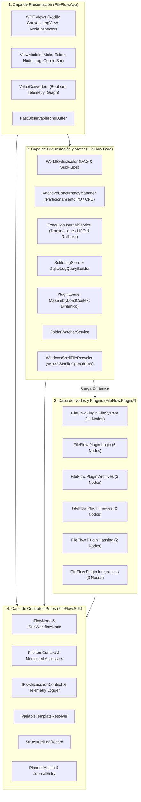

# Especificaciones Técnicas y Funcionales del Sistema (SRS)
## **FileFlow Studio v2.0**
*Plataforma de Automatización y Procesamiento de Flujos de Archivos por Lotes en .NET 9 y C# 13*

---

## 1. Información General y Alcance del Documento

### 1.1. Propósito
El presente documento define las **especificaciones técnicas, funcionales, de arquitectura, de seguridad y de rendimiento** de **FileFlow Studio**. Proporciona una referencia formal y exhaustiva del comportamiento del motor de ejecución de flujos (DAG), contratos del SDK, catálogo de nodos, sistema de telemetría de ultra-alto rendimiento y la interfaz gráfica de usuario.

### 1.2. Alcance del Sistema
FileFlow Studio es un entorno de escritorio de alto rendimiento para la automatización, transformación, enrutamiento, validación criptográfica y procesamiento masivo de archivos locales y en red. Permite a ingenieros de sistemas, administradores y usuarios avanzados diseñar flujos visuales (tipo *n8n* / *Node-RED* / *ComfyUI*), simularlos de forma segura mediante *Dry Run*, depurarlos con *breakpoints* y ejecutarlos de manera concurrente y asíncrona con capacidad de reversión transaccional (*Rollback*).

---

## 2. Pila Tecnológica y Requisitos de Entorno

| Componente / Capa | Tecnología / Versión | Justificación Técnica |
| :--- | :--- | :--- |
| **Framework Base** | `.NET 9.0` (`net9.0` / `net9.0-windows`) | Optimización de memoria, mejoras de rendimiento JIT/AOT y soporte a largo plazo. |
| **Lenguaje** | `C# 13` (`<LangVersion>13</LangVersion>`) | Colecciones de expresión (`[]`), `ref struct`, primitivas `System.Threading.Lock`, y pattern matching avanzado. |
| **Nullability** | `<Nullable>enable</Nullable>` | Seguridad en tiempo de compilación y prevención estricta de `NullReferenceException`. |
| **Interfaz de Usuario (GUI)** | `WPF` + `Nodify 6.0` + `CommunityToolkit.Mvvm 8.3` | Renderizado acelerado por hardware para grafos nodales masivos y arquitectura MVVM limpia. |
| **I/O y Concurrencia** | `System.Threading.Channels` + `ValueTask` + `CancellationToken` | Tuberías no bloqueantes de ultra-alto rendimiento con control fino de contrapresión (*backpressure*). |
| **Persistencia y Telemetría** | `Microsoft.Data.Sqlite` (In-Memory + WAL) | Almacenamiento estructurado de logs con throughput superior a 82.000 registros/segundo. |
| **Dominio: Archivos** | `SharpCompress 0.38` | Soporte multiformato (ZIP, 7z, RAR, TAR, GZ) con protección estricta contra *Zip Slip*. |
| **Dominio: Imágenes y Metadatos** | `SixLabors.ImageSharp 3.1` + `MetadataExtractor 2.8` | Procesamiento de imágenes agnóstico a plataforma y extracción integral de etiquetas EXIF/IPTC. |
| **Testing** | `xUnit 2.9` + `FluentAssertions 6.12` + `Moq 4.20` | Batería automatizada de 181 pruebas (Unitarias, Integración, Seguridad, Rendimiento). |

---

## 3. Arquitectura del Sistema y Desacoplamiento por Capas

El sistema implementa una arquitectura **Microkernel / Modular desacoplada**, organizada en 5 capas concéntricas con aislamiento estricto de dependencias:

### Reglas de Dependencias:
1. **`FileFlow.Sdk`**: Es 100% puro. Contiene contratos, modelos inmutables y utilidades de plantillas. **Prohibido** referenciar librerías externas pesadas o capas superiores.
2. **`FileFlow.Plugin.*`**: Solo pueden referenciar `FileFlow.Sdk` y sus respectivas librerías de dominio. **Prohibido** referenciar `FileFlow.Core` o `FileFlow.App`.
3. **`FileFlow.Core`**: Consume `FileFlow.Sdk` y administra el ciclo de vida, ejecución y telemetría.
4. **`FileFlow.App`**: Ensambla el grafo visual y conecta los eventos del usuario con `FileFlow.Core`.

---

## 4. Especificaciones del SDK y Modelo de Dominio (`FileFlow.Sdk`)

### 4.1. `FileItemContext` (Unidad Atómica en Tránsito)
Es el contenedor de datos que fluye entre los pines de los nodos:
- **`Guid Id`**: Identificador único global inmutable.
- **`string OriginalPath`**: Ruta original del archivo al entrar en el pipeline.
- **`string CurrentPath`**: Ruta actual mutada tras operaciones de renombrado/movimiento.
- **`long SizeBytes`**: Tamaño en bytes del archivo.
- **`DateTime CreatedAtUtc`**: Marca temporal de entrada.
- **`Dictionary<string, object?> Variables`**: Variables dinámicas inyectadas durante la ejecución.
- **`Dictionary<string, object?> Metadata`**: Metadatos extraídos (`Exif:*`, `Hash:*`, `Cli:*`, `Doc:*`).
- **Accesores Memoizados (*Zero-Allocation Hot Paths*)**:
  - `IdString` y `ShortIdString` (primeros 8 caracteres de `Id` cacheados).
  - `FileName` y `FileExtension` (actualizados reactivamente ante cambios en `CurrentPath`).
- **`FileItemContext DeepClone()`**: Realiza una copia profunda completa para bifurcaciones seguras en puertos múltiples.

### 4.2. Contrato de Nodo (`IFlowNode`)
- **`string Id`**, **`string Name`**, **`string Category`**, **`string Description`**.
- **`IReadOnlyList<NodePinDefinition> Inputs`** / **`Outputs`**.
- **`ValueTask ExecuteAsync(FileItemContext item, IFlowExecutionContext context)`**: Ejecución no bloqueante que propaga obligatoriamente `context.CancellationToken`.
- **`ValidationResult ValidateConfiguration()`**: Verificación de parámetros antes del arranque.

### 4.3. Motor de Plantillas (`VariableTemplateResolver`)
Resuelve tokens dinámicos en rutas y cadenas de texto con la sintaxis `{Dominio:Clave[:Parametros]}`:
- `{Date:yyyy-MM-dd}`: Formateo de fecha y hora.
- `{Exif:DateTaken}`, `{Exif:CameraModel}`, `{Exif:GPS}`: Metadatos fotográficos.
- `{Hash:SHA256:8}`, `{Hash:MD5}`: Algoritmo y longitud del truncado.
- `{FileSize:MB}`, `{FileSize:Auto}`: Conversión automática de tamaños.
- `{Env:NOMBRE_VAR}`: Variables de entorno del sistema operativo.
- `{Regex:Grupo}`: Capturas de expresiones regulares previas.
- Sanitización automática frente a caracteres ilegales (`Path.GetInvalidFileNameChars`).

---

## 5. Catálogo Exhaustivo de los 27 Nodos del Sistema

### 5.1. Módulo: `FileFlow.Plugin.FileSystem` (12 Nodos)
| Nodo | Categoría | Entradas | Salidas | Parámetros Principales | Funcionalidad |
| :--- | :--- | :--- | :--- | :--- | :--- |
| **`FolderSourceNode`** | Trigger | — | `Out` | `SourcePath`, `Recursive`, `WatchRealtime`, `SearchPattern` | Escanea directorios y emite elementos asíncronamente. |
| **`DestinationSinkNode`** | Sink | `In` | `Done` | `DestinationRoot`, `ConflictStrategy` (Overwrite, Skip, RenameIncremental) | Escribe o consolida el archivo en el directorio destino final. |
| **`AdvancedRenamerNode`** | Transformer | `In` | `Out`, `Error` | `Pattern`, `CollisionStrategy`, `PreserveExtension` | Renombrado masivo con tokens dinámicos y sanitización. |
| **`FileRelocatorNode`** | Action | `In` | `Out`, `Error` | `TargetDirectory`, `OperationType` (Move, Copy, HardLink), `VerifyChecksum` | Reubicación de archivos con verificación opcional de integridad SHA-256. |
| **`SafeRecycleDeleteNode`** | Action | `In` | `Out`, `Error` | `DeleteOriginal`, `UseShellRecycleBin` | Borrado seguro con envío a la Papelera de reciclaje de Windows (`SHFileOperationW`). |
| **`OriginalFileActionNode`** | Lifecycle | `In` | `Out`, `Error` | `ActionType` (Keep, MoveToRecycleBin, MoveToQuarantine), `QuarantinePath` | Aplica la política de ciclo de vida al archivo inicial tras culminar el flujo. |
| **`OperationReportNode`** | Reporting / Diagnostic | `In` | `Out`, `Report`, `Error` | `ReportFormat` (HTML, MD, TXT, JSON, CSV), `ReportScope`, `GroupBy` (Directory, Flat, Extension, Status), `DestinationFolder`, `ReportFileName`, `Theme`, `AutoOpenReport` | Genera reportes visuales interactivos con acordeón jerárquico por directorios y trazabilidad de operaciones. |
| **`DirectoryInspectorNode`** | Router | `In` | `SingleArchive`, `MixedContent`, `DirectoriesOnly` | — | Inspecciona si un directorio contiene únicamente un comprimido o archivos mixtos. |
| **`EmptyDirectoryCleanerNode`** | Cleanup | `In` | `Out` | `TargetDirectory`, `Recursive`, `DeleteRootIfEmpty` | Limpieza determinista de carpetas vacías tras procesamientos. |
| **`DocumentProcessorNode`** | Enricher | `In` | `Out` | `ExtractLineCount`, `DetectDocType` | Extracción de metadatos de documentos (.pdf, .txt, .docx, .csv, .json). |
| **`VariableInjectorNode`** | Enricher | `In` | `Out` | `Variables` (Diccionario de clave/valor con soporte de plantillas) | Inyecta variables personalizadas en `FileItemContext.Variables`. |
| **`LogOutputNode`** | Diagnostic | `In` | `Out` | `LogLevel`, `MessageTemplate` | Emite trazas de depuración intermedias dentro del grafo. |

### 5.2. Módulo: `FileFlow.Plugin.Logic` (5 Nodos)
| Nodo | Categoría | Entradas | Salidas | Parámetros Principales | Funcionalidad |
| :--- | :--- | :--- | :--- | :--- | :--- |
| **`SwitchCaseNode`** | Router | `In` | `Default`, `Cases...` (Dinámicos) | `EvaluationProperty`, `Cases` (Lista de patrones) | Enrutamiento condicional múltiple basado en expresiones o metadatos. |
| **`ExpressionFilterNode`** | Filter | `In` | `Matched`, `Unmatched` | `Property`, `Operator` (Equal, Contains, GreaterThan, Regex), `TargetValue` | Filtro booleano para desviar archivos según condiciones lógicas. |
| **`BatchBufferNode`** | Flow Control | `In` | `Out` | `BatchSize`, `TimeoutMs` | Agrupa elementos individuales en lotes antes de liberarlos. |
| **`ForkJoinBarrierNode`** | Synchronization | `Branch1`, `Branch2` | `Joined` | `RequiredBranchesCount`, `TimeoutSeconds` | Barrera de sincronización que espera la culminación de ramas concurrentes. |
| **`ThrottleDelayNode`** | Flow Control | `In` | `Out` | `DelayMilliseconds` | Control de velocidad y contrapresión para evitar saturación de I/O. |

### 5.3. Módulo: `FileFlow.Plugin.Archives` (3 Nodos)
| Nodo | Categoría | Entradas | Salidas | Parámetros Principales | Funcionalidad |
| :--- | :--- | :--- | :--- | :--- | :--- |
| **`SmartUnpackNode`** | Transformer | `In` | `Out`, `Error` | `CleanWrapper`, `AutoDeleteAfterExtraction`, `DestinationFolder` | Descompresión inteligente: detecta *folder wrappers* evitando carpetas anidadas redundantes y neutraliza ataques Zip Slip. |
| **`ArchiveCompressorNode`** | Transformer | `In` | `Out`, `Error` | `ArchiveFormat` (Zip, TarGz, SevenZip), `CompressionLevel`, `TargetPath` | Empaqueta y comprime archivos o lotes calculando ratios de compresión. |
| **`ArchiveFilterNode`** | Filter | `In` | `PrimaryArchive`, `SecondaryPart`, `RegularFile` | — | Discrimina entre partes primarias (.part01.rar, .z01) y secundarias para evitar descompresiones duplicadas. |

### 5.4. Módulo: `FileFlow.Plugin.Images` (2 Nodos)
| Nodo | Categoría | Entradas | Salidas | Parámetros Principales | Funcionalidad |
| :--- | :--- | :--- | :--- | :--- | :--- |
| **`ExifMetadataNode`** | Enricher | `In` | `Out` | `FallbackToCreationDate`, `ExtractGps` | Extrae metadatos EXIF fotográficos (`DateTaken`, `CameraModel`, `Orientation`, `Resolution`) a `FileItemContext.Metadata`. |
| **`ImageOptimizerNode`** | Transformer | `In` | `Out`, `Error` | `MaxWidth`, `MaxHeight`, `TargetFormat` (WebP, Jpeg, Png), `Quality` (1-100) | Redimensionamiento proporcional y compresión de imágenes con cálculo de ahorro de espacio (%) |

### 5.5. Módulo: `FileFlow.Plugin.Hashing` (2 Nodos)
| Nodo | Categoría | Entradas | Salidas | Parámetros Principales | Funcionalidad |
| :--- | :--- | :--- | :--- | :--- | :--- |
| **`HashCalculatorNode`** | Enricher | `In` | `Out` | `Algorithm` (SHA256, SHA512, MD5), `MetadataKey` | Calcula la suma de comprobación criptográfica y la asocia a metadatos. |
| **`DeduplicationFilterNode`** | Filter | `In` | `Unique`, `Duplicate` | `HashAlgorithm`, `Scope` (Session, PersistentDb) | Detecta y desvía archivos duplicados en base a su hash de contenido. |

### 5.6. Módulo: `FileFlow.Plugin.Integrations` (3 Nodos)
| Nodo | Categoría | Entradas | Salidas | Parámetros Principales | Funcionalidad |
| :--- | :--- | :--- | :--- | :--- | :--- |
| **`CliExecutionNode`** | Integration | `In` | `Out`, `Error` | `ExecutablePath`, `ArgumentsTemplate`, `TimeoutSeconds`, `CaptureStdOut` | Ejecuta binarios externos del sistema operativo sustituyendo tokens en tiempo de ejecución. |
| **`WebhookNotificationNode`** | Integration | `In` | `Out`, `Error` | `Url`, `HttpMethod`, `PayloadTemplate`, `CustomHeaders` | Envío de notificaciones HTTP REST asíncronas con payloads JSON contextuales. |
| **`MediaTranscoderNode`** | Media | `In` | `Out`, `Error` | `Preset` (H264, H265, WebM, MP3), `QualityPreset`, `FfmpegPath` | Transcodificación de vídeo y audio aprovechando hardware y perfiles optimizados. |

---

## 6. Motor de Ejecución y Orquestación (`FileFlow.Core`)

### 6.1. Validación y Ordenamiento Topológico (DAG)
- `GraphValidator`: Detecta ciclos en el grafo, valida que los tipos de puertos conectados sean compatibles y genera el orden topológico de ejecución mediante el algoritmo de Kahn.
- `WorkflowExecutor`: Orquestador asíncrono que distribuye elementos a través de canales concurrentes (`Channel<FileItemContext>`).

### 6.2. Modos de Ejecución
1. **Modo Normal (Live Execution)**: Ejecución real con operaciones I/O efectivas en disco y red.
2. **Modo Simulación Virtual (*Dry Run*)**:
   - `context.IsDryRun = true`.
   - Los nodos no modifican el sistema de archivos real; en su lugar, emiten `PlannedAction` describiendo la operación prevista (ej. *"Se renombraría imagen.jpg a 2026-08-31_imagen.jpg"*).
   - Generación de un reporte previo de impacto sin riesgo de corrupción o pérdida de datos.
3. **Modo Depuración (*Debug Session con Breakpoints*)**:
   - Soporte de puntos de interrupción visuales por nodo (`IsBreakpointEnabled`).
   - Pausa reactiva del motor, inspección de `FileItemContext` en tránsito y avance paso a paso (*Step Next*).

### 6.3. Transaccionalidad y Reversión (*Rollback LIFO*)
- `ExecutionJournalService`: Registra cada mutación de archivo en un diario inmutable como `JournalEntry`.
- Cada entrada almacena los parámetros originales y el delegado de reversión correspondiente.
- **Rollback Atómico**: En caso de fallo o a petición del usuario, el motor ejecuta las acciones inversas en orden estrictamente inverso (LIFO), restaurando rutas, nombres y archivos eliminados de la Papelera.

### 6.4. Gestión Adaptativa de Concurrencia (`AdaptiveConcurrencyManager`)
- Particiona los límites de concurrencia distinguiendo entre operaciones intensivas en CPU (Hashing, Transcodificación, Optimización) y operaciones intensivas en I/O de disco.
- Mantiene semáforos independientes por letra de unidad/volumen físico para evitar la degradación por contención de cabezales en discos mecánicos o saturación de buses PCIe.

---

## 7. Sistema de Telemetría y Observabilidad de Alto Rendimiento

### 7.1. Arquitectura de Logs Híbrida (Canales + SQLite In-Memory)
- **Ingestión Asíncrona Zero-Wait**: `SqliteLogStore` consume registros a través de un `Channel<StructuredLogRecord>` de escritura ultra-rápida.
- **Throughput**: Más de **82.000 logs/segundo** en pruebas de estrés multinúcleo.
- **Consultas Parametrizadas**: `SqliteLogQueryBuilder` permite filtrado en tiempo real por nivel exacto (`Debug`, `Information`, `Warning`, `Error`), texto libre, rango de fechas o identificador de archivo en sub-milisegundos.

### 7.2. Silenciado Selectivo de Telemetría por Nodo
- Cada nodo en el lienzo dispone de un interruptor interactivo (`IsLoggingEnabled`) en su cabecera.
- Si un nodo de alta frecuencia está silenciado, `WorkflowExecutor` descarta sus logs en tiempo $O(1)$ sin generar asignaciones de memoria ni interactuar con la base de datos.

---

## 8. Especificaciones de la Interfaz de Usuario (`FileFlow.App`)

### 8.1. Componentes Principales de la UI
1. **Lienzo de Grafo (Nodify Canvas - `EditorView.xaml`)**:
   - Soporte de paneo infinito, zoom suave y conexiones visuales Bezier.
   - Badges interactivos en los cables que reflejan el número de elementos transferidos en tiempo real.
   - Gestión de **Sub-flujos y Macros Multinivel**: Navegación jerárquica mediante barra de migas de pan (*Breadcrumbs*).
2. **Barra de Control (`ControlBarView.xaml`)**:
   - Botones reactivos: *Ejecutar*, *Simular (Dry Run)*, *Pausar*, *Detener*, *Rollback*.
   - Selector de nivel de paralelismo y visualización de progreso global.
3. **Caja de Herramientas (`ToolboxView.xaml`)**:
   - Catálogo clasificado por categorías con buscador reactivo y funcionalidad Drag & Drop hacia el lienzo.
4. **Inspector de Nodo (`NodeInspectorView.xaml`)**:
   - Edición contextual de propiedades, rutas, expresiones regulares y cadenas de plantillas.
5. **Consola de Telemetría (`LogView.xaml`)**:
   - Renderizado ultrarrápido con `FastObservableRingBuffer` (eliminando cuellos de botella $O(n)$).
   - Filtros por severidad con contadores en tiempo real (`Todos`, `Errores`, `Warn`, `Info`, `Debug`).
   - Badges de color translúcidos tipo IDE con alineación vertical perfecta y botón de exportación.

---

## 9. Especificaciones de Seguridad y Resiliencia

1. **Prevención de Zip Slip**: Validación estricta de rutas canónicas en `SmartUnpackNode` mediante `Path.GetFullPath` asegurando el separador de directorio final (`Path.DirectorySeparatorChar`).
2. **Borrado Seguro No Destructivo**: Eliminación del fallback destructivo `File.Delete` en `SafeRecycleDeleteNode`. Integración nativa con la Papelera de Windows (`FOF_ALLOWUNDO`).
3. **Sanitización de Nombres de Archivo**: Reemplazo determinista de caracteres inválidos en `AdvancedRenamerNode`.
4. **Persistencia de Errores Críticos**: Captura de excepciones globales en `App.xaml.cs` (`DispatcherUnhandledException`, `AppDomain.UnhandledException`, `TaskScheduler.UnobservedTaskException`) con persistencia automática en `crash.log`.
5. **Drenaje Limpio de Recursos**: Implementación estricta del patrón `IAsyncDisposable` / `IDisposable` en todos los servicios de fondo y canales de ingestión.

---

## 10. Batería de Pruebas y Criterios de Aceptación

El sistema cuenta con una suite de pruebas automatizadas en `FileFlow.Tests` estructurada en:
- **Pruebas Unitarias**: Validación individual de los 26 nodos, resolución de plantillas y modelos de datos.
- **Pruebas de Integración**: Flujos completos de descompresión, renombrado, hashing y reversión transaccional.
- **Pruebas de Seguridad**: Detección de Zip Slip y archivos huérfanos.
- **Pruebas de Rendimiento y Estrés**: Validación de throughput de logs (>82k logs/s) y concurrencia sin condiciones de carrera.

**Estado Actual de Calidad:**
- **Compilación:** 0 Advertencias, 0 Errores.
- **Pruebas:** 181 / 181 Pruebas Pasadas con Éxito (100%).
