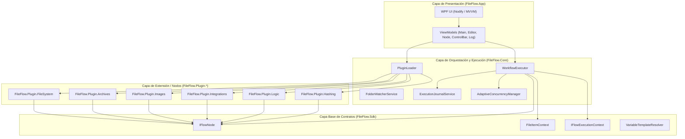
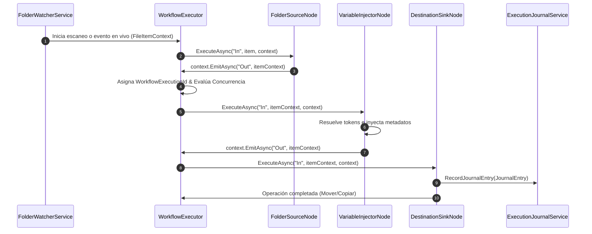

# Arquitectura y Diseño Técnico - FileFlow Studio

## 1. Visión General del Sistema

**FileFlow Studio** es una plataforma de automatización y procesamiento masivo de archivos (*Batch File Processing & Workflow Automation System*) construida en **C# 13**, **.NET 9** y **WPF (Windows Presentation Foundation)**. El sistema permite diseñar, simular, depurar y ejecutar flujos de trabajo visuales basados en grafos dirigidos (DAG - *Directed Acyclic Graphs* y tuberías reactivas con sub-grafos).

El proyecto se rige por un **desacoplamiento estricto por capas**, asegurando que los contratos base (`FileFlow.Sdk`) sean puros y reutilizables, independientes de la lógica de presentación o dependencias externas pesadas.

---

## 2. Diagrama de Arquitectura del Sistema

---

## 3. Flujo de Datos Principal (Data Flow Pipeline)

---

## 4. Descripción de Capas y Módulos

### 4.1 `FileFlow.Sdk` (Capa Base de Contratos)
- **Propósito:** Definir los tipos primitivos y contratos puros de la aplicación.
- **Regla Estricta:** Cero dependencias de UI o librerías de terceros.
- **Componentes Clave:**
  - `FileItemContext`: Inmutable/transmutable record que encapsula la ruta actual, ruta original, tamaño en bytes, diccionario de metadatos (`Metadata`) y registro de ejecución (`ExecutionLog`).
  - `IFlowNode`: Interfaz base que deben implementar todos los nodos de procesamiento.
  - `IFlowExecutionContext`: Interfaz que expone servicios del motor al nodo durante la ejecución (`EmitAsync`, `Log`, `ReportProgress`, `RegisterPlannedAction`, `RecordJournalEntry`).
  - `VariableTemplateResolver`: Motor de interpolación de variables dinámicas (`{FileName}`, `{DateNow}`, `{Exif:Width}`, funciones de texto y fecha).

### 4.2 `FileFlow.Core` (Motor de Ejecución Asíncrono)
- **Propósito:** Orquestar la topología del grafo, administrar la concurrencia y controlar el estado de simulación (*Dry Run*) y rollback (*Journaling*).
- **Componentes Clave:**
  - `WorkflowExecutor`: Recorre el grafo topológico (`GraphValidator`), gestiona la concurrencia paralela (`SemaphoreSlim`) y coordina el despacho de eventos.
  - `PluginLoader`: Descubre y carga dinámicamente ensamblados `.dll` dentro de un contexto aislado `PluginAssemblyLoadContext`.
  - `FolderWatcherService`: Supervisión de carpetas en tiempo real con mecanismo de *debounce* anti-colisión para garantizar que los archivos hayan finalizado su escritura en disco antes de ser procesados.
  - `ExecutionJournalService`: Sistema de transacciones LIFO que permite revertir (*rollback*) operaciones físicas sobre archivos.

### 4.3 `FileFlow.Plugin.*` (Ecosistema Modular de Nodos)
- **`FileFlow.Plugin.FileSystem`:** Nodos de E/S de disco (`FolderSourceNode`, `DestinationSinkNode`, `AdvancedRenamerNode`, `FileRelocatorNode`, `SafeRecycleDeleteNode`, `EmptyDirectoryCleanerNode`).
- **`FileFlow.Plugin.Archives`:** Descompresión y compresión inteligente (`SmartUnpackNode`, `ArchiveCompressorNode`, `ArchiveFilterNode`).
- **`FileFlow.Plugin.Images`:** Optimización y lectura de metadatos EXIF (`ImageOptimizerNode`, `ExifMetadataNode`).
- **`FileFlow.Plugin.Integrations`:** Integración con procesos externos y red (`CliExecutionNode`, `MediaTranscoderNode`, `WebhookNotificationNode`, `DocumentProcessorNode`).
- **`FileFlow.Plugin.Logic`:** Control de flujo e iteración (`SwitchCaseNode`, `ExpressionFilterNode`, `BatchBufferNode`, `ThrottleDelayNode`, `ForkJoinBarrierNode`).
- **`FileFlow.Plugin.Hashing`:** Cálculo de hashes e integridad criptográfica (`HashCalculatorNode`, `DeduplicationFilterNode`).

### 4.4 `FileFlow.App` (Interfaz Gráfica WPF)
- **Propósito:** Proporcionar una experiencia de usuario moderna estilo *Fluent Design* basada en el patrón MVVM y la librería Nodify.
- **Componentes Clave:**
  - `MainViewModel`: ViewModel raíz que integra la barra de herramientas, lienzo de nodos, panel de inspección, consola y barra de estado.
  - `EditorViewModel`: Administra la colección visual de nodos, conexiones y navegación por migas de pan (*Breadcrumbs*) para sub-flujos.
  - `ThemeManager` & `WindowThemeHelper`: Sistema de tematización en tiempo real (`Dark`, `Light`, `Cyber`, `Pastel`) con sincronización nativa de la barra de título Windows DWM (`DwmSetWindowAttribute`).

---

## 5. Patrones de Diseño Utilizados

1. **Plugin Architecture Pattern:** Descubrimiento dinámico de nodos mediante atributos de reflexión (`[NodeDefinition]`) e inyección en runtime.
2. **Pipeline & Pipeline Broker Pattern:** Flujo de ejecución mediante tuberías asíncronas encadenadas por puertos (`Inputs` y `Outputs`).
3. **MVVM (Model-View-ViewModel):** Separación completa entre lógica de negocio y vista con `CommunityToolkit.Mvvm`.
4. **Command & Journal Pattern:** Registro inmutable de acciones (`JournalEntry`) con delegado inverso para rollback.
5. **Thread-Safe Reactive Buffer:** Uso de `ConcurrentQueue` y temporizadores en hilo UI para streaming fluido de logs a 20 FPS sin congelamientos.

---

## 6. Architecture Decision Records (ADRs)

### ADR-001: Desacoplamiento Absoluto de `FileFlow.Sdk`
- **Estatus:** Aprobado e Implementado.
- **Contexto:** Se requiere un motor modular donde se puedan crear nodos sin acoplarse a WPF o librerías pesadas.
- **Decisión:** `FileFlow.Sdk` depende exclusivamente de primitivas de .NET 9 (`net9.0`). No importa paquetes NuGet externos.
- **Consecuencia:** Cero riesgos de conflictos de dependencias en plugins de terceros.

### ADR-002: Ejecución Concurrente Basada en Semáforo Adaptativo
- **Estatus:** Aprobado e Implementado.
- **Contexto:** Procesar miles de archivos simultáneamente puede saturar los hilos de CPU e I/O de disco.
- **Decisión:** Integrar `SemaphoreSlim` (`_concurrencyThrottle`) configurable por el usuario (`MaxDegreeOfParallelism`) en `WorkflowExecutor`.
- **Consecuencia:** Rendimiento óptimo sin saturar el sistema ni provocar bloqueos por agotamiento de recursos.

### ADR-003: Renderizado de Registro Asíncrono de Consola de Logs
- **Estatus:** Aprobado e Implementado.
- **Contexto:** El despacho síncrono por cada línea de log en flujos masivos de 10,000 elementos congelaba la interfaz WPF.
- **Decisión:** Acumular registros en una cola thread-safe (`ConcurrentQueue<LogEntry>`) y vaciarlos periódicamente a la UI mediante un `DispatcherTimer` de baja prioridad (50ms / 20 FPS).
- **Consecuencia:** Transmisión fluida de logs en tiempo real sin bloquear la interfaz.
