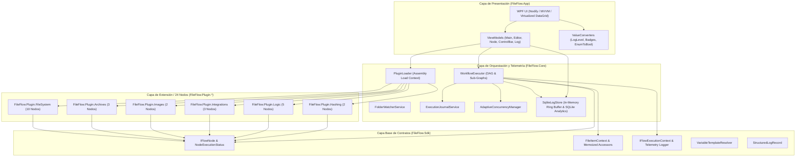
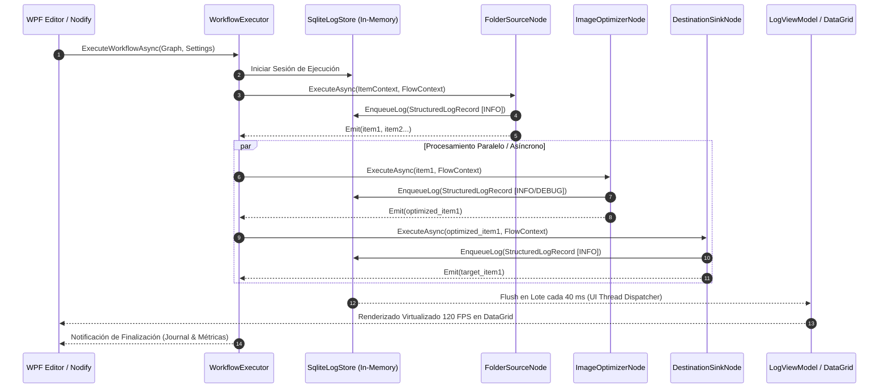

# Arquitectura y Diseño Técnico - FileFlow Studio

## 1. Visión General del Sistema

**FileFlow Studio** es una plataforma de automatización y procesamiento masivo de archivos (*Batch File Processing & Workflow Automation System*) desarrollada con **C# 13**, **.NET 9** y **WPF (Windows Presentation Foundation)**. El sistema permite diseñar, simular, depurar y ejecutar flujos de trabajo visuales basados en grafos dirigidos (DAG - *Directed Acyclic Graphs*, tuberías reactivas con buffers, bifurcaciones de control y barreras de sincronización).

El proyecto se rige por un **desacoplamiento estricto por capas**, asegurando que los contratos base (`FileFlow.Sdk`) sean puros y reutilizables, independientes de la lógica de presentación o dependencias externas pesadas.

---

## 2. Diagrama de Arquitectura del Sistema

---

## 3. Flujo de Datos Principal (Data Flow Pipeline)

---

## 4. Descripción de Módulos y Capas

### 4.1. `FileFlow.Sdk` (Capa de Contratos Puros)
- **Propósito**: Define los contratos de interfaces, modelos de dominio fundamentales y utilidades compartidas. Cero dependencias externas pesadas.
- **Componentes Clave**:
  - `IFlowNode`: Contrato unificado que deben implementar todos los nodos ejecutables (`ExecuteAsync`, `ValidateConfiguration`, `Category`, `Inputs`, `Outputs`).
  - `FileItemContext`: Encapsula el ciclo de vida de un archivo en el grafo (`Id`, `OriginalPath`, `CurrentPath`, `Size`, `Variables`, `Metadata`). Incluye memoización zero-alloc para `IdString`, `ShortIdString` y resolución reactiva de `FileName`.
  - `IFlowExecutionContext`: Proporciona al nodo acceso al token de cancelación (`CancellationToken`), resolución de variables, almacenamiento de estado en memoria compartida, emisión de elementos y telemetría estructurada (`context.Log`).
  - `StructuredLogRecord`: Registro inmutable con metadatos de ejecución, timestamps precisos, identificador de nodo, `ItemId`, `DurationMs`, tamaño y payload `DetailsJson`.
  - `VariableTemplateResolver`: Motor de interpolación de cadenas que sustituye sintaxis `{Ext}`, `{FileName}`, `{Date:yyyy-MM-dd}`, `{SizeMB}`, `{Hash:sha256}` y variables inyectadas.

### 4.2. `FileFlow.Core` (Capa de Orquestación y Telemetría)
- **Propósito**: Ejecución determinista del DAG, resolución de dependencias topológicas, paralelismo adaptativo y almacenamiento analítico de logs.
- **Componentes Clave**:
  - `WorkflowExecutor`: Motor de ejecución asíncrono no bloqueante con soporte para sub-grafos, paralelismo multinúcleo configurable, puntos de interrupción (*Breakpoints*) y silenciado selectivo de logs.
  - `SqliteLogStore`: Motor analítico y almacén de logs estructurados en memoria de ultra-alto rendimiento basado en SQLite (`:memory:`). Emplea canal no bloqueante `Channel<StructuredLogRecord>`, inserción transaccional por lotes en una conexión persistente `_keepAliveConnection` protegida por `System.Threading.Lock`, alcanzando más de 82.000 logs/segundo.
  - `PluginLoader`: Cargador dinámico de extensiones basado en `AssemblyLoadContext` aislado, capaz de descubrir e instanciar nodos desde ensamblados externos.
  - `FolderWatcherService`: Servicio de monitorización reactiva de directorios basado en `FileSystemWatcher` con amortiguación anti-rebote (*debounce*) y control de bloqueo de lectura.
  - `ExecutionJournalService`: Sistema de auditoría y persistencia histórica de ejecuciones y transacciones atómicas.
  - `AdaptiveConcurrencyManager`: Ajusta dinámicamente el número de tareas concurrentes según la saturación de I/O y CPU.

### 4.3. `FileFlow.Plugin.*` (Capa de Plugins y Nodos de Producción)
Colección modular de 24 nodos de procesamiento organizados por dominio:
1. **`FileFlow.Plugin.FileSystem` (10 Nodos)**: `FolderSourceNode`, `DestinationSinkNode`, `FileRelocatorNode`, `AdvancedRenamerNode`, `DocumentProcessorNode`, `DirectoryInspectorNode`, `EmptyDirectoryCleanerNode`, `SafeRecycleDeleteNode`, `OriginalFileActionNode`, `VariableInjectorNode`.
2. **`FileFlow.Plugin.Archives` (3 Nodos)**: `SmartUnpackNode` (descompresión inteligente auto-aplanado), `ArchiveCompressorNode` (Zip, Tar, GZip, 7z, BZip2 con ratios de compresión), `ArchiveFilterNode` (detección de partes .r00, .part1).
3. **`FileFlow.Plugin.Images` (2 Nodos)**: `ImageOptimizerNode` (redimensionamiento, calidad WebP/JPEG/PNG y métricas de ahorro %), `ExifMetadataNode` (extracción estructurada de metadatos de cámara y geolocalización).
4. **`FileFlow.Plugin.Integrations` (3 Nodos)**: `CliExecutionNode` (subprocesos externos asíncronos), `WebhookNotificationNode` (notificaciones HTTP POST/PUT con payloads JSON dinámicos), `MediaTranscoderNode` (transcodificación de audio/video con FFmpeg y telemetría periódica).
5. **`FileFlow.Plugin.Logic` (5 Nodos)**: `SwitchCaseNode` (enrutamiento condicional multi-rama), `ExpressionFilterNode` (evaluador de expresiones booleanas), `ThrottleDelayNode` (control de caudal temporal), `BatchBufferNode` (acumulación por lotes/tamaño), `ForkJoinBarrierNode` (sincronización de ramas paralelas).
6. **`FileFlow.Plugin.Hashing` (2 Nodos)**: `HashCalculatorNode` (MD5, SHA1, SHA256, SHA384, SHA512, xxHash3, xxHash64), `DeduplicationFilterNode` (detección de duplicados en tiempo real por firma criptográfica).

### 4.4. `FileFlow.App` (Capa de Presentación WPF / MVVM)
- **Propósito**: Interfaz de usuario rica, reactiva y accesible construida sobre el patrón MVVM y la biblioteca de grafos Nodify.
- **Componentes Clave**:
  - `EditorView` & `EditorViewModel`: Lienzo visual interactivo con soporte de drag & drop, conexión de pines, zoom infinito, minimapa y control visual de ejecución.
  - `LogView` & `LogViewModel`: Consola de telemetría moderna y compacta con virtualización completa (`Recycling`), selector de filtros por severidad con contadores en vivo, input de búsqueda instantáneo con borrado rápido (`✕`), pill badges translúcidos, alineación vertical uniforme (`RowHeight="24"`), y acordeón de detalles JSON con botón de **Trazabilidad** por `#ShortItemId`.
  - `NodeCardView` & `NodeViewModel`: Tarjetas visuales de nodo con controles de cabecera: Toggle de Breakpoint (rojo) y Toggle de Silenciado de Logs (`≡` cian brillante / gris atenuado).

---

## 5. Registros de Decisiones Arquitectónicas (ADRs)

### ADR-001: Adopción de .NET 9 y C# 13
- **Contexto**: El procesamiento masivo de archivos requiere máxima eficiencia de memoria, paralelismo sin sobrecarga y sincronización ligera.
- **Decisión**: Utilizar `net9.0` con `<LangVersion>13</LangVersion>`, `<Nullable>enable</Nullable>` y las nuevas primitivas `System.Threading.Lock`.
- **Consecuencias**: Código más seguro frente a nulos, menor presión en el Garbage Collector y rendimiento I/O optimizado mediante `ValueTask` y `IAsyncEnumerable`.

### ADR-002: Telemetría Analítica en Memoria con SQLite In-Memory
- **Contexto**: Mostrar cientos de miles de registros de logs en un DataGrid sin congelar la UI y permitiendo búsquedas instantáneas por texto, nodo, archivo o ID de flujo.
- **Decisión**: Implementar `SqliteLogStore` con base de datos en memoria (`Data Source=:memory:;Mode=Memory;Cache=Shared`), canalización asíncrona `System.Threading.Channels.Channel` e inserciones transaccionales por lotes reutilizando una conexión persistente.
- **Consecuencias**: Búsquedas e indexación instantáneas sin I/O en disco, rendimiento >82.000 logs/segundo y desacoplamiento total entre los hilos de trabajo y el hilo de la UI.

### ADR-003: Pureza Absoluta de `FileFlow.Sdk`
- **Contexto**: Los desarrolladores de plugins necesitan una base estable sin arrastrar dependencias pesadas de UI (WPF) o librerías externas innecesarias.
- **Decisión**: Mantener `FileFlow.Sdk` exclusivamente con dependencias del BCL estándar de .NET.
- **Consecuencias**: Facilidad para crear nuevos plugins, pruebas unitarias ultrarrápidas y arquitectura desacoplada y mantenible.

### ADR-004: Principio de Inmutabilidad del Archivo de Origen (*Source Immutability by Default*)
- **Contexto**: En flujos de procesamiento automatizado, modificar o sobreescribir los archivos de entrada originales por sorpresa supone un riesgo crítico de pérdida de datos del usuario.
- **Decisión**: Todos los pipelines y nodos de transformación operan de forma no destructiva por defecto. Los nodos de transformación (`ImageOptimizer`, `MediaTranscoder`, `ArchiveCompressor`, `SmartUnpack`, `AdvancedRenamer` en modo `Virtual`, `DestinationSink` con `Copy`) generan nuevos archivos en directorios independientes o proyectan nombres en memoria sin alterar el origen. Cualquier acción de modificación, traslado a cuarentena, envío a papelera o borrado del archivo original debe ser explícita y gobernada por el nodo de ciclo de vida `OriginalFileActionNode`.
- **Consecuencias**: Máxima seguridad operativa contra pérdida accidental de datos y trazabilidad transparente entre el archivo de entrada original y el artefacto generado.

### ADR-005: Localización Dinámica e Internacionalización de la Interfaz (i18n)
- **Contexto**: La aplicación debe ser accesible globalmente permitiendo cambiar entre múltiples idiomas (actualmente Español e Inglés) sin reiniciar el software ni comprometer la claridad del código técnico.
- **Decisión**: Mantener los nombres de variables, identificadores de claves (`Key`), contratos de plugins y serialización en inglés puro, mientras que la interfaz de usuario (`FileFlow.App`) proyecta exclusivamente textos localizados consumiendo `LocalizationManager.Instance` (con soporte reactivo de indexers `"Item[]"` en WPF) y diccionarios de recursos (`Strings.resx` y `Strings.es.resx`).
- **Consecuencias**: Experiencia de usuario enriquecida y natural en el idioma de preferencia, con total reactividad en caliente en pantallas, diálogos, menús y tarjetas de nodos del lienzo.

### ADR-006: Co-ubicación y Autonomía Total de Código y Recursos por Plugin (Self-Contained Plugins)
- **Contexto**: Acoplar código de nodos, ventanas modales, configuraciones o cadenas de texto localizadas (i18n) dentro del proyecto principal de la aplicación (`FileFlow.App`) viola el Principio Abierto/Cerrado (OCP), contamina la aplicación host y dificulta la creación, mantenimiento y distribución independiente de extensiones.
- **Decisión**: **Todo el código y los recursos asociados a cada plugin o nodo DEBEN residir al 100% dentro del propio directorio del plugin (`FileFlow.Plugin.*`)**. Esto incluye:
  1. Clases de nodo (`IFlowNode`) y lógica de negocio/inferencia.
  2. Ventanas modales, vistas y controles XAML propios (`UI/`).
  3. Servicios auxiliares de dominio y estrategias.
  4. Ficheros de presets o configuraciones (`Config/`).
  5. **Diccionarios de recursos localizados (`Resources/Strings.resx` y `Resources/Strings.es.resx`)** conteniendo los nombres de nodos, descripciones, tooltips y etiquetas de parámetros (`DisplayName`).
  - `FileFlow.App/Resources/` queda reservado estricta y exclusivamente para cadenas de la interfaz anfitriona (menús globales, drawer de navegación, barra de control, barra de estado, consola de logs y ajustes globales).
  - La integración de recursos es automática mediante auto-descubrimiento en `PluginLoader` y/o `IPluginInitializer`.
- **Consecuencias**: Desacoplamiento total (*Zero-Touch en FileFlow.App*). Para añadir, modificar o eliminar un plugin o nodo, únicamente se escribe código en la carpeta del plugin en cuestión, asegurando máxima modularidad y portabilidad.

### ADR-007: Arquitectura de Adaptadores de Modelo para Nodos con IA Intercambiable (Model Adapter Pattern / Zero-Assumption Ingestion)
- **Contexto**: En nodos con modelos de IA intercambiables (`FileFlow.Plugin.AI`, ej. `ObjectDetectorNode`, `PromptObjectDetectorNode`, `SmartImageClassifierNode`, `BackgroundRemoverNode`, `FaceDetectorNode`), cada arquitectura (YOLO-World / Grounding DINO, Tiny YOLOv3, YOLOv8, MobileNet, RMBG, UltraFace) posee requerimientos únicos de preprocesado (aspect ratio vs letterbox con padding, normalización de canales ImageNet vs [-1..1]), tensores de entrada auxiliares (embeddings semánticos CLIP ViT-B/32, vectores de forma de imagen) y algoritmos de decodificación/NMS. Intentar forzar un pipeline monolítico y genérico genera fallos de detección, desalineación de cajas y resultados inconsistentes.
- **Decisión**:
  1. Los nodos proporcionan un contrato canónico de entrada/salida (imagen original sin deformar, umbrales y prompts estándar en lenguaje natural).
  2. La capa de inferencia desacopla cada familia de modelo en adaptadores especializados (`IObjectDetectorAdapter`, `IImageClassifierAdapter`, `IBackgroundRemoverAdapter`, `IFaceDetectorAdapter`, `ISuperResolutionAdapter`).
  3. Factorías de auto-detección (`[Task]AdapterFactory`) examinan la metadata del grafo ONNX (`InputMetadata`, `OutputMetadata`) para enrutar la ejecución hacia el adaptador óptimo o un fallback de contingencia.
  4. Cada adaptador gestiona de forma autónoma su preprocesamiento geométrico exacto (Letterbox y des-letterbox para no distorsionar la imagen), inyección de tensores secundarios y decodificación NMS.
- **Consecuencias**: Soporte robusto y extensible para cualquier modelo de IA actual y futuro sin alterar la lógica de los nodos ni de la UI, garantizando precisión geométrica milimétrica en detecciones y segmentaciones.

