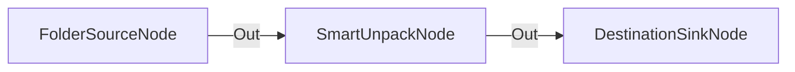

# Descompresión Automática de Paquetes ZIP/RAR/7Z

**Nivel**: 🟢 Básico  
**Archivo de Flujo Importable**: [flow_04_descompresion_directa.json](./flow_04_descompresion_directa.json)

## 🎯 Caso de Uso Real
Desempaquetar de forma automatizada archivos recibidos por descarga sin intervención manual.

## 📊 Diagrama del Flujo

## 🧩 Nodos Utilizados y Configuración
### `FolderSourceNode` (ID: `node-src`)
- **Parámetros**: 
  - *(Parámetros por defecto)*
### `SmartUnpackNode` (ID: `node-unpack`)
- **Parámetros**: 
  - `DestinationFolder`: `{RelativeDir}\Unpacked`
  - `CleanWrapper`: `True`
### `DestinationSinkNode` (ID: `node-snk`)
- **Parámetros**: 
  - *(Parámetros por defecto)*

## 🔄 Paso a Paso del Procesamiento
1. `FolderSourceNode` detecta archivos comprimidos.
2. `SmartUnpackNode` descomprime el paquete de forma limpia.
3. `DestinationSinkNode` emite los archivos extraídos a la salida.

## 📋 Requisitos Previos y Datos de Prueba
Tener archivos ZIP, RAR o 7Z de prueba.
