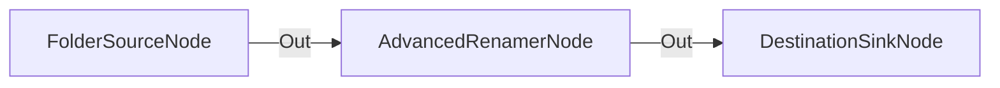

# Renombrado Estándar con Prefijo de Fecha y Año

**Nivel**: 🟢 Básico  
**Archivo de Flujo Importable**: [flow_05_renombrado_basico_fechas.json](./flow_05_renombrado_basico_fechas.json)

## 🎯 Caso de Uso Real
Normalizar nombres de archivos recibidos para mantener orden cronológico en el sistema de archivos.

## 📊 Diagrama del Flujo

## 🧩 Nodos Utilizados y Configuración
### `FolderSourceNode` (ID: `node-src`)
- **Parámetros**: 
  - *(Parámetros por defecto)*
### `AdvancedRenamerNode` (ID: `node-rename`)
- **Parámetros**: 
  - `NameTemplate`: `{Year}-{Month}-{Day}_{FileName}`
### `DestinationSinkNode` (ID: `node-snk`)
- **Parámetros**: 
  - *(Parámetros por defecto)*

## 🔄 Paso a Paso del Procesamiento
1. `FolderSourceNode` lee archivos.
2. `AdvancedRenamerNode` aplica la plantilla `{Year}-{Month}-{Day}_{FileName}`.
3. `DestinationSinkNode` almacena los archivos renombrados.

## 📋 Requisitos Previos y Datos de Prueba
Cualquier archivo de prueba.
