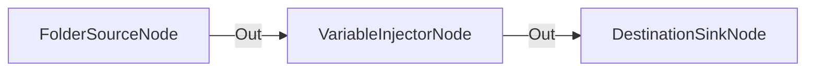

# Inyección de Variables Personalizadas en Metadatos

**Nivel**: 🟢 Básico  
**Archivo de Flujo Importable**: [flow_07_inyeccion_variables_metadatos.json](./flow_07_inyeccion_variables_metadatos.json)

## 🎯 Caso de Uso Real
Etiquetar elementos entrantes con información corporativa como departamento, entorno o proyecto.

## 📊 Diagrama del Flujo

## 🧩 Nodos Utilizados y Configuración
### `FolderSourceNode` (ID: `node-src`)
- **Parámetros**: 
  - *(Parámetros por defecto)*
### `VariableInjectorNode` (ID: `node-inj`)
- **Parámetros**: 
  - `Department`: `Engineering`
  - `Status`: `Verified`
### `DestinationSinkNode` (ID: `node-snk`)
- **Parámetros**: 
  - *(Parámetros por defecto)*

## 🔄 Paso a Paso del Procesamiento
1. `FolderSourceNode` lee archivos.
2. `VariableInjectorNode` inyecta las variables `Department=Engineering` y `Status=Verified`.
3. `DestinationSinkNode` ubica los archivos etiquetados.

## 📋 Requisitos Previos y Datos de Prueba
Archivos de cualquier tipo.
