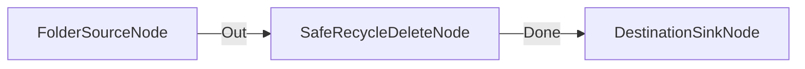

# Eliminación Segura enviando a Papelera de Reciclaje

**Nivel**: 🟢 Básico  
**Archivo de Flujo Importable**: [flow_10_papelera_reciclaje_segura.json](./flow_10_papelera_reciclaje_segura.json)

## 🎯 Caso de Uso Real
Eliminar de forma reversible archivos temporales permitiendo su recuperación si fuese necesario.

## 📊 Diagrama del Flujo

## 🧩 Nodos Utilizados y Configuración
### `FolderSourceNode` (ID: `node-src`)
- **Parámetros**: 
  - *(Parámetros por defecto)*
### `SafeRecycleDeleteNode` (ID: `node-del`)
- **Parámetros**: 
  - `UseRecycleBin`: `True`
  - `DryRun`: `False`
### `DestinationSinkNode` (ID: `node-snk`)
- **Parámetros**: 
  - *(Parámetros por defecto)*

## 🔄 Paso a Paso del Procesamiento
1. `FolderSourceNode` detecta archivos temporales.
2. `SafeRecycleDeleteNode` envía los elementos a la papelera del SO (`UseRecycleBin=true`).
3. `DestinationSinkNode` reporta el cierre del flujo.

## 📋 Requisitos Previos y Datos de Prueba
Archivos de prueba desechables.
