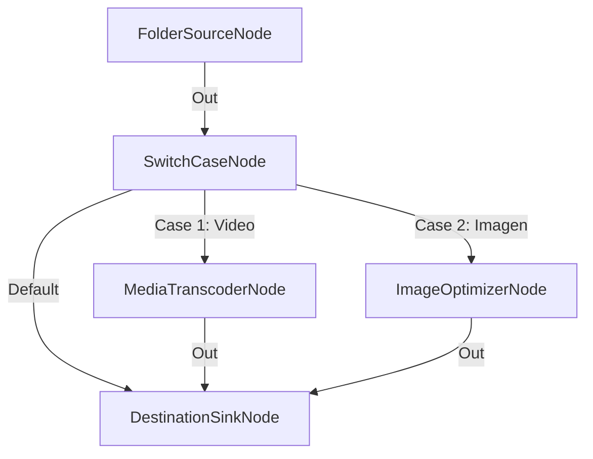

# Clasificación Multicamino por Tipo de Archivo

**Nivel**: 🟡 Intermedio  
**Archivo de Flujo Importable**: [flow_11_clasificacion_por_extension.json](./flow_11_clasificacion_por_extension.json)

## 🎯 Caso de Uso Real
Enrutar dinámicamente archivos multimedia vs imágenes vs documentos hacia sus respectivos procesadores.

## 📊 Diagrama del Flujo

## 🧩 Nodos Utilizados y Configuración
### `FolderSourceNode` (ID: `node-src`)
- **Parámetros**: 
  - *(Parámetros por defecto)*
### `SwitchCaseNode` (ID: `node-sw`)
- **Parámetros**: 
  - *(Parámetros por defecto)*
### `MediaTranscoderNode` (ID: `node-vid`)
- **Parámetros**: 
  - `Preset`: `Convertir 720p H.264 (MP4 Rápido)`
### `ImageOptimizerNode` (ID: `node-img`)
- **Parámetros**: 
  - `TargetFormat`: `WebP`
### `DestinationSinkNode` (ID: `node-snk`)
- **Parámetros**: 
  - *(Parámetros por defecto)*

## 🔄 Paso a Paso del Procesamiento
1. `FolderSourceNode` lee la carpeta de entrada.
2. `SwitchCaseNode` evalúa la extensión del archivo.
3. Los archivos de vídeo van a `MediaTranscoderNode`, las imágenes a `ImageOptimizerNode` y los demás a `DestinationSinkNode`.

## 📋 Requisitos Previos y Datos de Prueba
Carpeta de entrada con vídeos (.mp4), imágenes (.jpg) y documentos (.pdf).
