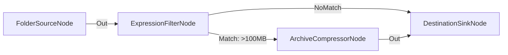

# Filtrado Condicional por Tamaño de Archivo (>100MB)

**Nivel**: 🟡 Intermedio  
**Archivo de Flujo Importable**: [flow_12_filtro_tamano_archivos.json](./flow_12_filtro_tamano_archivos.json)

## 🎯 Caso de Uso Real
Prevenir el procesamiento de archivos gigantescos enviando solo elementos menores de 100 MB a la vía rápida.

## 📊 Diagrama del Flujo

## 🧩 Nodos Utilizados y Configuración
### `FolderSourceNode` (ID: `node-src`)
- **Parámetros**: 
  - *(Parámetros por defecto)*
### `ExpressionFilterNode` (ID: `node-flt`)
- **Parámetros**: 
  - `PropertyPath`: `FileSizeBytes`
  - `Operator`: `>`
  - `TargetValue`: `104857600`
### `ArchiveCompressorNode` (ID: `node-zip`)
- **Parámetros**: 
  - *(Parámetros por defecto)*
### `DestinationSinkNode` (ID: `node-snk`)
- **Parámetros**: 
  - *(Parámetros por defecto)*

## 🔄 Paso a Paso del Procesamiento
1. `FolderSourceNode` lee archivos.
2. `ExpressionFilterNode` evalúa `FileSizeBytes > 104857600`.
3. Si cumple la condición (Match), pasa a compresión; si no (NoMatch), pasa a guardado directo.

## 📋 Requisitos Previos y Datos de Prueba
Archivos de tamaños variados.
