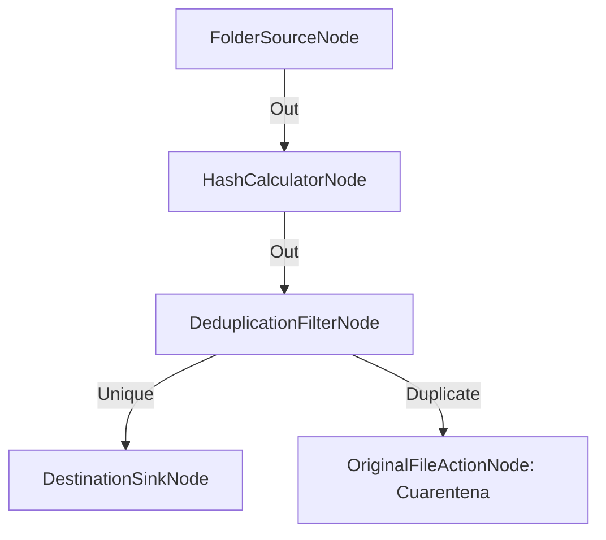

# Deduplicación de Archivos con Mover a Cuarentena

**Nivel**: 🟡 Intermedio  
**Archivo de Flujo Importable**: [flow_13_deduplicacion_por_hash.json](./flow_13_deduplicacion_por_hash.json)

## 🎯 Caso de Uso Real
Evitar guardar archivos repetidos en el servidor enviando los duplicados a cuarentena.

## 📊 Diagrama del Flujo

## 🧩 Nodos Utilizados y Configuración
### `FolderSourceNode` (ID: `node-src`)
- **Parámetros**: 
  - *(Parámetros por defecto)*
### `HashCalculatorNode` (ID: `node-hash`)
- **Parámetros**: 
  - *(Parámetros por defecto)*
### `DeduplicationFilterNode` (ID: `node-dedup`)
- **Parámetros**: 
  - *(Parámetros por defecto)*
### `DestinationSinkNode` (ID: `node-snk`)
- **Parámetros**: 
  - *(Parámetros por defecto)*
### `OriginalFileActionNode` (ID: `node-quar`)
- **Parámetros**: 
  - `ActionType`: `MoveToQuarantine`

## 🔄 Paso a Paso del Procesamiento
1. `FolderSourceNode` detecta archivos.
2. `HashCalculatorNode` calcula el hash SHA-256.
3. `DeduplicationFilterNode` compara hashes: los únicos van al destino principal, los duplicados van a `OriginalFileActionNode` en modo cuarentena.

## 📋 Requisitos Previos y Datos de Prueba
Archivos idénticos con diferentes nombres.
