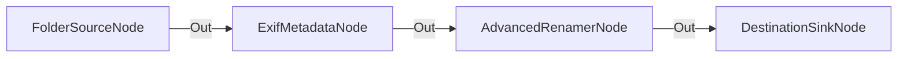

# Organización de Fotografía mediante Lectura EXIF

**Nivel**: 🟡 Intermedio  
**Archivo de Flujo Importable**: [flow_14_extraccion_exif_fotografia.json](./flow_14_extraccion_exif_fotografia.json)

## 🎯 Caso de Uso Real
Organizar colecciones de fotos en base a la fecha real de toma y modelo de cámara extraído de la metadata EXIF.

## 📊 Diagrama del Flujo

## 🧩 Nodos Utilizados y Configuración
### `FolderSourceNode` (ID: `node-src`)
- **Parámetros**: 
  - *(Parámetros por defecto)*
### `ExifMetadataNode` (ID: `node-exif`)
- **Parámetros**: 
  - `InjectCameraVars`: `True`
  - `InjectDateVars`: `True`
### `AdvancedRenamerNode` (ID: `node-ren`)
- **Parámetros**: 
  - `NameTemplate`: `{Exif:CameraModel}_{Year}-{Month}_{FileName}`
### `DestinationSinkNode` (ID: `node-snk`)
- **Parámetros**: 
  - *(Parámetros por defecto)*

## 🔄 Paso a Paso del Procesamiento
1. `FolderSourceNode` busca imágenes de cámara.
2. `ExifMetadataNode` lee metadatos EXIF (fecha, GPS, cámara).
3. `AdvancedRenamerNode` aplica la plantilla `{Exif:CameraModel}_{Exif:DateTimeOriginal}_{FileName}`.
4. `DestinationSinkNode` ubica la foto procesada.

## 📋 Requisitos Previos y Datos de Prueba
Fotografías con datos EXIF intactos.
