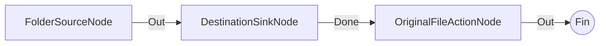

# Copia a Salida con Mantenimiento de Cuarentena Original

**Nivel**: 🟡 Intermedio  
**Archivo de Flujo Importable**: [flow_17_accion_cuarentena_originales.json](./flow_17_accion_cuarentena_originales.json)

## 🎯 Caso de Uso Real
Garantizar que los archivos procesados queden guardados antes de remover la fuente original.

## 📊 Diagrama del Flujo

## 🧩 Nodos Utilizados y Configuración
### `FolderSourceNode` (ID: `node-src`)
- **Parámetros**: 
  - *(Parámetros por defecto)*
### `DestinationSinkNode` (ID: `node-snk`)
- **Parámetros**: 
  - *(Parámetros por defecto)*
### `OriginalFileActionNode` (ID: `node-act`)
- **Parámetros**: 
  - `ActionType`: `MoveToQuarantine`

## 🔄 Paso a Paso del Procesamiento
1. `FolderSourceNode` lee la entrada.
2. `DestinationSinkNode` copia los archivos a la carpeta de salida.
3. `OriginalFileActionNode` traslada el original a la zona de cuarentena.

## 📋 Requisitos Previos y Datos de Prueba
Archivos de prueba.
