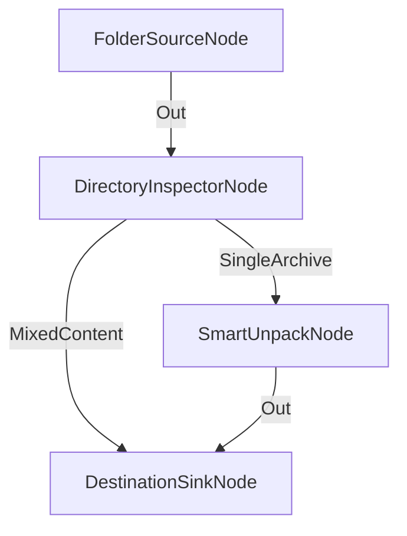

# Inspección de Contenido y Enrutamiento de Carpetas

**Nivel**: 🟡 Intermedio  
**Archivo de Flujo Importable**: [flow_18_inspeccion_tipo_directorio.json](./flow_18_inspeccion_tipo_directorio.json)

## 🎯 Caso de Uso Real
Enrutar carpetas descargadas automáticamente según la naturaleza de sus archivos internos.

## 📊 Diagrama del Flujo

## 🧩 Nodos Utilizados y Configuración
### `FolderSourceNode` (ID: `node-src`)
- **Parámetros**: 
  - `EmitMode`: `DirectoriesOnly`
### `DirectoryInspectorNode` (ID: `node-insp`)
- **Parámetros**: 
  - *(Parámetros por defecto)*
### `SmartUnpackNode` (ID: `node-unpack`)
- **Parámetros**: 
  - *(Parámetros por defecto)*
### `DestinationSinkNode` (ID: `node-snk`)
- **Parámetros**: 
  - *(Parámetros por defecto)*

## 🔄 Paso a Paso del Procesamiento
1. `FolderSourceNode` lee directorios.
2. `DirectoryInspectorNode` inspecciona el contenido de la carpeta.
3. Si es `SingleArchive`, desempaqueta; si es `MixedContent`, mueve a destino.

## 📋 Requisitos Previos y Datos de Prueba
Carpetas con distinto contenido.
