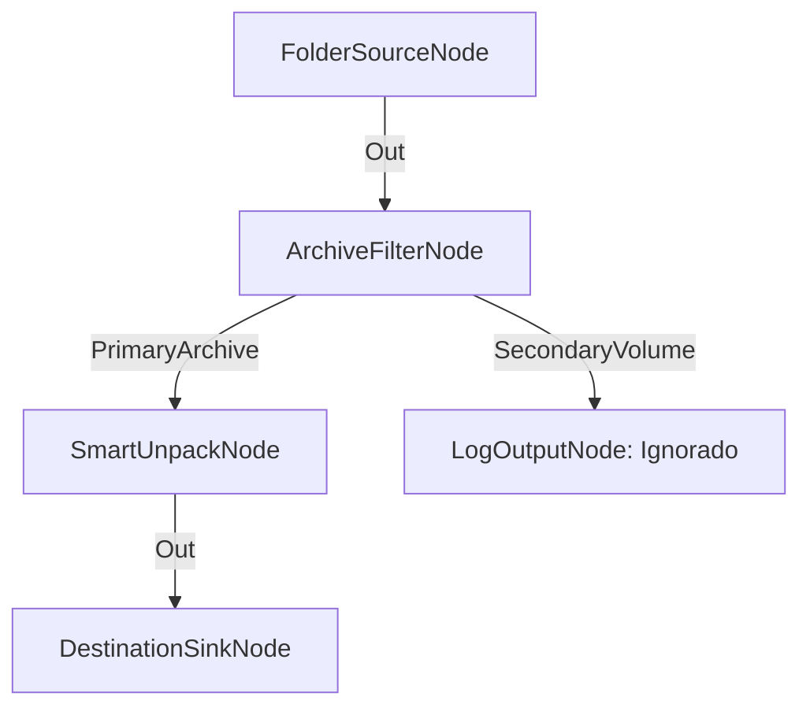

# Filtro Diferencial de Volúmenes RAR Multi-Parte

**Nivel**: 🟡 Intermedio  
**Archivo de Flujo Importable**: [flow_20_filtro_archivos_rar_volumenes.json](./flow_20_filtro_archivos_rar_volumenes.json)

## 🎯 Caso de Uso Real
Evitar que un flujo intente extraer cada parte de un RAR dividido individualmente.

## 📊 Diagrama del Flujo

## 🧩 Nodos Utilizados y Configuración
### `FolderSourceNode` (ID: `node-src`)
- **Parámetros**: 
  - *(Parámetros por defecto)*
### `ArchiveFilterNode` (ID: `node-flt`)
- **Parámetros**: 
  - *(Parámetros por defecto)*
### `SmartUnpackNode` (ID: `node-unp`)
- **Parámetros**: 
  - *(Parámetros por defecto)*
### `LogOutputNode` (ID: `node-log`)
- **Parámetros**: 
  - *(Parámetros por defecto)*
### `DestinationSinkNode` (ID: `node-snk`)
- **Parámetros**: 
  - *(Parámetros por defecto)*

## 🔄 Paso a Paso del Procesamiento
1. `FolderSourceNode` lee archivos comprimidos.
2. `ArchiveFilterNode` clasifica entre `PrimaryArchive`, `SecondaryVolume` y `RegularFile`.
3. Solo `PrimaryArchive` se envía a `SmartUnpackNode`.

## 📋 Requisitos Previos y Datos de Prueba
Archivos `.part1.rar` y `.part2.rar` de prueba.
