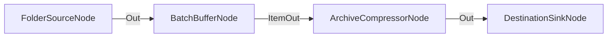

# Agrupación en Lotes (Batch Buffer) para Compresión Masiva

**Nivel**: 🟠 Avanzado  
**Archivo de Flujo Importable**: [flow_21_procesamiento_por_lotes_batch.json](./flow_21_procesamiento_por_lotes_batch.json)

## 🎯 Caso de Uso Real
Comprimir una carpeta entera sin lanzar todas las compresiones de golpe: el búfer acumula los archivos y los suelta en tandas de diez, de modo que la etapa cara —empaquetar— avanza por lotes y no arranca con toda la entrada a la vez.

## 📊 Diagrama del Flujo

## 🧩 Nodos Utilizados y Configuración
### `FolderSourceNode` (ID: `node-src`)
- **Parámetros**: 
  - *(Parámetros por defecto)*
### `BatchBufferNode` (ID: `node-buf`)
- **Parámetros**: 
  - `BatchSize`: `10`
  - `MaxBatchSizeBytes`: `0` *(sin tope por tamaño: el lote se cierra al llegar a 10 elementos)*
### `ArchiveCompressorNode` (ID: `node-zip`)
- **Parámetros**: 
  - `DestinationFolder`: `{GlobalOutputDir}` *(cada elemento del lote se empaqueta en la carpeta de salida del flujo; es también lo que el nodo hace por omisión, y para pedirle que lo escriba junto al archivo se declara `{CurrentDir}`)*
### `DestinationSinkNode` (ID: `node-snk`)
- **Parámetros**: 
  - *(Parámetros por defecto)*

## 🔄 Paso a Paso del Procesamiento
1. `FolderSourceNode` lee los archivos de la carpeta de entrada.
2. `BatchBufferNode` acumula elementos hasta llegar a 10 (o hasta superar el tamaño máximo si se configura).
3. El lote se suelta entero por `ItemOut` y `ArchiveCompressorNode` empaqueta cada elemento del lote en un ZIP dentro de `{GlobalOutputDir}`.
4. `DestinationSinkNode` guarda los paquetes en su destino.
5. **El lote que no llega a llenarse también sale**: al terminar la ejecución, lo que quede dentro del búfer se entrega igual —los elementos por `ItemOut` y su marcador por `BatchCompleted`, con `BatchIncomplete = true`—. Sin ese cierre, una entrada de menos de 10 archivos (el caso corriente) terminaría en verde sin empaquetar nada. El puerto `BatchCompleted` queda libre en este flujo: no hace falta actuar sobre el cierre del lote.

## 📋 Requisitos Previos y Datos de Prueba
Una carpeta de entrada con archivos. El flujo se comporta igual si la entrada supera el lote que si no: con menos de 10 archivos todo sale en el cierre de la ejecución.
