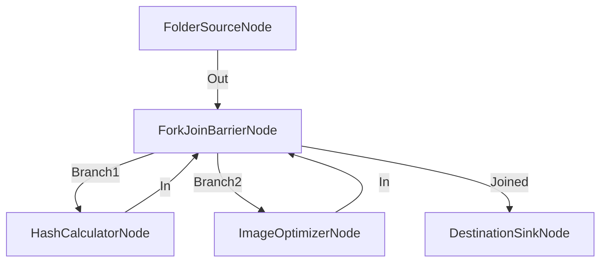

# División Paralela (Fork) y Consolidación (Join)

**Nivel**: 🟠 Avanzado  
**Archivo de Flujo Importable**: [flow_22_paralelismo_fork_join.json](./flow_22_paralelismo_fork_join.json)

## 🎯 Caso de Uso Real
Acelerar operaciones pesadas ejecutando la compresión de imagen y el cálculo de hash en paralelo.

## 📊 Diagrama del Flujo

## 🧩 Nodos Utilizados y Configuración
### `FolderSourceNode` (ID: `node-src`)
- **Parámetros**: 
  - *(Parámetros por defecto)*
### `ForkJoinBarrierNode` (ID: `node-fork`)
- **Parámetros**: 
  - `WaitForAll`: `True`
### `HashCalculatorNode` (ID: `node-hash`)
- **Parámetros**: 
  - *(Parámetros por defecto)*
### `ImageOptimizerNode` (ID: `node-opt`)
- **Parámetros**: 
  - *(Parámetros por defecto)*
### `DestinationSinkNode` (ID: `node-snk`)
- **Parámetros**: 
  - *(Parámetros por defecto)*

## 🔄 Paso a Paso del Procesamiento
1. `FolderSourceNode` emite un elemento.
2. `ForkJoinBarrierNode` ramifica el flujo a `Branch1` y `Branch2`.
3. `Branch1` calcula el hash SHA256; `Branch2` optimiza la imagen.
4. Ambas ramas entran a `Joined` en `ForkJoinBarrierNode` antes de enviar a salida.

## 📋 Requisitos Previos y Datos de Prueba
Imágenes de prueba.
