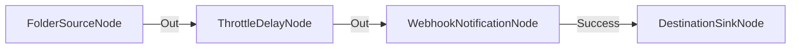

# Regulación de Velocidad y Control de Tasa (Rate Limit)

**Nivel**: 🟠 Avanzado  
**Archivo de Flujo Importable**: [flow_23_regulacion_velocidad_rate_limit.json](./flow_23_regulacion_velocidad_rate_limit.json)

## 🎯 Caso de Uso Real
Prevenir bloqueos por sobrepasar el límite de peticiones (Rate Limit) de un Webhook externo.

## 📊 Diagrama del Flujo

## 🧩 Nodos Utilizados y Configuración
### `FolderSourceNode` (ID: `node-src`)
- **Parámetros**: 
  - *(Parámetros por defecto)*
### `ThrottleDelayNode` (ID: `node-th`)
- **Parámetros**: 
  - `DelayMs`: `1000`
  - `MaxRatePerSecond`: `2`
### `WebhookNotificationNode` (ID: `node-web`)
- **Parámetros**: 
  - *(Parámetros por defecto)*
### `DestinationSinkNode` (ID: `node-snk`)
- **Parámetros**: 
  - *(Parámetros por defecto)*

## 🔄 Paso a Paso del Procesamiento
1. `FolderSourceNode` detecta archivos.
2. `ThrottleDelayNode` impone un retardo de 1000ms y máximo 2 peticiones/segundo.
3. `WebhookNotificationNode` envía la notificación sin saturar la API externa.

## 📋 Requisitos Previos y Datos de Prueba
Múltiples archivos procesados rápidamente.
