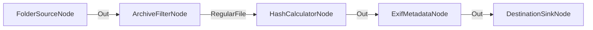

# Pipeline de Ingesta Segura con Análisis y Verificación

**Nivel**: 🟠 Avanzado  
**Archivo de Flujo Importable**: [flow_25_pipeline_seguridad_analisis.json](./flow_25_pipeline_seguridad_analisis.json)

## 🎯 Caso de Uso Real
Auditoría de seguridad y trazabilidad completa para archivos que ingresan a un servidor de datos sensibles.

## 📊 Diagrama del Flujo

## 🧩 Nodos Utilizados y Configuración
### `FolderSourceNode` (ID: `node-src`)
- **Parámetros**: 
  - *(Parámetros por defecto)*
### `ArchiveFilterNode` (ID: `node-flt`)
- **Parámetros**: 
  - *(Parámetros por defecto)*
### `HashCalculatorNode` (ID: `node-hash`)
- **Parámetros**: 
  - `Algorithm`: `SHA512`
### `ExifMetadataNode` (ID: `node-exif`)
- **Parámetros**: 
  - *(Parámetros por defecto)*
### `DestinationSinkNode` (ID: `node-snk`)
- **Parámetros**: 
  - *(Parámetros por defecto)*

## 🔄 Paso a Paso del Procesamiento
1. `FolderSourceNode` analiza entradas.
2. `ArchiveFilterNode` valida formato.
3. `HashCalculatorNode` calcula SHA-512.
4. `ExifMetadataNode` intenta extraer metadatos adicionales.
5. `DestinationSinkNode` guarda el archivo auditado.

## 📋 Requisitos Previos y Datos de Prueba
Archivos varios para auditar.
