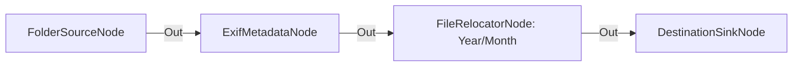

# Organización de Archivos en Estructura Dinámica de Carpetas

**Nivel**: 🟠 Avanzado  
**Archivo de Flujo Importable**: [flow_26_organizacion_cronologica_exif.json](./flow_26_organizacion_cronologica_exif.json)

## 🎯 Caso de Uso Real
Clasificar miles de archivos sueltos ordenándolos automáticamente por año y mes sin crear manualmente las carpetas.

## 📊 Diagrama del Flujo

## 🧩 Nodos Utilizados y Configuración
### `FolderSourceNode` (ID: `node-src`)
- **Parámetros**: 
  - *(Parámetros por defecto)*
### `ExifMetadataNode` (ID: `node-exif`)
- **Parámetros**: 
  - *(Parámetros por defecto)*
### `FileRelocatorNode` (ID: `node-rel`)
- **Parámetros**: 
  - `DestinationDirectory`: `{RelativeDir}\{Year}\{Month}`
  - `CreateDirectories`: `True`
### `DestinationSinkNode` (ID: `node-snk`)
- **Parámetros**: 
  - *(Parámetros por defecto)*

## 🔄 Paso a Paso del Procesamiento
1. `FolderSourceNode` detecta archivos.
2. `ExifMetadataNode` extrae metadatos de fechas.
3. `FileRelocatorNode` traslada los archivos creando dinámicamente directorios `{RelativeDir}\{Year}\{Month}`.
4. `DestinationSinkNode` confirma la reorganización.

## 📋 Requisitos Previos y Datos de Prueba
Archivos de imágenes o documentos.
