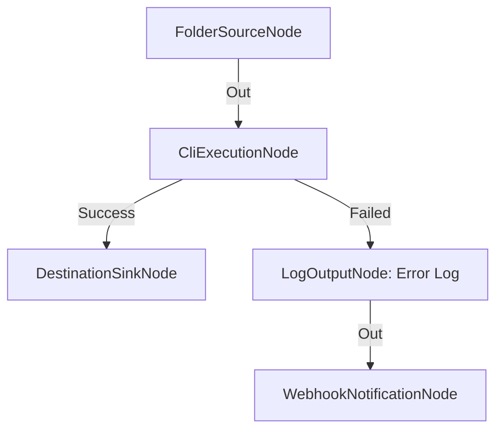

# Gestión Resiliente de Fallos y Canalización de Errores

**Nivel**: 🟠 Avanzado  
**Archivo de Flujo Importable**: [flow_27_reintentos_y_gestion_fallos.json](./flow_27_reintentos_y_gestion_fallos.json)

## 🎯 Caso de Uso Real
Prevenir que el fallo de un script o comando detenga la tubería de procesamiento completa.

## 📊 Diagrama del Flujo

## 🧩 Nodos Utilizados y Configuración
### `FolderSourceNode` (ID: `node-src`)
- **Parámetros**: 
  - *(Parámetros por defecto)*
### `CliExecutionNode` (ID: `node-cli`)
- **Parámetros**: 
  - *(Parámetros por defecto)*
### `DestinationSinkNode` (ID: `node-snk`)
- **Parámetros**: 
  - *(Parámetros por defecto)*
### `LogOutputNode` (ID: `node-log`)
- **Parámetros**: 
  - *(Parámetros por defecto)*
### `WebhookNotificationNode` (ID: `node-web`)
- **Parámetros**: 
  - *(Parámetros por defecto)*

## 🔄 Paso a Paso del Procesamiento
1. `FolderSourceNode` detecta archivos.
2. `CliExecutionNode` intenta ejecutar comando.
3. Si tiene éxito (`Success`), pasa a `DestinationSinkNode`.
4. Si falla (`Failed`), se desvía a `LogOutputNode` y envía alerta `WebhookNotificationNode`.

## 📋 Requisitos Previos y Datos de Prueba
Configurar ejecutable de comando.
