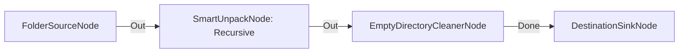

# Descompresión Recursiva Multinivel con Limpieza Residual

**Nivel**: 🟠 Avanzado  
**Archivo de Flujo Importable**: [flow_28_limpieza_y_descompresion_recursiva.json](./flow_28_limpieza_y_descompresion_recursiva.json)

## 🎯 Caso de Uso Real
Procesar descargas compuestas de múltiples archivos zip anidados en subcarpetas de forma automatizada.

## 📊 Diagrama del Flujo

## 🧩 Nodos Utilizados y Configuración
### `FolderSourceNode` (ID: `node-src`)
- **Parámetros**: 
  - *(Parámetros por defecto)*
### `SmartUnpackNode` (ID: `node-unp`)
- **Parámetros**: 
  - `RecursiveUnpack`: `True`
  - `CleanWrapper`: `True`
### `EmptyDirectoryCleanerNode` (ID: `node-clean`)
- **Parámetros**: 
  - *(Parámetros por defecto)*
### `DestinationSinkNode` (ID: `node-snk`)
- **Parámetros**: 
  - *(Parámetros por defecto)*

## 🔄 Paso a Paso del Procesamiento
1. `FolderSourceNode` detecta zips anidados.
2. `SmartUnpackNode` descomprime de forma recursiva (`RecursiveUnpack=true`).
3. `EmptyDirectoryCleanerNode` elimina las carpetas intermedias vacías.
4. `DestinationSinkNode` consolida los archivos finales.

## 📋 Requisitos Previos y Datos de Prueba
Archivo ZIP que contenga otro archivo ZIP.
