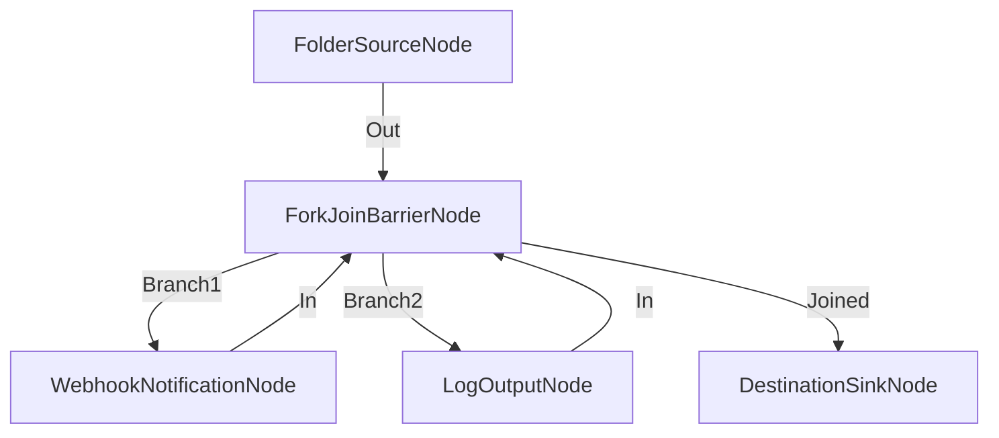

# Notificación Multi-Canal Simultánea (Webhook + Console Log)

**Nivel**: 🟠 Avanzado  
**Archivo de Flujo Importable**: [flow_30_notificacion_multi_canal.json](./flow_30_notificacion_multi_canal.json)

## 🎯 Caso de Uso Real
Notificar a la vez en consola de monitoreo local y vía HTTP Webhook a la infraestructura en la nube.

## 📊 Diagrama del Flujo

## 🧩 Nodos Utilizados y Configuración
### `FolderSourceNode` (ID: `node-src`)
- **Parámetros**: 
  - *(Parámetros por defecto)*
### `ForkJoinBarrierNode` (ID: `node-fork`)
- **Parámetros**: 
  - *(Parámetros por defecto)*
### `WebhookNotificationNode` (ID: `node-web`)
- **Parámetros**: 
  - *(Parámetros por defecto)*
### `LogOutputNode` (ID: `node-log`)
- **Parámetros**: 
  - *(Parámetros por defecto)*
### `DestinationSinkNode` (ID: `node-snk`)
- **Parámetros**: 
  - *(Parámetros por defecto)*

## 🔄 Paso a Paso del Procesamiento
1. `FolderSourceNode` emite elemento.
2. `ForkJoinBarrierNode` ramifica el evento hacia `WebhookNotificationNode` (rama 1) y `LogOutputNode` (rama 2).
3. `Joined` consolida ambas notificaciones antes de mover a `DestinationSinkNode`.

## 📋 Requisitos Previos y Datos de Prueba
URL de Webhook externa.
