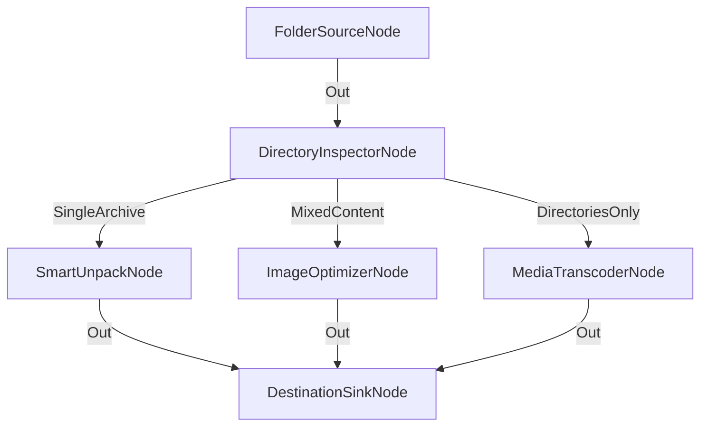

# Patrón Scatter-Gather de Clasificación y Procesamiento Masivo

**Nivel**: 🔴 Complejo  
**Archivo de Flujo Importable**: [flow_31_scatter_gather_archivos.json](./flow_31_scatter_gather_archivos.json)

## 🎯 Caso de Uso Real
Procesar colecciones mixtas de archivos desempaquetando zips, convirtiendo vídeos y optimizando fotos en paralelo antes de almacenar.

## 📊 Diagrama del Flujo

## 🧩 Nodos Utilizados y Configuración
### `FolderSourceNode` (ID: `node-src`)
- **Parámetros**: 
  - *(Parámetros por defecto)*
### `DirectoryInspectorNode` (ID: `node-scat`)
- **Parámetros**: 
  - *(Parámetros por defecto)*
### `SmartUnpackNode` (ID: `node-unp`)
- **Parámetros**: 
  - *(Parámetros por defecto)*
### `ImageOptimizerNode` (ID: `node-opt`)
- **Parámetros**: 
  - *(Parámetros por defecto)*
### `MediaTranscoderNode` (ID: `node-tr`)
- **Parámetros**: 
  - *(Parámetros por defecto)*
### `DestinationSinkNode` (ID: `node-snk`)
- **Parámetros**: 
  - *(Parámetros por defecto)*

## 🔄 Paso a Paso del Procesamiento
1. `FolderSourceNode` escanea carpetas de ingesta.
2. `DirectoryInspectorNode` dispersa (Scatter) el contenido según su tipo.
3. `SmartUnpackNode`, `ImageOptimizerNode` y `MediaTranscoderNode` procesan concurrentemente.
4. `DestinationSinkNode` reúne (Gather) los artefactos procesados.

## 📋 Requisitos Previos y Datos de Prueba
Carpeta mixta con subdirectorios, zips, vídeos e imágenes.
