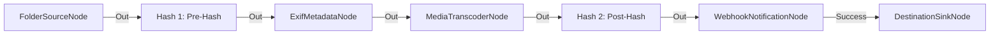

# Cadena de Custodia Completa con Auditoría de Doble Hash

**Nivel**: 🔴 Complejo  
**Archivo de Flujo Importable**: [flow_32_cadena_custodia_auditoria.json](./flow_32_cadena_custodia_auditoria.json)

## 🎯 Caso de Uso Real
Garantizar la trazabilidad legal inmutable en la transformación de medios mediante verificación de hash previo y posterior.

## 📊 Diagrama del Flujo

## 🧩 Nodos Utilizados y Configuración
### `FolderSourceNode` (ID: `node-src`)
- **Parámetros**: 
  - *(Parámetros por defecto)*
### `HashCalculatorNode` (ID: `node-h1`)
- **Parámetros**: 
  - `HashMetadataKey`: `Hash:PreHash`
### `ExifMetadataNode` (ID: `node-exif`)
- **Parámetros**: 
  - *(Parámetros por defecto)*
### `MediaTranscoderNode` (ID: `node-tr`)
- **Parámetros**: 
  - *(Parámetros por defecto)*
### `HashCalculatorNode` (ID: `node-h2`)
- **Parámetros**: 
  - `HashMetadataKey`: `Hash:PostHash`
### `WebhookNotificationNode` (ID: `node-web`)
- **Parámetros**: 
  - *(Parámetros por defecto)*
### `DestinationSinkNode` (ID: `node-snk`)
- **Parámetros**: 
  - *(Parámetros por defecto)*

## 🔄 Paso a Paso del Procesamiento
1. `HashCalculatorNode` calcula el hash inicial SHA-256 (Pre-Hash).
2. `ExifMetadataNode` extrae datos EXIF.
3. `MediaTranscoderNode` transcodifica el vídeo.
4. `HashCalculatorNode` calcula el hash de salida (Post-Hash).
5. `WebhookNotificationNode` emite la firma auditada a la API corporativa.
6. `DestinationSinkNode` archiva el resultado.

## 📋 Requisitos Previos y Datos de Prueba
Servidor Webhook de auditoría de prueba.
