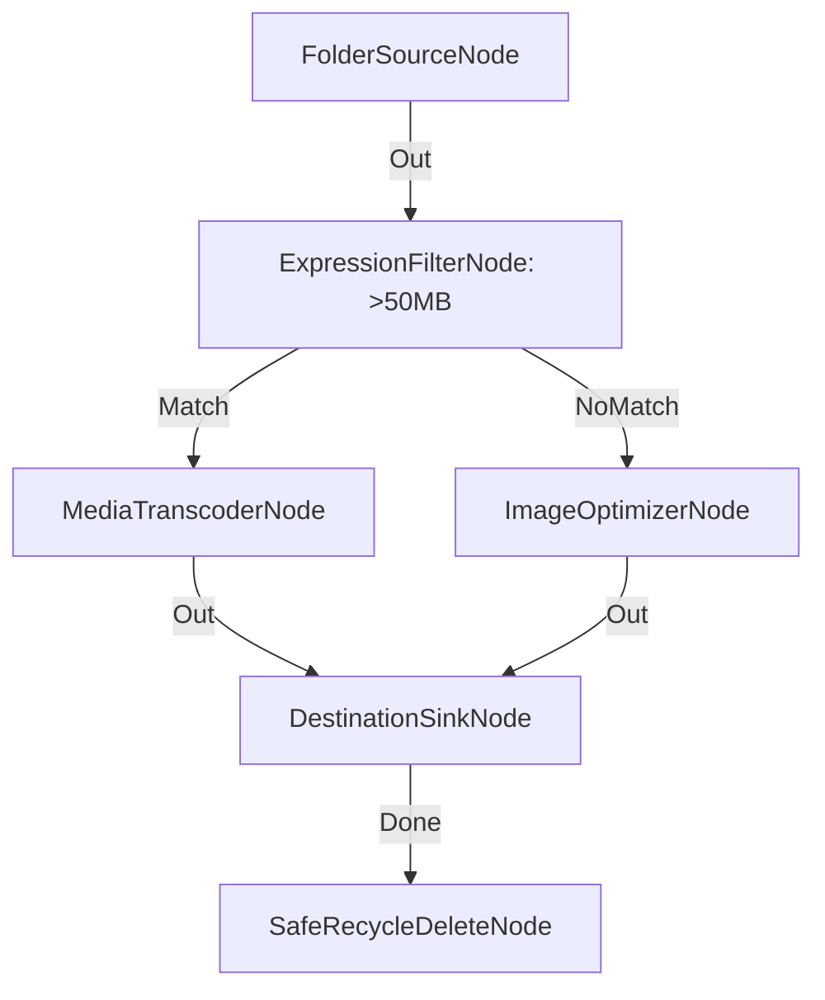

# Optimización Masiva Multimedia con Enrutamiento Condicional y Borrado

**Nivel**: 🔴 Complejo  
**Archivo de Flujo Importable**: [flow_33_optimizacion_masiva_media_multicapa.json](./flow_33_optimizacion_masiva_media_multicapa.json)

## 🎯 Caso de Uso Real
Optimizar de forma transparente toda la biblioteca multimedia reduciendo el uso de almacenamiento en más de un 60%.

## 📊 Diagrama del Flujo

## 🧩 Nodos Utilizados y Configuración
### `FolderSourceNode` (ID: `node-src`)
- **Parámetros**: 
  - *(Parámetros por defecto)*
### `ExpressionFilterNode` (ID: `node-flt`)
- **Parámetros**: 
  - `PropertyPath`: `FileSizeBytes`
  - `Operator`: `>`
  - `TargetValue`: `52428800`
### `MediaTranscoderNode` (ID: `node-tr`)
- **Parámetros**: 
  - *(Parámetros por defecto)*
### `ImageOptimizerNode` (ID: `node-opt`)
- **Parámetros**: 
  - *(Parámetros por defecto)*
### `DestinationSinkNode` (ID: `node-snk`)
- **Parámetros**: 
  - *(Parámetros por defecto)*
### `SafeRecycleDeleteNode` (ID: `node-del`)
- **Parámetros**: 
  - *(Parámetros por defecto)*

## 🔄 Paso a Paso del Procesamiento
1. `FolderSourceNode` detecta entradas.
2. `ExpressionFilterNode` evalúa si el tamaño supera 50MB.
3. Si es mayor, se transcodifica en `MediaTranscoderNode`; si es menor, se comprime en `ImageOptimizerNode`.
4. `DestinationSinkNode` guarda la salida optimizada.
5. `SafeRecycleDeleteNode` envía el original a la papelera.

## 📋 Requisitos Previos y Datos de Prueba
Archivos multimedia de prueba.
