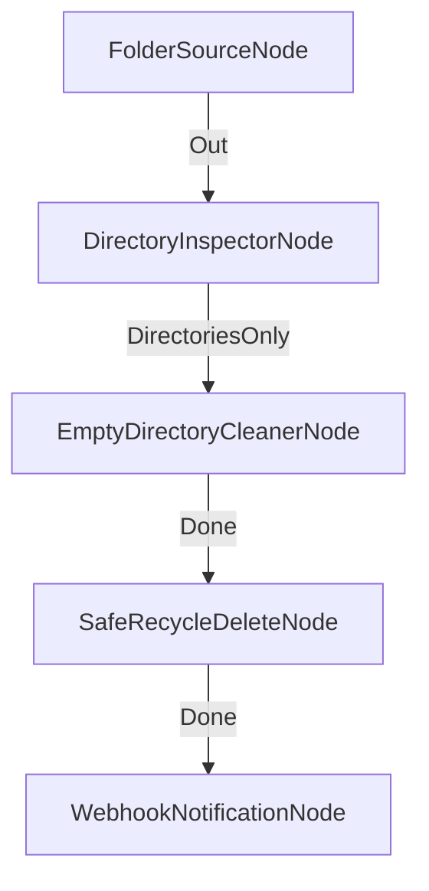

# Orquestación de Limpieza y Mantenimiento Automatizado de Servidores

**Nivel**: 🔴 Complejo  
**Archivo de Flujo Importable**: [flow_35_limpieza_y_mantenimiento_servidores.json](./flow_35_limpieza_y_mantenimiento_servidores.json)

## 🎯 Caso de Uso Real
Ejecutar labores de mantenimiento nocturno en el servidor de archivos sin riesgo de borrar datos activos.

## 📊 Diagrama del Flujo

## 🧩 Nodos Utilizados y Configuración
### `FolderSourceNode` (ID: `node-src`)
- **Parámetros**: 
  - `EmitMode`: `DirectoriesOnly`
### `DirectoryInspectorNode` (ID: `node-insp`)
- **Parámetros**: 
  - *(Parámetros por defecto)*
### `EmptyDirectoryCleanerNode` (ID: `node-clean`)
- **Parámetros**: 
  - *(Parámetros por defecto)*
### `SafeRecycleDeleteNode` (ID: `node-del`)
- **Parámetros**: 
  - *(Parámetros por defecto)*
### `WebhookNotificationNode` (ID: `node-web`)
- **Parámetros**: 
  - *(Parámetros por defecto)*

## 🔄 Paso a Paso del Procesamiento
1. `FolderSourceNode` escanea rutas del servidor.
2. `DirectoryInspectorNode` identifica subcarpetas.
3. `EmptyDirectoryCleanerNode` elimina las vacías.
4. `SafeRecycleDeleteNode` envía elementos a la papelera.
5. `WebhookNotificationNode` emite un informe al equipo DevOps.

## 📋 Requisitos Previos y Datos de Prueba
Permisos de escritura en directorio de mantenimiento.
