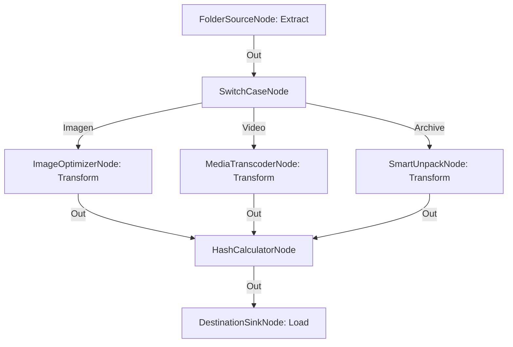

# Pipeline ETL de Ingesta y Transformación para Archivos Mixtos

**Nivel**: 🔴 Complejo  
**Archivo de Flujo Importable**: [flow_36_pipeline_etl_archivos_mixtos.json](./flow_36_pipeline_etl_archivos_mixtos.json)

## 🎯 Caso de Uso Real
Normalizar flujos heterogéneos de datos donde conviven fotos, vídeos y compresión en una única canalización ETL.

## 📊 Diagrama del Flujo

## 🧩 Nodos Utilizados y Configuración
### `FolderSourceNode` (ID: `node-src`)
- **Parámetros**: 
  - *(Parámetros por defecto)*
### `SwitchCaseNode` (ID: `node-sw`)
- **Parámetros**: 
  - *(Parámetros por defecto)*
### `ImageOptimizerNode` (ID: `node-img`)
- **Parámetros**: 
  - *(Parámetros por defecto)*
### `MediaTranscoderNode` (ID: `node-vid`)
- **Parámetros**: 
  - *(Parámetros por defecto)*
### `SmartUnpackNode` (ID: `node-arc`)
- **Parámetros**: 
  - *(Parámetros por defecto)*
### `HashCalculatorNode` (ID: `node-hash`)
- **Parámetros**: 
  - *(Parámetros por defecto)*
### `DestinationSinkNode` (ID: `node-snk`)
- **Parámetros**: 
  - *(Parámetros por defecto)*

## 🔄 Paso a Paso del Procesamiento
1. `FolderSourceNode` (Extract) lee elementos heterogéneos.
2. `SwitchCaseNode` segrega por tipo.
3. `ImageOptimizerNode`, `MediaTranscoderNode` o `SmartUnpackNode` (Transform) procesan el archivo.
4. `HashCalculatorNode` firma la salida.
5. `DestinationSinkNode` (Load) deposita en el data lake.

## 📋 Requisitos Previos y Datos de Prueba
Archivos de múltiples extensiones en la entrada.
