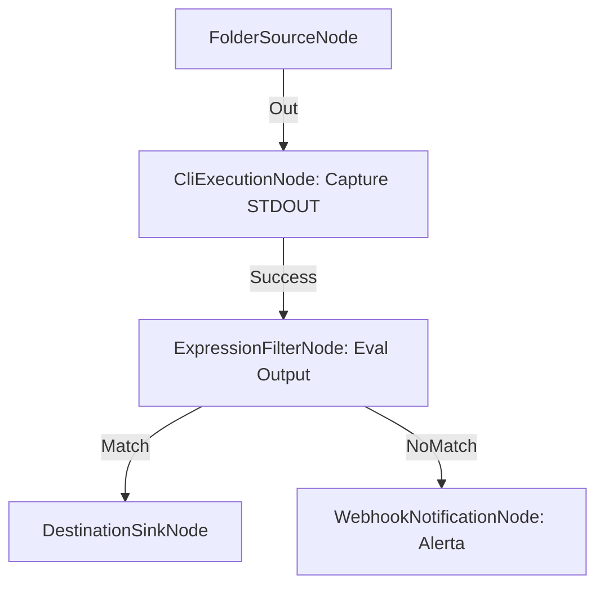

# Orquestación CLI Externa con Evaluación de Metadatos

**Nivel**: 🔴 Complejo  
**Archivo de Flujo Importable**: [flow_37_orquestacion_cli_con_salida_json.json](./flow_37_orquestacion_cli_con_salida_json.json)

## 🎯 Caso de Uso Real
Integrar analizadores de código o escáneres antivirus de línea de comandos en la tubería de archivos.

## 📊 Diagrama del Flujo

## 🧩 Nodos Utilizados y Configuración
### `FolderSourceNode` (ID: `node-src`)
- **Parámetros**: 
  - *(Parámetros por defecto)*
### `CliExecutionNode` (ID: `node-cli`)
- **Parámetros**: 
  - `CaptureOutputToMetadata`: `True`
### `ExpressionFilterNode` (ID: `node-flt`)
- **Parámetros**: 
  - `PropertyPath`: `CliOutput`
  - `Operator`: `Contains`
  - `TargetValue`: `OK`
### `DestinationSinkNode` (ID: `node-snk`)
- **Parámetros**: 
  - *(Parámetros por defecto)*
### `WebhookNotificationNode` (ID: `node-web`)
- **Parámetros**: 
  - *(Parámetros por defecto)*

## 🔄 Paso a Paso del Procesamiento
1. `FolderSourceNode` detecta archivos.
2. `CliExecutionNode` ejecuta el escáner y guarda la respuesta en `CliOutput`.
3. `ExpressionFilterNode` evalúa si la respuesta incluye palabras de aprobación.
4. `WebhookNotificationNode` o `DestinationSinkNode` proceden con el resultado.

## 📋 Requisitos Previos y Datos de Prueba
Script CLI ejecutable de prueba.
