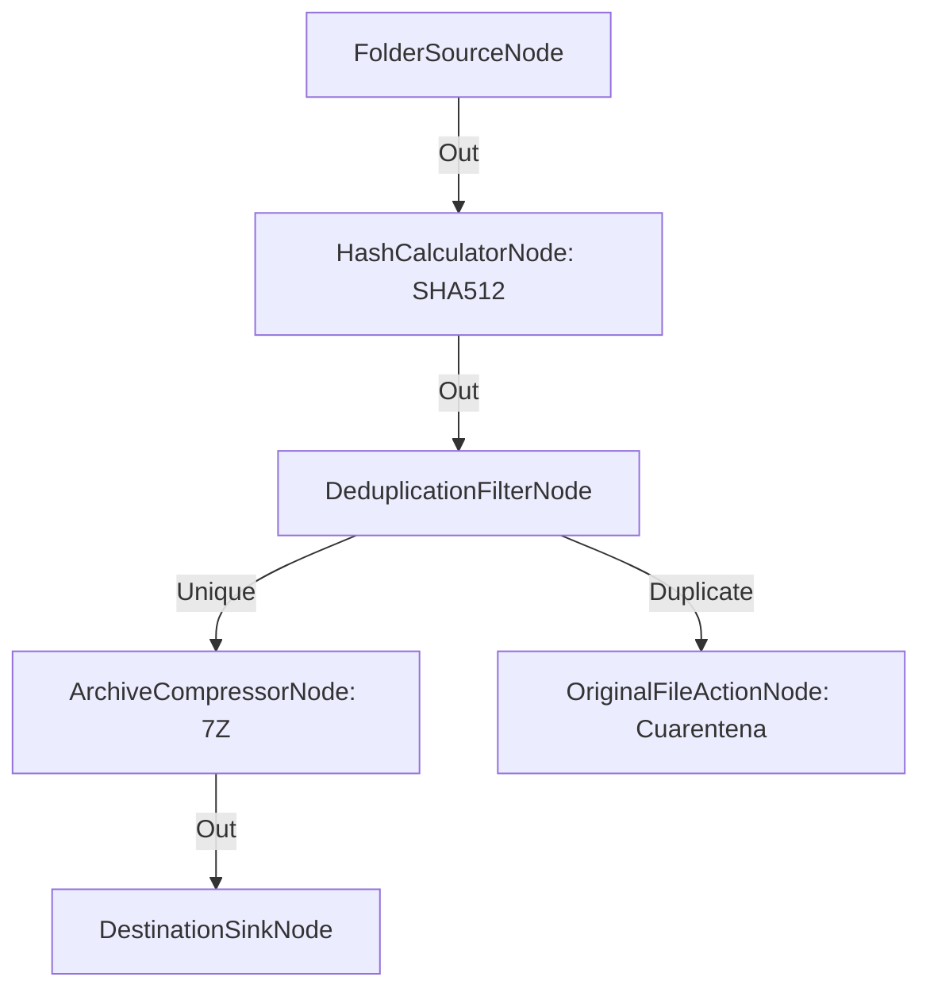

# Deduplicación Masiva y Compresión de Archivo Congelado (Cold Storage)

**Nivel**: 🔴 Complejo  
**Archivo de Flujo Importable**: [flow_38_deduplicacion_y_archivado_frisado.json](./flow_38_deduplicacion_y_archivado_frisado.json)

## 🎯 Caso de Uso Real
Archivar colecciones históricas masivas eliminando duplicados y comprimiendo la copia única en 7Z.

## 📊 Diagrama del Flujo

## 🧩 Nodos Utilizados y Configuración
### `FolderSourceNode` (ID: `node-src`)
- **Parámetros**: 
  - *(Parámetros por defecto)*
### `HashCalculatorNode` (ID: `node-hash`)
- **Parámetros**: 
  - `Algorithm`: `SHA512`
### `DeduplicationFilterNode` (ID: `node-dedup`)
- **Parámetros**: 
  - *(Parámetros por defecto)*
### `ArchiveCompressorNode` (ID: `node-7z`)
- **Parámetros**: 
  - `DestinationFolder`: `{GlobalOutputDir}/Frio`
  - `ArchiveFormat`: `7Z`
  - `CompressionType`: `LZMA`
  - `ArchiveName`: `{FileNameWithoutExtension}.7z`

> El contenedor **7Z** sólo admite compresión `LZMA`/`LZMA2`: la compresión por defecto del nodo es `Deflate`,
> que el escritor de 7Z rechaza. Con la combinación por defecto el nodo registraba el error y dejaba un archivo
> de **cero bytes** con la extensión del archivo prometido; con `CompressionType` explícito el ejemplo entrega de
> verdad el `.7z` que anuncia.
### `OriginalFileActionNode` (ID: `node-quar`)
- **Parámetros**: 
  - `ActionType`: `MoveToQuarantine`
### `DestinationSinkNode` (ID: `node-snk`)
- **Parámetros**: 
  - *(Parámetros por defecto)*

## 🔄 Paso a Paso del Procesamiento
1. `FolderSourceNode` lee la biblioteca.
2. `HashCalculatorNode` calcula el hash SHA-512 de máxima seguridad.
3. `DeduplicationFilterNode` separa elementos únicos de duplicados.
4. Los únicos se comprimen con `ArchiveCompressorNode` (formato 7Z, compresión `LZMA`) y se guardan como `.7z` en `{GlobalOutputDir}/Frio`, la carpeta del archivo congelado.
5. Los duplicados se mueven a cuarentena.

## 📋 Requisitos Previos y Datos de Prueba
Biblioteca de archivos con elementos duplicados.
