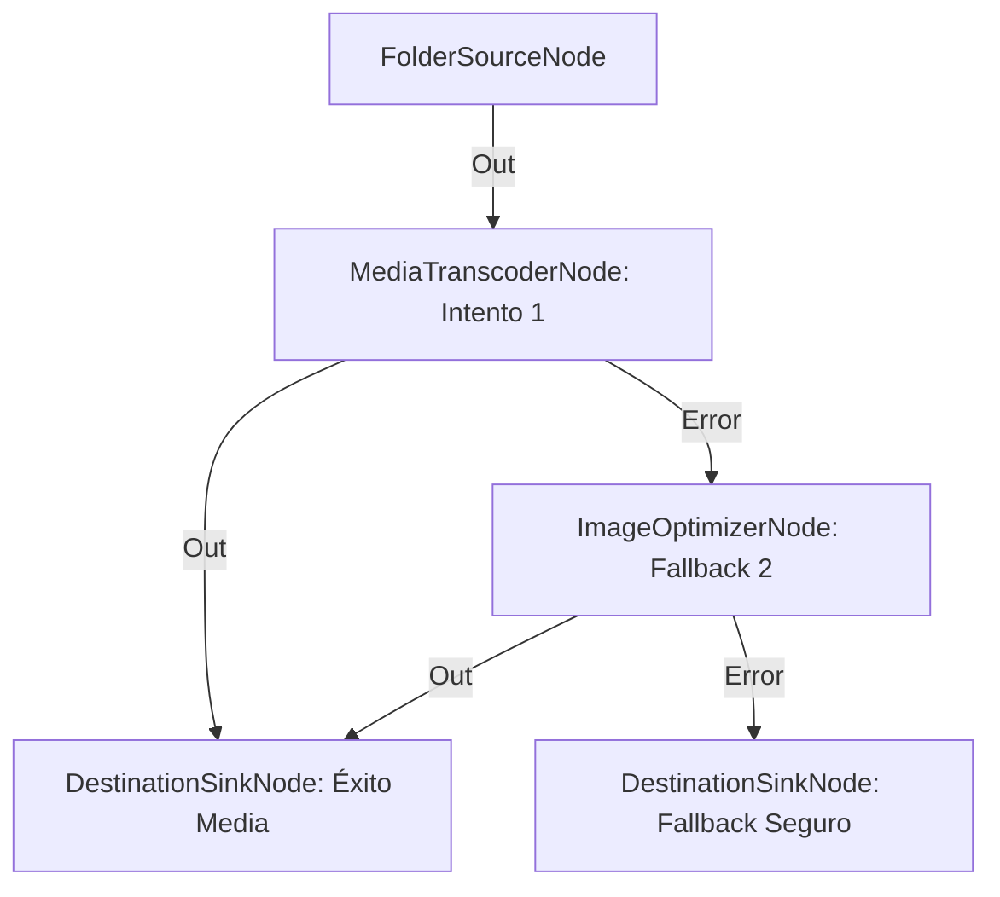

# Arquitectura Resiliente con Fallback de Conversión Múltiple

**Nivel**: 🔴 Complejo  
**Archivo de Flujo Importable**: [flow_39_flujo_resiliente_con_fallback.json](./flow_39_flujo_resiliente_con_fallback.json)

## 🎯 Caso de Uso Real
Garantizar la entrega de al menos un artefacto válido sin romper el flujo cuando fallan códecs específicos.

## 📊 Diagrama del Flujo

## 🧩 Nodos Utilizados y Configuración
### `FolderSourceNode` (ID: `node-src`)
- **Parámetros**: 
  - *(Parámetros por defecto)*
### `MediaTranscoderNode` (ID: `node-tr`)
- **Parámetros**: 
  - *(Parámetros por defecto)*
### `ImageOptimizerNode` (ID: `node-opt`)
- **Parámetros**: 
  - *(Parámetros por defecto)*
### `DestinationSinkNode` (ID: `node-snk1`)
- **Parámetros**: 
  - *(Parámetros por defecto)*
### `DestinationSinkNode` (ID: `node-snk2`)
- **Parámetros**: 
  - *(Parámetros por defecto)*

## 🔄 Paso a Paso del Procesamiento
1. `FolderSourceNode` detecta entradas.
2. `MediaTranscoderNode` intenta procesar el vídeo.
3. Si hay error en el puerto `Error`, conmuta a `ImageOptimizerNode` como plan de respaldo.
4. Si la optimización falla, conmuta al `DestinationSinkNode` de respaldo conservando el archivo.

## 📋 Requisitos Previos y Datos de Prueba
Archivos de vídeo o imágenes dañadas para probar fallback.
