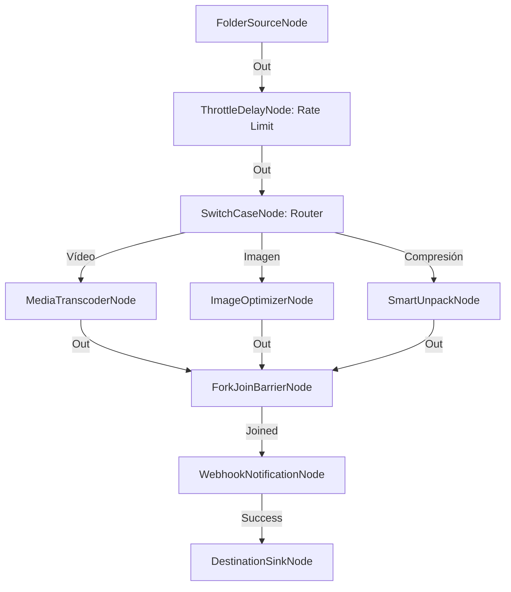

# Centro Empresarial de Procesamiento Multimedia Integral (Enterprise)

**Nivel**: 🔴 Complejo  
**Archivo de Flujo Importable**: [flow_40_centro_procesamiento_multimedia_enterprise.json](./flow_40_centro_procesamiento_multimedia_enterprise.json)

## 🎯 Caso de Uso Real
Orquestación integral completa de nivel empresarial para procesar todo el tráfico de archivos corporativos en un único flujo maestro.

## 📊 Diagrama del Flujo

## 🧩 Nodos Utilizados y Configuración
### `FolderSourceNode` (ID: `node-src`)
- **Parámetros**: 
  - *(Parámetros por defecto)*
### `ThrottleDelayNode` (ID: `node-th`)
- **Parámetros**: 
  - `DelayMs`: `200`
  - `MaxRatePerSecond`: `5`
### `SwitchCaseNode` (ID: `node-sw`)
- **Parámetros**: 
  - *(Parámetros por defecto)*
### `MediaTranscoderNode` (ID: `node-tr`)
- **Parámetros**: 
  - *(Parámetros por defecto)*
### `ImageOptimizerNode` (ID: `node-opt`)
- **Parámetros**: 
  - *(Parámetros por defecto)*
### `SmartUnpackNode` (ID: `node-unp`)
- **Parámetros**: 
  - *(Parámetros por defecto)*
### `ForkJoinBarrierNode` (ID: `node-fork`)
- **Parámetros**: 
  - *(Parámetros por defecto)*
### `WebhookNotificationNode` (ID: `node-web`)
- **Parámetros**: 
  - *(Parámetros por defecto)*
### `DestinationSinkNode` (ID: `node-snk`)
- **Parámetros**: 
  - *(Parámetros por defecto)*

## 🔄 Paso a Paso del Procesamiento
1. `FolderSourceNode` escanea la ingesta global.
2. `ThrottleDelayNode` regula la tasa a 5 elementos/segundo.
3. `SwitchCaseNode` enruta por tipo de contenido.
4. `MediaTranscoderNode`, `ImageOptimizerNode` y `SmartUnpackNode` procesan en paralelo.
5. `ForkJoinBarrierNode` consolida la ejecución.
6. `WebhookNotificationNode` notifica la finalización a la infraestructura Cloud.
7. `DestinationSinkNode` guarda los resultados finales.

## 📋 Requisitos Previos y Datos de Prueba
Carpeta de prueba completa con archivos diversos.
