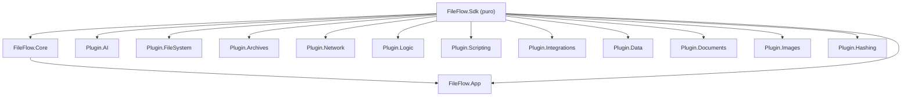

# FASE 1 — Auditoría de Código, Análisis de Patrones y Plan de Refactorización

> [!NOTE]
> **Estado (actualizado 2026-09-22): Fases 2A, 2B, 2C, 2E y 2F están 100% COMPLETADAS.**
> La ejecución de 2A/2B ocurrió en un ciclo de trabajo previo no reflejado originalmente en este documento; quedó documentada en
> [`docs/history/2026-09-13_PROJECT_WALKTHROUGH_ARCHIVE.md`](file:///e:/Users/kaoti/Documentos/GitHub/ArchiveProceser/docs/history/2026-09-13_PROJECT_WALKTHROUGH_ARCHIVE.md).
> Las fases 2C y 2E se ejecutaron el 2026-09-21 en la rama `feature/crossplatform-avalonia`; la 2F, el 2026-09-22.
> Verificado tras la ejecución: build limpio (0 errores, 0 warnings) y suite completa en verde (1146 superadas, 1 skip intencional, de 1147 tests tras la 2F — la suite creció desde los 481 originales de esta auditoría).
> **Fase 2D**: ✅ COMPLETADA — `FileFlow.Plugin.AI` quedó **100% migrado** (18/18 nodos) y la 2D-D3b llevó los **52 nodos** restantes de los demás plugins a `FlowNodeBase`. Ya **no queda ningún nodo del proyecto implementando `IFlowNode` a mano** (sólo las interfaces del SDK y dobles de test).
>
> - **C1–C5** ✅ — Motores monolíticos modularizados: `AiModelManager`, `OnnxInferenceEngine`, `LanguageInferenceEngine`, `AudioInferenceEngine` y la coordinación Log ↔ Inspector.
> - **E1–E3** ✅ — Ciclo de vida ONNX unificado, `GC.Collect()` de `PluginLoader` evaluado y justificado, y bloques `catch` silenciosos refinados con diagnóstico explícito.
> - **F1–F3** ✅ — Las tres cachés de sesiones ONNX (gestor genérico, audio y embeddings) unificadas en `OnnxSessionStore` + `OnnxSessionRegistry`: un solo evento de estado, un solo conteo para la UI y `IsModelLoaded` correcto en cualquier motor.
>
> - **A1/A2** ✅ — `RegexLibraryService`/`RegexHelperViewModel`/`RegexHelperWindow` duplicados eliminados de `FileFlow.App`; única copia canónica en `FileFlow.Plugin.FileSystem/UI/`.
> - **B1** ✅ — `ConceptDictionary` externalizado a `FileFlow.Plugin.AI/Resources/visual_concepts_es_en.json` (EmbeddedResource). `PromptTranslator.cs` bajó de 841 → 180 líneas.
> - **B2** ✅ — Catálogo de modelos externalizado a `FileFlow.Plugin.AI/Resources/ai_models_catalog.json`. `AiModelManager.cs` refactorizado a fachada de 215 líneas.
> - **B3** ✅ — Los 12 temas externalizados a `FileFlow.App/Resources/builtin_themes.json`. `BuiltInThemesCatalog.cs` bajó de 329 → 46 líneas.

## Resumen Ejecutivo

| Métrica | Valor |
|---|---|
| **Líneas C# totales** | ~43.400 |
| **Archivos .cs (sin bin/obj/test)** | ~255 |
| **Archivos de test** | 92 (10.316 líneas) |
| **Tests** | 481 / 481 ✅ |
| **Compilación** | 0 errores, 0 warnings |

### Distribución por proyecto (C# sin tests)

| Proyecto | Archivos | Líneas | % total |
|---|---|---|---|
| FileFlow.App | 84 | 10.640 | 32% |
| FileFlow.Plugin.AI | 26 | 6.328 | 19% |
| FileFlow.Plugin.FileSystem | 29 | 3.968 | 12% |
| FileFlow.Sdk | 50 | 3.462 | 10% |
| FileFlow.Core | 20 | 2.962 | 9% |
| Resto de plugins (7) | 39 | 4.601 | 14% |
| FileFlow.Tests | 92 | 10.316 | — |

---

## 1. Archivos Monolíticos Críticos (≥300 líneas)

> [!WARNING]
> Estos archivos concentran demasiadas responsabilidades y son los principales candidatos a modularización.

### 🔴 Prioridad ALTA (≥500 líneas)

| Archivo | Líneas | Problema |
|---|---|---|
| [`PromptTranslator.cs`](file:///e:/Users/kaoti/Documentos/GitHub/ArchiveProceser/FileFlow.Plugin.AI/PromptTranslator.cs) | **841** | ~600 líneas son un diccionario estático literal de 400+ entradas español→inglés. Mezcla datos y lógica de traducción en un solo fichero. |
| [`AiModelManager.cs`](file:///e:/Users/kaoti/Documentos/GitHub/ArchiveProceser/FileFlow.Plugin.AI/AiModelManager.cs) | **826** | Clase `static` monolítica que combina: catálogo de modelos (datos), descarga HTTP con progreso, gestión de URLs configurables, persistencia JSON, y verificación de integridad. Viola SRP severamente. |
| [`OnnxInferenceEngine.cs`](file:///e:/Users/kaoti/Documentos/GitHub/ArchiveProceser/FileFlow.Plugin.AI/OnnxInferenceEngine.cs) | **761** | Motor de inferencia que acumula métodos para clasificación, detección facial, detección de objetos, super-resolución, eliminación de fondo y moderación de contenido — cada método es un mini-motor con preprocesado/postprocesado propio. |
| [`WorkflowExecutor.cs`](file:///e:/Users/kaoti/Documentos/GitHub/ArchiveProceser/FileFlow.Core/Engine/WorkflowExecutor.cs) | **628** | Orquestador del DAG con lógica de checkpointing, telemetría, dry-run y journaling entremezclados (ya fue refactorizado parcialmente). |
| [`LogView.xaml`](file:///e:/Users/kaoti/Documentos/GitHub/ArchiveProceser/FileFlow.App/Views/LogView.xaml) | **568** | XAML muy extenso con DataGrid complejo, menú contextual, templates inline y converters. |
| [`NodeCardView.xaml`](file:///e:/Users/kaoti/Documentos/GitHub/ArchiveProceser/FileFlow.App/Views/Components/NodeCardView.xaml) | **648** | XAML con muchas secciones condicionales (badges de telemetría, puertos, indicadores). |

### 🟡 Prioridad MEDIA (300–500 líneas)

| Archivo | Líneas | Problema |
|---|---|---|
| [`LogViewModel.cs`](file:///e:/Users/kaoti/Documentos/GitHub/ArchiveProceser/FileFlow.App/ViewModels/LogViewModel.cs) | 498 | Gestiona filtrado, paginación, exportación, sincronización con SQLite y sincronización con Inspector — demasiados ejes de responsabilidad. |
| [`ControlBarViewModel.cs`](file:///e:/Users/kaoti/Documentos/GitHub/ArchiveProceser/FileFlow.App/ViewModels/ControlBarViewModel.cs) | 488 | Gestiona ejecución, UI de drawer, apertura de manuales, idioma, watchdog — ya fue parcialmente delegado. |
| [`LanguageInferenceEngine.cs`](file:///e:/Users/kaoti/Documentos/GitHub/ArchiveProceser/FileFlow.Plugin.AI/LanguageInferenceEngine.cs) | 484 | Motor NLP monolítico que mezcla traducción MarianMT, NLLB-200, tokenización, inferencia LLM y SRT parsing. |
| [`AudioInferenceEngine.cs`](file:///e:/Users/kaoti/Documentos/GitHub/ArchiveProceser/FileFlow.Plugin.AI/AudioInferenceEngine.cs) | 461 | Motor de audio: resampling NAudio, Silero VAD, Piper TTS, generador armónico, recorte de silencios — todo en una sola clase. |
| [`RenamerPresetService.cs`](file:///e:/Users/kaoti/Documentos/GitHub/ArchiveProceser/FileFlow.Sdk/Renaming/RenamerPresetService.cs) | 452 | Contiene los presets hardcodeados como datos estáticos extensos + lógica de carga JSON + fallback. |
| [`ToolboxViewModel.cs`](file:///e:/Users/kaoti/Documentos/GitHub/ArchiveProceser/FileFlow.App/ViewModels/ToolboxViewModel.cs) | 448 | Gestiona perspectivas, búsqueda por tags, favoritos, persistencia de preferencias, y ordenación. |
| [`EditorViewModel.cs`](file:///e:/Users/kaoti/Documentos/GitHub/ArchiveProceser/FileFlow.App/ViewModels/EditorViewModel.cs) | 442 | Contiene operaciones de grafo, serialización, gestión de anotaciones y grupos en un solo ViewModel. |
| [`NodeInspectorViewModel.cs`](file:///e:/Users/kaoti/Documentos/GitHub/ArchiveProceser/FileFlow.App/ViewModels/NodeInspectorViewModel.cs) | 410 | Gestiona inspección, test de nodos, snapshots, previsualización y sincronización con LogView. |
| [`NodeViewModel.cs`](file:///e:/Users/kaoti/Documentos/GitHub/ArchiveProceser/FileFlow.App/ViewModels/NodeViewModel.cs) | 402 | Ya fue parcialmente delegado en `NodeCategoryStyling` y `NodeSwitchCaseCoordinator`. |
| [`AiModelManagerViewModel.cs`](file:///e:/Users/kaoti/Documentos/GitHub/ArchiveProceser/FileFlow.App/ViewModels/AiModelManagerViewModel.cs) | 363 | Lógica de UI + descarga + estado de error + filtrado — aceptable pero denso. |
| [`NodeParameterViewModel.cs`](file:///e:/Users/kaoti/Documentos/GitHub/ArchiveProceser/FileFlow.App/ViewModels/NodeParameterViewModel.cs) | 359 | Renderizado de parámetros + evaluación de templates + mapeo de DisplayName. |
| [`SqliteLogStore.cs`](file:///e:/Users/kaoti/Documentos/GitHub/ArchiveProceser/FileFlow.Core/Telemetry/SqliteLogStore.cs) | 333 | Ya fue parcialmente delegado en `SqliteLogSchema` y `SqliteLogMetricsReader`. |
| [`BuiltInThemesCatalog.cs`](file:///e:/Users/kaoti/Documentos/GitHub/ArchiveProceser/FileFlow.App/Services/BuiltInThemesCatalog.cs) | 326 | 12 temas definidos como objetos literales extensos — datos puros que podrían externalizarse. |
| [`FolderSourceNode.cs`](file:///e:/Users/kaoti/Documentos/GitHub/ArchiveProceser/FileFlow.Plugin.FileSystem/FolderSourceNode.cs) | 327 | Nodo con lógica compleja de filtrado, escaneo recursivo y watchdog. |
| [`VariableTemplateResolver.cs`](file:///e:/Users/kaoti/Documentos/GitHub/ArchiveProceser/FileFlow.Sdk/TemplateEngine/VariableTemplateResolver.cs) | 316 | Motor de resolución de tokens — fue parcialmente delegado. |
| [`WorkflowCliRunner.cs`](file:///e:/Users/kaoti/Documentos/GitHub/ArchiveProceser/FileFlow.Core/Engine/WorkflowCliRunner.cs) | 315 | Runner CLI con parsing de argumentos, reporting JSON y watchdog. |
| [`AdvancedRenamerNode.cs`](file:///e:/Users/kaoti/Documentos/GitHub/ArchiveProceser/FileFlow.Plugin.FileSystem/AdvancedRenamerNode.cs) | 303 | Nodo complejo con lógica de renombrado virtual/directo + colisiones. |

---

## 2. Código Duplicado y Oportunidades DRY

### 🔴 CRÍTICO: Clases completamente duplicadas entre `FileFlow.App` y `FileFlow.Plugin.FileSystem`

> [!CAUTION]
> Los siguientes archivos son **copias exactas o casi exactas** que coexisten en ambos proyectos. Esto viola DRY de forma grave y genera divergencia inevitable.

| Clase/Vista | Ubicación App | Ubicación Plugin | Acción |
|---|---|---|---|
| `RegexLibraryService.cs` | [`FileFlow.App/Services/`](file:///e:/Users/kaoti/Documentos/GitHub/ArchiveProceser/FileFlow.App/Services/RegexLibraryService.cs) (283L) | [`FileFlow.Plugin.FileSystem/UI/Services/`](file:///e:/Users/kaoti/Documentos/GitHub/ArchiveProceser/FileFlow.Plugin.FileSystem/UI/Services/RegexLibraryService.cs) (267L) | **Eliminar la copia de App** — la versión canónica debe vivir en el plugin. |
| `RegexHelperViewModel.cs` | [`FileFlow.App/ViewModels/`](file:///e:/Users/kaoti/Documentos/GitHub/ArchiveProceser/FileFlow.App/ViewModels/RegexHelperViewModel.cs) (242L) | [`FileFlow.Plugin.FileSystem/UI/ViewModels/`](file:///e:/Users/kaoti/Documentos/GitHub/ArchiveProceser/FileFlow.Plugin.FileSystem/UI/ViewModels/RegexHelperViewModel.cs) (213L) | **Eliminar la copia de App**. |
| `RegexHelperWindow.xaml` | [`FileFlow.App/Views/Components/`](file:///e:/Users/kaoti/Documentos/GitHub/ArchiveProceser/FileFlow.App/Views/Components/RegexHelperWindow.xaml) (244L) | [`FileFlow.Plugin.FileSystem/UI/Views/`](file:///e:/Users/kaoti/Documentos/GitHub/ArchiveProceser/FileFlow.Plugin.FileSystem/UI/Views/RegexHelperWindow.xaml) (245L) | **Eliminar la copia de App**. |

> **Líneas rescatables**: ~750 líneas de código muerto eliminadas inmediatamente.

---

### 🟡 Patrón repetido: Boilerplate de nodos de pipeline

Todos los nodos de plugin siguen una estructura repetitiva:
1. `Id`, `Name`, `Description`, `Category` (propiedades idénticas en estructura)
2. `Inputs`/`Outputs` (declaración de puertos)
3. `Parameters` / `ParameterDescriptors`
4. `try/catch(Exception ex)` envolviendo toda la lógica con `context.Log(Error)` + `EmitAsync("Error", item)`
5. Patrón de resolución de modelo: `AiModelManager.ResolveModelPathAsync` → verificar → descargar → logging

**60+ nodos** repiten este scaffolding. Aunque la naturaleza del pipeline (cada nodo tiene lógica de dominio distinta) justifica cierta repetición, hay oportunidades para:

- **Clase base abstracta `FlowNodeBase`** en `FileFlow.Sdk` con:
  - Implementación por defecto de `Id`, `Name`, `Description`, `Category`
  - Wrapper `try/catch` en `ProcessAsync` con emisión automática al puerto `Error`
  - Métodos helper: `EmitErrorAsync`, `EmitOutAsync`, `LogAndEmitError`
- **Clase base `AiFlowNodeBase`** en `FileFlow.Plugin.AI` para los ~18 nodos de IA con:
  - Resolución y descarga automática de modelos (`ResolveModelOrFail`)
  - Patrón común de validación de extensiones de archivo

> **Impacto estimado**: Eliminación de ~15-25 líneas de boilerplate por nodo × 60 nodos = ~900-1500 líneas de código redundante.

---

### 🟡 Datos estáticos extensos embebidos en código

| Archivo | Datos | Líneas datos | Propuesta |
|---|---|---|---|
| [`PromptTranslator.cs`](file:///e:/Users/kaoti/Documentos/GitHub/ArchiveProceser/FileFlow.Plugin.AI/PromptTranslator.cs) | Diccionario de 400+ conceptos visuales ES→EN | ~600 | Externalizar a JSON: `visual_concepts_es_en.json` |
| [`AiModelManager.cs`](file:///e:/Users/kaoti/Documentos/GitHub/ArchiveProceser/FileFlow.Plugin.AI/AiModelManager.cs) | Catálogo de ~20 modelos IA con URLs, tamaños, tiers | ~200 | Externalizar a JSON: `ai_models_catalog.json` |
| [`BuiltInThemesCatalog.cs`](file:///e:/Users/kaoti/Documentos/GitHub/ArchiveProceser/FileFlow.App/Services/BuiltInThemesCatalog.cs) | 12 temas con 30+ propiedades cada uno | ~280 | Externalizar a JSON: `builtin_themes.json` |
| [`RenamerPresetService.cs`](file:///e:/Users/kaoti/Documentos/GitHub/ArchiveProceser/FileFlow.Sdk/Renaming/RenamerPresetService.cs) | Presets de renombrado hardcodeados | ~300 | Ya tiene fallback JSON — eliminar datos hardcoded. |

> **Impacto estimado**: ~1.400 líneas de datos separadas de lógica.

---

## 3. Code Smells y Bugs Latentes

### 3.1 `catch(Exception ex)` genérico excesivo

- **71 ocurrencias** de `catch (Exception ex)` en todo el proyecto.
- En nodos de pipeline esto es aceptable (catch-all para resiliencia del flujo), pero en servicios de UI (`ThemeCustomizerViewModel`, `WorkflowSettingsWindow.xaml.cs`) puede ocultar bugs.

> [!NOTE]
> **Acción**: En servicios no-pipeline, reemplazar por excepciones específicas (`IOException`, `JsonException`, `InvalidOperationException`). En nodos, mantener pero estandarizar el patrón mediante la clase base `FlowNodeBase`.

### 3.2 `GC.Collect()` manual en `PluginLoader.cs`

- [`PluginLoader.cs:192`](file:///e:/Users/kaoti/Documentos/GitHub/ArchiveProceser/FileFlow.Core/Plugins/PluginLoader.cs#L192): Llamada explícita a `GC.Collect()` durante la carga de plugins.
- Impacto potencial: pausa de GC durante el arranque de la app.

> **Acción**: Evaluar si es necesario o si se puede eliminar. Si se necesita liberar `AssemblyLoadContext`, usar `ConditionalWeakTable` o `WeakReference`.

### 3.3 Ausencia de `IDisposable` en motores de inferencia

- `OnnxInferenceEngine`, `LanguageInferenceEngine`, `AudioInferenceEngine` mantienen caches de `InferenceSession` (GPU/DirectML) como campos estáticos `Lazy<T>` pero **no implementan `IDisposable`**.
- Las sesiones ONNX **deberían liberarse** al cerrar la aplicación para devolver memoria GPU.

> **Acción**: Implementar patrón `IDisposable` o método `Shutdown()` invocado en `App.OnExit`.

### 3.4 Solo 3 marcadores `TODO`/`FIXME`/`HACK` en toda la base de código

✅ Muy limpio. Los 3 están en archivos no críticos (converters y enums).

### 3.5 Sin antipatrones `.Result` ni `.Wait()`

✅ Excelente — todo el I/O asíncrono está bien propagado.

### 3.6 Sin instancias de `new HttpClient()`

✅ Correcto — se usa factory method con `SocketsHttpHandler`.

---

## 4. Dependencias y Acoplamiento

### Relaciones de dependencia actuales (correctas)



✅ **No se detectan dependencias circulares**. Los plugins solo dependen de `Sdk`. `Core` solo depende de `Sdk`. `App` depende de `Core` y `Sdk`.

### Riesgos de acoplamiento

- **`FileFlow.Plugin.AI`** es el módulo más grande (6.328 líneas, 26 archivos) — casi el doble que el siguiente plugin. Su relación interna entre los 4 motores de inferencia y los 18 nodos es estrecha pero justificada por el dominio.

---

## 5. Plan de Refactorización y Modularización

### Fase 2A — Limpieza Inmediata (Riesgo bajo, alto impacto) — ✅ COMPLETADA

> Ejecutada y documentada en [`2026-09-13_PROJECT_WALKTHROUGH_ARCHIVE.md`](file:///e:/Users/kaoti/Documentos/GitHub/ArchiveProceser/docs/history/2026-09-13_PROJECT_WALKTHROUGH_ARCHIVE.md). Verificado en código actual: única copia canónica en `FileFlow.Plugin.FileSystem/UI/Services/`, sin duplicados en `FileFlow.App`.

| # | Acción | Archivos | Impacto | Estado |
|---|---|---|---|---|
| **A1** | **Eliminar duplicados App ↔ Plugin.FileSystem** (RegexLibraryService, RegexHelperViewModel, RegexHelperWindow) | 6 archivos (~750L eliminadas) | Elimina divergencia y código muerto | ✅ Completado |
| **A2** | **Limpiar código muerto**: verificar si las copias de App se referencian; si no, eliminar directamente | Compilación + grep | 0 regresiones si no se usan | ✅ Completado |

---

### Fase 2B — Externalización de Datos Estáticos (Riesgo bajo) — ✅ COMPLETADA

> Ejecutada y documentada en [`2026-09-13_PROJECT_WALKTHROUGH_ARCHIVE.md`](file:///e:/Users/kaoti/Documentos/GitHub/ArchiveProceser/docs/history/2026-09-13_PROJECT_WALKTHROUGH_ARCHIVE.md) (líneas 2075-2077). Los JSON se cargan como `EmbeddedResource` (respuesta a la pregunta abierta original), resolviendo esta fase por completo.

| # | Acción | Archivos | Impacto | Estado |
|---|---|---|---|---|
| **B1** | Externalizar `ConceptDictionary` de `PromptTranslator.cs` a JSON | 1 CS + 1 JSON | PromptTranslator baja de 841 → ~240 líneas | ✅ Completado (841 → 180L, `visual_concepts_es_en.json`) |
| **B2** | Externalizar catálogo de modelos de `AiModelManager.cs` a JSON | 1 CS + 1 JSON | AiModelManager baja de 826 → ~620 líneas | ✅ Completado (fachada de 215L, `ai_models_catalog.json`) |
| **B3** | Externalizar temas de `BuiltInThemesCatalog.cs` a JSON | 1 CS + 1 JSON | BuiltInThemesCatalog baja de 326 → ~60 líneas | ✅ Completado (329 → 46L, `builtin_themes.json`) |

---

### Fase 2C — Modularización de Motores Monolíticos (Riesgo medio) — ✅ COMPLETADA

> Los cinco motores quedaron reducidos a fachadas delegantes que conservan intacta la API pública,
> de modo que ningún nodo ni test tuvo que cambiar sus llamadas.

| # | Archivo original | Propuesta de extracción | Nuevos módulos | Resultado final | Estado |
|---|---|---|---|---|---|
| **C1** | `AiModelManager.cs` (826L) | Separar en: catálogo, descargador, configuración de URLs | `AiModelCatalog.cs`, `AiModelDownloader.cs`, `AiModelUrlConfig.cs` | `AiModelManager.cs` → **144L** (`AiModelCatalog` 135L, `AiModelDownloader` 278L, `AiModelUrlConfig` 169L) | ✅ Completado |
| **C2** | `OnnxInferenceEngine.cs` (761L) | Separar por dominio de inferencia | `ClassificationInference.cs`, `FaceDetectionInference.cs`, `ObjectDetectionInference.cs`, `ImageProcessingInference.cs` | `OnnxInferenceEngine.cs` → **56L** (fachada); dominios en `FileFlow.Plugin.AI/Inference/`: `ImageClassificationInference`, `FaceDetectionInference`, `ObjectDetectionInference`, `BackgroundSegmentationInference`, `SuperResolutionInference`, `TensorPreprocessors`, `OnnxSessionManager` | ✅ Completado |
| **C3** | `LanguageInferenceEngine.cs` (484L) | Separar por tipo de tarea NLP | `TranslationEngine.cs`, `LlmInferenceEngine.cs`, `SrtParser.cs` | `LanguageInferenceEngine.cs` → **145L** (fachada); módulos en `Engines/Language/`: `TranslationEngine` 151L, `LlmInferenceEngine` 176L, `SrtParser` 61L, más `LanguageIdentifier` 67L y `MultilingualTranslator` 111L | ✅ Completado |
| **C4** | `AudioInferenceEngine.cs` (461L) | Separar por función de audio | `AudioResampler.cs`, `VadEngine.cs`, `TtsEngine.cs` | `AudioInferenceEngine.cs` → **65L** (fachada); módulos en `Engines/Audio/`: `VadEngine` 273L, `TtsEngine` 96L, `AudioSessionStore` (delgado sobre el almacén compartido; sustituyó a `AudioSessionCache` en la fase 2F). El rol de `AudioResampler` ya estaba cubierto por `AudioWaveUtilities.cs` (148L: decodificación, resampling a 16 kHz mono y exportación PCM) | ✅ Completado |
| **C5** | `LogViewModel.cs` (498L) | Extraer coordinación con Inspector | `LogInspectorSyncService.cs` | La coordinación residía en `MainViewModel` —ambos constructores suscribían `LogSelectionChanged` dos veces, provocando una doble llamada a `Inspector.InspectLogRecord`—. Ahora `LogInspectorSyncService.cs` (40L) concentra el flujo Log → Inspector con exactamente una suscripción, y `MainViewModel` la libera vía `IDisposable` | ✅ Completado |

---

### Fase 2D — Abstracción de Boilerplate de Nodos (Riesgo bajo-medio) — ✅ COMPLETADA

| # | Acción | Ubicación | Estado |
|---|---|---|---|
| **D1** | Crear `FlowNodeBase` abstracto en `FileFlow.Sdk` con propiedades comunes e implementación de try/catch | `FileFlow.Sdk/FlowNodeBase.cs` | ✅ Completado |
| **D2** | Crear `AiFlowNodeBase` en `FileFlow.Plugin.AI` con resolución/descarga de modelos | `FileFlow.Plugin.AI/Common/AiFlowNodeBase.cs` | ✅ Completado |
| **D3a** | Migrar los nodos simples de `FileFlow.Plugin.AI` (audio, lenguaje, visión) | 15 nodos | ✅ Completado (2 anteriores ya migrados: `FaceDetectorNode`, `ImageTypeClassifierNode`) |
| **D3b** | Migrar los nodos restantes de los demás plugins | 52 nodos | ✅ Completado |

**Migración D3a — 15 nodos sobre la base (ganancia neta ≈ 700 líneas):**

| Nodo | Antes | Después | Base |
|---|---|---|---|
| `VoiceActivityDetectorNode` | 261 | 199 | `AudioAiFlowNodeBase` |
| `TextToSpeechNode` | 244 | 180 | `AudioAiFlowNodeBase` |
| `LocalWhisperTranscriberNode` | 244 | 243 | `FlowNodeBase` (sin ciclo de vida: Whisper.net instancia su grafo por llamada, no vive en la caché ONNX) |
| `LocalAiTranslatorNode` | 260 | 189 | `AiFlowNodeBase` |
| `LocalLlmProcessorNode` | 248 | 176 | `AiFlowNodeBase` |
| `PiiAnonymizerNode` | 248 | 220 | `AiFlowNodeBase` (identidad y ciclo de vida explícitos: regex determinista, sin sesión ONNX) |
| `PromptTransformerNode` | 140 | 92 | `AiFlowNodeBase` (modelo fijado por diseño vía `DefaultModelSelection`) |
| `LocalOcrNode` | 166 | 165 | `FlowNodeBase` (Tesseract no pasa por el gestor de sesiones) |
| `ZeroShotSemanticSearchNode` | 170 | 168 | `AiFlowNodeBase` (fase 2F: su motor de embeddings emite al evento único) |
| `BackgroundRemoverNode` | 359 | 277 | `AiFlowNodeBase` |
| `SuperResolutionUpscalerNode` | 271 | 189 | `AiFlowNodeBase` |
| `ObjectDetectorNode` | 223 | 141 | `AiFlowNodeBase` |
| `PromptObjectDetectorNode` | 214 | 150 | `AiFlowNodeBase` |
| `ContentModerationFilterNode` | 213 | 131 | `AiFlowNodeBase` |
| `SmartImageClassifierNode` | 197 | 115 | `AiFlowNodeBase` |

**Lo que aporta la base y ya no se repite en cada nodo:** `Id`, `Inputs`/`Outputs`/`Parameters` tipados, `Name`/`Category`/`Description` como `override`, el relay débil `WeakModelStatusRelay` (`ModelStatusChanged` + `RaiseModelStatusChanged`), y todo `IModelLifecycleNode` (`IsModelLoaded`, `ModelIdentifier`, `IsGpuAccelerated`, `PreloadModelAsync`, `UnloadModel`).

**Puntos de extensión de `AiFlowNodeBase`** para que la migración no duplicase nada. Esta fase introdujo un constructor protegido `(subscribe, unsubscribe)` y cuatro ganchos del almacén de sesiones; la fase 2F los sustituyó por un **único** punto de extensión —`protected virtual OnnxSessionStore SessionStore`— más `DefaultModelSelection`, con un solo evento observado para todos los motores.

> **Evidencia de la ejecución 2D-D3a (2026-09-21, rama `feature/crossplatform-avalonia`)**
>
> - `FileFlow.Plugin.AI` pasa de 15 nodos con el ciclo de vida copiado a mano a 0 (18/18 nodos en la jerarquía).
> - `Common/AudioAiFlowNodeBase.cs` (nuevo) es la especialización de audio: apunta al almacén de audio en lugar del genérico, que era una caché distinta. La fase 2F lo redujo a esa única diferencia, una vez que todos los almacenes publicaron en el mismo evento.
> - `AiFlowNodeBase.cs` 113 → 172 líneas: el crecimiento son los ganchos de extensión, menos de lo que ahorran sus 15 consumidores.
> - 3458 → 2635 líneas en los 15 nodos migrados (**-823**, -24%); con la base incluida, -700 netas.
> - `MultimodalVisionLlmNode` conserva su ciclo de vida propio: gestiona un VLM in-process con proveedor alternativo, no es boilerplate duplicado.
> - Verificación: `dotnet build` sin errores ni advertencias y `dotnet test` con **1143 superadas / 0 fallos / 1 omitida** (idéntico al baseline).

**Migración D3b — los 52 nodos restantes sobre la base:**

| Plugin | Nodos | Nodos migrados |
|---|---|---|
| `FileSystem` | 13 | `SyntheticDataSourceNode`, `FolderSourceNode`, `VariableInjectorNode`, `OperationReportNode`, `LogOutputNode`, `DocumentProcessorNode`, `DirectoryInspectorNode`, `AdvancedRenamerNode`, `SafeRecycleDeleteNode`, `OriginalFileActionNode`, `FileRelocatorNode`, `EmptyDirectoryCleanerNode`, `DestinationSinkNode` |
| `Logic` | 10 | `BatchBufferNode`, `BestVersionSelectorNode`, `ExpressionFilterNode`, `FileForkNode`, `ForkJoinBarrierNode`, `IntermediateCleanupNode`, `SwitchActiveFileNode`, `SwitchCaseNode`, `VersionRouterNode`, `ThrottleDelayNode` |
| `Data` | 7 | Lectores (`ExcelReaderNode`, `CsvReaderNode`), procesamiento (`DataLookupNode`, `DataFormatConverterNode`) y exportadores (`SqliteDatabaseSinkNode`, `ExcelReportGeneratorNode`, `CsvExportNode`) |
| `Archives` | 5 | `SmartUnpackNode`, `ArchiveFilterNode`, `ArchiveFanOutNode`, `ArchiveFanInNode`, `ArchiveCompressorNode` |
| `Documents` | 4 | `PdfTextExtractorNode`, `PdfSplitNode`, `PdfMetadataNode`, `PdfMergeNode` |
| `Integrations` | 3 | `CliExecutionNode`, `MediaTranscoderNode`, `WebhookNotificationNode` |
| `Subflows` | 3 | `SubflowNode`, `SubflowInputNode`, `SubflowOutputNode` |
| `Hashing` | 2 | `HashCalculatorNode`, `DeduplicationFilterNode` |
| `Images` | 2 | `ImageOptimizerNode`, `ExifMetadataNode` |
| `Network` | 2 | `NetworkDownloadNode`, `NetworkUploadNode` |
| `Scripting` | 1 | `CustomScriptNode` |

**Qué desapareció de cada nodo:** la declaración de `Id`, las propiedades `Inputs`/`Outputs`/`Parameters` con inicializador inline (ahora se pueblan en el constructor sobre el diccionario de la base) y los `override` de `Name`/`Category`/`Description`, `ExecuteAsync`, `OnWorkflowCompletedAsync`, `ParameterDescriptors`, `CustomActions` y `MaxConcurrency`.

**Sin cambios de comportamiento observable.** La migración fue estrictamente estructural: las lecturas de parámetros se conservaron con `Parameters.TryGetValue` + `ParameterHelper` —más tolerante entonces que `GetParameter<T>` ante `JsonElement`, `long` o números embebidos en cadenas—, y las llamadas a `context.Log` / `context.EmitAsync` se mantienen tal cual porque los registros con `durationMs` y `detailsJson` no tienen equivalente en los ayudantes de la base.

> **Actualización (2026-09-22): este párrafo ya no describe el estado del código.** El paréntesis anterior era la razón de no usar el ayudante tipado, y se eliminó en la fase siguiente: `ParameterHelper` y `GetParameter<T>` pasaron a delegar en un único `ParameterValueConverter`, y las ~180 lecturas manuales de parámetros de los nodos se migraron al ayudante tipado (ver el bloque de evidencia de la fase 2E-D1 más abajo). Ya no queda ninguna lectura de `Parameters` fuera del ayudante en los nodos de los plugins.

**Dos patrones que exigieron conservar la forma original:**

- **Puertos calculados** (`SwitchCaseNode.Outputs`, `SubflowNode.Inputs`/`Outputs`, `SubflowInputNode.Outputs`, `SubflowOutputNode.Inputs`, `CustomScriptNode.Inputs`/`Outputs`): se declararon entonces como `override` con sólo el `get`, porque se recalculan en tiempo de diseño desde la UI. **Ya no: ver la actualización de abajo.**
- **Constructores preexistentes** (`SubflowNode`, `CustomScriptNode`): sus valores por defecto se integraron en el constructor que ya existía en lugar de crear uno nuevo.

**Los nodos que no debían migrarse no se migraron:** `MultimodalVisionLlmNode` sigue sobre `FlowNodeBase` con su propio `IModelLifecycleNode` (VLM in-process con proveedor alternativo, no es boilerplate).

> **Evidencia de la ejecución 2D-D3b (2026-09-22, rama `feature/crossplatform-avalonia`)**
>
> - 52/52 nodos migrados; buscar `: IFlowNode` en los plugins devuelve 0 implementaciones.
> - 0 declaraciones propias de `Id`, `Parameters`, `Inputs` u `Outputs` quedan en los nodos de los plugins.
> - `dotnet build` sin errores ni advertencias: los 11 plugins compilan sin `CS0108`/`CS0114` de ocultación.
> - `dotnet test`: **1146 superadas / 0 fallos / 1 omitida**, idéntico al baseline previo a la migración.

---

### Fase 2E — Mejoras de Robustez (Riesgo bajo) — ✅ COMPLETADA

| # | Acción | Resultado | Estado |
|---|---|---|---|
| **E1** | Implementar `IDisposable`/`Shutdown()` en motores de inferencia ONNX | Liberación determinista de memoria no administrada vía `AiPluginInitializer.ClearAllSessions()`, que cierra las cachés de `OnnxInferenceEngine`, `AudioInferenceEngine`, `SemanticEmbeddingEngine` y `LanguageInferenceEngine`. Desde la fase 2F es una sola llamada a `OnnxSessionRegistry.ClearAll()`, que recorre los almacenes registrados. El cierre del `PluginLoader` ya libera además cada `AssemblyLoadContext` | ✅ Completado |
| **E2** | Evaluar/eliminar `GC.Collect()` en `PluginLoader.cs` | Se **conserva** y queda documentado en el código: la descarga de `AssemblyLoadContext` es cooperativa y el runtime solo libera los ensamblados tras una recolección completa más `WaitForPendingFinalizers()`. `UnloadAll()` es una operación explícita de recarga de plugins, nunca una ruta crítica, así que no hay impacto en rendimiento. Se descartó eliminarlo porque las DLL nativas seguirían retenidas | ✅ Completado (evaluado y justificado) |
| **E3** | Refinar `catch(Exception)` en servicios de UI por excepciones específicas | Bloques `catch` genéricos revisados: los silenciosos quedaron anotados con su motivo (operaciones resilientes/non-críticas) y los que ocultaban errores reales ahora registran diagnóstico explícito (`DiagnosticLog.Error` / `Debug.WriteLine`) | ✅ Completado |

> **Evidencia de la ejecución 2C/2E (2026-09-21, rama `feature/crossplatform-avalonia`)**
>
> - `LanguageInferenceEngine.cs` 585 → 145 líneas; `AudioInferenceEngine.cs` 432 → 65 líneas.
> - Nueva jerarquía de módulos: `Engines/Language/` (5 archivos) y `Engines/Audio/` (3 archivos).
> - La API pública de ambas fachadas (`TranslateAsync`, `GenerateLlmAsync`, `NormalizeLanguageCode`, `DetectLanguage`, `TranslateWithSemanticEngine`, `TransformPromptAsync`, `ClearSessionCache`, `DetectVoiceActivityAsync`, `SynthesizeSpeechAsync`, `SessionStateChanged`, `UnloadSession`) se preservó sin cambios, por lo que nodos y tests no requirieron modificaciones.
> - Nuevo `FileFlow.App/Services/LogInspectorSyncService.cs` que elimina una suscripción duplicada del canal Log → Inspector.
> - Verificación final: `dotnet build` sin errores ni advertencias y `dotnet test` con **1143 superadas / 0 fallos / 1 omitida**.

---

### Fase 2F — Almacén Único de Sesiones ONNX (Riesgo medio) — ✅ COMPLETADA

| # | Acción | Resultado | Estado |
|---|---|---|---|
| **F1** | Unificar las tres cachés de sesiones ONNX detrás de una sola abstracción | `OnnxSessionStore` (caché + lock + evento + consulta/descarga), `OnnxSessionFactory` (opciones CPU/DirectML) y `OnnxSessionRegistry` (evento único y consultas agregadas) | ✅ Completado |
| **F2** | Que todos los motores emitan el mismo evento de estado | `OnnxSessionManager.SessionStateChanged` y `AudioInferenceEngine.SessionStateChanged` reexpiden `OnnxSessionRegistry.SessionStateChanged`; el almacén de embeddings emite por primera vez | ✅ Completado |
| **F3** | Un nodo reporta `IsModelLoaded` correctamente sobre cualquier motor | `AiFlowNodeBase` queda con un único punto de extensión (`protected virtual OnnxSessionStore SessionStore`); `ZeroShotSemanticSearchNode` pasa a `AiFlowNodeBase` y ya reporta el modelo de embeddings | ✅ Completado |

**Antes / después:**

| Antes | Después |
|---|---|
| `OnnxSessionManager` (diccionario + lock + evento + DirectML) | Fachada de 1 almacén (`Vision`); misma API pública |
| `Engines/Audio/AudioSessionCache` (diccionario + lock + evento, sin descarga granular) | `AudioSessionStore` = almacén `Audio`, 20L |
| Diccionario privado en `SemanticEmbeddingEngine`, **sin evento ni descarga** | Almacén `SemanticEmbeddings` registrado, 9L |
| `LanguageInferenceEngine._sessions`: caché fantasma que ningún camino poblaba | Eliminada; su `ClearSessionCache()` delega en el almacén por defecto |
| Conteo de la barra de estado = visión + audio (**embeddings fuera**) | `OnnxSessionRegistry.GetLoadedSessionCount()` = suma de los tres almacenes |
| `AiPluginInitializer` suscrito a dos eventos (doble notificación) | Una sola suscripción al evento del registro |

> **Evidencia de la ejecución 2F (2026-09-22, rama `feature/crossplatform-avalonia`)**
>
> - Nuevos: `Inference/OnnxSessionStore.cs`, `Inference/OnnxSessionFactory.cs`, `Inference/OnnxSessionRegistry.cs`; eliminado `Engines/Audio/AudioSessionCache.cs`.
> - Un almacén no registrado está por definición vacío: cada uno se registra en su constructor estático, antes de poder materializar sesión alguna, así que el conteo y la liberación globales no dejan memoria viva sin contabilizar.
> - `WeakModelStatusRelayTests` sigue exigiendo exactamente una suscripción por nodo: los 18 nodos observan un único evento.
> - Nuevas pruebas: `SessionStateEvent_ShouldBeSharedByEveryEngine`, `OnnxSessionRegistry_ShouldAggregateEveryEngineStore`, `ZeroShotSemanticSearchNode_ShouldReportModelLifecycle`.
> - Verificación: `dotnet build` sin errores ni advertencias y `dotnet test` con **1146 superadas / 0 fallos / 1 omitida** (baseline 1143 + 3 nuevas).

---

## Fase 2E-D1 — Unificación del acceso a parámetros (2026-09-22, rama `feature/crossplatform-avalonia`)

**Motivo.** `FlowNodeBase.GetParameter<T>` existía desde la fase D1 pero tenía **cero llamadas en producción**: usaba `Convert.ChangeType`, así que ante un `JsonElement` (un parámetro leído de un perfil guardado) devolvía siempre el valor por defecto, y ante un `long` fuera de rango de `int` también. Los nodos leían con `Parameters.TryGetValue` + `ParameterHelper` precisamente porque el ayudante tipado no era seguro. Había entonces dos rutas de lectura con semánticas distintas y ~180 lecturas manuales.

**Qué se hizo.**

- **Un único núcleo:** `FileFlow.Sdk/ParameterValueConverter` implementa la conversión completa (texto, booleano, enteros de todos los tamaños, decimales, enums, nulables y *fallback* invariante). `ParameterHelper` y `GetParameter<T>` delegan en él, así que la equivalencia es por construcción y no por coincidencia.
- **Contrato fijado con pruebas literales** (no una comparación entre las dos rutas, que sería tautológica): `JsonElement` en todos sus `ValueKind`, `long` fuera de rango, porcentajes (`"50%"` → 50, sin dividir entre 100), unidades de tiempo sólo para enteros (`"2m"` → 120 en `int`, 2 en `double`), números embebidos (`"12abc"` → 12), invariancia de cultura y valores ausentes/nulos.
- **Tres normalizaciones deliberadas**, todas cubiertas por pruebas: `(int)3_000_000_000L` ya no se envuelve a -1294967296 ni `(int)1e12` satura a `int.MaxValue` (fuera de rango → valor por defecto); el paso por cultura actual de `ParameterHelper.GetInt32` se eliminó (se midió que .NET rechaza los separadores de miles, así que era código muerto y el parseo quedó determinista); en los patrones `TryGetValue && GetBoolean(v, true)` —cuyo defecto efectivo al faltar la clave ya era `false`—, un valor presente pero estructuralmente ilegible ahora también da `false`.
- **Migración de las ~180 lecturas** de los 12 plugins al ayudante tipado, incluidos los patrones no normalizados (`v?.ToString() ?? D`, `bool.TryParse`, `int.TryParse`, `Convert.ToInt64`, ternarios encadenados con parámetros heredados) y las lecturas no escalares vía `GetParameter<object?>` (`MethodSteps` de `AdvancedRenamerNode`, especificaciones `Width`/`ScalePercentage` de `ImageOptimizerNode`). Los parámetros heredados (`Pattern`/`NameTemplate`/`CaseTransformation`, `DestinationDirectory`/`DestinationFolder`, `Value`/`ComparisonValue`, `Model`/`ModelSelection`) conservan su respaldo.
- **Lo que no se tocó, a propósito:** las lecturas de `item.Metadata` (no son parámetros del nodo), `ParameterHelper.ResolveOutputPath` y las lecturas de `Parameters` desde ViewModels de UI.

> **Evidencia**
> - `grep -rn "Parameters\.TryGetValue\|ParameterHelper\.Get" FileFlow.Plugin.*/` no devuelve **ninguna** lectura de parámetros fuera del ayudante en los nodos de los plugins.
> - Los dos nodos-doble que se usaron al principio para invocar `GetParameter<T>` (protegido) se eliminaron: el cargador descubre cualquier tipo concreto que implemente `IFlowNode` sin comprobar visibilidad ni ensamblado, así que elevaban el catálogo de 78 a 80 (el propio «78» ya venía inflado por otros ocho dobles de prueba; ver la fase 2E-G1). Ahora el método real se invoca por reflexión sobre un nodo real desde una clase estática (que sí es abstracta y por tanto invisible al descubrimiento).
> - Verificación: `dotnet build` sin errores ni advertencias y `dotnet test` con **1269 superadas / 0 fallos / 1 omitida** (baseline 1166 + 103 pruebas nuevas de contrato, equivalencia y cultura).

## Fase 2E-P1 — Contrato de puertos dinámicos (2026-09-22, rama `feature/crossplatform-avalonia`)

**Motivo.** Cinco nodos sobrescribían `Inputs`/`Outputs` a mano —`SwitchCaseNode`, `SubflowNode` (ambos), `SubflowInputNode`, `SubflowOutputNode` y `CustomScriptNode` (ambos)—, cada uno con su propio bloque `get` y en tres estilos distintos: tres recalculaban en cada lectura (`GetCases()`, `GetConfiguredPorts()`), uno mantenía listas privadas refrescadas a mano (`_inputs`/`_outputs` + `SyncPortsFromParameters`) y otro listas bajo lock (`_inputPorts`/`_outputPorts` + `RefreshDynamicPorts`).

**Contrato nuevo.** `Inputs`/`Outputs` dejaron de ser `virtual`: delegan en `BuildInputPorts()`/`BuildOutputPorts()`, que por defecto devuelven los puertos asignados en el constructor. Un nodo con puertos que dependen de la configuración sobrescribe el hook. Se evalúan en cada lectura **a propósito**: la UI, el portapapeles y la carga de un perfil escriben `Parameters` directamente, así que una caché de puertos quedaría obsoleta sin que nadie se entere — es exactamente el motivo por el que los tres nodos que ya recalculaban lo hacían así.

**Migración de los cinco.** Los tres calculados pasaron su cuerpo al hook; `SubflowNode` conservó su lock y su respaldo de puerto genérico; `CustomScriptNode` eliminó sus dos campos privados y asigna ahora los puertos con los setters protegidos de la base. Los ~60 nodos con puertos fijos no se tocaron: `Inputs = [...]` en el constructor sigue funcionando igual.

**Efecto lateral deseado:** «arreglar» los puertos sobrescribiendo la propiedad ya no compila. La guardia de arquitectura se actualizó para que su mensaje señale el hook en lugar del `override` que sugería antes.

> **Evidencia**
> - `grep -rn "override IReadOnlyList<NodePort>" FileFlow.Plugin.*/` devuelve sólo los cinco hooks nuevos; ninguna propiedad de puertos se sobrescribe.
> - `FlowNodeBasePortsTests` (7 pruebas, con nodos reales) cubre: puertos fijos desde el constructor, los tres casos calculados leyendo de nuevo tras cambiar el parámetro sin ninguna invalidación, el respaldo de puerto genérico del subflujo, el respaldo de `CustomScriptNode` ante un valor en blanco, y una prueba de reflexión que fija que las propiedades no son sobrescribibles y los hooks sí.
> - Hallazgo del test de reflexión: un miembro que implementa un miembro de interfaz se emite como `virtual+final`, así que `IsVirtual` no significa «sobrescribible»; la aserción usa `virtual && !final`.
> - Verificación: `dotnet build` sin errores ni advertencias y `dotnet test` con **1281 superadas / 0 fallos / 1 omitida** (baseline 1274 + las 7 nuevas).

---

## Fase 2E-G1 — Guardia de coherencia del catálogo de nodos (2026-09-22, rama `feature/crossplatform-avalonia`)

**Motivo.** La guardia de arquitectura lee fuentes y `ToolboxOrganizationTests` cuenta el catálogo de runtime, pero **nadie comparaba los dos conjuntos**. Una diferencia en cualquiera de los dos sentidos es invisible: un nodo declarado que el cargador no registra nunca llega al Toolbox y no hay error en ningún sitio, y un tipo registrado que ninguna fuente declara aparece en el producto sin dueño.

**Qué se encontró en cuanto se compararon.** Dos cosas, y la segunda reescribe un dato que estaba en la documentación.

- El conjunto de los 12 plugins es **exactamente** el que el barrido estático deriva de las fuentes: **70 nodos**, sin un solo huérfano ni un intruso.
- El catálogo de runtime mostraba **78**. Los ocho restantes no eran nodos del producto: eran dobles del ensamblado `FileFlow.Tests` (`ConnectionEnergyTests+FakeFlowNode`, `PortSemanticsTests+FakePortNode`, `VariableDiscoveryServiceTests+MockNode`, `PerformanceStressTests+MockFlowNode`, `DependencyInjectionAndPortsTests+FakeModelLifecycleNode`, `VariablePickerAndIntelliSenseTests+DummyNode` y los dos de `WorkflowWorkspaceCleanupIntegrationTests`). El cargador descubre cualquier tipo concreto que implemente `IFlowNode` en cualquier ensamblado que barra, así que el barrido del AppDomain los metía en el catálogo. **El «78 nodos oficiales» que repetían `ToolboxOrganizationTests` y `PROJECT_WALKTHROUGH.md` era ese número inflado**; el producto nunca tuvo 78 nodos.

**El arreglo, en el cargador y no en la guardia.** `PluginLoader.IsTestAssembly` descarta un ensamblado cuando referencia un framework de test (xUnit) —criterio semántico, no por nombre, así que vale para proyectos de integración, de rendimiento o con cualquier nombre—. Un test que de verdad necesite un nodo-doble en el catálogo ya tiene el camino explícito, `RegisterNodeType<T>()`, que es el que usan los dobles que sí deben estar ahí. `ToolboxOrganizationTests` pasa a exigir **70**, y la guardia mantiene la equivalencia con las fuentes, de modo que el número ya no puede quedar obsoleto en silencio.

> **Evidencia**
> - La sonda que midió el catálogo: `declared=70 discoveredTotal=78 fromPlugins=70`, con la diferencia `descubiertos − declarados` compuesta **únicamente** por los ocho dobles de `FileFlow.Tests` y la diferencia inversa **vacía**.
> - `NodeRuntimeCatalogGuardTests` (5 pruebas, con el cargador real de arranque): equivalencia declarado↔descubierto; instanciabilidad real de cada nodo por nombre completo y corto con `CreateNodeInstance` (`Activator.CreateInstance`); composición del catálogo derivada de los proyectos de la solución; ausencia de homónimos que se pisen al indexar por nombre corto; y exclusión de las bases abstractas.
> - **Prueba de mutación del sentido «huérfano»:** un nodo `ZZOrphanProbeNode` declarado en las fuentes de `FileFlow.Plugin.Logic` pero excluido de la compilación (`<Compile Remove>`) hizo fallar la guardia con `huérfanos = [FileFlow.Plugin.Logic.ZZOrphanProbeNode]`. La mutación se revirtió (fichero y csproj) y `grep` confirma que no queda rastro.
> - **Prueba de mutación del sentido «intruso»:** con el filtro del cargador aún sin aplicar, la guardia falló en rojo señalando los tipos del ensamblado de pruebas.
> - **Los dobles también llegaban a la interfaz:** el Toolbox mete en el grupo «General» todo tipo sin `[NodeDefinition]`, así que los ocho dobles formaban un grupo fantasma que sólo existía en el host de pruebas. Al filtrarlos, la captura `panel-toolbox-dark` pasó de 300x545 a 300x522 —la altura de esa cabecera— y hubo que regenerar esa línea base (`FILEFLOW_UPDATE_VISUALS=1`). Se confirmó la causa aislando el filtro: con él desactivado la captura vuelve a coincidir con la línea base antigua. Es la prueba visual de que el catálogo contaminado no era sólo un número.
> - El primer intento de diagnóstico no servía: `BeEquivalentTo` sobre 70 elementos trunca el mensaje a `…39 more…` y no nombraba al nodo infractor. La aserción compara ahora las **diferencias** y las escribe en el mensaje.
> - Verificación: `dotnet build` sin errores ni advertencias y `dotnet test` con **1286 superadas / 0 fallos / 1 omitida** (baseline 1281 + las 5 nuevas).

---

## Fase 2E-P2 — Notificación de topología de puertos y revalidación del lienzo (2026-09-22, rama `feature/crossplatform-avalonia`)

**Motivo.** Los cinco nodos con puertos dinámicos calculan su topología al leerla, y el editor no tenía forma de saber *cuándo* cambia: reconstruía los puertos de la tarjeta sólo al construirla. El resto de caminos eran parches locales —`SyncSubflowPorts()` reconciliaba a mano las colecciones del subflujo, el coordinador de casos insertaba y quitaba puertos por su cuenta— y ninguno de ellos tocaba las **conexiones**, que apuntan a instancias de `PortViewModel` concretas. Renombrar los puertos de un subflujo, quitar un caso de un switch o cambiar los puertos de un script dejaba cables colgando de puertos inexistentes: aristas que el motor ya no vuelve a trazar al reabrir el flujo.

**Contrato nuevo.** `IPortTopologyNode` (junto a `PortTopologyChangedEventArgs`) declara el evento `PortsChanged` y `RefreshPortTopology()`. `FlowNodeBase` lo implementa: el evento se dispara cuando el conjunto de nombres de puertos cambia **de verdad** (la base compara con el último anunciado, así que reevaluar sin cambio es silencioso y barato) y `NotifyPortsChanged()` es la llamada que hacen los nodos. `RefreshPortTopology()` es la dirección contraria —el entorno pide al nodo que reevalúe— y su implementación por defecto vuelve a leer los puertos; `CustomScriptNode` la sobrescribe porque materializa los suyos desde los parámetros y anunciar sin rederivar dejaría al editor con los puertos viejos.

**Quién lo usa.** `NodeParameterManager` (el embudo por el que el inspector escribe parámetros) pide la reevaluación tras cada escritura; los cinco nodos anuncian en sus propios puntos de cambio. `NodeViewModel` se suscribe, **reconcilia** sus colecciones de puertos con los del nodo —conservando la instancia de los puertos que sobreviven y el orden del nodo— y avisa al lienzo, que revalida: `EditorViewModel.RevalidateConnections(node)` descarta los cables cuyo extremo ya no sea un puerto expuesto por su nodo. `SyncSubflowPorts()` queda reducido a descubrir los puertos frontera y aplicarlos al nodo: la reconciliación ya no se duplica en dos sitios.

**Decisiones que conviene conocer.** (1) Un puerto **renombrado** pierde su cable —no hay forma genérica de distinguir «renombrar» de «quitar y crear»— mientras que el caso de switch sí lo conserva, porque el coordinador renombra la misma instancia. (2) La revalidación no pasa por el historial de deshacer: el cable no lo quita el usuario sino un cambio de topología, y los cambios de parámetro que lo provocan tampoco son reversibles desde el editor. (3) El anuncio se emite en el hilo que muta la topología (el de la interfaz en la aplicación); ningún camino del producto lo hace desde un hilo de ejecución.

> **Evidencia**
> - `PortTopologyContractTests` (7 pruebas, nodos reales: `SwitchCaseNode`, `SubflowNode`, los dos frontera, `CustomScriptNode` y `ThrottleDelayNode` como control de puertos fijos): anuncio al cambiar los casos, al renombrar uno, al reconfigurar nombres, al refrescar un subflujo, y **silencio** ante una reevaluación sin cambio de topología —el caso que evita reconstruir el lienzo en cada pulsación de tecla del inspector—.
> - `PortTopologyCanvasTests` (9 pruebas): la tarjeta reconstruye sus puertos desde el parámetro (inspector y frontera de subflujo), un parámetro que no mueve puertos no la toca, el puerto que sobrevive **conserva su instancia y su cable**, el puerto que desaparece se lleva el cable, quitar un caso de switch descarta sólo ese cable, renombrarlo lo conserva, la revalidación de un nodo no toca los cables de los demás, y `Dispose()` suelta la suscripción (la prueba del ciclo de vida no puede leer el evento, así que comprueba que un cambio posterior ya no reconstruye la tarjeta).
> - **Verificación por mutación (dos, y ambas fallan como deben):** comentar `RevalidateConnections` en el manejador deja en rojo las tres pruebas de revalidación (`WhenAPortDisappears_…`, `WhenASwitchCaseIsRemoved_…`, `RevalidatingOneNode_…`); anular la reevaluación de `NodeParameterManager` deja en rojo cinco, incluidas las dos de reconstrucción de la tarjeta desde el inspector.
> - **Regla nueva en la guardia de arquitectura** (`NodeArchitectureAnalyzer.RuleSilentPortTopology`): un nodo que sobrescribe `BuildInputPorts`/`BuildOutputPorts` —o que asigna `Inputs`/`Outputs` fuera del constructor— y no llama nunca a `NotifyPortsChanged()` es un fallo con fichero, línea y miembro. El barrido acumula por proyecto, como con los nodos `partial`, las clases que sí anuncian, para que un nodo repartido entre dos ficheros no sea un falso positivo. **Verificado con un nodo sonda temporal** en `FileFlow.Plugin.Logic`: la guardia falló señalando `FileFlow.Plugin.Logic/ZZSilentProbeNode.cs(9): [Topologia-de-puertos-silenciosa] ZZSilentProbeNode.BuildOutputPorts`; sonda eliminada y `grep` confirma que no queda rastro.
> - Verificación: `dotnet build` sin errores ni advertencias y `dotnet test` con **1309 superadas / 0 fallos / 1 omitida** en 2 m 09 s (baseline 1287 + 16 pruebas de contrato y lienzo + 6 auto-tests nuevos de la guardia).

---

## Fase 2E-P3 — El ejemplo de la guía vuelve a la forma vigente (2026-09-22, rama `feature/crossplatform-avalonia`)

**Motivo.** `docs/nodes/examples/SampleMultiPortNode.cs` —y los pasos 1-4 de `CREATING_NODES.md`, que son extractos suyos— seguían mostrando el patrón que la migración 2D eliminó: `IFlowNode` implementado a mano, `Id` propio, `Parameters`/`Inputs`/`Outputs` declarados como propiedades del nodo y lecturas con `Parameters.TryGetValue`. Era la única superficie del repositorio que enseñaba a escribir un nodo al revés de lo que la guardia exige, y una nota de aviso llevaba desde entonces señalándolo como pendiente.

**Reescritura.** El ejemplo pasa a ser un nodo compilable sobre `FlowNodeBase`: metadatos con `override` y `[NodeDefinition]` con rol y palabras clave, puertos en el constructor, parámetros con valor por defecto más su esquema en `ParameterDescriptors` (orden, editor, límites, ayuda) y `ExecuteAsync` con `GetParameter<T>`, `Log` y `EmitAsync` en lugar de `Parameters.TryGetValue`, `context.Log` y `context.EmitAsync`. La guía refleja la misma forma paso a paso y añade la subsección de **puertos dinámicos** (hook + `NotifyPortsChanged()` + `RefreshPortTopology()`), que es justo el caso que el ejemplo fijo no cubre. De paso desaparecen dos datos obsoletos —«C# 13 y .NET 9» y la mención a WPF, en una rama multiplataforma— y el enlace final, que apuntaba a una ruta absoluta de otra máquina (`file:///e:/Users/kaoti/…`), pasa a ser relativo.

**Guardia.** Dos pruebas nuevas en `NodeArchitectureGuardTests` para que la documentación no pueda volver atrás: el fichero de ejemplo debe pasar **el mismo analizador** que se aplica a los plugins, y ningún bloque ```` ```csharp ```` de la guía puede contener los patrones rechazados (`: IFlowNode`, `Id`/`Parameters`/puertos declarados como propiedad, `Parameters.TryGetValue`). Es el mismo criterio que el resto de guardias: el material de partida también es código que alguien va a copiar.

> **Evidencia**
> - El ejemplo, tal cual se publica, **compila**: se copió temporalmente a un proyecto que sólo referencia `FileFlow.Sdk` y el resultado fue **0 errores / 0 advertencias**; la copia se retiró después y `grep` confirma que no queda rastro.
> - **Verificación por mutación (dos, y ambas fallan como deben):** devolverle al ejemplo una propiedad `Id` propia hace fallar `TheDocumentedExampleNode_ShouldPassTheSameRulesAsTheRealNodes` con la violación `Ciclo-de-vida-duplicado`; plantar en la guía un bloque con `public IReadOnlyList<NodePort> Inputs { get; }` hace fallar `TheGuideCodeBlocks_ShouldNotTeachTheRejectedPattern`. Ambas mutaciones revertidas.
> - Verificación: `dotnet build` sin errores ni advertencias y `dotnet test` con **1311 superadas / 0 fallos / 1 omitida**.

---

## Fase 2E-P4 — Los puertos dinámicos existen antes de reconstruir las conexiones (2026-09-22, rama `feature/crossplatform-avalonia`)

**Motivo.** La fase P2 hizo que el lienzo reaccionara a los cambios de topología, pero dejó abierto el camino inverso: **al reconstruir** un grafo —cargar un flujo, pegar o duplicar nodos— las conexiones se recrean emparejando *nombres de puerto*, y los nodos cuyos puertos no salen del constructor todavía no los tenían. Un `CustomScriptNode` guardado con `OutputPorts = "Out,Errores"` volvía con los puertos de fábrica —su constructor materializa desde unos parámetros que se sobrescriben *después*— y un contenedor de subflujo volvía con `In`/`Out` genéricos. El resultado no era un error: era una arista que no encontraba su puerto y **desaparecía en silencio**, con un flujo reabierto que parece completo y ya no lo está.

**El descubrimiento del hueco.** Al revisar el camino de carga apareció la causa de fondo de la mitad del problema: la frontera de un subflujo se descubría a través de `ISubflowExecutionService.Instance`, que **sólo existe mientras corre una ejecución** (`WorkflowExecutor` lo instala al arrancar). En el editor, `SyncSubflowPorts()` hablaba por tanto con el doble nulo, que responde `In`/`Out`; es decir, no es que no materializara, es que *borraba* los puertos configurados del contenedor al tocar `SubflowPath`/`SubflowDefinitionJson` (y los dejaba a medias en «Colapsar a subflujo»). La pregunta «¿qué puertos expone este subflujo?» no es del motor: es de la **definición**, y el editor la necesita en tiempo de diseño.

**Arreglo.** (1) `SubflowPortResolver` (Core) pasa a ser la única regla: resuelve el subgrafo —incrustado o en archivo—, descubre sus puertos frontera y los materializa en el nodo; `WorkflowSubflowExecutionService` delega en él, conservando el aviso al registro de ejecución cuando la definición no resuelve. (2) `DynamicPortMaterializer.Materialize(instance)` (App) unifica los dos mecanismos —el subflujo por el resolutor, y `IPortTopologyNode.RefreshPortTopology()` para los que materializan en una operación propia— y se invoca en `WorkflowGraphSerializer.Import` y en `NodeClipboardService.Paste` **entre el volcado de parámetros y la construcción de la tarjeta**, es decir, antes de emparejar ninguna arista. (3) `NodeViewModel.SyncSubflowPorts()` deja de depender del servicio global y usa el resolutor.

**Decisiones que conviene conocer.** (1) No se registra el servicio de ejecución en el arranque del editor, que habría sido la corrección de una línea: haría depender la carga de un flujo de estado global y de haber ejecutado algo antes, y el defecto reaparecería en cualquier host que no lo registrara (tests, CLI). (2) La materialización va **antes** de crear el `NodeViewModel`, no después vía `PortsChanged`: así los puertos de la tarjeta nacen correctos y no hay que reconciliar ni revalidar nada durante la carga. (3) El pegado tenía el mismo defecto y por eso comparte el mismo paso: los dos caminos reconstruyen conexiones igual y no podían divergir.

> **Evidencia**
> - `DynamicPortsOnReloadTests` (7 pruebas): carga de un perfil con un script de puertos declarados y sus dos cables; carga de un contenedor de subflujo con frontera propia (`In;Alternate` / `Out;Errores`) y sus dos cables; control de que un nodo de puertos fijos sigue cargando igual; pegado de un contenedor con puerto propio; materialización desde el inspector al cambiar la definición; y, sobre el resolutor, la resolución desde un archivo en disco y el respaldo `In`/`Out` cuando no hay definición. Los grafos se describen **pasando por JSON** (`WorkflowGraph.FromJson(ToJson())`), que es como llegan desde un archivo guardado: los parámetros vuelven como `JsonElement` y no como los objetos que se escribieron. Usa nodos reales (`FolderSourceNode`, `DestinationSinkNode`, `CustomScriptNode`, `SubflowNode`), nunca dobles: un doble de nodo en el ensamblado de tests eleva el catálogo y lo detecta la guardia de catálogo.
> - **Verificación por mutación (cuatro, y todas fallan como deben):** quitar la materialización de `Import` deja en rojo las dos pruebas de carga —con el síntoma exacto del defecto: `Expected containerVm.InputPorts… to be equal to {"In", "Alternate"}, but {"In"} contains 1 item(s) less`—; quitarla de `Paste` deja en rojo la del pegado; y devolver `SyncSubflowPorts()` al servicio global deja en rojo la del inspector, que es la prueba de que el hueco no era sólo del camino de carga. Las cuatro mutaciones quedaron revertidas (`grep` sin residuos).
> - Verificación: `dotnet build FileFlow.slnx` sin errores ni advertencias y `dotnet test` con **1318 superadas / 0 fallos / 1 omitida** (1311 del baseline + 7 nuevas); las 57 pruebas de subflujos, topología, portapapeles y scripts siguen en verde.

---

## Fase 2E-P5 — La definición del subflujo se lee una vez por huella de su origen (2026-09-22, rama `feature/crossplatform-avalonia`)

**Motivo.** P4 hizo que el inspector materializara la frontera del contenedor en cada escritura de parámetro, y materializar es resolver la definición: leer el archivo del subflujo y analizarlo entero. En el embudo del inspector las escrituras llegan **por pulsación de tecla**, así que el mismo archivo se leía y se analizaba decenas de veces para responder siempre lo mismo; y una ruta a medio escribir se resolvía entera en cada carácter, con sus tres `File.Exists` y su `Path.Combine`.

**Arreglo.** `SubflowPortResolver` memoriza el descubrimiento **por nodo y por huella de su origen**: el JSON de la definición y, cuando la definición puede venir de un archivo, cuál se resolvió con su **fecha y su tamaño**. Comprobar la huella no abre el archivo, de modo que el ahorro es exactamente la lectura y el análisis. Tres decisiones que conviene conocer:

1. La huella **no** incluye la ruta escrita a mano: dos rutas que no resuelven a ningún archivo exponen los mismos puertos genéricos, y contarlas como orígenes distintos sólo serviría para resolverlas una vez por pulsación sin que el resultado pueda cambiar. La ruta sí entra por lo que resuelve —el archivo encontrado—, no por su texto.
2. Una definición **ilegible no se memoriza**: un archivo bloqueado o un JSON a medio escribir puede ser transitorio, y el siguiente intento debe reintentarlo. Memorizar el fallo lo dejaría pegado hasta que cambiara la marca del archivo.
3. La clave es la **instancia** del nodo y la tabla es débil (`ConditionalWeakTable`): un nodo descartado no deja su caché atrás y no hace falta ninguna política de expulsión. La contrapartida es que dos contenedores del mismo subflujo analizan la definición una vez cada uno.

**Límite conocido.** Dos versiones distintas de un archivo con la misma fecha y el mismo tamaño son indistinguibles para la huella —es el mismo compromiso que hace cualquier construcción incremental—. Queda fijado por una prueba propia para que no se lea como un fallo del código.

> **Evidencia**
> - `SubflowDefinitionCacheTests` (4 pruebas). El experimento es siempre el mismo y no depende del reloj: el archivo se escribe y se le fija una fecha explícita, y para demostrar que **no** se releyó se cambia su contenido dejando invariables fecha y **tamaño** (el JSON sobrante que se rellena con espacios es válido). Si apareciera la respuesta nueva, es que se releyó. Cubre: no se relee mientras la huella no cambie —y el mismo archivo en un nodo nuevo sí trae el contenido nuevo, que es lo que descarta que la respuesta anterior fuera una lectura—; el cambio real de fecha y tamaño se sigue al instante; un origen ilegible no se memoriza (se arregla el archivo sin tocar su marca y el nodo vuelve a responder); y el camino del inspector, que al reescribir el mismo valor no vuelve a resolver la definición.
> - **Verificación por mutación (dos, y ambas fallan como deben):** anular el acierto de la caché deja en rojo las dos pruebas de «no se relee» —la del resolutor y la del inspector— y ninguna más; quitar la fecha y el tamaño de la huella deja en rojo `Discover_ShouldFollowTheDefinition_WhenItsSourceReallyChanges`, con `Expected inputs to be equal to {"In", "Otro"}, but {"In", "Alternate"} differs at index 1`, que es el síntoma de servir puertos viejos. Ambas mutaciones quedaron revertidas (`grep` sin residuos).
> - Verificación: `dotnet build FileFlow.slnx` sin errores ni advertencias y `dotnet test` con **1322 superadas / 0 fallos / 1 omitida** (1318 del baseline de P4 + las 4 nuevas); las 35 pruebas de subflujos, topología y restauración de puertos siguen en verde.

---

## Fase 2E-P6 — Un origen irresoluble conserva los últimos puertos válidos del contenedor (2026-09-22, rama `feature/crossplatform-avalonia`)

**Motivo.** P5 dejó señalado el hueco: cuando la definición de un subflujo no resolvía —una ruta a medio escribir, un archivo que ya no está, un JSON que el analizador rechaza— el contenedor volvía a los puertos genéricos `In`/`Out`. Y eso no es una degradación inocente: el lienzo revalida las conexiones contra los puertos vigentes (`RevalidateConnections`), así que «volver a los genéricos» significa **borrar** los cables conectados a los puertos propios del subflujo, junto con el trabajo de configurarlos. El usuario lo veía como un lienzo que se deshace solo mientras escribe una ruta.

**Arreglo.** La caché por nodo de P5 sólo guarda descubrimientos en los que la definición **se pudo leer**, y ese detalle le da un segundo uso: cuando no hay nada que leer, el nodo responde con lo último que sí leyó en lugar de con los genéricos. El respaldo cubre los dos caminos que dejan al nodo sin definición —no resolverla (ni incrustada ni en archivo) y no poder leerla (un archivo bloqueado, un JSON a medio escribir)—, porque desde el punto de vista del contenedor los dos son el mismo caso: no hay nada que leer.

**La regla.** Una definición que **resuelve** manda, aunque diga que no expone puertos propios: si un subflujo resuelve y no declara frontera, los genéricos son su verdad y no pueden quedar tapados por la memoria. Lo que se conserva es lo que ya no se puede leer, y sólo lo que ese nodo leyó antes.

**Decisiones que conviene conocer.** (1) El respaldo **no se memoriza**: se calcula al vuelo (es leer un campo) porque memorizarlo bajo la huella del origen irresoluble serviría puertos viejos en cuanto el nodo resolviera después otra definición —el respaldo tiene que seguir a lo último bueno, no quedarse congelado con lo que era bueno cuando se guardó—. (El **dueño** de esa memoria cambió en 2E-P7: es el propio contenedor, y viaja con él en el archivo del flujo.) (2) La definición ilegible sigue **sin** memorizarse: un fallo de lectura puede ser transitorio y el siguiente intento debe reintentarlo (decisión de P5, que sigue en pie). (3) Un contenedor **sin** memoria previa no tiene nada que conservar y expone los genéricos: la memoria es de la sesión, no una propiedad persistida, así que un flujo reabierto con el archivo ausente vuelve a mostrar `In`/`Out`. Conservar los nombres de puerto *en el archivo guardado* sería otro trabajo, y no menor.

> **Evidencia**
> - `UnresolvedSubflowDefinitionTests` (5 pruebas): la ruta que deja de resolver conserva los puertos leídos; la definición que se corrompe (con marca nueva, es decir una lectura de verdad) también; el contenedor sin memoria previa sigue exponiendo los genéricos; una definición que vuelve a resolver y no declara frontera se cree por encima de la memoria; y, a nivel de lienzo, el contenedor al que el inspector le reescribe la ruta **conserva sus puertos y su cable** (`IsConnected` incluido), que es el síntoma que se venía a arreglar.
> - `TestHelpers/SubflowFixtures` recoge el material compartido por estas pruebas (subgrafo con frontera, archivo temporal con fecha de escritura bajo control), que estaba escrito tres veces en tres ficheros de test.
> - **Verificación por mutación (dos, y ambas fallan como deben):** devolver los genéricos cuando no hay definición deja en rojo las dos pruebas de «conserva lo leído» —la del resolutor y la del lienzo con su cable—; hacerlo sólo en el caso ilegible deja en rojo únicamente la de la definición corrupta. Ambas revertidas (`grep` sin residuos).
> - Verificación: `dotnet build FileFlow.slnx` sin errores ni advertencias y `dotnet test` con **1327 superadas / 0 fallos / 1 omitida** (1322 del baseline de P5 + las 5 nuevas).

---

## Fase 2E-P7 — Los puertos del contenedor viajan en el archivo (y el guardado deja de perder el estado de diseño) (2026-09-22, rama `feature/crossplatform-avalonia`)

**Motivo.** P6 arregló que un contenedor no soltara sus puertos cuando su definición dejaba de estar disponible, pero esa memoria vivía en el proceso: un flujo **guardado** y reabierto en otra sesión —o en otro equipo, o sin el archivo del subflujo al lado— volvía a los puertos genéricos y perdía sus cables.

**El hallazgo que hubo que resolver antes.** La memoria de puertos tenía que acabar en el archivo, y al comprobarlo apareció algo bastante peor: `WorkflowGraphSerializer.Export` guardaba **sólo las filas del inspector**. El nodo lleva además estado de diseño que no es un parámetro de usuario, y ese estado no se estaba guardando **en absoluto**: la `SubflowDefinitionJson` de un subflujo incrustado y el `CasesJson` de un switch se quedaban por el camino. Se midió con una sonda en vez de suponerlo —exportar un contenedor con definición incrustada y un switch con dos casos producía exactamente `SubflowPath | EmbedDefinition | SubflowName` y `Expression`—, y explica por sí solo que un subflujo guardado se reabriera «sin definición». No había ninguna prueba que cubriera esa ida y vuelta; el portapapeles, en cambio, ya copiaba bien las claves internas, así que la divergencia era del guardado y no del diseño.

**Arreglo.** (1) `Export` escribe los **parámetros efectivos** del nodo —las filas del inspector y, por encima, lo que la instancia tiene, que es la autoridad para el motor—, con el mismo criterio y el mismo orden que el portapapeles: no es una regla nueva, es la que ya existía en el otro camino. Sólo **añade** claves al archivo; ninguna de las que ya se guardaban cambia de valor, y los flujos antiguos siguen cargando igual porque el camino de lectura ya estaba preparado para ellas (el coordinador de casos lee `CasesJson`; el resolutor lee `SubflowDefinitionJson`). (2) `SubflowNode` recuerda los puertos que expone en dos parámetros internos (`RememberedInputPorts`/`RememberedOutputPorts`) que escribe `RefreshDynamicPorts`, el único sitio que cambia sus puertos; no están en `ParameterDescriptors`, así que no aparecen en el inspector —el mismo patrón que los casos del switch—. (3) El contrato `ISubflowNode` gana `RememberedPorts` para que el resolutor pueda preguntar al contenedor qué recuerda.

**Decisiones que conviene conocer.** (1) La memoria es **una sola** y su dueño es el nodo: P6 la tenía en la caché del resolutor y eso habría dejado dos memorias con dos vidas distintas (lo último bueno de la sesión y lo último bueno del archivo). Ahora el contenedor expone lo que recuerda y la caché se queda sólo con lo que siempre fue suyo: memorizar la respuesta de su huella para no releer lo que no cambió. Consecuencia de contrato: la memoria se **siembra materializando**, así que un `Discover` suelto no la actualiza —el resolutor pregunta, el que materializa es el editor—; las pruebas de P6 se reescribieron en esos términos. (2) Cuando una definición resuelve, lo que dice **manda** y se recuerda: la memoria es lo último que se pudo leer, no un tapón. (3) La memoria no es una *cifra* de los puertos vivos: si alguien materializa puertos genéricos sobre un contenedor, recuerda genéricos —lo que expone y lo que recuerda son lo mismo, por eso se escriben juntos—.

> **Evidencia**
> - `WorkflowSaveLoadFidelityTests` (4 pruebas, guardando y leyendo **con el servicio real en disco** para pasar por el convertidor de tipos inferidos del producto, no por una serialización de conveniencia): un contenedor con definición incrustada persiste su definición y los puertos que expone, y al reabrirse vuelve con ellos; un flujo guardado cuyo subflujo **no viaja con él** (el archivo se borra entre el guardado y el reabrir) conserva los puertos del contenedor **y su cable**; un switch con dos casos persiste `CasesJson` y los casos vuelven con sus puertos; y un control de que lo que sí se guardaba —un parámetro escrito desde el inspector— se sigue guardando igual.
> - **Verificación por mutación (dos, y ambas fallan como deben):** volver a guardar sólo las filas del inspector deja en rojo las cuatro pruebas de ida y vuelta, con los diagnósticos exactos del defecto (`Expected … to contain key "SubflowDefinitionJson" because la definición incrustada es lo que permite que el subflujo siga existiendo al reabrir`, `… to contain key "CasesJson" …`, y el cable perdido: `{"In"} contains 1 item(s) less`); vaciar `RememberedPorts` deja en rojo las cuatro pruebas de «conserva lo que exponía» —las tres de P6 y la del flujo sin su subflujo— y ninguna más. Ambas revertidas (`grep` sin residuos).
> - La prueba de control encontró algo por sí sola: con el guardado antiguo un parámetro escrito **sólo** en la instancia —como hace el inspector al escribir— no se guardaba, porque la fila de la interfaz conservaba el valor viejo. Es la razón de fondo de por qué la instancia tiene la última palabra.
> - Verificación: `dotnet build FileFlow.slnx` sin errores ni advertencias y `dotnet test` con **1331 superadas / 0 fallos / 1 omitida** (1327 del baseline de P6 + las 4 nuevas); las 44 pruebas de subflujos, topología y guardado siguen en verde.

---

## Fase 2E-P8 — El archivo de flujo declara su versión y se repara al leerlo (2026-09-22, rama `feature/crossplatform-avalonia`)

**Motivo.** P7 movió al archivo el estado de diseño del nodo —la definición incrustada del subflujo, los casos de un switch, los puertos que expone un contenedor—, y con ello el formato ganó claves sin que nada lo declarara. La tolerancia actual se apoyaba en que el camino de lectura sabe ignorar lo que no conoce, y eso basta para **leer**, pero no para **reparar**: un archivo guardado antes de P7 y uno de ahora se leen igual, y no había forma de saber cuál llegaba incompleto. El portapapeles ya llevaba su marca (`FileFlow.NodeClipboard.v1`); el flujo no llevaba ninguna.

**Arreglo.** (1) `WorkflowGraph.Schema` declara la versión con la que está escrito el grafo; declararla es cosa del que **escribe**, y lo hacen los dos escritores (`WorkflowGraph.ToJson` y el servicio de guardado), de modo que ningún camino pueda producir un archivo sin versión. (2) `WorkflowFormat` fija el formato actual (`FileFlow.Workflow.v2`), interpreta el valor declarado y devuelve el **plan de migración** del grafo. (3) El plan sólo usa lo que el archivo **ya dice**: las aristas de un flujo antiguo nombran los puertos que el contenedor exponía —en su momento se conectaron cables a ellos—, así que de ahí se recuperan. (4) `Import` siembra esa memoria en el contenedor antes de materializar sus puertos, que es antes de emparejar las aristas; `ISubflowNode.RememberedPorts` gana un escritor para que la siembra sea posible sin abrir un camino paralelo de reconstrucción.

**Decisiones que conviene conocer.** (1) **Ausencia de versión = versión 1**, la que hay que reparar. Una lectura «sin versión = actual» haría que los archivos antiguos nunca se repararan, y «inventar» una versión a un archivo que no la dice no tiene otra candidata: el formato sin versionar es el único que pudo escribirlo. (2) La decisión de reparar es **una sola y vive en `Plan`**: repartida entre quien pregunta y quien responde, la mitad que se olvide deja pasar una reparación que no toca —la primera versión de este trabajo la tenía duplicada, y una mutación que quitaba una de las dos no fallaba; se detectó así, mutando, no leyendo—. (3) Un archivo que declara el formato actual —o uno **posterior**, escrito por una versión que sabe más— **no se repara**: guarda su propio estado de diseño, y lo que dicen sus aristas puede estar desfasado; recuperarlo sería resucitar un puerto que su definición no declara. (4) La reparación **nunca sustituye** a una definición que resuelva: se siembra la memoria y la materialización decide, así que un subflujo disponible manda y el archivo además se corrige al siguiente guardado. (5) **Límite honesto, y es doble**: un puerto sin cable no dejó rastro en el archivo, así que no se puede recuperar —el contenedor antiguo se reconstruye con los puertos que sí tenían cable—; y lo único que un archivo antiguo conserva de la configuración que no guardaba son **nombres de puerto**, porque las aristas los citan: los casos de un switch que no se guardaron o una definición incrustada perdida **no** se recuperan, porque el archivo nunca los tuvo. Ninguna reparación puede sacar del archivo lo que el archivo no escribió.

> **Evidencia**
> - `WorkflowFormatMigrationTests` (17 pruebas). **La versión:** el archivo guardado la declara (`"schema": "FileFlow.Workflow.v2"`, leído del archivo en disco y del grafo que vuelve), el esquema que se escribe y el número con el que se compara son el mismo dato (`VersionOf(CurrentSchema) == CurrentVersion`), y once casos fijan cómo se interpreta un valor declarado —incluidos los ilegibles (`""`, `"FileFlow.Workflow"`, `"v0"`, `"no-es-un-schema"`), que se leen como «sin declarar»: no se puede inventar una versión—. **La reparación:** un archivo sin versión al que se le quita el campo con el escritor real (`JsonNode.Remove("schema")`) recupera del propio archivo los puertos del contenedor que sus aristas nombran y **los dos cables**; un contenedor sin aristas sigue con sus puertos genéricos, que es lo único que puede hacer sin rastro de los otros; y, con la versión declarada (actual y posterior), lo que el archivo guardó manda y un cable desfasado se descarta en vez de resucitar el puerto.
> - **Verificación por mutación (tres, y las tres fallan como deben):** quitar la siembra de `Import` deja en rojo **sólo** la prueba de recuperación; hacer que `Plan` repare siempre deja en rojo **sólo** los dos casos de la teoría «declara su propia versión»; y leer la ausencia de versión como la actual deja en rojo las cuatro pruebas que dependen de que un archivo antiguo se reconozca como tal. La segunda se descubrió porque **no** falló: la primera versión tenía la puerta de versión en dos sitios y la mutación que quitaba uno quedaba tapada por el otro, así que la redundancia se eliminó en vez de dejar la prueba como estaba. Ambas mutaciones revertidas (`grep` sin residuos).
> - Dos efectos del cambio, ambos deseados y ninguno silencioso: la definición **incrustada** de un subflujo también se declara (la escribe `ToJson`), y una prueba de P5 que exigía que su JSON de referencia cupiera en un relleno de 800 caracteres dejó de cumplirlo (804) —el relleno sólo puede alargar, así que la prueba era frágil a que el formato creciera: se ensanchó el relleno—. La suite lo señaló, no se asumió.
> - Verificación: `dotnet build FileFlow.slnx` sin errores ni advertencias y `dotnet test` con **1348 superadas / 0 fallos / 1 omitida** (1331 del baseline de P7 + las 17 nuevas).

---

## Fase 2E-P9 — Lo que no se pudo reconstruir se cuenta (2026-09-22, rama `feature/crossplatform-avalonia`)

**Motivo.** Toda la serie de fases sobre puertos —contrato de topología, materialización antes de emparejar, memoria de puertos del contenedor, versión y migración del formato— quitó silencios alrededor del mismo síntoma, y quedaba el más antiguo y el más básico: `WorkflowGraphSerializer.Import` descartaba el cable cuyo puerto no existe **sin decírselo a nadie**. El flujo reabierto parecía completo y ya no lo estaba, y el usuario lo descubría al ejecutarlo, o no lo descubría. La migración de P8 reduce cuántos cables se pierden, pero no puede evitar que se pierda alguno —un puerto renombrado en otro equipo, un plugin que falta—, así que faltaba la parte que no depende de arreglar la pérdida: **contarla**.

**Arreglo.** (1) `Import` devuelve un `WorkflowGraphImportResult` con las conexiones que descartó, cada una con sus dos extremos —el nombre con el que reconocer el nodo y el puerto que nombraba— y el motivo **por extremo** (`MissingNode`, `MissingPort`, o nada si ese extremo estaba bien). (2) `EditorViewModel.LoadFromGraphModel` lo devuelve, que es el punto por el que el editor lo sabe. (3) `ControlBarViewModel` —por donde se abre un archivo— deja un aviso por motivo en la consola de ejecución, con sus claves de localización en los dos idiomas. (4) De paso, el comando `LoadWorkflowAsync` delega en un `LoadWorkflowFromFileAsync(string)` público: abrir el diálogo no es parte de cargar un flujo, y así la carga desde una ruta deja de necesitar la interfaz para poder verificarse.

**Decisiones que conviene conocer.** (1) El motivo se cuenta **por extremo y no por conexión**: una arista que falla por sus dos lados produce dos avisos, porque son dos nodos los que hay que arreglar. (2) Un nodo que no se pudo crear se identifica con el **título** que el usuario le puso y, si no lo tenía, con su **tipo**, que es lo que se busca para saber qué plugin falta; el identificador sólo si el archivo ni eso dice. (3) **Nada se cuenta de lo que sí se reconstruyó**, y muy en particular de un flujo anterior al formato: la migración de P8 le devuelve sus puertos, así que avisar de esos cables sería avisar de un problema ya resuelto —y un aviso falso en cada apertura enseña a ignorar el canal—. (4) El lienzo no avisa por sí mismo: no tiene registro ni debe tenerlo, y los grafos que carga **desde memoria** (un subflujo, las migas de pan) los exportó esta misma sesión y no pierden cables; el aviso pertenece a quien abre un archivo.

**Hueco que queda, declarado.** El **pegado** de nodos reconstruye las conexiones con la misma mecánica (`NodeClipboardService.Paste`) y sigue descartando en silencio las que no emparejan. No se tocó aquí porque el pedido era la apertura de un flujo y el portapapeles no tiene registro donde dejar el aviso: contar una pérdida que el usuario provoca con un Ctrl+V y que además está deshaciendo justo después necesita otra superficie —el lienzo— y otra decisión.

> **Evidencia**
> - `DroppedConnectionsReportTests` (6 pruebas). **Lo que se cuenta:** un cable a un puerto que ya no existe llega con sus dos extremos —el del contenedor con el título que el usuario le puso— y el motivo en el extremo que falla, no en el que estaba bien; un nodo que no se pudo crear se informa **en los dos sentidos** de la arista (como destino y como origen) y con el nombre que lo identifica: el título si lo tenía, y si no el tipo, que es lo que se busca para saber qué plugin falta. **Lo que no se cuenta:** un flujo sano no informa de nada, y uno anterior al formato **tampoco**, porque la migración le devolvió los puertos y sus dos cables. **El aviso:** por el camino real del usuario —el comando, un diálogo simulado y el servicio de guardado en disco— un archivo con un cable irrecuperable deja exactamente **un aviso de nivel Warning** en la consola que nombra los dos extremos y el puerto que falta, mientras que un archivo sano no deja ninguno (con el control de que sí se abrió, para que la prueba no pase por no haber pasado nada).
> - **Verificación por mutación (cuatro, y las cuatro fallan como deben):** descartar otra vez en silencio deja en rojo las **tres** que informan y ninguna de las que callan; informar también de las conexiones reconstruidas deja en rojo las **tres** que callan; contar los dos extremos de toda conexión —falle o no— deja en rojo las **dos** que exigen un solo motivo; y bajar el aviso a `Information` deja en rojo **sólo** la del registro, que es la prueba de que el nivel no es un detalle estético. Las mutaciones se aplicaron sobre el mismo camino de código que se publica y todas quedaron revertidas (`grep` sin residuos).
> - De paso, el archivo sin versión que P8 construía dentro de su propia prueba se movió a un fixture compartido (`WorkflowFileFixtures`), porque la segunda prueba que lo necesitaba ya existía: la lección de P7 sobre la duplicación, aplicada antes de repetirla.
> - Verificación: `dotnet build FileFlow.slnx` sin errores ni advertencias y `dotnet test` con **1354 superadas / 0 fallos / 1 omitida** (1348 del baseline de P8 + las 6 nuevas).

---

## Verificación

### Tests Automatizados
```powershell
.\test.ps1        # 481 tests deben pasar al 100%
.\coverage.ps1    # Verificar cobertura no disminuye
dotnet build FileFlow.slnx --warnaserror  # 0 errores, 0 warnings
```

### Verificación Manual
- Ejecutar la app (`.\run.ps1`) y validar que el Toolbox, Inspector, LogView y Previewer funcionan correctamente.
- Verificar que el RegexHelper se abre desde el nodo AdvancedRenamer sin problemas tras la eliminación de los duplicados.

---

## Open Questions

> [!IMPORTANT]
> **¿Cuáles de las fases (A-E) deseas aprobar para ejecutar?** Puedo proceder en orden secuencial (A → B → C → D → E) o priorizar alguna fase específica.

> [!IMPORTANT]
> **¿La clase base `FlowNodeBase` (D1) debe ser abstracta obligatoria o una opción opt-in?** Una clase base abstracta fuerza coherencia pero modifica la firma de 60 nodos. Un enfoque opt-in (helper methods estáticos o extension methods) es menos invasivo pero menos uniforme.

> [!IMPORTANT]
> **Sobre la externalización de datos (B1-B3):** ¿Prefieres que los JSON se carguen desde archivos embebidos en el assembly (EmbeddedResource) o desde archivos en disco (`AppPaths.ConfigDirectory`)? Los embebidos son más robustos pero requieren rebuild; los de disco permiten personalización por el usuario.
>
> **✅ RESUELTO (ver estado al inicio del documento):** se optó por `EmbeddedResource` para B1, B2 y B3. Fase 2B completada en su totalidad.
