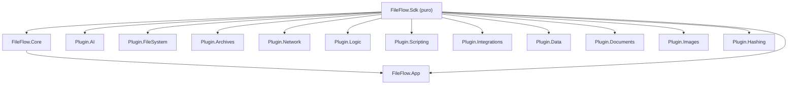

# FASE 1 — Auditoría de Código, Análisis de Patrones y Plan de Refactorización

> [!NOTE]
> **Estado (actualizado 2026-09-22): Fases 2A, 2B, 2C, 2E y 2F están 100% COMPLETADAS.**
> La ejecución de 2A/2B ocurrió en un ciclo de trabajo previo no reflejado originalmente en este documento; quedó documentada en
> [`docs/history/2026-09-13_PROJECT_WALKTHROUGH_ARCHIVE.md`](file:///e:/Users/kaoti/Documentos/GitHub/ArchiveProceser/docs/history/2026-09-13_PROJECT_WALKTHROUGH_ARCHIVE.md).
> Las fases 2C y 2E se ejecutaron el 2026-09-21 en la rama `feature/crossplatform-avalonia`; la 2F, el 2026-09-22.
> Verificado tras la ejecución: build limpio (0 errores, 0 warnings) y suite completa en verde (1146 superadas, 1 skip intencional, de 1147 tests tras la 2F — la suite creció desde los 481 originales de esta auditoría).
> **Fase 3**: ✅ COMPLETADA (fase 0 y sub-fases 3A a 3J) — los huecos que quedaron abiertos tras 2E-P8…2E-P12 están
> ejecutados y cada uno registrado en este documento con su evidencia; el plan que los ordenaba es
> [`docs/history/2026-09_phase3_gaps_plan.md`](2026-09_phase3_gaps_plan.md).
>
> **Fase 2D**: ✅ COMPLETADA — `FileFlow.Plugin.AI` quedó **100% migrado** (18/18 nodos) y la 2D-D3b llevó los **52 nodos** restantes de los demás plugins a `FlowNodeBase`. Ya **no queda ningún nodo del proyecto implementando `IFlowNode` a mano** (sólo las interfaces del SDK y dobles de test).
>
> - **C1–C5** ✅ — Motores monolíticos modularizados: `AiModelManager`, `OnnxInferenceEngine`, `LanguageInferenceEngine`, `AudioInferenceEngine` y la coordinación Log ↔ Inspector.
> - **E1–E3** ✅ — Ciclo de vida ONNX unificado, `GC.Collect()` de `PluginLoader` evaluado y justificado, y bloques `catch` silenciosos refinados con diagnóstico explícito.
> - **F1–F3** ✅ — Las tres cachés de sesiones ONNX (gestor genérico, audio y embeddings) unificadas en `OnnxSessionStore` + `OnnxSessionRegistry`: un solo evento de estado, un solo conteo para la UI y `IsModelLoaded` correcto en cualquier motor.
>
> - **A1/A2** ✅ — `RegexLibraryService`/`RegexHelperViewModel`/`RegexHelperWindow` duplicados eliminados de `FileFlow.App`; única copia canónica en `FileFlow.Plugin.FileSystem/UI/`.
> - **B1** ✅ — `ConceptDictionary` externalizado a `FileFlow.Plugin.AI/Resources/visual_concepts_es_en.json` (EmbeddedResource). `PromptTranslator.cs` bajó de 841 → 180 líneas.
> - **B2** ✅ — Catálogo de modelos externalizado a `FileFlow.Plugin.AI/Resources/ai_models_catalog.json`. `AiModelManager.cs` refactorizado a fachada de 215 líneas.
> - **B3** ✅ — Los 12 temas externalizados a `FileFlow.App/Resources/builtin_themes.json`. `BuiltInThemesCatalog.cs` bajó de 329 → 46 líneas.

## Resumen Ejecutivo

| Métrica | Valor |
|---|---|
| **Líneas C# totales** | ~43.400 |
| **Archivos .cs (sin bin/obj/test)** | ~255 |
| **Archivos de test** | 92 (10.316 líneas) |
| **Tests** | 481 / 481 ✅ |
| **Compilación** | 0 errores, 0 warnings |

### Distribución por proyecto (C# sin tests)

| Proyecto | Archivos | Líneas | % total |
|---|---|---|---|
| FileFlow.App | 84 | 10.640 | 32% |
| FileFlow.Plugin.AI | 26 | 6.328 | 19% |
| FileFlow.Plugin.FileSystem | 29 | 3.968 | 12% |
| FileFlow.Sdk | 50 | 3.462 | 10% |
| FileFlow.Core | 20 | 2.962 | 9% |
| Resto de plugins (7) | 39 | 4.601 | 14% |
| FileFlow.Tests | 92 | 10.316 | — |

---

## 1. Archivos Monolíticos Críticos (≥300 líneas)

> [!WARNING]
> Estos archivos concentran demasiadas responsabilidades y son los principales candidatos a modularización.

### 🔴 Prioridad ALTA (≥500 líneas)

| Archivo | Líneas | Problema |
|---|---|---|
| [`PromptTranslator.cs`](file:///e:/Users/kaoti/Documentos/GitHub/ArchiveProceser/FileFlow.Plugin.AI/PromptTranslator.cs) | **841** | ~600 líneas son un diccionario estático literal de 400+ entradas español→inglés. Mezcla datos y lógica de traducción en un solo fichero. |
| [`AiModelManager.cs`](file:///e:/Users/kaoti/Documentos/GitHub/ArchiveProceser/FileFlow.Plugin.AI/AiModelManager.cs) | **826** | Clase `static` monolítica que combina: catálogo de modelos (datos), descarga HTTP con progreso, gestión de URLs configurables, persistencia JSON, y verificación de integridad. Viola SRP severamente. |
| [`OnnxInferenceEngine.cs`](file:///e:/Users/kaoti/Documentos/GitHub/ArchiveProceser/FileFlow.Plugin.AI/OnnxInferenceEngine.cs) | **761** | Motor de inferencia que acumula métodos para clasificación, detección facial, detección de objetos, super-resolución, eliminación de fondo y moderación de contenido — cada método es un mini-motor con preprocesado/postprocesado propio. |
| [`WorkflowExecutor.cs`](file:///e:/Users/kaoti/Documentos/GitHub/ArchiveProceser/FileFlow.Core/Engine/WorkflowExecutor.cs) | **628** | Orquestador del DAG con lógica de checkpointing, telemetría, dry-run y journaling entremezclados (ya fue refactorizado parcialmente). |
| [`LogView.xaml`](file:///e:/Users/kaoti/Documentos/GitHub/ArchiveProceser/FileFlow.App/Views/LogView.xaml) | **568** | XAML muy extenso con DataGrid complejo, menú contextual, templates inline y converters. |
| [`NodeCardView.xaml`](file:///e:/Users/kaoti/Documentos/GitHub/ArchiveProceser/FileFlow.App/Views/Components/NodeCardView.xaml) | **648** | XAML con muchas secciones condicionales (badges de telemetría, puertos, indicadores). |

### 🟡 Prioridad MEDIA (300–500 líneas)

| Archivo | Líneas | Problema |
|---|---|---|
| [`LogViewModel.cs`](file:///e:/Users/kaoti/Documentos/GitHub/ArchiveProceser/FileFlow.App/ViewModels/LogViewModel.cs) | 498 | Gestiona filtrado, paginación, exportación, sincronización con SQLite y sincronización con Inspector — demasiados ejes de responsabilidad. |
| [`ControlBarViewModel.cs`](file:///e:/Users/kaoti/Documentos/GitHub/ArchiveProceser/FileFlow.App/ViewModels/ControlBarViewModel.cs) | 488 | Gestiona ejecución, UI de drawer, apertura de manuales, idioma, watchdog — ya fue parcialmente delegado. |
| [`LanguageInferenceEngine.cs`](file:///e:/Users/kaoti/Documentos/GitHub/ArchiveProceser/FileFlow.Plugin.AI/LanguageInferenceEngine.cs) | 484 | Motor NLP monolítico que mezcla traducción MarianMT, NLLB-200, tokenización, inferencia LLM y SRT parsing. |
| [`AudioInferenceEngine.cs`](file:///e:/Users/kaoti/Documentos/GitHub/ArchiveProceser/FileFlow.Plugin.AI/AudioInferenceEngine.cs) | 461 | Motor de audio: resampling NAudio, Silero VAD, Piper TTS, generador armónico, recorte de silencios — todo en una sola clase. |
| [`RenamerPresetService.cs`](file:///e:/Users/kaoti/Documentos/GitHub/ArchiveProceser/FileFlow.Sdk/Renaming/RenamerPresetService.cs) | 452 | Contiene los presets hardcodeados como datos estáticos extensos + lógica de carga JSON + fallback. |
| [`ToolboxViewModel.cs`](file:///e:/Users/kaoti/Documentos/GitHub/ArchiveProceser/FileFlow.App/ViewModels/ToolboxViewModel.cs) | 448 | Gestiona perspectivas, búsqueda por tags, favoritos, persistencia de preferencias, y ordenación. |
| [`EditorViewModel.cs`](file:///e:/Users/kaoti/Documentos/GitHub/ArchiveProceser/FileFlow.App/ViewModels/EditorViewModel.cs) | 442 | Contiene operaciones de grafo, serialización, gestión de anotaciones y grupos en un solo ViewModel. |
| [`NodeInspectorViewModel.cs`](file:///e:/Users/kaoti/Documentos/GitHub/ArchiveProceser/FileFlow.App/ViewModels/NodeInspectorViewModel.cs) | 410 | Gestiona inspección, test de nodos, snapshots, previsualización y sincronización con LogView. |
| [`NodeViewModel.cs`](file:///e:/Users/kaoti/Documentos/GitHub/ArchiveProceser/FileFlow.App/ViewModels/NodeViewModel.cs) | 402 | Ya fue parcialmente delegado en `NodeCategoryStyling` y `NodeSwitchCaseCoordinator`. |
| [`AiModelManagerViewModel.cs`](file:///e:/Users/kaoti/Documentos/GitHub/ArchiveProceser/FileFlow.App/ViewModels/AiModelManagerViewModel.cs) | 363 | Lógica de UI + descarga + estado de error + filtrado — aceptable pero denso. |
| [`NodeParameterViewModel.cs`](file:///e:/Users/kaoti/Documentos/GitHub/ArchiveProceser/FileFlow.App/ViewModels/NodeParameterViewModel.cs) | 359 | Renderizado de parámetros + evaluación de templates + mapeo de DisplayName. |
| [`SqliteLogStore.cs`](file:///e:/Users/kaoti/Documentos/GitHub/ArchiveProceser/FileFlow.Core/Telemetry/SqliteLogStore.cs) | 333 | Ya fue parcialmente delegado en `SqliteLogSchema` y `SqliteLogMetricsReader`. |
| [`BuiltInThemesCatalog.cs`](file:///e:/Users/kaoti/Documentos/GitHub/ArchiveProceser/FileFlow.App/Services/BuiltInThemesCatalog.cs) | 326 | 12 temas definidos como objetos literales extensos — datos puros que podrían externalizarse. |
| [`FolderSourceNode.cs`](file:///e:/Users/kaoti/Documentos/GitHub/ArchiveProceser/FileFlow.Plugin.FileSystem/FolderSourceNode.cs) | 327 | Nodo con lógica compleja de filtrado, escaneo recursivo y watchdog. |
| [`VariableTemplateResolver.cs`](file:///e:/Users/kaoti/Documentos/GitHub/ArchiveProceser/FileFlow.Sdk/TemplateEngine/VariableTemplateResolver.cs) | 316 | Motor de resolución de tokens — fue parcialmente delegado. |
| [`WorkflowCliRunner.cs`](file:///e:/Users/kaoti/Documentos/GitHub/ArchiveProceser/FileFlow.Core/Engine/WorkflowCliRunner.cs) | 315 | Runner CLI con parsing de argumentos, reporting JSON y watchdog. |
| [`AdvancedRenamerNode.cs`](file:///e:/Users/kaoti/Documentos/GitHub/ArchiveProceser/FileFlow.Plugin.FileSystem/AdvancedRenamerNode.cs) | 303 | Nodo complejo con lógica de renombrado virtual/directo + colisiones. |

---

## 2. Código Duplicado y Oportunidades DRY

### 🔴 CRÍTICO: Clases completamente duplicadas entre `FileFlow.App` y `FileFlow.Plugin.FileSystem`

> [!CAUTION]
> Los siguientes archivos son **copias exactas o casi exactas** que coexisten en ambos proyectos. Esto viola DRY de forma grave y genera divergencia inevitable.

| Clase/Vista | Ubicación App | Ubicación Plugin | Acción |
|---|---|---|---|
| `RegexLibraryService.cs` | [`FileFlow.App/Services/`](file:///e:/Users/kaoti/Documentos/GitHub/ArchiveProceser/FileFlow.App/Services/RegexLibraryService.cs) (283L) | [`FileFlow.Plugin.FileSystem/UI/Services/`](file:///e:/Users/kaoti/Documentos/GitHub/ArchiveProceser/FileFlow.Plugin.FileSystem/UI/Services/RegexLibraryService.cs) (267L) | **Eliminar la copia de App** — la versión canónica debe vivir en el plugin. |
| `RegexHelperViewModel.cs` | [`FileFlow.App/ViewModels/`](file:///e:/Users/kaoti/Documentos/GitHub/ArchiveProceser/FileFlow.App/ViewModels/RegexHelperViewModel.cs) (242L) | [`FileFlow.Plugin.FileSystem/UI/ViewModels/`](file:///e:/Users/kaoti/Documentos/GitHub/ArchiveProceser/FileFlow.Plugin.FileSystem/UI/ViewModels/RegexHelperViewModel.cs) (213L) | **Eliminar la copia de App**. |
| `RegexHelperWindow.xaml` | [`FileFlow.App/Views/Components/`](file:///e:/Users/kaoti/Documentos/GitHub/ArchiveProceser/FileFlow.App/Views/Components/RegexHelperWindow.xaml) (244L) | [`FileFlow.Plugin.FileSystem/UI/Views/`](file:///e:/Users/kaoti/Documentos/GitHub/ArchiveProceser/FileFlow.Plugin.FileSystem/UI/Views/RegexHelperWindow.xaml) (245L) | **Eliminar la copia de App**. |

> **Líneas rescatables**: ~750 líneas de código muerto eliminadas inmediatamente.

---

### 🟡 Patrón repetido: Boilerplate de nodos de pipeline

Todos los nodos de plugin siguen una estructura repetitiva:
1. `Id`, `Name`, `Description`, `Category` (propiedades idénticas en estructura)
2. `Inputs`/`Outputs` (declaración de puertos)
3. `Parameters` / `ParameterDescriptors`
4. `try/catch(Exception ex)` envolviendo toda la lógica con `context.Log(Error)` + `EmitAsync("Error", item)`
5. Patrón de resolución de modelo: `AiModelManager.ResolveModelPathAsync` → verificar → descargar → logging

**60+ nodos** repiten este scaffolding. Aunque la naturaleza del pipeline (cada nodo tiene lógica de dominio distinta) justifica cierta repetición, hay oportunidades para:

- **Clase base abstracta `FlowNodeBase`** en `FileFlow.Sdk` con:
  - Implementación por defecto de `Id`, `Name`, `Description`, `Category`
  - Wrapper `try/catch` en `ProcessAsync` con emisión automática al puerto `Error`
  - Métodos helper: `EmitErrorAsync`, `EmitOutAsync`, `LogAndEmitError`
- **Clase base `AiFlowNodeBase`** en `FileFlow.Plugin.AI` para los ~18 nodos de IA con:
  - Resolución y descarga automática de modelos (`ResolveModelOrFail`)
  - Patrón común de validación de extensiones de archivo

> **Impacto estimado**: Eliminación de ~15-25 líneas de boilerplate por nodo × 60 nodos = ~900-1500 líneas de código redundante.

---

### 🟡 Datos estáticos extensos embebidos en código

| Archivo | Datos | Líneas datos | Propuesta |
|---|---|---|---|
| [`PromptTranslator.cs`](file:///e:/Users/kaoti/Documentos/GitHub/ArchiveProceser/FileFlow.Plugin.AI/PromptTranslator.cs) | Diccionario de 400+ conceptos visuales ES→EN | ~600 | Externalizar a JSON: `visual_concepts_es_en.json` |
| [`AiModelManager.cs`](file:///e:/Users/kaoti/Documentos/GitHub/ArchiveProceser/FileFlow.Plugin.AI/AiModelManager.cs) | Catálogo de ~20 modelos IA con URLs, tamaños, tiers | ~200 | Externalizar a JSON: `ai_models_catalog.json` |
| [`BuiltInThemesCatalog.cs`](file:///e:/Users/kaoti/Documentos/GitHub/ArchiveProceser/FileFlow.App/Services/BuiltInThemesCatalog.cs) | 12 temas con 30+ propiedades cada uno | ~280 | Externalizar a JSON: `builtin_themes.json` |
| [`RenamerPresetService.cs`](file:///e:/Users/kaoti/Documentos/GitHub/ArchiveProceser/FileFlow.Sdk/Renaming/RenamerPresetService.cs) | Presets de renombrado hardcodeados | ~300 | Ya tiene fallback JSON — eliminar datos hardcoded. |

> **Impacto estimado**: ~1.400 líneas de datos separadas de lógica.

---

## 3. Code Smells y Bugs Latentes

### 3.1 `catch(Exception ex)` genérico excesivo

- **71 ocurrencias** de `catch (Exception ex)` en todo el proyecto.
- En nodos de pipeline esto es aceptable (catch-all para resiliencia del flujo), pero en servicios de UI (`ThemeCustomizerViewModel`, `WorkflowSettingsWindow.xaml.cs`) puede ocultar bugs.

> [!NOTE]
> **Acción**: En servicios no-pipeline, reemplazar por excepciones específicas (`IOException`, `JsonException`, `InvalidOperationException`). En nodos, mantener pero estandarizar el patrón mediante la clase base `FlowNodeBase`.

### 3.2 `GC.Collect()` manual en `PluginLoader.cs`

- [`PluginLoader.cs:192`](file:///e:/Users/kaoti/Documentos/GitHub/ArchiveProceser/FileFlow.Core/Plugins/PluginLoader.cs#L192): Llamada explícita a `GC.Collect()` durante la carga de plugins.
- Impacto potencial: pausa de GC durante el arranque de la app.

> **Acción**: Evaluar si es necesario o si se puede eliminar. Si se necesita liberar `AssemblyLoadContext`, usar `ConditionalWeakTable` o `WeakReference`.

### 3.3 Ausencia de `IDisposable` en motores de inferencia

- `OnnxInferenceEngine`, `LanguageInferenceEngine`, `AudioInferenceEngine` mantienen caches de `InferenceSession` (GPU/DirectML) como campos estáticos `Lazy<T>` pero **no implementan `IDisposable`**.
- Las sesiones ONNX **deberían liberarse** al cerrar la aplicación para devolver memoria GPU.

> **Acción**: Implementar patrón `IDisposable` o método `Shutdown()` invocado en `App.OnExit`.

### 3.4 Solo 3 marcadores `TODO`/`FIXME`/`HACK` en toda la base de código

✅ Muy limpio. Los 3 están en archivos no críticos (converters y enums).

### 3.5 Sin antipatrones `.Result` ni `.Wait()`

✅ Excelente — todo el I/O asíncrono está bien propagado.

### 3.6 Sin instancias de `new HttpClient()`

✅ Correcto — se usa factory method con `SocketsHttpHandler`.

---

## 4. Dependencias y Acoplamiento

### Relaciones de dependencia actuales (correctas)



✅ **No se detectan dependencias circulares**. Los plugins solo dependen de `Sdk`. `Core` solo depende de `Sdk`. `App` depende de `Core` y `Sdk`.

### Riesgos de acoplamiento

- **`FileFlow.Plugin.AI`** es el módulo más grande (6.328 líneas, 26 archivos) — casi el doble que el siguiente plugin. Su relación interna entre los 4 motores de inferencia y los 18 nodos es estrecha pero justificada por el dominio.

---

## 5. Plan de Refactorización y Modularización

### Fase 2A — Limpieza Inmediata (Riesgo bajo, alto impacto) — ✅ COMPLETADA

> Ejecutada y documentada en [`2026-09-13_PROJECT_WALKTHROUGH_ARCHIVE.md`](file:///e:/Users/kaoti/Documentos/GitHub/ArchiveProceser/docs/history/2026-09-13_PROJECT_WALKTHROUGH_ARCHIVE.md). Verificado en código actual: única copia canónica en `FileFlow.Plugin.FileSystem/UI/Services/`, sin duplicados en `FileFlow.App`.

| # | Acción | Archivos | Impacto | Estado |
|---|---|---|---|---|
| **A1** | **Eliminar duplicados App ↔ Plugin.FileSystem** (RegexLibraryService, RegexHelperViewModel, RegexHelperWindow) | 6 archivos (~750L eliminadas) | Elimina divergencia y código muerto | ✅ Completado |
| **A2** | **Limpiar código muerto**: verificar si las copias de App se referencian; si no, eliminar directamente | Compilación + grep | 0 regresiones si no se usan | ✅ Completado |

---

### Fase 2B — Externalización de Datos Estáticos (Riesgo bajo) — ✅ COMPLETADA

> Ejecutada y documentada en [`2026-09-13_PROJECT_WALKTHROUGH_ARCHIVE.md`](file:///e:/Users/kaoti/Documentos/GitHub/ArchiveProceser/docs/history/2026-09-13_PROJECT_WALKTHROUGH_ARCHIVE.md) (líneas 2075-2077). Los JSON se cargan como `EmbeddedResource` (respuesta a la pregunta abierta original), resolviendo esta fase por completo.

| # | Acción | Archivos | Impacto | Estado |
|---|---|---|---|---|
| **B1** | Externalizar `ConceptDictionary` de `PromptTranslator.cs` a JSON | 1 CS + 1 JSON | PromptTranslator baja de 841 → ~240 líneas | ✅ Completado (841 → 180L, `visual_concepts_es_en.json`) |
| **B2** | Externalizar catálogo de modelos de `AiModelManager.cs` a JSON | 1 CS + 1 JSON | AiModelManager baja de 826 → ~620 líneas | ✅ Completado (fachada de 215L, `ai_models_catalog.json`) |
| **B3** | Externalizar temas de `BuiltInThemesCatalog.cs` a JSON | 1 CS + 1 JSON | BuiltInThemesCatalog baja de 326 → ~60 líneas | ✅ Completado (329 → 46L, `builtin_themes.json`) |

---

### Fase 2C — Modularización de Motores Monolíticos (Riesgo medio) — ✅ COMPLETADA

> Los cinco motores quedaron reducidos a fachadas delegantes que conservan intacta la API pública,
> de modo que ningún nodo ni test tuvo que cambiar sus llamadas.

| # | Archivo original | Propuesta de extracción | Nuevos módulos | Resultado final | Estado |
|---|---|---|---|---|---|
| **C1** | `AiModelManager.cs` (826L) | Separar en: catálogo, descargador, configuración de URLs | `AiModelCatalog.cs`, `AiModelDownloader.cs`, `AiModelUrlConfig.cs` | `AiModelManager.cs` → **144L** (`AiModelCatalog` 135L, `AiModelDownloader` 278L, `AiModelUrlConfig` 169L) | ✅ Completado |
| **C2** | `OnnxInferenceEngine.cs` (761L) | Separar por dominio de inferencia | `ClassificationInference.cs`, `FaceDetectionInference.cs`, `ObjectDetectionInference.cs`, `ImageProcessingInference.cs` | `OnnxInferenceEngine.cs` → **56L** (fachada); dominios en `FileFlow.Plugin.AI/Inference/`: `ImageClassificationInference`, `FaceDetectionInference`, `ObjectDetectionInference`, `BackgroundSegmentationInference`, `SuperResolutionInference`, `TensorPreprocessors`, `OnnxSessionManager` | ✅ Completado |
| **C3** | `LanguageInferenceEngine.cs` (484L) | Separar por tipo de tarea NLP | `TranslationEngine.cs`, `LlmInferenceEngine.cs`, `SrtParser.cs` | `LanguageInferenceEngine.cs` → **145L** (fachada); módulos en `Engines/Language/`: `TranslationEngine` 151L, `LlmInferenceEngine` 176L, `SrtParser` 61L, más `LanguageIdentifier` 67L y `MultilingualTranslator` 111L | ✅ Completado |
| **C4** | `AudioInferenceEngine.cs` (461L) | Separar por función de audio | `AudioResampler.cs`, `VadEngine.cs`, `TtsEngine.cs` | `AudioInferenceEngine.cs` → **65L** (fachada); módulos en `Engines/Audio/`: `VadEngine` 273L, `TtsEngine` 96L, `AudioSessionStore` (delgado sobre el almacén compartido; sustituyó a `AudioSessionCache` en la fase 2F). El rol de `AudioResampler` ya estaba cubierto por `AudioWaveUtilities.cs` (148L: decodificación, resampling a 16 kHz mono y exportación PCM) | ✅ Completado |
| **C5** | `LogViewModel.cs` (498L) | Extraer coordinación con Inspector | `LogInspectorSyncService.cs` | La coordinación residía en `MainViewModel` —ambos constructores suscribían `LogSelectionChanged` dos veces, provocando una doble llamada a `Inspector.InspectLogRecord`—. Ahora `LogInspectorSyncService.cs` (40L) concentra el flujo Log → Inspector con exactamente una suscripción, y `MainViewModel` la libera vía `IDisposable` | ✅ Completado |

---

### Fase 2D — Abstracción de Boilerplate de Nodos (Riesgo bajo-medio) — ✅ COMPLETADA

| # | Acción | Ubicación | Estado |
|---|---|---|---|
| **D1** | Crear `FlowNodeBase` abstracto en `FileFlow.Sdk` con propiedades comunes e implementación de try/catch | `FileFlow.Sdk/FlowNodeBase.cs` | ✅ Completado |
| **D2** | Crear `AiFlowNodeBase` en `FileFlow.Plugin.AI` con resolución/descarga de modelos | `FileFlow.Plugin.AI/Common/AiFlowNodeBase.cs` | ✅ Completado |
| **D3a** | Migrar los nodos simples de `FileFlow.Plugin.AI` (audio, lenguaje, visión) | 15 nodos | ✅ Completado (2 anteriores ya migrados: `FaceDetectorNode`, `ImageTypeClassifierNode`) |
| **D3b** | Migrar los nodos restantes de los demás plugins | 52 nodos | ✅ Completado |

**Migración D3a — 15 nodos sobre la base (ganancia neta ≈ 700 líneas):**

| Nodo | Antes | Después | Base |
|---|---|---|---|
| `VoiceActivityDetectorNode` | 261 | 199 | `AudioAiFlowNodeBase` |
| `TextToSpeechNode` | 244 | 180 | `AudioAiFlowNodeBase` |
| `LocalWhisperTranscriberNode` | 244 | 243 | `FlowNodeBase` (sin ciclo de vida: Whisper.net instancia su grafo por llamada, no vive en la caché ONNX) |
| `LocalAiTranslatorNode` | 260 | 189 | `AiFlowNodeBase` |
| `LocalLlmProcessorNode` | 248 | 176 | `AiFlowNodeBase` |
| `PiiAnonymizerNode` | 248 | 220 | `AiFlowNodeBase` (identidad y ciclo de vida explícitos: regex determinista, sin sesión ONNX) |
| `PromptTransformerNode` | 140 | 92 | `AiFlowNodeBase` (modelo fijado por diseño vía `DefaultModelSelection`) |
| `LocalOcrNode` | 166 | 165 | `FlowNodeBase` (Tesseract no pasa por el gestor de sesiones) |
| `ZeroShotSemanticSearchNode` | 170 | 168 | `AiFlowNodeBase` (fase 2F: su motor de embeddings emite al evento único) |
| `BackgroundRemoverNode` | 359 | 277 | `AiFlowNodeBase` |
| `SuperResolutionUpscalerNode` | 271 | 189 | `AiFlowNodeBase` |
| `ObjectDetectorNode` | 223 | 141 | `AiFlowNodeBase` |
| `PromptObjectDetectorNode` | 214 | 150 | `AiFlowNodeBase` |
| `ContentModerationFilterNode` | 213 | 131 | `AiFlowNodeBase` |
| `SmartImageClassifierNode` | 197 | 115 | `AiFlowNodeBase` |

**Lo que aporta la base y ya no se repite en cada nodo:** `Id`, `Inputs`/`Outputs`/`Parameters` tipados, `Name`/`Category`/`Description` como `override`, el relay débil `WeakModelStatusRelay` (`ModelStatusChanged` + `RaiseModelStatusChanged`), y todo `IModelLifecycleNode` (`IsModelLoaded`, `ModelIdentifier`, `IsGpuAccelerated`, `PreloadModelAsync`, `UnloadModel`).

**Puntos de extensión de `AiFlowNodeBase`** para que la migración no duplicase nada. Esta fase introdujo un constructor protegido `(subscribe, unsubscribe)` y cuatro ganchos del almacén de sesiones; la fase 2F los sustituyó por un **único** punto de extensión —`protected virtual OnnxSessionStore SessionStore`— más `DefaultModelSelection`, con un solo evento observado para todos los motores.

> **Evidencia de la ejecución 2D-D3a (2026-09-21, rama `feature/crossplatform-avalonia`)**
>
> - `FileFlow.Plugin.AI` pasa de 15 nodos con el ciclo de vida copiado a mano a 0 (18/18 nodos en la jerarquía).
> - `Common/AudioAiFlowNodeBase.cs` (nuevo) es la especialización de audio: apunta al almacén de audio en lugar del genérico, que era una caché distinta. La fase 2F lo redujo a esa única diferencia, una vez que todos los almacenes publicaron en el mismo evento.
> - `AiFlowNodeBase.cs` 113 → 172 líneas: el crecimiento son los ganchos de extensión, menos de lo que ahorran sus 15 consumidores.
> - 3458 → 2635 líneas en los 15 nodos migrados (**-823**, -24%); con la base incluida, -700 netas.
> - `MultimodalVisionLlmNode` conserva su ciclo de vida propio: gestiona un VLM in-process con proveedor alternativo, no es boilerplate duplicado.
> - Verificación: `dotnet build` sin errores ni advertencias y `dotnet test` con **1143 superadas / 0 fallos / 1 omitida** (idéntico al baseline).

**Migración D3b — los 52 nodos restantes sobre la base:**

| Plugin | Nodos | Nodos migrados |
|---|---|---|
| `FileSystem` | 13 | `SyntheticDataSourceNode`, `FolderSourceNode`, `VariableInjectorNode`, `OperationReportNode`, `LogOutputNode`, `DocumentProcessorNode`, `DirectoryInspectorNode`, `AdvancedRenamerNode`, `SafeRecycleDeleteNode`, `OriginalFileActionNode`, `FileRelocatorNode`, `EmptyDirectoryCleanerNode`, `DestinationSinkNode` |
| `Logic` | 10 | `BatchBufferNode`, `BestVersionSelectorNode`, `ExpressionFilterNode`, `FileForkNode`, `ForkJoinBarrierNode`, `IntermediateCleanupNode`, `SwitchActiveFileNode`, `SwitchCaseNode`, `VersionRouterNode`, `ThrottleDelayNode` |
| `Data` | 7 | Lectores (`ExcelReaderNode`, `CsvReaderNode`), procesamiento (`DataLookupNode`, `DataFormatConverterNode`) y exportadores (`SqliteDatabaseSinkNode`, `ExcelReportGeneratorNode`, `CsvExportNode`) |
| `Archives` | 5 | `SmartUnpackNode`, `ArchiveFilterNode`, `ArchiveFanOutNode`, `ArchiveFanInNode`, `ArchiveCompressorNode` |
| `Documents` | 4 | `PdfTextExtractorNode`, `PdfSplitNode`, `PdfMetadataNode`, `PdfMergeNode` |
| `Integrations` | 3 | `CliExecutionNode`, `MediaTranscoderNode`, `WebhookNotificationNode` |
| `Subflows` | 3 | `SubflowNode`, `SubflowInputNode`, `SubflowOutputNode` |
| `Hashing` | 2 | `HashCalculatorNode`, `DeduplicationFilterNode` |
| `Images` | 2 | `ImageOptimizerNode`, `ExifMetadataNode` |
| `Network` | 2 | `NetworkDownloadNode`, `NetworkUploadNode` |
| `Scripting` | 1 | `CustomScriptNode` |

**Qué desapareció de cada nodo:** la declaración de `Id`, las propiedades `Inputs`/`Outputs`/`Parameters` con inicializador inline (ahora se pueblan en el constructor sobre el diccionario de la base) y los `override` de `Name`/`Category`/`Description`, `ExecuteAsync`, `OnWorkflowCompletedAsync`, `ParameterDescriptors`, `CustomActions` y `MaxConcurrency`.

**Sin cambios de comportamiento observable.** La migración fue estrictamente estructural: las lecturas de parámetros se conservaron con `Parameters.TryGetValue` + `ParameterHelper` —más tolerante entonces que `GetParameter<T>` ante `JsonElement`, `long` o números embebidos en cadenas—, y las llamadas a `context.Log` / `context.EmitAsync` se mantienen tal cual porque los registros con `durationMs` y `detailsJson` no tienen equivalente en los ayudantes de la base.

> **Actualización (2026-09-22): este párrafo ya no describe el estado del código.** El paréntesis anterior era la razón de no usar el ayudante tipado, y se eliminó en la fase siguiente: `ParameterHelper` y `GetParameter<T>` pasaron a delegar en un único `ParameterValueConverter`, y las ~180 lecturas manuales de parámetros de los nodos se migraron al ayudante tipado (ver el bloque de evidencia de la fase 2E-D1 más abajo). Ya no queda ninguna lectura de `Parameters` fuera del ayudante en los nodos de los plugins.

**Dos patrones que exigieron conservar la forma original:**

- **Puertos calculados** (`SwitchCaseNode.Outputs`, `SubflowNode.Inputs`/`Outputs`, `SubflowInputNode.Outputs`, `SubflowOutputNode.Inputs`, `CustomScriptNode.Inputs`/`Outputs`): se declararon entonces como `override` con sólo el `get`, porque se recalculan en tiempo de diseño desde la UI. **Ya no: ver la actualización de abajo.**
- **Constructores preexistentes** (`SubflowNode`, `CustomScriptNode`): sus valores por defecto se integraron en el constructor que ya existía en lugar de crear uno nuevo.

**Los nodos que no debían migrarse no se migraron:** `MultimodalVisionLlmNode` sigue sobre `FlowNodeBase` con su propio `IModelLifecycleNode` (VLM in-process con proveedor alternativo, no es boilerplate).

> **Evidencia de la ejecución 2D-D3b (2026-09-22, rama `feature/crossplatform-avalonia`)**
>
> - 52/52 nodos migrados; buscar `: IFlowNode` en los plugins devuelve 0 implementaciones.
> - 0 declaraciones propias de `Id`, `Parameters`, `Inputs` u `Outputs` quedan en los nodos de los plugins.
> - `dotnet build` sin errores ni advertencias: los 11 plugins compilan sin `CS0108`/`CS0114` de ocultación.
> - `dotnet test`: **1146 superadas / 0 fallos / 1 omitida**, idéntico al baseline previo a la migración.

---

### Fase 2E — Mejoras de Robustez (Riesgo bajo) — ✅ COMPLETADA

| # | Acción | Resultado | Estado |
|---|---|---|---|
| **E1** | Implementar `IDisposable`/`Shutdown()` en motores de inferencia ONNX | Liberación determinista de memoria no administrada vía `AiPluginInitializer.ClearAllSessions()`, que cierra las cachés de `OnnxInferenceEngine`, `AudioInferenceEngine`, `SemanticEmbeddingEngine` y `LanguageInferenceEngine`. Desde la fase 2F es una sola llamada a `OnnxSessionRegistry.ClearAll()`, que recorre los almacenes registrados. El cierre del `PluginLoader` ya libera además cada `AssemblyLoadContext` | ✅ Completado |
| **E2** | Evaluar/eliminar `GC.Collect()` en `PluginLoader.cs` | Se **conserva** y queda documentado en el código: la descarga de `AssemblyLoadContext` es cooperativa y el runtime solo libera los ensamblados tras una recolección completa más `WaitForPendingFinalizers()`. `UnloadAll()` es una operación explícita de recarga de plugins, nunca una ruta crítica, así que no hay impacto en rendimiento. Se descartó eliminarlo porque las DLL nativas seguirían retenidas | ✅ Completado (evaluado y justificado) |
| **E3** | Refinar `catch(Exception)` en servicios de UI por excepciones específicas | Bloques `catch` genéricos revisados: los silenciosos quedaron anotados con su motivo (operaciones resilientes/non-críticas) y los que ocultaban errores reales ahora registran diagnóstico explícito (`DiagnosticLog.Error` / `Debug.WriteLine`) | ✅ Completado |

> **Evidencia de la ejecución 2C/2E (2026-09-21, rama `feature/crossplatform-avalonia`)**
>
> - `LanguageInferenceEngine.cs` 585 → 145 líneas; `AudioInferenceEngine.cs` 432 → 65 líneas.
> - Nueva jerarquía de módulos: `Engines/Language/` (5 archivos) y `Engines/Audio/` (3 archivos).
> - La API pública de ambas fachadas (`TranslateAsync`, `GenerateLlmAsync`, `NormalizeLanguageCode`, `DetectLanguage`, `TranslateWithSemanticEngine`, `TransformPromptAsync`, `ClearSessionCache`, `DetectVoiceActivityAsync`, `SynthesizeSpeechAsync`, `SessionStateChanged`, `UnloadSession`) se preservó sin cambios, por lo que nodos y tests no requirieron modificaciones.
> - Nuevo `FileFlow.App/Services/LogInspectorSyncService.cs` que elimina una suscripción duplicada del canal Log → Inspector.
> - Verificación final: `dotnet build` sin errores ni advertencias y `dotnet test` con **1143 superadas / 0 fallos / 1 omitida**.

---

### Fase 2F — Almacén Único de Sesiones ONNX (Riesgo medio) — ✅ COMPLETADA

| # | Acción | Resultado | Estado |
|---|---|---|---|
| **F1** | Unificar las tres cachés de sesiones ONNX detrás de una sola abstracción | `OnnxSessionStore` (caché + lock + evento + consulta/descarga), `OnnxSessionFactory` (opciones CPU/DirectML) y `OnnxSessionRegistry` (evento único y consultas agregadas) | ✅ Completado |
| **F2** | Que todos los motores emitan el mismo evento de estado | `OnnxSessionManager.SessionStateChanged` y `AudioInferenceEngine.SessionStateChanged` reexpiden `OnnxSessionRegistry.SessionStateChanged`; el almacén de embeddings emite por primera vez | ✅ Completado |
| **F3** | Un nodo reporta `IsModelLoaded` correctamente sobre cualquier motor | `AiFlowNodeBase` queda con un único punto de extensión (`protected virtual OnnxSessionStore SessionStore`); `ZeroShotSemanticSearchNode` pasa a `AiFlowNodeBase` y ya reporta el modelo de embeddings | ✅ Completado |

**Antes / después:**

| Antes | Después |
|---|---|
| `OnnxSessionManager` (diccionario + lock + evento + DirectML) | Fachada de 1 almacén (`Vision`); misma API pública |
| `Engines/Audio/AudioSessionCache` (diccionario + lock + evento, sin descarga granular) | `AudioSessionStore` = almacén `Audio`, 20L |
| Diccionario privado en `SemanticEmbeddingEngine`, **sin evento ni descarga** | Almacén `SemanticEmbeddings` registrado, 9L |
| `LanguageInferenceEngine._sessions`: caché fantasma que ningún camino poblaba | Eliminada; su `ClearSessionCache()` delega en el almacén por defecto |
| Conteo de la barra de estado = visión + audio (**embeddings fuera**) | `OnnxSessionRegistry.GetLoadedSessionCount()` = suma de los tres almacenes |
| `AiPluginInitializer` suscrito a dos eventos (doble notificación) | Una sola suscripción al evento del registro |

> **Evidencia de la ejecución 2F (2026-09-22, rama `feature/crossplatform-avalonia`)**
>
> - Nuevos: `Inference/OnnxSessionStore.cs`, `Inference/OnnxSessionFactory.cs`, `Inference/OnnxSessionRegistry.cs`; eliminado `Engines/Audio/AudioSessionCache.cs`.
> - Un almacén no registrado está por definición vacío: cada uno se registra en su constructor estático, antes de poder materializar sesión alguna, así que el conteo y la liberación globales no dejan memoria viva sin contabilizar.
> - `WeakModelStatusRelayTests` sigue exigiendo exactamente una suscripción por nodo: los 18 nodos observan un único evento.
> - Nuevas pruebas: `SessionStateEvent_ShouldBeSharedByEveryEngine`, `OnnxSessionRegistry_ShouldAggregateEveryEngineStore`, `ZeroShotSemanticSearchNode_ShouldReportModelLifecycle`.
> - Verificación: `dotnet build` sin errores ni advertencias y `dotnet test` con **1146 superadas / 0 fallos / 1 omitida** (baseline 1143 + 3 nuevas).

---

## Fase 2E-D1 — Unificación del acceso a parámetros (2026-09-22, rama `feature/crossplatform-avalonia`)

**Motivo.** `FlowNodeBase.GetParameter<T>` existía desde la fase D1 pero tenía **cero llamadas en producción**: usaba `Convert.ChangeType`, así que ante un `JsonElement` (un parámetro leído de un perfil guardado) devolvía siempre el valor por defecto, y ante un `long` fuera de rango de `int` también. Los nodos leían con `Parameters.TryGetValue` + `ParameterHelper` precisamente porque el ayudante tipado no era seguro. Había entonces dos rutas de lectura con semánticas distintas y ~180 lecturas manuales.

**Qué se hizo.**

- **Un único núcleo:** `FileFlow.Sdk/ParameterValueConverter` implementa la conversión completa (texto, booleano, enteros de todos los tamaños, decimales, enums, nulables y *fallback* invariante). `ParameterHelper` y `GetParameter<T>` delegan en él, así que la equivalencia es por construcción y no por coincidencia.
- **Contrato fijado con pruebas literales** (no una comparación entre las dos rutas, que sería tautológica): `JsonElement` en todos sus `ValueKind`, `long` fuera de rango, porcentajes (`"50%"` → 50, sin dividir entre 100), unidades de tiempo sólo para enteros (`"2m"` → 120 en `int`, 2 en `double`), números embebidos (`"12abc"` → 12), invariancia de cultura y valores ausentes/nulos.
- **Tres normalizaciones deliberadas**, todas cubiertas por pruebas: `(int)3_000_000_000L` ya no se envuelve a -1294967296 ni `(int)1e12` satura a `int.MaxValue` (fuera de rango → valor por defecto); el paso por cultura actual de `ParameterHelper.GetInt32` se eliminó (se midió que .NET rechaza los separadores de miles, así que era código muerto y el parseo quedó determinista); en los patrones `TryGetValue && GetBoolean(v, true)` —cuyo defecto efectivo al faltar la clave ya era `false`—, un valor presente pero estructuralmente ilegible ahora también da `false`.
- **Migración de las ~180 lecturas** de los 12 plugins al ayudante tipado, incluidos los patrones no normalizados (`v?.ToString() ?? D`, `bool.TryParse`, `int.TryParse`, `Convert.ToInt64`, ternarios encadenados con parámetros heredados) y las lecturas no escalares vía `GetParameter<object?>` (`MethodSteps` de `AdvancedRenamerNode`, especificaciones `Width`/`ScalePercentage` de `ImageOptimizerNode`). Los parámetros heredados (`Pattern`/`NameTemplate`/`CaseTransformation`, `DestinationDirectory`/`DestinationFolder`, `Value`/`ComparisonValue`, `Model`/`ModelSelection`) conservan su respaldo.
- **Lo que no se tocó, a propósito:** las lecturas de `item.Metadata` (no son parámetros del nodo), `ParameterHelper.ResolveOutputPath` y las lecturas de `Parameters` desde ViewModels de UI.

> **Evidencia**
> - `grep -rn "Parameters\.TryGetValue\|ParameterHelper\.Get" FileFlow.Plugin.*/` no devuelve **ninguna** lectura de parámetros fuera del ayudante en los nodos de los plugins.
> - Los dos nodos-doble que se usaron al principio para invocar `GetParameter<T>` (protegido) se eliminaron: el cargador descubre cualquier tipo concreto que implemente `IFlowNode` sin comprobar visibilidad ni ensamblado, así que elevaban el catálogo de 78 a 80 (el propio «78» ya venía inflado por otros ocho dobles de prueba; ver la fase 2E-G1). Ahora el método real se invoca por reflexión sobre un nodo real desde una clase estática (que sí es abstracta y por tanto invisible al descubrimiento).
> - Verificación: `dotnet build` sin errores ni advertencias y `dotnet test` con **1269 superadas / 0 fallos / 1 omitida** (baseline 1166 + 103 pruebas nuevas de contrato, equivalencia y cultura).

## Fase 2E-P1 — Contrato de puertos dinámicos (2026-09-22, rama `feature/crossplatform-avalonia`)

**Motivo.** Cinco nodos sobrescribían `Inputs`/`Outputs` a mano —`SwitchCaseNode`, `SubflowNode` (ambos), `SubflowInputNode`, `SubflowOutputNode` y `CustomScriptNode` (ambos)—, cada uno con su propio bloque `get` y en tres estilos distintos: tres recalculaban en cada lectura (`GetCases()`, `GetConfiguredPorts()`), uno mantenía listas privadas refrescadas a mano (`_inputs`/`_outputs` + `SyncPortsFromParameters`) y otro listas bajo lock (`_inputPorts`/`_outputPorts` + `RefreshDynamicPorts`).

**Contrato nuevo.** `Inputs`/`Outputs` dejaron de ser `virtual`: delegan en `BuildInputPorts()`/`BuildOutputPorts()`, que por defecto devuelven los puertos asignados en el constructor. Un nodo con puertos que dependen de la configuración sobrescribe el hook. Se evalúan en cada lectura **a propósito**: la UI, el portapapeles y la carga de un perfil escriben `Parameters` directamente, así que una caché de puertos quedaría obsoleta sin que nadie se entere — es exactamente el motivo por el que los tres nodos que ya recalculaban lo hacían así.

**Migración de los cinco.** Los tres calculados pasaron su cuerpo al hook; `SubflowNode` conservó su lock y su respaldo de puerto genérico; `CustomScriptNode` eliminó sus dos campos privados y asigna ahora los puertos con los setters protegidos de la base. Los ~60 nodos con puertos fijos no se tocaron: `Inputs = [...]` en el constructor sigue funcionando igual.

**Efecto lateral deseado:** «arreglar» los puertos sobrescribiendo la propiedad ya no compila. La guardia de arquitectura se actualizó para que su mensaje señale el hook en lugar del `override` que sugería antes.

> **Evidencia**
> - `grep -rn "override IReadOnlyList<NodePort>" FileFlow.Plugin.*/` devuelve sólo los cinco hooks nuevos; ninguna propiedad de puertos se sobrescribe.
> - `FlowNodeBasePortsTests` (7 pruebas, con nodos reales) cubre: puertos fijos desde el constructor, los tres casos calculados leyendo de nuevo tras cambiar el parámetro sin ninguna invalidación, el respaldo de puerto genérico del subflujo, el respaldo de `CustomScriptNode` ante un valor en blanco, y una prueba de reflexión que fija que las propiedades no son sobrescribibles y los hooks sí.
> - Hallazgo del test de reflexión: un miembro que implementa un miembro de interfaz se emite como `virtual+final`, así que `IsVirtual` no significa «sobrescribible»; la aserción usa `virtual && !final`.
> - Verificación: `dotnet build` sin errores ni advertencias y `dotnet test` con **1281 superadas / 0 fallos / 1 omitida** (baseline 1274 + las 7 nuevas).

---

## Fase 2E-G1 — Guardia de coherencia del catálogo de nodos (2026-09-22, rama `feature/crossplatform-avalonia`)

**Motivo.** La guardia de arquitectura lee fuentes y `ToolboxOrganizationTests` cuenta el catálogo de runtime, pero **nadie comparaba los dos conjuntos**. Una diferencia en cualquiera de los dos sentidos es invisible: un nodo declarado que el cargador no registra nunca llega al Toolbox y no hay error en ningún sitio, y un tipo registrado que ninguna fuente declara aparece en el producto sin dueño.

**Qué se encontró en cuanto se compararon.** Dos cosas, y la segunda reescribe un dato que estaba en la documentación.

- El conjunto de los 12 plugins es **exactamente** el que el barrido estático deriva de las fuentes: **70 nodos**, sin un solo huérfano ni un intruso.
- El catálogo de runtime mostraba **78**. Los ocho restantes no eran nodos del producto: eran dobles del ensamblado `FileFlow.Tests` (`ConnectionEnergyTests+FakeFlowNode`, `PortSemanticsTests+FakePortNode`, `VariableDiscoveryServiceTests+MockNode`, `PerformanceStressTests+MockFlowNode`, `DependencyInjectionAndPortsTests+FakeModelLifecycleNode`, `VariablePickerAndIntelliSenseTests+DummyNode` y los dos de `WorkflowWorkspaceCleanupIntegrationTests`). El cargador descubre cualquier tipo concreto que implemente `IFlowNode` en cualquier ensamblado que barra, así que el barrido del AppDomain los metía en el catálogo. **El «78 nodos oficiales» que repetían `ToolboxOrganizationTests` y `PROJECT_WALKTHROUGH.md` era ese número inflado**; el producto nunca tuvo 78 nodos.

**El arreglo, en el cargador y no en la guardia.** `PluginLoader.IsTestAssembly` descarta un ensamblado cuando referencia un framework de test (xUnit) —criterio semántico, no por nombre, así que vale para proyectos de integración, de rendimiento o con cualquier nombre—. Un test que de verdad necesite un nodo-doble en el catálogo ya tiene el camino explícito, `RegisterNodeType<T>()`, que es el que usan los dobles que sí deben estar ahí. `ToolboxOrganizationTests` pasa a exigir **70**, y la guardia mantiene la equivalencia con las fuentes, de modo que el número ya no puede quedar obsoleto en silencio.

> **Evidencia**
> - La sonda que midió el catálogo: `declared=70 discoveredTotal=78 fromPlugins=70`, con la diferencia `descubiertos − declarados` compuesta **únicamente** por los ocho dobles de `FileFlow.Tests` y la diferencia inversa **vacía**.
> - `NodeRuntimeCatalogGuardTests` (5 pruebas, con el cargador real de arranque): equivalencia declarado↔descubierto; instanciabilidad real de cada nodo por nombre completo y corto con `CreateNodeInstance` (`Activator.CreateInstance`); composición del catálogo derivada de los proyectos de la solución; ausencia de homónimos que se pisen al indexar por nombre corto; y exclusión de las bases abstractas.
> - **Prueba de mutación del sentido «huérfano»:** un nodo `ZZOrphanProbeNode` declarado en las fuentes de `FileFlow.Plugin.Logic` pero excluido de la compilación (`<Compile Remove>`) hizo fallar la guardia con `huérfanos = [FileFlow.Plugin.Logic.ZZOrphanProbeNode]`. La mutación se revirtió (fichero y csproj) y `grep` confirma que no queda rastro.
> - **Prueba de mutación del sentido «intruso»:** con el filtro del cargador aún sin aplicar, la guardia falló en rojo señalando los tipos del ensamblado de pruebas.
> - **Los dobles también llegaban a la interfaz:** el Toolbox mete en el grupo «General» todo tipo sin `[NodeDefinition]`, así que los ocho dobles formaban un grupo fantasma que sólo existía en el host de pruebas. Al filtrarlos, la captura `panel-toolbox-dark` pasó de 300x545 a 300x522 —la altura de esa cabecera— y hubo que regenerar esa línea base (`FILEFLOW_UPDATE_VISUALS=1`). Se confirmó la causa aislando el filtro: con él desactivado la captura vuelve a coincidir con la línea base antigua. Es la prueba visual de que el catálogo contaminado no era sólo un número.
> - El primer intento de diagnóstico no servía: `BeEquivalentTo` sobre 70 elementos trunca el mensaje a `…39 more…` y no nombraba al nodo infractor. La aserción compara ahora las **diferencias** y las escribe en el mensaje.
> - Verificación: `dotnet build` sin errores ni advertencias y `dotnet test` con **1286 superadas / 0 fallos / 1 omitida** (baseline 1281 + las 5 nuevas).

---

## Fase 2E-P2 — Notificación de topología de puertos y revalidación del lienzo (2026-09-22, rama `feature/crossplatform-avalonia`)

**Motivo.** Los cinco nodos con puertos dinámicos calculan su topología al leerla, y el editor no tenía forma de saber *cuándo* cambia: reconstruía los puertos de la tarjeta sólo al construirla. El resto de caminos eran parches locales —`SyncSubflowPorts()` reconciliaba a mano las colecciones del subflujo, el coordinador de casos insertaba y quitaba puertos por su cuenta— y ninguno de ellos tocaba las **conexiones**, que apuntan a instancias de `PortViewModel` concretas. Renombrar los puertos de un subflujo, quitar un caso de un switch o cambiar los puertos de un script dejaba cables colgando de puertos inexistentes: aristas que el motor ya no vuelve a trazar al reabrir el flujo.

**Contrato nuevo.** `IPortTopologyNode` (junto a `PortTopologyChangedEventArgs`) declara el evento `PortsChanged` y `RefreshPortTopology()`. `FlowNodeBase` lo implementa: el evento se dispara cuando el conjunto de nombres de puertos cambia **de verdad** (la base compara con el último anunciado, así que reevaluar sin cambio es silencioso y barato) y `NotifyPortsChanged()` es la llamada que hacen los nodos. `RefreshPortTopology()` es la dirección contraria —el entorno pide al nodo que reevalúe— y su implementación por defecto vuelve a leer los puertos; `CustomScriptNode` la sobrescribe porque materializa los suyos desde los parámetros y anunciar sin rederivar dejaría al editor con los puertos viejos.

**Quién lo usa.** `NodeParameterManager` (el embudo por el que el inspector escribe parámetros) pide la reevaluación tras cada escritura; los cinco nodos anuncian en sus propios puntos de cambio. `NodeViewModel` se suscribe, **reconcilia** sus colecciones de puertos con los del nodo —conservando la instancia de los puertos que sobreviven y el orden del nodo— y avisa al lienzo, que revalida: `EditorViewModel.RevalidateConnections(node)` descarta los cables cuyo extremo ya no sea un puerto expuesto por su nodo. `SyncSubflowPorts()` queda reducido a descubrir los puertos frontera y aplicarlos al nodo: la reconciliación ya no se duplica en dos sitios.

**Decisiones que conviene conocer.** (1) Un puerto **renombrado** pierde su cable —no hay forma genérica de distinguir «renombrar» de «quitar y crear»— mientras que el caso de switch sí lo conserva, porque el coordinador renombra la misma instancia. (2) La revalidación no pasa por el historial de deshacer: el cable no lo quita el usuario sino un cambio de topología, y los cambios de parámetro que lo provocan tampoco son reversibles desde el editor. (3) El anuncio se emite en el hilo que muta la topología (el de la interfaz en la aplicación); ningún camino del producto lo hace desde un hilo de ejecución.

> **Evidencia**
> - `PortTopologyContractTests` (7 pruebas, nodos reales: `SwitchCaseNode`, `SubflowNode`, los dos frontera, `CustomScriptNode` y `ThrottleDelayNode` como control de puertos fijos): anuncio al cambiar los casos, al renombrar uno, al reconfigurar nombres, al refrescar un subflujo, y **silencio** ante una reevaluación sin cambio de topología —el caso que evita reconstruir el lienzo en cada pulsación de tecla del inspector—.
> - `PortTopologyCanvasTests` (9 pruebas): la tarjeta reconstruye sus puertos desde el parámetro (inspector y frontera de subflujo), un parámetro que no mueve puertos no la toca, el puerto que sobrevive **conserva su instancia y su cable**, el puerto que desaparece se lleva el cable, quitar un caso de switch descarta sólo ese cable, renombrarlo lo conserva, la revalidación de un nodo no toca los cables de los demás, y `Dispose()` suelta la suscripción (la prueba del ciclo de vida no puede leer el evento, así que comprueba que un cambio posterior ya no reconstruye la tarjeta).
> - **Verificación por mutación (dos, y ambas fallan como deben):** comentar `RevalidateConnections` en el manejador deja en rojo las tres pruebas de revalidación (`WhenAPortDisappears_…`, `WhenASwitchCaseIsRemoved_…`, `RevalidatingOneNode_…`); anular la reevaluación de `NodeParameterManager` deja en rojo cinco, incluidas las dos de reconstrucción de la tarjeta desde el inspector.
> - **Regla nueva en la guardia de arquitectura** (`NodeArchitectureAnalyzer.RuleSilentPortTopology`): un nodo que sobrescribe `BuildInputPorts`/`BuildOutputPorts` —o que asigna `Inputs`/`Outputs` fuera del constructor— y no llama nunca a `NotifyPortsChanged()` es un fallo con fichero, línea y miembro. El barrido acumula por proyecto, como con los nodos `partial`, las clases que sí anuncian, para que un nodo repartido entre dos ficheros no sea un falso positivo. **Verificado con un nodo sonda temporal** en `FileFlow.Plugin.Logic`: la guardia falló señalando `FileFlow.Plugin.Logic/ZZSilentProbeNode.cs(9): [Topologia-de-puertos-silenciosa] ZZSilentProbeNode.BuildOutputPorts`; sonda eliminada y `grep` confirma que no queda rastro.
> - Verificación: `dotnet build` sin errores ni advertencias y `dotnet test` con **1309 superadas / 0 fallos / 1 omitida** en 2 m 09 s (baseline 1287 + 16 pruebas de contrato y lienzo + 6 auto-tests nuevos de la guardia).

---

## Fase 2E-P3 — El ejemplo de la guía vuelve a la forma vigente (2026-09-22, rama `feature/crossplatform-avalonia`)

**Motivo.** `docs/nodes/examples/SampleMultiPortNode.cs` —y los pasos 1-4 de `CREATING_NODES.md`, que son extractos suyos— seguían mostrando el patrón que la migración 2D eliminó: `IFlowNode` implementado a mano, `Id` propio, `Parameters`/`Inputs`/`Outputs` declarados como propiedades del nodo y lecturas con `Parameters.TryGetValue`. Era la única superficie del repositorio que enseñaba a escribir un nodo al revés de lo que la guardia exige, y una nota de aviso llevaba desde entonces señalándolo como pendiente.

**Reescritura.** El ejemplo pasa a ser un nodo compilable sobre `FlowNodeBase`: metadatos con `override` y `[NodeDefinition]` con rol y palabras clave, puertos en el constructor, parámetros con valor por defecto más su esquema en `ParameterDescriptors` (orden, editor, límites, ayuda) y `ExecuteAsync` con `GetParameter<T>`, `Log` y `EmitAsync` en lugar de `Parameters.TryGetValue`, `context.Log` y `context.EmitAsync`. La guía refleja la misma forma paso a paso y añade la subsección de **puertos dinámicos** (hook + `NotifyPortsChanged()` + `RefreshPortTopology()`), que es justo el caso que el ejemplo fijo no cubre. De paso desaparecen dos datos obsoletos —«C# 13 y .NET 9» y la mención a WPF, en una rama multiplataforma— y el enlace final, que apuntaba a una ruta absoluta de otra máquina (`file:///e:/Users/kaoti/…`), pasa a ser relativo.

**Guardia.** Dos pruebas nuevas en `NodeArchitectureGuardTests` para que la documentación no pueda volver atrás: el fichero de ejemplo debe pasar **el mismo analizador** que se aplica a los plugins, y ningún bloque ```` ```csharp ```` de la guía puede contener los patrones rechazados (`: IFlowNode`, `Id`/`Parameters`/puertos declarados como propiedad, `Parameters.TryGetValue`). Es el mismo criterio que el resto de guardias: el material de partida también es código que alguien va a copiar.

> **Evidencia**
> - El ejemplo, tal cual se publica, **compila**: se copió temporalmente a un proyecto que sólo referencia `FileFlow.Sdk` y el resultado fue **0 errores / 0 advertencias**; la copia se retiró después y `grep` confirma que no queda rastro.
> - **Verificación por mutación (dos, y ambas fallan como deben):** devolverle al ejemplo una propiedad `Id` propia hace fallar `TheDocumentedExampleNode_ShouldPassTheSameRulesAsTheRealNodes` con la violación `Ciclo-de-vida-duplicado`; plantar en la guía un bloque con `public IReadOnlyList<NodePort> Inputs { get; }` hace fallar `TheGuideCodeBlocks_ShouldNotTeachTheRejectedPattern`. Ambas mutaciones revertidas.
> - Verificación: `dotnet build` sin errores ni advertencias y `dotnet test` con **1311 superadas / 0 fallos / 1 omitida**.

---

## Fase 2E-P4 — Los puertos dinámicos existen antes de reconstruir las conexiones (2026-09-22, rama `feature/crossplatform-avalonia`)

**Motivo.** La fase P2 hizo que el lienzo reaccionara a los cambios de topología, pero dejó abierto el camino inverso: **al reconstruir** un grafo —cargar un flujo, pegar o duplicar nodos— las conexiones se recrean emparejando *nombres de puerto*, y los nodos cuyos puertos no salen del constructor todavía no los tenían. Un `CustomScriptNode` guardado con `OutputPorts = "Out,Errores"` volvía con los puertos de fábrica —su constructor materializa desde unos parámetros que se sobrescriben *después*— y un contenedor de subflujo volvía con `In`/`Out` genéricos. El resultado no era un error: era una arista que no encontraba su puerto y **desaparecía en silencio**, con un flujo reabierto que parece completo y ya no lo está.

**El descubrimiento del hueco.** Al revisar el camino de carga apareció la causa de fondo de la mitad del problema: la frontera de un subflujo se descubría a través de `ISubflowExecutionService.Instance`, que **sólo existe mientras corre una ejecución** (`WorkflowExecutor` lo instala al arrancar). En el editor, `SyncSubflowPorts()` hablaba por tanto con el doble nulo, que responde `In`/`Out`; es decir, no es que no materializara, es que *borraba* los puertos configurados del contenedor al tocar `SubflowPath`/`SubflowDefinitionJson` (y los dejaba a medias en «Colapsar a subflujo»). La pregunta «¿qué puertos expone este subflujo?» no es del motor: es de la **definición**, y el editor la necesita en tiempo de diseño.

**Arreglo.** (1) `SubflowPortResolver` (Core) pasa a ser la única regla: resuelve el subgrafo —incrustado o en archivo—, descubre sus puertos frontera y los materializa en el nodo; `WorkflowSubflowExecutionService` delega en él, conservando el aviso al registro de ejecución cuando la definición no resuelve. (2) `DynamicPortMaterializer.Materialize(instance)` (App) unifica los dos mecanismos —el subflujo por el resolutor, y `IPortTopologyNode.RefreshPortTopology()` para los que materializan en una operación propia— y se invoca en `WorkflowGraphSerializer.Import` y en `NodeClipboardService.Paste` **entre el volcado de parámetros y la construcción de la tarjeta**, es decir, antes de emparejar ninguna arista. (3) `NodeViewModel.SyncSubflowPorts()` deja de depender del servicio global y usa el resolutor.

**Decisiones que conviene conocer.** (1) No se registra el servicio de ejecución en el arranque del editor, que habría sido la corrección de una línea: haría depender la carga de un flujo de estado global y de haber ejecutado algo antes, y el defecto reaparecería en cualquier host que no lo registrara (tests, CLI). (2) La materialización va **antes** de crear el `NodeViewModel`, no después vía `PortsChanged`: así los puertos de la tarjeta nacen correctos y no hay que reconciliar ni revalidar nada durante la carga. (3) El pegado tenía el mismo defecto y por eso comparte el mismo paso: los dos caminos reconstruyen conexiones igual y no podían divergir.

> **Evidencia**
> - `DynamicPortsOnReloadTests` (7 pruebas): carga de un perfil con un script de puertos declarados y sus dos cables; carga de un contenedor de subflujo con frontera propia (`In;Alternate` / `Out;Errores`) y sus dos cables; control de que un nodo de puertos fijos sigue cargando igual; pegado de un contenedor con puerto propio; materialización desde el inspector al cambiar la definición; y, sobre el resolutor, la resolución desde un archivo en disco y el respaldo `In`/`Out` cuando no hay definición. Los grafos se describen **pasando por JSON** (`WorkflowGraph.FromJson(ToJson())`), que es como llegan desde un archivo guardado: los parámetros vuelven como `JsonElement` y no como los objetos que se escribieron. Usa nodos reales (`FolderSourceNode`, `DestinationSinkNode`, `CustomScriptNode`, `SubflowNode`), nunca dobles: un doble de nodo en el ensamblado de tests eleva el catálogo y lo detecta la guardia de catálogo.
> - **Verificación por mutación (cuatro, y todas fallan como deben):** quitar la materialización de `Import` deja en rojo las dos pruebas de carga —con el síntoma exacto del defecto: `Expected containerVm.InputPorts… to be equal to {"In", "Alternate"}, but {"In"} contains 1 item(s) less`—; quitarla de `Paste` deja en rojo la del pegado; y devolver `SyncSubflowPorts()` al servicio global deja en rojo la del inspector, que es la prueba de que el hueco no era sólo del camino de carga. Las cuatro mutaciones quedaron revertidas (`grep` sin residuos).
> - Verificación: `dotnet build FileFlow.slnx` sin errores ni advertencias y `dotnet test` con **1318 superadas / 0 fallos / 1 omitida** (1311 del baseline + 7 nuevas); las 57 pruebas de subflujos, topología, portapapeles y scripts siguen en verde.

---

## Fase 2E-P5 — La definición del subflujo se lee una vez por huella de su origen (2026-09-22, rama `feature/crossplatform-avalonia`)

**Motivo.** P4 hizo que el inspector materializara la frontera del contenedor en cada escritura de parámetro, y materializar es resolver la definición: leer el archivo del subflujo y analizarlo entero. En el embudo del inspector las escrituras llegan **por pulsación de tecla**, así que el mismo archivo se leía y se analizaba decenas de veces para responder siempre lo mismo; y una ruta a medio escribir se resolvía entera en cada carácter, con sus tres `File.Exists` y su `Path.Combine`.

**Arreglo.** `SubflowPortResolver` memoriza el descubrimiento **por nodo y por huella de su origen**: el JSON de la definición y, cuando la definición puede venir de un archivo, cuál se resolvió con su **fecha y su tamaño**. Comprobar la huella no abre el archivo, de modo que el ahorro es exactamente la lectura y el análisis. Tres decisiones que conviene conocer:

1. La huella **no** incluye la ruta escrita a mano: dos rutas que no resuelven a ningún archivo exponen los mismos puertos genéricos, y contarlas como orígenes distintos sólo serviría para resolverlas una vez por pulsación sin que el resultado pueda cambiar. La ruta sí entra por lo que resuelve —el archivo encontrado—, no por su texto.
2. Una definición **ilegible no se memoriza**: un archivo bloqueado o un JSON a medio escribir puede ser transitorio, y el siguiente intento debe reintentarlo. Memorizar el fallo lo dejaría pegado hasta que cambiara la marca del archivo.
3. La clave es la **instancia** del nodo y la tabla es débil (`ConditionalWeakTable`): un nodo descartado no deja su caché atrás y no hace falta ninguna política de expulsión. La contrapartida es que dos contenedores del mismo subflujo analizan la definición una vez cada uno.

**Límite conocido.** Dos versiones distintas de un archivo con la misma fecha y el mismo tamaño son indistinguibles para la huella —es el mismo compromiso que hace cualquier construcción incremental—. Queda fijado por una prueba propia para que no se lea como un fallo del código.

> **Evidencia**
> - `SubflowDefinitionCacheTests` (4 pruebas). El experimento es siempre el mismo y no depende del reloj: el archivo se escribe y se le fija una fecha explícita, y para demostrar que **no** se releyó se cambia su contenido dejando invariables fecha y **tamaño** (el JSON sobrante que se rellena con espacios es válido). Si apareciera la respuesta nueva, es que se releyó. Cubre: no se relee mientras la huella no cambie —y el mismo archivo en un nodo nuevo sí trae el contenido nuevo, que es lo que descarta que la respuesta anterior fuera una lectura—; el cambio real de fecha y tamaño se sigue al instante; un origen ilegible no se memoriza (se arregla el archivo sin tocar su marca y el nodo vuelve a responder); y el camino del inspector, que al reescribir el mismo valor no vuelve a resolver la definición.
> - **Verificación por mutación (dos, y ambas fallan como deben):** anular el acierto de la caché deja en rojo las dos pruebas de «no se relee» —la del resolutor y la del inspector— y ninguna más; quitar la fecha y el tamaño de la huella deja en rojo `Discover_ShouldFollowTheDefinition_WhenItsSourceReallyChanges`, con `Expected inputs to be equal to {"In", "Otro"}, but {"In", "Alternate"} differs at index 1`, que es el síntoma de servir puertos viejos. Ambas mutaciones quedaron revertidas (`grep` sin residuos).
> - Verificación: `dotnet build FileFlow.slnx` sin errores ni advertencias y `dotnet test` con **1322 superadas / 0 fallos / 1 omitida** (1318 del baseline de P4 + las 4 nuevas); las 35 pruebas de subflujos, topología y restauración de puertos siguen en verde.

---

## Fase 2E-P6 — Un origen irresoluble conserva los últimos puertos válidos del contenedor (2026-09-22, rama `feature/crossplatform-avalonia`)

**Motivo.** P5 dejó señalado el hueco: cuando la definición de un subflujo no resolvía —una ruta a medio escribir, un archivo que ya no está, un JSON que el analizador rechaza— el contenedor volvía a los puertos genéricos `In`/`Out`. Y eso no es una degradación inocente: el lienzo revalida las conexiones contra los puertos vigentes (`RevalidateConnections`), así que «volver a los genéricos» significa **borrar** los cables conectados a los puertos propios del subflujo, junto con el trabajo de configurarlos. El usuario lo veía como un lienzo que se deshace solo mientras escribe una ruta.

**Arreglo.** La caché por nodo de P5 sólo guarda descubrimientos en los que la definición **se pudo leer**, y ese detalle le da un segundo uso: cuando no hay nada que leer, el nodo responde con lo último que sí leyó en lugar de con los genéricos. El respaldo cubre los dos caminos que dejan al nodo sin definición —no resolverla (ni incrustada ni en archivo) y no poder leerla (un archivo bloqueado, un JSON a medio escribir)—, porque desde el punto de vista del contenedor los dos son el mismo caso: no hay nada que leer.

**La regla.** Una definición que **resuelve** manda, aunque diga que no expone puertos propios: si un subflujo resuelve y no declara frontera, los genéricos son su verdad y no pueden quedar tapados por la memoria. Lo que se conserva es lo que ya no se puede leer, y sólo lo que ese nodo leyó antes.

**Decisiones que conviene conocer.** (1) El respaldo **no se memoriza**: se calcula al vuelo (es leer un campo) porque memorizarlo bajo la huella del origen irresoluble serviría puertos viejos en cuanto el nodo resolviera después otra definición —el respaldo tiene que seguir a lo último bueno, no quedarse congelado con lo que era bueno cuando se guardó—. (El **dueño** de esa memoria cambió en 2E-P7: es el propio contenedor, y viaja con él en el archivo del flujo.) (2) La definición ilegible sigue **sin** memorizarse: un fallo de lectura puede ser transitorio y el siguiente intento debe reintentarlo (decisión de P5, que sigue en pie). (3) Un contenedor **sin** memoria previa no tiene nada que conservar y expone los genéricos: la memoria es de la sesión, no una propiedad persistida, así que un flujo reabierto con el archivo ausente vuelve a mostrar `In`/`Out`. Conservar los nombres de puerto *en el archivo guardado* sería otro trabajo, y no menor.

> **Evidencia**
> - `UnresolvedSubflowDefinitionTests` (5 pruebas): la ruta que deja de resolver conserva los puertos leídos; la definición que se corrompe (con marca nueva, es decir una lectura de verdad) también; el contenedor sin memoria previa sigue exponiendo los genéricos; una definición que vuelve a resolver y no declara frontera se cree por encima de la memoria; y, a nivel de lienzo, el contenedor al que el inspector le reescribe la ruta **conserva sus puertos y su cable** (`IsConnected` incluido), que es el síntoma que se venía a arreglar.
> - `TestHelpers/SubflowFixtures` recoge el material compartido por estas pruebas (subgrafo con frontera, archivo temporal con fecha de escritura bajo control), que estaba escrito tres veces en tres ficheros de test.
> - **Verificación por mutación (dos, y ambas fallan como deben):** devolver los genéricos cuando no hay definición deja en rojo las dos pruebas de «conserva lo leído» —la del resolutor y la del lienzo con su cable—; hacerlo sólo en el caso ilegible deja en rojo únicamente la de la definición corrupta. Ambas revertidas (`grep` sin residuos).
> - Verificación: `dotnet build FileFlow.slnx` sin errores ni advertencias y `dotnet test` con **1327 superadas / 0 fallos / 1 omitida** (1322 del baseline de P5 + las 5 nuevas).

---

## Fase 2E-P7 — Los puertos del contenedor viajan en el archivo (y el guardado deja de perder el estado de diseño) (2026-09-22, rama `feature/crossplatform-avalonia`)

**Motivo.** P6 arregló que un contenedor no soltara sus puertos cuando su definición dejaba de estar disponible, pero esa memoria vivía en el proceso: un flujo **guardado** y reabierto en otra sesión —o en otro equipo, o sin el archivo del subflujo al lado— volvía a los puertos genéricos y perdía sus cables.

**El hallazgo que hubo que resolver antes.** La memoria de puertos tenía que acabar en el archivo, y al comprobarlo apareció algo bastante peor: `WorkflowGraphSerializer.Export` guardaba **sólo las filas del inspector**. El nodo lleva además estado de diseño que no es un parámetro de usuario, y ese estado no se estaba guardando **en absoluto**: la `SubflowDefinitionJson` de un subflujo incrustado y el `CasesJson` de un switch se quedaban por el camino. Se midió con una sonda en vez de suponerlo —exportar un contenedor con definición incrustada y un switch con dos casos producía exactamente `SubflowPath | EmbedDefinition | SubflowName` y `Expression`—, y explica por sí solo que un subflujo guardado se reabriera «sin definición». No había ninguna prueba que cubriera esa ida y vuelta; el portapapeles, en cambio, ya copiaba bien las claves internas, así que la divergencia era del guardado y no del diseño.

**Arreglo.** (1) `Export` escribe los **parámetros efectivos** del nodo —las filas del inspector y, por encima, lo que la instancia tiene, que es la autoridad para el motor—, con el mismo criterio y el mismo orden que el portapapeles: no es una regla nueva, es la que ya existía en el otro camino. Sólo **añade** claves al archivo; ninguna de las que ya se guardaban cambia de valor, y los flujos antiguos siguen cargando igual porque el camino de lectura ya estaba preparado para ellas (el coordinador de casos lee `CasesJson`; el resolutor lee `SubflowDefinitionJson`). (2) `SubflowNode` recuerda los puertos que expone en dos parámetros internos (`RememberedInputPorts`/`RememberedOutputPorts`) que escribe `RefreshDynamicPorts`, el único sitio que cambia sus puertos; no están en `ParameterDescriptors`, así que no aparecen en el inspector —el mismo patrón que los casos del switch—. (3) El contrato `ISubflowNode` gana `RememberedPorts` para que el resolutor pueda preguntar al contenedor qué recuerda.

**Decisiones que conviene conocer.** (1) La memoria es **una sola** y su dueño es el nodo: P6 la tenía en la caché del resolutor y eso habría dejado dos memorias con dos vidas distintas (lo último bueno de la sesión y lo último bueno del archivo). Ahora el contenedor expone lo que recuerda y la caché se queda sólo con lo que siempre fue suyo: memorizar la respuesta de su huella para no releer lo que no cambió. Consecuencia de contrato: la memoria se **siembra materializando**, así que un `Discover` suelto no la actualiza —el resolutor pregunta, el que materializa es el editor—; las pruebas de P6 se reescribieron en esos términos. (2) Cuando una definición resuelve, lo que dice **manda** y se recuerda: la memoria es lo último que se pudo leer, no un tapón. (3) La memoria no es una *cifra* de los puertos vivos: si alguien materializa puertos genéricos sobre un contenedor, recuerda genéricos —lo que expone y lo que recuerda son lo mismo, por eso se escriben juntos—.

> **Evidencia**
> - `WorkflowSaveLoadFidelityTests` (4 pruebas, guardando y leyendo **con el servicio real en disco** para pasar por el convertidor de tipos inferidos del producto, no por una serialización de conveniencia): un contenedor con definición incrustada persiste su definición y los puertos que expone, y al reabrirse vuelve con ellos; un flujo guardado cuyo subflujo **no viaja con él** (el archivo se borra entre el guardado y el reabrir) conserva los puertos del contenedor **y su cable**; un switch con dos casos persiste `CasesJson` y los casos vuelven con sus puertos; y un control de que lo que sí se guardaba —un parámetro escrito desde el inspector— se sigue guardando igual.
> - **Verificación por mutación (dos, y ambas fallan como deben):** volver a guardar sólo las filas del inspector deja en rojo las cuatro pruebas de ida y vuelta, con los diagnósticos exactos del defecto (`Expected … to contain key "SubflowDefinitionJson" because la definición incrustada es lo que permite que el subflujo siga existiendo al reabrir`, `… to contain key "CasesJson" …`, y el cable perdido: `{"In"} contains 1 item(s) less`); vaciar `RememberedPorts` deja en rojo las cuatro pruebas de «conserva lo que exponía» —las tres de P6 y la del flujo sin su subflujo— y ninguna más. Ambas revertidas (`grep` sin residuos).
> - La prueba de control encontró algo por sí sola: con el guardado antiguo un parámetro escrito **sólo** en la instancia —como hace el inspector al escribir— no se guardaba, porque la fila de la interfaz conservaba el valor viejo. Es la razón de fondo de por qué la instancia tiene la última palabra.
> - Verificación: `dotnet build FileFlow.slnx` sin errores ni advertencias y `dotnet test` con **1331 superadas / 0 fallos / 1 omitida** (1327 del baseline de P6 + las 4 nuevas); las 44 pruebas de subflujos, topología y guardado siguen en verde.

---

## Fase 2E-P8 — El archivo de flujo declara su versión y se repara al leerlo (2026-09-22, rama `feature/crossplatform-avalonia`)

**Motivo.** P7 movió al archivo el estado de diseño del nodo —la definición incrustada del subflujo, los casos de un switch, los puertos que expone un contenedor—, y con ello el formato ganó claves sin que nada lo declarara. La tolerancia actual se apoyaba en que el camino de lectura sabe ignorar lo que no conoce, y eso basta para **leer**, pero no para **reparar**: un archivo guardado antes de P7 y uno de ahora se leen igual, y no había forma de saber cuál llegaba incompleto. El portapapeles ya llevaba su marca (`FileFlow.NodeClipboard.v1`); el flujo no llevaba ninguna.

**Arreglo.** (1) `WorkflowGraph.Schema` declara la versión con la que está escrito el grafo; declararla es cosa del que **escribe**, y lo hacen los dos escritores (`WorkflowGraph.ToJson` y el servicio de guardado), de modo que ningún camino pueda producir un archivo sin versión. (2) `WorkflowFormat` fija el formato actual (`FileFlow.Workflow.v2`), interpreta el valor declarado y devuelve el **plan de migración** del grafo. (3) El plan sólo usa lo que el archivo **ya dice**: las aristas de un flujo antiguo nombran los puertos que el contenedor exponía —en su momento se conectaron cables a ellos—, así que de ahí se recuperan. (4) `Import` siembra esa memoria en el contenedor antes de materializar sus puertos, que es antes de emparejar las aristas; `ISubflowNode.RememberedPorts` gana un escritor para que la siembra sea posible sin abrir un camino paralelo de reconstrucción.

**Decisiones que conviene conocer.** (1) **Ausencia de versión = versión 1**, la que hay que reparar. Una lectura «sin versión = actual» haría que los archivos antiguos nunca se repararan, y «inventar» una versión a un archivo que no la dice no tiene otra candidata: el formato sin versionar es el único que pudo escribirlo. (2) La decisión de reparar es **una sola y vive en `Plan`**: repartida entre quien pregunta y quien responde, la mitad que se olvide deja pasar una reparación que no toca —la primera versión de este trabajo la tenía duplicada, y una mutación que quitaba una de las dos no fallaba; se detectó así, mutando, no leyendo—. (3) Un archivo que declara el formato actual —o uno **posterior**, escrito por una versión que sabe más— **no se repara**: guarda su propio estado de diseño, y lo que dicen sus aristas puede estar desfasado; recuperarlo sería resucitar un puerto que su definición no declara. (4) La reparación **nunca sustituye** a una definición que resuelva: se siembra la memoria y la materialización decide, así que un subflujo disponible manda y el archivo además se corrige al siguiente guardado. (5) **Límite honesto, y es doble**: un puerto sin cable no dejó rastro en el archivo, así que no se puede recuperar —el contenedor antiguo se reconstruye con los puertos que sí tenían cable—; y lo único que un archivo antiguo conserva de la configuración que no guardaba son **nombres de puerto**, porque las aristas los citan: los casos de un switch que no se guardaron o una definición incrustada perdida **no** se recuperan, porque el archivo nunca los tuvo. Ninguna reparación puede sacar del archivo lo que el archivo no escribió.

> **Evidencia**
> - `WorkflowFormatMigrationTests` (17 pruebas). **La versión:** el archivo guardado la declara (`"schema": "FileFlow.Workflow.v2"`, leído del archivo en disco y del grafo que vuelve), el esquema que se escribe y el número con el que se compara son el mismo dato (`VersionOf(CurrentSchema) == CurrentVersion`), y once casos fijan cómo se interpreta un valor declarado —incluidos los ilegibles (`""`, `"FileFlow.Workflow"`, `"v0"`, `"no-es-un-schema"`), que se leen como «sin declarar»: no se puede inventar una versión—. **La reparación:** un archivo sin versión al que se le quita el campo con el escritor real (`JsonNode.Remove("schema")`) recupera del propio archivo los puertos del contenedor que sus aristas nombran y **los dos cables**; un contenedor sin aristas sigue con sus puertos genéricos, que es lo único que puede hacer sin rastro de los otros; y, con la versión declarada (actual y posterior), lo que el archivo guardó manda y un cable desfasado se descarta en vez de resucitar el puerto.
> - **Verificación por mutación (tres, y las tres fallan como deben):** quitar la siembra de `Import` deja en rojo **sólo** la prueba de recuperación; hacer que `Plan` repare siempre deja en rojo **sólo** los dos casos de la teoría «declara su propia versión»; y leer la ausencia de versión como la actual deja en rojo las cuatro pruebas que dependen de que un archivo antiguo se reconozca como tal. La segunda se descubrió porque **no** falló: la primera versión tenía la puerta de versión en dos sitios y la mutación que quitaba uno quedaba tapada por el otro, así que la redundancia se eliminó en vez de dejar la prueba como estaba. Ambas mutaciones revertidas (`grep` sin residuos).
> - Dos efectos del cambio, ambos deseados y ninguno silencioso: la definición **incrustada** de un subflujo también se declara (la escribe `ToJson`), y una prueba de P5 que exigía que su JSON de referencia cupiera en un relleno de 800 caracteres dejó de cumplirlo (804) —el relleno sólo puede alargar, así que la prueba era frágil a que el formato creciera: se ensanchó el relleno—. La suite lo señaló, no se asumió.
> - Verificación: `dotnet build FileFlow.slnx` sin errores ni advertencias y `dotnet test` con **1348 superadas / 0 fallos / 1 omitida** (1331 del baseline de P7 + las 17 nuevas).

---

## Fase 2E-P9 — Lo que no se pudo reconstruir se cuenta (2026-09-22, rama `feature/crossplatform-avalonia`)

**Motivo.** Toda la serie de fases sobre puertos —contrato de topología, materialización antes de emparejar, memoria de puertos del contenedor, versión y migración del formato— quitó silencios alrededor del mismo síntoma, y quedaba el más antiguo y el más básico: `WorkflowGraphSerializer.Import` descartaba el cable cuyo puerto no existe **sin decírselo a nadie**. El flujo reabierto parecía completo y ya no lo estaba, y el usuario lo descubría al ejecutarlo, o no lo descubría. La migración de P8 reduce cuántos cables se pierden, pero no puede evitar que se pierda alguno —un puerto renombrado en otro equipo, un plugin que falta—, así que faltaba la parte que no depende de arreglar la pérdida: **contarla**.

**Arreglo.** (1) `Import` devuelve un `WorkflowGraphImportResult` con las conexiones que descartó, cada una con sus dos extremos —el nombre con el que reconocer el nodo y el puerto que nombraba— y el motivo **por extremo** (`MissingNode`, `MissingPort`, o nada si ese extremo estaba bien). (2) `EditorViewModel.LoadFromGraphModel` lo devuelve, que es el punto por el que el editor lo sabe. (3) `ControlBarViewModel` —por donde se abre un archivo— deja un aviso por motivo en la consola de ejecución, con sus claves de localización en los dos idiomas. (4) De paso, el comando `LoadWorkflowAsync` delega en un `LoadWorkflowFromFileAsync(string)` público: abrir el diálogo no es parte de cargar un flujo, y así la carga desde una ruta deja de necesitar la interfaz para poder verificarse.

**Decisiones que conviene conocer.** (1) El motivo se cuenta **por extremo y no por conexión**: una arista que falla por sus dos lados produce dos avisos, porque son dos nodos los que hay que arreglar. (2) Un nodo que no se pudo crear se identifica con el **título** que el usuario le puso y, si no lo tenía, con su **tipo**, que es lo que se busca para saber qué plugin falta; el identificador sólo si el archivo ni eso dice. (3) **Nada se cuenta de lo que sí se reconstruyó**, y muy en particular de un flujo anterior al formato: la migración de P8 le devuelve sus puertos, así que avisar de esos cables sería avisar de un problema ya resuelto —y un aviso falso en cada apertura enseña a ignorar el canal—. (4) El lienzo no avisa por sí mismo: no tiene registro ni debe tenerlo, y los grafos que carga **desde memoria** (un subflujo, las migas de pan) los exportó esta misma sesión y no pierden cables; el aviso pertenece a quien abre un archivo.

**Hueco que queda, declarado.** El **pegado** de nodos reconstruye las conexiones con la misma mecánica (`NodeClipboardService.Paste`) y sigue descartando en silencio las que no emparejan. No se tocó aquí porque el pedido era la apertura de un flujo y el portapapeles no tiene registro donde dejar el aviso: contar una pérdida que el usuario provoca con un Ctrl+V y que además está deshaciendo justo después necesita otra superficie —el lienzo— y otra decisión.

> **Evidencia**
> - `DroppedConnectionsReportTests` (6 pruebas). **Lo que se cuenta:** un cable a un puerto que ya no existe llega con sus dos extremos —el del contenedor con el título que el usuario le puso— y el motivo en el extremo que falla, no en el que estaba bien; un nodo que no se pudo crear se informa **en los dos sentidos** de la arista (como destino y como origen) y con el nombre que lo identifica: el título si lo tenía, y si no el tipo, que es lo que se busca para saber qué plugin falta. **Lo que no se cuenta:** un flujo sano no informa de nada, y uno anterior al formato **tampoco**, porque la migración le devolvió los puertos y sus dos cables. **El aviso:** por el camino real del usuario —el comando, un diálogo simulado y el servicio de guardado en disco— un archivo con un cable irrecuperable deja exactamente **un aviso de nivel Warning** en la consola que nombra los dos extremos y el puerto que falta, mientras que un archivo sano no deja ninguno (con el control de que sí se abrió, para que la prueba no pase por no haber pasado nada).
> - **Verificación por mutación (cuatro, y las cuatro fallan como deben):** descartar otra vez en silencio deja en rojo las **tres** que informan y ninguna de las que callan; informar también de las conexiones reconstruidas deja en rojo las **tres** que callan; contar los dos extremos de toda conexión —falle o no— deja en rojo las **dos** que exigen un solo motivo; y bajar el aviso a `Information` deja en rojo **sólo** la del registro, que es la prueba de que el nivel no es un detalle estético. Las mutaciones se aplicaron sobre el mismo camino de código que se publica y todas quedaron revertidas (`grep` sin residuos).
> - De paso, el archivo sin versión que P8 construía dentro de su propia prueba se movió a un fixture compartido (`WorkflowFileFixtures`), porque la segunda prueba que lo necesitaba ya existía: la lección de P7 sobre la duplicación, aplicada antes de repetirla.
> - Verificación: `dotnet build FileFlow.slnx` sin errores ni advertencias y `dotnet test` con **1354 superadas / 0 fallos / 1 omitida** (1348 del baseline de P8 + las 6 nuevas).

---

## Fase 2E-P10 — El lector del CLI entiende los archivos que guarda la app (2026-09-22, rama `feature/crossplatform-avalonia`)

**Motivo.** Salió al hacer inventario de lo que quedaba abierto con el formato ya versionado, no al tocar este código, y se **midió antes de arreglarlo**: un flujo guardado con el servicio de la app, leído por `WorkflowGraph.FromJson` —el lector de Core, que es el que usa el CLI al ejecutar un archivo y el resolutor al abrir la definición de un subflujo— volvía como `name='Untitled Workflow' nodes=0`, mientras el lector de la app devolvía `nodes=1`. La causa es que la app escribe los nombres de propiedad tal cual y el lector de Core esperaba camelCase **exigiendo la coincidencia exacta**, así que no enlazaba ninguna propiedad ni fallaba: devolvía un grafo vacío. El síntoma en el CLI no era un error, era un éxito: `Succeeded = true` con `TotalItemsProcessed = 0`. Un flujo que no hace nada y dice que fue bien.

**Arreglo.** (1) El lector de Core acepta los nombres en cualquier caja y **infiere los valores igual que la app** —texto, número, booleano—, de modo que el mismo archivo da el mismo grafo por los dos caminos. (2) El caso del CLI que sólo se probaba con su propio escritor pasa a ser una `[Theory]`: el mismo flujo guardado por la app y por Core, con la misma comprobación —que el trabajo **se hizo**, no que el comando terminara bien—.

**Decisiones que conviene conocer.** (1) Se arregló el **lector**, no los escritores: tolerar lo que otro escribe no cambia nada de lo que ya está en disco, y cambiar la caja de lo que se guarda cambiaría el formato de todos los archivos nuevos sin ganar nada. Los dos escritores siguen conviviendo —la app guarda con los nombres tal cual, Core con camelCase— y ahora se leen entre sí; unificarlos sería el paso siguiente si se quiere *un* formato en lugar de dos que se entienden. (2) La prueba de coincidencia no se conforma con comparar los dos grafos: **dos grafos vacíos coinciden**, que es justo el fallo que se estaba arreglando, así que primero exige que cada lector haya leído el flujo entero dato a dato —nombre, nodos, desplazamientos, parámetros de tres tipos, aristas, puntos de interrupción, notas y la versión del formato— y después que los dos grafos sean equivalentes. (3) La prueba del CLI comprueba `TotalItemsProcessed` y no el código de salida, por el mismo motivo: el fallo pasaba por un comando exitoso.

**Precisión sobre la inferencia de tipos.** Conviene no atribuirle el arreglo: el CLI ejecutaba igual con elementos JSON en los parámetros —el motor los tolera desde la fase de equivalencia de `GetParameter<T>`—, así que lo que arregla el CLI es la tolerancia de mayúsculas. La inferencia está para que los dos lectores devuelvan **el mismo** grafo, valores incluidos, que es la propiedad que la prueba fija; y se comprobó que es eso lo que hace, no lo que se suponía.

> **Evidencia**
> - `WorkflowFileInteropTests` (2 pruebas) y el caso nuevo de `WorkflowCliRunnerTests`. Los dos sentidos de la interop —archivo guardado por la app y archivo escrito por Core— pasan por los dos lectores, y en cada uno se comprueba el flujo dato a dato antes de comparar los grafos: sin esa primera parte, «coinciden» incluiría el caso de que los dos no hubieran leído nada.
> - **Verificación por mutación (dos, y las dos fallan como deben):** volver a exigir el nombre exacto de la propiedad deja en rojo la interop del archivo de la app **y** el caso del CLI guardado por la app, con el diagnóstico exacto del defecto (`TotalItemsProcessed to be greater than or equal to 1L, but found 0L`); quitar la inferencia de tipos deja en rojo las **dos** interop —los dos lectores devuelven valores distintos— y **ninguna** del CLI, que es la prueba de que el CLI se arregla con la tolerancia y no con la inferencia. Las dos revertidas (`grep` sin residuos).
> - Verificación: `dotnet build FileFlow.slnx` sin errores ni advertencias y `dotnet test` con **1357 superadas / 0 fallos / 1 omitida** (1354 del baseline de P9 + las 3 nuevas).

---

## Fase 2E-P11 — Un flujo sin nodos no puede terminar en verde (2026-09-22, rama `feature/crossplatform-avalonia`)

**Motivo.** P10 arregló el lector del CLI; al preguntarse qué otras formas tenía ese comando de decir que todo fue bien **sin hacer nada**, quedaba una, y era la más simple de todas: un archivo de flujo sin nodos. El validador de grafo no tiene nada que objetar a un grafo vacío —no hay nodos, no hay tipos desconocidos, no hay ciclos—, así que la ejecución terminaba en `Succeeded = true` con `TotalItemsProcessed = 0` y salida 0. Se midió antes de arreglarlo, no se supuso.

**Arreglo.** El runner comprueba el grafo en cuanto lo lee, **antes** de tocar el entorno o el motor: sin nodos, error explícito en la salida, `Succeeded = false` con su `ErrorMessage` en el resumen y salida 1. De paso, la escritura del resumen —que estaba duplicada entre el camino de éxito y el de fallo, con dos comportamientos distintos— se unificó en un sitio, y eso arregló algo por el camino: el camino de fallo no creaba la carpeta del resumen, así que un resumen de **fallo** podía no escribirse en absoluto (el error se tragaba). Ahora los dos caminos la crean, y el resumen es lo que lee quien automatiza.

**Decisiones que conviene conocer.** (1) Es un **error y no un aviso**: el código de salida es el contrato de un CLI, y avisar y salir 0 deja el fallo donde estaba —la mutación que devuelve 0 lo confirma—. (2) Se distingue «un flujo **sin nodos**» de «un flujo **sin trabajo**»: una carpeta de origen vacía es un flujo que se ejecutó y no encontró nada, y eso sigue siendo un éxito; hay una prueba para esa frontera, que es justo donde una guardia así se pasa de celosa. (3) No hizo falta cubrir el otro camino a «no produce nodos» —un archivo cuyos nodos existen pero de tipos que no están registrados—: el validador de grafo ya lo trata como error y el CLI termina con un fallo a voces. Se comprobó en el código antes de descartarlo.

> **Evidencia**
> - 2 pruebas nuevas en `WorkflowCliRunnerTests`: un archivo sin nodos falla, lo dice en la salida y en el resumen (`Succeeded = false` con su `ErrorMessage`) y no imprime «completado con éxito»; y un flujo cuyo origen no encuentra archivos **sí** termina bien, con cero elementos procesados y `Succeeded = true`.
> - **Verificación por mutación (tres, y las tres fallan como deben):** quitar la guardia deja en rojo la prueba del flujo vacío con el diagnóstico exacto (`Expected exitCode to be 1 … but found 0`); devolver 0 después de avisar deja en rojo **la misma** prueba —el aviso sin consecuencia es precisamente lo que había que quitar—; y dejar `Succeeded = true` en el resumen deja en rojo también esa prueba, que es la que comprueba lo que lee quien automatiza. Ninguna otra prueba del archivo se movió en ninguna de las tres, y la de la frontera («flujo sin trabajo») siguió verde.
> - Verificación: `dotnet build FileFlow.slnx` sin errores ni advertencias y `dotnet test` con **1359 superadas / 0 fallos / 1 omitida** (1357 del baseline de P10 + las 2 nuevas).

---

## Fase 2E-P12 — El mismo verde, en la app (2026-09-22, rama `feature/crossplatform-avalonia`)

**Motivo.** P11 hizo que el CLI rechazara un flujo sin nodos; la interfaz seguía haciendo lo mismo que hacía el CLI: ejecutar un lienzo vacío, no hacer nada y terminar con el mensaje de éxito. El motor no tiene nada que objetar a un grafo sin nodos —el validador no encuentra defectos—, así que la ejecución terminaba en `Succeeded = true` con cero elementos procesados y el usuario leía «flujo finalizado» por no haber ejecutado nada. Es el mismo silencio, con otra superficie.

**Arreglo.** El **coordinador** de ejecución —la puerta única de toda ejecución desde la interfaz: normal, depuración, vigilante y simulación— devuelve un fallo si el grafo exportado no tiene nodos, **antes** de crear el motor. No hizo falta inventar ninguna superficie: un error de ejecución ya produce un aviso en la consola y un diálogo, así que la ejecución vacía entra por el camino que ya existía —el mismo por el que entra un error de validación— y el usuario recibe lo mismo que en el CLI: que no se ejecutó, y por qué. El coordinador recibe el servicio de localización como los demás componentes de la interfaz (parámetro opcional con el singleton por defecto) y el mensaje queda en los dos idiomas.

**Decisiones que conviene conocer.** (1) **Falla, no avisa**: lo que no puede pasar es que algo que no se ejecutó cuente como ejecutado, y ese es el mismo criterio con el que P11 rechaza el flujo vacío en el CLI. (2) La guardia va en el coordinador y **no** en el comando de la interfaz: es la puerta por la que pasan las cuatro formas de ejecutar, y así una futura (una ejecución programada, un atajo nuevo) queda cubierta sin acordarse de nada. (3) No se le pide al lienzo que se vigile a sí mismo: el editor puede tener un canvas vacío sin que eso sea un error de nadie —lo es en el momento de ejecutar—.

**Un límite de este trabajo, honesto.** La frontera —que un flujo **con** nodos y **sin trabajo** siga siendo un éxito— **no** se pudo fijar a este nivel: una ejecución de verdad del coordinador termina esperando al despachador de la interfaz (libera modelos y reclama memoria desde ahí) y el suite unitario no bombea un bucle, así que el test se **cuelga** en vez de fallar. Se descubrió intentándolo. Esa mitad está fijada en el equivalente del CLI, que ejecuta el mismo caso sin interfaz de por medio; y por eso mismo las dos pruebas que sí se escribieron llevan un tope de diez segundos: sin la guardia, la ejecución no termina, y **un suite colgado no dice qué se rompió** —con el tope, se rompe la prueba con su mensaje—. Queda dicho además que el coordinador no tiene ninguna otra prueba en todo el suite: la ejecución desde la interfaz es hoy inverificable de punta a punta.

> **Evidencia**
> - `EmptyWorkflowExecutionTests` (2 pruebas): el coordinador **no llega a crear el motor** para un lienzo sin nodos y devuelve el fallo con su motivo; y por el camino real del usuario —el comando de ejecución, con el servicio de diálogos de verdad observado— queda un registro de nivel `Error` que lo cuenta y **un diálogo**, sin que aparezca el mensaje de éxito en ningún momento.
> - **Verificación por mutación (una):** quitar la guardia deja en rojo **las dos** pruebas. El diagnóstico importa tanto como el resultado: sin el tope, lo que ocurría era que el suite se quedaba colgado —la mutación se detectó así, y es lo que llevó a poner el tope de diez segundos y a documentar el límite—.
> - Verificación: `dotnet build FileFlow.slnx` sin errores ni advertencias y `dotnet test` con **1361 superadas / 0 fallos / 1 omitida** (1359 del baseline de P11 + las 2 nuevas).

---

## Fase 3A — Un flujo más nuevo que la aplicación no se sobrescribe (2026-09-22, rama `feature/crossplatform-avalonia`)

**Motivo.** El formato se versionó en 2E-P8 y esa versión se usaba sólo para **reparar**: `WorkflowFormat.Plan` reconoce un archivo posterior y, con buen criterio, no lo toca —lo que dice el archivo manda—, pero nada impedía abrirlo y **guardar encima**, perdiendo los campos que esa versión añadió. Es la única pérdida de datos del inventario de huecos que el usuario no puede deshacer.

**Arreglo.** (1) La regla vive en el **guardado** (`WorkflowStorageService.SaveWorkflowAsync`) y mira el **destino**: si el archivo existe y declara un formato posterior a `WorkflowFormat.CurrentVersion`, el guardado falla y lo dice, con la salida honesta —guardar en otra ruta—. (2) Al **abrir** también se dice, una vez y por el canal de avisos que ya existe: el flujo se abre tal cual (el lector es tolerante), pero el usuario se entera ahí y no cuando se lo rechacen al guardar. (3) `WorkflowFormat` estrena las dos piezas que hacían falta: `IsFromNewerFormat(graph)` —que separa «mirar» de «sobrescribir»— y `DeclaredSchema(JsonElement)`, que lee el campo del JSON crudo aceptando el nombre en cualquier caja, como los lectores.

**Decisiones que conviene conocer.** (1) La comprobación mira el destino y **no** el documento abierto, y se descartó la alternativa por un detalle de este producto: guardar **siempre pregunta la ruta**, así que lo que hay que proteger es el archivo concreto al que se va a escribir; de paso, eso cubre el caso de un archivo que cambió mientras la aplicación estaba abierta, que la memoria del documento no vería. (2) La versión se lee del **JSON crudo** y no del modelo: un archivo de un formato posterior es justo el que puede traer formas que este modelo no sabe enlazar, así que enlazarlo para preguntarle su versión es preguntárselo a quien puede no entender la respuesta —hay una prueba con un archivo posterior de cuerpo inservible—. (3) Un archivo **ilegible o sin versión no se protege**: no se le puede atribuir una versión que no dice, y bloquearlo impediría justo el guardado con el que el usuario repara un archivo roto. Es un límite declarado, no un descuido: un formato futuro que no declare su versión con este campo es indistinguible de un archivo cualquiera.

> **Evidencia**
> - `NewerFormatProtectionTests` (9 pruebas). **Lo que se protege:** guardar sobre un flujo posterior falla y **no cambia sus bytes** (se compara el archivo leído, no el DTO); y falla también cuando el cuerpo de ese archivo posterior no se puede enlazar, que es la razón de leer el `schema` del JSON crudo. **Lo que no se protege, para que la protección no sea un estorbo:** un archivo del formato actual, uno anterior sin versión —que existe de verdad, y esa comprobación se añadió al descubrir que la prueba estaba guardando sobre una ruta libre— y un archivo corrupto, que se puede reemplazar por uno bueno. **El aviso:** abrir un flujo posterior deja un aviso de nivel `Warning` con su formato; y guardarlo desde la barra no escribe, muestra el error con el formato en la mano y **no** registra «guardado».
> - **Verificación por mutación (cinco, y las cinco fallan como deben):** quitar la guardia deja en rojo las tres que protegen y ninguna de las que no; invertir la comparación a `>=` deja en rojo **sólo** el caso del formato propio; leer la versión del modelo en lugar del JSON crudo deja en rojo **sólo** la del cuerpo inservible; quitar el aviso de apertura deja en rojo la suya; y tomar un archivo ilegible por posterior deja en rojo la del archivo corrupto. Ninguna otra prueba se movió en ninguna de las cinco. Todas revertidas (`grep` sin residuos).
> - Verificación: `dotnet build FileFlow.slnx` sin errores ni advertencias y `dotnet test` con **1370 superadas / 0 fallos / 1 omitida** (1361 del baseline de 2E-P12 + las 9 nuevas).

---

## Fase 3B — La ejecución desde la interfaz se puede probar de punta a punta (2026-09-22, rama `feature/crossplatform-avalonia`)

**Motivo.** El camino de ejecución de la aplicación no tenía ni una prueba de extremo a extremo: su cierre publica el estado final de los modelos con un despacho **esperado** al hilo de la interfaz, y ese despacho no vuelve nunca si nadie bombea el bucle del despachador. 2E-P12 se topó con eso por las malas —tuvo que renunciar a fijar su frontera y poner topes de diez segundos para que un fallo no dejara el suite colgado— y quedó dicho que la ejecución desde la interfaz era inverificable de punta a punta. Es el hueco de verificación del inventario de la fase 3: el camino que más usa el usuario era el único que no se podía comprobar.

**Lo primero fue medir, y la suposición del plan era falsa.** El plan —y el propio diagnóstico de 2E-P12— atribuía el bloqueo al trabajo del cierre: «liberar modelos y reclamar memoria». Una sonda de cuatro casos dio el diagnóstico exacto: el `DispatcherTimer` de 30 FPS, las publicaciones **sin esperar** y el bucle de descarga funcionan desde cualquier hilo —no hacen nada hasta que el bucle los atienda—; **sólo** el despacho esperado bloquea. De ahí que el arreglo sea de una pieza y no de cuatro, y que el cronómetro del lienzo no se tocara: sustituirlo habría añadido una abstracción para un problema que sólo existía en la suposición.

**Arreglo.** (1) El despachador se **inyecta**, y no se inventó ninguna abstracción para ello: `IUiDispatcher` ya existía en el SDK con `NullUiDispatcher` —que ejecuta en línea— declarado justo para pruebas y ejecución sin interfaz. Las cuatro dependencias del hilo pasan por él: los dos avisos de la sesión de depuración, que se publican sin esperar, y el despacho esperado del cierre. (2) También se inyectan las **preferencias**: de ellas se leían el directorio temporal, la limpieza de intermedios y la descarga de modelos al terminar, así que una prueba podía llegar a leer —y escribir— la configuración real del usuario. (3) El camino se conduce como lo conduce el usuario: el flujo se monta por el cargador de plugins (que es quien crea las instancias reales y une las aristas) y no añadiendo nodos al lienzo a mano, y una de las pruebas recorre el comando entero de la barra de control.

**Una mutación que sobrevivió, y lo que enseñó.** La prueba de la consola vaciaba los registros **a mano** antes de mirarlos, así que no dependía del cierre: quitar el vaciado del producto no ponía nada en rojo. Se quitó ese vaciado de la prueba, y ahora la aserción mide el cierre de la ejecución en vez de medir a la prueba.

> **Evidencia**
> - `WorkflowExecutionThroughTheAppTests` (3 pruebas). **El trabajo y su relato:** un origen con un archivo hasta un destino mueve el archivo de verdad, deja los dos nodos en «completado» **en el lienzo** —que es la señal de que el cierre vació lo pendiente—, registra el arranque en la consola y no deja ningún error, y suelta el motor (`ActiveExecutor` y `ActiveDebugSession` a nulo). **La frontera recuperada:** un flujo con nodos cuyo origen está vacío termina **bien** con cero trabajo, que es la mitad que 2E-P12 no pudo fijar aquí. **El camino del botón:** la barra de control completa en simulación planifica el trabajo, lo publica a la vista (`HasVirtualFiles`, con su recuento), no muestra ningún error y deja el lienzo igual de informado; todo con los directorios de salida y temporal fijados a la prueba, para no tocar los del usuario.
> - Los dos topes de diez segundos de `EmptyWorkflowExecutionTests` quedan **retirados** —eran la muleta para que un fallo no colgara el suite— y su comentario de límite apunta ahora a la prueba que lo fija.
> - **Verificación por mutación (tres):** quitar el vaciado del lienzo en el cierre deja en rojo **sólo** las dos aserciones del estado de los nodos, con el diagnóstico `Folder Source=Idle, Destination Sink=Idle`; quitar el vaciado de la consola deja en rojo **sólo** la del registro, con `log.Logs {empty}`; y desoír el despachador inyectado **no falla: cuelga** —la ejecución se quedó sin resumen tras 120 s, cuando las cinco pruebas tardan 0,78 s—, que es la razón exacta por la que el seam existe y por la que un tope de tiempo en las pruebas no puede sustituirlo.
> - Verificación: `dotnet build FileFlow.slnx` sin errores ni advertencias y `dotnet test` con **1373 superadas / 0 fallos / 1 omitida** (1370 del baseline de 3A + las 3 nuevas).

**Lo que queda fuera, declarado.** El bucle que **descarga los modelos** al terminar sigue sin verificarse: necesita un nodo con modelo, y un doble en el proyecto de pruebas sería **descubrible por el propio producto** —`ScanCurrentAppDomain` recorre todos los ensamblados cargados y lo usan la vista, el cajón de nodos y las capturas, así que un tipo nuevo aparecería en ellas—. Es el mismo límite que ya obligó a retirar los dobles en 2E: ahora ese camino se puede recorrer, pero esa rama concreta no se puede poblar sin un modelo de verdad.

---

## Fase 3C — Pegar y duplicar cuentan los cables que no pueden reconstruir (2026-09-22, rama `feature/crossplatform-avalonia`)

**Motivo.** 2E-P9 cerró el silencio de la **apertura** de un flujo: las conexiones que no se podían reconstruir pasaron a contarse con sus dos extremos y su motivo. Quedaba el mismo silencio una puerta más allá: **pegar o duplicar** nodos reconstruye las conexiones exactamente igual —emparejando nombres de puerto— y descartaba sin decir nada las que no emparejaban, así que el último camino de reconstrucción mudo seguía vivo, y es el que el usuario recorre con un Ctrl+V delante de una acción que cree reversible.

**Arreglo.** (1) La regla de reconstrucción se extrae a `ConnectionReconstructor.TryRebuild`, y **los dos caminos entran por ahí**: abrir un flujo y pegar nodos emparejan con el mismo código, así que no pueden divergir en qué se reconstruye ni en qué se cuenta cuando no se puede —es la lección de 2E-P7, donde el guardado y el portapapeles divergieron por no compartir una regla—. (2) El informe deja de llamarse `WorkflowGraphImportResult` y pasa a `ConnectionRebuildReport`: producirlo el pegado era lo que hacía mentir al nombre. (3) `Paste` y `Duplicate` devuelven `ClipboardPasteResult` —nodos **y** informe en el mismo objeto—, de modo que quien pega recibe la cuenta sin poder pedirla por separado ni olvidarse de mirarla; el texto con el que se cuenta vive en un solo sitio (`DroppedConnectionText`) para las dos superficies que lo cuentan.

**Dónde se cuenta, y por qué ahí.** El pegado ocurre **en el lienzo**, así que el aviso va en el lienzo —un banner arriba, con su botón para descartarlo— además de en la consola, que es el registro que sobrevive. Abrir un archivo, en cambio, sigue contándose sólo en la consola: no hay acción del lienzo a la que apuntar. El aviso **no se esconde por reloj** (esconder un aviso de pérdida por temporizador deja al usuario sin la noticia justo cuando iba a leerla): se retira cuando la acción deja de estar —el usuario lo descarta, deshace el pegado, o pega algo sano que lo sustituye—.

**Un defecto que apareció al fijar el deshacer, y que se arregló aquí.** El plan pedía que deshacer el pegado no dejara rastro del aviso, y al escribir esa prueba el deshacer **no deshacía el pegado**: los cables que el pegado rehace se registraban solos —pasan por `CreateConnection`—, pero los nodos entraban al lienzo **sin registro**, así que un Ctrl+Z tras un Ctrl+V deshacía *la acción anterior* y dejaba los nodos pegados donde estaban. Ahora el pegado inscribe sus nodos en el historial como una sola acción, y el deshacer revierte el pegado entero —nodos y cables—, que es lo que el aviso daba por supuesto y lo que el usuario espera.

> **Evidencia**
> - `ClipboardDroppedConnectionsTests` (8 pruebas). **El informe:** pegar después de que el subflujo cambie su frontera en disco —un contenedor que resuelve los puertos de un archivo, no incrustados— pierde **ese** cable y lo cuenta con el puerto que falta (`MissingPort` sobre `Alternate`), el nombre del nodo donde el usuario lo reconoce, y un solo extremo culpable; los nodos sí se pegan y el cable no se inventa. **Lo que calla:** un pegado sano (con cable, y reconstruido) y una duplicación no informan de nada. **El aviso:** tras el pegado que pierde un cable, el lienzo lo dice nombrando el nodo y el puerto, la consola deja su `Warning`, y descartar el banner no toca ni el grafo ni el registro. **El deshacer:** un Ctrl+Z retira el aviso y revierte el pegado entero (nodos incluidos), y un Ctrl+Y lo repone sin resucitar el aviso ya leído.
> - **La superficie, que las pruebas de modelo no pueden ver** (`EditorViewLayoutTests.CanvasNoticeBanner_ShouldBeWiredToTheEditorNotice`): el cartel existe en el lienzo, aparece cuando el editor tiene algo que contar y ocupa sitio, su botón es el que descarta el aviso de este lienzo, y sin nada que contar no está. Una ruta de binding mal escrita —que no rompe ninguna prueba de view model, porque el aviso se pone y no se ve nada— deja el valor por defecto del control, que es **visible**, así que la prueba lo caza.
> - **Verificación por mutación (nueve, y las nueve fallan como deben):** volver a descartar en silencio deja en rojo las cinco que informan —y ninguna de las que callan—; informar también de lo reconstruido deja en rojo las tres que exigen silencio, en los **dos** caminos a la vez, que es la prueba de que la regla es una sola; callar el motivo real del extremo deja en rojo las seis que dependen del diagnóstico; quitar el aviso del lienzo deja en rojo las que lo miran y deja **verde** la del registro; quitar el registro deja en rojo las de la consola y verdes las del banner; no retirar el aviso al deshacer deja en rojo **sólo** su prueba; no inscribir el pegado en el historial deja en rojo **sólo** la del deshacer, con el diagnóstico `Expected editor.Nodes to contain 2 item(s) … but found 4`; no retirar el aviso viejo en un pegado sano deja en rojo **sólo** la de la frontera; y desatar la visibilidad del cartel en el XAML deja en rojo **sólo** la prueba de la superficie. Todas revertidas (`grep` sin residuos).
> - Verificación: `dotnet build FileFlow.slnx` sin errores ni advertencias y `dotnet test` con **1382 superadas / 0 fallos / 1 omitida** (1373 del baseline de 3B + las 9 nuevas).

**Lo que queda fuera, declarado.** La rama «el nodo no está» del informe **no se reproduce por el camino del pegado**: el cargador resuelve cualquier tipo presente en el proceso, así que un nodo ausente sólo llega con los nodos de otra máquina. Su rama es la misma que ya fija la apertura (`LoadingACableToANodeThatCouldNotBeCreated_ShouldSayWhichNodeIsMissing`), y eso es exactamente lo que compró compartir la regla: la prueba de un camino cubre al otro.

---

## Fase 3F — El contenedor de subflujo sigue a su definición en disco (2026-09-22, rama `feature/crossplatform-avalonia`)

**Motivo.** Un contenedor de subflujo materializa su frontera cuando alguien le pregunta: al abrir un flujo, al pegar nodos y al cambiar uno de sus parámetros. Con el flujo **abierto**, editar el subflujo en otra pestaña o en otro programa no le llegaba por ningún lado: el contenedor seguía mostrando los puertos del archivo viejo, y ejecutar el flujo en ese estado usa una frontera que el subflujo ya no declara. Era lo único del lienzo cuyo estado dependía de un archivo de fuera y no tenía quien lo vigilara.

**Arreglo.** (1) `SubflowPortResolver.HasSourceChanged` responde «¿cambió tu origen?» comparando la huella memorizada contra la vigente —la ruta resuelta con su fecha y su tamaño, **sin leer el archivo**—, que es la mitad barata de lo que `Discover` ya hacía para no releer y reanalizar en cada pulsación de tecla del inspector. (2) El lienzo tiene un latido de un segundo que pregunta por sus contenedores y, cuando la respuesta es sí, refresca por la **misma puerta** que usa el inspector (`SyncSubflowPorts` → `Materialize` → `RefreshDynamicPorts`): una sola regla decide qué puertos expone un contenedor, y el anuncio de topología que ya existía hace el resto —reconciliar los puertos conservando la instancia de los que sobreviven, y revalidar los cables—. (3) Lo que se pierde se **mide** por diferencia contra el lienzo anterior a refrescar, en vez de predecirse: quien descarta los cables huérfanos es la revalidación, y adivinar qué hará sería escribir esa regla por segunda vez. El extremo culpable también se mide —¿sigue el nodo exponiendo ese puerto?—, así que la frase que se cuenta es exactamente el motivo por el que el cable cayó, y la construye el texto que ya usaba la apertura (`DroppedConnectionText`).

**El punto (3) del plan cambió al mirarlo de cerca.** El plan pedía «un solo vigilante por archivo resuelto, no uno por contenedor». No hay vigilante ninguno: el sistema de archivos no se observa. La huella que el resolutor ya necesitaba para no releer el archivo responde la misma pregunta con un `stat`, y eso hace innecesario un `FileSystemWatcher` por archivo —con sus fallos en rutas de red, su latencia y su limpieza— para saber algo que ya se sabe preguntar. Lo que hay es **un latido por lienzo** y una pregunta barata por contenedor.

**Qué se cuenta, y dónde.** En la consola siempre —es el registro de lo que le fue pasando al flujo sin que el usuario lo tocara—, y en el cartel del lienzo **sólo** cuando el cambio se llevó algún cable por delante. Que un subflujo cambie por fuera es lo normal: un cartel por cada guardado de un cambio que no rompió nada enseña a ignorar el cartel, que es justo lo que existe para evitar. Cuando sí rompió algo, el cable se cuenta con el mismo vocabulario que un puerto que falta —quién era cada extremo y cuál dejó de exponer su puerto—, porque quien lo lee tiene que poder reconectarlo.

**Un detalle que apareció al escribir la prueba del subflujo que se movió de sitio, y que cambió el diseño.** El resolutor **no memoriza** lo que no pudo leer —es deliberado: un archivo bloqueado o a medio escribir puede resolverse en el siguiente intento—, así que un contenedor cuyo archivo ya no está responde «cambié» en **cada** latido. Contar cada intento habría llenado la consola de un aviso por segundo sobre un contenedor que sigue exponiendo exactamente los mismos puertos. De ahí que lo que se cuenta y se devuelve sea lo que cambió **para quien mira** —la topología del contenedor— y no lo que cambió en el disco; el contenedor que perdió su archivo se queda con los puertos que recuerda, sin un solo aviso, que es lo que se quería.

> **Evidencia**
> - `SubflowDefinitionOnDiskChangedTests` (8 pruebas). **La detección:** reescribir el archivo del subflujo refresca la frontera del contenedor —una entrada que se va y una salida que aparece— y devuelve **ese** nodo, no cualquier nodo del lienzo; y un latido sin novedad no toca el grafo ni escribe una línea en la consola. **Los cables:** con un cable al puerto que desaparece y otro a un puerto que se queda, el que se queda sobrevive **con su misma instancia de puerto**, que es de donde cuelga el cable; y un cambio que sólo **añade** puertos conserva los dos cables y no levanta cartel. **Lo que se pierde:** el cable que cae se cuenta en el cartel —nombrando el nodo y el puerto— y en la consola, y el extremo que se señala como culpable es el del contenedor, no el que sigue exactamente igual. **Los límites, fijados:** una definición incrustada no sigue al archivo, un subflujo que se movió de sitio conserva sus puertos y sus cables sin inundar la consola (tres latidos, cero avisos), y un archivo reescrito con **la misma fecha y el mismo tamaño** es invisible —la colisión de huella que el resolutor declara desde 2E-P1, comprobada aquí con la colisión forzada, no con una suposición—.
> - **Verificación por mutación (seis, y las seis fallan como deben):** no comparar la huella deja en rojo las cinco que dependen de la detección y **ninguna** de las que no; quitar el filtro por topología deja en rojo **sólo** la del subflujo que se movió de sitio, con la consola inundada; levantar el cartel sin haber perdido nada deja en rojo **sólo** la del cambio que amplía la frontera; culpar a los dos extremos en vez de al que dejó de exponer el puerto deja en rojo **sólo** la del cable perdido; descartar todos los cables del nodo al refrescar —en vez de sólo los huérfanos— deja en rojo las dos que exigen que los cables que siguen existiendo se conserven; y quitar el registro de la consola deja en rojo **sólo** la que lo comprueba. Todas revertidas (`grep` sin residuos).
> - Verificación: `dotnet build FileFlow.slnx` sin errores ni advertencias y `dotnet test` con **1390 superadas / 0 fallos / 1 omitida** (1382 del baseline de 3C + las 8 nuevas).

**Lo que queda fuera, declarado.** Un origen que no se puede resolver no se memoriza, así que la comprobación de huella sigue respondiendo «sí» indefinidamente y el contenedor vuelve a resolver —barato— en cada latido: es el precio de que un fallo transitorio se reintente, y lo que se evita es el aviso, no el intento. Y la huella es fecha y tamaño: dos versiones distintas del mismo archivo con la misma marca y el mismo tamaño son indistinguibles, que es el límite que el resolutor ya declaraba y que aquí queda con una prueba que lo fija en lugar de con una advertencia en un comentario.

---

## Fase 3D — El flujo se diagnostica antes de ejecutarse (2026-09-22, rama `feature/crossplatform-avalonia`)

**Motivo.** Los dos puntos de entrada sólo sabían decir «sin nodos», y cada uno con su comprobación propia: 2E-P11 en el CLI, 2E-P12 en la app. El resto de la forma del flujo no se miraba en ninguno de los dos, así que un grafo cuyos nodos no arrancan —o cuyo resultado no llega a ninguna parte— se descubría al ejecutarlo, o no se descubría. Y eran dos reglas para el mismo caso, que es la forma habitual de que dos superficies digan cosas distintas del mismo archivo.

**Arreglo.** `WorkflowDiagnosis.Analyze(grafo, cargador)` en Core: una sola regla que los dos puntos de entrada consumen. Sus errores cortan antes de tocar el entorno; sus avisos se cuentan y **no bloquean**, porque un diagnóstico que impide ejecutar cosas legítimas es un diagnóstico que se acaba desactivando. El CLI imprime el resumen y los avisos, falla con los errores y sale con 1; la app devuelve el mismo motivo por el camino del fallo que ya existía —el de un error de validación, que deja el aviso en la consola y explica en un diálogo— y, cuando el flujo sí puede ejecutarse, deja en la consola qué va a hacer **antes** de arrancar.

**Lo que decide otro se cuenta con sus palabras.** Los tipos sin registrar, los puertos que no existen y los ciclos ya los rechaza `GraphValidator`: sus errores viajan al diagnóstico tal cual, sin traducir ni reescribir. Es deliberado, aunque se note: el panel previo y el fallo de la ejecución tienen que decir **lo mismo**, o el usuario acaba traduciendo entre dos vocabularios para el mismo problema. (El texto del validador está en inglés y también lo estaba antes de esta fase, en el camino del fallo; traducirlo es un cambio aparte, que ahora tiene un solo sitio donde hacerse.)

**La forma se lee en el rol que cada nodo declara, no en sus puertos — y la diferencia se midió.** El plan pedía «sin ningún nodo terminal», y el primer diseño lo buscaba donde parecía evidente: un nodo sin puertos de salida. Al mirar el catálogo, **ningún** nodo se queda sin salidas —hasta el sumidero declara sus salidas `Done` y `Error`—, así que ese aviso habría salido en **todos** los flujos de la aplicación: exactamente el ruido contra el que el propio plan avisa. El cierre se busca en el `PipelineRole` que el nodo declara en sus metadatos (`Sink`), que es el vocabulario con el que el producto ya clasifica sus nodos, y lo mismo para el origen (`Source`).

**Un techo que el plan no había visto.** «Sin ningún nodo origen» y «sin ningún nodo terminal» definidos por **aristas** —nodos sin entradas, nodos sin salidas— son imposibles en un grafo que el motor acepte: en un DAG toda cadena hacia atrás termina en un nodo sin aristas entrantes, así que siempre hay un arranque y siempre hay un cierre. Serían dos comprobaciones muertas. Y «nodos alcanzables desde ningún origen» es del mismo tipo: lo único que deja un nodo inalcanzable es un ciclo, que el validador ya rechaza diciéndolo con sus palabras —contarlo otra vez sería contar un síntoma del error que ya se dijo—. Por eso la fase no implementa esa comprobación: implementa las que pueden dispararse con un grafo real. En su lugar cuenta lo que sí pasa de verdad: **qué nodos arrancará el motor con un elemento vacío** (los que declaran entradas, nada se las da y no son una entrada del flujo), que es el nodo que el usuario dejó sin conectar.

**El vocabulario del subflujo, tomado del motor.** Un subflujo no se alimenta de sí mismo —lo alimenta quien lo usa— y el motor ya lo sabe: trata sus nodos frontera como el arranque y el cierre por diseño. El diagnóstico usa **su misma regla** para no decirle a todo subflujo que no tiene origen ni destino.

**Un movimiento que la fase necesitaba, y no era cosmético.** El diagnóstico tiene que saber qué puertos expone una instancia recién configurada —de un contenedor de subflujo, la frontera sale de su definición, no del constructor—, que es exactamente la pregunta que ya contestaba `DynamicPortMaterializer` para el cargador de flujos y el portapapeles. En vez de escribir una segunda versión en Core, el materializador **se movió a Core**: los tres tienen que responderla igual, y ahora no pueden responderla de otra manera.

**Y una clave muerta menos.** `Msg_ExecutionWithoutNodes` era la frase de la guardia retirada; con la regla única nadie la usaba ya, así que se fue de los dos catálogos en lugar de quedarse ahí diciendo casi lo mismo que `Diagnosis_NoNodes`.

> **Evidencia**
> - `WorkflowDiagnosisTests` (9 pruebas), la tabla grafos → hallazgos: **lo que impide ejecutar** —un grafo vacío (error «sin nodos», con la frase que los dos puntos de entrada ya decían), un tipo que el cargador no conoce y una arista que nombra un puerto que no existe, los dos con las palabras del validador—; **lo que no se cuenta** —un flujo de origen a destino sin ningún hallazgo, y **un subflujo**, que no se alimenta de sí mismo y al que no se le puede exigir un origen—; **la forma** —el nodo suelto se nombra como el que arrancará con un elemento vacío, un flujo sin ningún origen lo dice del flujo entero, y un flujo que no escribe en ninguna parte dice que su resultado no llega a ningún destino—; y **por qué se mira el rol** —el sumidero del catálogo **sí** declara salidas, así que buscarlo por puertos no lo encontraría nunca y avisaría en todos los flujos, mientras que por su rol es el cierre—.
> - **Los dos puntos de entrada, cada uno por donde lo recibe el usuario:** el CLI, con un flujo que no escribe en ninguna parte, imprime el aviso y **sale con 0** —el aviso no bloquea—; y la app, con un nodo sin conectar, deja en la consola qué va a hacer el flujo y qué quedó suelto, y **la ejecución termina bien**. Los dos con el mismo diagnóstico, que es lo que la fase viene a unir.
> - **Verificación por mutación (seis, y las seis fallan como deben):** degradar el error de «sin nodos» a aviso deja en rojo las cuatro que dependen de que corte —su prueba, la del CLI, y las dos de la app, que son la red de regresión de 2E-P11 y 2E-P12—; quitar la comprobación de cierre deja en rojo **sólo** las dos que lo esperan; buscar el cierre en los puertos en vez de en el rol deja en rojo **cinco** —todas las que exigen que un flujo sano no tenga hallazgos—, que es la medida del ruido que habría supuesto; quitar la comprobación del nodo suelto deja en rojo **sólo** las dos que lo nombran; no contar los errores del validador deja en rojo **sólo** las dos del tipo desconocido y el puerto inexistente; y no contar la frontera de entrada del subflujo como entrada deja en rojo **sólo** la del subflujo. Todas revertidas (`grep` sin residuos).
> - Verificación: `dotnet build FileFlow.slnx` sin errores ni advertencias y `dotnet test` con **1401 superadas / 0 fallos / 1 omitida** (1390 del baseline de 3F + las 11 nuevas).

**Lo que queda fuera, declarado.** El diagnóstico mira el **grafo**, no los datos: que la carpeta de origen esté vacía no es un defecto del flujo, y por eso no aparece aquí —sigue siendo un éxito con cero elementos, que es la frontera que 2E-P12 fijó—. De un nodo cuyo tipo no está registrado no se pueden leer los puertos, así que no entra en los recuentos de forma: de él ya avisa el validador, como error. Y los avisos no bloquean por decisión, no por falta de tiempo: convertirlos en errores es una línea, y es lo que no se debe hacer sin medir cuántos flujos legítimos dejaría fuera.

---

## Fase 3G — El aviso de un cable perdido lleva al nodo y ofrece la reconexión (2026-09-22, rama `feature/crossplatform-avalonia`)

**Motivo.** El aviso contaba la pérdida y ahí se acababa: para arreglarla había que buscar el nodo a ojo en el lienzo, averiguar qué puerto era el que faltaba —el aviso lo decía en una frase, entre otras— y volver a trazar el cable a mano. Contar una pérdida es la mitad del trabajo; la otra mitad es que se pueda deshacer.

**Arreglo.** Cada cable perdido es ahora una fila del cartel con lo que hace falta para arreglarlo: el nodo cuyo puerto falta (y un botón que lo selecciona y lo **centra** en el lienzo), el puerto vigente que más se le parece, y un botón que vuelve a trazar el cable contra él en un clic. La fila se retira al arreglarla, y el aviso entero cuando ya no queda ninguna. La reconexión pasa por `CreateConnection`, así que es una conexión como cualquier otra: se puede deshacer.

**La cabecera dejó de llevar el detalle, y es lo que hace que el aviso no mienta.** Antes el cartel enumeraba los cables perdidos en una frase. Eso tiene un defecto que se ve en cuanto se arregla uno: la frase sigue contando lo que ya no es verdad, y mantenerla al día es llevar la cuenta en dos sitios. Ahora la cabecera dice <b>qué pasó</b> —y, cuando el cambio vino de un subflujo, de cuál— y el detalle de cada cable vive en su fila, junto al botón que lo arregla.

**La propuesta, con umbral.** Se propone el puerto vigente más parecido por distancia de edición (`PortNameProposal`), y por debajo de la mitad del nombre no se propone nada: un botón que reconecta a cualquier cosa es una trampa de un clic. Hay además una exclusión que no es cosmética: un puerto de entrada que **ya tiene cable** no es candidato, porque reconectar ahí tiraría el cable que sobrevivió sin que el usuario lo pidiera —y lo que sí sobrevivió es justamente lo que esta fase viene a proteger—.

**Un detalle del informe que había que arreglar para que esto funcionara, y que no se veía.** El informe de un cable perdido nombraba el nodo **tal y como lo nombra el origen**. Al abrir un archivo da igual —los identificadores del archivo son los del lienzo—, pero al pegar no: los nodos pegados son nuevos, así que el identificador del informe apuntaba al nodo **original** y «ir al nodo» habría llevado a su gemelo —y la reconexión habría conectado el cable en el nodo equivocado—. Ahora el informe lleva el identificador con el que el nodo existe en el grafo reconstruido, y la prueba que lo fija es la del pegado, que es donde el error se manifestaba.

**Abrir un archivo entra en el aviso, y su registro se unifica.** La fase 3C había declarado que abrir un flujo se cuenta **sólo** en la consola, «porque no hay acción del lienzo a la que apuntar». Con el arreglo a un clic, la hay: abrir es donde más cables se pierden —el flujo viene de otra máquina, o su subflujo cambió de sitio— y ahora se cuenta donde se puede hacer algo. De paso desaparece el `LogDroppedConnections` de la barra de control: era el mismo aviso escrito por segunda vez, y el registro queda por el camino de siempre.

**Lo que no se ofrece.** De un cable cuyo nodo no se pudo crear no hay fila —a un nodo que no está no se puede ir—, aunque su nombre siga en la consola, que es lo que permite saber qué plugin falta. De un puerto sin sustituto parecido no hay botón de reconectar, pero sí el de ir al nodo, que es lo que sí se puede afirmar. Y si el lienzo **rechaza** la reconexión, la fila se queda: un botón que no puede cumplir es un botón muerto, pero uno que miente —contar como arreglado un cable que sigue sin estar— es peor.

> **Evidencia**
> - `PortNameProposalTests` (9 pruebas): el parecido que se espera —un sufijo es 0,9, una errata 0,71, nada que ver 0,11—, el empate que gana el primero —el orden de los puertos del nodo, que es el que el usuario ve— y los dos límites: no se propone por debajo del umbral, y justo **en** el umbral sí.
> - `DroppedConnectionFixesTests` (6 pruebas), por la puerta de abrir un archivo: **la fila y el clic** —un subflujo que derivó una letra entre guardar y abrir deja un cable perdido, la fila nombra el nodo y el puerto, propone el parecido y el clic vuelve a trazar el cable, retira la fila y, cuando era el último, el aviso entero; y el clic se puede deshacer; **ir al nodo** —selecciona el nodo, lo deja como el único seleccionado y lo centra sin cambiar el zoom con el que el usuario estaba trabajando—; **los límites** —no se propone el puerto que ya tiene cable (el cable que sobrevive se queda donde estaba), un nodo que no se pudo crear se cuenta en la consola y no tiene fila, un archivo que reconstruye todo no deja aviso ni fila, y una reconexión que el lienzo rechaza deja la fila donde estaba—.
> - **La superficie ampliada** (`EditorViewLayoutTests.CanvasNoticeBanner_ShouldBeWiredToTheEditorNotice`): el cartel lleva una fila por cable perdido con sus dos botones atados a los comandos de esa fila, y el botón de reconectar de una fila **sin** propuesta no se muestra. Una ruta de binding mal escrita no rompe ninguna prueba de view model: aquí es donde se ve.
> - **Verificación por mutación (seis, y las seis fallan como deben):** permitir que un puerto con cable sea candidato deja en rojo **sólo** la prueba del cable que no se debe tirar; quitar el umbral de parecido deja en rojo **sólo** las dos que exigen que nada se proponga cuando nada se parece; devolver el identificador del origen en el informe deja en rojo **sólo** la del pegado, que es donde el error se manifiesta; no centrar al ir al nodo deja en rojo **sólo** la de la vista; no retirar el aviso al arreglar el último cable deja en rojo **sólo** la del clic completo; y quitar la comprobación de que la conexión llegó a existir deja en rojo **sólo** la del lienzo que la rechaza. Todas revertidas (`grep` sin residuos).
> - Verificación: `dotnet build FileFlow.slnx` sin errores ni advertencias y `dotnet test` con **1416 superadas / 0 fallos / 1 omitida** (1401 del baseline de 3D + las 15 nuevas).

**Lo que quedó fuera en su momento, y lo cerró la fase 3H.** El resumen de lo perdido en la **barra de estado**, y que el registro de la consola llevara el identificador del nodo —la consola ya sabe señalar un nodo cuando el registro lo lleva, y estas advertencias todavía no lo llevaban—. Lo que sigue fuera, y es deliberado: no se propone un puerto cuando lo que falla es un nodo ausente, porque ahí no hay nada que proponer, sólo un plugin que instalar.

---


## Fase 3H — El informe de pérdidas, cerrado: el registro lleva el nodo y la barra de estado lo resume (2026-09-22, rama `feature/crossplatform-avalonia`)

**Motivo.** El informe de un cable perdido tenía tres superficies y dos a medias. La consola contaba qué se perdió y por qué, pero no **de qué nodo** —y la consola sabe abrir un nodo a partir de un registro—, así que la fila se leía y no llevaba a ninguna parte. Y el recuento de lo que el grafo había perdido vivía sólo en el cartel del lienzo: quien mira el flujo desde otro sitio no se enteraba de que le faltaban cables.

**El registro lleva el nodo, y con él lo que hace falta saber distinguir.** Cada línea de la consola —las de abrir un archivo y las del subflujo que cambió en disco— lleva ahora el identificador y el nombre del nodo al que hay que ir, y seleccionar la fila lo abre en el inspector. El identificador que se lleva es el del nodo **tal y como existe en el lienzo**: al pegar, el del nodo pegado y no el de su original, que es el error que la fase 3G tuvo que corregir en el informe y que aquí se hereda ya corregido —y que una prueba fija por su cuenta, porque es el sitio donde el equivocado se ve—.

**Una línea por motivo, no por cable.** Un cable puede fallar por sus dos extremos, y entonces son **dos** nodos los que hay que arreglar. Una frase con los dos motivos juntos no puede llevar dos identificadores, así que se cuenta una vez por motivo: cada línea lleva al nodo que esa línea nombra. Es la misma decisión que ya tomaba el informe al describir los dos extremos por separado, llevada hasta el registro.

**Un nodo que no está no se señala.** De un extremo cuyo nodo no se pudo crear —su plugin no está— el registro va **sin** identificador ni nombre, a propósito: ese identificador no está en el lienzo, así que llevarlo dejaría al inspector buscando un nodo que no es, y el nombre que sí se tiene podría coincidir con el de otro nodo del grafo y abrir el equivocado. El nombre del que falta sigue donde siempre estuvo, en la frase del motivo, que es donde se busca qué plugin instalar. La prueba del caso incluye el homónimo: un nodo del lienzo con ese mismo nombre **no** se abre.

**El recuento, contado donde se sabe.** La barra de estado muestra cuántos cables le faltan al grafo, y el número sale de lo mismo que hace el cartel: las filas que tiene y las pérdidas que no pudieron tener fila. El aviso del lienzo pasa a recibir el **dato** —las conexiones perdidas— en vez de las filas ya hechas, así que nadie puede poner un texto y un detalle que no cuadren, y el recuento es de lo que **sigue** perdido: baja al reconectar y desaparece con el último.

**Un defecto que apareció al contar.** El aviso se retiraba cuando se quedaba sin filas, y una pérdida sin fila —el nodo que no está— se perdía de vista al arreglar la última que sí tenía: el cartel desaparecía contando que ya no había nada, y quedaba un cable que nadie podía recuperar. Ahora el aviso se retira cuando no queda **nada perdido**, no cuando no quedan filas.

> **Evidencia**
> - `LostConnectionTracesTests` (10 pruebas). **El registro**: el pegado cuenta el cable perdido con el identificador del nodo **pegado** —y no el del que se copió— y su nombre se lee en la línea; seleccionar esa fila abre ese nodo en el inspector; un nodo que no está se cuenta sin identificador, con su nombre en el motivo y sin abrir al homónimo del lienzo; y un cable que falla por sus dos extremos deja dos líneas, cada una con el nodo de su motivo. **La barra**: un cable perdido se cuenta en singular y con su ayuda; dos se cuentan en plural y el recuento baja al reconectar uno y a cero con el segundo, que también retira el aviso; una pérdida que el lienzo no puede arreglar se cuenta igual —con el resumen montado **antes** de la pérdida, que es lo que fija que sigue al editor y no lo lee una sola vez—; un aviso con una pérdida reparable y otra que no se queda tras arreglar la primera; y deshacer el pegado o pegar algo sano retiran el resumen.
> - **La superficie** (`EditorViewLayoutTests.StatusBarLossPill_ShouldBeWiredToWhatTheCanvasCouldNotRebuild`): la píldora existe, está oculta con el grafo entero —una ruta de binding que no resuelve deja el valor por defecto, que es visible—, se ve y ocupa sitio cuando hay algo perdido, y enseña el texto que le da el editor con un valor que no puede estar escrito en el XAML.
> - **Verificación por mutación (nueve, y las nueve fallan como deben):** apuntar al nodo sin mirar si el nodo está deja en rojo **sólo** la prueba del nodo que falta; no poner el nodo en la línea deja en rojo **sólo** las tres que lo exigen; contar una línea por cable en vez de por motivo deja en rojo **sólo** la de los dos extremos; sacar el recuento de las filas —sin las pérdidas que no tienen— deja en rojo **sólo** las dos que las exigen; retirar el aviso al quedarse sin filas deja en rojo **sólo** la de la pérdida que no se puede arreglar; no escuchar al editor deja en rojo las **cinco** que observan un cambio después de montar la barra; no leerlo al montarla deja en rojo las **otras cinco**, que lo observan antes (las dos mutaciones parten el conjunto, así que cada mitad está cubierta); no elegir el singular deja en rojo **sólo** la del cable único; y escribir la visibilidad o el texto en el XAML deja en rojo **sólo** la de la superficie. Todas revertidas (`grep` sin residuos).
> - Verificación: `dotnet build FileFlow.slnx` sin errores ni advertencias y `dotnet test` con **1427 superadas / 0 fallos / 1 omitida** (1416 del baseline de 3G + las 11 nuevas).

**Lo que queda fuera, declarado.** El resumen de la barra no está atado a un instante del tiempo sino al aviso: vive mientras el aviso viva, y una pérdida que el usuario descarte a mano deja de contarse aunque el cable siga sin estar —el descarte es una decisión explícita de «ya lo he leído», y respetarla es lo que se eligió—. Tampoco hay acción en la píldora: el cartel está anclado al lienzo y a la vista, así que llevarle a él no lleva a ningún sitio al que no se esté.

---

## Fase 3E — Un solo formato, un solo texto (2026-09-22, rama `feature/crossplatform-avalonia`)

**Motivo.** El archivo de flujo se escribe por **dos** caminos y cada uno escribía su dialecto: la app con los nombres del modelo tal cual y Core en camelCase, los dos declarando `v2`. Desde 2E-P10 se leían entre sí —el lector tolerante de Core acepta cualquier caja— así que nada fallaba y nada avisaba; lo que había era un formato que no era uno: el mismo grafo guardado desde la app y desde el CLI daba dos archivos distintos, y quien leyera con un lector estricto tendría que adivinar cuál le tocó. Leer tolerante no es tener un formato: es tener dos y que uno de ellos no se entere.

**Una definición, compartida por instancia.** Las opciones de serialización del formato viven ahora en Core (`WorkflowGraph.SerializationOptions`) y el servicio de guardado de la app usa **ésas**, no una copia con los mismos valores: compartir la instancia es lo que impide que vuelvan a separarse, porque no hay dos sitios donde elegir la política de nombres. El escritor de Core y el de la app producen el mismo texto, y el lector es el mismo en los tres caminos que leen un flujo —el servicio de la app, `WorkflowGraph.FromJson` del CLI y del resolutor de subflujos, y el que abre un subgrafo incrustado, que tenía sus propias opciones por defecto y ahora entra por el mismo sitio—.

**Y la versión, por la misma puerta.** Declarar `schema` al escribir es parte del formato, no un detalle de quien escribe: si un camino lo olvidara, un archivo actual se leería como anterior al versionado y se le aplicarían reparaciones pensadas para archivos que ya no se producen. Esa regla vive ahora en `WorkflowFormat.DeclareCurrent` y la llaman los dos escritores, sin pisar una versión ya declarada —un grafo leído de un archivo anterior se guarda como lo que era hasta que alguien lo repare—.

**Cuál de los dos dialectos gana, y por qué.** El de Core: es el que está definido junto al modelo, el que usa el motor y el CLI, y el que ya usaba la definición incrustada de un subflujo —el formato de dentro del formato—. La política es camelCase y las **propiedades** nulas no se escriben: un campo ausente y uno nulo se leen igual, así que escribir los dos es escribir lo que nadie va a distinguir. Los nombres de `Parameters` no los toca —la política es de propiedades, y las claves de un diccionario llevan la suya aparte—, y eso importa: los parámetros se guardan tal y como los nombra el nodo. Y de un valor nulo **dentro** del diccionario sí se escribe, que es el límite que se midió en vez de suponerlo: ningún parámetro se pierde por omitir nulos.

**Un fallo silencioso en la herramienta que fabricaba archivos antiguos.** `WorkflowFileFixtures.FileFromOlderFormat` construía un archivo anterior borrando la propiedad por su nombre exacto (`Schema`). Al unificar la escritura el campo pasó a llamarse `schema`, así que dejó de borrar nada y dejó de fabricar un archivo anterior —sin fallar—: tres pruebas que dependían de él se pusieron en rojo, que es como se descubrió. Ahora el campo se busca en cualquier caja, como lo buscan los lectores. Es la lección de la fase en pequeño: lo que se ata a la grafía de un dialecto se rompe en silencio cuando el dialecto cambia.

> **Evidencia**
> - `WorkflowFileInteropTests` (6 pruebas, 4 nuevas). **Los dos escritores escriben lo mismo**: el texto del **archivo** guardado en disco —con su temporal y su movimiento— es byte a byte el de Core; **cuál es ese texto**, escrito aquí para que se lea —la versión primero, las claves del archivo y no las del modelo, y los parámetros como los nombra el nodo—, porque la igualdad seguiría pasando si los dos se pusieran de acuerdo en el dialecto viejo; **un parámetro con valor nulo** vuelve por los dos caminos; **un archivo del dialecto anterior** —el literal, con sus nombres tal cual y sus nulos— llega entero por los dos lectores; y las dos de 2E-P10 siguen ahí, que los dos lectores lean lo mismo.
> - **Verificación por mutación (seis, y las seis fallan como deben):** devolverle al servicio de la app sus propias opciones deja en rojo **sólo** las dos que comparan lo escrito —la igualdad y cuál es el texto—; quitar la política de nombres de la definición compartida deja en rojo **sólo** la que dice cuál es el texto (la igualdad sigue en verde, y eso es lo que la hace dos comprobaciones distintas: una dice «el mismo», la otra «este»); dejar de declarar la versión en el camino de la app deja en rojo **seis** —las dos escritas, la que exige que el archivo diga su versión y las tres de la protección de 3A, que dependen de reconocer la versión—; quitar la tolerancia con los nombres deja en rojo **sólo** la del archivo del dialecto anterior; quitar la inferencia de tipos deja en rojo **sólo** las tres que exigen que el texto vuelva como texto y el número como número; y hacer que la declaración de versión pise una ya declarada deja en rojo **sólo** las cuatro que dependen de que un archivo posterior siga siendo reconocible como posterior. Todas revertidas (`grep` sin residuos).
> - Verificación: `dotnet build FileFlow.slnx` sin errores ni advertencias y `dotnet test` con **1431 superadas / 0 fallos / 1 omitida** (1427 del baseline de 3H + las 4 nuevas).

**Lo que queda fuera, declarado.** Los archivos que ya están en disco **no se convierten**: se leen —los dos dialectos, para siempre, porque el lector tolerante no se retira— y se reescriben con el formato único cuando el usuario guarde. Los otros dos artefactos que el producto escribe siguen con lo suyo, porque no son el archivo de flujo: el paquete del portapapeles lleva su propio nombre (`FileFlow.NodeClipboard.v1`) y los puntos de control guardan progreso de una ejecución, no un grafo.

---

## Fase 3E-G1 — Guardia del formato único del flujo (2026-09-22, rama `feature/crossplatform-avalonia`)

**Motivo.** La fase 3E dejó el formato en una definición compartida y un solo texto, pero nada impedía la vuelta atrás: un `JsonSerializer.Deserialize<WorkflowGraph>(json)` sin opciones —o con las suyas — compila, guarda un archivo que sólo entiende su autor, y no lo ve nadie hasta que alguien lee ese archivo con otro lector. Es exactamente la forma del defecto que la 3E tuvo que deshacer, y no es un error de compilación: es una línea que funciona.

**Qué mira, y qué no.** Una llamada a `JsonSerializer.*` sobre un flujo cuya **condición de flujo se ve en la línea** —el argumento de tipo `<WorkflowGraph>` o un argumento que es un identificador declarado como flujo en el mismo fichero— tiene que nombrar las opciones compartidas; y nadie toca la instancia compartida, ni por asignación ni por llamada (`…SerializationOptions.Converters.Add(…)`). Deliberadamente **no** usa la regla fácil —«este fichero habla de flujos y construye opciones»—: en un fichero que lee un flujo y escribe además un resumen, que es el caso del CLI, eso sería un falso positivo, y una guardia que obliga a silenciarla en el caso legítimo deja de avisar en el ilegítimo.

**Dos cosas que la guardia encontró en el árbol, no en un ejemplo.**

- **Un lector suelto de verdad:** `VariableDiscoveryServiceTests` leía un flujo en el dialecto anterior con sus propias opciones —`PropertyNameCaseInsensitive` + inferencia de tipos, sin política de nombres—, una segunda especificación de cómo se lee un flujo que habría seguido pasando aunque dejara de ser cierta para los archivos reales. Ahora entra por `WorkflowGraph.FromJson`. Es la única infracción que el barrido encontró en **679 ficheros / 40.678 líneas**, y se cazó antes de que el barrido estuviera en verde: al revertir el arreglo, la guardia lo señala con su fichero y su línea (`VariableDiscoveryServiceTests.cs(289)`).
- **Una rama sin prueba, del propio analizador:** la regla de mutar las opciones por **llamada** desaparecía sin que ninguna prueba se pusiera roja —la auto-prueba de mutación usaba una asignación—. Se añadió la que la sostiene, junto con la que fija el falso positivo contrario (que *pasar* las opciones no es mutarlas), que es un error que la guardia tuvo de verdad al escribirse: mirar los accesos de todo el árbol convertía en mutación la línea correcta de `WorkflowStorageService`.

**Límite declarado.** El seguimiento de tipos es sintáctico, así que un alias de tipo inferido (`var copia = grafo;` y serializar la copia) se le escapa. No hay camino que lo necesite —para eso están `ToJson`/`FromJson`— y perseguirlo exigiría compilación semántica para cubrir una forma que nadie escribe. El fichero de la definición está exento de la regla de las llamadas, porque es donde las opciones se construyen y se usan; de la de mutarlas, no.

> **Evidencia**
> - `FlowFormatSerializationGuardTests` (10 pruebas): el barrido del árbol real entero; el **alcance** —que el barrido llegue a los ficheros que escriben y leen un flujo, a sí mismo y no a los artefactos de compilación—, porque un barrido que no encuentra nada pasaría siempre; y siete auto-tests del analizador sobre fragmentos: lector sin opciones (con fichero y línea), opciones propias junto a una variable de flujo, la forma correcta —tanto las opciones compartidas como los envoltorios—, opciones propias de **otra cosa** (el resumen del CLI, que no es un flujo), mutación por asignación, mutación por llamada **y** el caso de pasar las opciones sin que cuente como mutación, y la exención de la definición— más el dialecto plantado en un árbol temporal, que hace fallar el barrido.
> - **Verificación por mutación (seis, y las seis fallan como deben):** reintroducir el lector suelto real deja en rojo **sólo** el barrido, señalando `FileFlow.Tests/Unit/App/VariableDiscoveryServiceTests.cs(289)`; el escritor de la app con opciones propias deja en rojo **sólo** el barrido, señalando `FileFlow.App/Services/WorkflowStorageService.cs(59)`; dejar de seguir los parámetros declarados como flujo deja en rojo **sólo** la auto-prueba de la variable; desactivar la rama de mutación por llamada deja en rojo **sólo** la prueba nueva que la sostiene; quitar la exención de la definición deja en rojo dos —el barrido, señalando `FileFlow.Core/Engine/WorkflowGraph.cs(118)`, y la prueba de la exención—; y excluir el proyecto de pruebas del barrido deja en rojo **sólo** la prueba de alcance. Todas revertidas (`grep` sin residuos).
> - Verificación: `dotnet build FileFlow.slnx` sin errores ni advertencias y `dotnet test` con **1441 superadas / 0 fallos / 1 omitida** (1431 del baseline de 3E + las 10 nuevas).

**Un efecto de la guardia que conviene saber.** Obliga a nombrar `WorkflowGraph.SerializationOptions` **en la línea**, así que el alias local que tenía el servicio de guardado desapareció: un alias es un sitio más donde elegir, y su nombre corto escondía cuál de las definiciones se estaba usando. El precio —una expresión más larga en cuatro llamadas— es el mensaje.

---

## Fase 3E-G2 — La forma del archivo contra su versión (2026-09-22, rama `feature/crossplatform-avalonia`)

**Motivo.** La versión del formato trabaja en dos sitios: decide qué reparar al leer (2E-P8) y frena el guardado sobre un archivo de una versión posterior (3A). Las dos cosas suponen lo mismo —que una versión distinta escribe una forma distinta— y **nada lo sostenía**: añadir un campo al modelo dejando el `schema` en `v2` compila, pasa todas las pruebas y no avisa nadie. A partir de ahí un archivo con el campo nuevo y otro sin él se declaran la misma versión: el lector antiguo lee todo —o pierde en silencio lo que no conoce, que es peor— y el archivo nuevo se repara como si fuera viejo. Un formato que cambia de forma sin decirlo no está versionado: está numerado.

**Cómo se mide, y por qué así.** La forma del archivo que el escritor único produce para un grafo que rellena **todos** los campos del modelo: una lista canónica de senderos con el tipo JSON de cada uno (`nodes[].customTitle : String`, `breakpointNodeIds[] : String`). Se lee del **texto escrito**, no de la reflexión sobre el modelo, porque lo que se comprueba es lo que queda en el archivo; y esa lista es el contrato de la versión: si cambia, la versión cambia con ella. La excepción que la hace utilizable son los **diccionarios**: las claves de `parameters` las pone quien guarda —y una de ellas es la definición incrustada de un subflujo, un formato dentro del formato—, así que se registran como una sola entrada comodín (`nodes[].parameters.{*} : datos`) y no se recorre su contenido. Hay una prueba que lo fija: si la forma dependiera de los datos, cambiar el flujo de muestra pediría subir la versión del formato.

**La mitad silenciosa: el campo que nadie rellena.** El registro sólo ve lo que se escribe, y el formato **no escribe los nulos**, así que un campo añadido y olvidado no cambiaría la forma y la prueba principal no lo vería. De eso se encarga la reflexión, por el otro lado: toda propiedad pública del modelo tiene que aparecer en el archivo, o estar marcada `[JsonIgnore]` diciendo por qué. El fallo nombra la propiedad y el nombre que debería tener en el archivo (`WorkflowNode.Author (no aparece como 'author')`), que es el que se escribe donde se declara.

**Dos cosas que se midieron en vez de suponerlas.**

- **El orden del arreglo.** Subir la versión y pegar después su forma es el orden natural, y con el registro indexado a pelo eso reventaba por el índice en vez de explicarse. Ahora la fila que falta es una aserción que imprime **la fila entera lista para pegar**.
- **El límite, medido.** Con un campo añadido al modelo y la fila de `v2` reescrita a mano, la suite queda **verde**. El registro vive en el fichero de la prueba y nada de fuera lo atestigua, así que un test no puede impedir esa reescritura. Lo que sí garantiza la guardia es que ese camino deja de ser un descuido —una línea que se cuela— para ser un cambio deliberado de lo que el archivo decía, y el mensaje dice que no se haga. Se midió porque un límite supuesto no es un límite: es una confianza. **(Cerrado en la 3E-G3, abajo: la fila queda atada al archivo que esa versión escribió, y esa reescritura pasa a fallar.)**

> **Evidencia**
> - `WorkflowFormatShapeTests` (7 pruebas) y `WorkflowFormatShape` (`Describe`/`Compare`/`AsRecordLiteral`). Las tres de la guardia: la forma viva **es** la registrada para la versión actual, con la diferencia contada en el mensaje —lo que apareció y lo que se fue— y la fila lista para pegar; el registro tiene **una fila por cada versión entregada** y dos versiones distintas no pueden describir la misma forma —subir el número sin cambiar el archivo es el mismo error al revés—; y ninguna propiedad del modelo se queda sin aparecer en el archivo. Y cuatro auto-pruebas del medidor, para que probar que detecta la infracción no exija dejar la infracción en el modelo: un campo escrito frente a uno omitido —el mecanismo exacto de «ganó un campo» y su simétrico—, un campo que cambia de tipo, los elementos de una lista bajo un solo sendero, y que la forma **no** dependa de los valores ni de las claves de los parámetros del flujo.
> - **Verificación por mutación (cuatro, y las cuatro fallan como deben):** añadir al modelo un campo con valor por defecto deja en rojo **sólo** la prueba principal, nombrando `gridSize : Number`; añadir un campo anulable que nadie rellena deja en rojo **sólo** la de cobertura, nombrando `WorkflowNode.Author (no aparece como 'author')` —el campo que no llega al archivo—; marcar con `[JsonIgnore]` un campo que ya existía deja en rojo **sólo** la principal, nombrando lo que se perdió (`- groups[].color : String`), que es la forma que tiene «perdió un campo»; y subir la versión sin registrar su forma deja en rojo dos —la principal, que dice qué fila falta y la imprime, y la que exige que cada versión entregada esté registrada—. Más la medida del límite (campo añadido + fila reescrita a mano → suite verde). Todas revertidas (`grep` sin residuos).
> - Verificación: `dotnet build FileFlow.slnx` sin errores ni advertencias y `dotnet test` con **1448 superadas / 0 fallos / 1 omitida** (1441 del baseline de 3E-G1 + las 7 nuevas).

**Lo que queda fuera, declarado.** La guardia fija lo que se **escribe**; que un lector siga leyendo los archivos de antes lo sostienen las pruebas de interoperabilidad (2E-P10) y la reparación (2E-P8), no ésta. Y los otros dos artefactos que el producto escribe no son el archivo de flujo: el paquete del portapapeles y los puntos de control llevan su propio nombre y su propia versión.

---

## Fase 3E-G3 — El archivo testigo de cada versión (2026-09-22, rama `feature/crossplatform-avalonia`)

**Motivo.** La fase 3E-G2 cerró la forma del archivo contra su versión, y su propia medición dejó el hueco a la vista: con un campo añadido al modelo y la fila registrada de `v2` reescrita a mano, la suite quedaba **verde**, porque el registro vivía en el mismo fichero que la prueba y nada de fuera lo atestiguaba. Un registro que se reescribe sin dejar rastro no describe lo que se entregó: describe lo que alguien escribió ayer.

**Qué es un testigo.** Un archivo de flujo **de verdad** —un `.json` que el producto abre—, guardado por el escritor de esa versión y comprometido en el repositorio, uno por versión, en `FileFlow.Tests/FormatBaselines`. Es el mismo trato que las líneas base visuales de `VisualBaselines`, con la política invertida en el punto que decide todo lo demás: **un testigo no se regenera**. Una captura se regenera cuando el aspecto cambia, y eso *es* aceptar el cambio; regenerar un testigo lo reescribiría con el escritor de hoy y lo convertiría en un archivo que miente sobre su versión —diría `v2` y llevaría la forma de la `v3`—. La única escritura legítima es la del testigo de la versión que todavía no tiene uno, y sólo mientras es la versión que se escribe; la prueba que la provoca **falla a propósito** para que el archivo nuevo pase por revisión, la misma regla que una captura nueva.

**El flujo de referencia pasa a ser uno solo.** El grafo con el que se mide la forma —todos los campos del modelo rellenos, un parámetro de cada tipo inferido y uno nulo, un punto de interrupción y un nodo sin registro— es **el mismo** que contienen los testigos. Hasta aquí eran dos muestras, la del registro y la del archivo; dos muestras son dos sitios donde rellenar un campo nuevo y ninguno donde notar que falta uno.

**Cuatro anclas, y cada una mira otra cosa.** (1) **La fila dice lo que el archivo dice**, y la versión que su `schema` declara es la que anuncia su nombre: es la que cierra el hueco —reescribir la fila a mano ya no pasa—. (2) **Cada versión registrada tiene su testigo y cada testigo es de una versión registrada**: una fila sin archivo es un registro que nadie ha escrito de verdad, y un archivo que no se llama como un testigo, en ese directorio, es un archivo que no mira nadie. (3) **El testigo de la versión que se escribe es lo que el escritor produce** —se compara el documento, no el formateo—: el testigo es la prueba de que el formato es uno, y un archivo comprometido que dejara de ser lo que el producto escribe atestiguaría una versión pasada con la forma de hoy. (4) **El producto lo abre**: se lee por el camino de carga de la aplicación y se comprueba lo que se guardó, incluidos los tipos que el lector infiere de los parámetros y el parámetro **nulo**, que el formato sí escribe —la medición que la 3E hizo a mano y que ahora queda fijada en un archivo—.

**La política de escritura, caso por caso, y por qué no hay variable de entorno.** Una versión que no existe no tiene escritor, así que no hay testigo que fabricar; una versión anterior, con testigo o sin él, **se conserva** —si falta, es un hueco que se explica, no un archivo que se rellena con el escritor de hoy—; la versión que se escribe sin testigo se escribe, y la que ya tiene uno se lee. La negativa tiene prueba end-to-end, y esa prueba exige algo que parecía de más: que negarse **no deje un archivo a medias**. Hizo falta —con la política laxa de la mutación, la escritura coló un `flow-format-v1.json` en el directorio, y fue la segunda comprobación, no la primera, la que lo cazó—.

> **Evidencia**
> - `WorkflowFormatShapeTests` (18 pruebas, **11 nuevas**) y `FlowFormatWitness` —el flujo de referencia, el texto que el producto escribe, la política y su mensaje—. Las nuevas: las cuatro anclas, la tabla de la política (seis casos) y la negativa de verdad.
> - **Verificación por mutación (cinco, y las cinco fallan como deben):** la fila de `v2` reescrita a mano deja en rojo **dos**, y una de ellas nombra el archivo (`FileFlow.Tests/FormatBaselines/flow-format-v2.json`) diciendo qué hay que devolver a su sitio; **el ataque que la medición de 3E-G2 dejó pasar** —campo nuevo en el modelo **y** fila reescrita para que cuadre— deja en rojo **dos**, las dos ancladas al archivo, mientras la que compara la fila con la forma viva queda **verde**: es exactamente por lo que hacía falta el testigo; un **valor** del testigo editado a mano —la forma no cambia— deja en rojo **dos**, las dos que comparan contenido, mientras la de la forma calla, porque una forma no es un contenido y la guardia no puede decir que sí a todo; la política dejando de congelar las versiones anteriores deja en rojo **tres** —los dos casos de la tabla y la negativa, que además se lleva por delante su segunda comprobación—; y **borrar el testigo** lo reescribe solo con el escritor, la ejecución falla **una** vez pidiendo revisión, y el archivo que queda tiene **el mismo hash** que el comprometido (`64bb9bd3…`): el testigo es reproducible por el escritor, no un archivo retocado a mano. Todas revertidas (`grep` sin residuos, el modelo sin cambios y el testigo con su hash original).
> - Verificación: `dotnet build FileFlow.slnx` sin errores ni advertencias y `dotnet test` con **1459 superadas / 0 fallos / 1 omitida** (1448 del baseline de 3E-G2 + las 11 nuevas).

**Límite declarado.** Sigue en pie la letra pequeña de la 3E-G2 —el diccionario de parámetros no se mide—, y queda lo que ningún test puede atestiguar: un cambio que edite **a la vez** la fila y el archivo testigo pasa, porque los dos viven en el repositorio y ningún test puede decir por su cuenta qué escribió una versión que ya no se ejecuta. Ahora son dos ediciones deliberadas —una fila en una prueba y un archivo de flujo comprometido que el producto abre, no un texto cualquiera— en vez de una línea que se cuela. Y el testigo tampoco atestigua lo otro: que un lector siga leyendo los archivos de antes lo sostienen la interoperabilidad de 2E-P10 y la reparación de 2E-P8.

---

## Fase 3J — El catálogo de nodos, generado desde el código (2026-09-22, rama `feature/crossplatform-avalonia`)

**Motivo.** El catálogo de nodos (`.agents/nodes_catalog.md`) era el documento que más mentía del repositorio, y nada podía notarlo: era texto escrito a mano que nadie comparaba con nada. Decía **49 nodos** sobre los 70 del producto, en siete secciones, con nodos que ya no existen (`ConditionalFilterNode`, `ImageWatermarkNode`, `RoslynScriptNode`), plugins que tampoco (`FileFlow.Plugin.Audio`, `FileFlow.Plugin.Video`) y recuentos por categoría inventados (FileSystem 15 de 13 reales, AI 10 de 18, Logic 5 de 10). Es la misma clase de defecto que el formato del archivo tenía antes de su testigo: un documento que describe el producto y que nada ata al producto.

**Arreglo.** (1) El catálogo se **genera** (`NodeCatalogDocument`) desde la misma puerta que la app usa al arrancar (`PluginRegistryHelper.CreateConfiguredLoader`), con una fila por nodo: clase, categoría del atributo `[NodeDefinition]`, puertos de entrada y salida, parámetros con su control (`ParameterDescriptors`) y **enlace al fichero que declara ese nodo** —resuelto desde las fuentes, no adivinado—. (2) Todo lo que entra es **determinista**: los textos traducidos (nombre, descripción, ayuda) se quedan fuera a propósito porque dependen del idioma del proceso, y los saltos de línea se generan con `\n` para que el documento sea el mismo en Windows y en Linux. (3) Regenerar tiene su interruptor, como las líneas base visuales: `FILEFLOW_UPDATE_NODE_CATALOG=1`.

**Tres comprobaciones, y cada una mira otra cosa.** (a) El documento **es** el que produce el generador; si no lo es, el fallo imprime la **primera línea que difiere, con su número**, y el comando para regenerarlo —el error que el usuario lee tiene que decirle qué hacer—. (b) Cada fila corresponde a un nodo que el cargador **descubre** y su enlace apunta a un fichero que existe y **declara ese nodo**: un enlace roto o cruzado no pasa. (c) Los recuentos de las secciones son los de sus filas y su suma es el catálogo entero: un documento que enumera una parte y la llama completo no vale.

> **Evidencia**
> - `NodeCatalogGuardTests` (3 pruebas) y `NodeCatalogDocument` (el generador). El archivo regenerado: **70 nodos** en 12 secciones, con los puertos y los controles de parámetro reales de cada nodo y el enlace a su fuente.
> - **Verificación por mutación (cinco, y las cinco fallan como deben):** un puerto cambiado a mano en el catálogo deja en rojo la primera y nombra la línea y las dos versiones de la fila; un enlace a un fichero inexistente y otro a un fichero real que declara **otro** nodo dejan en rojo la segunda en sus dos ramas; un recuento de sección bajado de 13 a 12 deja en rojo la tercera (`dice 12 nodos y lista 13`); un **parámetro nuevo en un nodo real** deja en rojo la primera diciendo qué fila y qué parámetro faltan; y un **nodo nuevo** (temporal `ProbeCatalogNode`) deja las **tres** en rojo —el total (70 → 71), la fila que falta con su nombre y la suma de las secciones—, que es la prueba de que añadir un nodo obliga a mover el catálogo. Todo revertido y regenerado (`grep` sin residuos, 70 filas).
> - Verificación: `dotnet build FileFlow.slnx` sin errores ni advertencias y `dotnet test` con **1473 superadas / 0 fallos / 1 omitida** (1470 del baseline de 3I + las 3 nuevas).

**Límite declarado.** (1) El catálogo mide lo que el **cargador descubre** y lo que el **archivo del flujo** guarda —clase, categoría, puertos, claves y controles de parámetro—, no los textos traducidos ni los valores por defecto: una descripción que cambie según el idioma de la máquina no puede ser una referencia comprometida. (2) Los catálogos **dentro de los manuales** (`manual_de_usuario.md`, `user_manual.md`, `user_guide.md`) siguen siendo prosa: se les quitaron los recuentos de categoría —que estaban mal en ocho de once— y apuntan al catálogo generado, que es el único que se puede atar. Reescribirlos con el generador es un trabajo aparte.

---

## Verificación

### Tests Automatizados
```powershell
.\test.ps1        # 481 tests deben pasar al 100%
.\coverage.ps1    # Verificar cobertura no disminuye
dotnet build FileFlow.slnx --warnaserror  # 0 errores, 0 warnings
```

### Verificación Manual
- Ejecutar la app (`.\run.ps1`) y validar que el Toolbox, Inspector, LogView y Previewer funcionan correctamente.
- Verificar que el RegexHelper se abre desde el nodo AdvancedRenamer sin problemas tras la eliminación de los duplicados.

---

## Open Questions

> **Estado (2026-09-22): las tres están resueltas.** Se conservan —con la decisión que las cerró anotada debajo de cada una— porque son el registro de lo que se preguntó cuando el trabajo estaba por hacer, y de por qué se eligió lo que se eligió.

> [!IMPORTANT]
> **¿Cuáles de las fases (A-E) deseas aprobar para ejecutar?** Puedo proceder en orden secuencial (A → B → C → D → E) o priorizar alguna fase específica.
>
> **✅ RESUELTO:** se hicieron las cinco, y encima las fases 2D, 2E y 3 completas. El estado está al inicio del documento y cada fase tiene su entrada con su evidencia; la pregunta dejó de tener sentido en cuanto la primera fase se ejecutó.

> [!IMPORTANT]
> **¿La clase base `FlowNodeBase` (D1) debe ser abstracta obligatoria o una opción opt-in?** Una clase base abstracta fuerza coherencia pero modifica la firma de 60 nodos. Un enfoque opt-in (helper methods estáticos o extension methods) es menos invasivo pero menos uniforme.
>
> **✅ RESUELTO en los hechos:** obligatoria. La migración 2D llevó los **70 ficheros de nodo** de los plugins a heredar de `FlowNodeBase`/`AiFlowNodeBase` —68 de ellos son clases descubribles— y la guardia de arquitectura lo impone: un nodo que implemente `IFlowNode` a mano, o que vuelva a declarar `Id`, `Parameters`, `Inputs` u `Outputs`, falla con su fichero y su línea. Se prefirió la coherencia al precio de tocar la firma de todos.

> [!IMPORTANT]
> **Sobre la externalización de datos (B1-B3):** ¿Prefieres que los JSON se carguen desde archivos embebidos en el assembly (EmbeddedResource) o desde archivos en disco (`AppPaths.ConfigDirectory`)? Los embebidos son más robustos pero requieren rebuild; los de disco permiten personalización por el usuario.
>
> **✅ RESUELTO (ver estado al inicio del documento):** se optó por `EmbeddedResource` para B1, B2 y B3. Fase 2B completada en su totalidad.
