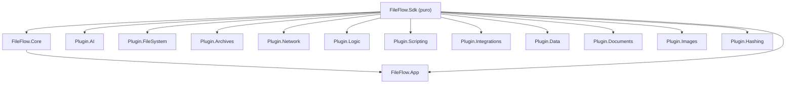

# FASE 1 — Auditoría de Código, Análisis de Patrones y Plan de Refactorización

> [!NOTE]
> **Estado (actualizado 2026-09-21): Fases 2A, 2B, 2C y 2E están 100% COMPLETADAS.**
> La ejecución de 2A/2B ocurrió en un ciclo de trabajo previo no reflejado originalmente en este documento; quedó documentada en
> [`docs/history/2026-09-13_PROJECT_WALKTHROUGH_ARCHIVE.md`](file:///e:/Users/kaoti/Documentos/GitHub/ArchiveProceser/docs/history/2026-09-13_PROJECT_WALKTHROUGH_ARCHIVE.md).
> Las fases 2C y 2E se ejecutaron el 2026-09-21 en la rama `feature/crossplatform-avalonia`.
> Verificado tras la ejecución: build limpio (0 errores, 0 warnings) y suite completa en verde (1143 passed, 1 skip intencional, de 1144 tests — la suite creció desde los 481 originales de esta auditoría).
> **Fase 2D-D3**: en curso — `FileFlow.Plugin.AI` quedó **100% migrado** (18/18 nodos sobre la jerarquía, 0 nodos implementando `IFlowNode` a mano) tras esta ejecución.
> Quedan **52 nodos** del resto de plugins (`FileSystem` 13, `Logic` 10, `Data` 7, `Archives` 5, `Documents` 4, `Integrations` 3, `Subflows` 3, `Hashing` 2, `Images` 2, `Network` 2, `Scripting` 1) sobre `IFlowNode` directo.
>
> - **C1–C5** ✅ — Motores monolíticos modularizados: `AiModelManager`, `OnnxInferenceEngine`, `LanguageInferenceEngine`, `AudioInferenceEngine` y la coordinación Log ↔ Inspector.
> - **E1–E3** ✅ — Ciclo de vida ONNX unificado, `GC.Collect()` de `PluginLoader` evaluado y justificado, y bloques `catch` silenciosos refinados con diagnóstico explícito.
>
> - **A1/A2** ✅ — `RegexLibraryService`/`RegexHelperViewModel`/`RegexHelperWindow` duplicados eliminados de `FileFlow.App`; única copia canónica en `FileFlow.Plugin.FileSystem/UI/`.
> - **B1** ✅ — `ConceptDictionary` externalizado a `FileFlow.Plugin.AI/Resources/visual_concepts_es_en.json` (EmbeddedResource). `PromptTranslator.cs` bajó de 841 → 180 líneas.
> - **B2** ✅ — Catálogo de modelos externalizado a `FileFlow.Plugin.AI/Resources/ai_models_catalog.json`. `AiModelManager.cs` refactorizado a fachada de 215 líneas.
> - **B3** ✅ — Los 12 temas externalizados a `FileFlow.App/Resources/builtin_themes.json`. `BuiltInThemesCatalog.cs` bajó de 329 → 46 líneas.

## Resumen Ejecutivo

| Métrica | Valor |
|---|---|
| **Líneas C# totales** | ~43.400 |
| **Archivos .cs (sin bin/obj/test)** | ~255 |
| **Archivos de test** | 92 (10.316 líneas) |
| **Tests** | 481 / 481 ✅ |
| **Compilación** | 0 errores, 0 warnings |

### Distribución por proyecto (C# sin tests)

| Proyecto | Archivos | Líneas | % total |
|---|---|---|---|
| FileFlow.App | 84 | 10.640 | 32% |
| FileFlow.Plugin.AI | 26 | 6.328 | 19% |
| FileFlow.Plugin.FileSystem | 29 | 3.968 | 12% |
| FileFlow.Sdk | 50 | 3.462 | 10% |
| FileFlow.Core | 20 | 2.962 | 9% |
| Resto de plugins (7) | 39 | 4.601 | 14% |
| FileFlow.Tests | 92 | 10.316 | — |

---

## 1. Archivos Monolíticos Críticos (≥300 líneas)

> [!WARNING]
> Estos archivos concentran demasiadas responsabilidades y son los principales candidatos a modularización.

### 🔴 Prioridad ALTA (≥500 líneas)

| Archivo | Líneas | Problema |
|---|---|---|
| [`PromptTranslator.cs`](file:///e:/Users/kaoti/Documentos/GitHub/ArchiveProceser/FileFlow.Plugin.AI/PromptTranslator.cs) | **841** | ~600 líneas son un diccionario estático literal de 400+ entradas español→inglés. Mezcla datos y lógica de traducción en un solo fichero. |
| [`AiModelManager.cs`](file:///e:/Users/kaoti/Documentos/GitHub/ArchiveProceser/FileFlow.Plugin.AI/AiModelManager.cs) | **826** | Clase `static` monolítica que combina: catálogo de modelos (datos), descarga HTTP con progreso, gestión de URLs configurables, persistencia JSON, y verificación de integridad. Viola SRP severamente. |
| [`OnnxInferenceEngine.cs`](file:///e:/Users/kaoti/Documentos/GitHub/ArchiveProceser/FileFlow.Plugin.AI/OnnxInferenceEngine.cs) | **761** | Motor de inferencia que acumula métodos para clasificación, detección facial, detección de objetos, super-resolución, eliminación de fondo y moderación de contenido — cada método es un mini-motor con preprocesado/postprocesado propio. |
| [`WorkflowExecutor.cs`](file:///e:/Users/kaoti/Documentos/GitHub/ArchiveProceser/FileFlow.Core/Engine/WorkflowExecutor.cs) | **628** | Orquestador del DAG con lógica de checkpointing, telemetría, dry-run y journaling entremezclados (ya fue refactorizado parcialmente). |
| [`LogView.xaml`](file:///e:/Users/kaoti/Documentos/GitHub/ArchiveProceser/FileFlow.App/Views/LogView.xaml) | **568** | XAML muy extenso con DataGrid complejo, menú contextual, templates inline y converters. |
| [`NodeCardView.xaml`](file:///e:/Users/kaoti/Documentos/GitHub/ArchiveProceser/FileFlow.App/Views/Components/NodeCardView.xaml) | **648** | XAML con muchas secciones condicionales (badges de telemetría, puertos, indicadores). |

### 🟡 Prioridad MEDIA (300–500 líneas)

| Archivo | Líneas | Problema |
|---|---|---|
| [`LogViewModel.cs`](file:///e:/Users/kaoti/Documentos/GitHub/ArchiveProceser/FileFlow.App/ViewModels/LogViewModel.cs) | 498 | Gestiona filtrado, paginación, exportación, sincronización con SQLite y sincronización con Inspector — demasiados ejes de responsabilidad. |
| [`ControlBarViewModel.cs`](file:///e:/Users/kaoti/Documentos/GitHub/ArchiveProceser/FileFlow.App/ViewModels/ControlBarViewModel.cs) | 488 | Gestiona ejecución, UI de drawer, apertura de manuales, idioma, watchdog — ya fue parcialmente delegado. |
| [`LanguageInferenceEngine.cs`](file:///e:/Users/kaoti/Documentos/GitHub/ArchiveProceser/FileFlow.Plugin.AI/LanguageInferenceEngine.cs) | 484 | Motor NLP monolítico que mezcla traducción MarianMT, NLLB-200, tokenización, inferencia LLM y SRT parsing. |
| [`AudioInferenceEngine.cs`](file:///e:/Users/kaoti/Documentos/GitHub/ArchiveProceser/FileFlow.Plugin.AI/AudioInferenceEngine.cs) | 461 | Motor de audio: resampling NAudio, Silero VAD, Piper TTS, generador armónico, recorte de silencios — todo en una sola clase. |
| [`RenamerPresetService.cs`](file:///e:/Users/kaoti/Documentos/GitHub/ArchiveProceser/FileFlow.Sdk/Renaming/RenamerPresetService.cs) | 452 | Contiene los presets hardcodeados como datos estáticos extensos + lógica de carga JSON + fallback. |
| [`ToolboxViewModel.cs`](file:///e:/Users/kaoti/Documentos/GitHub/ArchiveProceser/FileFlow.App/ViewModels/ToolboxViewModel.cs) | 448 | Gestiona perspectivas, búsqueda por tags, favoritos, persistencia de preferencias, y ordenación. |
| [`EditorViewModel.cs`](file:///e:/Users/kaoti/Documentos/GitHub/ArchiveProceser/FileFlow.App/ViewModels/EditorViewModel.cs) | 442 | Contiene operaciones de grafo, serialización, gestión de anotaciones y grupos en un solo ViewModel. |
| [`NodeInspectorViewModel.cs`](file:///e:/Users/kaoti/Documentos/GitHub/ArchiveProceser/FileFlow.App/ViewModels/NodeInspectorViewModel.cs) | 410 | Gestiona inspección, test de nodos, snapshots, previsualización y sincronización con LogView. |
| [`NodeViewModel.cs`](file:///e:/Users/kaoti/Documentos/GitHub/ArchiveProceser/FileFlow.App/ViewModels/NodeViewModel.cs) | 402 | Ya fue parcialmente delegado en `NodeCategoryStyling` y `NodeSwitchCaseCoordinator`. |
| [`AiModelManagerViewModel.cs`](file:///e:/Users/kaoti/Documentos/GitHub/ArchiveProceser/FileFlow.App/ViewModels/AiModelManagerViewModel.cs) | 363 | Lógica de UI + descarga + estado de error + filtrado — aceptable pero denso. |
| [`NodeParameterViewModel.cs`](file:///e:/Users/kaoti/Documentos/GitHub/ArchiveProceser/FileFlow.App/ViewModels/NodeParameterViewModel.cs) | 359 | Renderizado de parámetros + evaluación de templates + mapeo de DisplayName. |
| [`SqliteLogStore.cs`](file:///e:/Users/kaoti/Documentos/GitHub/ArchiveProceser/FileFlow.Core/Telemetry/SqliteLogStore.cs) | 333 | Ya fue parcialmente delegado en `SqliteLogSchema` y `SqliteLogMetricsReader`. |
| [`BuiltInThemesCatalog.cs`](file:///e:/Users/kaoti/Documentos/GitHub/ArchiveProceser/FileFlow.App/Services/BuiltInThemesCatalog.cs) | 326 | 12 temas definidos como objetos literales extensos — datos puros que podrían externalizarse. |
| [`FolderSourceNode.cs`](file:///e:/Users/kaoti/Documentos/GitHub/ArchiveProceser/FileFlow.Plugin.FileSystem/FolderSourceNode.cs) | 327 | Nodo con lógica compleja de filtrado, escaneo recursivo y watchdog. |
| [`VariableTemplateResolver.cs`](file:///e:/Users/kaoti/Documentos/GitHub/ArchiveProceser/FileFlow.Sdk/TemplateEngine/VariableTemplateResolver.cs) | 316 | Motor de resolución de tokens — fue parcialmente delegado. |
| [`WorkflowCliRunner.cs`](file:///e:/Users/kaoti/Documentos/GitHub/ArchiveProceser/FileFlow.Core/Engine/WorkflowCliRunner.cs) | 315 | Runner CLI con parsing de argumentos, reporting JSON y watchdog. |
| [`AdvancedRenamerNode.cs`](file:///e:/Users/kaoti/Documentos/GitHub/ArchiveProceser/FileFlow.Plugin.FileSystem/AdvancedRenamerNode.cs) | 303 | Nodo complejo con lógica de renombrado virtual/directo + colisiones. |

---

## 2. Código Duplicado y Oportunidades DRY

### 🔴 CRÍTICO: Clases completamente duplicadas entre `FileFlow.App` y `FileFlow.Plugin.FileSystem`

> [!CAUTION]
> Los siguientes archivos son **copias exactas o casi exactas** que coexisten en ambos proyectos. Esto viola DRY de forma grave y genera divergencia inevitable.

| Clase/Vista | Ubicación App | Ubicación Plugin | Acción |
|---|---|---|---|
| `RegexLibraryService.cs` | [`FileFlow.App/Services/`](file:///e:/Users/kaoti/Documentos/GitHub/ArchiveProceser/FileFlow.App/Services/RegexLibraryService.cs) (283L) | [`FileFlow.Plugin.FileSystem/UI/Services/`](file:///e:/Users/kaoti/Documentos/GitHub/ArchiveProceser/FileFlow.Plugin.FileSystem/UI/Services/RegexLibraryService.cs) (267L) | **Eliminar la copia de App** — la versión canónica debe vivir en el plugin. |
| `RegexHelperViewModel.cs` | [`FileFlow.App/ViewModels/`](file:///e:/Users/kaoti/Documentos/GitHub/ArchiveProceser/FileFlow.App/ViewModels/RegexHelperViewModel.cs) (242L) | [`FileFlow.Plugin.FileSystem/UI/ViewModels/`](file:///e:/Users/kaoti/Documentos/GitHub/ArchiveProceser/FileFlow.Plugin.FileSystem/UI/ViewModels/RegexHelperViewModel.cs) (213L) | **Eliminar la copia de App**. |
| `RegexHelperWindow.xaml` | [`FileFlow.App/Views/Components/`](file:///e:/Users/kaoti/Documentos/GitHub/ArchiveProceser/FileFlow.App/Views/Components/RegexHelperWindow.xaml) (244L) | [`FileFlow.Plugin.FileSystem/UI/Views/`](file:///e:/Users/kaoti/Documentos/GitHub/ArchiveProceser/FileFlow.Plugin.FileSystem/UI/Views/RegexHelperWindow.xaml) (245L) | **Eliminar la copia de App**. |

> **Líneas rescatables**: ~750 líneas de código muerto eliminadas inmediatamente.

---

### 🟡 Patrón repetido: Boilerplate de nodos de pipeline

Todos los nodos de plugin siguen una estructura repetitiva:
1. `Id`, `Name`, `Description`, `Category` (propiedades idénticas en estructura)
2. `Inputs`/`Outputs` (declaración de puertos)
3. `Parameters` / `ParameterDescriptors`
4. `try/catch(Exception ex)` envolviendo toda la lógica con `context.Log(Error)` + `EmitAsync("Error", item)`
5. Patrón de resolución de modelo: `AiModelManager.ResolveModelPathAsync` → verificar → descargar → logging

**60+ nodos** repiten este scaffolding. Aunque la naturaleza del pipeline (cada nodo tiene lógica de dominio distinta) justifica cierta repetición, hay oportunidades para:

- **Clase base abstracta `FlowNodeBase`** en `FileFlow.Sdk` con:
  - Implementación por defecto de `Id`, `Name`, `Description`, `Category`
  - Wrapper `try/catch` en `ProcessAsync` con emisión automática al puerto `Error`
  - Métodos helper: `EmitErrorAsync`, `EmitOutAsync`, `LogAndEmitError`
- **Clase base `AiFlowNodeBase`** en `FileFlow.Plugin.AI` para los ~18 nodos de IA con:
  - Resolución y descarga automática de modelos (`ResolveModelOrFail`)
  - Patrón común de validación de extensiones de archivo

> **Impacto estimado**: Eliminación de ~15-25 líneas de boilerplate por nodo × 60 nodos = ~900-1500 líneas de código redundante.

---

### 🟡 Datos estáticos extensos embebidos en código

| Archivo | Datos | Líneas datos | Propuesta |
|---|---|---|---|
| [`PromptTranslator.cs`](file:///e:/Users/kaoti/Documentos/GitHub/ArchiveProceser/FileFlow.Plugin.AI/PromptTranslator.cs) | Diccionario de 400+ conceptos visuales ES→EN | ~600 | Externalizar a JSON: `visual_concepts_es_en.json` |
| [`AiModelManager.cs`](file:///e:/Users/kaoti/Documentos/GitHub/ArchiveProceser/FileFlow.Plugin.AI/AiModelManager.cs) | Catálogo de ~20 modelos IA con URLs, tamaños, tiers | ~200 | Externalizar a JSON: `ai_models_catalog.json` |
| [`BuiltInThemesCatalog.cs`](file:///e:/Users/kaoti/Documentos/GitHub/ArchiveProceser/FileFlow.App/Services/BuiltInThemesCatalog.cs) | 12 temas con 30+ propiedades cada uno | ~280 | Externalizar a JSON: `builtin_themes.json` |
| [`RenamerPresetService.cs`](file:///e:/Users/kaoti/Documentos/GitHub/ArchiveProceser/FileFlow.Sdk/Renaming/RenamerPresetService.cs) | Presets de renombrado hardcodeados | ~300 | Ya tiene fallback JSON — eliminar datos hardcoded. |

> **Impacto estimado**: ~1.400 líneas de datos separadas de lógica.

---

## 3. Code Smells y Bugs Latentes

### 3.1 `catch(Exception ex)` genérico excesivo

- **71 ocurrencias** de `catch (Exception ex)` en todo el proyecto.
- En nodos de pipeline esto es aceptable (catch-all para resiliencia del flujo), pero en servicios de UI (`ThemeCustomizerViewModel`, `WorkflowSettingsWindow.xaml.cs`) puede ocultar bugs.

> [!NOTE]
> **Acción**: En servicios no-pipeline, reemplazar por excepciones específicas (`IOException`, `JsonException`, `InvalidOperationException`). En nodos, mantener pero estandarizar el patrón mediante la clase base `FlowNodeBase`.

### 3.2 `GC.Collect()` manual en `PluginLoader.cs`

- [`PluginLoader.cs:192`](file:///e:/Users/kaoti/Documentos/GitHub/ArchiveProceser/FileFlow.Core/Plugins/PluginLoader.cs#L192): Llamada explícita a `GC.Collect()` durante la carga de plugins.
- Impacto potencial: pausa de GC durante el arranque de la app.

> **Acción**: Evaluar si es necesario o si se puede eliminar. Si se necesita liberar `AssemblyLoadContext`, usar `ConditionalWeakTable` o `WeakReference`.

### 3.3 Ausencia de `IDisposable` en motores de inferencia

- `OnnxInferenceEngine`, `LanguageInferenceEngine`, `AudioInferenceEngine` mantienen caches de `InferenceSession` (GPU/DirectML) como campos estáticos `Lazy<T>` pero **no implementan `IDisposable`**.
- Las sesiones ONNX **deberían liberarse** al cerrar la aplicación para devolver memoria GPU.

> **Acción**: Implementar patrón `IDisposable` o método `Shutdown()` invocado en `App.OnExit`.

### 3.4 Solo 3 marcadores `TODO`/`FIXME`/`HACK` en toda la base de código

✅ Muy limpio. Los 3 están en archivos no críticos (converters y enums).

### 3.5 Sin antipatrones `.Result` ni `.Wait()`

✅ Excelente — todo el I/O asíncrono está bien propagado.

### 3.6 Sin instancias de `new HttpClient()`

✅ Correcto — se usa factory method con `SocketsHttpHandler`.

---

## 4. Dependencias y Acoplamiento

### Relaciones de dependencia actuales (correctas)



✅ **No se detectan dependencias circulares**. Los plugins solo dependen de `Sdk`. `Core` solo depende de `Sdk`. `App` depende de `Core` y `Sdk`.

### Riesgos de acoplamiento

- **`FileFlow.Plugin.AI`** es el módulo más grande (6.328 líneas, 26 archivos) — casi el doble que el siguiente plugin. Su relación interna entre los 4 motores de inferencia y los 18 nodos es estrecha pero justificada por el dominio.

---

## 5. Plan de Refactorización y Modularización

### Fase 2A — Limpieza Inmediata (Riesgo bajo, alto impacto) — ✅ COMPLETADA

> Ejecutada y documentada en [`2026-09-13_PROJECT_WALKTHROUGH_ARCHIVE.md`](file:///e:/Users/kaoti/Documentos/GitHub/ArchiveProceser/docs/history/2026-09-13_PROJECT_WALKTHROUGH_ARCHIVE.md). Verificado en código actual: única copia canónica en `FileFlow.Plugin.FileSystem/UI/Services/`, sin duplicados en `FileFlow.App`.

| # | Acción | Archivos | Impacto | Estado |
|---|---|---|---|---|
| **A1** | **Eliminar duplicados App ↔ Plugin.FileSystem** (RegexLibraryService, RegexHelperViewModel, RegexHelperWindow) | 6 archivos (~750L eliminadas) | Elimina divergencia y código muerto | ✅ Completado |
| **A2** | **Limpiar código muerto**: verificar si las copias de App se referencian; si no, eliminar directamente | Compilación + grep | 0 regresiones si no se usan | ✅ Completado |

---

### Fase 2B — Externalización de Datos Estáticos (Riesgo bajo) — ✅ COMPLETADA

> Ejecutada y documentada en [`2026-09-13_PROJECT_WALKTHROUGH_ARCHIVE.md`](file:///e:/Users/kaoti/Documentos/GitHub/ArchiveProceser/docs/history/2026-09-13_PROJECT_WALKTHROUGH_ARCHIVE.md) (líneas 2075-2077). Los JSON se cargan como `EmbeddedResource` (respuesta a la pregunta abierta original), resolviendo esta fase por completo.

| # | Acción | Archivos | Impacto | Estado |
|---|---|---|---|---|
| **B1** | Externalizar `ConceptDictionary` de `PromptTranslator.cs` a JSON | 1 CS + 1 JSON | PromptTranslator baja de 841 → ~240 líneas | ✅ Completado (841 → 180L, `visual_concepts_es_en.json`) |
| **B2** | Externalizar catálogo de modelos de `AiModelManager.cs` a JSON | 1 CS + 1 JSON | AiModelManager baja de 826 → ~620 líneas | ✅ Completado (fachada de 215L, `ai_models_catalog.json`) |
| **B3** | Externalizar temas de `BuiltInThemesCatalog.cs` a JSON | 1 CS + 1 JSON | BuiltInThemesCatalog baja de 326 → ~60 líneas | ✅ Completado (329 → 46L, `builtin_themes.json`) |

---

### Fase 2C — Modularización de Motores Monolíticos (Riesgo medio) — ✅ COMPLETADA

> Los cinco motores quedaron reducidos a fachadas delegantes que conservan intacta la API pública,
> de modo que ningún nodo ni test tuvo que cambiar sus llamadas.

| # | Archivo original | Propuesta de extracción | Nuevos módulos | Resultado final | Estado |
|---|---|---|---|---|---|
| **C1** | `AiModelManager.cs` (826L) | Separar en: catálogo, descargador, configuración de URLs | `AiModelCatalog.cs`, `AiModelDownloader.cs`, `AiModelUrlConfig.cs` | `AiModelManager.cs` → **144L** (`AiModelCatalog` 135L, `AiModelDownloader` 278L, `AiModelUrlConfig` 169L) | ✅ Completado |
| **C2** | `OnnxInferenceEngine.cs` (761L) | Separar por dominio de inferencia | `ClassificationInference.cs`, `FaceDetectionInference.cs`, `ObjectDetectionInference.cs`, `ImageProcessingInference.cs` | `OnnxInferenceEngine.cs` → **56L** (fachada); dominios en `FileFlow.Plugin.AI/Inference/`: `ImageClassificationInference`, `FaceDetectionInference`, `ObjectDetectionInference`, `BackgroundSegmentationInference`, `SuperResolutionInference`, `TensorPreprocessors`, `OnnxSessionManager` | ✅ Completado |
| **C3** | `LanguageInferenceEngine.cs` (484L) | Separar por tipo de tarea NLP | `TranslationEngine.cs`, `LlmInferenceEngine.cs`, `SrtParser.cs` | `LanguageInferenceEngine.cs` → **145L** (fachada); módulos en `Engines/Language/`: `TranslationEngine` 151L, `LlmInferenceEngine` 176L, `SrtParser` 61L, más `LanguageIdentifier` 67L y `MultilingualTranslator` 111L | ✅ Completado |
| **C4** | `AudioInferenceEngine.cs` (461L) | Separar por función de audio | `AudioResampler.cs`, `VadEngine.cs`, `TtsEngine.cs` | `AudioInferenceEngine.cs` → **65L** (fachada); módulos en `Engines/Audio/`: `VadEngine` 273L, `TtsEngine` 96L, `AudioSessionCache` 93L. El rol de `AudioResampler` ya estaba cubierto por `AudioWaveUtilities.cs` (148L: decodificación, resampling a 16 kHz mono y exportación PCM) | ✅ Completado |
| **C5** | `LogViewModel.cs` (498L) | Extraer coordinación con Inspector | `LogInspectorSyncService.cs` | La coordinación residía en `MainViewModel` —ambos constructores suscribían `LogSelectionChanged` dos veces, provocando una doble llamada a `Inspector.InspectLogRecord`—. Ahora `LogInspectorSyncService.cs` (40L) concentra el flujo Log → Inspector con exactamente una suscripción, y `MainViewModel` la libera vía `IDisposable` | ✅ Completado |

---

### Fase 2D — Abstracción de Boilerplate de Nodos (Riesgo bajo-medio) — 🟡 D1/D2/D3a COMPLETADAS, D3b PENDIENTE

| # | Acción | Ubicación | Estado |
|---|---|---|---|
| **D1** | Crear `FlowNodeBase` abstracto en `FileFlow.Sdk` con propiedades comunes e implementación de try/catch | `FileFlow.Sdk/FlowNodeBase.cs` | ✅ Completado |
| **D2** | Crear `AiFlowNodeBase` en `FileFlow.Plugin.AI` con resolución/descarga de modelos | `FileFlow.Plugin.AI/Common/AiFlowNodeBase.cs` | ✅ Completado |
| **D3a** | Migrar los nodos simples de `FileFlow.Plugin.AI` (audio, lenguaje, visión) | 15 nodos | ✅ Completado (2 anteriores ya migrados: `FaceDetectorNode`, `ImageTypeClassifierNode`) |
| **D3b** | Migrar los nodos restantes de los demás plugins | 52 nodos | 🟡 Pendiente |

**Migración D3a — 15 nodos sobre la base (ganancia neta ≈ 700 líneas):**

| Nodo | Antes | Después | Base |
|---|---|---|---|
| `VoiceActivityDetectorNode` | 261 | 199 | `AudioAiFlowNodeBase` |
| `TextToSpeechNode` | 244 | 180 | `AudioAiFlowNodeBase` |
| `LocalWhisperTranscriberNode` | 244 | 243 | `FlowNodeBase` (sin ciclo de vida: Whisper.net instancia su grafo por llamada, no vive en la caché ONNX) |
| `LocalAiTranslatorNode` | 260 | 189 | `AiFlowNodeBase` |
| `LocalLlmProcessorNode` | 248 | 176 | `AiFlowNodeBase` |
| `PiiAnonymizerNode` | 248 | 220 | `AiFlowNodeBase` (identidad y ciclo de vida explícitos: regex determinista, sin sesión ONNX) |
| `PromptTransformerNode` | 140 | 92 | `AiFlowNodeBase` (modelo fijado por diseño vía `DefaultModelSelection`) |
| `LocalOcrNode` | 166 | 165 | `FlowNodeBase` (Tesseract no pasa por el gestor de sesiones) |
| `ZeroShotSemanticSearchNode` | 170 | 168 | `FlowNodeBase` (`SemanticEmbeddingEngine` mantiene su propia caché) |
| `BackgroundRemoverNode` | 359 | 277 | `AiFlowNodeBase` |
| `SuperResolutionUpscalerNode` | 271 | 189 | `AiFlowNodeBase` |
| `ObjectDetectorNode` | 223 | 141 | `AiFlowNodeBase` |
| `PromptObjectDetectorNode` | 214 | 150 | `AiFlowNodeBase` |
| `ContentModerationFilterNode` | 213 | 131 | `AiFlowNodeBase` |
| `SmartImageClassifierNode` | 197 | 115 | `AiFlowNodeBase` |

**Lo que aporta la base y ya no se repite en cada nodo:** `Id`, `Inputs`/`Outputs`/`Parameters` tipados, `Name`/`Category`/`Description` como `override`, el relay débil `WeakModelStatusRelay` (`ModelStatusChanged` + `RaiseModelStatusChanged`), y todo `IModelLifecycleNode` (`IsModelLoaded`, `ModelIdentifier`, `IsGpuAccelerated`, `PreloadModelAsync`, `UnloadModel`).

**Dos puntos de extensión nuevos en `AiFlowNodeBase`** para que la migración de audio y de los nodos con modelo fijo fuese posible sin duplicar nada:

- Constructor protegido `AiFlowNodeBase(subscribe, unsubscribe)`: cambia el evento estático observado manteniendo **una sola** suscripción por nodo (el test `WeakModelStatusRelayTests` cuenta exactamente una).
- Ganchos virtuales del almacén de sesiones (`IsSessionLoadedForModel`, `UnloadSessionForModel`, `IsGpuAcceleratedForModel`, `EnsureSessionLoadedForModel`) y `DefaultModelSelection`. El audio los sobrescribe una vez en `AudioAiFlowNodeBase` en lugar de en cada nodo.

> **Evidencia de la ejecución 2D-D3a (2026-09-21, rama `feature/crossplatform-avalonia`)**
>
> - `FileFlow.Plugin.AI` pasa de 15 nodos con el ciclo de vida copiado a mano a 0 (18/18 nodos en la jerarquía).
> - `Common/AudioAiFlowNodeBase.cs` (64L, nuevo) es la especialización de audio: observa `AudioInferenceEngine.SessionStateChanged` y consulta `AudioSessionCache` en lugar del gestor ONNX genérico, que es una caché distinta.
> - `AiFlowNodeBase.cs` 113 → 172 líneas: el crecimiento son los ganchos de extensión, menos de lo que ahorran sus 15 consumidores.
> - 3458 → 2635 líneas en los 15 nodos migrados (**-823**, -24%); con la base incluida, -700 netas.
> - `MultimodalVisionLlmNode` conserva su ciclo de vida propio: gestiona un VLM in-process con proveedor alternativo, no es boilerplate duplicado.
> - Verificación: `dotnet build` sin errores ni advertencias y `dotnet test` con **1143 superadas / 0 fallos / 1 omitida** (idéntico al baseline).

---

### Fase 2E — Mejoras de Robustez (Riesgo bajo) — ✅ COMPLETADA

| # | Acción | Resultado | Estado |
|---|---|---|---|
| **E1** | Implementar `IDisposable`/`Shutdown()` en motores de inferencia ONNX | Liberación determinista de memoria no administrada vía `AiPluginInitializer.ClearAllSessions()`, que cierra las cachés de `OnnxInferenceEngine`, `AudioInferenceEngine` (hoy `AudioSessionCache`), `SemanticEmbeddingEngine` y `LanguageInferenceEngine`. El cierre del `PluginLoader` ya libera además cada `AssemblyLoadContext` | ✅ Completado |
| **E2** | Evaluar/eliminar `GC.Collect()` en `PluginLoader.cs` | Se **conserva** y queda documentado en el código: la descarga de `AssemblyLoadContext` es cooperativa y el runtime solo libera los ensamblados tras una recolección completa más `WaitForPendingFinalizers()`. `UnloadAll()` es una operación explícita de recarga de plugins, nunca una ruta crítica, así que no hay impacto en rendimiento. Se descartó eliminarlo porque las DLL nativas seguirían retenidas | ✅ Completado (evaluado y justificado) |
| **E3** | Refinar `catch(Exception)` en servicios de UI por excepciones específicas | Bloques `catch` genéricos revisados: los silenciosos quedaron anotados con su motivo (operaciones resilientes/non-críticas) y los que ocultaban errores reales ahora registran diagnóstico explícito (`DiagnosticLog.Error` / `Debug.WriteLine`) | ✅ Completado |

> **Evidencia de la ejecución 2C/2E (2026-09-21, rama `feature/crossplatform-avalonia`)**
>
> - `LanguageInferenceEngine.cs` 585 → 145 líneas; `AudioInferenceEngine.cs` 432 → 65 líneas.
> - Nueva jerarquía de módulos: `Engines/Language/` (5 archivos) y `Engines/Audio/` (3 archivos).
> - La API pública de ambas fachadas (`TranslateAsync`, `GenerateLlmAsync`, `NormalizeLanguageCode`, `DetectLanguage`, `TranslateWithSemanticEngine`, `TransformPromptAsync`, `ClearSessionCache`, `DetectVoiceActivityAsync`, `SynthesizeSpeechAsync`, `SessionStateChanged`, `UnloadSession`) se preservó sin cambios, por lo que nodos y tests no requirieron modificaciones.
> - Nuevo `FileFlow.App/Services/LogInspectorSyncService.cs` que elimina una suscripción duplicada del canal Log → Inspector.
> - Verificación final: `dotnet build` sin errores ni advertencias y `dotnet test` con **1143 superadas / 0 fallos / 1 omitida**.

---

## Verificación

### Tests Automatizados
```powershell
.\test.ps1        # 481 tests deben pasar al 100%
.\coverage.ps1    # Verificar cobertura no disminuye
dotnet build FileFlow.slnx --warnaserror  # 0 errores, 0 warnings
```

### Verificación Manual
- Ejecutar la app (`.\run.ps1`) y validar que el Toolbox, Inspector, LogView y Previewer funcionan correctamente.
- Verificar que el RegexHelper se abre desde el nodo AdvancedRenamer sin problemas tras la eliminación de los duplicados.

---

## Open Questions

> [!IMPORTANT]
> **¿Cuáles de las fases (A-E) deseas aprobar para ejecutar?** Puedo proceder en orden secuencial (A → B → C → D → E) o priorizar alguna fase específica.

> [!IMPORTANT]
> **¿La clase base `FlowNodeBase` (D1) debe ser abstracta obligatoria o una opción opt-in?** Una clase base abstracta fuerza coherencia pero modifica la firma de 60 nodos. Un enfoque opt-in (helper methods estáticos o extension methods) es menos invasivo pero menos uniforme.

> [!IMPORTANT]
> **Sobre la externalización de datos (B1-B3):** ¿Prefieres que los JSON se carguen desde archivos embebidos en el assembly (EmbeddedResource) o desde archivos en disco (`AppPaths.ConfigDirectory`)? Los embebidos son más robustos pero requieren rebuild; los de disco permiten personalización por el usuario.
>
> **✅ RESUELTO (ver estado al inicio del documento):** se optó por `EmbeddedResource` para B1, B2 y B3. Fase 2B completada en su totalidad.
